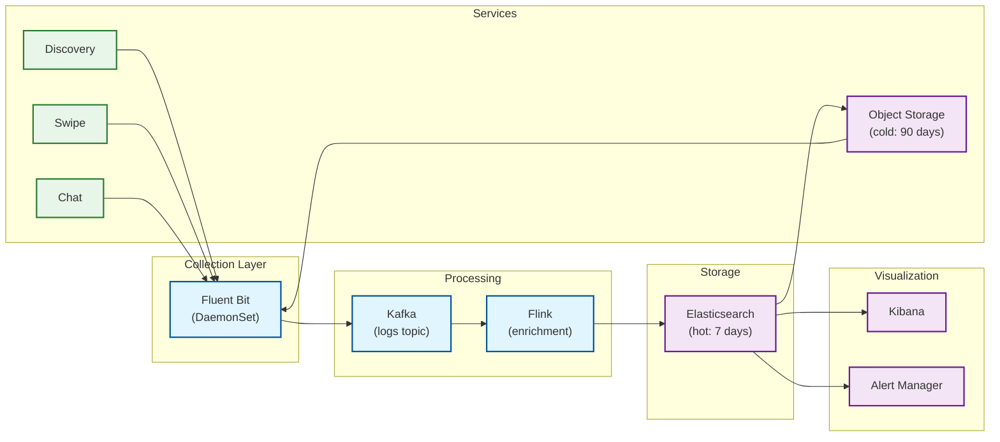

# Observability

[← Back to Index](./00-index.md)

---

## Metrics Framework

### USE Method (Utilization, Saturation, Errors)

| Resource | Utilization | Saturation | Errors |
|----------|-------------|------------|--------|
| **API Gateway** | CPU %, Memory % | Request queue depth | 5xx rate, 4xx rate |
| **MongoDB** | Connection pool %, Disk I/O % | Lock queue length | Write errors, timeout rate |
| **Elasticsearch** | Heap %, CPU % | Pending tasks, search queue | Search errors, indexing failures |
| **Redis** | Memory %, CPU % | Connected clients vs max | Evictions, connection errors |
| **Kafka** | CPU %, Disk % | Consumer lag | Under-replicated partitions |

### RED Method (Rate, Errors, Duration)

| Service | Rate | Errors | Duration (p50/p95/p99) |
|---------|------|--------|------------------------|
| **Discovery** | Recommendations/sec | Error rate % | 30ms / 80ms / 150ms |
| **Swipe** | Swipes/sec | Error rate % | 20ms / 50ms / 100ms |
| **Match** | Matches/sec | Detection failures | 500ms / 1.5s / 3s (e2e) |
| **Chat** | Messages/sec | Delivery failures | 100ms / 300ms / 800ms |
| **Auth** | Logins/sec | Auth failures | 200ms / 500ms / 1s |

### Business Metrics

```
┌─────────────────────────────────────────────────────────────────────────┐
│                     KEY BUSINESS METRICS                                 │
├─────────────────────────────────────────────────────────────────────────┤
│                                                                         │
│  Engagement:                                                            │
│  • DAU / MAU ratio                                                     │
│  • Sessions per user per day                                           │
│  • Swipes per session                                                  │
│  • Time in app per session                                             │
│  • Swipe-through rate (swipes / profiles shown)                        │
│                                                                         │
│  Matching:                                                              │
│  • Right swipe rate (likes / total swipes)                             │
│  • Match rate (matches / likes)                                        │
│  • Mutual match rate (matches / (like_a + like_b))                     │
│  • Time to first match (new users)                                     │
│                                                                         │
│  Messaging:                                                             │
│  • Conversation start rate (first message / matches)                   │
│  • Reply rate (replies / first messages)                               │
│  • Messages per conversation                                           │
│  • Conversation duration                                               │
│                                                                         │
│  Monetization:                                                          │
│  • Conversion rate (free → paid)                                       │
│  • ARPU (Average Revenue Per User)                                     │
│  • Subscription churn rate                                             │
│  • Feature usage by tier                                               │
│                                                                         │
│  Quality:                                                               │
│  • Report rate (reports / users)                                       │
│  • Block rate                                                          │
│  • Unmatch rate                                                        │
│  • Fake profile detection rate                                         │
│                                                                         │
└─────────────────────────────────────────────────────────────────────────┘
```

### Infrastructure Metrics Dashboard

```
┌─────────────────────────────────────────────────────────────────────────┐
│                     SYSTEM HEALTH DASHBOARD                              │
├─────────────────────────────────────────────────────────────────────────┤
│                                                                         │
│  ┌─────────────────────────────────────────────────────────────────┐   │
│  │ TRAFFIC                                            [Live]        │   │
│  │ ───────────────────────────────────────────────────────────────  │   │
│  │ Requests/sec:  ████████████████████░░░░░░░  45,230 (peak: 55K)  │   │
│  │ Active Users:  ████████████░░░░░░░░░░░░░░░░  2.3M concurrent    │   │
│  │ WebSockets:    ███████████████░░░░░░░░░░░░░  1.8M connections   │   │
│  └─────────────────────────────────────────────────────────────────┘   │
│                                                                         │
│  ┌─────────────────────────────────────────────────────────────────┐   │
│  │ LATENCY (p99)                                      [5 min]       │   │
│  │ ───────────────────────────────────────────────────────────────  │   │
│  │ Discovery:     ██████░░░░  85ms   [SLO: 100ms ✓]                │   │
│  │ Swipe:         ████░░░░░░  42ms   [SLO: 100ms ✓]                │   │
│  │ Match:         ████████░░  1.8s   [SLO: 2s ✓]                   │   │
│  │ Chat:          ██████░░░░  340ms  [SLO: 500ms ✓]                │   │
│  └─────────────────────────────────────────────────────────────────┘   │
│                                                                         │
│  ┌─────────────────────────────────────────────────────────────────┐   │
│  │ ERROR RATES                                        [1 hour]      │   │
│  │ ───────────────────────────────────────────────────────────────  │   │
│  │ 5xx Errors:    ░░░░░░░░░░  0.02%  [SLO: <0.1% ✓]                │   │
│  │ 4xx Errors:    ██░░░░░░░░  1.2%   [Expected rate]               │   │
│  │ Match Failures:░░░░░░░░░░  0.001% [SLO: 0% target]              │   │
│  └─────────────────────────────────────────────────────────────────┘   │
│                                                                         │
│  ┌─────────────────────────────────────────────────────────────────┐   │
│  │ INFRASTRUCTURE                                     [Current]     │   │
│  │ ───────────────────────────────────────────────────────────────  │   │
│  │ MongoDB:       Primary ✓  Secondaries ✓  Lag: 50ms              │   │
│  │ Elasticsearch: 50/50 shards healthy  Query rate: 12K/s          │   │
│  │ Redis:         Memory: 72%  Connections: 45K  Evictions: 0      │   │
│  │ Kafka:         Consumer lag: 2,340  Partitions: 100/100 healthy │   │
│  └─────────────────────────────────────────────────────────────────┘   │
│                                                                         │
└─────────────────────────────────────────────────────────────────────────┘
```

---

## Logging

### Structured Logging Format

```json
{
  "timestamp": "2024-06-01T15:30:45.123Z",
  "level": "INFO",
  "service": "discovery-service",
  "instance": "discovery-7b4f8d9c-1",
  "trace_id": "abc123def456",
  "span_id": "789ghi",
  "user_id": "user-uuid-hashed",
  "request_id": "req-12345",

  "event": "recommendation_served",
  "message": "Successfully served 50 recommendations",

  "context": {
    "geoshard_ids": ["us-west-sf", "us-west-oak"],
    "candidate_count": 2340,
    "filtered_count": 50,
    "latency_ms": 67,
    "cache_hit": false
  },

  "metrics": {
    "duration_ms": 67,
    "es_query_ms": 45,
    "ranking_ms": 18
  }
}
```

### Log Levels Strategy

| Level | Usage | Examples |
|-------|-------|----------|
| **ERROR** | Failures requiring attention | DB connection failed, match not created, payment failed |
| **WARN** | Degraded but functioning | High latency, retry succeeded, rate limit approached |
| **INFO** | Normal operations | Request completed, user logged in, match created |
| **DEBUG** | Troubleshooting details | Query parameters, intermediate results |
| **TRACE** | Very detailed debugging | Full request/response, algorithm steps |

### What to Log

```
┌─────────────────────────────────────────────────────────────────────────┐
│                     LOGGING GUIDELINES                                   │
├─────────────────────────────────────────────────────────────────────────┤
│                                                                         │
│  ALWAYS LOG:                                                            │
│  ✓ Request start/end with duration                                     │
│  ✓ Authentication events (success/failure)                             │
│  ✓ Database operations with duration                                   │
│  ✓ External API calls with duration and status                         │
│  ✓ Error conditions with stack traces                                  │
│  ✓ Business events (match created, message sent)                       │
│  ✓ Circuit breaker state changes                                       │
│                                                                         │
│  NEVER LOG:                                                             │
│  ✗ Passwords or auth tokens                                            │
│  ✗ Full phone numbers (mask: +1****1234)                               │
│  ✗ Email addresses in plain text                                       │
│  ✗ Precise location coordinates                                        │
│  ✗ Message content (privacy)                                           │
│  ✗ Health check endpoints (too noisy)                                  │
│                                                                         │
│  SENSITIVE DATA HANDLING:                                               │
│  • User IDs: Use hashed/pseudonymized version in logs                  │
│  • Location: Log city/geoshard, not coordinates                        │
│  • Profiles: Log IDs only, not content                                 │
│                                                                         │
└─────────────────────────────────────────────────────────────────────────┘
```

### Log Aggregation Architecture



---

## Distributed Tracing

### Trace Propagation

```
┌─────────────────────────────────────────────────────────────────────────┐
│                     TRACE CONTEXT PROPAGATION                            │
├─────────────────────────────────────────────────────────────────────────┤
│                                                                         │
│  Request Flow with Trace Context:                                       │
│                                                                         │
│  Client                                                                 │
│    │                                                                    │
│    │  X-Request-Id: req-12345                                          │
│    ▼                                                                    │
│  API Gateway                                                            │
│    │  Generates: trace_id=abc123, span_id=span1                        │
│    │                                                                    │
│    │  Headers: traceparent: 00-abc123-span1-01                         │
│    ▼                                                                    │
│  Discovery Service                                                      │
│    │  span_id=span2, parent_span_id=span1                              │
│    │                                                                    │
│    ├────────────▶ Elasticsearch (span3)                                │
│    │              └─ db.statement: "geo_distance query..."             │
│    │                                                                    │
│    └────────────▶ Recommendation Engine (span4)                        │
│                   │                                                     │
│                   └────────▶ Redis (span5)                             │
│                              └─ cache.hit: false                       │
│                                                                         │
│  Trace Visualization:                                                   │
│                                                                         │
│  [Gateway 10ms]─────────────────────────────────────────────────────   │
│      └─[Discovery 67ms]────────────────────────────────────────        │
│            ├─[Elasticsearch 45ms]───────────────                       │
│            └─[Recommendation 18ms]──────                               │
│                  └─[Redis 2ms]──                                       │
│                                                                         │
└─────────────────────────────────────────────────────────────────────────┘
```

### Key Spans to Instrument

| Service | Span Name | Attributes |
|---------|-----------|------------|
| **API Gateway** | `http.request` | method, path, status, user_id |
| **Discovery** | `discovery.get_recommendations` | geoshard_count, candidate_count |
| **Discovery** | `elasticsearch.search` | query_type, shard_id, hit_count |
| **Discovery** | `ml.rank_candidates` | model_version, candidate_count |
| **Swipe** | `swipe.record` | action, target_user_id |
| **Swipe** | `kafka.produce` | topic, partition |
| **Match Worker** | `match.detect` | swiper_id, swiped_id, matched |
| **Match Worker** | `redis.get` | key_pattern, hit |
| **Chat** | `websocket.send` | conversation_id, message_type |
| **Chat** | `mongodb.insert` | collection, document_size |

### Tracing Configuration

```yaml
# OpenTelemetry Configuration
receivers:
  otlp:
    protocols:
      grpc:
        endpoint: 0.0.0.0:4317
      http:
        endpoint: 0.0.0.0:4318

processors:
  batch:
    timeout: 1s
    send_batch_size: 1000

  # Sample 10% of traces, but keep all error traces
  probabilistic_sampler:
    sampling_percentage: 10

  tail_sampling:
    decision_wait: 10s
    policies:
      - name: error-policy
        type: status_code
        status_code: {status_codes: [ERROR]}
      - name: latency-policy
        type: latency
        latency: {threshold_ms: 500}

exporters:
  jaeger:
    endpoint: jaeger-collector:14250

  # Also send to analytics
  clickhouse:
    endpoint: tcp://clickhouse:9000
    database: traces

service:
  pipelines:
    traces:
      receivers: [otlp]
      processors: [batch, tail_sampling]
      exporters: [jaeger, clickhouse]
```

---

## Alerting

### Critical Alerts (Page-Worthy)

| Alert | Condition | Severity | Response |
|-------|-----------|----------|----------|
| **Match Detection Down** | match_rate = 0 for 5 min | P1 | Immediate page |
| **API Gateway Unavailable** | 5xx rate > 50% for 2 min | P1 | Immediate page |
| **Database Primary Down** | MongoDB primary not responding | P1 | Auto-failover, verify |
| **High Error Rate** | 5xx rate > 5% for 5 min | P1 | Investigate immediately |
| **Kafka Consumer Lag Critical** | Lag > 100K messages for 5 min | P2 | Scale consumers |
| **Redis Memory Critical** | Memory > 90% | P2 | Scale or eviction review |

### Warning Alerts (Non-Page)

| Alert | Condition | Severity | Response |
|-------|-----------|----------|----------|
| **Elevated Latency** | p99 > 2x normal for 10 min | P3 | Investigate during hours |
| **Disk Space Low** | < 20% free | P3 | Plan expansion |
| **Certificate Expiring** | < 14 days to expiry | P3 | Rotate certificate |
| **Unusual Traffic Pattern** | Request rate deviation > 3σ | P4 | Review for abuse |
| **High Cache Eviction** | Evictions > 1000/min | P4 | Review cache sizing |

### Alert Routing

```yaml
# Alert Manager Configuration
route:
  group_by: ['alertname', 'service']
  group_wait: 30s
  group_interval: 5m
  repeat_interval: 4h
  receiver: 'default'

  routes:
    - match:
        severity: P1
      receiver: 'pagerduty-critical'
      continue: true

    - match:
        severity: P2
      receiver: 'pagerduty-high'
      group_wait: 2m

    - match:
        severity: P3
      receiver: 'slack-engineering'
      group_wait: 10m

    - match:
        severity: P4
      receiver: 'slack-alerts'
      group_wait: 30m

receivers:
  - name: 'pagerduty-critical'
    pagerduty_configs:
      - service_key: ${PD_CRITICAL_KEY}
        severity: critical

  - name: 'pagerduty-high'
    pagerduty_configs:
      - service_key: ${PD_HIGH_KEY}
        severity: error

  - name: 'slack-engineering'
    slack_configs:
      - channel: '#eng-alerts'
        send_resolved: true

  - name: 'slack-alerts'
    slack_configs:
      - channel: '#alerts-low-priority'
```

### Runbook References

```
┌─────────────────────────────────────────────────────────────────────────┐
│                     RUNBOOK: HIGH MATCH DETECTION LATENCY                │
├─────────────────────────────────────────────────────────────────────────┤
│                                                                         │
│  ALERT: match_detection_latency_p99 > 5s for 5 minutes                 │
│                                                                         │
│  IMPACT: Users experience delayed match notifications                   │
│                                                                         │
│  INVESTIGATION:                                                         │
│  1. Check Kafka consumer lag:                                          │
│     kafka-consumer-groups --describe --group match-workers             │
│     If lag > 10K: Scale consumers (see step 4)                         │
│                                                                         │
│  2. Check Redis latency:                                               │
│     redis-cli --latency-history                                        │
│     If > 10ms: Check Redis memory, connections                         │
│                                                                         │
│  3. Check MongoDB performance:                                         │
│     db.currentOp() - look for slow operations                          │
│     If slow writes: Check lock contention, disk I/O                    │
│                                                                         │
│  4. Scale match workers:                                               │
│     kubectl scale deployment match-workers --replicas=40               │
│                                                                         │
│  5. If Redis is bottleneck:                                            │
│     Check cluster health: redis-cli cluster info                       │
│     Consider adding nodes if memory > 80%                              │
│                                                                         │
│  ESCALATION:                                                            │
│  If unresolved after 15 min: Page database on-call                     │
│  If unresolved after 30 min: Page engineering manager                  │
│                                                                         │
│  POST-INCIDENT:                                                         │
│  - Document root cause                                                 │
│  - Update alert thresholds if needed                                   │
│  - Consider auto-scaling improvements                                  │
│                                                                         │
└─────────────────────────────────────────────────────────────────────────┘
```

---

## Health Checks

### Service Health Endpoints

```
GET /health/live   → Is the process running?
GET /health/ready  → Is the service ready to accept traffic?

// Liveness Check (simple, fast)
{
  "status": "UP",
  "timestamp": "2024-06-01T15:30:00Z"
}

// Readiness Check (checks dependencies)
{
  "status": "UP",
  "checks": {
    "mongodb": {
      "status": "UP",
      "latency_ms": 5
    },
    "redis": {
      "status": "UP",
      "latency_ms": 1
    },
    "elasticsearch": {
      "status": "UP",
      "latency_ms": 12
    },
    "kafka": {
      "status": "UP",
      "connected": true
    }
  },
  "timestamp": "2024-06-01T15:30:00Z"
}
```

### Dependency Health Matrix

| Service | MongoDB | Redis | Elasticsearch | Kafka |
|---------|---------|-------|---------------|-------|
| Discovery | Read | Read | Read (critical) | - |
| Swipe | Write | Read/Write | - | Produce |
| Match | Write | Read/Write | - | Consume/Produce |
| Chat | Write | Read/Write | - | - |
| Profile | Read/Write | Read | Write | - |

---

*Next: [Interview Guide →](./08-interview-guide.md)*
