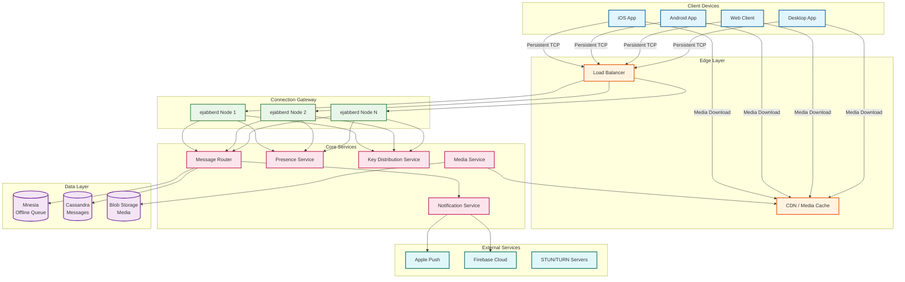

# WhatsApp System Design

## Overview

WhatsApp is a global messaging platform serving over **2 billion users** with a relentless focus on **simplicity, reliability, and privacy**. Built on Erlang/BEAM for exceptional concurrency, WhatsApp pioneered end-to-end encryption at massive scale using the Signal Protocol, ensuring that even WhatsApp's servers cannot read message content.

**Key Characteristics:**
- **Write-Heavy**: 140 billion messages/day with 1:1 send ratio
- **Always-On E2EE**: Signal Protocol for all messages, calls, and media
- **Exceptional Efficiency**: 2 billion users supported by ~50 engineers
- **Store-and-Forward**: Offline message queuing with delivery guarantees
- **Phone-Based Identity**: Phone number as universal identifier

---

## System Characteristics

| Characteristic | Value | Implication |
|----------------|-------|-------------|
| Traffic Pattern | Write-heavy (1:1 send ratio) | Optimize for message persistence and delivery |
| Latency Target | <200ms message delivery | Persistent connections, regional proximity |
| Consistency Model | Eventual (messages), Strong (delivery receipts) | At-least-once delivery guarantee |
| Availability Target | 99.99% | Erlang fault tolerance, multi-region |
| Data Model | Conversation-centric | Sharding by user/conversation |
| Encryption | End-to-End (Signal Protocol) | Server is blind to content |
| Scale | 2B MAU, 140B messages/day | Horizontal partitioning, efficient processes |

---

## Complexity Rating

| Component | Complexity | Notes |
|-----------|------------|-------|
| End-to-End Encryption (Signal Protocol) | Very High | X3DH + Double Ratchet, key management |
| Group E2EE (Sender Keys) | Very High | Key rotation on membership changes |
| Message Delivery Pipeline | High | Store-and-forward, tick system, multi-device |
| Voice/Video Calls | High | SRTP, STUN/TURN, call quality optimization |
| Connection Management | Medium-High | 2KB per connection, hot code swapping |
| Media Handling | Medium | Client-side encryption, CDN distribution |
| Presence/Last Seen | Medium | Real-time status with privacy controls |

---

## Quick Navigation

| Document | Description |
|----------|-------------|
| [01 - Requirements & Estimations](./01-requirements-and-estimations.md) | Functional/non-functional requirements, capacity planning |
| [02 - High-Level Design](./02-high-level-design.md) | Architecture diagrams, data flow, key decisions |
| [03 - Low-Level Design](./03-low-level-design.md) | Data models, API design, algorithms (pseudocode) |
| [04 - Deep Dive & Bottlenecks](./04-deep-dive-and-bottlenecks.md) | E2EE, message delivery, media, calls |
| [05 - Scalability & Reliability](./05-scalability-and-reliability.md) | Erlang patterns, fault tolerance, multi-region |
| [06 - Security & Compliance](./06-security-and-compliance.md) | Signal Protocol, threat model, compliance |
| [07 - Observability](./07-observability.md) | Metrics, logging, tracing, alerting |
| [08 - Interview Guide](./08-interview-guide.md) | 45-min pacing, trap questions, trade-offs |

---

## Architecture Overview



---

## Core Modules

| Module | Responsibility | Technology |
|--------|---------------|------------|
| Connection Gateway | Persistent TCP connections, XMPP protocol | ejabberd (Erlang) |
| Message Router | Route messages to online users or offline store | Erlang processes |
| Offline Message Store | Queue messages for offline recipients | Mnesia (distributed) |
| Key Distribution Service | Manage prekey bundles for E2EE | Dedicated service |
| Media Service | Handle encrypted media upload/download | HTTP + Blob Storage |
| Presence Service | Track online/offline status, last seen | Redis-like cache |
| Notification Service | Push notifications for offline users | APNs, FCM |
| Voice/Video Relay | STUN/TURN for NAT traversal, media relay | Custom WASP protocol |

---

## Message Delivery: The Tick System

WhatsApp's iconic tick system provides clear delivery feedback:

```
┌─────────────────────────────────────────────────────────────────┐
│  TICK SYSTEM                                                    │
├─────────────────────────────────────────────────────────────────┤
│                                                                 │
│  ✓       Single Tick    Message received by WhatsApp server    │
│                                                                 │
│  ✓✓      Double Tick    Message delivered to recipient device  │
│                                                                 │
│  ✓✓      Blue Ticks     Message read by recipient              │
│  (blue)                  (if read receipts enabled)            │
│                                                                 │
└─────────────────────────────────────────────────────────────────┘
```

**Implementation:**
1. **Single Tick**: Server acknowledges receipt → message stored in offline queue
2. **Double Tick**: Recipient device sends delivery ACK → update message status
3. **Blue Ticks**: Recipient opens conversation → read receipt sent

---

## WhatsApp vs Other Messaging Platforms

| Aspect | WhatsApp | Telegram | Signal | iMessage |
|--------|----------|----------|--------|----------|
| **E2EE** | All messages (always on) | Secret chats only | All messages | All messages |
| **Protocol** | Signal Protocol | MTProto | Signal Protocol | Custom |
| **Backend** | Erlang/BEAM | Custom C++ | Java | Apple ecosystem |
| **Scale** | 2B users | 900M users | ~100M users | Apple users only |
| **Identity** | Phone number | Phone + username | Phone number | Apple ID |
| **Group Size** | 1,024 members | 200,000 members | 1,000 members | Variable |
| **Server Storage** | Store-and-forward only | Server-side history | Store-and-forward | iCloud sync |
| **Open Source** | Client only | Partial | Full | No |

---

## Key Scale Numbers

```
┌────────────────────────────────────────────────────────────────┐
│  WHATSAPP AT SCALE                                             │
├────────────────────────────────────────────────────────────────┤
│                                                                │
│  2,000,000,000    Monthly Active Users                         │
│  1,200,000,000    Daily Active Users                           │
│                                                                │
│  140,000,000,000  Messages per day                             │
│  1,620,000        Messages per second (average)                │
│  5,000,000+       Messages per second (peak)                   │
│                                                                │
│  500,000,000      Concurrent connections (peak)                │
│  2 KB             Memory per connection                        │
│  1 TB             Total connection memory                      │
│                                                                │
│  ~50              Engineers (at Facebook acquisition)          │
│  1,000,000        New registrations per day                    │
│                                                                │
│  1-2 Million      Connections per ejabberd server              │
│                                                                │
└────────────────────────────────────────────────────────────────┘
```

---

## Message Flow Overview

```
┌─────────────────────────────────────────────────────────────────────────────┐
│  MESSAGE FLOW: Alice sends "Hello" to Bob                                   │
├─────────────────────────────────────────────────────────────────────────────┤
│                                                                             │
│  1. ENCRYPT                                                                 │
│     Alice's app encrypts message with Bob's session key (Double Ratchet)   │
│                                                                             │
│  2. SEND                                                                    │
│     Encrypted message sent over persistent TCP connection to gateway       │
│                                                                             │
│  3. ROUTE                                                                   │
│     ┌─────────────┐                                                         │
│     │ Is Bob      │──YES──► Deliver to Bob's connection node               │
│     │ online?     │                                                         │
│     └──────┬──────┘                                                         │
│            │NO                                                              │
│            ▼                                                                │
│     Store in Mnesia offline queue + Send push notification                 │
│                                                                             │
│  4. DELIVER                                                                 │
│     Bob's device receives encrypted message                                │
│     Bob's app decrypts with session key                                    │
│     Delivery ACK sent to Alice (double tick)                               │
│                                                                             │
│  5. READ (optional)                                                         │
│     Bob opens conversation → Read receipt sent (blue ticks)                │
│                                                                             │
└─────────────────────────────────────────────────────────────────────────────┘
```

---

## Technology Stack

| Layer | Technology | Why |
|-------|------------|-----|
| Language | Erlang | Lightweight processes, fault tolerance, hot code swap |
| OS | FreeBSD | Performance, network stack optimization |
| Connection Server | ejabberd (heavily modified) | Proven XMPP server, Erlang native |
| Offline Store | Mnesia | Distributed, in-memory, Erlang native |
| Message Store | Cassandra | Scalable, distributed, high availability |
| Media Store | Blob Storage | Object storage for encrypted media |
| CDN | Edge Caching | Fast media delivery globally |
| Encryption | Signal Protocol (libsignal) | Industry-standard E2EE |
| VoIP | PJSIP + SRTP | Real-time voice/video |
| Push | APNs, FCM | Offline notifications |

---

## What Makes WhatsApp's Architecture Unique

### 1. Erlang/BEAM for Messaging
- **Lightweight Processes**: ~2KB per connection (vs MB for threads)
- **"Let It Crash"**: Supervisor trees for fault isolation
- **Hot Code Swapping**: Deploy without disconnecting users
- **Soft Real-Time**: Consistent latency guarantees

### 2. True End-to-End Encryption at Scale
- **Server is Blind**: Cannot read message content
- **Forward Secrecy**: Past messages protected even if keys compromised
- **Backward Secrecy**: Key compromise recovery through ratcheting

### 3. Store-and-Forward Architecture
- **No Long-Term Server Storage**: Messages deleted after delivery
- **Mnesia for Queuing**: Fast, distributed, Erlang-native
- **At-Least-Once Delivery**: Guaranteed delivery with receipts

### 4. Minimal Engineering Team
- **50 Engineers for 2B Users**: Focus on simplicity
- **KISS Principle**: Simple protocol, well-understood technology
- **Vertical Scaling First**: Optimize before adding machines

---

## Quick Reference Card

### Capacity Estimates (Interview Quick Reference)
```
MAU:                  2B
DAU:                  1.2B (60% of MAU)
Messages/day:         140B
Messages/sec (avg):   1.6M
Messages/sec (peak):  5M
Concurrent conns:     500M
Memory/connection:    2KB
Total conn memory:    1TB
Engineers:            ~50
```

### Key Latency Targets
```
Message delivery (online):    <200ms
Message delivery (offline):   <30s after coming online
E2EE key exchange:            <1s
Media upload (1MB):           <5s p95
Call setup:                   <3s
```

### Key Technologies
```
Backend:        Erlang on FreeBSD
Connection:     ejabberd (modified XMPP)
Offline Queue:  Mnesia
Messages:       Cassandra
Media:          Blob Storage + CDN
Encryption:     Signal Protocol
VoIP:           PJSIP + SRTP
Push:           APNs + FCM
```

---

## Related Designs

| Design | Relevance |
|--------|-----------|
| [4.8 - Snapchat](../4.8-snapchat/00-index.md) | Ephemeral messaging patterns |
| [4.9 - Telegram](../4.9-telegram/00-index.md) | Alternative messaging architecture |
| [4.10 - Slack/Discord](../4.10-slack-discord/00-index.md) | Channel-based messaging |
| [1.5 - Distributed Log-Based Broker](../1.5-distributed-log-based-broker/00-index.md) | Message queue patterns |
| [1.4 - Distributed LRU Cache](../1.4-distributed-lru-cache/00-index.md) | Presence caching |
| [2.10 - Zero Trust Security](../2.10-zero-trust-security-architecture/00-index.md) | Security architecture |
