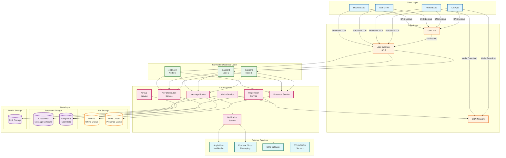
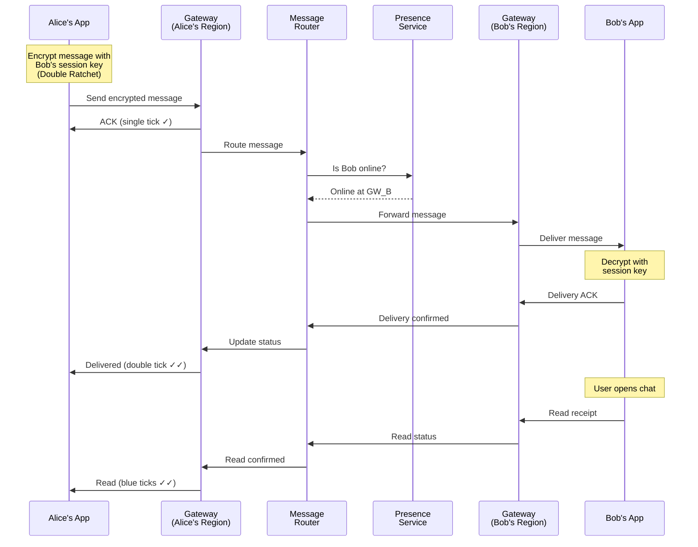
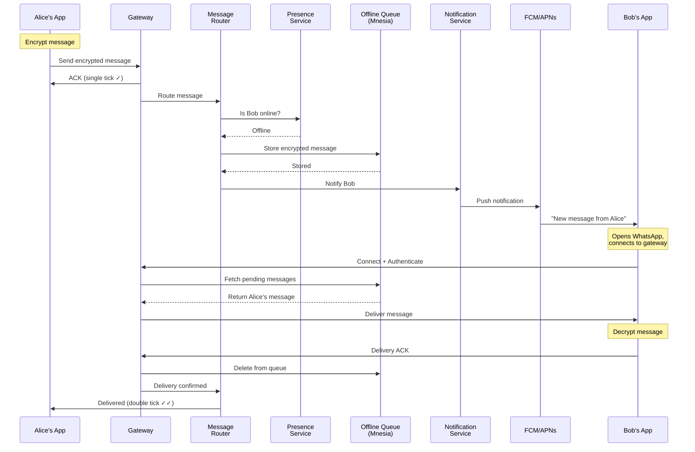
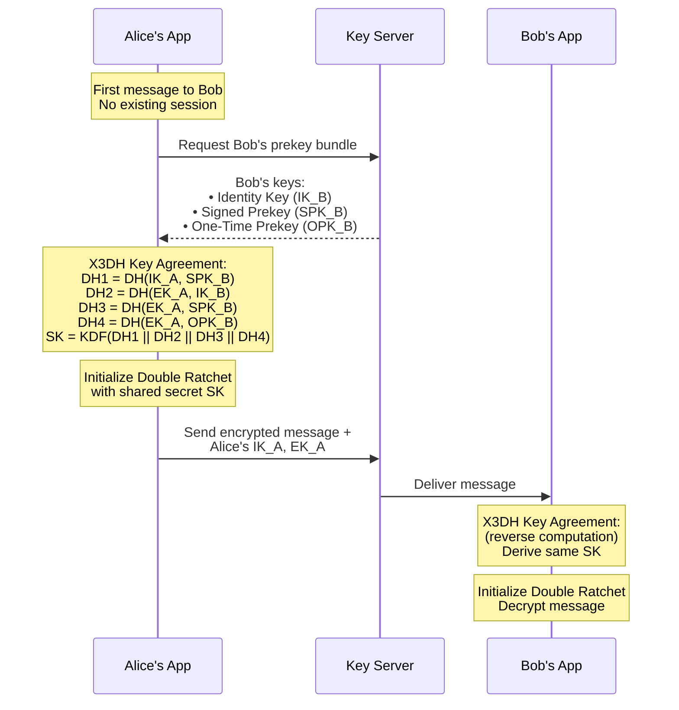
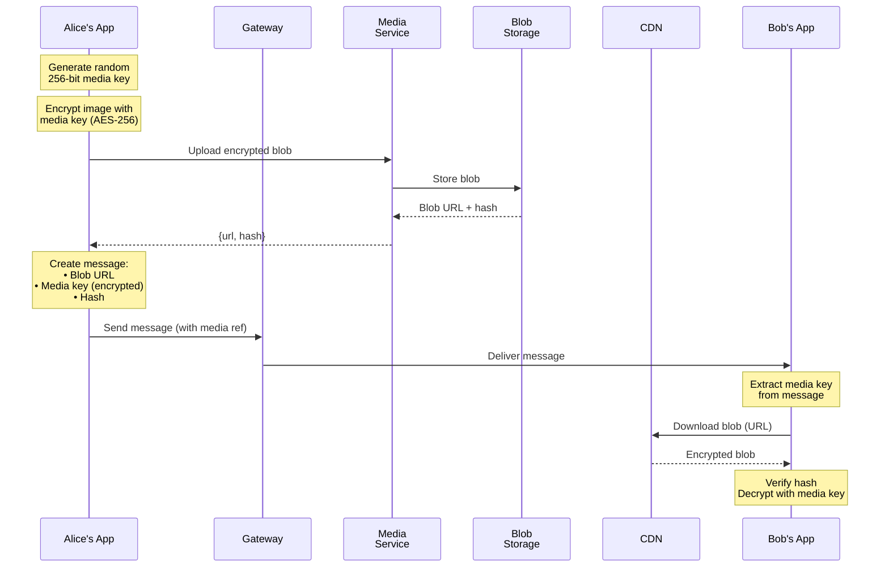
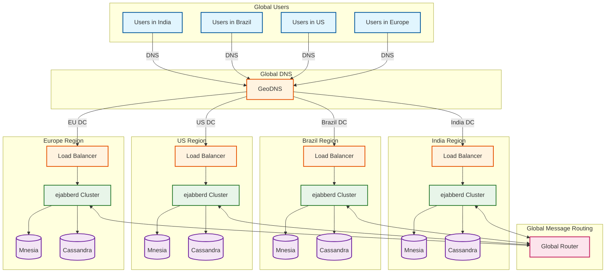

# WhatsApp: High-Level Design

## Table of Contents
- [System Architecture](#system-architecture)
- [Data Flow](#data-flow)
- [Key Architectural Decisions](#key-architectural-decisions)
- [Technology Stack](#technology-stack)
- [Multi-Region Deployment](#multi-region-deployment)

---

## System Architecture

### Complete System Architecture



### Component Responsibilities

| Component | Responsibility | Technology |
|-----------|---------------|------------|
| **GeoDNS** | Route users to nearest data center | DNS with geo-awareness |
| **Load Balancer** | Distribute connections across gateway nodes | L4 load balancing |
| **CDN** | Cache and serve encrypted media files | Edge caching |
| **ejabberd Gateway** | Handle persistent connections, XMPP protocol | Erlang/BEAM |
| **Message Router** | Route messages to online recipients or offline store | Erlang processes |
| **Presence Service** | Track online/offline status, last seen | Redis-backed |
| **Key Distribution Service** | Manage prekey bundles for E2EE | Dedicated service |
| **Media Service** | Handle media uploads/downloads | HTTP service |
| **Notification Service** | Send push notifications | APNs/FCM integration |
| **Registration Service** | Phone verification, user onboarding | SMS integration |
| **Group Service** | Group creation, membership management | Transactional |

---

## Data Flow

### Message Send Flow (Online Recipient)



### Message Send Flow (Offline Recipient)



### E2EE Session Setup (X3DH)



### Media Upload/Download Flow



### Voice/Video Call Setup

```mermaid
sequenceDiagram
    participant Alice as Alice
    participant GW_A as Gateway A
    participant Signal as Signaling<br/>Server
    participant STUN as STUN/TURN
    participant GW_B as Gateway B
    participant Bob as Bob

    Note over Alice: Initiate call

    Alice->>GW_A: Call request (encrypted)
    GW_A->>Signal: Route call invite
    Signal->>GW_B: Forward invite
    GW_B->>Bob: Incoming call (ring)

    Bob->>GW_B: Accept call
    GW_B->>Signal: Call accepted

    par ICE Candidates Exchange
        Alice->>STUN: Get public IP/port
        STUN-->>Alice: ICE candidates
        Bob->>STUN: Get public IP/port
        STUN-->>Bob: ICE candidates
    end

    Signal->>GW_A: Bob's ICE candidates
    Signal->>GW_B: Alice's ICE candidates

    Note over Alice,Bob: Try P2P connection

    alt P2P Successful
        Alice<-->Bob: Direct SRTP stream
    else NAT blocks P2P
        Alice->>STUN: Use TURN relay
        STUN->>Bob: Relay SRTP
    end

    Note over Alice,Bob: Encrypted voice/video<br/>using SRTP (AES-128)
```

---

## Key Architectural Decisions

### Decision 1: Erlang/BEAM vs Traditional Languages

| Aspect | Erlang/BEAM | Go/Java | Decision |
|--------|-------------|---------|----------|
| **Concurrency Model** | Lightweight processes (2KB) | Goroutines/Threads (KB-MB) | **Erlang** |
| **Fault Tolerance** | Built-in supervision trees | Manual implementation | **Erlang** |
| **Hot Code Swapping** | Native support | Requires restart | **Erlang** |
| **Talent Pool** | Smaller | Large | Go/Java |
| **Ecosystem** | Focused on telecom | General purpose | Depends |

**WhatsApp's Choice: Erlang**

**Rationale:**
- 2KB per connection allows 2M+ connections per server
- "Let it crash" philosophy isolates failures
- Hot code swapping enables zero-downtime deployments
- BEAM was designed for telecom (exactly messaging's requirements)

### Decision 2: XMPP (ejabberd) vs Custom Protocol

| Aspect | XMPP (ejabberd) | Custom Protocol | Decision |
|--------|-----------------|-----------------|----------|
| **Time to Market** | Fast (existing server) | Slow | XMPP |
| **Extensibility** | Standardized extensions | Full control | Custom |
| **Performance** | Good (with tuning) | Optimal | Custom |
| **Ecosystem** | Libraries exist | Build from scratch | XMPP |

**WhatsApp's Choice: Modified ejabberd (XMPP)**

**Rationale:**
- ejabberd is Erlang-native, fits the stack
- Heavy modifications for scale (rewrote core components)
- XMPP provides good primitives for messaging
- Not strictly XMPP-compliant anymore (optimized)

### Decision 3: Mnesia vs Redis for Offline Queue

| Aspect | Mnesia | Redis | Decision |
|--------|--------|-------|----------|
| **Language Integration** | Erlang native | External | **Mnesia** |
| **Distributed** | Built-in | Cluster mode | Both |
| **Persistence** | RAM + disk | RAM + disk | Both |
| **Latency** | Sub-ms (in-process) | 0.1-1ms (network) | Mnesia |
| **Ops Complexity** | Part of Erlang | Separate system | Mnesia |

**WhatsApp's Choice: Mnesia**

**Rationale:**
- No network hop (same Erlang VM)
- Distributed replication built-in
- Schema defined in Erlang
- Transactions with ACID guarantees

### Decision 4: Store-and-Forward vs Long-Term Server Storage

| Aspect | Store-and-Forward | Server Storage | Decision |
|--------|-------------------|----------------|----------|
| **Privacy** | Minimal retention | All history on server | **Store-and-Forward** |
| **E2EE Compliance** | Server is blind | Same (encrypted) | Both |
| **Storage Cost** | Minimal | Massive | Store-and-Forward |
| **Sync Complexity** | On-device backup | Server-based | Store-and-Forward |
| **Offline Access** | Device only | Any device | Server Storage |

**WhatsApp's Choice: Store-and-Forward**

**Rationale:**
- Messages deleted after delivery (privacy)
- Reduces server storage costs dramatically
- Aligns with E2EE philosophy (server shouldn't hold data)
- User controls backup (encrypted to iCloud/Google Drive)

### Decision 5: Signal Protocol vs Custom E2EE

| Aspect | Signal Protocol | Custom E2EE | Decision |
|--------|-----------------|-------------|----------|
| **Security Audit** | Extensively audited | Needs audit | **Signal** |
| **Forward Secrecy** | Built-in (Double Ratchet) | Must implement | Signal |
| **Backward Secrecy** | Built-in (DH Ratchet) | Must implement | Signal |
| **Trust** | Industry standard | Untrusted initially | Signal |
| **Flexibility** | Limited customization | Full control | Custom |

**WhatsApp's Choice: Signal Protocol**

**Rationale:**
- Open Whisper Systems partnership (2014)
- Battle-tested cryptography
- Provides forward and backward secrecy
- Respected by security community

---

## Technology Stack

### Complete Stack Overview

```
┌─────────────────────────────────────────────────────────────────┐
│                        CLIENT LAYER                             │
├─────────────────────────────────────────────────────────────────┤
│  iOS          │  Android      │  Web          │  Desktop        │
│  (Swift/ObjC) │  (Java/Kotlin)│  (React)      │  (Electron)     │
│               │               │               │                 │
│  libsignal-protocol-c / libsignal-protocol-java                 │
│  SQLite (local storage)                                         │
└─────────────────────────────────────────────────────────────────┘
                              │
                              ▼
┌─────────────────────────────────────────────────────────────────┐
│                        NETWORK LAYER                            │
├─────────────────────────────────────────────────────────────────┤
│  Protocol:      Noise Protocol (transport encryption)          │
│  Connection:    Persistent TCP (WebSocket for web)              │
│  Messaging:     Modified XMPP                                   │
│  Media:         HTTPS (encrypted blob upload/download)          │
│  VoIP:          SRTP over UDP (with STUN/TURN)                  │
└─────────────────────────────────────────────────────────────────┘
                              │
                              ▼
┌─────────────────────────────────────────────────────────────────┐
│                        SERVER LAYER                             │
├─────────────────────────────────────────────────────────────────┤
│  OS:            FreeBSD                                         │
│  Runtime:       Erlang/OTP on BEAM VM                           │
│  Connection:    ejabberd (heavily modified)                     │
│  Load Balance:  L4 load balancers                               │
└─────────────────────────────────────────────────────────────────┘
                              │
                              ▼
┌─────────────────────────────────────────────────────────────────┐
│                        DATA LAYER                               │
├─────────────────────────────────────────────────────────────────┤
│  Offline Queue: Mnesia (Erlang distributed DB)                  │
│  Presence:      Redis-like caching                              │
│  Messages:      Cassandra (metadata only, E2EE content)         │
│  User Data:     PostgreSQL                                      │
│  Media:         Blob Storage (S3-like)                          │
│  CDN:           Edge caching for media                          │
└─────────────────────────────────────────────────────────────────┘
                              │
                              ▼
┌─────────────────────────────────────────────────────────────────┐
│                        EXTERNAL SERVICES                        │
├─────────────────────────────────────────────────────────────────┤
│  Push:          Apple Push Notification Service (APNs)          │
│                 Firebase Cloud Messaging (FCM)                  │
│  SMS:           Twilio / Nexmo (verification)                   │
│  VoIP:          Custom STUN/TURN infrastructure                 │
└─────────────────────────────────────────────────────────────────┘
```

### Technology Selection Rationale

| Component | Technology | Why |
|-----------|------------|-----|
| **Server Language** | Erlang | 2KB processes, fault tolerance, hot swap |
| **Server OS** | FreeBSD | Network performance, kernel tuning |
| **Connection Server** | ejabberd | Erlang native, XMPP primitives |
| **Offline Storage** | Mnesia | In-process, distributed, Erlang native |
| **User Data** | PostgreSQL | ACID transactions, proven reliability |
| **Message Metadata** | Cassandra | Distributed, high write throughput |
| **Caching** | Redis-like | Sub-ms presence lookups |
| **Media Storage** | Blob Storage | Scalable object storage |
| **E2EE** | Signal Protocol | Industry standard, audited |
| **VoIP Encryption** | SRTP | Real-time encryption standard |
| **Transport** | Noise Protocol | Modern transport encryption |

---

## Multi-Region Deployment

### Global Architecture



### Cross-Region Message Routing

**Scenario**: Alice (India) sends message to Bob (Brazil)

```
1. Alice → India Gateway (persistent connection)
2. India Gateway → Global Router (route lookup)
3. Global Router → Brazil Gateway (Bob's home region)
4. Brazil Gateway → Bob (deliver message)
5. Bob → Brazil Gateway → India Gateway → Alice (delivery ACK)
```

### User-to-Region Affinity

| Strategy | Description |
|----------|-------------|
| **Phone Number Prefix** | +91 (India) → India region |
| **Registration Location** | IP geolocation at signup |
| **Latency-Based** | Redirect to lowest-latency DC |
| **Sticky Sessions** | Maintain affinity once assigned |

### Data Replication Strategy

| Data Type | Replication | Consistency |
|-----------|-------------|-------------|
| User Profile | Cross-region (async) | Eventual |
| Prekey Bundles | Cross-region (async) | Eventual |
| Offline Queue | Single region (Mnesia) | Strong within region |
| Presence | Single region (cache) | Eventual |
| Group Membership | Cross-region (async) | Eventual |

### Failover Strategy

| Scenario | Detection | Recovery |
|----------|-----------|----------|
| Node failure | Health checks (5s) | Supervisor restarts process |
| Cluster failure | Load balancer health | Route to other nodes |
| Region failure | DNS health checks | Redirect to secondary region |
| Data center failure | Active monitoring | Manual failover to DR site |

---

## Architecture Pattern Checklist

| Pattern | Decision | Rationale |
|---------|----------|-----------|
| **Sync vs Async** | Async (persistent connections) | Real-time delivery without polling |
| **Push vs Pull** | Push-based delivery | Immediate message delivery |
| **Stateless vs Stateful** | Stateful connections | Session state in Erlang process |
| **Event-driven vs Request-response** | Event-driven | Publish message, async delivery |
| **Read-heavy vs Write-heavy** | Write-heavy | Every send is a write |
| **Real-time vs Batch** | Real-time | Instant messaging requirement |
| **Edge vs Origin** | Origin (with CDN for media) | Connections to gateway, CDN for media |
| **Monolith vs Microservices** | Monolith (ejabberd) | Single deployment unit for messaging |
