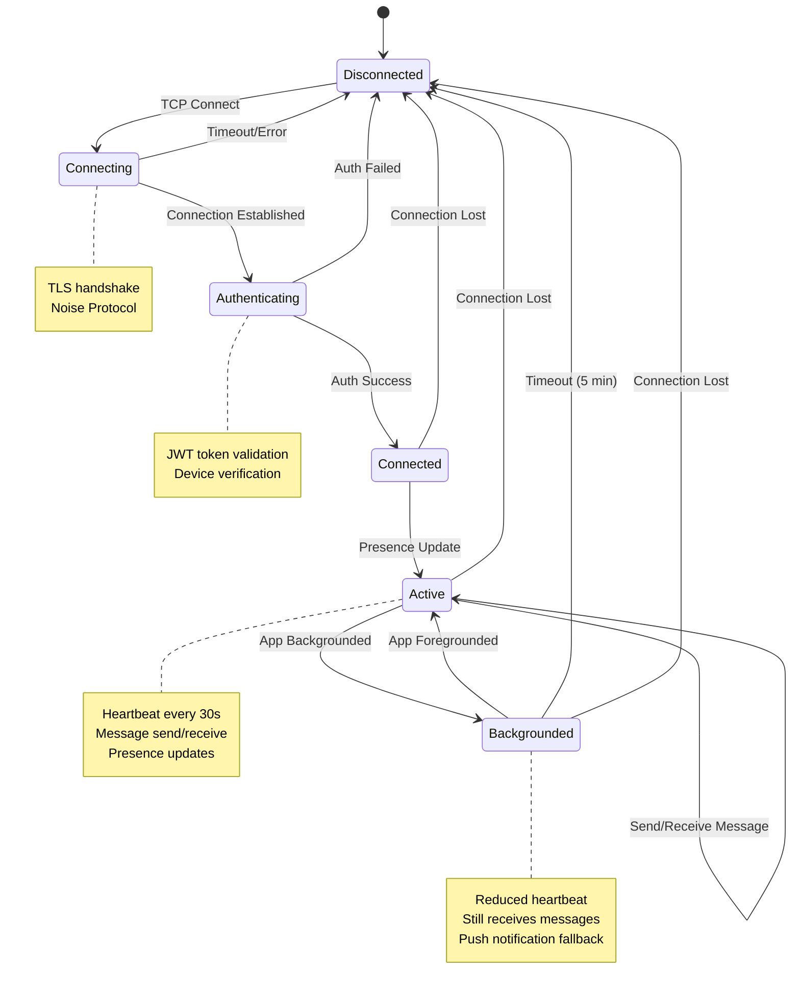

# WhatsApp: Low-Level Design

## Table of Contents
- [Data Models](#data-models)
- [API Design](#api-design)
- [Core Algorithms](#core-algorithms)
- [Database Design](#database-design)
- [Connection State Machine](#connection-state-machine)

---

## Data Models

### User Schema

```
User {
    user_id:            UUID            // Internal unique identifier
    phone_number:       String          // E.164 format (+14155551234)
    phone_hash:         String          // SHA-256 hash of phone (for lookups)

    // Identity Keys (Signal Protocol)
    identity_key_public:    Bytes[32]   // Curve25519 public key
    identity_key_created:   Timestamp   // Key generation time

    // Profile
    display_name:       String[25]      // User-set display name
    about:              String[140]     // Status/bio
    profile_photo_url:  String          // CDN URL (encrypted)
    profile_photo_key:  Bytes[32]       // Decryption key for photo

    // Settings
    last_seen_privacy:  Enum            // EVERYONE | CONTACTS | NOBODY
    read_receipts:      Boolean         // Blue ticks enabled

    // Metadata
    created_at:         Timestamp
    last_seen:          Timestamp
    registration_id:    Integer         // Signal Protocol registration ID

    // Multi-device
    primary_device_id:  UUID
    linked_devices:     [DeviceId]      // Up to 4 linked devices
}

// Index: phone_hash (unique), user_id (primary)
```

### Device Schema

```
Device {
    device_id:          UUID
    user_id:            UUID            // Owner
    device_type:        Enum            // PRIMARY | LINKED
    platform:           Enum            // IOS | ANDROID | WEB | DESKTOP

    // Device-specific identity key
    identity_key_public:    Bytes[32]
    signed_prekey:          SignedPrekey
    one_time_prekeys:       [Prekey]    // Pool of 100 prekeys

    // Connection info
    push_token:         String          // APNs/FCM token
    last_active:        Timestamp

    created_at:         Timestamp
}
```

### Prekey Bundle Schema

```
SignedPrekey {
    key_id:             Integer
    public_key:         Bytes[32]       // Curve25519
    signature:          Bytes[64]       // Ed25519 signature
    timestamp:          Timestamp
}

Prekey {
    key_id:             Integer
    public_key:         Bytes[32]       // Curve25519
}

PrekeyBundle {
    user_id:            UUID
    device_id:          UUID
    registration_id:    Integer

    identity_key:       Bytes[32]       // Long-term identity
    signed_prekey:      SignedPrekey    // Medium-term (rotated monthly)
    one_time_prekey:    Prekey          // Single-use (optional)
}
```

### Message Schema

```
Message {
    message_id:         UUID            // Client-generated
    conversation_id:    UUID            // Hash of sorted participant IDs

    sender_id:          UUID
    sender_device_id:   UUID

    // Encrypted content (server is blind)
    ciphertext:         Bytes           // AES-256-CBC encrypted
    mac:                Bytes[32]       // HMAC-SHA256

    // Signal Protocol headers
    ratchet_key:        Bytes[32]       // DH public key
    counter:            Integer         // Message counter in chain
    previous_counter:   Integer         // Previous chain counter

    // Message type
    message_type:       Enum            // TEXT | MEDIA | REACTION | ...

    // Delivery tracking (server-side)
    server_timestamp:   Timestamp       // When server received
    status:             Enum            // SENT | DELIVERED | READ
    delivered_at:       Timestamp
    read_at:            Timestamp

    // Media reference (if applicable)
    media_ref:          MediaRef        // Nullable
}

MediaRef {
    url:                String          // CDN URL for encrypted blob
    mime_type:          String          // image/jpeg, video/mp4, etc.
    size_bytes:         Integer

    // Client-side encryption
    media_key:          Bytes[32]       // AES-256 key (encrypted in message)
    file_hash:          Bytes[32]       // SHA-256 of encrypted blob

    // Dimensions (for preview)
    width:              Integer
    height:             Integer
    duration_ms:        Integer         // For audio/video

    thumbnail:          Bytes           // Encrypted thumbnail
    thumbnail_key:      Bytes[32]
}
```

### Conversation Schema

```
Conversation {
    conversation_id:    UUID            // Hash of sorted participant IDs
    type:               Enum            // INDIVIDUAL | GROUP

    // For individual chats
    participant_1:      UUID
    participant_2:      UUID

    // For groups
    group_id:           UUID            // Nullable

    created_at:         Timestamp
    last_message_at:    Timestamp
}

Group {
    group_id:           UUID
    conversation_id:    UUID

    name:               String[100]
    description:        String[2048]
    photo_url:          String
    photo_key:          Bytes[32]

    created_by:         UUID
    created_at:         Timestamp

    // Group settings
    admins_only_edit:   Boolean         // Only admins change info
    admins_only_send:   Boolean         // Only admins send messages
    disappearing_messages: Integer      // TTL in seconds (0 = disabled)

    // Membership
    members:            [GroupMember]   // Up to 1024
}

GroupMember {
    user_id:            UUID
    role:               Enum            // ADMIN | MEMBER
    joined_at:          Timestamp
    added_by:           UUID

    // Sender key for group E2EE
    sender_key_id:      Integer
}
```

### Offline Queue Schema (Mnesia)

```
OfflineMessage {
    recipient_id:       UUID            // Primary key
    message_id:         UUID            // Part of composite key

    sender_id:          UUID
    conversation_id:    UUID

    encrypted_payload:  Bytes           // Full encrypted message

    queued_at:          Timestamp
    expires_at:         Timestamp       // TTL (7 days)
    retry_count:        Integer         // Delivery attempts

    priority:           Enum            // HIGH | NORMAL | LOW
}

// Mnesia table configuration:
// - Type: ordered_set
// - RAM + disk copies (persistence)
// - Index on: recipient_id, expires_at
```

---

## API Design

### XMPP Message Protocol

WhatsApp uses a modified XMPP protocol over persistent TCP connections.

#### Message Stanza

```xml
<!-- Send Message -->
<message to="recipient_id@whatsapp" id="message_uuid" type="chat">
    <enc v="2" type="msg">
        <!-- Base64-encoded Signal Protocol message -->
        <base64>ENCRYPTED_CIPHERTEXT</base64>
    </enc>
    <t>1640000000</t>  <!-- Timestamp -->
</message>

<!-- Delivery Receipt -->
<receipt to="sender_id@whatsapp" id="message_uuid">
    <delivered timestamp="1640000001"/>
</receipt>

<!-- Read Receipt -->
<receipt to="sender_id@whatsapp" id="message_uuid">
    <read timestamp="1640000002"/>
</receipt>

<!-- Presence Update -->
<presence>
    <status>online</status>
    <last>1640000000</last>
</presence>
```

### HTTP REST APIs

#### User Registration

```
POST /v1/register
Content-Type: application/json

Request:
{
    "phone_number": "+14155551234",
    "method": "sms" | "call" | "flash_call",
    "device": {
        "platform": "android",
        "model": "Pixel 7",
        "os_version": "14"
    }
}

Response (200 OK):
{
    "verification_id": "ver_abc123",
    "retry_after": 60,
    "method": "sms"
}
```

#### Verify Code

```
POST /v1/verify
Content-Type: application/json

Request:
{
    "verification_id": "ver_abc123",
    "code": "123456"
}

Response (200 OK):
{
    "user_id": "usr_uuid",
    "auth_token": "jwt_token",
    "expires_in": 86400
}
```

#### Upload Prekeys

```
POST /v1/keys
Authorization: Bearer <token>
Content-Type: application/json

Request:
{
    "identity_key": "base64_public_key",
    "signed_prekey": {
        "key_id": 1,
        "public_key": "base64_public_key",
        "signature": "base64_signature"
    },
    "prekeys": [
        {"key_id": 1, "public_key": "base64_key"},
        {"key_id": 2, "public_key": "base64_key"},
        // ... up to 100 prekeys
    ]
}

Response (200 OK):
{
    "registered_count": 100
}
```

#### Fetch Prekey Bundle

```
GET /v1/keys/{user_id}?device_id={device_id}
Authorization: Bearer <token>

Response (200 OK):
{
    "user_id": "usr_target",
    "device_id": "dev_uuid",
    "registration_id": 12345,
    "identity_key": "base64_public_key",
    "signed_prekey": {
        "key_id": 1,
        "public_key": "base64_key",
        "signature": "base64_sig"
    },
    "one_time_prekey": {
        "key_id": 42,
        "public_key": "base64_key"
    }  // May be null if depleted
}
```

#### Media Upload

```
POST /v1/media/upload
Authorization: Bearer <token>
Content-Type: multipart/form-data

Form Data:
- file: <encrypted_blob>
- mime_type: "image/jpeg"
- hash: "sha256_of_blob"

Response (200 OK):
{
    "url": "https://cdn.whatsapp.net/media/abc123",
    "direct_url": "https://origin.whatsapp.net/media/abc123",
    "expires_at": "2024-01-08T00:00:00Z"
}
```

#### Media Download

```
GET /v1/media/{media_id}
Authorization: Bearer <token>

Response (200 OK):
Content-Type: application/octet-stream
<encrypted_blob_bytes>
```

### API Rate Limits

| Endpoint | Limit | Window |
|----------|-------|--------|
| `/v1/register` | 3 | 1 hour |
| `/v1/verify` | 5 | 15 minutes |
| `/v1/keys` (POST) | 10 | 1 hour |
| `/v1/keys/{id}` (GET) | 100 | 1 minute |
| `/v1/media/upload` | 20 | 1 minute |
| Messages (XMPP) | 100 | 10 seconds |

---

## Core Algorithms

### X3DH Key Agreement

```
ALGORITHM: X3DH_InitiateSession

INPUT:
    - my_identity_key: (IK_A_public, IK_A_private)  // Long-term key pair
    - recipient_bundle: PrekeyBundle                 // From key server

OUTPUT:
    - shared_secret: Bytes[32]
    - ephemeral_public: Bytes[32]
    - used_prekey_id: Integer

PROCEDURE:
    // Step 1: Extract recipient's keys
    IK_B = recipient_bundle.identity_key
    SPK_B = recipient_bundle.signed_prekey.public_key
    OPK_B = recipient_bundle.one_time_prekey.public_key  // May be null

    // Step 2: Verify signed prekey signature
    IF NOT Ed25519_Verify(IK_B, SPK_B, recipient_bundle.signed_prekey.signature):
        ABORT "Invalid signed prekey signature"

    // Step 3: Generate ephemeral key pair
    (EK_public, EK_private) = Curve25519_Generate_Keypair()

    // Step 4: Compute Diffie-Hellman values
    DH1 = Curve25519_DH(IK_A_private, SPK_B)      // My identity → Their signed prekey
    DH2 = Curve25519_DH(EK_private, IK_B)         // My ephemeral → Their identity
    DH3 = Curve25519_DH(EK_private, SPK_B)        // My ephemeral → Their signed prekey

    IF OPK_B != null:
        DH4 = Curve25519_DH(EK_private, OPK_B)    // My ephemeral → Their one-time prekey
        dh_concat = DH1 || DH2 || DH3 || DH4
    ELSE:
        dh_concat = DH1 || DH2 || DH3

    // Step 5: Derive shared secret using HKDF
    shared_secret = HKDF(
        salt = zeros[32],
        ikm = dh_concat,
        info = "WhatsAppX3DH",
        length = 32
    )

    // Step 6: Initialize session
    used_prekey_id = recipient_bundle.one_time_prekey.key_id IF OPK_B != null ELSE null

    RETURN (shared_secret, EK_public, used_prekey_id)
```

### Double Ratchet Encrypt

```
ALGORITHM: DoubleRatchet_Encrypt

INPUT:
    - state: SessionState
    - plaintext: Bytes

OUTPUT:
    - header: MessageHeader
    - ciphertext: Bytes

STATE:
    SessionState {
        root_key: Bytes[32]              // Root chain key
        sending_chain_key: Bytes[32]     // Sending chain
        receiving_chain_key: Bytes[32]   // Receiving chain

        my_ratchet_keypair: KeyPair      // Current DH ratchet key
        their_ratchet_key: Bytes[32]     // Their current public key

        sending_message_number: Integer
        receiving_message_number: Integer
        previous_chain_length: Integer

        skipped_message_keys: Map<(ratchet_key, counter), message_key>
    }

PROCEDURE:
    // Step 1: Check if we need DH ratchet step
    IF state.sending_chain_key == null:
        // First message in this direction, perform DH ratchet
        state = DH_Ratchet_Step(state)

    // Step 2: Derive message key from sending chain (symmetric ratchet)
    (state.sending_chain_key, message_key) = KDF_Chain(state.sending_chain_key)

    // Step 3: Encrypt plaintext
    iv = Random_Bytes(16)
    ciphertext = AES_256_CBC_Encrypt(message_key, iv, plaintext)

    // Step 4: Compute MAC
    mac = HMAC_SHA256(message_key, ciphertext)

    // Step 5: Construct header
    header = MessageHeader {
        ratchet_public_key: state.my_ratchet_keypair.public,
        previous_chain_length: state.previous_chain_length,
        message_number: state.sending_message_number
    }

    // Step 6: Increment counter
    state.sending_message_number += 1

    RETURN (header, iv || ciphertext || mac)


SUBROUTINE: DH_Ratchet_Step(state)
    // Save previous chain length
    state.previous_chain_length = state.sending_message_number
    state.sending_message_number = 0
    state.receiving_message_number = 0

    // Generate new ratchet key pair
    state.my_ratchet_keypair = Curve25519_Generate_Keypair()

    // Compute new DH output
    dh_output = Curve25519_DH(state.my_ratchet_keypair.private, state.their_ratchet_key)

    // Derive new root key and sending chain key
    (state.root_key, state.sending_chain_key) = KDF_Root(state.root_key, dh_output)

    RETURN state


SUBROUTINE: KDF_Chain(chain_key)
    // Symmetric ratchet step
    message_key = HMAC_SHA256(chain_key, 0x01)
    new_chain_key = HMAC_SHA256(chain_key, 0x02)
    RETURN (new_chain_key, message_key)


SUBROUTINE: KDF_Root(root_key, dh_output)
    // Derive new root and chain keys
    output = HKDF(
        salt = root_key,
        ikm = dh_output,
        info = "WhatsAppRatchet",
        length = 64
    )
    new_root_key = output[0:32]
    new_chain_key = output[32:64]
    RETURN (new_root_key, new_chain_key)
```

### Double Ratchet Decrypt

```
ALGORITHM: DoubleRatchet_Decrypt

INPUT:
    - state: SessionState
    - header: MessageHeader
    - ciphertext: Bytes

OUTPUT:
    - plaintext: Bytes

PROCEDURE:
    // Step 1: Check if we need to perform DH ratchet (they sent new key)
    IF header.ratchet_public_key != state.their_ratchet_key:
        // Skip any messages we missed in previous chain
        state = Skip_Messages(state, header.previous_chain_length)

        // Perform DH ratchet
        state = DH_Ratchet_Step_Receive(state, header.ratchet_public_key)

    // Step 2: Skip any messages we missed in current chain
    state = Skip_Messages(state, header.message_number)

    // Step 3: Derive message key
    (state.receiving_chain_key, message_key) = KDF_Chain(state.receiving_chain_key)
    state.receiving_message_number += 1

    // Step 4: Parse ciphertext
    iv = ciphertext[0:16]
    encrypted = ciphertext[16:-32]
    mac = ciphertext[-32:]

    // Step 5: Verify MAC
    expected_mac = HMAC_SHA256(message_key, encrypted)
    IF mac != expected_mac:
        ABORT "MAC verification failed"

    // Step 6: Decrypt
    plaintext = AES_256_CBC_Decrypt(message_key, iv, encrypted)

    RETURN plaintext


SUBROUTINE: Skip_Messages(state, until)
    // Store skipped message keys for out-of-order messages
    WHILE state.receiving_message_number < until:
        (state.receiving_chain_key, mk) = KDF_Chain(state.receiving_chain_key)
        state.skipped_message_keys[(state.their_ratchet_key, state.receiving_message_number)] = mk
        state.receiving_message_number += 1

    RETURN state


SUBROUTINE: DH_Ratchet_Step_Receive(state, their_new_key)
    state.their_ratchet_key = their_new_key

    // Compute DH with their new key and our current key
    dh_output = Curve25519_DH(state.my_ratchet_keypair.private, their_new_key)
    (state.root_key, state.receiving_chain_key) = KDF_Root(state.root_key, dh_output)

    // Generate our new ratchet key
    state.my_ratchet_keypair = Curve25519_Generate_Keypair()
    dh_output = Curve25519_DH(state.my_ratchet_keypair.private, their_new_key)
    (state.root_key, state.sending_chain_key) = KDF_Root(state.root_key, dh_output)

    state.receiving_message_number = 0
    state.sending_message_number = 0

    RETURN state
```

### Message Routing

```
ALGORITHM: Route_Message

INPUT:
    - message: EncryptedMessage
    - sender_connection: Connection

OUTPUT:
    - status: DeliveryStatus

PROCEDURE:
    recipient_id = message.recipient_id

    // Step 1: Acknowledge receipt to sender (single tick)
    Send_Ack(sender_connection, message.message_id, "SENT")

    // Step 2: Check recipient's online status
    recipient_connection = Presence_Lookup(recipient_id)

    IF recipient_connection != null:
        // Recipient is online - deliver immediately
        TRY:
            Deliver_Message(recipient_connection, message)

            // Wait for delivery ACK (with timeout)
            delivery_ack = Wait_For_Ack(recipient_connection, message.message_id, timeout=5s)

            IF delivery_ack.received:
                // Update message status
                Update_Status(message.message_id, "DELIVERED")
                Notify_Sender(sender_connection, message.message_id, "DELIVERED")
                RETURN "DELIVERED"
            ELSE:
                // Connection dropped, queue message
                GOTO queue_message
        CATCH ConnectionError:
            // Recipient went offline during delivery
            GOTO queue_message
    ELSE:
        // Recipient is offline
        queue_message:

        // Step 3: Queue message for later delivery
        Queue_Offline_Message(recipient_id, message)

        // Step 4: Send push notification
        Send_Push_Notification(recipient_id, sender_id, "New message")

        RETURN "QUEUED"


SUBROUTINE: Queue_Offline_Message(recipient_id, message)
    offline_record = OfflineMessage {
        recipient_id: recipient_id,
        message_id: message.message_id,
        sender_id: message.sender_id,
        encrypted_payload: message.serialize(),
        queued_at: Now(),
        expires_at: Now() + 7_DAYS,
        retry_count: 0,
        priority: NORMAL
    }

    Mnesia_Insert(offline_queue, offline_record)


SUBROUTINE: Deliver_Queued_Messages(connection, user_id)
    // Called when user connects
    queued_messages = Mnesia_Select(offline_queue, recipient_id = user_id)

    FOR message IN queued_messages ORDER BY queued_at ASC:
        TRY:
            Deliver_Message(connection, message.encrypted_payload)
            ack = Wait_For_Ack(connection, message.message_id, timeout=5s)

            IF ack.received:
                Mnesia_Delete(offline_queue, message.message_id)
                Notify_Sender(message.sender_id, message.message_id, "DELIVERED")
        CATCH:
            // Will retry on next connection
            message.retry_count += 1
            Mnesia_Update(offline_queue, message)
```

### Group Sender Key Distribution

```
ALGORITHM: Group_Sender_Key_Setup

INPUT:
    - group_id: UUID
    - members: [UserId]
    - my_user_id: UserId

OUTPUT:
    - sender_key: SenderKey

PROCEDURE:
    // Step 1: Generate random sender key for this user
    chain_key = Random_Bytes(32)
    signing_key = Curve25519_Generate_Keypair()

    sender_key = SenderKey {
        key_id: Random_Int32(),
        chain_key: chain_key,
        signing_public_key: signing_key.public,
        iteration: 0
    }

    // Step 2: Distribute to each group member via pairwise channel
    FOR member IN members:
        IF member == my_user_id:
            CONTINUE

        // Get or create pairwise session with member
        session = Get_Or_Create_Session(my_user_id, member)

        // Encrypt sender key using Double Ratchet
        distribution_message = SenderKeyDistribution {
            group_id: group_id,
            sender_key_id: sender_key.key_id,
            chain_key: sender_key.chain_key,
            signing_key: sender_key.signing_public_key
        }

        encrypted = DoubleRatchet_Encrypt(session, distribution_message.serialize())
        Send_Message(member, encrypted, type="SENDER_KEY_DISTRIBUTION")

    // Step 3: Store my sender key locally
    Store_Sender_Key(group_id, my_user_id, sender_key)

    RETURN sender_key


ALGORITHM: Group_Message_Encrypt

INPUT:
    - group_id: UUID
    - plaintext: Bytes

OUTPUT:
    - ciphertext: Bytes

PROCEDURE:
    // Step 1: Get my sender key for this group
    sender_key = Get_Sender_Key(group_id, my_user_id)

    // Step 2: Derive message key (symmetric ratchet)
    message_key = HKDF(sender_key.chain_key, "GroupMessageKey", 32)
    sender_key.chain_key = HKDF(sender_key.chain_key, "GroupChainKey", 32)
    sender_key.iteration += 1

    // Step 3: Encrypt message
    iv = Random_Bytes(16)
    ciphertext = AES_256_CBC_Encrypt(message_key, iv, plaintext)

    // Step 4: Sign ciphertext
    signature = Curve25519_Sign(sender_key.signing_private_key, ciphertext)

    // Step 5: Construct group message
    group_message = GroupMessage {
        sender_key_id: sender_key.key_id,
        iteration: sender_key.iteration,
        iv: iv,
        ciphertext: ciphertext,
        signature: signature
    }

    RETURN group_message.serialize()
```

---

## Database Design

### Sharding Strategy

| Data | Shard Key | Rationale |
|------|-----------|-----------|
| Users | user_id hash | Distribute users evenly |
| Messages | conversation_id | Co-locate conversation messages |
| Offline Queue | recipient_id | Quick lookup when user connects |
| Groups | group_id | Isolate group data |
| Prekeys | user_id | Co-locate with user data |

### Mnesia Table Configuration

```erlang
%% Offline message queue
-record(offline_message, {
    {recipient_id, message_id},  %% Composite key
    sender_id,
    encrypted_payload,
    queued_at,
    expires_at,
    retry_count
}).

%% Table creation
mnesia:create_table(offline_message, [
    {attributes, record_info(fields, offline_message)},
    {type, ordered_set},
    {disc_copies, [node()]},  %% Persist to disk
    {index, [recipient_id, expires_at]}
]).

%% Presence cache
-record(presence, {
    user_id,
    connection_node,
    connection_pid,
    last_seen
}).

mnesia:create_table(presence, [
    {attributes, record_info(fields, presence)},
    {type, set},
    {ram_copies, [node()]},  %% RAM only for speed
    {index, [connection_node]}
]).
```

### Cassandra Schema

```cql
-- Message metadata (for delivery tracking)
CREATE TABLE messages (
    conversation_id UUID,
    message_id UUID,
    sender_id UUID,
    message_type TEXT,
    status TEXT,  -- SENT, DELIVERED, READ
    server_timestamp TIMESTAMP,
    delivered_at TIMESTAMP,
    read_at TIMESTAMP,
    PRIMARY KEY ((conversation_id), message_id)
) WITH CLUSTERING ORDER BY (message_id DESC);

-- Create index for status queries
CREATE INDEX ON messages (status);

-- User lookup by phone hash
CREATE TABLE users_by_phone (
    phone_hash TEXT,
    user_id UUID,
    PRIMARY KEY (phone_hash)
);

-- Prekey bundles
CREATE TABLE prekey_bundles (
    user_id UUID,
    device_id UUID,
    identity_key BLOB,
    signed_prekey BLOB,
    signed_prekey_signature BLOB,
    signed_prekey_id INT,
    PRIMARY KEY ((user_id), device_id)
);

CREATE TABLE one_time_prekeys (
    user_id UUID,
    device_id UUID,
    key_id INT,
    public_key BLOB,
    PRIMARY KEY ((user_id, device_id), key_id)
);
```

---

## Connection State Machine



### Connection Lifecycle

```
ALGORITHM: Connection_Lifecycle

STATE: ConnectionState {
    tcp_socket: Socket
    noise_session: NoiseSession
    user_id: UUID
    device_id: UUID
    state: DISCONNECTED | CONNECTING | AUTHENTICATING | CONNECTED | ACTIVE | BACKGROUNDED
    last_heartbeat: Timestamp
    pending_messages: Queue<Message>
}

ON tcp_connect:
    state = CONNECTING
    noise_session = Noise_Handshake(tcp_socket)
    IF noise_session.success:
        state = AUTHENTICATING
        Send_Auth_Request(auth_token)
    ELSE:
        state = DISCONNECTED

ON auth_response(success):
    IF success:
        state = CONNECTED
        Presence_Register(user_id, self_pid)
        Deliver_Queued_Messages()
        state = ACTIVE
        Start_Heartbeat_Timer(30s)
    ELSE:
        Close_Connection()
        state = DISCONNECTED

ON heartbeat_timer:
    IF Now() - last_heartbeat > 30s:
        Send_Ping()
        last_heartbeat = Now()

    IF state == BACKGROUNDED AND Now() - last_activity > 5min:
        Close_Connection()
        state = DISCONNECTED

ON message_received(message):
    last_activity = Now()
    Process_Message(message)
    Send_Delivery_Ack(message.id)

ON app_backgrounded:
    state = BACKGROUNDED
    Reduce_Heartbeat_Frequency(60s)

ON app_foregrounded:
    state = ACTIVE
    Increase_Heartbeat_Frequency(30s)
    Sync_Pending_Messages()

ON connection_error:
    state = DISCONNECTED
    Presence_Unregister(user_id)
    // Client will auto-reconnect
```
