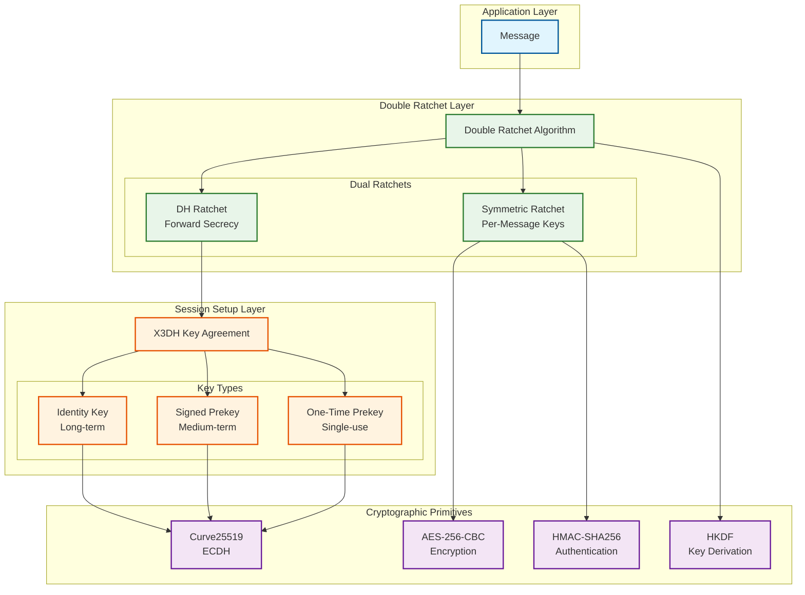
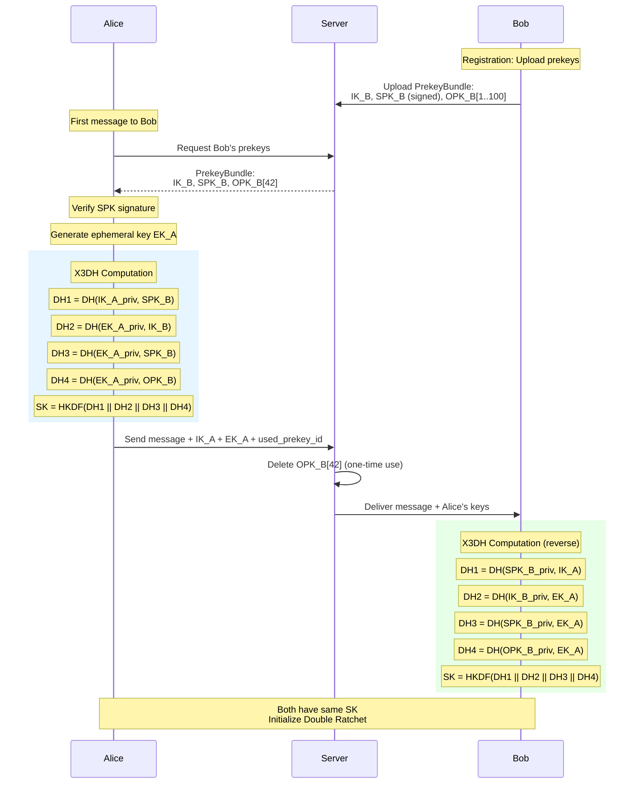
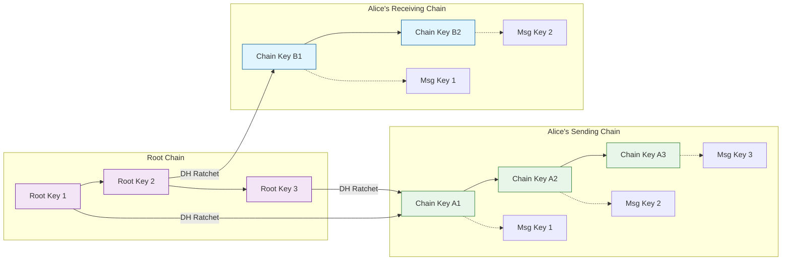
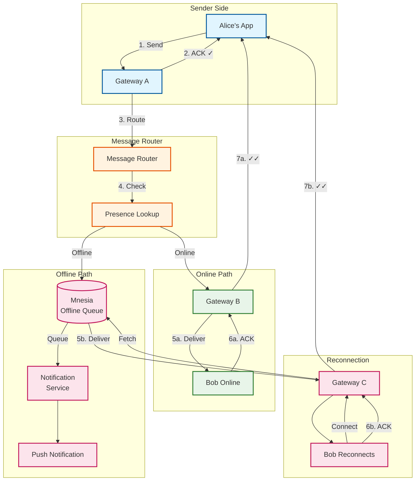
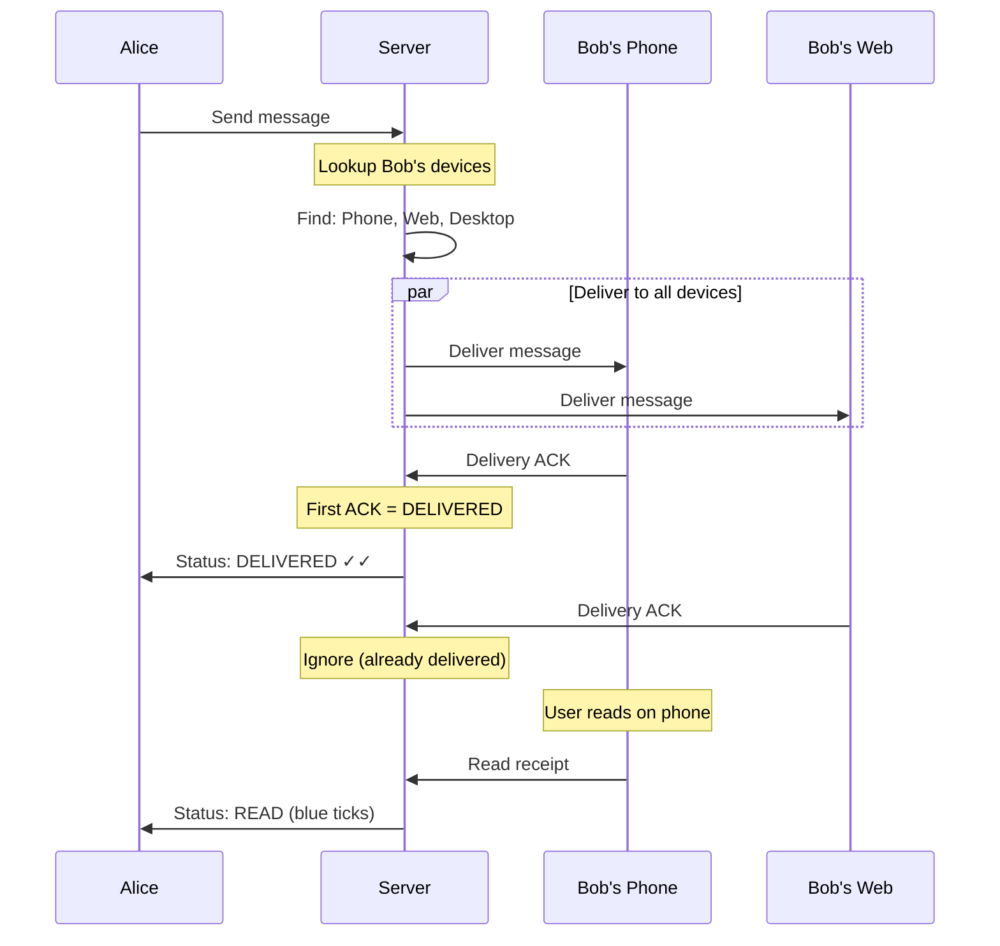
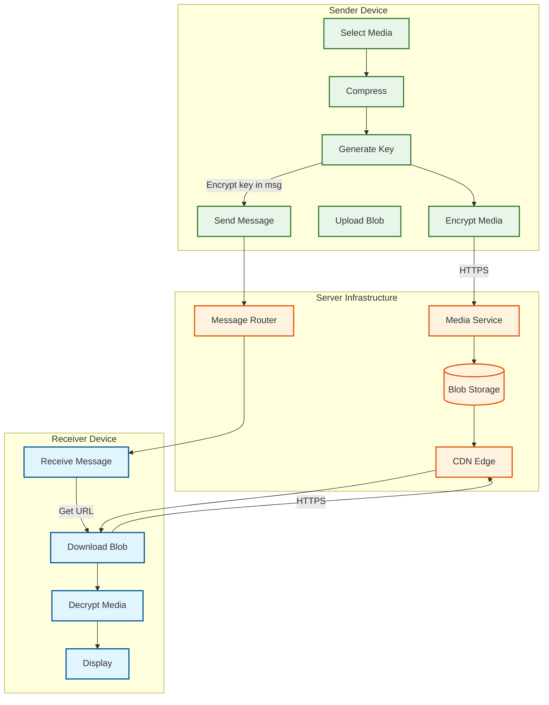

# WhatsApp: Deep Dive & Bottlenecks

## Table of Contents
- [Critical Component 1: Signal Protocol (E2EE)](#critical-component-1-signal-protocol-e2ee)
- [Critical Component 2: Message Delivery Pipeline](#critical-component-2-message-delivery-pipeline)
- [Critical Component 3: Media Handling](#critical-component-3-media-handling)
- [Critical Component 4: Voice/Video Calls](#critical-component-4-voicevideo-calls)
- [Bottleneck Analysis](#bottleneck-analysis)
- [Concurrency & Race Conditions](#concurrency--race-conditions)

---

## Critical Component 1: Signal Protocol (E2EE)

### Why This Is Critical

End-to-end encryption is WhatsApp's **core differentiator** and privacy promise:

- **Privacy Guarantee**: Even WhatsApp cannot read message content
- **Trust**: Users rely on this for sensitive communications
- **Legal**: Protects user data from subpoenas (content is inaccessible)
- **Competitive**: Primary reason many users choose WhatsApp over SMS

### Architecture Deep Dive

#### Signal Protocol Stack



#### X3DH Key Exchange Detail



#### Double Ratchet Chain Evolution



**Key Properties:**

| Property | Mechanism | Benefit |
|----------|-----------|---------|
| **Forward Secrecy** | DH Ratchet | Past messages protected if keys compromised |
| **Backward Secrecy** | DH Ratchet step | Recover security after compromise |
| **Unique Message Keys** | Symmetric Ratchet | Each message has different key |
| **Async Delivery** | X3DH with prekeys | Message encrypted offline recipient |

### Failure Modes & Mitigations

| Failure | Impact | Mitigation |
|---------|--------|------------|
| **Prekey Exhaustion** | Can't establish new sessions | Proactive replenishment (100 prekeys, upload when <20) |
| **Key Mismatch** | Decryption fails | Session reset, safety number notification |
| **Session Corruption** | Message loss | Local session backup, re-establishment |
| **Identity Key Change** | Potential MITM | Safety number verification, warning dialog |
| **Clock Skew** | Signature validation fails | Allow 24-hour tolerance window |

### Safety Numbers

```
ALGORITHM: Compute_Safety_Number

INPUT:
    - my_identity_key: Bytes[32]
    - their_identity_key: Bytes[32]
    - my_phone: String
    - their_phone: String

OUTPUT:
    - safety_number: String[60]  // 12 groups of 5 digits

PROCEDURE:
    // Concatenate in sorted order for consistency
    IF my_phone < their_phone:
        concat = my_identity_key || my_phone || their_identity_key || their_phone
    ELSE:
        concat = their_identity_key || their_phone || my_identity_key || my_phone

    // Iterative hashing (5200 iterations)
    hash = concat
    FOR i IN 1..5200:
        hash = SHA512(hash || concat)

    // Take first 30 bytes, convert to 12 groups of 5 digits
    safety_number = ""
    FOR i IN 0..11:
        chunk = hash[i*5 : i*5+5]
        number = BytesToInt(chunk) MOD 100000
        safety_number += Format(number, width=5)

    RETURN safety_number

// Result: "12345 67890 12345 67890 12345 67890 12345 67890 12345 67890 12345 67890"
```

---

## Critical Component 2: Message Delivery Pipeline

### Why This Is Critical

- **Core User Experience**: Message delivery is the primary function
- **Reliability**: Users expect guaranteed delivery
- **Real-Time**: Latency directly impacts user satisfaction
- **At Scale**: 140 billion messages/day requires efficient routing

### Store-and-Forward Architecture



### Tick System Implementation

```
MESSAGE STATE MACHINE:

┌──────────┐     Server ACK      ┌───────────┐     Device ACK      ┌────────────┐
│  PENDING │ ─────────────────► │   SENT    │ ─────────────────► │ DELIVERED  │
│          │                     │    ✓      │                     │    ✓✓      │
└──────────┘                     └───────────┘                     └────────────┘
                                                                         │
                                                                         │ Read ACK
                                                                         ▼
                                                                   ┌────────────┐
                                                                   │    READ    │
                                                                   │   ✓✓ blue  │
                                                                   └────────────┘
```

**Implementation Details:**

```
ALGORITHM: Update_Message_Status

INPUT:
    - message_id: UUID
    - new_status: SENT | DELIVERED | READ
    - timestamp: Timestamp

PROCEDURE:
    current = Get_Message_Status(message_id)

    // Status can only progress forward
    IF status_order(new_status) <= status_order(current.status):
        RETURN  // Ignore stale/duplicate updates

    // Update message record
    Update_Message(message_id, {
        status: new_status,
        [status + "_at"]: timestamp
    })

    // Notify sender if connected
    sender_connection = Presence_Lookup(current.sender_id)
    IF sender_connection != null:
        Send_Status_Update(sender_connection, {
            message_id: message_id,
            status: new_status,
            timestamp: timestamp
        })


FUNCTION: status_order(status)
    SWITCH status:
        CASE PENDING: RETURN 0
        CASE SENT: RETURN 1
        CASE DELIVERED: RETURN 2
        CASE READ: RETURN 3
```

### Multi-Device Delivery



### Failure Modes & Mitigations

| Failure | Impact | Mitigation |
|---------|--------|------------|
| **Gateway Crash** | Connection lost | Erlang supervisor restarts, client reconnects |
| **Message Lost in Transit** | No delivery | Client-side retry with message ID deduplication |
| **Offline Queue Full** | Messages rejected | Queue size limits, oldest message expiry |
| **Delivery ACK Lost** | Duplicate delivery | Idempotent delivery, client deduplication |
| **Push Notification Failure** | User unaware | Retry with exponential backoff, alternative channels |

---

## Critical Component 3: Media Handling

### Why This Is Critical

- **Large Payloads**: Media can be 100MB+ (videos)
- **Bandwidth Sensitive**: Many users on slow/metered connections
- **E2EE Requirement**: Media must be encrypted client-side
- **Storage Cost**: Petabytes of media data

### Media Flow Architecture



### Media Encryption Process

```
ALGORITHM: Encrypt_Media

INPUT:
    - media_bytes: Bytes
    - mime_type: String

OUTPUT:
    - encrypted_blob: Bytes
    - media_key: Bytes[32]
    - file_hash: Bytes[32]

PROCEDURE:
    // Step 1: Compress media (client-side)
    compressed = Compress_Media(media_bytes, mime_type)

    // Step 2: Generate random media key
    media_key = Random_Bytes(32)

    // Step 3: Derive encryption and MAC keys
    expanded = HKDF(media_key, info="WhatsApp Media Keys", length=112)
    enc_key = expanded[0:32]
    mac_key = expanded[32:64]
    iv = expanded[64:80]

    // Step 4: Encrypt with AES-256-CBC
    ciphertext = AES_256_CBC_Encrypt(enc_key, iv, compressed)

    // Step 5: Compute MAC
    mac = HMAC_SHA256(mac_key, iv || ciphertext)

    // Step 6: Combine
    encrypted_blob = ciphertext || mac[0:10]  // Truncated MAC

    // Step 7: Hash for integrity
    file_hash = SHA256(encrypted_blob)

    RETURN (encrypted_blob, media_key, file_hash)


ALGORITHM: Decrypt_Media

INPUT:
    - encrypted_blob: Bytes
    - media_key: Bytes[32]
    - expected_hash: Bytes[32]

OUTPUT:
    - media_bytes: Bytes

PROCEDURE:
    // Step 1: Verify hash
    actual_hash = SHA256(encrypted_blob)
    IF actual_hash != expected_hash:
        ABORT "File integrity check failed"

    // Step 2: Derive keys
    expanded = HKDF(media_key, info="WhatsApp Media Keys", length=112)
    enc_key = expanded[0:32]
    mac_key = expanded[32:64]
    iv = expanded[64:80]

    // Step 3: Extract ciphertext and MAC
    ciphertext = encrypted_blob[0:-10]
    received_mac = encrypted_blob[-10:]

    // Step 4: Verify MAC
    expected_mac = HMAC_SHA256(mac_key, iv || ciphertext)[0:10]
    IF received_mac != expected_mac:
        ABORT "MAC verification failed"

    // Step 5: Decrypt
    media_bytes = AES_256_CBC_Decrypt(enc_key, iv, ciphertext)

    RETURN media_bytes
```

### Compression Strategy

| Media Type | Compression | Target Size |
|------------|-------------|-------------|
| Image (Camera) | JPEG 80% quality | < 1MB |
| Image (Document) | Original | Original |
| Video | H.264, 480p/720p | < 16MB |
| Audio | Opus codec | ~2KB/sec |
| Voice Message | Opus, low bitrate | ~1KB/sec |

---

## Critical Component 4: Voice/Video Calls

### Why This Is Critical

- **Real-Time**: Latency > 300ms causes poor experience
- **NAT Traversal**: Most users behind NAT/firewall
- **Quality**: Bandwidth varies significantly
- **E2EE**: Call content must be encrypted

### Call Architecture

```mermaid
sequenceDiagram
    participant Alice
    participant Server as Signaling Server
    participant STUN as STUN/TURN
    participant Bob

    Note over Alice: Initiate call

    Alice->>Server: Call request (encrypted)
    Server->>Bob: Incoming call (ring)

    Bob->>Server: Accept call
    Server->>Alice: Call accepted

    par ICE Candidate Gathering
        Alice->>STUN: Get public address
        STUN-->>Alice: Alice's candidates
        Bob->>STUN: Get public address
        STUN-->>Bob: Bob's candidates
    end

    Alice->>Server: Alice's ICE candidates
    Server->>Bob: Forward candidates
    Bob->>Server: Bob's ICE candidates
    Server->>Alice: Forward candidates

    Note over Alice,Bob: ICE Connectivity Checks

    alt Direct P2P Possible
        Alice<-->Bob: Direct SRTP
    else NAT Blocks P2P
        Alice-->STUN: TURN relay
        STUN-->Bob: TURN relay
    end

    Note over Alice,Bob: Voice/Video via SRTP<br/>(AES-128-ICM encryption)
```

### Call Encryption

```
CALL ENCRYPTION SETUP:

1. Signaling encrypted with Signal Protocol (existing session)
2. Master secret derived from Signal session
3. SRTP keys derived from master secret:
   - Audio encryption key (AES-128)
   - Audio authentication key (HMAC)
   - Video encryption key (AES-128)
   - Video authentication key (HMAC)

MASTER SECRET DERIVATION:
master_secret = KDF(signal_session_key, "WhatsApp Call v1", 32)
audio_enc_key = KDF(master_secret, "audio_enc", 16)
audio_auth_key = KDF(master_secret, "audio_auth", 20)
video_enc_key = KDF(master_secret, "video_enc", 16)
video_auth_key = KDF(master_secret, "video_auth", 20)
```

### NAT Traversal Strategy

| NAT Type | P2P Possible | Fallback |
|----------|--------------|----------|
| Full Cone | Yes | - |
| Restricted Cone | Yes | - |
| Port Restricted | Sometimes | TURN relay |
| Symmetric | No | TURN relay |

---

## Bottleneck Analysis

### Bottleneck 1: Connection Server Memory

**Problem**: 500M concurrent connections × 2KB = 1TB RAM

**Analysis**:
```
Per-connection overhead:
- Erlang process: ~2KB
- TCP socket buffer: Configurable
- TLS session state: ~10KB (shared)
- User session state: ~1KB

Total per connection: ~3-5KB
For 2M connections per server: 6-10GB RAM
```

**Mitigations**:
1. **Aggressive Memory Tuning**: FreeBSD kernel parameters
2. **Connection Pooling**: For web clients, multiplex connections
3. **Smart Backgrounding**: Reduce state for backgrounded apps
4. **Vertical Scaling**: Large memory servers (256GB+)

### Bottleneck 2: Offline Queue Growth

**Problem**: Users offline for days accumulate queued messages

**Analysis**:
```
Scenario: User offline for 7 days
- Messages per day: 117 (average)
- 7 days: 819 messages
- Size per message: 500 bytes
- Total per user: ~400KB

If 10% of users offline (120M users):
Queue size = 120M × 400KB = 48TB
```

**Mitigations**:
1. **TTL Expiry**: 30-day max retention
2. **Priority Queuing**: Recent messages first
3. **Push Notification Aggressive**: Reduce offline duration
4. **Message Batching**: Compress multiple messages
5. **Disk Spillover**: Mnesia RAM + disk mode

### Bottleneck 3: Prekey Exhaustion

**Problem**: High-traffic users exhaust one-time prekeys quickly

**Analysis**:
```
Scenario: Celebrity account
- New conversations per day: 1000
- Prekeys uploaded: 100
- Exhaustion time: 2.4 hours

After exhaustion:
- Fallback to signed prekey only
- Reduced forward secrecy for first message
```

**Mitigations**:
1. **Proactive Upload**: Upload new prekeys when count < 20
2. **Larger Batches**: Upload 100+ prekeys
3. **Server Monitoring**: Alert on low prekey counts
4. **Graceful Fallback**: Signed prekey only (still secure)

### Bottleneck 4: Group Message Fan-out

**Problem**: Large groups require O(n) encryption operations

**Analysis**:
```
Scenario: 1000-member group
Without sender keys: 999 encryptions per message
With sender keys: 1 encryption, distribute key to 999 members

Key rotation on member leave:
- Must regenerate and redistribute sender key
- 999 pairwise encryptions for distribution
```

**Mitigations**:
1. **Sender Keys Protocol**: Single encryption, multicast delivery
2. **Lazy Key Rotation**: Batch member changes
3. **Group Size Limits**: 1024 members max
4. **MLS Protocol (Future)**: O(log n) key distribution

---

## Concurrency & Race Conditions

### Race 1: Simultaneous Multi-Device Message Receive

**Scenario**: Same message delivered to phone and web simultaneously

```
Timeline:
T0: Server sends message to phone and web
T1: Phone receives, advances ratchet to state S2
T1: Web receives, tries to advance ratchet from S1

Problem: Web has stale ratchet state
```

**Solution**:
```
- Each device pair maintains separate session
- Alice-Phone has session with Bob-Phone
- Alice-Web has session with Bob-Phone
- Messages sent to all device combinations
```

### Race 2: Concurrent Prekey Consumption

**Scenario**: Two users simultaneously fetch same one-time prekey

```
Timeline:
T0: Alice requests Bob's prekeys
T0: Charlie requests Bob's prekeys
T1: Both receive OPK_42
T2: Alice uses OPK_42 for X3DH
T2: Charlie uses OPK_42 for X3DH
T3: Bob receives two messages with same prekey

Problem: Prekey reuse violates forward secrecy
```

**Solution**:
```
- Atomic prekey claim on server
- Server marks OPK as used before returning
- Second requestor gets different OPK or null
- Fallback to signed prekey only if no OPK available
```

### Race 3: Message Ordering Across Devices

**Scenario**: User sends messages from phone and web rapidly

```
Timeline:
T0: Phone sends "Hello" (msg_1)
T0: Web sends "World" (msg_2)
T1: Server receives msg_2 first
T2: Server receives msg_1

Problem: Recipient sees "World" before "Hello"
```

**Solution**:
```
- Client-side timestamps for ordering
- Messages ordered by (conversation_id, client_timestamp)
- Clock sync requirements
- Tie-breaker: message_id for same timestamp
```

### Race 4: Group Membership Change During Send

**Scenario**: Member removed while message in flight

```
Timeline:
T0: Alice starts sending message to group
T1: Admin removes Bob from group
T2: Alice's message reaches Bob (already removed)

Problem: Removed member receives message
```

**Solution**:
```
- Server-side membership check on delivery
- Message rejected if sender/recipient not in group
- Sender notified of delivery failure
- Eventual consistency acceptable (brief window)
```

### Race 5: Connection Takeover

**Scenario**: User reconnects from new location while old connection active

```
Timeline:
T0: User connected on Gateway A
T1: User opens app on different network
T2: New connection to Gateway B
T3: Both connections claim same user

Problem: Message routing confusion
```

**Solution**:
```
- Presence update: new connection invalidates old
- Old connection receives DISCONNECT message
- Single source of truth in presence store
- Atomic presence update (CAS operation)
```
