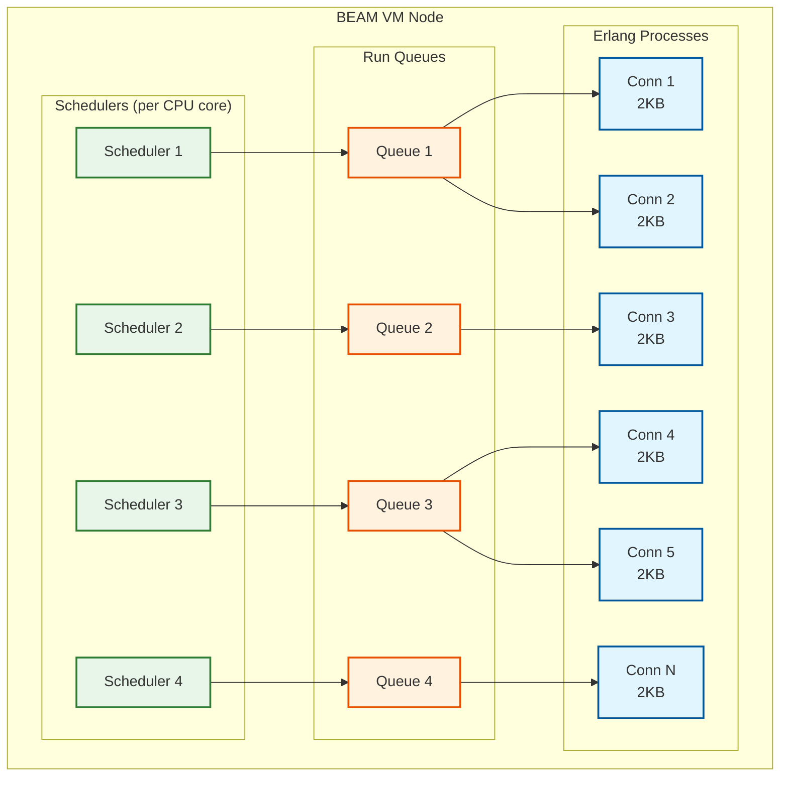
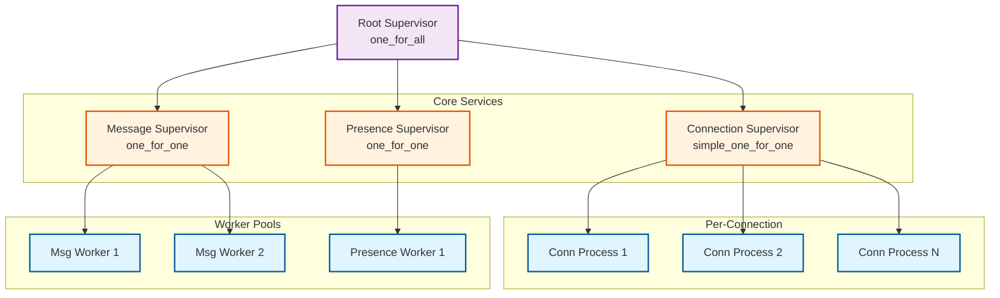
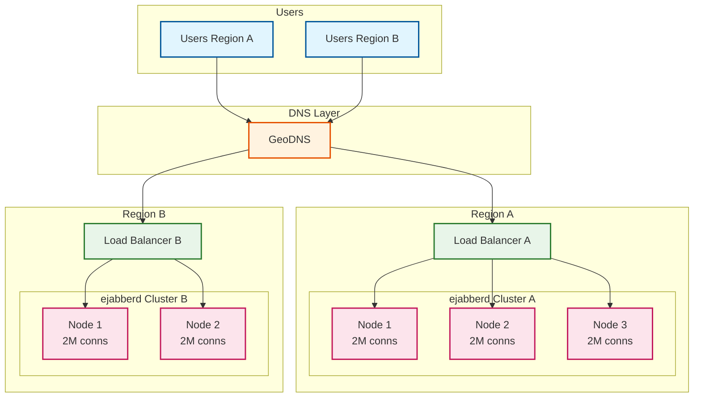
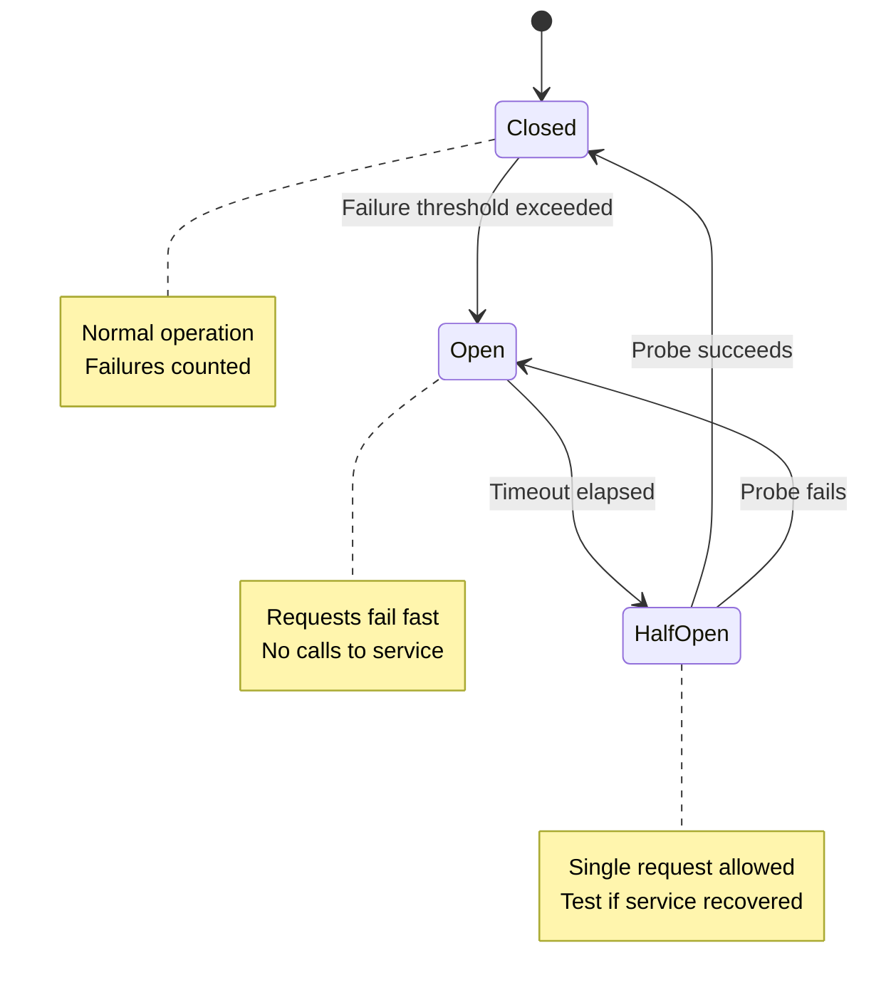
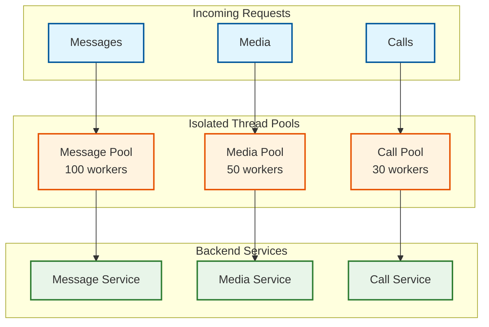
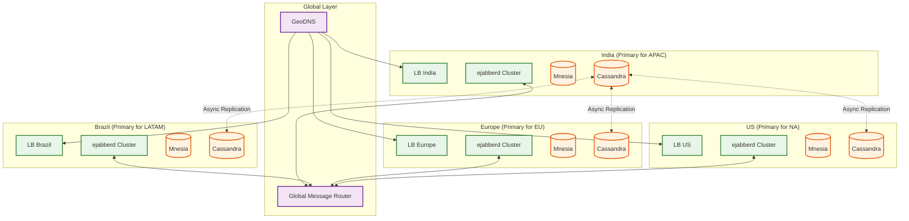

# WhatsApp: Scalability & Reliability

## Table of Contents
- [Erlang/BEAM Architecture](#erlangbeam-architecture)
- [Horizontal Scaling Strategy](#horizontal-scaling-strategy)
- [Fault Tolerance Patterns](#fault-tolerance-patterns)
- [Multi-Region Architecture](#multi-region-architecture)
- [Disaster Recovery](#disaster-recovery)
- [Capacity Planning](#capacity-planning)

---

## Erlang/BEAM Architecture

### Why Erlang for WhatsApp

WhatsApp's choice of Erlang is the foundation of its exceptional scalability. The BEAM virtual machine was designed for telecom systems with exactly the requirements WhatsApp has.

```
┌────────────────────────────────────────────────────────────────────────────┐
│                         ERLANG/BEAM ADVANTAGES                             │
├────────────────────────────────────────────────────────────────────────────┤
│                                                                            │
│  LIGHTWEIGHT PROCESSES                                                     │
│  ─────────────────────                                                     │
│  • Each connection = 1 Erlang process                                      │
│  • Process size: ~2KB (vs ~1MB for OS threads)                             │
│  • 2 million processes per node is normal                                  │
│  • Scheduling: Preemptive, work-stealing                                   │
│                                                                            │
│  FAULT ISOLATION                                                           │
│  ───────────────                                                           │
│  • Processes share nothing (isolated heaps)                                │
│  • One crash doesn't affect others                                         │
│  • "Let it crash" philosophy                                               │
│  • Supervisors auto-restart crashed processes                              │
│                                                                            │
│  HOT CODE SWAPPING                                                         │
│  ─────────────────                                                         │
│  • Deploy new code without disconnecting users                             │
│  • Active processes transition to new code                                 │
│  • Zero-downtime deployments                                               │
│                                                                            │
│  SOFT REAL-TIME                                                            │
│  ──────────────                                                            │
│  • Predictable latency (no stop-the-world GC)                              │
│  • Per-process garbage collection                                          │
│  • Consistent response times                                               │
│                                                                            │
│  DISTRIBUTION                                                              │
│  ────────────                                                              │
│  • Built-in clustering                                                     │
│  • Transparent remote messaging                                            │
│  • Location-independent process IDs                                        │
│                                                                            │
└────────────────────────────────────────────────────────────────────────────┘
```

### BEAM Process Model



### Supervisor Tree Pattern



**Supervision Strategies:**

| Strategy | Behavior | Use Case |
|----------|----------|----------|
| `one_for_one` | Restart only crashed child | Independent workers |
| `one_for_all` | Restart all children | Interdependent processes |
| `rest_for_one` | Restart crashed and all started after | Ordered dependencies |
| `simple_one_for_one` | Dynamic children, same template | Connection processes |

### Hot Code Swapping

```
ALGORITHM: Hot_Code_Swap

PROCEDURE:
    // Step 1: Load new module version
    code:load_file(message_handler_v2)

    // Step 2: Old processes continue with old code
    // New processes use new code

    // Step 3: When old process makes function call:
    //   - External call: Uses new code
    //   - Internal call: Uses old code

    // Step 4: Eventually all processes transition
    // No connections dropped

EXAMPLE TIMELINE:
    T0: message_handler v1 running (1M processes)
    T1: Load message_handler v2
    T2: New connections get v2
    T3: Existing v1 processes make external call → now on v2
    T4: All processes on v2
    T5: Purge v1 code from memory
```

---

## Horizontal Scaling Strategy

### Connection Layer Scaling



### Sharding Strategy

| Data Type | Shard Key | Distribution |
|-----------|-----------|--------------|
| Users | `hash(phone_number) % N` | Even distribution |
| Connections | `hash(user_id) % N` | Consistent hashing |
| Offline Queue | `recipient_user_id` | Co-located with user |
| Groups | `group_id` | Separate partition |
| Messages | `conversation_id` | Co-located by conversation |

### Connection Routing

```
ALGORITHM: Route_Connection

INPUT:
    - phone_number: String
    - client_ip: IP

OUTPUT:
    - gateway_node: String

PROCEDURE:
    // Step 1: GeoDNS selects region based on client IP
    region = GeoDNS_Resolve(client_ip)

    // Step 2: Consistent hash to select node within region
    hash_value = Consistent_Hash(phone_number)
    nodes = Get_Healthy_Nodes(region)
    node_index = hash_value % len(nodes)
    gateway_node = nodes[node_index]

    // Step 3: If node unhealthy, failover to next
    WHILE NOT gateway_node.is_healthy():
        node_index = (node_index + 1) % len(nodes)
        gateway_node = nodes[node_index]

    RETURN gateway_node
```

### Capacity Calculations

```
SCALE NUMBERS:

Single Node Capacity:
- CPU cores: 64
- RAM: 256 GB
- Connections: 2 million
- Messages/sec: 100,000

Cluster Capacity (per region):
- Nodes: 100
- Connections: 200 million
- Messages/sec: 10 million

Global Capacity:
- Regions: 5
- Total nodes: 500
- Connections: 1 billion
- Messages/sec: 50 million
```

---

## Fault Tolerance Patterns

### "Let It Crash" Philosophy

```
TRADITIONAL APPROACH vs ERLANG APPROACH:

Traditional:
    try {
        processMessage(msg);
    } catch (Exception e) {
        log.error("Failed", e);
        rollback();
        retry();
        if (stillFails) {
            alertOps();
            gracefulShutdown();
        }
    }

Erlang:
    process_message(Msg) ->
        % Just do the work
        % If it fails, supervisor restarts us
        handle(Msg).

    % Supervisor config
    {message_handler, {message_handler, start_link, []},
        permanent, 5000, worker, [message_handler]}
```

### Circuit Breaker Pattern



```
ALGORITHM: Circuit_Breaker

STATE:
    state: CLOSED | OPEN | HALF_OPEN
    failure_count: Integer
    last_failure_time: Timestamp
    success_count: Integer

CONFIG:
    failure_threshold: 5
    timeout: 30 seconds
    probe_interval: 5 seconds

ON call(request):
    IF state == OPEN:
        IF Now() - last_failure_time > timeout:
            state = HALF_OPEN
        ELSE:
            RETURN Error("Circuit open")

    IF state == HALF_OPEN:
        TRY:
            result = execute(request)
            success_count += 1
            IF success_count >= 3:
                state = CLOSED
                failure_count = 0
            RETURN result
        CATCH:
            state = OPEN
            last_failure_time = Now()
            THROW

    // state == CLOSED
    TRY:
        result = execute(request)
        failure_count = max(0, failure_count - 1)
        RETURN result
    CATCH:
        failure_count += 1
        IF failure_count >= failure_threshold:
            state = OPEN
            last_failure_time = Now()
        THROW
```

### Bulkhead Pattern



**Benefit**: Media service failure doesn't impact messaging.

### Retry with Exponential Backoff

```
ALGORITHM: Retry_With_Backoff

INPUT:
    - operation: Function
    - max_retries: Integer (default 5)
    - base_delay: Duration (default 100ms)
    - max_delay: Duration (default 30s)
    - jitter: Float (default 0.1)

PROCEDURE:
    retry_count = 0

    WHILE retry_count <= max_retries:
        TRY:
            RETURN operation()
        CATCH error:
            IF NOT is_retriable(error):
                THROW error

            retry_count += 1
            IF retry_count > max_retries:
                THROW MaxRetriesExceeded(error)

            // Calculate delay with exponential backoff
            delay = min(base_delay * (2 ^ retry_count), max_delay)

            // Add jitter to prevent thundering herd
            delay = delay * (1 + random(-jitter, jitter))

            sleep(delay)


EXAMPLE DELAYS (base=100ms, max=30s):
    Retry 1: 200ms ± jitter
    Retry 2: 400ms ± jitter
    Retry 3: 800ms ± jitter
    Retry 4: 1600ms ± jitter
    Retry 5: 3200ms ± jitter
```

---

## Multi-Region Architecture

### Global Topology



### Cross-Region Message Routing

```
SCENARIO: Alice (India) → Bob (Brazil)

FLOW:
1. Alice connects to India Gateway
2. Alice sends encrypted message
3. India Gateway → Global Message Router
4. Router looks up Bob's home region (Brazil)
5. Route message to Brazil Gateway
6. Brazil Gateway delivers to Bob
7. Bob sends ACK → reverse path → Alice

LATENCY BUDGET:
- India Gateway processing: 5ms
- India → Global Router: 10ms
- Global Router lookup: 2ms
- Global Router → Brazil: 200ms (intercontinental)
- Brazil Gateway processing: 5ms
- Delivery to Bob: 10ms
─────────────────────────────
Total: ~235ms (within SLO)
```

### Data Residency Considerations

| Data Type | Residency | Replication |
|-----------|-----------|-------------|
| User Profile | Home region | Async to all |
| Messages (in-transit) | Home region | None (E2EE) |
| Offline Queue | Home region | None |
| Prekeys | Home region | Async to all |
| Group Metadata | Creator's region | Async to all |

### Region Failover

```
ALGORITHM: Region_Failover

TRIGGERS:
    - Region health check fails for 30 seconds
    - Manual operator trigger

PROCEDURE:
    // Step 1: Update DNS
    Remove_DNS_Records(failed_region)

    // Step 2: Redirect connections
    FOR user IN users_in_region(failed_region):
        next_region = Get_Secondary_Region(user)
        Update_User_Region(user, next_region)

    // Step 3: Migrate offline queues (if possible)
    IF data_accessible(failed_region):
        FOR queue IN offline_queues(failed_region):
            Replicate_Queue(queue, Get_Secondary_Region(queue.user))

    // Step 4: Notify clients
    Push_Notification_All(failed_region, "Please reconnect")

RECOVERY:
    // When region comes back:
    1. Run health checks
    2. Gradually add DNS records back
    3. Migrate users back to home region
    4. Resume normal operation
```

---

## Disaster Recovery

### RTO and RPO

| Data Type | RPO | RTO | Strategy |
|-----------|-----|-----|----------|
| User Accounts | 1 hour | 4 hours | Cassandra multi-DC replication |
| Prekeys | 1 hour | 4 hours | Cassandra multi-DC replication |
| Messages (offline queue) | N/A | N/A | E2EE - client has copy |
| Group Metadata | 1 hour | 4 hours | Cassandra multi-DC replication |
| Active Connections | N/A | < 30 sec | Clients auto-reconnect |

### Backup Strategy

```
DATA BACKUP MATRIX:

┌────────────────┬───────────────┬─────────────┬──────────────────┐
│ Data           │ Frequency     │ Retention   │ Method           │
├────────────────┼───────────────┼─────────────┼──────────────────┤
│ User DB        │ Continuous    │ 30 days     │ Cassandra SST    │
│ Prekey DB      │ Continuous    │ 30 days     │ Cassandra SST    │
│ Config         │ On change     │ Forever     │ Git + snapshots  │
│ Mnesia tables  │ Hourly        │ 7 days      │ mnesia:backup/1  │
│ Media blobs    │ Continuous    │ 30 days     │ Blob replication │
└────────────────┴───────────────┴─────────────┴──────────────────┘
```

### E2EE Implications for DR

```
CHALLENGE: E2EE means server cannot recover message content

IMPLICATIONS:
1. Messages in offline queue are encrypted
   → Server backup contains ciphertext only
   → User's device has keys

2. If user loses device AND backup:
   → Messages are lost forever
   → This is a feature, not a bug (privacy)

3. Recovery options:
   → iCloud/Google Drive encrypted backup (user's password)
   → Multi-device: messages on other devices
   → No server-side message recovery

WHAT CAN BE RECOVERED:
- User account (phone verification)
- Contact list (synced from phone)
- Group memberships
- Profile information
```

---

## Capacity Planning

### Scaling Triggers

| Metric | Threshold | Action |
|--------|-----------|--------|
| Connections per node | > 1.8M | Add node |
| CPU utilization | > 70% sustained | Add node |
| Memory utilization | > 80% | Add node or increase RAM |
| Offline queue depth | > 100M messages | Add queue capacity |
| Message latency p99 | > 500ms | Investigate, add capacity |
| Prekey inventory | < 10 per user | Alert, trigger replenishment |

### Capacity Planning Formula

```
CONNECTIONS:
    Required nodes = (Peak concurrent users) / (Connections per node)
    Buffer = 1.5x for headroom
    Example: 500M users / 2M per node * 1.5 = 375 nodes

MESSAGE THROUGHPUT:
    Required capacity = Peak messages/sec
    Per node capacity = 100K msg/sec
    Nodes for throughput = 5M / 100K = 50 nodes

STORAGE (Offline Queue):
    Avg offline users = 10% of DAU = 120M
    Avg messages per offline user = 50
    Avg message size = 500 bytes
    Queue size = 120M * 50 * 500B = 3TB

MEMORY:
    Per connection = 3KB (process + buffers)
    Per node (2M connections) = 6GB
    Total for 500M connections = 1.5TB
```

### Load Testing Strategy

```
LOAD TEST SCENARIOS:

1. Steady State
   - Simulate normal daily traffic pattern
   - 1.6M messages/sec sustained
   - Validate latency SLOs

2. Peak Load
   - Simulate New Year's Eve (5x normal)
   - 8M messages/sec
   - Measure degradation

3. Regional Failure
   - Kill one region's connections
   - Validate failover time
   - Measure recovery

4. Thundering Herd
   - Simulate outage recovery
   - 500M connections in 5 minutes
   - Rate limit connection acceptance

5. Slow Backend
   - Inject latency into Cassandra
   - Validate circuit breakers
   - Measure queue growth
```

### Growth Projection Planning

```
YEAR-OVER-YEAR GROWTH MODEL:

Metric               Current     Y1        Y2        Y3
───────────────────────────────────────────────────────────
MAU                  2.0B        2.2B      2.4B      2.6B
DAU                  1.2B        1.3B      1.45B     1.55B
Messages/day         140B        160B      180B      200B
Concurrent conns     500M        550M      620M      700M
Connection nodes     375         410       465       525
Storage (annual)     10PB        12PB      15PB      18PB

INFRASTRUCTURE SCALING:
- Plan 18 months ahead
- Procure hardware 12 months ahead
- Deploy 6 months ahead of projected need
- Reserve 50% headroom for traffic spikes
```
