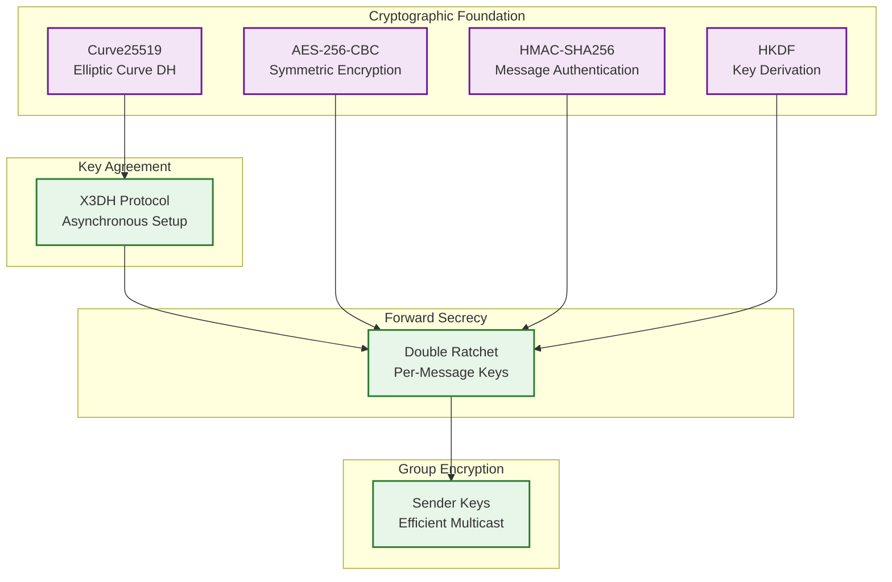
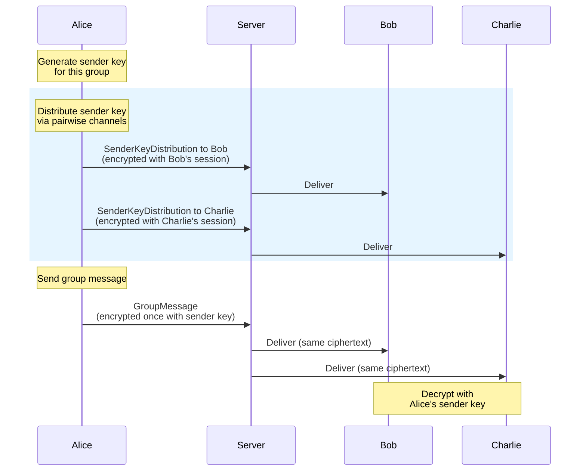
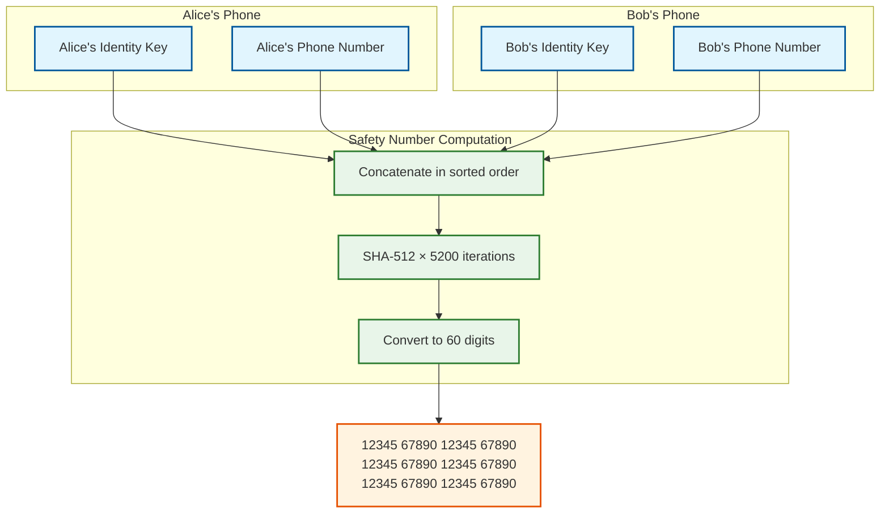
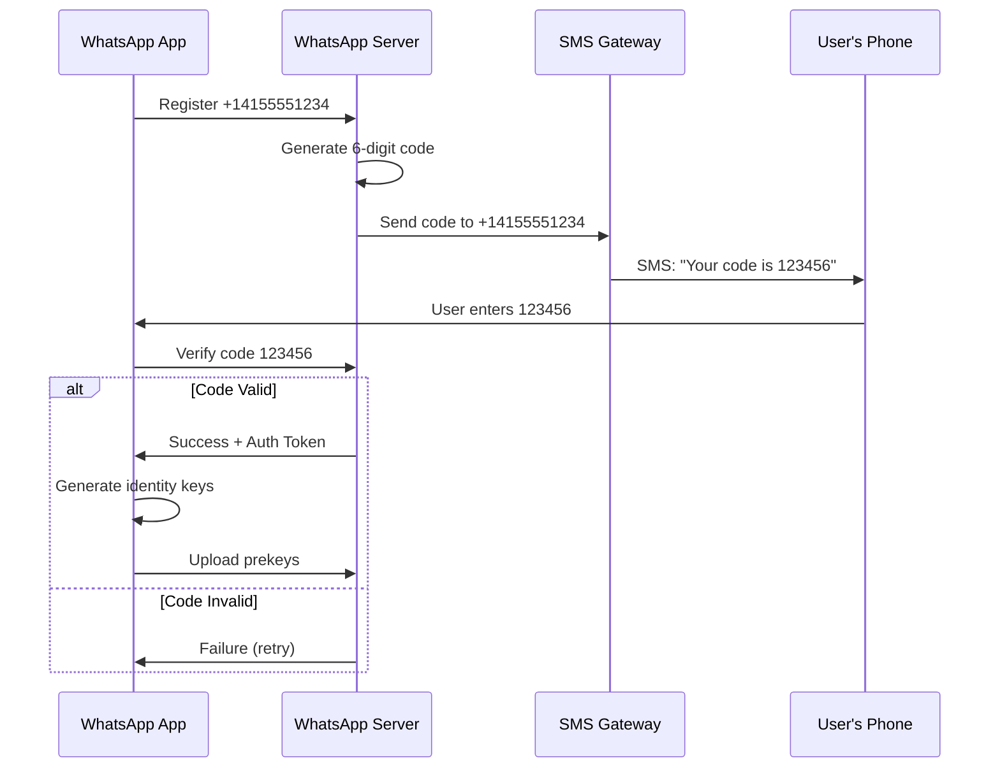

# WhatsApp: Security & Compliance

## Table of Contents
- [End-to-End Encryption Deep Dive](#end-to-end-encryption-deep-dive)
- [Group E2EE](#group-e2ee)
- [Threat Model](#threat-model)
- [Safety Numbers](#safety-numbers)
- [Authentication & Identity](#authentication--identity)
- [Data Security](#data-security)
- [Compliance](#compliance)

---

## End-to-End Encryption Deep Dive

### Signal Protocol Overview

WhatsApp's end-to-end encryption is built on the Signal Protocol, providing the strongest guarantees for messaging privacy.



### Key Types

| Key Type | Lifetime | Purpose | Size |
|----------|----------|---------|------|
| **Identity Key** | Permanent | Long-term identity, MITM protection | 32 bytes (Curve25519) |
| **Signed Prekey** | 1 month | Medium-term, async session setup | 32 bytes + 64 byte signature |
| **One-Time Prekey** | Single use | Additional forward secrecy | 32 bytes |
| **Root Key** | Per ratchet step | Derives chain keys | 32 bytes |
| **Chain Key** | Per message direction | Derives message keys | 32 bytes |
| **Message Key** | Single message | Encrypts one message | 32 bytes |

### Security Properties

```
┌─────────────────────────────────────────────────────────────────────────┐
│  SIGNAL PROTOCOL SECURITY PROPERTIES                                   │
├─────────────────────────────────────────────────────────────────────────┤
│                                                                         │
│  FORWARD SECRECY                                                        │
│  ────────────────                                                       │
│  If long-term keys are compromised, past messages remain secure.       │
│  Each message uses a unique key derived from the ratchet.              │
│  Compromising today's key doesn't reveal yesterday's messages.         │
│                                                                         │
│  BACKWARD SECRECY (Future Secrecy)                                      │
│  ──────────────────────────────────                                     │
│  If current session is compromised, security is restored after         │
│  the next DH ratchet step.                                             │
│  System is "self-healing" - compromise impact is limited.              │
│                                                                         │
│  AUTHENTICITY                                                           │
│  ─────────────                                                          │
│  Messages can only come from someone who knows the private key.        │
│  HMAC ensures message integrity (no tampering).                        │
│                                                                         │
│  DENIABILITY                                                            │
│  ───────────                                                            │
│  No cryptographic proof that a specific person sent a message.         │
│  Either party could have forged the message.                           │
│  Important for whistleblowers, journalists.                            │
│                                                                         │
│  ASYNCHRONOUS                                                           │
│  ────────────                                                           │
│  Can establish secure session even if recipient is offline.            │
│  X3DH uses prekeys uploaded to server.                                 │
│                                                                         │
└─────────────────────────────────────────────────────────────────────────┘
```

### Message Encryption Flow

```
MESSAGE ENCRYPTION:

1. Get current sending chain key (CK_s)
2. Derive message key: MK = HMAC-SHA256(CK_s, 0x01)
3. Update chain key: CK_s' = HMAC-SHA256(CK_s, 0x02)
4. Generate random IV (16 bytes)
5. Encrypt: ciphertext = AES-256-CBC(MK, IV, plaintext)
6. Authenticate: MAC = HMAC-SHA256(MK, ciphertext)
7. Header = {ratchet_public_key, counter, previous_counter}

WIRE FORMAT:
┌─────────────────────────────────────────────────────────────┐
│ Header (encrypted separately with session key)              │
├─────────────────────────────────────────────────────────────┤
│ Ratchet Public Key (32 bytes)                               │
│ Counter (4 bytes)                                           │
│ Previous Counter (4 bytes)                                  │
├─────────────────────────────────────────────────────────────┤
│ Message Body                                                │
├─────────────────────────────────────────────────────────────┤
│ IV (16 bytes)                                               │
│ Ciphertext (variable)                                       │
│ MAC (32 bytes, truncated to 10 bytes on wire)               │
└─────────────────────────────────────────────────────────────┘
```

---

## Group E2EE

### Sender Keys Protocol

For group messaging, WhatsApp uses the Sender Keys protocol to achieve efficient E2EE.



### Sender Key Distribution

```
ALGORITHM: Distribute_Sender_Key

INPUT:
    - group_id: UUID
    - members: [UserId]

PROCEDURE:
    // Generate my sender key for this group
    chain_key = Random_Bytes(32)
    signing_keypair = Curve25519_Generate()

    sender_key = SenderKey {
        key_id: Random_Int32(),
        chain_key: chain_key,
        signing_key: signing_keypair.public,
        iteration: 0
    }

    // Distribute to each member
    FOR member IN members WHERE member != my_user_id:
        // Get or create pairwise Double Ratchet session
        session = Get_Session(my_user_id, member)

        distribution_msg = SenderKeyDistributionMessage {
            group_id: group_id,
            sender_key_id: sender_key.key_id,
            chain_key: sender_key.chain_key,
            signing_key: sender_key.signing_key
        }

        // Encrypt distribution message with Double Ratchet
        encrypted = DoubleRatchet_Encrypt(session, distribution_msg)
        Send_To_Server(member, encrypted, type=SENDER_KEY_DISTRIBUTION)

    Store_My_Sender_Key(group_id, sender_key)
```

### Group Message Encryption

```
ALGORITHM: Group_Encrypt

INPUT:
    - group_id: UUID
    - plaintext: Bytes

OUTPUT:
    - ciphertext: Bytes

PROCEDURE:
    sender_key = Get_My_Sender_Key(group_id)

    // Symmetric ratchet step
    message_key = HKDF(sender_key.chain_key, "GroupMsgKey", 32)
    sender_key.chain_key = HKDF(sender_key.chain_key, "GroupChainKey", 32)
    sender_key.iteration += 1

    // Encrypt
    iv = Random_Bytes(16)
    ciphertext = AES_256_CBC(message_key, iv, plaintext)

    // Sign for authenticity
    signature = Ed25519_Sign(sender_key.signing_private, ciphertext)

    group_msg = GroupMessage {
        sender_key_id: sender_key.key_id,
        iteration: sender_key.iteration,
        iv: iv,
        ciphertext: ciphertext,
        signature: signature
    }

    RETURN group_msg.serialize()
```

### Member Addition/Removal

```
MEMBER ADDITION:
1. Admin adds new member via pairwise message to server
2. Server updates group membership
3. All existing members send their sender keys to new member
4. New member can decrypt future messages

MEMBER REMOVAL (Security Critical):
1. Admin removes member via pairwise message
2. Server updates group membership
3. ALL members must generate NEW sender keys
4. ALL members redistribute keys to remaining members
5. Removed member cannot decrypt new messages

COMPLEXITY:
- Addition: O(n) - n members send key to 1 new member
- Removal: O(n²) - n members send new keys to n-1 members
- This is why groups have size limits (1024)
```

### MLS Protocol (Future)

WhatsApp has indicated plans to adopt Message Layer Security (MLS) for improved group encryption:

| Aspect | Sender Keys | MLS |
|--------|-------------|-----|
| Member add cost | O(n) | O(log n) |
| Member remove cost | O(n²) | O(log n) |
| Max group size | ~1000 | 50,000+ |
| Forward secrecy | Per sender key rotation | Continuous |
| Standardization | WhatsApp-specific | IETF standard |

---

## Threat Model

### STRIDE Analysis

| Threat | Description | WhatsApp Mitigation |
|--------|-------------|---------------------|
| **Spoofing** | Impersonate another user | Phone verification, identity keys |
| **Tampering** | Modify message content | E2EE + HMAC authentication |
| **Repudiation** | Deny sending message | E2EE provides deniability (feature) |
| **Information Disclosure** | Read message content | E2EE (server cannot read) |
| **Denial of Service** | Prevent message delivery | Rate limiting, abuse detection |
| **Elevation of Privilege** | Access other user's data | Session isolation, key separation |

### What WhatsApp CAN See (Metadata)

```
┌─────────────────────────────────────────────────────────────────────────┐
│  METADATA VISIBLE TO WHATSAPP                                          │
├─────────────────────────────────────────────────────────────────────────┤
│                                                                         │
│  ALWAYS VISIBLE:                                                        │
│  • Phone numbers of sender and recipient                                │
│  • Timestamp of message                                                 │
│  • IP addresses                                                         │
│  • Device information                                                   │
│  • Message size (encrypted)                                             │
│  • Media file size                                                      │
│  • Group membership                                                     │
│  • Online/offline status                                                │
│  • Last seen timestamp                                                  │
│                                                                         │
│  NEVER VISIBLE:                                                         │
│  • Message content (text)                                               │
│  • Media content (photos, videos)                                       │
│  • Voice message content                                                │
│  • Call content                                                         │
│  • Contact cards shared                                                 │
│  • Location data shared                                                 │
│                                                                         │
│  LEGAL CONSIDERATIONS:                                                  │
│  • Metadata can reveal communication patterns                           │
│  • "Who talks to whom" is still sensitive                               │
│  • Traffic analysis possible without content                            │
│                                                                         │
└─────────────────────────────────────────────────────────────────────────┘
```

### Attack Vectors & Mitigations

| Attack | Description | Mitigation |
|--------|-------------|------------|
| **MITM (Key Substitution)** | Server substitutes identity keys | Safety numbers verification |
| **Prekey Replay** | Reuse one-time prekeys | Server deletes after one use |
| **Ratchet State Corruption** | Tamper with session state | Re-establish session |
| **Metadata Analysis** | Traffic pattern analysis | Cannot prevent fully (E2EE limit) |
| **Endpoint Compromise** | Malware on device | Out of scope (device security) |
| **Backup Compromise** | Access encrypted backup | User-controlled backup password |
| **Social Engineering** | Trick user into sharing | User education, verification prompts |

### Server Compromise Scenario

```
SCENARIO: WhatsApp servers are fully compromised

WHAT ATTACKER CANNOT DO:
✗ Read past messages (encrypted with old keys)
✗ Read current messages (don't have device keys)
✗ Forge messages as another user
✗ Access voice/video call content

WHAT ATTACKER CAN DO:
✓ See metadata (who talks to whom)
✓ See message timing and sizes
✓ Block/delay message delivery
✓ Attempt MITM on NEW sessions (detected by safety numbers)
✓ Serve malicious app updates (separate attack)

DETECTION:
- Safety number verification detects key substitution
- Message delays/failures indicate tampering
- Out-of-band verification (call the person)
```

---

## Safety Numbers

### How Safety Numbers Work

Safety numbers allow users to verify they're communicating with the right person and detect MITM attacks.



### Verification Methods

| Method | Security Level | Convenience |
|--------|----------------|-------------|
| **QR Code Scan** | High | Medium (in-person) |
| **Number Comparison** | High | Low (60 digits) |
| **Voice Verification** | Medium | High (phone call) |
| **Visual Comparison** | Medium | Medium |

### Key Change Notification

```
SCENARIO: Alice reinstalls WhatsApp

1. Alice's new installation generates new identity key
2. Bob receives message from Alice with new key
3. Bob's app shows: "Alice's security code changed"
4. Options:
   a. Verify (compare safety numbers)
   b. Accept without verification
   c. Block contact

LEGITIMATE REASONS FOR KEY CHANGE:
- Reinstalled app
- New phone
- Cleared app data
- Factory reset

SUSPICIOUS INDICATORS:
- Key changes frequently
- Sender denies reinstalling
- Key changes right before sensitive conversation
```

---

## Authentication & Identity

### Phone Number Verification



### Multi-Factor Authentication (2FA)

```
WHATSAPP TWO-STEP VERIFICATION:

Setup:
1. User sets a 6-digit PIN
2. Optional: Add email for recovery
3. PIN stored as hash on server

On New Device Registration:
1. Phone number verification (SMS)
2. Enter 6-digit PIN
3. If forgotten + no email: 7-day wait

Protection:
- Prevents SIM swap attacks (alone)
- Adds layer beyond SMS
- PIN required periodically (reminder)
```

### Multi-Device Security

```
LINKED DEVICE MODEL:

PRIMARY DEVICE (Phone):
- Owns the account
- Authorizes linked devices
- Can revoke linked devices
- Required for initial setup

LINKED DEVICES (Web, Desktop):
- Get separate identity keys
- Authorized by primary
- Can send/receive independently
- Max 4 linked devices

MESSAGE DELIVERY:
- Messages sent to all devices
- Each device decrypts with own session
- Sync via server (encrypted)

SECURITY MODEL:
- Linked device compromise: limited to that device
- Primary compromise: all devices affected
- Logout: linked devices lose access immediately
```

---

## Data Security

### Encryption at Rest

| Data | Storage | Encryption |
|------|---------|------------|
| Messages (offline queue) | Mnesia | E2EE ciphertext stored |
| User profiles | Cassandra | Transparent Data Encryption (TDE) |
| Prekeys | PostgreSQL | TDE + Hardware Security Module |
| Media blobs | Blob Storage | E2EE (client-side encryption) |
| Backups | iCloud/Google Drive | User password + AES-256 |

### Encryption in Transit

```
TRANSPORT SECURITY LAYERS:

Layer 1: TLS 1.3 (Internet)
- Between client and WhatsApp edge
- Certificate pinning
- Perfect forward secrecy

Layer 2: Noise Protocol (WhatsApp specific)
- Custom transport encryption
- Additional authentication
- Protects against certain attacks

Layer 3: Signal Protocol (Message content)
- End-to-end encryption
- Server is blind
- Forward and backward secrecy

Result: Triple-encrypted messages
```

### Key Management

```
KEY STORAGE:

ON DEVICE:
- Identity key (permanent, secure enclave if available)
- Session states (encrypted local database)
- Sender keys (per group)

ON SERVER:
- Signed prekeys (public only)
- One-time prekeys (public only)
- NO private keys ever leave device

KEY BACKUP (optional):
- User sets backup password
- Identity key encrypted with password-derived key
- Uploaded to iCloud/Google Drive
- WhatsApp cannot access without password
```

---

## Compliance

### GDPR Compliance

| Right | Implementation |
|-------|----------------|
| **Right to Access** | Download Your Data feature |
| **Right to Erasure** | Delete Account (removes from servers) |
| **Right to Portability** | Export chat history |
| **Consent** | Privacy policy acceptance |
| **Data Minimization** | Store-and-forward, minimal retention |

### Law Enforcement Response

```
WHAT WHATSAPP CAN PROVIDE (with legal process):

✓ Basic subscriber info (phone, registration date)
✓ Account information (profile info)
✓ Blocked contacts list
✓ Group membership
✓ Address book (if backed up)
✓ Metadata (who, when, but not what)

WHAT WHATSAPP CANNOT PROVIDE:

✗ Message content (E2EE)
✗ Call content (E2EE)
✗ Media content (E2EE)
✗ Voice message content (E2EE)

LEGAL DEBATES:
- Governments request "backdoors"
- WhatsApp maintains E2EE is essential
- "Lawful access" discussions ongoing
- Client-side scanning proposals controversial
```

### Regional Considerations

| Region | Requirement | WhatsApp Approach |
|--------|-------------|-------------------|
| **EU (GDPR)** | Data protection, consent | Compliant, data export |
| **India (IT Rules)** | Traceability | Challenged legally |
| **Brazil (Marco Civil)** | Data localization | Local processing |
| **UK (Online Safety)** | Content moderation | Metadata-based detection |
| **USA (CLOUD Act)** | Cross-border access | Legal process required |

### Content Moderation Limitations

```
MODERATION APPROACH:

WHAT CAN BE MODERATED (Metadata):
- Spam patterns (rapid messaging)
- Bulk messaging behavior
- Report-based account review
- Group name/description (unencrypted)

WHAT CANNOT BE MODERATED (E2EE):
- Message content
- Shared media
- Private conversations

MITIGATION STRATEGIES:
- User reports (after-the-fact)
- Account-level action (ban phone number)
- Group-level action (dissolve reported groups)
- Device-based ML (on-device only, privacy-preserving)

TRANSPARENCY:
- Cannot prove what was in messages
- Must rely on user reports
- Balance privacy vs. safety
```
