# Snapchat System Design

## Overview

Snapchat is a **camera-first ephemeral messaging platform** that pioneered the concept of disappearing content in social media. Unlike traditional messaging apps that prioritize persistence, Snapchat's core philosophy centers on **ephemeral communication**—messages (Snaps) are automatically deleted after being viewed, creating a more authentic and spontaneous sharing experience.

With **306+ million daily active users** sending **5.4+ billion Snaps per day**, Snapchat operates one of the world's largest ephemeral content systems, augmented by industry-leading **AR/ML capabilities** through Lenses and a **real-time location platform** (Snap Map) with 400+ million monthly active users.

---

## Key System Characteristics

| Characteristic | Value | Design Implication |
|----------------|-------|-------------------|
| **Traffic Pattern** | Write-heavy (Snaps), Read-heavy (Stories) | Hybrid optimization strategy |
| **Primary Latency Target** | <100ms message delivery, <6s camera launch | Edge processing, aggressive caching |
| **Consistency Model** | Eventual (delivery), Strong (deletion) | Guaranteed ephemeral deletion is critical |
| **Encryption Model** | TLS + Server-side (NOT E2EE by default) | Enables content moderation |
| **Data Lifecycle** | Ephemeral by default | Volatile memory for temp storage |
| **Scale** | 306M DAU, 5.4B Snaps/day, 300+ microservices | Multicloud, service mesh architecture |

---

## Complexity Rating

| Component | Complexity | Reason |
|-----------|------------|--------|
| **AR Lenses (SnapML)** | Very High | Real-time on-device ML inference, face/world tracking, 60 FPS |
| **Ephemeral Deletion Pipeline** | High | Guaranteed deletion, volatile memory, compliance |
| **Snap Map** | High | 400M MAU, real-time location, geospatial indexing |
| **Stories Infrastructure** | Medium-High | 24-hour TTL, global CDN, view tracking |
| **Media Processing** | Medium-High | Video transcoding, compression, CDN distribution |
| **Chat System** | Medium | Real-time messaging, WebSocket connections |
| **Friend Discovery** | Medium | Quick Add algorithm, social graph analysis |

**Overall System Complexity: High**

---

## Document Navigation

| Document | Purpose | Key Topics |
|----------|---------|------------|
| [01 - Requirements & Estimations](./01-requirements-and-estimations.md) | Scope and capacity | Functional/NFRs, 5.4B Snaps/day calculations |
| [02 - High-Level Design](./02-high-level-design.md) | Architecture | Multicloud, service mesh, data flows |
| [03 - Low-Level Design](./03-low-level-design.md) | Implementation | Data models, APIs, algorithms |
| [04 - Deep Dive & Bottlenecks](./04-deep-dive-and-bottlenecks.md) | Critical components | Deletion pipeline, AR engine, Snap Map |
| [05 - Scalability & Reliability](./05-scalability-and-reliability.md) | Scale patterns | 300+ microservices, fault tolerance |
| [06 - Security & Compliance](./06-security-and-compliance.md) | Security model | Server-side encryption, moderation |
| [07 - Observability](./07-observability.md) | Operations | Metrics, alerting, ephemeral challenges |
| [08 - Interview Guide](./08-interview-guide.md) | Interview prep | Pacing, trap questions, trade-offs |

---

## Architecture Overview

```mermaid
flowchart TB
    subgraph Clients["Client Layer"]
        iOS[iOS App]
        Android[Android App]
        Spectacles[Spectacles AR]
        Web[Web App]
    end

    subgraph Edge["Edge / CDN Layer"]
        CDN[Global CDN]
        EdgePOP[Edge PoPs]
    end

    subgraph Gateway["API Gateway Layer"]
        APIGW[API Gateway]
        Envoy[Envoy Service Mesh]
        Auth[Auth Service]
    end

    subgraph Core["Core Services"]
        Messaging[Messaging Service]
        Stories[Stories Service]
        MapService[Map Service]
        Lenses[Lenses Service]
        Media[Media Service]
        Friends[Friends Service]
        Chat[Chat Service]
    end

    subgraph ML["ML Services"]
        AR[AR Inference]
        Moderation[Content Moderation]
        Recommendations[Recommendations]
        FaceDetect[Face Detection]
    end

    subgraph Data["Data Layer"]
        Volatile[(Volatile Memory<br/>Ephemeral Snaps)]
        DynamoDB[(DynamoDB<br/>User Data)]
        Cassandra[(Cassandra<br/>Time-Series)]
        BlobStore[(Blob Storage<br/>Media)]
        Redis[(Redis<br/>Cache)]
    end

    subgraph Infra["Infrastructure"]
        AWS[AWS]
        GCP[Google Cloud]
        K8s[Kubernetes]
    end

    Clients --> Edge
    Edge --> Gateway
    Gateway --> Core
    Core --> ML
    Core --> Data
    Data --> Infra

    classDef client fill:#e1f5fe,stroke:#01579b,stroke-width:2px
    classDef edge fill:#fff3e0,stroke:#e65100,stroke-width:2px
    classDef gateway fill:#fff3e0,stroke:#e65100,stroke-width:2px
    classDef service fill:#e8f5e9,stroke:#2e7d32,stroke-width:2px
    classDef ml fill:#fce4ec,stroke:#880e4f,stroke-width:2px
    classDef data fill:#f3e5f5,stroke:#6a1b9a,stroke-width:2px
    classDef infra fill:#e0f7fa,stroke:#00695c,stroke-width:2px

    class iOS,Android,Spectacles,Web client
    class CDN,EdgePOP edge
    class APIGW,Envoy,Auth gateway
    class Messaging,Stories,MapService,Lenses,Media,Friends,Chat service
    class AR,Moderation,Recommendations,FaceDetect ml
    class Volatile,DynamoDB,Cassandra,BlobStore,Redis data
    class AWS,GCP,K8s infra
```



---

## Core Modules

| Module | Responsibility | Key Challenge |
|--------|---------------|---------------|
| **Messaging Service** | Ephemeral Snap delivery, deletion | Guaranteed deletion after view |
| **Stories Service** | 24-hour content, view tracking | Global CDN expiration coordination |
| **Map Service** | Real-time location sharing | 400M users, privacy controls |
| **Lenses Service** | AR effect distribution | Model delivery, versioning |
| **Media Service** | Upload, transcode, store | Compression, ephemeral vs persistent |
| **Friends Service** | Social graph, discovery | Quick Add algorithm, privacy |
| **Chat Service** | Real-time text/voice/video | WebSocket scaling, call relay |
| **AR Inference** | On-device ML | <100ms inference, 60 FPS |
| **Content Moderation** | Safety, abuse detection | Server-side scanning |

---

## Snapchat vs WhatsApp vs Instagram

| Feature | Snapchat | WhatsApp | Instagram |
|---------|----------|----------|-----------|
| **Primary Content** | Ephemeral photos/videos | Persistent text/media | Persistent photos/videos |
| **Default Behavior** | Auto-delete after view | Saved forever | Saved forever |
| **Encryption** | TLS + server-side | End-to-end (Signal) | TLS + server-side |
| **Content Moderation** | Full capability | Metadata only | Full capability |
| **AR/Lenses** | Core feature (SnapML) | None | Basic filters |
| **Location Sharing** | Snap Map (400M MAU) | Live location (opt-in) | None (separate app) |
| **Stories** | Pioneered (24h) | Adopted (24h) | Adopted (24h) |
| **Primary UX** | Camera-first | Chat-first | Feed-first |
| **Identity** | Username-based | Phone-based | Username-based |

---

## Key Scale Numbers

```
┌─────────────────────────────────────────────────────────────┐
│                    SNAPCHAT SCALE (2025)                    │
├─────────────────────────────────────────────────────────────┤
│  Daily Active Users (DAU)          │  306+ million         │
│  Monthly Active Users (MAU)        │  750+ million         │
│  Snaps Created per Day             │  5.4+ billion         │
│  Snaps per Second (avg)            │  ~62,500              │
│  Snaps per Second (peak)           │  ~200,000+            │
│  Snap Map MAU                      │  400+ million         │
│  Camera Launch Target              │  <6 seconds           │
│  Message Delivery Target           │  <100ms               │
│  Microservices                     │  300+                 │
│  Service-to-Service QPS            │  10+ million          │
│  Cloud Providers                   │  2 (AWS + GCP)        │
│  Cost Reduction (multicloud)       │  65%                  │
│  AR Lenses Available               │  3+ million           │
│  Daily Lens Plays                  │  6+ billion           │
└─────────────────────────────────────────────────────────────┘
```

---

## Snap Lifecycle

```
┌──────────────────────────────────────────────────────────────────────┐
│                         SNAP LIFECYCLE                               │
├──────────────────────────────────────────────────────────────────────┤
│                                                                      │
│   ┌─────────┐    ┌─────────┐    ┌───────────┐    ┌─────────┐       │
│   │ CREATE  │───>│  SEND   │───>│ DELIVERED │───>│ OPENED  │       │
│   │ (Camera)│    │(Upload) │    │ (Server)  │    │ (View)  │       │
│   └─────────┘    └─────────┘    └───────────┘    └────┬────┘       │
│                                                       │             │
│        ┌──────────────────────────────────────────────┘             │
│        │                                                            │
│        ▼                                                            │
│   ┌─────────┐         ┌─────────────────────────────────────┐      │
│   │ DELETED │         │  DELETION TRIGGERS:                 │      │
│   │(Removed)│◄────────│  • All recipients viewed            │      │
│   └─────────┘         │  • 30-day timeout (unopened)        │      │
│                       │  • Manual delete by sender          │      │
│                       └─────────────────────────────────────┘      │
│                                                                      │
│   EXCEPTION: If saved to Chat or Memories → Persistent Storage      │
│                                                                      │
└──────────────────────────────────────────────────────────────────────┘
```

---

## Technology Stack

| Layer | Technology | Purpose |
|-------|------------|---------|
| **Client** | Native iOS (Swift), Android (Kotlin) | Mobile apps |
| **Client ML** | SnapML, Core ML, TensorFlow Lite | On-device AR |
| **Real-time** | WebSockets, gRPC | Chat, presence |
| **API Gateway** | Custom + Envoy | Routing, auth |
| **Service Mesh** | Envoy | 10M QPS service-to-service |
| **Backend** | Go (primary), Java (legacy), Python (ML) | Services |
| **Orchestration** | Kubernetes | Container management |
| **Databases** | DynamoDB, Cassandra, Redis | Data storage |
| **Blob Storage** | Object storage (S3/GCS) | Media storage |
| **CDN** | Global CDN | Content delivery |
| **ML Training** | PyTorch, TensorFlow | Model development |
| **Cloud** | AWS (primary), Google Cloud | Infrastructure |

---

## Quick Reference Card

### Ephemeral vs Persistent

| Content Type | Storage | Deletion |
|--------------|---------|----------|
| Snaps (direct) | Volatile memory | After all view or 30 days |
| Stories | CDN + blob | 24 hours |
| Chat (default) | Volatile memory | After view or 24h |
| Chat (saved) | Persistent DB | Manual delete only |
| Memories | Blob storage | User-controlled |

### Key Architectural Decisions

| Decision | Choice | Rationale |
|----------|--------|-----------|
| Encryption | Server-side (not E2EE) | Enables content moderation |
| Ephemeral Storage | Volatile memory | Guarantees deletion |
| AR Processing | On-device | <100ms latency for 60 FPS |
| Cloud Strategy | Multicloud (AWS+GCP) | 65% cost reduction, no lock-in |
| Service Architecture | 300+ microservices | Independent scaling |

### Critical SLOs

| Metric | Target |
|--------|--------|
| Snap Delivery | <100ms |
| Camera Launch | <6 seconds |
| Deletion Completion | <1 minute after trigger |
| AR Frame Rate | 60 FPS |
| Availability | 99.99% |

---

## Related Designs

| Design | Relevance |
|--------|-----------|
| [WhatsApp](../4.7-whatsapp/00-index.md) | Messaging architecture (E2EE contrast) |
| [Instagram](../4.3-instagram/00-index.md) | Stories, media processing |
| [TikTok](../4.5-tiktok/00-index.md) | Short video, recommendation |
| [Tinder](../4.6-tinder/00-index.md) | Location-based features |
| [CDN Design](../1.15-content-delivery-network-cdn/00-index.md) | Content delivery patterns |
| [Distributed Cache](../1.4-distributed-lru-cache/00-index.md) | Caching strategies |

---

## Sources & References

- [Snap Engineering Blog](https://eng.snap.com/)
- [From Monolith to Multicloud Microservices](https://eng.snap.com/monolith-to-multicloud-microservices-snap-service-mesh)
- [SnapML Documentation](https://docs.snap.com/lens-studio/references/guides/lens-features/machine-learning/ml-overview)
- [Lens Fest 2025](https://newsroom.snap.com/lens-fest-2025)
- [How Snaps Are Stored and Deleted](https://newsroom.snap.com/snaps-stored)
- [Snapchat Patent: Ephemeral Message Storage](http://www.freepatentsonline.com/9294425.html)
