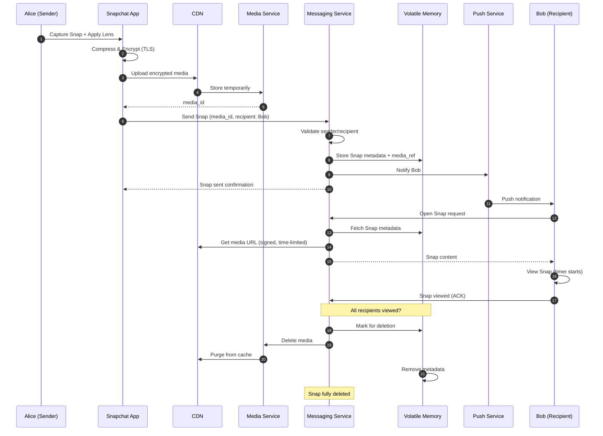

# High-Level Design

## Overview

Snapchat's architecture has evolved from a monolithic Google App Engine application to a sophisticated **multicloud microservices platform** running across AWS and Google Cloud. This design prioritizes:

1. **Ephemeral-first storage** - Volatile memory for temporary content
2. **Camera-first UX** - Sub-6-second launch, real-time AR
3. **Scale** - 5.4B Snaps/day across 300+ microservices
4. **Cost optimization** - 65% reduction through multicloud strategy

---

## System Architecture

---

## Component Responsibilities

| Component | Responsibility | Scale |
|-----------|---------------|-------|
| **API Gateway** | Request routing, auth, rate limiting | 200K+ req/s |
| **Service Mesh (Envoy)** | Service-to-service communication | 10M QPS |
| **Switchboard** | Centralized service configuration | 300+ services |
| **Messaging Service** | Ephemeral Snap delivery and deletion | 62K Snaps/s |
| **Stories Service** | 24-hour content management | 1B Stories |
| **Chat Service** | Real-time text, voice, video | 50M concurrent |
| **Map Service** | Location tracking and sharing | 400M MAU |
| **Lens Service** | AR model distribution | 6B plays/day |
| **Media Service** | Upload, transcode, store | 31 GB/s upload |
| **Friends Service** | Social graph, discovery | 306M users |
| **Content Moderation** | Safety, abuse detection | All content |
| **AR Inference** | On-device ML processing | 60 FPS |

---

## Data Flow Diagrams

### 1. Ephemeral Snap Flow (Send → View → Delete)

### 2. Story Post Flow (Create → Distribute → Expire)

### 3. AR Lens Application Flow

### 4. Snap Map Location Update Flow

### 5. Media Upload & Processing Flow

---

## Key Architectural Decisions

### Decision 1: Multicloud (AWS + GCP) vs Single Cloud

| Factor | Multicloud (Chosen) | Single Cloud |
|--------|---------------------|--------------|
| **Cost** | 65% reduction via optimization | Volume discounts |
| **Vendor Lock-in** | None | High |
| **Complexity** | Higher (service mesh needed) | Lower |
| **Reliability** | Higher (multi-provider) | Single provider SLA |
| **Compliance** | Regional flexibility | Limited |

**Decision**: Multicloud with Envoy service mesh for abstraction.

**Rationale**: At Snapchat's scale, the 65% cost savings outweigh operational complexity. Service mesh (Envoy) abstracts cloud-specific details.

### Decision 2: Volatile Memory vs Database TTL for Ephemeral

| Factor | Volatile Memory (Chosen) | Database with TTL |
|--------|-------------------------|-------------------|
| **Deletion Guarantee** | Strong (RAM = gone) | Requires explicit deletion |
| **Backup Risk** | None (by design) | Backups might retain data |
| **Cost** | Higher (RAM expensive) | Lower |
| **Latency** | Sub-ms | Few ms |
| **Recovery** | None | Possible |

**Decision**: Volatile memory for ephemeral content.

**Rationale**: Snapchat's core promise is ephemeral content. Database TTL cannot guarantee deletion (backups, replicas). Volatile memory ensures content is truly gone.

### Decision 3: Server-Side Encryption vs End-to-End Encryption

| Factor | Server-Side (Chosen) | End-to-End |
|--------|---------------------|------------|
| **Content Moderation** | Full capability | Metadata only |
| **CSAM Detection** | Server-side AI | Client-side (controversial) |
| **Law Enforcement** | Can comply | Cannot provide content |
| **Deletion Guarantee** | Server-controlled | Client-dependent |
| **User Privacy** | Trust in Snapchat | Cryptographic guarantee |

**Decision**: Server-side encryption (TLS + at-rest).

**Rationale**: Snapchat prioritizes content moderation and guaranteed deletion over E2EE. The ephemeral model provides privacy through deletion, not encryption.

### Decision 4: On-Device AR vs Cloud AR

| Factor | On-Device (Chosen) | Cloud AR |
|--------|-------------------|----------|
| **Latency** | <16ms per frame | 50-200ms round-trip |
| **Frame Rate** | 60 FPS achievable | Not possible |
| **Privacy** | Data stays on device | Frames uploaded |
| **Model Size** | Limited by device | Unlimited |
| **Offline** | Works | Requires network |

**Decision**: On-device AR with SnapML.

**Rationale**: 60 FPS requires <16ms per frame. Network latency makes cloud AR impossible for real-time face tracking.

### Decision 5: Microservices (300+) vs Monolith

| Factor | Microservices (Chosen) | Monolith |
|--------|----------------------|----------|
| **Independent Scaling** | Yes | No |
| **Deployment** | Per-service | All-or-nothing |
| **Complexity** | High (service mesh) | Lower |
| **Team Autonomy** | High | Coordination required |
| **Debugging** | Distributed tracing | Simpler |

**Decision**: 300+ microservices with Envoy service mesh.

**Rationale**: AR, messaging, Map, and Stories have vastly different scaling patterns. Independent scaling is critical at Snapchat's scale.

---

## Technology Stack

| Layer | Technology | Purpose |
|-------|------------|---------|
| **Mobile** | Swift (iOS), Kotlin (Android) | Native apps |
| **On-Device ML** | SnapML, Core ML, TensorFlow Lite | AR inference |
| **Real-Time** | WebSockets, gRPC | Chat, presence |
| **Backend** | Go (primary), Java, Python | Services |
| **Service Mesh** | Envoy | 10M QPS service-to-service |
| **Config** | Switchboard (internal) | Service configuration |
| **Orchestration** | Kubernetes | Container management |
| **User Data** | DynamoDB | Primary database |
| **Time-Series** | Cassandra | Location history, analytics |
| **Cache** | Redis | Hot data, sessions |
| **Blob** | S3/GCS | Media storage |
| **CDN** | Global CDN | Content delivery |
| **Cloud** | AWS (primary) + GCP | Infrastructure |

---

## Multi-Region Architecture

### Regional Strategy

| Region | Role | Data |
|--------|------|------|
| **US-East** | Primary write region | Full DynamoDB + Cassandra |
| **US-West** | Secondary, user affinity | Read replicas + local writes |
| **EU-West** | GDPR compliance, low latency | Full dataset (EU users) |
| **APAC** | Low latency for Asia | Read replicas + local writes |

### Cross-Region Replication

| Data Type | Replication | Consistency |
|-----------|-------------|-------------|
| **User Profiles** | Async, all regions | Eventual |
| **Ephemeral Snaps** | No replication | Region-local |
| **Stories** | CDN (edge cache) | TTL-based |
| **Location Data** | Region-local only | Strong (within region) |
| **Social Graph** | Async, all regions | Eventual |

---

## Architecture Pattern Checklist

| Pattern | Decision | Rationale |
|---------|----------|-----------|
| **Sync vs Async** | Both | Sync for reads, async for writes/deletion |
| **Event-driven vs Request-response** | Hybrid | Events for deletion, request for reads |
| **Push vs Pull** | Push (Snaps), Pull (Stories) | Real-time for messaging |
| **Stateless vs Stateful** | Stateless services | State in data stores |
| **Read-heavy vs Write-heavy** | Balanced (1:1.8) | Unlike typical social apps |
| **Real-time vs Batch** | Real-time | Ephemeral nature requires it |
| **Edge vs Origin** | Edge for AR models, CDN | Low latency critical |

---

## Service Communication Patterns

### Synchronous (gRPC/REST)

- User authentication
- Snap retrieval
- Friend list queries
- Real-time chat messages

### Asynchronous (Message Queue)

- Snap deletion processing
- Media transcoding
- Push notifications
- Analytics events
- Content moderation

### Event-Driven

- Snap viewed events → Trigger deletion
- Story posted → Fan-out to friends
- Location update → Map refresh
- Friend added → Notification

---

## Summary

Snapchat's architecture is distinguished by:

1. **Ephemeral-first design** - Volatile memory ensures deletion
2. **Camera as home screen** - On-device AR, <6s launch
3. **Multicloud** - AWS + GCP with 65% cost savings
4. **Service mesh** - 300+ microservices, 10M QPS
5. **Server-side moderation** - No E2EE, enables content safety
6. **Real-time at scale** - 5.4B Snaps/day, <100ms delivery
