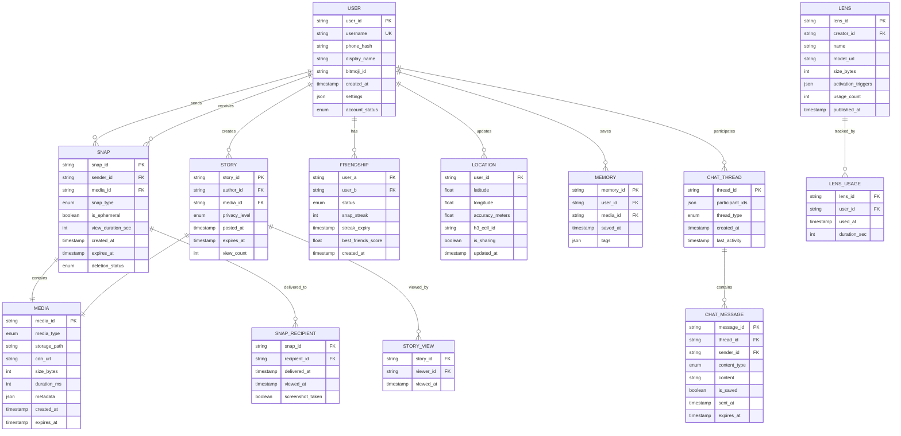
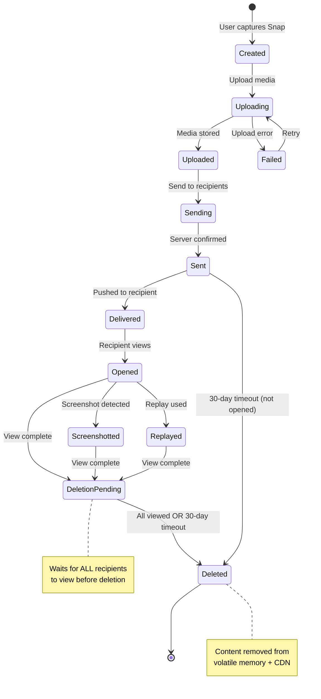

# Low-Level Design

## Overview

This document details the data models, API specifications, and core algorithms that power Snapchat. The design emphasizes ephemeral storage patterns, real-time processing, and efficient AR inference.

---

## Data Models

### Entity Relationship Overview



---

### User Schema

```
TABLE: users
PRIMARY KEY: user_id (UUID)
UNIQUE: username, phone_hash

┌─────────────────┬──────────────────┬────────────────────────────────────┐
│ Field           │ Type             │ Description                        │
├─────────────────┼──────────────────┼────────────────────────────────────┤
│ user_id         │ UUID             │ Primary identifier                 │
│ username        │ VARCHAR(15)      │ Unique username (lowercase)        │
│ phone_hash      │ VARCHAR(64)      │ SHA-256 of phone number           │
│ display_name    │ VARCHAR(50)      │ Display name                       │
│ email_hash      │ VARCHAR(64)      │ Optional email hash                │
│ bitmoji_id      │ VARCHAR(32)      │ Linked Bitmoji avatar             │
│ avatar_url      │ VARCHAR(512)     │ Profile photo CDN URL             │
│ birthday        │ DATE             │ For age verification               │
│ created_at      │ TIMESTAMP        │ Account creation time              │
│ last_active     │ TIMESTAMP        │ Last activity timestamp            │
│ account_status  │ ENUM             │ active, suspended, deleted         │
│ settings        │ JSONB            │ User preferences                   │
└─────────────────┴──────────────────┴────────────────────────────────────┘

INDEXES:
- username (unique, for lookups)
- phone_hash (unique, for contact matching)
- last_active (for activity queries)

SETTINGS JSON STRUCTURE:
{
  "privacy": {
    "who_can_contact": "friends|everyone",
    "who_can_view_story": "friends|custom",
    "show_on_quick_add": true,
    "ghost_mode": false,
    "location_sharing": "friends|select|off"
  },
  "notifications": {
    "snaps": true,
    "stories": true,
    "chat": true,
    "friend_suggestions": false
  }
}
```

### Snap Schema (Ephemeral Storage)

```
VOLATILE MEMORY STRUCTURE: ephemeral_snaps

┌─────────────────┬──────────────────┬────────────────────────────────────┐
│ Field           │ Type             │ Description                        │
├─────────────────┼──────────────────┼────────────────────────────────────┤
│ snap_id         │ UUID             │ Primary identifier                 │
│ sender_id       │ UUID             │ Sender user_id                     │
│ recipient_ids   │ UUID[]           │ List of recipient user_ids         │
│ media_ref       │ VARCHAR(256)     │ Temporary media reference          │
│ media_key       │ BYTES(32)        │ AES-256 encryption key             │
│ snap_type       │ ENUM             │ photo, video, audio                │
│ view_duration   │ INT              │ Seconds to display (1-10)          │
│ is_ephemeral    │ BOOLEAN          │ True for auto-delete               │
│ created_at      │ TIMESTAMP        │ Creation time                      │
│ expires_at      │ TIMESTAMP        │ Max 30 days if unopened            │
│ view_status     │ MAP<UUID, STATUS>│ Per-recipient view status          │
│ deletion_status │ ENUM             │ pending, scheduled, deleted        │
└─────────────────┴──────────────────┴────────────────────────────────────┘

VIEW_STATUS MAP:
{
  "recipient_user_id": {
    "delivered_at": timestamp,
    "viewed_at": timestamp | null,
    "screenshot": boolean,
    "replayed": boolean
  }
}

DELETION_STATUS ENUM:
- pending: Waiting for views
- scheduled: All viewed, deletion queued
- deleted: Removed from storage

NOTE: This data is stored in volatile memory (RAM) only.
No persistence, no backups, no replication to disk.
```

### Story Schema

```
TABLE: stories
PRIMARY KEY: story_id
PARTITION KEY: author_id (for efficient user queries)
SORT KEY: posted_at (descending)

┌─────────────────┬──────────────────┬────────────────────────────────────┐
│ Field           │ Type             │ Description                        │
├─────────────────┼──────────────────┼────────────────────────────────────┤
│ story_id        │ UUID             │ Primary identifier                 │
│ author_id       │ UUID             │ Creator user_id                    │
│ media_id        │ UUID             │ Reference to media                 │
│ media_url       │ VARCHAR(512)     │ CDN URL                           │
│ thumbnail_url   │ VARCHAR(512)     │ Thumbnail CDN URL                  │
│ privacy_level   │ ENUM             │ friends, custom, public            │
│ allowed_viewers │ UUID[]           │ Custom viewer list (if applicable) │
│ posted_at       │ TIMESTAMP        │ Post timestamp                     │
│ expires_at      │ TIMESTAMP        │ posted_at + 24 hours               │
│ view_count      │ INT              │ Total views (approximate)          │
│ screenshot_count│ INT              │ Screenshots taken                  │
│ is_archived     │ BOOLEAN          │ Saved to Memories                  │
└─────────────────┴──────────────────┴────────────────────────────────────┘

INDEXES:
- (author_id, posted_at DESC) - User's stories
- expires_at - For expiration worker

TTL: Automatic deletion after expires_at
```

### Location Schema

```
TABLE: user_locations
PRIMARY KEY: user_id
STORAGE: Cassandra (time-series optimized)

┌─────────────────┬──────────────────┬────────────────────────────────────┐
│ Field           │ Type             │ Description                        │
├─────────────────┼──────────────────┼────────────────────────────────────┤
│ user_id         │ UUID             │ User identifier                    │
│ latitude        │ DOUBLE           │ Latitude (-90 to 90)               │
│ longitude       │ DOUBLE           │ Longitude (-180 to 180)            │
│ accuracy        │ FLOAT            │ Accuracy in meters                 │
│ altitude        │ FLOAT            │ Altitude (optional)                │
│ speed           │ FLOAT            │ Speed in m/s (optional)            │
│ heading         │ FLOAT            │ Heading in degrees (optional)      │
│ h3_cell_id      │ VARCHAR(16)      │ H3 geospatial index (resolution 9) │
│ activity_type   │ ENUM             │ stationary, walking, driving, etc. │
│ is_sharing      │ BOOLEAN          │ Currently sharing location         │
│ share_mode      │ ENUM             │ friends, select, live              │
│ updated_at      │ TIMESTAMP        │ Last update time                   │
└─────────────────┴──────────────────┴────────────────────────────────────┘

INDEXES:
- h3_cell_id - For spatial queries (friends in area)
- updated_at - For freshness

TTL: 24 hours (no location history retained)
```

### Friendship Schema

```
TABLE: friendships
PRIMARY KEY: (user_a, user_b) where user_a < user_b
STORAGE: DynamoDB

┌─────────────────┬──────────────────┬────────────────────────────────────┐
│ Field           │ Type             │ Description                        │
├─────────────────┼──────────────────┼────────────────────────────────────┤
│ user_a          │ UUID             │ User with smaller UUID             │
│ user_b          │ UUID             │ User with larger UUID              │
│ status          │ ENUM             │ pending, friends, blocked          │
│ initiated_by    │ UUID             │ Who sent request                   │
│ snap_streak     │ INT              │ Current streak count               │
│ streak_expiry   │ TIMESTAMP        │ When streak expires                │
│ last_snap_a_to_b│ TIMESTAMP        │ Last Snap from A to B              │
│ last_snap_b_to_a│ TIMESTAMP        │ Last Snap from B to A              │
│ best_friends_score│ FLOAT          │ Interaction score                  │
│ created_at      │ TIMESTAMP        │ Friendship start time              │
└─────────────────┴──────────────────┴────────────────────────────────────┘

GLOBAL SECONDARY INDEX:
- user_a → All friendships for user_a
- user_b → All friendships for user_b

NOTE: Bidirectional lookup requires two queries or GSI
```

### Lens Schema

```
TABLE: lenses
PRIMARY KEY: lens_id
STORAGE: DynamoDB

┌─────────────────┬──────────────────┬────────────────────────────────────┐
│ Field           │ Type             │ Description                        │
├─────────────────┼──────────────────┼────────────────────────────────────┤
│ lens_id         │ UUID             │ Primary identifier                 │
│ creator_id      │ UUID             │ Creator (Snap or community)        │
│ name            │ VARCHAR(100)     │ Lens display name                  │
│ description     │ TEXT             │ Lens description                   │
│ model_url       │ VARCHAR(512)     │ ML model CDN URL                   │
│ assets_url      │ VARCHAR(512)     │ Additional assets bundle           │
│ model_size      │ INT              │ Size in bytes                      │
│ model_version   │ INT              │ Version for updates                │
│ activation      │ JSONB            │ Trigger configuration              │
│ capabilities    │ VARCHAR[]        │ face, world, hand, body            │
│ min_sdk_version │ INT              │ Minimum SnapML version             │
│ usage_count     │ BIGINT           │ Total usage (approximate)          │
│ rating          │ FLOAT            │ User rating (1-5)                  │
│ status          │ ENUM             │ active, suspended, archived        │
│ published_at    │ TIMESTAMP        │ Publication time                   │
└─────────────────┴──────────────────┴────────────────────────────────────┘

ACTIVATION JSON:
{
  "triggers": ["face_detected", "tap", "open_mouth"],
  "face_count": 1,
  "world_tracking": false,
  "hand_tracking": false
}
```

---

## API Design

### API Versioning Strategy

```
Base URL: https://api.snapchat.com/v1/

Versioning: URL path versioning (/v1/, /v2/)
Format: JSON (REST), Protocol Buffers (gRPC)
Auth: OAuth 2.0 Bearer Token
Rate Limiting: Per-user, per-endpoint
```

### Snaps API

#### Send Snap

```
POST /v1/snaps

Headers:
  Authorization: Bearer <token>
  Content-Type: application/json
  X-Request-ID: <uuid>
  X-Idempotency-Key: <uuid>

Request Body:
{
  "media_id": "uuid",
  "recipients": ["user_id_1", "user_id_2"],
  "snap_type": "photo|video",
  "is_ephemeral": true,
  "view_duration_sec": 5,
  "caption": "optional text overlay",
  "lens_id": "optional lens used"
}

Response (201 Created):
{
  "snap_id": "uuid",
  "status": "sent",
  "delivered_to": [
    {"user_id": "user_id_1", "delivered_at": "2025-01-15T10:30:00Z"},
    {"user_id": "user_id_2", "delivered_at": null}
  ],
  "expires_at": "2025-02-14T10:30:00Z"
}

Error Responses:
- 400: Invalid recipient or media
- 403: Blocked by recipient
- 404: Media not found
- 429: Rate limited
```

#### Get Pending Snaps

```
GET /v1/snaps/pending

Headers:
  Authorization: Bearer <token>

Response (200 OK):
{
  "snaps": [
    {
      "snap_id": "uuid",
      "sender_id": "uuid",
      "sender_username": "alice",
      "snap_type": "photo",
      "sent_at": "2025-01-15T10:30:00Z",
      "is_ephemeral": true
    }
  ],
  "count": 1
}
```

#### View Snap

```
POST /v1/snaps/{snap_id}/view

Headers:
  Authorization: Bearer <token>

Response (200 OK):
{
  "snap_id": "uuid",
  "media_url": "https://cdn.snap.com/...",  // Signed, time-limited
  "media_key": "base64_encoded_key",
  "view_duration_sec": 5,
  "expires_in_sec": 60  // URL validity
}

Note: Calling this endpoint marks the Snap as viewed.
The media_url is valid for 60 seconds only.
```

#### Acknowledge Snap Viewed

```
POST /v1/snaps/{snap_id}/ack

Headers:
  Authorization: Bearer <token>

Request Body:
{
  "viewed_at": "2025-01-15T10:31:00Z",
  "screenshot": false,
  "replayed": false
}

Response (200 OK):
{
  "status": "acknowledged"
}

Note: This triggers deletion check on server.
```

### Stories API

#### Post Story

```
POST /v1/stories

Headers:
  Authorization: Bearer <token>
  X-Idempotency-Key: <uuid>

Request Body:
{
  "media_id": "uuid",
  "privacy": "friends|custom|public",
  "allowed_viewers": ["user_id_1"],  // If custom
  "location_tag": {
    "name": "San Francisco",
    "lat": 37.7749,
    "lon": -122.4194
  }
}

Response (201 Created):
{
  "story_id": "uuid",
  "posted_at": "2025-01-15T10:30:00Z",
  "expires_at": "2025-01-16T10:30:00Z",
  "media_url": "https://cdn.snap.com/..."
}
```

#### Get Friends' Stories

```
GET /v1/stories/feed

Headers:
  Authorization: Bearer <token>

Query Parameters:
  - cursor: pagination cursor
  - limit: max 50

Response (200 OK):
{
  "stories": [
    {
      "story_id": "uuid",
      "author": {
        "user_id": "uuid",
        "username": "bob",
        "display_name": "Bob",
        "bitmoji_url": "..."
      },
      "media_url": "https://cdn.snap.com/...",
      "thumbnail_url": "https://cdn.snap.com/...",
      "posted_at": "2025-01-15T09:00:00Z",
      "expires_at": "2025-01-16T09:00:00Z",
      "view_count": 42,
      "has_viewed": false
    }
  ],
  "next_cursor": "abc123",
  "has_more": true
}
```

### Map API

#### Update Location

```
PUT /v1/map/location

Headers:
  Authorization: Bearer <token>

Request Body:
{
  "latitude": 37.7749,
  "longitude": -122.4194,
  "accuracy": 10.5,
  "altitude": 15.0,
  "speed": 0.0,
  "heading": 90.0,
  "activity": "stationary"
}

Response (200 OK):
{
  "status": "updated",
  "h3_cell": "8928308280fffff"
}
```

#### Get Friends' Locations

```
GET /v1/map/friends

Headers:
  Authorization: Bearer <token>

Response (200 OK):
{
  "friends": [
    {
      "user_id": "uuid",
      "username": "alice",
      "bitmoji_url": "...",
      "location": {
        "latitude": 37.7850,
        "longitude": -122.4000,
        "activity": "walking",
        "updated_at": "2025-01-15T10:29:00Z"
      }
    }
  ],
  "heatmap_url": "https://cdn.snap.com/map/heatmap/..."
}
```

### Lens API

#### Get Available Lenses

```
GET /v1/lenses

Headers:
  Authorization: Bearer <token>

Query Parameters:
  - category: trending|new|favorites
  - capabilities: face,world
  - limit: 20

Response (200 OK):
{
  "lenses": [
    {
      "lens_id": "uuid",
      "name": "Puppy Face",
      "creator": "Snapchat",
      "thumbnail_url": "https://cdn.snap.com/...",
      "model_url": "https://cdn.snap.com/...",
      "model_size": 5242880,
      "capabilities": ["face"],
      "usage_count": 1000000
    }
  ]
}
```

#### Log Lens Usage

```
POST /v1/lenses/{lens_id}/usage

Headers:
  Authorization: Bearer <token>

Request Body:
{
  "duration_sec": 30,
  "captured": true,
  "shared": true
}

Response (200 OK):
{
  "status": "logged"
}
```

---

## Core Algorithms

### 1. Ephemeral Snap Deletion Algorithm

```
ALGORITHM: EphemeralSnapDeletion

PURPOSE: Ensure Snaps are deleted after all recipients view them or after 30-day timeout

INPUT:
  - snap_id: UUID
  - event: VIEW_ACK | TIMEOUT_CHECK

PROCEDURE:

FUNCTION handle_view_ack(snap_id, viewer_id):
    snap = volatile_store.get(snap_id)
    IF snap IS NULL:
        RETURN  // Already deleted

    // Update view status
    snap.view_status[viewer_id].viewed_at = NOW()

    // Check if all recipients viewed
    all_viewed = TRUE
    FOR recipient IN snap.recipient_ids:
        IF snap.view_status[recipient].viewed_at IS NULL:
            all_viewed = FALSE
            BREAK

    IF all_viewed:
        schedule_deletion(snap_id, delay=0)
    ELSE:
        volatile_store.update(snap_id, snap)

FUNCTION schedule_deletion(snap_id, delay):
    snap = volatile_store.get(snap_id)
    IF snap IS NULL:
        RETURN

    snap.deletion_status = "scheduled"
    volatile_store.update(snap_id, snap)

    // Queue deletion job
    deletion_queue.enqueue({
        snap_id: snap_id,
        execute_at: NOW() + delay,
        media_ref: snap.media_ref
    })

FUNCTION execute_deletion(snap_id):
    snap = volatile_store.get(snap_id)
    IF snap IS NULL:
        RETURN  // Already deleted

    // Delete media from temporary storage
    media_service.delete(snap.media_ref)

    // Purge from CDN cache
    cdn_service.invalidate(snap.media_ref)

    // Remove from volatile memory
    volatile_store.delete(snap_id)

    // Record deletion in audit log (metadata only)
    audit_log.record({
        type: "snap_deleted",
        snap_id: snap_id,
        sender_id: snap.sender_id,
        recipient_count: LEN(snap.recipient_ids),
        deleted_at: NOW()
    })

    snap.deletion_status = "deleted"

// Background expiration scanner (runs every minute)
FUNCTION expiration_scanner():
    WHILE TRUE:
        expired_snaps = volatile_store.query(
            WHERE expires_at < NOW()
            AND deletion_status = "pending"
        )

        FOR snap IN expired_snaps:
            schedule_deletion(snap.snap_id, delay=0)

        SLEEP(60 seconds)

TIME COMPLEXITY: O(n) for view check where n = recipients
SPACE COMPLEXITY: O(1) additional space
```

### 2. Story Expiration Algorithm

```
ALGORITHM: StoryExpiration

PURPOSE: Remove Stories after 24-hour TTL and coordinate CDN invalidation

INPUT:
  - batch_size: Number of stories to process per iteration

PROCEDURE:

FUNCTION story_expiration_worker():
    WHILE TRUE:
        // Query for expired stories
        expired = database.query(
            SELECT story_id, media_id, author_id
            FROM stories
            WHERE expires_at < NOW()
            AND is_archived = FALSE
            LIMIT batch_size
        )

        FOR story IN expired:
            process_story_expiration(story)

        IF LEN(expired) < batch_size:
            SLEEP(10 seconds)  // No more work, wait

FUNCTION process_story_expiration(story):
    TRY:
        // Remove from user's story list cache
        cache.delete(f"user:{story.author_id}:stories")

        // Remove from all friends' feeds
        friends = get_friend_ids(story.author_id)
        FOR friend_id IN friends:
            cache.list_remove(f"user:{friend_id}:story_feed", story.story_id)

        // Invalidate CDN cache
        cdn_service.invalidate(story.media_id)

        // Option 1: Delete media (if not archived)
        IF NOT story.is_archived:
            media_service.delete(story.media_id)

        // Option 2: Move to Memories (if user opted in)
        IF story.is_archived:
            memories_service.archive(story)

        // Delete story record
        database.delete("stories", story.story_id)

        // Log for analytics
        analytics.log({
            type: "story_expired",
            story_id: story.story_id,
            view_count: story.view_count,
            duration: 24 hours
        })

    CATCH error:
        // Retry later, don't block queue
        retry_queue.enqueue(story, delay=60)
        log_error(error)

TIME COMPLEXITY: O(f) where f = number of friends (for cache invalidation)
SPACE COMPLEXITY: O(1) per story
```

### 3. Snap Streak Calculation Algorithm

```
ALGORITHM: SnapStreakCalculation

PURPOSE: Track and update Snap streaks between friends

CONSTANTS:
  STREAK_WINDOW = 24 hours
  STREAK_WARNING = 4 hours (before expiry)
  STREAK_GRACE = 1 hour (after missed)

INPUT:
  - sender_id: UUID
  - recipient_id: UUID
  - snap_time: TIMESTAMP

PROCEDURE:

FUNCTION update_streak_on_snap(sender_id, recipient_id, snap_time):
    // Normalize to friendship key (smaller UUID first)
    user_a, user_b = SORTED([sender_id, recipient_id])

    friendship = database.get("friendships", (user_a, user_b))
    IF friendship IS NULL OR friendship.status != "friends":
        RETURN

    // Determine direction
    is_a_to_b = (sender_id == user_a)

    // Get last snap times
    last_a_to_b = friendship.last_snap_a_to_b
    last_b_to_a = friendship.last_snap_b_to_a

    // Update last snap time for this direction
    IF is_a_to_b:
        friendship.last_snap_a_to_b = snap_time
    ELSE:
        friendship.last_snap_b_to_a = snap_time

    // Check if streak should increment
    streak_updated = check_and_update_streak(friendship, snap_time)

    // Calculate new expiry
    friendship.streak_expiry = calculate_streak_expiry(friendship)

    // Persist changes
    database.update("friendships", (user_a, user_b), friendship)

    // Send notifications if needed
    IF streak_updated:
        notify_streak_update(sender_id, recipient_id, friendship.snap_streak)

FUNCTION check_and_update_streak(friendship, snap_time):
    last_a_to_b = friendship.last_snap_a_to_b
    last_b_to_a = friendship.last_snap_b_to_a

    // Both directions must have snapped within window
    IF last_a_to_b IS NULL OR last_b_to_a IS NULL:
        // Check if this is first mutual snap starting a streak
        IF last_a_to_b IS NOT NULL AND last_b_to_a IS NOT NULL:
            IF ABS(last_a_to_b - last_b_to_a) <= STREAK_WINDOW:
                friendship.snap_streak = 1
                RETURN TRUE
        RETURN FALSE

    // Calculate time since both last snapped
    latest_snap = MAX(last_a_to_b, last_b_to_a)
    earliest_snap = MIN(last_a_to_b, last_b_to_a)

    // Check if within streak window
    IF (latest_snap - earliest_snap) > STREAK_WINDOW + STREAK_GRACE:
        // Streak broken
        friendship.snap_streak = 0
        RETURN TRUE

    // Check if this completes today's mutual exchange
    today_start = START_OF_DAY(snap_time)

    has_a_to_b_today = last_a_to_b >= today_start
    has_b_to_a_today = last_b_to_a >= today_start

    IF has_a_to_b_today AND has_b_to_a_today:
        // Check if streak already incremented today
        IF friendship.last_streak_increment < today_start:
            friendship.snap_streak += 1
            friendship.last_streak_increment = snap_time
            RETURN TRUE

    RETURN FALSE

FUNCTION calculate_streak_expiry(friendship):
    last_a_to_b = friendship.last_snap_a_to_b
    last_b_to_a = friendship.last_snap_b_to_a

    IF last_a_to_b IS NULL OR last_b_to_a IS NULL:
        RETURN NOW() + STREAK_WINDOW

    earliest = MIN(last_a_to_b, last_b_to_a)
    RETURN earliest + STREAK_WINDOW

// Background job to send streak warnings
FUNCTION streak_warning_job():
    at_risk = database.query(
        SELECT *
        FROM friendships
        WHERE snap_streak > 0
        AND streak_expiry < NOW() + STREAK_WARNING
        AND streak_expiry > NOW()
    )

    FOR friendship IN at_risk:
        send_streak_warning_notification(friendship)

TIME COMPLEXITY: O(1) per update
SPACE COMPLEXITY: O(1)
```

### 4. Quick Add Friend Suggestion Algorithm

```
ALGORITHM: QuickAddSuggestions

PURPOSE: Suggest potential friends based on mutual connections and signals

INPUT:
  - user_id: UUID
  - limit: INT (default 10)

OUTPUT:
  - List of suggested users with scores

PROCEDURE:

FUNCTION get_quick_add_suggestions(user_id, limit):
    // Skip if user opted out
    user = get_user(user_id)
    IF NOT user.settings.privacy.show_on_quick_add:
        RETURN []

    suggestions = []

    // Step 1: Get user's friends
    friends = get_friend_ids(user_id)

    // Step 2: Get friends of friends (mutual connections)
    mutual_candidates = {}
    FOR friend_id IN friends:
        friend_of_friends = get_friend_ids(friend_id)
        FOR fof IN friend_of_friends:
            IF fof == user_id:
                CONTINUE
            IF fof IN friends:
                CONTINUE  // Already friends
            IF is_blocked(user_id, fof):
                CONTINUE

            IF fof NOT IN mutual_candidates:
                mutual_candidates[fof] = {
                    mutual_count: 0,
                    mutual_friends: []
                }
            mutual_candidates[fof].mutual_count += 1
            mutual_candidates[fof].mutual_friends.APPEND(friend_id)

    // Step 3: Score candidates
    FOR candidate_id, data IN mutual_candidates:
        candidate = get_user(candidate_id)

        // Skip if candidate opted out
        IF NOT candidate.settings.privacy.show_on_quick_add:
            CONTINUE

        score = calculate_suggestion_score(
            user_id,
            candidate_id,
            data.mutual_count,
            data.mutual_friends
        )

        IF score > MINIMUM_SCORE_THRESHOLD:
            suggestions.APPEND({
                user_id: candidate_id,
                username: candidate.username,
                display_name: candidate.display_name,
                bitmoji_url: candidate.bitmoji_url,
                mutual_count: data.mutual_count,
                mutual_friends: data.mutual_friends[:3],  // Show up to 3
                score: score
            })

    // Step 4: Sort by score and return top N
    suggestions.SORT(BY score DESC)
    RETURN suggestions[:limit]

FUNCTION calculate_suggestion_score(user_id, candidate_id, mutual_count, mutual_friends):
    score = 0.0

    // Mutual friends (strongest signal)
    // Diminishing returns after 5 mutuals
    score += MIN(mutual_count * 20, 100)

    // Phone contacts match (if available)
    IF is_in_contacts(user_id, candidate_id):
        score += 50

    // Same location (if shared)
    IF is_same_location(user_id, candidate_id, radius=50km):
        score += 20

    // School/workplace match (if provided)
    IF has_common_affiliation(user_id, candidate_id):
        score += 30

    // Recency of mutual friend activity
    recent_activity_bonus = 0
    FOR mutual_id IN mutual_friends:
        IF mutual_was_active_today(user_id, mutual_id):
            recent_activity_bonus += 5
    score += MIN(recent_activity_bonus, 25)

    // Negative signals
    IF was_previously_rejected(user_id, candidate_id):
        score -= 50

    RETURN MAX(score, 0)

TIME COMPLEXITY: O(f * avg_friends_per_friend) where f = friend count
SPACE COMPLEXITY: O(candidates) for storing potential matches
```

### 5. Snap Map Location Bucketing (H3)

```
ALGORITHM: SnapMapLocationBucketing

PURPOSE: Efficient geospatial indexing for Snap Map using H3

INPUT:
  - user_id: UUID
  - latitude: FLOAT
  - longitude: FLOAT

PROCEDURE:

FUNCTION update_user_location(user_id, lat, lon, accuracy):
    // Convert to H3 cell ID at resolution 9 (~174m hexagon)
    h3_cell = h3.geo_to_h3(lat, lon, resolution=9)

    // Get previous location
    prev_location = cache.get(f"location:{user_id}")

    // Check if cell changed (reduce writes)
    IF prev_location IS NOT NULL AND prev_location.h3_cell == h3_cell:
        // Just update timestamp, same cell
        prev_location.updated_at = NOW()
        cache.set(f"location:{user_id}", prev_location, ttl=24h)
        RETURN

    // Remove from previous cell index
    IF prev_location IS NOT NULL:
        cache.set_remove(f"h3:{prev_location.h3_cell}:users", user_id)

    // Add to new cell index
    cache.set_add(f"h3:{h3_cell}:users", user_id)

    // Store new location
    new_location = {
        user_id: user_id,
        latitude: lat,
        longitude: lon,
        accuracy: accuracy,
        h3_cell: h3_cell,
        activity: detect_activity(user_id),
        updated_at: NOW()
    }
    cache.set(f"location:{user_id}", new_location, ttl=24h)

    // Update Cassandra for persistence
    cassandra.upsert("user_locations", new_location)

FUNCTION get_friends_in_view(user_id, viewport):
    // viewport = {ne_lat, ne_lon, sw_lat, sw_lon}

    // Get user's friends with location permission
    friends = get_friends_with_location_permission(user_id)

    // Get H3 cells covering viewport
    cells = h3.polyfill(viewport, resolution=9)

    visible_friends = []
    FOR cell IN cells:
        users_in_cell = cache.set_members(f"h3:{cell}:users")
        FOR potential_user IN users_in_cell:
            IF potential_user IN friends:
                location = cache.get(f"location:{potential_user}")
                IF location IS NOT NULL AND is_within_viewport(location, viewport):
                    visible_friends.APPEND(location)

    RETURN visible_friends

FUNCTION generate_heatmap(viewport, resolution):
    // Lower resolution for heatmap (larger cells)
    heatmap_resolution = 7  // ~5km hexagons

    cells = h3.polyfill(viewport, resolution=heatmap_resolution)

    heatmap_data = []
    FOR cell IN cells:
        // Get child cells at higher resolution
        child_cells = h3.h3_to_children(cell, resolution=9)

        user_count = 0
        FOR child IN child_cells:
            user_count += cache.set_size(f"h3:{child}:users")

        IF user_count > 0:
            center = h3.h3_to_geo(cell)
            heatmap_data.APPEND({
                cell: cell,
                lat: center.lat,
                lon: center.lon,
                intensity: calculate_intensity(user_count)
            })

    RETURN heatmap_data

FUNCTION calculate_intensity(user_count):
    // Logarithmic scale for visualization
    IF user_count == 0:
        RETURN 0
    RETURN MIN(LOG10(user_count + 1) / 3, 1.0)  // Normalize 0-1

TIME COMPLEXITY:
  - Update: O(1)
  - Query: O(cells * avg_users_per_cell)
SPACE COMPLEXITY: O(users) for location storage
```

---

## Snap State Machine



---

## Database Sharding Strategy

### Sharding by User ID

```
STRATEGY: Hash-based sharding on user_id

SHARD_COUNT = 256 (power of 2 for efficient hashing)

FUNCTION get_shard(user_id):
    hash = SHA256(user_id)
    shard_number = hash[0:2] MOD SHARD_COUNT  // First 2 bytes
    RETURN shard_number

DATA DISTRIBUTION:
- User data: Sharded by user_id
- Snaps: Sharded by sender_id
- Stories: Sharded by author_id
- Friendships: Sharded by MIN(user_a, user_b)
- Locations: Sharded by user_id

CROSS-SHARD QUERIES:
- Friend's stories: Requires scatter-gather
- Mutual friends: Requires fan-out

MITIGATION:
- Cache friend lists aggressively
- Pre-compute story feeds
- Use Redis for cross-shard aggregation
```

### DynamoDB Table Design

```
TABLE: snapchat_main

PARTITION KEY (PK): entity_type#entity_id
SORT KEY (SK): attribute_type#timestamp

EXAMPLES:

User Profile:
  PK: USER#uuid
  SK: PROFILE#0
  Data: {username, display_name, settings, ...}

User's Sent Snaps:
  PK: USER#uuid
  SK: SNAP_SENT#2025-01-15T10:30:00Z#snap_id
  Data: {snap_id, recipients, status, ...}

User's Received Snaps:
  PK: USER#uuid
  SK: SNAP_RECV#2025-01-15T10:30:00Z#snap_id
  Data: {snap_id, sender_id, status, ...}

User's Stories:
  PK: USER#uuid
  SK: STORY#2025-01-15T10:30:00Z#story_id
  Data: {story_id, media_url, view_count, ...}

User's Friends:
  PK: USER#uuid
  SK: FRIEND#friend_username
  Data: {friend_id, status, streak, ...}

ACCESS PATTERNS:
- Get user profile: PK = USER#id, SK = PROFILE#0
- List sent snaps: PK = USER#id, SK begins_with SNAP_SENT#
- List received snaps: PK = USER#id, SK begins_with SNAP_RECV#
- List stories: PK = USER#id, SK begins_with STORY#
- List friends: PK = USER#id, SK begins_with FRIEND#
```

---

## Indexing Strategy

| Table | Index | Purpose |
|-------|-------|---------|
| **users** | username (unique) | Login, friend search |
| **users** | phone_hash (unique) | Contact matching |
| **snaps** | (sender_id, created_at) | User's sent history |
| **snaps** | (recipient_id, created_at) | Pending snaps |
| **snaps** | expires_at | Expiration scanner |
| **stories** | (author_id, posted_at) | User's story list |
| **stories** | expires_at | Expiration worker |
| **locations** | h3_cell_id | Spatial queries |
| **locations** | updated_at | Stale data cleanup |
| **friendships** | (user_a, user_b) | Relationship lookup |
| **lenses** | usage_count DESC | Trending lenses |

---

## Summary

Key low-level design decisions:

1. **Volatile memory for ephemeral content** - Guarantees deletion
2. **H3 geospatial indexing** - Efficient Snap Map queries
3. **DynamoDB single-table design** - Efficient access patterns
4. **Streak calculation on write** - Real-time accuracy
5. **Mutual friend scoring** - Privacy-aware suggestions
6. **State machine for Snaps** - Clear lifecycle tracking
