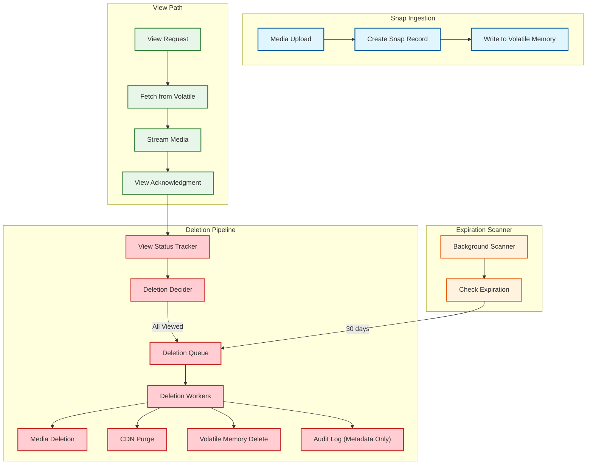
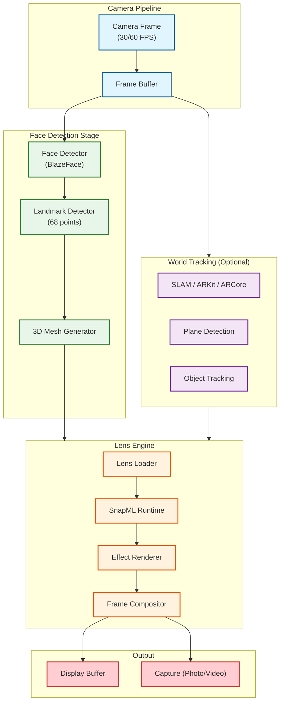
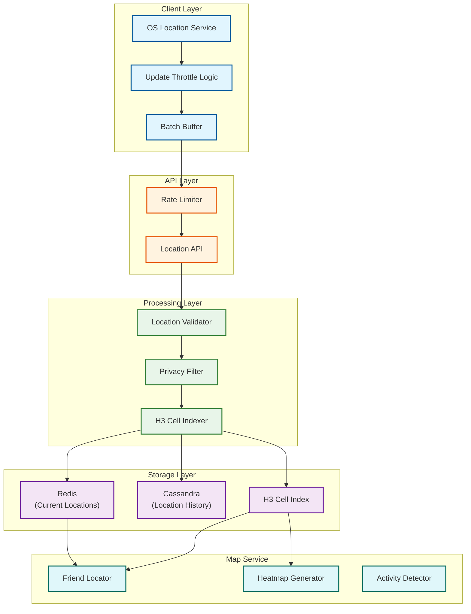
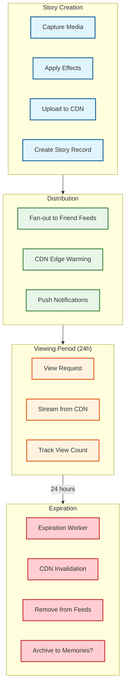

# Deep Dive & Bottlenecks

## Overview

This document provides in-depth analysis of Snapchat's most critical components: the ephemeral deletion pipeline, AR Lens engine (SnapML), Snap Map, and Stories infrastructure. We also analyze bottlenecks and race conditions unique to an ephemeral-first platform.

---

## Critical Component 1: Ephemeral Deletion Pipeline

### Why This Is Critical

The ephemeral deletion pipeline is **Snapchat's core differentiator** and a **legal requirement**. Users trust that their Snaps will be deleted, and regulators (GDPR, privacy laws) expect deletion to be verifiable. Any failure in this pipeline undermines the entire product promise.

**Requirements:**
- Snaps must be deleted after all recipients view them
- Unopened Snaps must be deleted after 30 days
- Deletion must be **irreversible** and **auditable**
- No backups or replicas that could resurrect content

### Architecture Deep Dive



### Volatile Memory Storage Design

```
VOLATILE MEMORY CLUSTER

Architecture:
- Distributed RAM cluster (no disk persistence)
- Data partitioned by snap_id hash
- Replication factor: 3 (within cluster, still volatile)
- No durability guarantees by design

Memory Layout per Snap:
┌─────────────────────────────────────────────────────────┐
│ snap_id (16 bytes)                                      │
│ sender_id (16 bytes)                                    │
│ recipient_ids[] (16 bytes × n)                          │
│ media_reference (256 bytes)                             │
│ encryption_key (32 bytes)                               │
│ created_at (8 bytes)                                    │
│ expires_at (8 bytes)                                    │
│ view_status_map (variable, ~100 bytes per recipient)    │
│ deletion_status (1 byte)                                │
└─────────────────────────────────────────────────────────┘

Estimated size per Snap: ~500 bytes (metadata only)
Media stored separately in temporary blob storage

Why Volatile Memory?
1. Guarantees deletion - Power off = data gone
2. No backup restoration risk
3. Sub-millisecond latency
4. Natural cleanup on failure

Trade-offs:
- Higher cost (RAM vs disk)
- Data loss on cluster failure (acceptable for ephemeral)
- Limited by memory capacity
```

### Deletion Decision Logic

```
DELETION TRIGGERS

Trigger 1: All Recipients Viewed
- Track view_status for each recipient
- When last recipient views → immediate deletion
- No delay, no grace period

Trigger 2: 30-Day Expiration
- Background scanner runs every 60 seconds
- Query: expires_at < NOW() AND deletion_status = 'pending'
- Batch process expired Snaps

Trigger 3: Sender Delete (Manual)
- Sender can delete before recipients view
- Immediate deletion, notify recipients

Trigger 4: Account Deletion
- Delete all sent and received Snaps
- Cascade through social graph

DELETION WORKER LOGIC

FUNCTION deletion_worker():
    WHILE TRUE:
        job = deletion_queue.dequeue(timeout=5s)
        IF job IS NULL:
            CONTINUE

        TRY:
            // Step 1: Delete media from temporary storage
            media_deleted = media_service.delete(job.media_ref)

            // Step 2: Purge from CDN (all edge locations)
            cdn_purged = cdn_service.purge_global(job.media_ref)

            // Step 3: Remove from volatile memory
            volatile_deleted = volatile_store.delete(job.snap_id)

            // Step 4: Record in audit log (metadata only)
            audit_service.log({
                type: "SNAP_DELETED",
                snap_id: job.snap_id,
                deletion_reason: job.reason,
                deleted_at: NOW(),
                media_deleted: media_deleted,
                cdn_purged: cdn_purged
            })

        CATCH error:
            // Retry with exponential backoff
            retry_count = job.retry_count + 1
            IF retry_count < MAX_RETRIES:
                deletion_queue.enqueue_with_delay(
                    job,
                    delay = 2^retry_count seconds,
                    retry_count = retry_count
                )
            ELSE:
                // Alert: Manual intervention needed
                alert_service.critical("deletion_failed", job)
```

### Failure Modes and Recovery

| Failure Mode | Impact | Recovery |
|--------------|--------|----------|
| **Volatile cluster node failure** | Snaps on that node lost | Acceptable (ephemeral) |
| **Deletion worker crash** | Delayed deletion | Queue persists, retry on restart |
| **CDN purge failure** | Cached content temporarily accessible | Retry with higher priority |
| **Media delete failure** | Storage leak | Orphan cleanup job |
| **Audit log failure** | Missing deletion record | Non-blocking, alert for compliance |

### Compliance and Auditing

```
AUDIT LOG SCHEMA (Metadata Only - No Content)

{
    "event_id": "uuid",
    "event_type": "SNAP_DELETED",
    "snap_id": "uuid",
    "sender_id": "uuid",
    "recipient_count": 3,
    "deletion_reason": "all_viewed|expired|sender_deleted|account_deleted",
    "view_count": 3,
    "ttl_seconds": 86400,
    "actual_ttl_seconds": 3600,  // How long it actually lived
    "deleted_at": "2025-01-15T10:30:00Z",
    "components_deleted": {
        "media": true,
        "cdn_cache": true,
        "volatile_memory": true
    }
}

RETENTION: 90 days (for compliance audits)
ACCESS: Compliance team only, requires approval
```

---

## Critical Component 2: AR Lens Engine (SnapML)

### Why This Is Critical

AR Lenses are **Snapchat's most visible differentiator** with 6+ billion daily plays. Real-time face tracking and effect rendering at 60 FPS requires sophisticated on-device ML and tight integration with the camera pipeline.

### On-Device ML Architecture



### Performance Budget (60 FPS = 16.67ms per frame)

```
FRAME TIME BUDGET: 16.67ms

┌─────────────────────────────────────────────────────────┐
│ Stage                    │ Budget     │ Actual (avg)   │
├─────────────────────────────────────────────────────────┤
│ Camera capture           │ 1ms        │ 0.5ms          │
│ Face detection           │ 3ms        │ 2.5ms          │
│ Landmark detection       │ 2ms        │ 1.8ms          │
│ 3D mesh generation       │ 1ms        │ 0.8ms          │
│ SnapML inference         │ 5ms        │ 4.0ms          │
│ Effect rendering         │ 3ms        │ 2.5ms          │
│ Compositing              │ 1ms        │ 0.5ms          │
│ Buffer swap              │ 0.67ms     │ 0.5ms          │
├─────────────────────────────────────────────────────────┤
│ TOTAL                    │ 16.67ms    │ 13.1ms         │
│ HEADROOM                 │ -          │ 3.57ms         │
└─────────────────────────────────────────────────────────┘

OPTIMIZATION STRATEGIES:
1. Parallel pipeline (face detect while previous frame renders)
2. Model quantization (INT8 instead of FP32)
3. Neural Engine / GPU acceleration
4. Level-of-detail based on device capability
5. Skip frames under load (maintain responsiveness)
```

### SnapML Model Distribution

```
LENS BUNDLE STRUCTURE

lens_bundle/
├── manifest.json           # Metadata, version, capabilities
├── model.snapml            # Quantized ML model
├── assets/
│   ├── textures/           # Effect textures
│   ├── meshes/             # 3D meshes
│   └── audio/              # Sound effects
└── scripts/
    └── effect.js           # Effect logic (Lens scripting)

DISTRIBUTION FLOW:

1. Creator publishes Lens via Lens Studio
   └─> Validation + safety scan

2. Backend processes and optimizes
   └─> Multiple model variants (high/medium/low quality)
   └─> Asset compression

3. CDN distribution
   └─> Global edge caching
   └─> Version management

4. Client downloads on-demand
   └─> Cache locally (LRU eviction)
   └─> Background prefetch for trending Lenses

MODEL SIZES:
- Simple face filter: 1-5 MB
- Complex AR effect: 10-30 MB
- World tracking lens: 20-50 MB

CACHING STRATEGY:
- Device cache: 500 MB max
- Recently used: Keep for 7 days
- Trending Lenses: Prefetch top 20
- Version updates: Delta downloads when possible
```

### 2026 API Capabilities

| API | Purpose | Latency Target |
|-----|---------|----------------|
| **Depth Module** | 3D spatial understanding, occlusion | <10ms |
| **ASR API** | Voice commands, 40+ languages | <200ms |
| **Snap3D API** | Volumetric capture, 3D generation | <100ms |
| **Hand Tracking** | Gesture recognition | <16ms |
| **Body Tracking** | Full body mesh | <16ms |

### Graceful Degradation

```
DEVICE CAPABILITY TIERS

Tier 1 (Flagship, 2023+):
- Full 60 FPS
- Complex Lenses
- World tracking
- Multi-face support

Tier 2 (Mid-range, 2021+):
- 30-60 FPS adaptive
- Standard Lenses
- Limited world tracking
- Single face

Tier 3 (Budget/Older):
- 30 FPS
- Simple filters only
- No world tracking
- Basic face effects

ADAPTIVE QUALITY:

FUNCTION select_quality(device_capability, battery_level, thermal_state):
    IF thermal_state == THROTTLING:
        RETURN QUALITY_LOW

    IF battery_level < 20%:
        RETURN QUALITY_MEDIUM

    IF device_capability >= TIER_1:
        RETURN QUALITY_HIGH
    ELSE IF device_capability >= TIER_2:
        RETURN QUALITY_MEDIUM
    ELSE:
        RETURN QUALITY_LOW

QUALITY_SETTINGS = {
    HIGH: {resolution: 1080p, fps: 60, model: "full"},
    MEDIUM: {resolution: 720p, fps: 30, model: "standard"},
    LOW: {resolution: 480p, fps: 30, model: "lite"}
}
```

---

## Critical Component 3: Snap Map

### Why This Is Critical

Snap Map has **400+ million MAU** and handles sensitive location data. It must balance real-time updates with privacy controls and scale to millions of concurrent location updates.

### Location Update Architecture



### Update Frequency Logic

```
LOCATION UPDATE STRATEGY

Mode 1: App Open (Active Use)
- Update frequency: Every 15-30 seconds
- Trigger: User actively using Snap Map
- Battery impact: High

Mode 2: Background (Live Location)
- Update frequency: Every 60 seconds
- Trigger: User enabled "Live Location" sharing
- Battery impact: Medium
- OS-level background location permission required

Mode 3: Passive (App Closed)
- Update frequency: None (last known location shown)
- Location shows as "Last seen X minutes ago"
- Battery impact: None

THROTTLING LOGIC:

FUNCTION should_send_update(last_update, current_location, previous_location):
    // Minimum time between updates
    IF NOW() - last_update < MIN_INTERVAL:
        RETURN FALSE

    // Significant movement threshold
    distance = haversine(current_location, previous_location)
    IF distance < MOVEMENT_THRESHOLD:  // 50 meters
        RETURN FALSE

    // Battery saver mode
    IF battery_saver_enabled AND NOT is_live_sharing:
        RETURN FALSE

    RETURN TRUE

CONSTANTS:
  MIN_INTERVAL_ACTIVE = 15 seconds
  MIN_INTERVAL_BACKGROUND = 60 seconds
  MOVEMENT_THRESHOLD = 50 meters
```

### Privacy Controls Implementation

```
PRIVACY MODES

Ghost Mode:
- Location completely hidden from all friends
- No updates sent to server
- Snap Map shows blank for this user
- Implementation: Client-side, no server calls

Select Friends:
- Share location with specific friend list
- Server stores allowed_viewers list
- Query filters by permission

All Friends:
- Share with entire friend list
- Default for new users is OFF
- Requires explicit opt-in

PERMISSION CHECK:

FUNCTION can_view_location(viewer_id, target_id):
    target_settings = get_privacy_settings(target_id)

    IF target_settings.ghost_mode:
        RETURN FALSE

    IF target_settings.share_mode == "off":
        RETURN FALSE

    IF target_settings.share_mode == "all_friends":
        RETURN are_friends(viewer_id, target_id)

    IF target_settings.share_mode == "select":
        RETURN target_id IN target_settings.allowed_viewers

    RETURN FALSE
```

### Heatmap Generation

```
HEATMAP PIPELINE

1. Aggregate location density per H3 cell (resolution 7, ~5km)
2. Apply privacy: Only show cells with 3+ users (k-anonymity)
3. Normalize intensity values (0-1 scale)
4. Generate tile images for map overlay
5. Cache tiles at CDN (TTL: 15 minutes)

ALGORITHM:

FUNCTION generate_heatmap_tiles(viewport, zoom_level):
    // Determine H3 resolution based on zoom
    h3_resolution = zoom_to_h3_resolution(zoom_level)

    // Get all cells in viewport
    cells = h3.polyfill(viewport, h3_resolution)

    tile_data = []
    FOR cell IN cells:
        user_count = get_user_count_in_cell(cell)

        // K-anonymity: Don't show cells with < 3 users
        IF user_count < K_ANONYMITY_THRESHOLD:
            CONTINUE

        intensity = calculate_intensity(user_count)
        center = h3.h3_to_geo(cell)

        tile_data.APPEND({
            cell_id: cell,
            center: center,
            intensity: intensity,
            color: intensity_to_color(intensity)
        })

    RETURN tile_data

ZOOM_TO_RESOLUTION = {
    1-4: 3,    // Country level
    5-8: 5,    // Region level
    9-12: 7,   // City level
    13-16: 9,  // Neighborhood level
    17+: 11    // Street level
}
```

---

## Critical Component 4: Stories Infrastructure

### Why This Is Critical

Stories pioneered the 24-hour ephemeral content format. With 1+ billion Stories per day and global CDN distribution, coordinating TTL-based expiration across edge locations is complex.

### Story Lifecycle



### CDN Coordination for 24h TTL

```
CDN EXPIRATION STRATEGY

Problem: How to ensure Stories disappear exactly at 24h across 100+ edge PoPs?

Solution: Multi-layer approach

Layer 1: CDN TTL Headers
  - Set Cache-Control: max-age=86400 (24 hours)
  - Edge caches respect TTL automatically

Layer 2: Signed URLs with Expiry
  - Media URLs include expiry timestamp
  - CDN rejects requests past expiry
  - Example: cdn.snap.com/story/abc?expires=1705320000&sig=xyz

Layer 3: Active Invalidation
  - Expiration worker sends purge requests
  - Parallel purge to all PoPs
  - Retry with exponential backoff

Layer 4: Client-side Enforcement
  - Client checks local expiry before displaying
  - Removes from local cache if expired

INVALIDATION FLOW:

FUNCTION expire_story(story):
    // Parallel invalidation
    results = PARALLEL_FOR edge_pop IN cdn.all_pops():
        cdn.purge(edge_pop, story.media_url)

    // Verify purge success (sample check)
    success_rate = count_successes(results) / len(results)
    IF success_rate < 0.99:
        alert_service.warning("cdn_purge_incomplete", story.story_id)
        retry_failed_purges(results)

    // Remove from database
    database.delete("stories", story.story_id)

    // Clear from all friend feed caches
    friends = get_friend_ids(story.author_id)
    FOR friend_id IN friends:
        cache.list_remove(f"user:{friend_id}:story_feed", story.story_id)
```

---

## Bottleneck Analysis

### Bottleneck 1: AR Inference on Low-End Devices

**Problem**: Complex Lenses require significant compute; low-end devices cannot maintain 60 FPS.

**Mitigation Strategies**:

| Strategy | Implementation | Impact |
|----------|----------------|--------|
| **Model Quantization** | INT8 instead of FP32 | 4x smaller, 2-4x faster |
| **Tiered Models** | lite/standard/full variants | Device-appropriate quality |
| **Frame Skipping** | Skip inference every Nth frame | Maintains responsiveness |
| **Async Inference** | Pipeline previous frame while rendering | Hides latency |
| **Cloud Fallback** | Offload complex effects to cloud | Last resort |

### Bottleneck 2: Deletion Backlog During Peak

**Problem**: During peak hours (New Year's Eve, major events), deletion queue can grow faster than workers process.

**Mitigation Strategies**:

```
DELETION QUEUE SCALING

Normal: 10 deletion workers
Peak: Auto-scale to 100 workers based on queue depth

SCALING TRIGGERS:
  IF queue_depth > 10,000:
      scale_workers(20)
  IF queue_depth > 100,000:
      scale_workers(50)
  IF queue_depth > 1,000,000:
      scale_workers(100)
      alert("deletion_backlog_critical")

PRIORITIZATION:
  Priority 1: User-initiated deletes (immediate)
  Priority 2: All-viewed Snaps (< 1 minute)
  Priority 3: Expired Snaps (< 5 minutes acceptable)
```

### Bottleneck 3: Celebrity Story Fan-Out

**Problem**: When a celebrity with 10M followers posts a Story, fan-out to all follower feeds is expensive.

**Mitigation Strategies**:

| Strategy | When | How |
|----------|------|-----|
| **Push for regular users** | Followers < 10K | Write to each follower's feed |
| **Pull for celebrities** | Followers > 10K | Query on-demand, merge client-side |
| **Hybrid** | 10K - 1M followers | Push to active users, pull for inactive |

### Bottleneck 4: Snap Map Location Updates

**Problem**: 400M users updating location every 15-60 seconds = millions of writes/second.

**Mitigation Strategies**:

```
LOCATION WRITE OPTIMIZATION

1. Client-side Batching
   - Buffer updates for 5 seconds
   - Send batch instead of individual updates

2. Significant Movement Filter
   - Only send if moved > 50 meters
   - Reduces 80% of updates

3. H3 Cell Deduplication
   - If still in same H3 cell, skip write
   - Just update timestamp

4. Write-Behind Caching
   - Write to Redis immediately
   - Async persist to Cassandra
   - Accept 60s data loss on failure

ESTIMATED REDUCTION:
  Raw updates: 10M/sec
  After batching: 2M/sec
  After movement filter: 400K/sec
  After cell dedup: 200K/sec
```

---

## Race Conditions

### Race 1: Simultaneous Open on Multiple Devices

**Scenario**: User has Snapchat on phone and tablet; opens same Snap on both devices simultaneously.

```
PROBLEM:
  Device A: Opens Snap → GET /snaps/123/view
  Device B: Opens Snap → GET /snaps/123/view
  Both receive media URL
  Both send view ACK
  Which triggers deletion?

SOLUTION: First ACK Wins

FUNCTION handle_view_ack(snap_id, user_id, device_id):
    LOCK(f"snap:{snap_id}:view:{user_id}")
    TRY:
        snap = volatile_store.get(snap_id)
        IF snap.view_status[user_id].viewed_at IS NOT NULL:
            // Already viewed, ignore duplicate ACK
            RETURN {status: "already_viewed"}

        snap.view_status[user_id].viewed_at = NOW()
        snap.view_status[user_id].device_id = device_id
        volatile_store.update(snap_id, snap)

        check_all_viewed_and_delete(snap)
    FINALLY:
        UNLOCK(f"snap:{snap_id}:view:{user_id}")
```

### Race 2: Delete While Viewing

**Scenario**: Sender deletes Snap while recipient is in the middle of viewing.

```
PROBLEM:
  Recipient: GET /snaps/123/view → Receives media URL
  Sender: DELETE /snaps/123 → Triggers deletion
  Recipient: Still viewing (10 second video)
  Media gets deleted mid-stream

SOLUTION: Graceful View Window

FUNCTION handle_sender_delete(snap_id, sender_id):
    snap = volatile_store.get(snap_id)

    // Check if anyone is currently viewing
    active_viewers = get_active_viewers(snap_id)

    IF LEN(active_viewers) > 0:
        // Mark for deletion after view completes
        snap.pending_deletion = TRUE
        snap.deletion_requested_at = NOW()
        volatile_store.update(snap_id, snap)

        // Set max wait time (30 seconds)
        schedule_forced_deletion(snap_id, delay=30s)
    ELSE:
        // No active viewers, delete immediately
        execute_deletion(snap_id)
```

### Race 3: Story Expiration During Upload

**Scenario**: User starts uploading Story at 23:59:50; upload completes at 00:00:10; expiration is set to 24h from post time.

```
PROBLEM:
  Upload starts: 23:59:50
  Upload completes: 00:00:10 (next day)
  If expires_at = upload_start + 24h, user gets 23:59:50 visibility
  If expires_at = upload_complete + 24h, user gets full 24h

SOLUTION: Expiry from Completion Time

FUNCTION post_story(user_id, media_id):
    // Expiry is always from when Story is actually posted (upload complete)
    posted_at = NOW()
    expires_at = posted_at + 24_HOURS

    story = {
        story_id: generate_id(),
        author_id: user_id,
        media_id: media_id,
        posted_at: posted_at,
        expires_at: expires_at
    }

    database.insert("stories", story)
    RETURN story
```

### Race 4: Snap Streak Calculation at Midnight

**Scenario**: Two friends snap each other near midnight; timezone differences cause streak inconsistency.

```
PROBLEM:
  Alice (PST): Snaps at 11:59 PM Jan 15
  Bob (EST): Snaps at 2:59 AM Jan 16 (same moment, different calendar day)
  Did they maintain the streak for Jan 15?

SOLUTION: UTC-Based Day Boundary

FUNCTION update_streak(sender_id, recipient_id, snap_time):
    // All calculations in UTC
    snap_day_utc = snap_time.to_utc().date()

    friendship = get_friendship(sender_id, recipient_id)

    // Check if this snap contributes to today's (UTC) exchange
    last_snap_day = friendship.last_mutual_snap_day_utc

    IF snap_day_utc > last_snap_day:
        // New day started
        IF snap_day_utc - last_snap_day > 1:
            // Streak broken (missed a day)
            friendship.snap_streak = 0

        // Record this as potential new day contribution
        update_today_contribution(friendship, sender_id, snap_day_utc)

        IF both_snapped_today(friendship, snap_day_utc):
            friendship.snap_streak += 1
            friendship.last_mutual_snap_day_utc = snap_day_utc
```

---

## Summary

Snapchat's critical components require:

| Component | Key Challenge | Solution |
|-----------|---------------|----------|
| **Ephemeral Deletion** | Guarantee irreversible deletion | Volatile memory, audit logs |
| **AR Lenses** | 60 FPS on diverse devices | On-device ML, tiered quality |
| **Snap Map** | 400M users, real-time | H3 indexing, write optimization |
| **Stories** | 24h TTL across global CDN | Multi-layer expiration |

Key bottleneck mitigations:
- Auto-scaling deletion workers
- Celebrity pull model for Stories
- Location update batching and filtering
- AR model quantization and frame skipping
