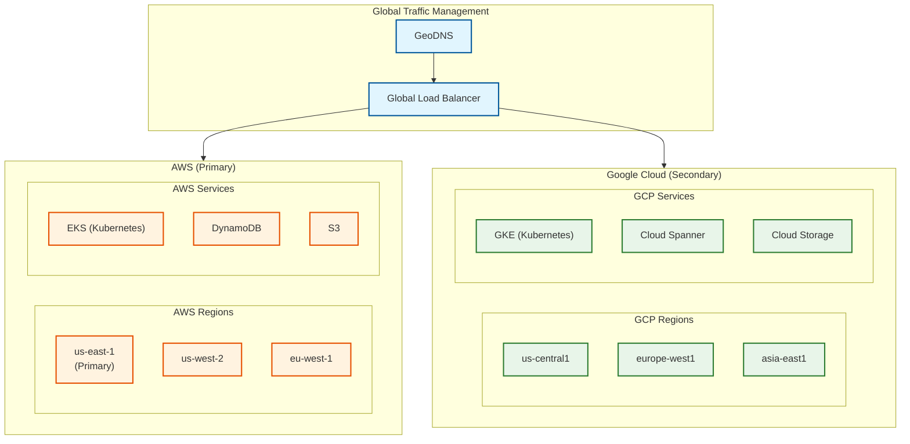
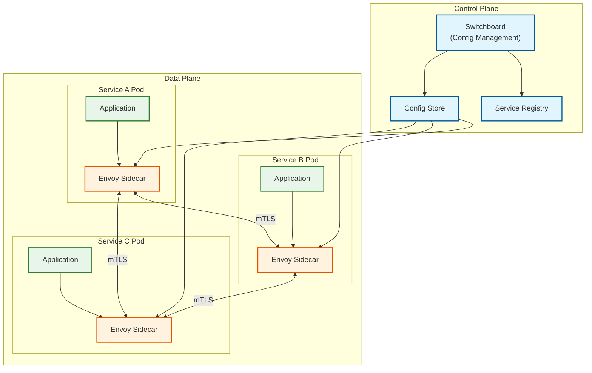
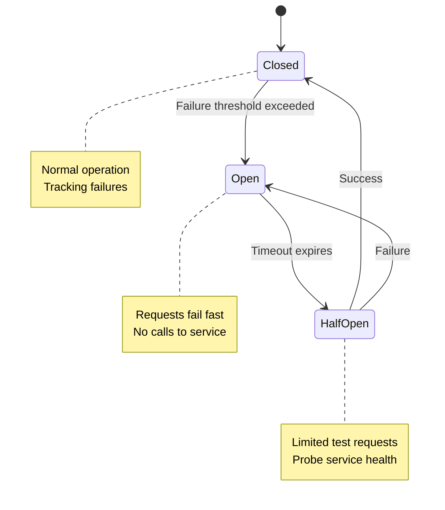
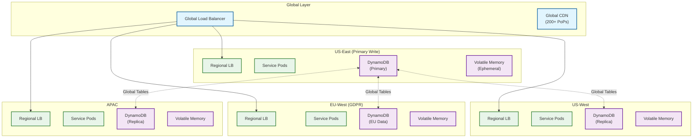

# Scalability & Reliability

## Overview

Snapchat's infrastructure has evolved from a monolithic Google App Engine application to a **multicloud microservices architecture** spanning AWS and Google Cloud. This transformation achieved a **65% cost reduction** while improving latency and reliability for 306+ million daily active users.

---

## Multicloud Architecture

### Cloud Provider Strategy



### Benefits Achieved

| Metric | Before (Monolith) | After (Multicloud) | Improvement |
|--------|-------------------|-------------------|-------------|
| **Compute Costs** | Baseline | 35% of baseline | **65% reduction** |
| **Median Latency** | Baseline | 80% of baseline | **20% improvement** |
| **Service Count** | 1 (monolith) | 300+ | Microservices |
| **Deployment Frequency** | Weekly | Hourly (per-service) | 100x+ |
| **Blast Radius** | Entire app | Single service | Isolated failures |

### Why Multicloud?

| Factor | Decision |
|--------|----------|
| **Cost Optimization** | Leverage spot instances, reserved capacity across providers |
| **Vendor Independence** | No lock-in, negotiate better rates |
| **Regional Coverage** | Best PoP coverage combining both providers |
| **Service Selection** | Use best-in-class services from each (DynamoDB vs Spanner) |
| **Reliability** | Provider-level redundancy |

---

## Service Mesh Architecture

### Envoy Service Mesh



### Switchboard (Internal Tool)

Switchboard is Snap's internal service configuration management system:

| Feature | Description |
|---------|-------------|
| **Single Pane of Glass** | Manage all 300+ services across clouds |
| **Traffic Shifting** | Gradual rollouts, A/B testing |
| **Region Draining** | Gracefully shift traffic during maintenance |
| **Circuit Breaker Config** | Per-service thresholds |
| **Rate Limit Config** | Per-endpoint limits |

### Service Mesh Scale

| Metric | Value |
|--------|-------|
| **Services** | 300+ |
| **Service-to-Service QPS** | 10 million |
| **Regions** | 7 (across AWS + GCP) |
| **mTLS Coverage** | 100% internal traffic |
| **Config Propagation** | <5 seconds |

---

## Horizontal Scaling Strategy

### Connection Layer Scaling

```
WEBSOCKET SERVER SCALING

Target: 50 million concurrent connections (peak)

Per-Server Capacity:
  - Max connections: 50,000
  - Memory per connection: ~10 KB
  - Memory per server: ~500 MB for connections
  - CPU: Connection management + heartbeats

Server Count Calculation:
  50M connections / 50K per server = 1,000 servers

Scaling Strategy:
  - Horizontal pod autoscaling in Kubernetes
  - Scale trigger: CPU > 70% OR connections > 40K
  - Scale down: CPU < 30% AND connections < 20K

Connection Distribution:
  - Consistent hashing by user_id
  - Sticky sessions for reconnection
  - Graceful draining on scale-down
```

### Database Scaling

#### DynamoDB Auto-Scaling

```
DYNAMODB CONFIGURATION

Table: snapchat_main
  Partition Key: entity_type#entity_id
  Sort Key: attribute_type#timestamp

Capacity Mode: On-Demand (pay per request)
  - Handles traffic spikes automatically
  - No capacity planning needed
  - 20% latency reduction vs provisioned mode

Global Tables: Enabled
  - Multi-region replication
  - Automatic conflict resolution (last writer wins)
  - Regional reads for low latency

DAX (Accelerator):
  - Enabled for hot data (user profiles, friend lists)
  - Microsecond latency for cached items
  - Write-through caching
```

#### Cassandra Scaling

```
CASSANDRA CLUSTER

Use Case: Time-series data (locations, analytics)

Cluster Configuration:
  - Nodes: 50 per region
  - Replication Factor: 3
  - Consistency Level: LOCAL_QUORUM (writes), LOCAL_ONE (reads)

Keyspace Design:
  keyspace: snap_locations
    replication: {'class': 'NetworkTopologyStrategy',
                  'us-east': 3, 'eu-west': 3, 'ap-south': 3}

Compaction Strategy: TimeWindowCompactionStrategy
  - Optimized for time-series data
  - Automatic cleanup of old data (TTL)

Scaling Triggers:
  - Disk usage > 70%: Add nodes
  - Read latency p99 > 50ms: Add nodes
  - Write latency p99 > 10ms: Check hotspots
```

### Sharding Strategy

```
USER-BASED SHARDING

Shard Key: user_id (UUID)
Shard Count: 256 (power of 2)

Shard Assignment:
  shard = SHA256(user_id)[0:2] % 256

Data Co-location:
  - User's Snaps → Same shard as user
  - User's Stories → Same shard as user
  - User's Friends → Same shard as user (for one direction)

Cross-Shard Operations:
  - Friend queries: Scatter-gather
  - Story feeds: Pre-computed, cached
  - Global analytics: Separate pipeline

Rebalancing:
  - Virtual shards for easier rebalancing
  - Background migration with double-write
```

---

## Fault Tolerance Patterns

### Circuit Breaker



```
CIRCUIT BREAKER CONFIGURATION (per service)

Messaging Service:
  failure_threshold: 50%
  window_size: 10 seconds
  min_requests: 20
  open_duration: 30 seconds
  half_open_requests: 5

Stories Service:
  failure_threshold: 60%
  window_size: 10 seconds
  min_requests: 10
  open_duration: 20 seconds
  half_open_requests: 3

Lens Service:
  failure_threshold: 70%  // More tolerant (non-critical)
  window_size: 15 seconds
  min_requests: 10
  open_duration: 15 seconds
  half_open_requests: 5
```

### Bulkhead Pattern

```
RESOURCE ISOLATION

Thread Pools (per dependency):
  messaging_service_pool:
    max_threads: 100
    queue_size: 500
    timeout: 2s

  stories_service_pool:
    max_threads: 50
    queue_size: 200
    timeout: 5s

  map_service_pool:
    max_threads: 30
    queue_size: 100
    timeout: 3s

  lens_service_pool:
    max_threads: 20
    queue_size: 50
    timeout: 10s  // Model downloads can be slow

Benefit: Failure in one dependency doesn't exhaust all threads
```

### Retry Strategy

```
RETRY CONFIGURATION

Exponential Backoff with Jitter:

FUNCTION retry_with_backoff(operation, max_retries=3):
    FOR attempt IN 1..max_retries:
        TRY:
            RETURN operation()
        CATCH RetryableError:
            IF attempt == max_retries:
                RAISE

            // Exponential backoff: 100ms, 200ms, 400ms...
            base_delay = 100ms * (2 ^ (attempt - 1))

            // Add jitter (0-100% of base delay)
            jitter = random(0, base_delay)
            delay = base_delay + jitter

            // Cap at max delay
            delay = MIN(delay, 5 seconds)

            SLEEP(delay)

Retryable Operations:
  - Network timeouts (YES)
  - 5xx server errors (YES)
  - 429 rate limited (YES, with longer backoff)
  - 4xx client errors (NO)
  - Database conflicts (YES, with read-modify-write)

Non-Retryable:
  - Authentication failures
  - Validation errors
  - Business logic errors
```

### Graceful Degradation

| Scenario | Degradation Strategy |
|----------|---------------------|
| **AR Service Overloaded** | Disable complex Lenses, show basic filters |
| **Map Service Down** | Show cached friend locations (stale OK) |
| **Stories Service Slow** | Show cached feed, delay refresh |
| **Recommendations Down** | Show chronological feed |
| **Content Moderation Delayed** | Queue content, allow posting with async review |

```
FEATURE FLAGS FOR DEGRADATION

feature_flags:
  ar_complex_lenses:
    enabled: true
    fallback: "basic_filters_only"
    circuit_breaker: "lens_service"

  snap_map_live_locations:
    enabled: true
    fallback: "cached_locations_30min"
    circuit_breaker: "map_service"

  story_recommendations:
    enabled: true
    fallback: "chronological_feed"
    circuit_breaker: "recommendations_service"

DEGRADATION LOGIC:

FUNCTION get_ar_lens(lens_id):
    IF NOT feature_flags.ar_complex_lenses.enabled:
        RETURN get_basic_filter()

    IF circuit_breaker("lens_service").is_open():
        RETURN get_basic_filter()

    TRY:
        RETURN lens_service.get(lens_id)
    CATCH Timeout:
        RETURN get_basic_filter()
```

---

## Multi-Region Deployment

### Regional Topology



### Data Residency

| Data Type | Primary Region | Replication | Notes |
|-----------|---------------|-------------|-------|
| **US User Data** | US-East | Global Tables | Full sync |
| **EU User Data** | EU-West | EU only (GDPR) | No cross-border |
| **Ephemeral Snaps** | User's region | None | Region-local |
| **Stories** | Author's region | CDN (global) | Media cached globally |
| **Location Data** | User's region | None | No cross-region |

### Failover Strategy

```
REGIONAL FAILOVER

Health Checks:
  - HTTP health check every 5 seconds
  - Failure threshold: 3 consecutive failures
  - Recovery threshold: 2 consecutive successes

Failover Process:
  1. Health check failures detected
  2. Remove region from global load balancer (< 30 seconds)
  3. Traffic shifts to healthy regions
  4. Alert on-call team

Failback Process:
  1. Region health restored
  2. Gradual traffic increase (10%, 25%, 50%, 100%)
  3. Monitor for issues at each stage

REGIONAL DRAIN (Planned Maintenance):

FUNCTION drain_region(region):
    // Gradual traffic reduction
    FOR weight IN [80%, 50%, 20%, 0%]:
        set_traffic_weight(region, weight)
        WAIT(5 minutes)
        verify_no_errors()

    // Perform maintenance
    perform_maintenance(region)

    // Gradual traffic restoration
    FOR weight IN [20%, 50%, 80%, 100%]:
        set_traffic_weight(region, weight)
        WAIT(5 minutes)
        verify_no_errors()
```

---

## Disaster Recovery

### RTO and RPO Targets

| Data Type | RPO | RTO | Strategy |
|-----------|-----|-----|----------|
| **User Profiles** | 0 (sync replication) | <5 minutes | Global Tables |
| **Ephemeral Snaps** | N/A (volatile) | N/A | No backup needed |
| **Stories** | <1 minute | <15 minutes | Cross-region CDN |
| **Memories** | <5 minutes | <30 minutes | Cross-region blob |
| **Friend Graph** | 0 (sync replication) | <5 minutes | Global Tables |
| **Location Data** | N/A | N/A | Ephemeral, no backup |

### Backup Strategy

```
BACKUP CONFIGURATION

User Data (DynamoDB Global Tables):
  - Continuous replication to all regions
  - Point-in-time recovery: 35 days
  - On-demand backups: Weekly, retained 90 days

Media (Blob Storage):
  - Cross-region replication: US-East ↔ US-West
  - Versioning: Enabled for Memories
  - Lifecycle: Delete after 90 days (Stories)

Ephemeral Data:
  - NO BACKUP (by design)
  - Loss on failure is acceptable
  - Aligns with ephemeral product promise

Database Snapshots:
  - DynamoDB: Automatic, continuous
  - Cassandra: Daily snapshots, 7-day retention
```

### Chaos Engineering

```
CHAOS EXPERIMENTS

Experiment 1: Service Failure
  - Randomly kill 10% of pods for a service
  - Verify circuit breakers activate
  - Verify graceful degradation
  - Run: Weekly

Experiment 2: Region Failure
  - Simulate full region outage
  - Verify traffic shifts to other regions
  - Measure recovery time
  - Run: Monthly

Experiment 3: Database Latency
  - Inject 500ms latency to DynamoDB
  - Verify caching layer handles load
  - Verify timeouts work correctly
  - Run: Weekly

Experiment 4: Network Partition
  - Simulate split-brain between regions
  - Verify eventual consistency
  - Verify no data corruption
  - Run: Monthly

Experiment 5: CDN Failure
  - Disable CDN edge serving
  - Verify origin handles direct traffic
  - Measure latency impact
  - Run: Quarterly
```

---

## Capacity Planning

### Scaling Triggers

| Resource | Scale Up Trigger | Scale Down Trigger | Max Scale |
|----------|-----------------|-------------------|-----------|
| **WebSocket Servers** | CPU > 70% OR Conn > 40K | CPU < 30% AND Conn < 20K | 2,000 pods |
| **API Servers** | CPU > 70% OR RPS > 10K | CPU < 30% AND RPS < 5K | 1,000 pods |
| **Deletion Workers** | Queue > 10K | Queue < 1K | 100 pods |
| **Media Transcoder** | Queue > 1K | Queue < 100 | 200 pods |
| **ML Inference** | GPU > 80% | GPU < 40% | 50 pods |

### Growth Planning

```
CAPACITY PROJECTION (5 years)

                    Current    Year 2      Year 5
DAU                 306M       400M        600M
Peak Concurrent     50M        65M         100M
Snaps/Day           5.4B       8B          15B
Stories/Day         1B         1.5B        3B
Location Updates/s  200K       300K        500K

INFRASTRUCTURE SCALING

WebSocket Servers:
  Current: 1,000
  Year 5: 2,000 (linear with concurrent users)

DynamoDB:
  Current: On-demand, ~$X/month
  Year 5: ~2x cost (efficient scaling)

Volatile Memory Cluster:
  Current: 810 TB
  Year 5: 2.5 PB (3x growth)

CDN Bandwidth:
  Current: 600 GB/s peak
  Year 5: 2 TB/s peak
```

### Cost Optimization Strategies

| Strategy | Savings | Implementation |
|----------|---------|----------------|
| **Reserved Instances** | 30-50% | 1-3 year commitments |
| **Spot Instances** | 60-80% | For batch processing, ML training |
| **Right-Sizing** | 20-30% | Continuous monitoring, auto-recommendation |
| **Multi-Cloud Arbitrage** | 10-20% | Use cheaper provider for workload |
| **Tiered Storage** | 40-60% | Move cold data to cheaper tiers |
| **CDN Optimization** | 20-30% | Origin shield, cache hit optimization |

---

## Summary

Snapchat's scalability and reliability architecture:

| Aspect | Approach | Key Metric |
|--------|----------|------------|
| **Cloud Strategy** | Multicloud (AWS + GCP) | 65% cost reduction |
| **Service Mesh** | Envoy + Switchboard | 10M QPS |
| **Database** | DynamoDB Global Tables | Sub-10ms latency |
| **Fault Tolerance** | Circuit breaker + bulkhead | <30s failover |
| **Multi-Region** | 4 regions, Global LB | 99.99% availability |
| **Disaster Recovery** | Global Tables, CDN | <5 min RTO (user data) |

Key principles:
1. **Ephemeral data has no backup** - Aligns with product promise
2. **Multicloud for flexibility** - Not locked to any provider
3. **Service mesh abstracts complexity** - 300+ services manageable
4. **Graceful degradation** - Core features always available
