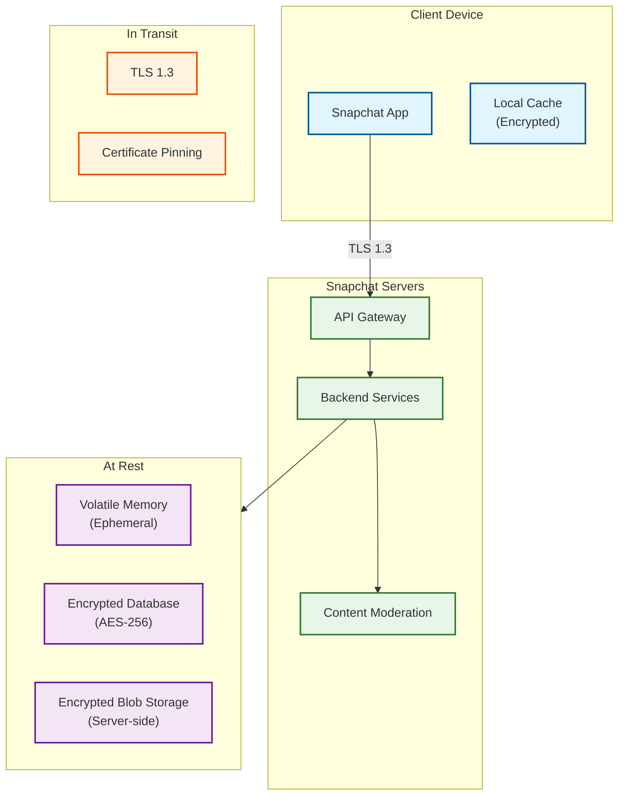
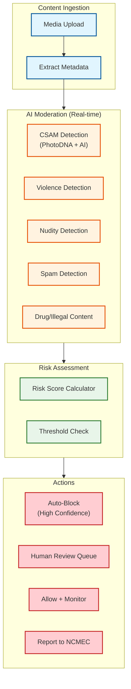
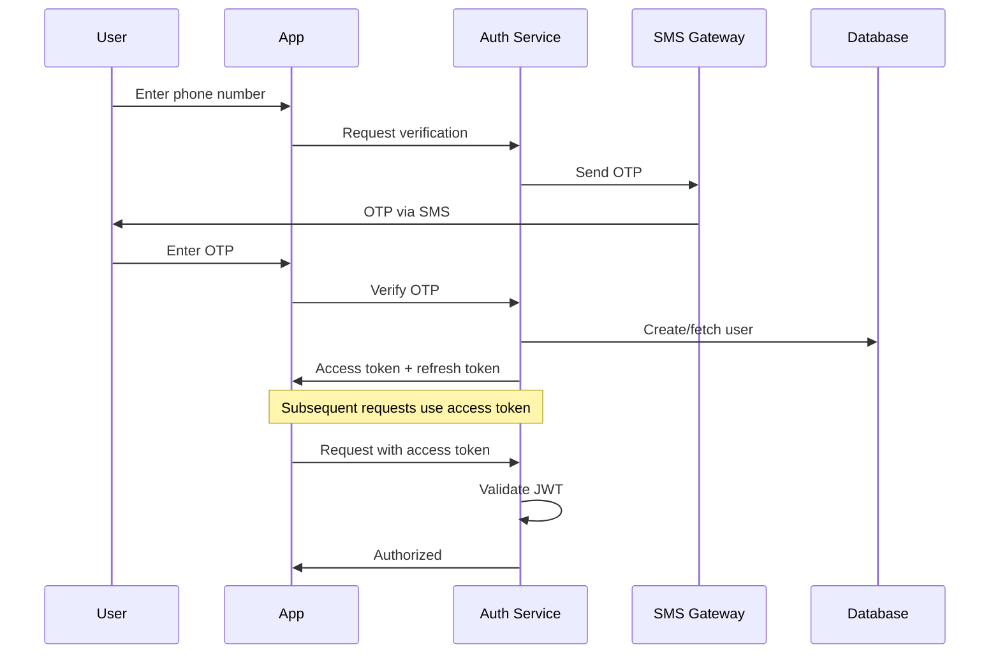

# Security & Compliance

## Overview

Snapchat's security model differs significantly from end-to-end encrypted platforms like WhatsApp. By design, Snapchat uses **server-side encryption** (not E2EE), which enables:

1. **Content moderation** - Scan for CSAM, abuse, and policy violations
2. **Guaranteed deletion** - Server controls content lifecycle
3. **Law enforcement cooperation** - Can provide content when legally required
4. **Ephemeral promise** - Privacy through deletion, not encryption

This document covers Snapchat's encryption model, content moderation, threat model, privacy controls, and compliance frameworks.

---

## Encryption Model

### Encryption Architecture



### Encryption Layers

| Layer | Encryption | Details |
|-------|------------|---------|
| **In Transit** | TLS 1.3 | All client-server communication |
| **Certificate Pinning** | Yes | Prevents MITM attacks |
| **At Rest (Database)** | AES-256 | Server-managed keys |
| **At Rest (Blob)** | AES-256 | Server-side encryption |
| **Local Cache** | Device encryption | iOS Keychain, Android Keystore |
| **End-to-End** | **No** (except My Eyes Only) | Server can access content |

### Why Not End-to-End Encryption?

| Factor | Server-Side (Snapchat) | E2EE (WhatsApp) |
|--------|------------------------|-----------------|
| **Content Moderation** | Full AI + human review | Metadata only |
| **CSAM Detection** | Server-side scanning | Client-side hash matching (controversial) |
| **Abuse Prevention** | Can analyze content patterns | Limited visibility |
| **Guaranteed Deletion** | Server controls deletion | Client-dependent |
| **Law Enforcement** | Can provide content | Cannot decrypt |
| **User Privacy** | Trust in Snapchat | Cryptographic guarantee |

**Snapchat's Position**: Privacy is achieved through **ephemeral deletion**, not encryption. The ability to moderate content and guarantee deletion is more valuable than E2EE.

### My Eyes Only (Optional E2E)

For sensitive saved content, users can enable "My Eyes Only":

```
MY EYES ONLY ENCRYPTION

Purpose: Client-encrypted storage for Memories

Flow:
1. User sets a PIN (not recoverable by Snapchat)
2. PIN derives encryption key (PBKDF2, 100K iterations)
3. Content encrypted locally with AES-256-GCM
4. Encrypted blob uploaded to server
5. Server cannot decrypt (no key access)

Limitations:
- PIN forgotten = data lost
- Only for Memories, not Snaps
- Opt-in feature

Implementation:
  key = PBKDF2(user_pin, salt, iterations=100000, hash=SHA256)
  encrypted_content = AES_256_GCM_Encrypt(content, key)
  upload(encrypted_content)  // Server stores opaque blob
```

---

## Content Moderation

### Moderation Architecture



### Moderation Categories

| Category | Detection Method | Action |
|----------|------------------|--------|
| **CSAM** | PhotoDNA hash + AI | Auto-block + Report to NCMEC |
| **Nudity (Adult)** | Computer vision | Age verification, restrict |
| **Violence/Gore** | Computer vision | Block + review |
| **Terrorism** | Hash database + AI | Block + report |
| **Drugs/Illegal** | Computer vision + NLP | Restrict + review |
| **Spam** | Behavioral + content | Rate limit + block |
| **Harassment** | NLP + context | Warn + escalate |

### CSAM Detection Pipeline

```
CSAM DETECTION (Mandatory for US platforms)

Layer 1: Hash Matching
  - PhotoDNA (Microsoft) - perceptual hashing
  - NCMEC hash database
  - Matches known CSAM images

Layer 2: AI Classification
  - Custom trained model
  - Detects unknown CSAM
  - High precision required (minimize false positives)

Layer 3: Human Review
  - Specialized trust & safety team
  - Trained for traumatic content
  - Mental health support provided

Reporting:
  - Mandatory report to NCMEC within 24 hours
  - Include metadata (IP, timestamps)
  - Preserve evidence for law enforcement

FUNCTION csam_check(media):
    // Layer 1: Hash match
    hash = compute_photodna_hash(media)
    IF hash IN ncmec_database:
        block_and_report(media, "hash_match")
        RETURN BLOCKED

    // Layer 2: AI classification
    score = csam_classifier.predict(media)
    IF score > HIGH_CONFIDENCE_THRESHOLD:
        block_and_report(media, "ai_detection")
        RETURN BLOCKED
    ELSE IF score > REVIEW_THRESHOLD:
        queue_for_human_review(media)
        RETURN PENDING

    RETURN ALLOWED
```

### Moderation Latency

| Content Type | Moderation | Latency |
|--------------|------------|---------|
| **Photo Snap** | Real-time AI | <500ms |
| **Video Snap** | Frame sampling + AI | <2s |
| **Story** | Real-time AI | <500ms |
| **Chat Text** | Real-time NLP | <100ms |
| **Flagged Content** | Human review | <24 hours |

---

## Threat Model (STRIDE)

### STRIDE Analysis

| Threat | Description | Mitigation |
|--------|-------------|------------|
| **Spoofing** | Fake identity, impersonation | Phone verification, 2FA, device attestation |
| **Tampering** | Modify content in transit | TLS 1.3, certificate pinning |
| **Repudiation** | Deny sending content | Audit logs, digital signatures |
| **Information Disclosure** | Data breach, leakage | Encryption at rest, access controls |
| **Denial of Service** | Overwhelm services | Rate limiting, CDN, auto-scaling |
| **Elevation of Privilege** | Unauthorized access | RBAC, principle of least privilege |

### Top Attack Vectors

#### 1. Account Takeover

```
THREAT: Attacker gains access to user account

ATTACK VECTORS:
- Credential stuffing (reused passwords)
- SIM swapping (bypass SMS 2FA)
- Phishing (fake login pages)
- Social engineering

MITIGATIONS:
- Rate limit login attempts
- Device fingerprinting
- Anomaly detection (unusual location, device)
- Mandatory 2FA for sensitive actions
- Login notifications

DETECTION:
  IF login_location != usual_locations:
      send_notification("New device login from {location}")
      require_additional_verification()

  IF failed_attempts > 5:
      temporary_lockout(duration=15_minutes)
      alert_user("Multiple failed login attempts")
```

#### 2. Privacy Breach (Screenshot)

```
THREAT: Recipient screenshots Snap, violating ephemeral promise

TECHNICAL LIMITATION:
- Cannot prevent screenshots
- Screen recording also possible

MITIGATION (Social/UX):
- Notify sender when screenshot taken
- Display "Screenshot!" badge on chat
- Discourage through social pressure

IMPLEMENTATION:
  // iOS: Detect screenshot notification
  NotificationCenter.addObserver(
      name: UIApplication.userDidTakeScreenshotNotification
  ) { _ in
      report_screenshot(snap_id)
  }

  // Android: MediaStore observer for screenshot folder
  ContentObserver(MediaStore.Images.Media.EXTERNAL_CONTENT_URI)
```

#### 3. Man-in-the-Middle (MITM)

```
THREAT: Intercept communications between client and server

MITIGATIONS:
- TLS 1.3 with strong cipher suites
- Certificate pinning (pin to Snapchat's certificates)
- Certificate transparency logging

CERTIFICATE PINNING IMPLEMENTATION:
  trusted_pins = [
      "sha256/AAAAAAAAAAAAAAAAAAAAAAAAAAAAAAAAAAAAAAAAAAA=",  // Primary
      "sha256/BBBBBBBBBBBBBBBBBBBBBBBBBBBBBBBBBBBBBBBBBBB=",  // Backup
  ]

  FUNCTION verify_certificate(cert):
      cert_hash = SHA256(cert.public_key)
      IF cert_hash NOT IN trusted_pins:
          REJECT_CONNECTION()
          alert_security_team("Pin validation failed")
```

#### 4. Data Breach

```
THREAT: Unauthorized access to stored data

MITIGATIONS:
- Encryption at rest (AES-256)
- Key rotation (quarterly)
- Access logging and monitoring
- Network segmentation
- Principle of least privilege

DATA CLASSIFICATION:
  CRITICAL: User credentials, payment info
    → Encrypted, limited access, audit every read

  SENSITIVE: Messages, media
    → Encrypted, access by service accounts only

  INTERNAL: Analytics, logs
    → Encrypted, broader access

  PUBLIC: Username, Bitmoji
    → No encryption needed
```

### Rate Limiting & DDoS Protection

```
RATE LIMITING CONFIGURATION

Per-User Limits:
  send_snap: 100/minute
  view_snap: 500/minute
  upload_media: 50/minute
  location_update: 10/minute
  friend_add: 20/hour
  login_attempt: 5/minute

Per-IP Limits:
  anonymous_requests: 100/minute
  api_calls: 1000/minute

DDoS Protection:
  - Cloud-based DDoS mitigation (Cloudflare/Akamai)
  - Anycast network for traffic distribution
  - Rate limiting at edge
  - Challenge pages for suspicious traffic

IMPLEMENTATION:
  rate_limiter = TokenBucket(
      capacity=100,
      refill_rate=100/60,  // 100 per minute
      key=f"user:{user_id}:send_snap"
  )

  IF NOT rate_limiter.allow():
      RETURN 429 Too Many Requests
```

---

## Authentication & Identity

### Authentication Flow



### Token Management

```
TOKEN CONFIGURATION

Access Token (JWT):
  - Lifetime: 1 hour
  - Contains: user_id, device_id, permissions
  - Signed: RS256 (asymmetric)

Refresh Token:
  - Lifetime: 30 days
  - Stored: Secure storage (Keychain/Keystore)
  - Rotation: New refresh token on each use

FUNCTION refresh_access_token(refresh_token):
    IF is_expired(refresh_token):
        RETURN UNAUTHORIZED

    IF is_revoked(refresh_token):
        RETURN UNAUTHORIZED

    user = get_user_from_refresh_token(refresh_token)

    // Issue new tokens
    new_access_token = generate_jwt(user, expires_in=1_hour)
    new_refresh_token = generate_refresh_token(user, expires_in=30_days)

    // Revoke old refresh token (rotation)
    revoke_token(refresh_token)

    RETURN {
        access_token: new_access_token,
        refresh_token: new_refresh_token
    }
```

### Two-Factor Authentication (2FA)

| Method | Security Level | Availability |
|--------|---------------|--------------|
| **SMS OTP** | Medium | Default |
| **Authenticator App** | High | Optional |
| **Security Key (FIDO2)** | Highest | Premium users |

---

## Privacy Controls

### Snap Map Privacy

```
SNAP MAP PRIVACY LEVELS

Ghost Mode:
  - Complete invisibility on map
  - No location sent to server
  - Friends see "Location not available"

Friends Only:
  - Visible to all friends
  - Default for opted-in users

Select Friends:
  - Visible to specific friend list
  - Granular control

Live Location:
  - Real-time location sharing
  - Time-limited (15 min, 1 hour, 8 hours)
  - Requires explicit action

PRIVACY ENFORCEMENT:

FUNCTION get_visible_friends_for_map(user_id):
    settings = get_privacy_settings(user_id)

    IF settings.ghost_mode:
        RETURN []

    IF settings.share_mode == "friends":
        RETURN get_friend_ids(user_id)

    IF settings.share_mode == "select":
        RETURN settings.selected_friends

    RETURN []
```

### Who Can Contact Me

| Setting | Description |
|---------|-------------|
| **Everyone** | Anyone can send messages |
| **Friends** | Only accepted friends |
| **Friends + Quick Add** | Friends and suggested connections |

### Story Privacy

```
STORY VISIBILITY OPTIONS

Public:
  - Visible to anyone
  - Can appear in Discover (if notable)

Friends:
  - Visible to friend list only
  - Default setting

Custom:
  - Specific friend list
  - Can exclude specific people

Private Story:
  - Named custom list
  - Viewer list hidden from recipients
```

---

## Compliance

### Regulatory Frameworks

| Regulation | Region | Key Requirements | Compliance Measures |
|------------|--------|------------------|---------------------|
| **GDPR** | EU | Right to deletion, data portability | Ephemeral aligns, data export tool |
| **CCPA** | California | Right to know, delete, opt-out | Privacy dashboard, deletion API |
| **COPPA** | US | Parental consent for <13 | 13+ age gate, Family Center |
| **HIPAA** | US | Health data protection | N/A (no health data processed) |
| **DSA** | EU | Transparency, illegal content removal | Content moderation reports |

### GDPR Compliance

```
GDPR REQUIREMENTS AND IMPLEMENTATION

Right to Access (Article 15):
  - User can request all data
  - Downloadable data export
  - Includes: Snaps metadata, Stories, Friends, Settings

Right to Deletion (Article 17):
  - Ephemeral model aligns naturally
  - Full account deletion available
  - 30-day grace period, then permanent

Right to Portability (Article 20):
  - Data export in machine-readable format
  - JSON format available

Data Minimization (Article 5):
  - Collect only necessary data
  - Ephemeral = minimal retention

Consent (Article 7):
  - Clear opt-in for location sharing
  - Granular permissions

DELETION IMPLEMENTATION:

FUNCTION delete_account(user_id):
    // Mark account for deletion
    set_account_status(user_id, "pending_deletion")

    // 30-day grace period
    schedule_job(
        delete_user_data,
        user_id,
        execute_at=NOW() + 30_DAYS
    )

FUNCTION delete_user_data(user_id):
    // Delete all user data
    delete_snaps_by_sender(user_id)
    delete_stories_by_author(user_id)
    delete_memories(user_id)
    delete_friendships(user_id)
    delete_location_history(user_id)
    delete_chat_history(user_id)

    // Anonymize analytics
    anonymize_analytics_data(user_id)

    // Delete account record
    delete_user_record(user_id)

    // Log for compliance
    audit_log.record("account_deleted", user_id, NOW())
```

### Law Enforcement Requests

```
LAW ENFORCEMENT PROCESS

Valid Requests:
  - Subpoena (subscriber info only)
  - Court order (content, metadata)
  - Search warrant (full access)
  - Emergency request (imminent harm)

Response Timeline:
  - Emergency: Within hours
  - Standard: 30 days
  - Complex: 90 days

What Snapchat Can Provide:
  - Account info (email, phone, created date)
  - IP logs (last 30 days)
  - Unopened Snaps (if still on server)
  - Story content (if still live)
  - Memories (if saved)
  - Chat logs (if saved by user)

What Snapchat Cannot Provide:
  - Deleted Snaps (ephemeral)
  - My Eyes Only content (client-encrypted)
  - Content not on servers

TRANSPARENCY REPORT:
  - Published biannually
  - Total requests received
  - Requests complied with
  - Accounts affected
```

### Family Center (Parental Controls)

```
FAMILY CENTER FEATURES

For Teens (13-17):
  - Location sharing with parent
  - Friend list visibility for parent
  - Time spent reports

For Parents:
  - See who teen is friends with
  - See who teen has been messaging (not content)
  - Request live location sharing
  - View Snap Map settings

IMPLEMENTATION:
  Linked accounts (parent + teen)
  Parent cannot see:
    - Message content
    - Snap content
    - Story content

  Parent can see:
    - Friend list
    - Conversation participants
    - Location settings
    - Screen time
```

---

## Security Incident Response

### Incident Classification

| Severity | Description | Response Time |
|----------|-------------|---------------|
| **P0 (Critical)** | Data breach, widespread service outage | <15 minutes |
| **P1 (High)** | Security vulnerability, partial outage | <1 hour |
| **P2 (Medium)** | Suspicious activity, localized issue | <4 hours |
| **P3 (Low)** | Minor security concern | <24 hours |

### Incident Response Process

```
INCIDENT RESPONSE WORKFLOW

1. Detection
   - Automated alerts (SIEM, IDS)
   - User reports
   - Bug bounty submissions

2. Triage (< 15 min for P0)
   - Assess severity
   - Identify affected systems
   - Page on-call team

3. Containment
   - Isolate affected systems
   - Revoke compromised credentials
   - Block malicious IPs

4. Eradication
   - Remove malware/backdoors
   - Patch vulnerabilities
   - Reset affected accounts

5. Recovery
   - Restore services
   - Monitor for recurrence
   - Gradual traffic restoration

6. Post-Incident
   - Root cause analysis
   - Lessons learned
   - Process improvements
   - User notification (if required)
```

---

## Summary

Snapchat's security model:

| Aspect | Approach | Rationale |
|--------|----------|-----------|
| **Encryption** | Server-side (not E2EE) | Enables moderation |
| **Privacy** | Deletion-based | Ephemeral > encrypted |
| **Moderation** | AI + human review | User safety |
| **Authentication** | Phone + optional 2FA | Balance security/usability |
| **Compliance** | GDPR, COPPA, DSA | Global operations |
| **Law Enforcement** | Cooperate with valid requests | Legal obligation |

Key trade-offs:
- Privacy through deletion, not encryption
- Content moderation capability over E2EE
- User safety prioritized over absolute privacy
