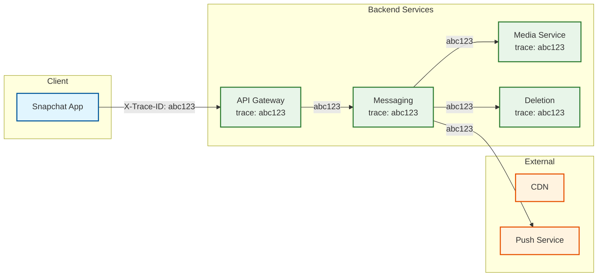

# Observability

## Overview

Observability for Snapchat presents unique challenges due to its ephemeral nature. Traditional logging approaches conflict with the product's privacy promise—you can't retain detailed logs of content that's supposed to disappear. This document covers metrics, logging, tracing, and alerting strategies that balance operational visibility with privacy.

---

## Key Metrics (USE/RED)

### USE Metrics (Infrastructure)

| Resource | Utilization | Saturation | Errors |
|----------|-------------|------------|--------|
| **CPU** | % used per service | Throttling events | OOM kills |
| **Memory** | % used, volatile memory fill | Swap usage | Allocation failures |
| **Network** | Bandwidth in/out | Connection queue depth | Packet drops |
| **Disk I/O** | IOPS, throughput | Queue depth | Read/write errors |
| **GPU (AR)** | % compute used | Frame drops | Inference failures |

### RED Metrics (Services)

| Service | Rate | Errors | Duration |
|---------|------|--------|----------|
| **Messaging** | Snaps/sec sent, received | Delivery failures | Send latency (p50, p95, p99) |
| **Stories** | Posts/sec, views/sec | Upload failures | Post latency, view latency |
| **Map** | Location updates/sec | Update failures | Update latency |
| **Lenses** | Plays/sec, downloads/sec | Inference errors | Frame time |
| **Media** | Uploads/sec, transcodes/sec | Transcode failures | Upload time, transcode time |
| **Deletion** | Deletions/sec | Deletion failures | Queue depth, completion time |

---

## Critical Metrics Dashboard

### Snap Delivery Dashboard

```
┌─────────────────────────────────────────────────────────────────────┐
│                    SNAP DELIVERY METRICS                            │
├─────────────────────────────────────────────────────────────────────┤
│                                                                     │
│  THROUGHPUT                          LATENCY                        │
│  ┌─────────────────────┐            ┌─────────────────────┐        │
│  │ Current: 62,500/s   │            │ p50:  45ms          │        │
│  │ Peak:    195,000/s  │            │ p95:  85ms          │        │
│  │ Target:  200,000/s  │            │ p99:  150ms         │        │
│  └─────────────────────┘            │ Target p99: <200ms  │        │
│                                     └─────────────────────┘        │
│                                                                     │
│  SUCCESS RATE                        QUEUE DEPTH                    │
│  ┌─────────────────────┐            ┌─────────────────────┐        │
│  │ Current: 99.97%     │            │ Pending: 12,450     │        │
│  │ Target:  99.95%     │            │ Processing: 3,200   │        │
│  │ 24h Avg: 99.98%     │            │ Failed: 23          │        │
│  └─────────────────────┘            └─────────────────────┘        │
│                                                                     │
│  ERROR BREAKDOWN (Last Hour)                                        │
│  ┌─────────────────────────────────────────────────────────┐       │
│  │ Timeout:        45  (0.001%)                            │       │
│  │ Invalid Media:  12  (0.0003%)                           │       │
│  │ Rate Limited:   230 (0.005%)                            │       │
│  │ Server Error:   8   (0.0002%)                           │       │
│  └─────────────────────────────────────────────────────────┘       │
│                                                                     │
└─────────────────────────────────────────────────────────────────────┘
```

### Deletion Pipeline Dashboard

```
┌─────────────────────────────────────────────────────────────────────┐
│                    DELETION PIPELINE METRICS                        │
├─────────────────────────────────────────────────────────────────────┤
│                                                                     │
│  THROUGHPUT                          QUEUE HEALTH                   │
│  ┌─────────────────────┐            ┌─────────────────────┐        │
│  │ Deletions/sec: 8,500│            │ Queue Depth: 15,230 │        │
│  │ View-triggered: 85% │            │ Oldest Item: 45sec  │        │
│  │ Expiry-triggered:15%│            │ Workers Active: 50  │        │
│  └─────────────────────┘            └─────────────────────┘        │
│                                                                     │
│  COMPLETION TIME                     FAILURE RATE                   │
│  ┌─────────────────────┐            ┌─────────────────────┐        │
│  │ p50: 5 seconds      │            │ Current: 0.002%     │        │
│  │ p95: 30 seconds     │            │ Target:  <0.01%     │        │
│  │ p99: 60 seconds     │            │ Retries: 125/hour   │        │
│  │ Target: <60 seconds │            └─────────────────────┘        │
│  └─────────────────────┘                                           │
│                                                                     │
│  DELETION STAGES                                                    │
│  ┌─────────────────────────────────────────────────────────┐       │
│  │ Stage           │ Success  │ Latency (p50)              │       │
│  │ Media Delete    │ 99.99%   │ 15ms                       │       │
│  │ CDN Purge       │ 99.95%   │ 500ms                      │       │
│  │ Volatile Clear  │ 100%     │ 1ms                        │       │
│  │ Audit Log       │ 99.99%   │ 5ms                        │       │
│  └─────────────────────────────────────────────────────────┘       │
│                                                                     │
└─────────────────────────────────────────────────────────────────────┘
```

### AR Performance Dashboard

```
┌─────────────────────────────────────────────────────────────────────┐
│                    AR LENS PERFORMANCE                              │
├─────────────────────────────────────────────────────────────────────┤
│                                                                     │
│  FRAME RATE BY DEVICE TIER                                          │
│  ┌─────────────────────────────────────────────────────────┐       │
│  │ Tier 1 (Flagship):   58 FPS avg  │ █████████████████   │       │
│  │ Tier 2 (Mid-range):  45 FPS avg  │ █████████████       │       │
│  │ Tier 3 (Budget):     28 FPS avg  │ ████████            │       │
│  └─────────────────────────────────────────────────────────┘       │
│                                                                     │
│  INFERENCE LATENCY                   MODEL DOWNLOADS                │
│  ┌─────────────────────┐            ┌─────────────────────┐        │
│  │ Face Detection: 3ms │            │ Downloads/sec: 1,200│        │
│  │ Landmark: 2ms       │            │ Cache Hit Rate: 94% │        │
│  │ Lens Effect: 8ms    │            │ Avg Size: 8.5 MB    │        │
│  │ Total: 13ms         │            │ CDN Latency: 45ms   │        │
│  │ Budget: 16ms        │            └─────────────────────┘        │
│  └─────────────────────┘                                           │
│                                                                     │
│  ERROR BREAKDOWN                                                    │
│  ┌─────────────────────────────────────────────────────────┐       │
│  │ Model Load Failed:   0.05%                              │       │
│  │ Inference Timeout:   0.02%                              │       │
│  │ Memory Exceeded:     0.01%                              │       │
│  │ Graceful Fallback:   0.5%                               │       │
│  └─────────────────────────────────────────────────────────┘       │
│                                                                     │
└─────────────────────────────────────────────────────────────────────┘
```

---

## Logging Strategy

### Privacy-Aware Logging

Snapchat's ephemeral promise requires careful logging practices:

| Log Type | What's Logged | What's NOT Logged | Retention |
|----------|---------------|-------------------|-----------|
| **Request Logs** | Endpoint, latency, status | Request body, media | 7 days |
| **Error Logs** | Error code, stack trace | User content | 30 days |
| **Audit Logs** | Action type, actor, timestamp | Content details | 90 days |
| **Security Logs** | Login attempts, IP, device | N/A | 1 year |
| **Deletion Logs** | Snap ID, deletion time | Content, recipients | 90 days |

### Structured Logging Format

```json
{
    "timestamp": "2025-01-15T10:30:00.123Z",
    "level": "INFO",
    "service": "messaging-service",
    "instance_id": "msg-pod-abc123",
    "trace_id": "abc123def456",
    "span_id": "span789",
    "user_id_hash": "sha256:abc...",  // Hashed, not plaintext
    "action": "snap_sent",
    "latency_ms": 45,
    "status": "success",
    "metadata": {
        "recipient_count": 3,
        "media_type": "video",
        "size_bytes": 2048000,
        "region": "us-east-1"
    }
    // NO content, NO recipient IDs, NO media URLs
}
```

### Log Levels

| Level | Usage | Example |
|-------|-------|---------|
| **ERROR** | Failures requiring attention | Deletion failed, DB timeout |
| **WARN** | Degraded but functional | High latency, retry needed |
| **INFO** | Normal operations | Snap sent, Story posted |
| **DEBUG** | Troubleshooting | Request details (no content) |
| **TRACE** | Deep debugging | Per-frame AR metrics |

### Sensitive Data Handling

```
LOGGING BEST PRACTICES

DO LOG:
  - Hashed user IDs (for correlation)
  - Action types (snap_sent, story_viewed)
  - Latencies and error codes
  - Aggregate counts
  - System metrics

DO NOT LOG:
  - Plaintext user IDs (in most cases)
  - Message content
  - Media URLs or references
  - Recipient lists
  - Location coordinates
  - Personal information

PSEUDONYMIZATION:

FUNCTION log_user_action(user_id, action, details):
    // Hash user_id for logs (reversible only with key)
    hashed_id = HMAC_SHA256(user_id, logging_key)

    log({
        user_id_hash: hashed_id,
        action: action,
        // Sanitize details
        details: sanitize_for_logging(details)
    })

FUNCTION sanitize_for_logging(details):
    // Remove sensitive fields
    REMOVE details.recipient_ids
    REMOVE details.content
    REMOVE details.media_url

    // Keep operational fields
    RETURN {
        recipient_count: LEN(original.recipient_ids),
        media_type: details.media_type,
        size_bytes: details.size_bytes
    }
```

---

## Distributed Tracing

### Trace Propagation



### Key Spans

| Operation | Span Name | Key Attributes |
|-----------|-----------|----------------|
| **Send Snap** | `snap.send` | recipient_count, media_type |
| **Upload Media** | `media.upload` | size_bytes, content_type |
| **Deliver Snap** | `snap.deliver` | delivery_method (push/poll) |
| **View Snap** | `snap.view` | view_duration_sec |
| **Delete Snap** | `snap.delete` | trigger (view/expiry) |
| **Transcode** | `media.transcode` | input_format, output_formats |
| **AR Inference** | `ar.inference` | lens_id, frame_time_ms |

### Trace Sampling

```
SAMPLING STRATEGY

Head-Based Sampling:
  - 1% of all requests traced
  - 100% of errors traced
  - 100% of slow requests (>500ms) traced

Tail-Based Sampling:
  - Collect all spans initially
  - Decide to keep based on:
    - Error occurred
    - Latency exceeded threshold
    - Random sample for baseline

SAMPLING CONFIGURATION:
  default_sample_rate: 0.01  // 1%
  error_sample_rate: 1.0     // 100%
  slow_threshold_ms: 500
  slow_sample_rate: 1.0      // 100%
```

---

## Alerting

### Alert Hierarchy

| Severity | Response | Example | Notification |
|----------|----------|---------|--------------|
| **P0 (Critical)** | Immediate (wake up) | Deletion pipeline stopped | PagerDuty + Slack + SMS |
| **P1 (High)** | Within 15 min | Snap delivery >1s | PagerDuty + Slack |
| **P2 (Medium)** | Within 1 hour | AR frame drops | Slack |
| **P3 (Low)** | Next business day | Minor anomaly | Email digest |

### Critical Alerts (P0)

```yaml
# Deletion Pipeline Failure
- alert: DeletionPipelineStopped
  expr: rate(snap_deletions_total[5m]) == 0
  for: 5m
  labels:
    severity: critical
    team: messaging
  annotations:
    summary: "Deletion pipeline has stopped"
    description: "No deletions processed in 5 minutes. This is a CRITICAL compliance issue."
    runbook: "https://runbooks.snap.com/deletion-pipeline"

# Snap Delivery Failure
- alert: SnapDeliveryFailureHigh
  expr: rate(snap_delivery_errors_total[5m]) / rate(snap_delivery_total[5m]) > 0.01
  for: 2m
  labels:
    severity: critical
    team: messaging
  annotations:
    summary: "Snap delivery error rate >1%"
    description: "{{ $value | humanizePercentage }} of Snaps failing to deliver"

# Database Latency
- alert: DynamoDBLatencyHigh
  expr: histogram_quantile(0.99, dynamodb_latency_seconds_bucket) > 0.1
  for: 5m
  labels:
    severity: critical
    team: platform
  annotations:
    summary: "DynamoDB p99 latency >100ms"
```

### Warning Alerts (P1-P2)

```yaml
# Deletion Queue Backlog
- alert: DeletionQueueBacklog
  expr: deletion_queue_depth > 100000
  for: 10m
  labels:
    severity: high
    team: messaging
  annotations:
    summary: "Deletion queue backlog growing"
    description: "Queue depth: {{ $value }}. Consider scaling workers."

# AR Frame Rate Low
- alert: ARFrameRateLow
  expr: ar_frame_rate_fps < 30
  for: 5m
  labels:
    severity: medium
    team: ar
  annotations:
    summary: "AR frame rate below 30 FPS"

# Story CDN Cache Miss High
- alert: StoryCDNCacheMissHigh
  expr: cdn_cache_miss_rate > 0.2
  for: 15m
  labels:
    severity: medium
    team: media
  annotations:
    summary: "CDN cache miss rate >20%"
```

### Runbook References

| Alert | Runbook | Key Actions |
|-------|---------|-------------|
| DeletionPipelineStopped | [deletion-pipeline.md](https://runbooks.snap.com/deletion-pipeline) | Check workers, queue, dependencies |
| SnapDeliveryFailureHigh | [snap-delivery.md](https://runbooks.snap.com/snap-delivery) | Check messaging service, DB |
| DynamoDBLatencyHigh | [dynamodb.md](https://runbooks.snap.com/dynamodb) | Check hot keys, throttling |
| ARFrameRateLow | [ar-performance.md](https://runbooks.snap.com/ar-performance) | Check device distribution, model size |

---

## Unique Observability Challenges

### Challenge 1: Observing Ephemeral Content

**Problem**: How do you debug issues with content that's already deleted?

**Solution**: Metadata-only tracing

```
EPHEMERAL CONTENT OBSERVABILITY

What We Track (Metadata):
  - Snap ID (for correlation)
  - Size, type, duration
  - Send/receive timestamps
  - Delivery status transitions
  - Deletion timestamp and trigger

What We DON'T Track:
  - Actual content
  - Media URLs (after deletion)
  - Recipient details (beyond count)

DEBUGGING WORKFLOW:

User reports: "My Snap wasn't delivered"

1. Get trace ID from client logs
2. Query: traces WHERE trace_id = 'abc123'
3. See span timeline:
   - snap.send: 45ms, success
   - media.upload: 200ms, success
   - snap.deliver: TIMEOUT after 5000ms
4. Root cause: Push notification service timeout
5. Fix: Retry logic, fallback to polling
```

### Challenge 2: Privacy in Distributed Tracing

**Problem**: Traces can leak user behavior patterns.

**Solution**: Anonymized, sampled, aggregated

```
PRIVACY-PRESERVING TRACES

1. User ID Anonymization
   - Hash user IDs in traces
   - Rotation key monthly
   - Only reversible for specific investigations

2. Sampling
   - Only trace 1% of requests
   - No full picture of any user

3. Retention
   - Traces deleted after 7 days
   - Aggregates kept longer (30 days)

4. Access Control
   - Traces: Engineering only
   - Aggregates: Broader access
   - Deanonymization: Requires approval
```

### Challenge 3: Real-Time AR Metrics

**Problem**: AR performance varies dramatically by device, and issues are transient.

**Solution**: Device-tier bucketing + client-side aggregation

```
AR METRICS COLLECTION

Client-Side Aggregation:
  - Collect per-frame metrics locally
  - Aggregate over 10-second windows
  - Send summary to server

Metrics Sent:
  {
    "device_tier": 2,
    "lens_id": "abc123",
    "window_start": "2025-01-15T10:30:00Z",
    "frame_count": 300,
    "avg_frame_time_ms": 14.2,
    "p95_frame_time_ms": 18.5,
    "dropped_frames": 3,
    "inference_errors": 0
  }

Server-Side Analysis:
  - Bucket by device_tier and lens_id
  - Detect problematic Lenses
  - Identify device-specific issues
```

---

## SLO Tracking

### Snapchat SLOs

| SLO | Target | Measurement | Alert Threshold |
|-----|--------|-------------|-----------------|
| **Snap Delivery Latency** | p99 <200ms | End-to-end | >300ms for 5min |
| **Snap Delivery Success** | >99.95% | Success rate | <99.9% for 2min |
| **Deletion Completion** | <60 seconds | Time from trigger | >120s for 5min |
| **Camera Launch** | <6 seconds | Cold start p95 | >8s for 10min |
| **AR Frame Rate** | >30 FPS | Tier 2+ devices | <25 FPS for 5min |
| **Story Load** | <500ms | First story p95 | >1s for 5min |
| **Availability** | 99.99% | Monthly | <99.95% daily |

### Error Budget Tracking

```
ERROR BUDGET CALCULATION

Monthly Budget (99.99% availability):
  Total minutes: 43,200 (30 days)
  Allowed downtime: 4.32 minutes

Current Month Status:
  ┌─────────────────────────────────────────────────┐
  │ Error Budget Remaining: 3.1 minutes (72%)       │
  │ ████████████████████░░░░░░░░                    │
  │                                                 │
  │ Incidents This Month:                           │
  │   - Jan 5: DB failover (1.2 min)               │
  │   - Jan 12: CDN issue (0 min - degraded only)  │
  │                                                 │
  │ Burn Rate: Normal (0.8x)                       │
  └─────────────────────────────────────────────────┘

BURN RATE ALERTS:
  - 10x burn rate for 1 hour: P0 alert
  - 2x burn rate for 6 hours: P1 alert
  - 1.5x burn rate for 24 hours: P2 alert
```

---

## Summary

Snapchat observability principles:

| Principle | Implementation |
|-----------|----------------|
| **Privacy First** | No content in logs, hashed user IDs |
| **Metadata Only** | Track counts, latencies, statuses |
| **Ephemeral Alignment** | Short retention, no reconstruction |
| **Device Awareness** | AR metrics by device tier |
| **Compliance Ready** | Audit logs for deletion verification |

Key metrics to watch:
1. **Deletion pipeline health** - Core product promise
2. **Snap delivery latency** - User experience
3. **AR frame rate** - Lens performance
4. **Queue depths** - System health
5. **Error rates** - Service reliability
