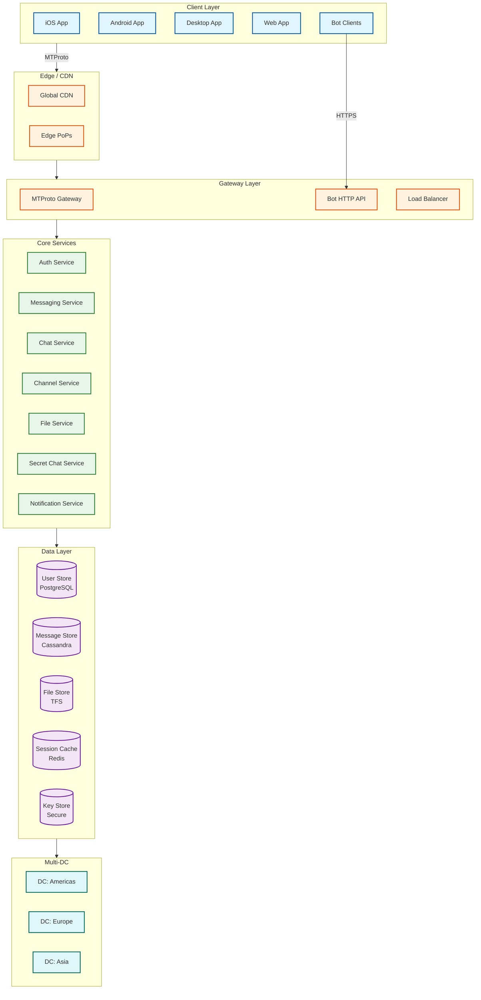

# Telegram System Design

## Overview

Telegram is a **cloud-first messaging platform** serving **1 billion monthly active users** with a unique architecture that prioritizes **speed, multi-device sync, and massive scale groups**. Unlike WhatsApp's end-to-end encryption model, Telegram stores messages on its servers by default, enabling seamless synchronization across unlimited devices and supporting the largest group chats in the messaging industry (200,000+ members in supergroups, unlimited in channels).

**Key Characteristics:**
- **Cloud-Native Storage**: Messages stored server-side for multi-device sync
- **Dual Encryption Model**: Cloud chats (client-server) + Secret Chats (E2EE)
- **Massive Scale**: 200K member supergroups, unlimited channel subscribers (43M+)
- **MTProto 2.0**: Custom protocol optimized for mobile networks
- **Large File Sharing**: 2-4GB files with permanent cloud storage

---

## System Characteristics

| Characteristic | Value | Design Implication |
|----------------|-------|-------------------|
| **Traffic Pattern** | Write-heavy (messages), Read-heavy (channels) | Hybrid optimization, fanout strategies |
| **Latency Target** | <200ms message delivery | Multi-DC proximity, persistent connections |
| **Consistency Model** | Eventual (messages), Strong (ordering per chat) | Append-only logs, sequence numbers |
| **Availability Target** | 99.99% | Multi-DC replication, automatic failover |
| **Encryption Model** | Client-server (cloud) / E2EE (secret chats) | Dual architecture, key management |
| **Scale** | 1B MAU, 15B messages/day, 200K groups | Horizontal sharding, microservices |
| **Storage Model** | Permanent server-side | NoSQL + distributed file system |

---

## Complexity Rating

| Component | Complexity | Reason |
|-----------|------------|--------|
| **MTProto 2.0 Protocol** | Very High | Custom encryption, session management, multi-transport |
| **Channel Fanout (43M+)** | Very High | Real-time delivery to millions of subscribers |
| **Multi-DC Replication** | High | Append-only logs, conflict resolution, failover |
| **Large Group Sync (200K)** | High | Member state, message ordering, read receipts |
| **Secret Chat E2EE** | High | Diffie-Hellman, device-specific keys |
| **File Storage (2-4GB)** | Medium-High | Chunking, deduplication, global CDN |
| **Bots Platform** | Medium | HTTP API, webhooks, Mini Apps |
| **Cloud Chat Delivery** | Medium | Standard message routing, multi-device |

**Overall System Complexity: High**

---

## Quick Navigation

| Document | Purpose | Key Topics |
|----------|---------|------------|
| [01 - Requirements & Estimations](./01-requirements-and-estimations.md) | Scope and capacity | 1B MAU, 15B msgs/day, 200K groups, SLOs |
| [02 - High-Level Design](./02-high-level-design.md) | Architecture | Multi-DC, MTProto flow, cloud vs secret |
| [03 - Low-Level Design](./03-low-level-design.md) | Implementation | Data models, APIs, sharding, algorithms |
| [04 - Deep Dive & Bottlenecks](./04-deep-dive-and-bottlenecks.md) | Critical components | Channel fanout, large groups, file pipeline |
| [05 - Scalability & Reliability](./05-scalability-and-reliability.md) | Scale patterns | Multi-region, failover, replication |
| [06 - Security & Compliance](./06-security-and-compliance.md) | Security model | MTProto 2.0, E2EE, threat model |
| [07 - Observability](./07-observability.md) | Operations | Metrics, tracing, multi-DC monitoring |
| [08 - Interview Guide](./08-interview-guide.md) | Interview prep | Trade-offs, trap questions, pacing |

---

## Architecture Overview



---

## Core Modules

| Module | Responsibility | Key Challenge |
|--------|---------------|---------------|
| **MTProto Gateway** | Protocol handling, encryption/decryption | Custom protocol, session management |
| **Auth Service** | Registration, login, 2FA, sessions | Multi-device, authorization keys |
| **Messaging Service** | 1:1 and group message routing | Ordering, delivery guarantees |
| **Channel Service** | Broadcast to millions | Fanout at scale (43M+ subscribers) |
| **Chat Service** | Conversation state, read receipts | Multi-device sync |
| **File Service** | Upload/download, chunking, CDN | 2-4GB files, deduplication |
| **Secret Chat Service** | E2EE key exchange, device binding | Diffie-Hellman, perfect forward secrecy |
| **Bot API** | HTTP interface for bots | Webhooks, rate limiting |
| **Notification Service** | Push notifications | APNs, FCM, platform routing |

---

## Telegram vs WhatsApp vs Signal

| Aspect | Telegram | WhatsApp | Signal |
|--------|----------|----------|--------|
| **Encryption Default** | Client-server (cloud chats) | E2EE (always) | E2EE (always) |
| **E2EE Option** | Secret Chats only | Always on | Always on |
| **Server Storage** | Permanent (cloud) | Store-and-forward only | Minimal metadata |
| **Protocol** | MTProto 2.0 | Signal Protocol | Signal Protocol |
| **Max Group Size** | 200,000 (supergroup) | 1,024 | 1,000 |
| **Channels** | Unlimited subscribers | Not supported | Not supported |
| **File Size** | 2-4GB | ~100MB | ~100MB |
| **Multi-Device** | Unlimited, synced | Primary + 4 linked | Primary + linked |
| **Message History** | Server-synced | Device-stored | Device-stored |
| **Open Source** | Clients only | Clients only | Full (client + server) |
| **MAU** | 1B | 2B | ~100M |

---

## Key Scale Numbers

```
┌──────────────────────────────────────────────────────────────────┐
│                    TELEGRAM SCALE (2025-2026)                     │
├──────────────────────────────────────────────────────────────────┤
│  Monthly Active Users (MAU)        │  1,000,000,000 (1B)         │
│  Daily Active Users (DAU)          │  500,000,000 (500M)         │
│  Premium Subscribers               │  15,000,000                  │
│                                                                   │
│  Messages per Day                  │  15,000,000,000 (15B)        │
│  Messages per Second (avg)         │  ~175,000                    │
│  Messages per Second (peak)        │  ~500,000+                   │
│                                                                   │
│  Supergroup Max Size               │  200,000 members             │
│  Gigagroup Max Size                │  Unlimited (admin-only)      │
│  Channel Max Subscribers           │  Unlimited (43M+ largest)    │
│                                                                   │
│  File Size Limit (Free)            │  2 GB                        │
│  File Size Limit (Premium)         │  4 GB                        │
│  Cloud Storage                     │  Unlimited (permanent)       │
│                                                                   │
│  New Users per Day                 │  2-2.5 million               │
│  App Opens per User/Day            │  ~21 times                   │
│  Data Centers                      │  5+ globally                 │
└──────────────────────────────────────────────────────────────────┘
```

---

## Message Flow Overview

```
┌─────────────────────────────────────────────────────────────────────────────┐
│  CLOUD CHAT: Alice sends "Hello" to Bob                                      │
├─────────────────────────────────────────────────────────────────────────────┤
│                                                                             │
│  1. ENCRYPT (Client-Server)                                                 │
│     Alice's app encrypts message with session key (MTProto 2.0)             │
│                                                                             │
│  2. SEND                                                                    │
│     Encrypted message sent to Telegram server via MTProto                   │
│                                                                             │
│  3. STORE & DECRYPT                                                         │
│     Server decrypts, stores message, re-encrypts for delivery               │
│                                                                             │
│  4. ROUTE                                                                   │
│     ┌─────────────┐                                                         │
│     │ Is Bob      │──YES──► Deliver to Bob's active device(s)               │
│     │ online?     │                                                         │
│     └──────┬──────┘                                                         │
│            │NO                                                              │
│            ▼                                                                │
│     Store for later + Send push notification                                │
│                                                                             │
│  5. SYNC                                                                    │
│     Message available on ALL of Bob's devices (desktop, mobile, web)        │
│                                                                             │
│  KEY DIFFERENCE FROM WHATSAPP:                                              │
│  • Server can read message content (for sync, search, moderation)           │
│  • Message persists on server until user deletes                            │
│  • Full chat history available on new device login                          │
│                                                                             │
└─────────────────────────────────────────────────────────────────────────────┘
```

```
┌─────────────────────────────────────────────────────────────────────────────┐
│  SECRET CHAT: Alice sends E2EE message to Bob                                │
├─────────────────────────────────────────────────────────────────────────────┤
│                                                                             │
│  1. KEY EXCHANGE (First Time)                                               │
│     Diffie-Hellman 2048-bit key exchange                                    │
│     Shared secret known only to Alice and Bob's devices                     │
│                                                                             │
│  2. ENCRYPT (End-to-End)                                                    │
│     Alice's app encrypts with shared secret (server cannot decrypt)         │
│                                                                             │
│  3. RELAY                                                                   │
│     Server relays encrypted blob (cannot read content)                      │
│                                                                             │
│  4. DECRYPT                                                                 │
│     Only Bob's specific device can decrypt                                  │
│                                                                             │
│  LIMITATIONS:                                                               │
│  • Device-specific (no multi-device sync)                                   │
│  • 1:1 only (no group secret chats)                                         │
│  • Must be manually initiated                                               │
│  • Not available on all platforms (e.g., web)                               │
│                                                                             │
└─────────────────────────────────────────────────────────────────────────────┘
```

---

## Technology Stack

| Layer | Technology | Purpose |
|-------|------------|---------|
| **Protocol** | MTProto 2.0 | Custom mobile-optimized protocol |
| **Encryption** | AES-256 + SHA-256 | Message encryption |
| **Key Exchange** | Diffie-Hellman 2048-bit | Secret chat key establishment |
| **Transport** | TCP, HTTP, WebSocket | Multi-transport support |
| **Backend** | C++ (core), custom stack | High performance |
| **Databases** | PostgreSQL, Cassandra | Relational + wide-column |
| **File System** | TFS (Telegram File System) | Distributed file storage |
| **Cache** | Redis/Memcached | Session, presence, hot data |
| **CDN** | Global edge network | Media delivery |
| **Push** | APNs, FCM | Offline notifications |

---

## What Makes Telegram's Architecture Unique

### 1. Server-Side Cloud Storage
- **Multi-Device Sync**: Messages available on all devices instantly
- **Search**: Full-text search across chat history
- **History on New Device**: No backup restore needed
- **Trade-off**: Server can potentially access message content

### 2. Dual Encryption Model
- **Cloud Chats**: Convenient, synced, server-encrypted
- **Secret Chats**: Maximum security, device-bound, E2EE
- **User Choice**: Balance convenience vs. privacy per conversation

### 3. Massive Scale Groups & Channels
- **200K Supergroups**: Interactive communities
- **Unlimited Channels**: Broadcast to millions (43M+ subscribers)
- **Gigagroups**: Hybrid model for massive communities

### 4. MTProto 2.0 Custom Protocol
- **Mobile Optimized**: Works well on unreliable networks
- **Multi-Transport**: HTTP, WebSocket, raw TCP
- **Session Independence**: Multiple connections per session
- **Efficient Binary Format**: Reduced bandwidth

### 5. Unlimited File Sharing
- **2-4GB Files**: Largest in messaging industry
- **Permanent Storage**: Files never expire
- **No Compression for Some Types**: Original quality preserved

---

## Quick Reference Card

### Capacity Estimates (Interview Quick Reference)
```
MAU:                    1B
DAU:                    500M (50% of MAU)
Messages/day:           15B
Messages/sec (avg):     175K
Messages/sec (peak):    500K
Supergroup max:         200K members
Channel max:            Unlimited (43M+ largest)
File size:              2GB free, 4GB premium
Cloud storage:          Unlimited
Data centers:           5+ globally
```

### Key Latency Targets
```
Message delivery (online):     <200ms
Message delivery (offline):    <30s after coming online
File upload (100MB):           <30s p95
Group sync (200K):             <5s for recent messages
Secret chat key exchange:      <2s
```

### Key Technologies
```
Protocol:          MTProto 2.0
Encryption:        AES-256 + DH-2048
Transport:         TCP, HTTP, WebSocket
Backend:           C++ (core)
User DB:           PostgreSQL (sharded)
Message Store:     Cassandra
File Store:        TFS (distributed)
Cache:             Redis
Push:              APNs + FCM
```

---

## Related Designs

| Design | Relevance |
|--------|-----------|
| [WhatsApp](../4.7-whatsapp/00-index.md) | E2EE-first messaging (contrast) |
| [Snapchat](../4.8-snapchat/00-index.md) | Ephemeral messaging |
| [Slack/Discord](../4.10-slack-discord/00-index.md) | Channel-based communication |
| [Distributed Message Queue](../1.6-distributed-message-queue/00-index.md) | Message delivery patterns |
| [CDN Design](../1.15-content-delivery-network-cdn/00-index.md) | Media delivery |
| [Multi-Region Active-Active](../2.9-multi-region-active-active/00-index.md) | DC replication |

---

## Sources & References

- [MTProto Protocol Documentation](https://core.telegram.org/mtproto)
- [Telegram Data Centers](https://core.telegram.org/api/datacenter)
- [Channels, Supergroups, Gigagroups API](https://core.telegram.org/api/channel)
- [End-to-End Encryption (Secret Chats)](https://core.telegram.org/api/end-to-end)
- [Telegram Bot API](https://core.telegram.org/bots/api)
- [Telegram FAQ - Technical](https://core.telegram.org/techfaq)
- [DemandSage Telegram Statistics 2025-2026](https://www.demandsage.com/telegram-statistics/)
- [Security Analysis of MTProto 2.0](https://mtpsym.github.io/)
