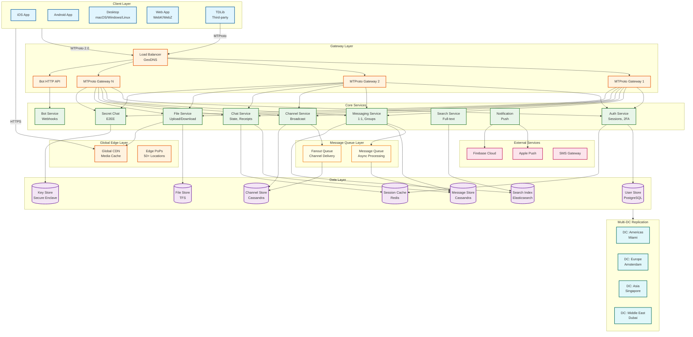
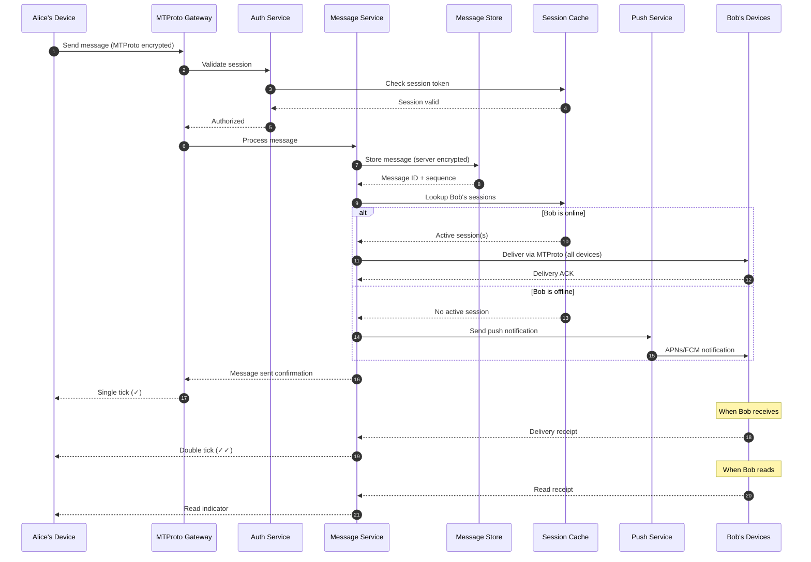
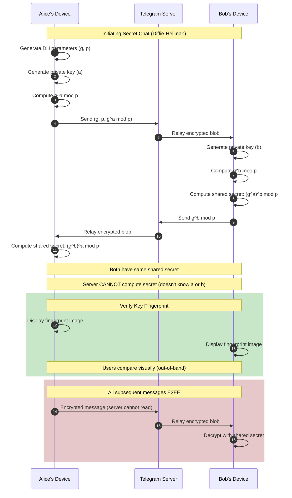
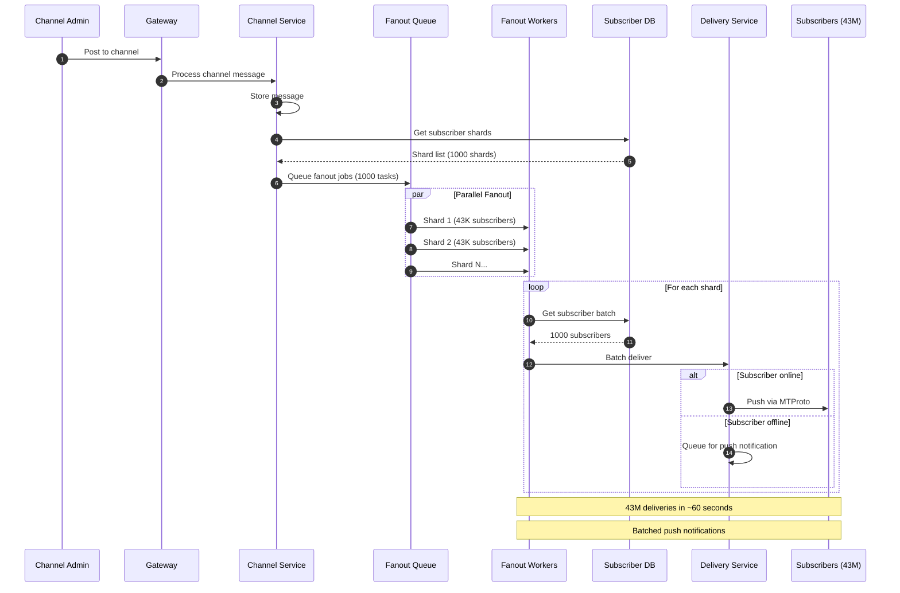
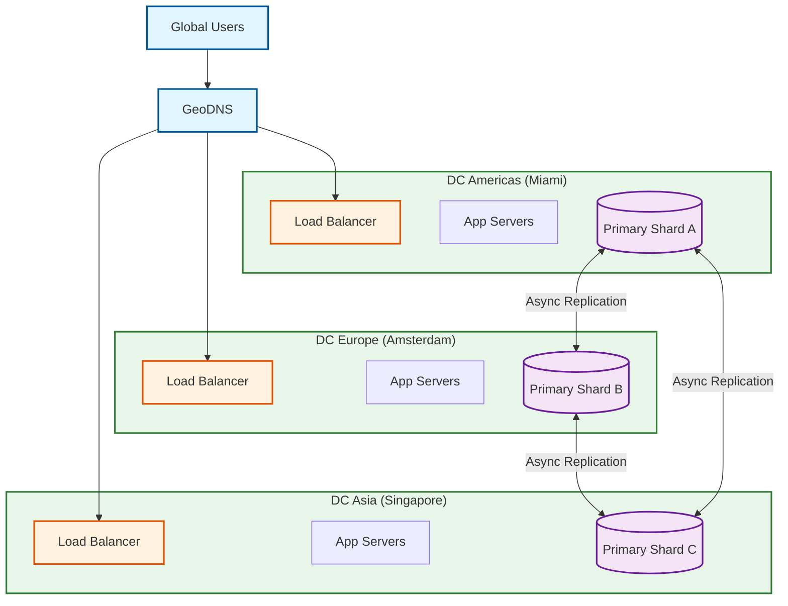
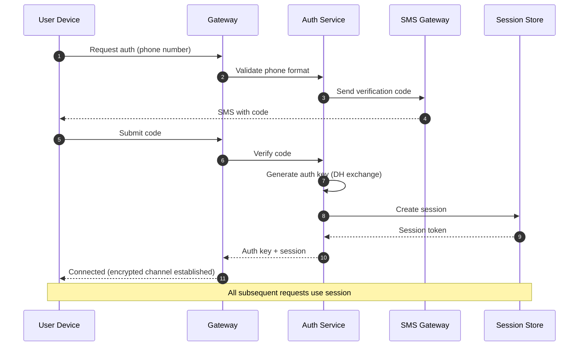

# Telegram: High-Level Design

## System Architecture



---

## Data Flow Diagrams

### Cloud Chat Message Flow



### Secret Chat Key Exchange



### Channel Message Fanout



---

## Key Architectural Decisions

### 1. Protocol Choice: MTProto 2.0 (Custom)

| Option | Pros | Cons | Decision |
|--------|------|------|----------|
| **MTProto 2.0** | Mobile-optimized, binary efficient, multi-transport | Custom = harder to audit | **Chosen** |
| XMPP | Standard, well-understood | XML verbose, not mobile-optimized | Rejected |
| Signal Protocol | Industry-standard E2EE | Doesn't fit cloud storage model | Used for Secret Chats only |
| WebSocket + JSON | Simple, universal | Verbose, not encrypted by default | Rejected |

**Rationale**: MTProto is optimized for unreliable mobile networks, supports session independence from connections, and provides efficient binary encoding. The dual-encryption model (cloud + secret) requires custom protocol flexibility.

### 2. Storage Model: Server-Side Cloud Storage

| Option | Pros | Cons | Decision |
|--------|------|------|----------|
| **Server-side storage** | Multi-device sync, search, history | Server can access content | **Chosen** |
| Store-and-forward (WhatsApp) | True E2EE, privacy | No multi-device, no search | Rejected for cloud chats |
| P2P storage | Maximum privacy | Unreliable, complex | Rejected |

**Rationale**: Telegram's value proposition is seamless multi-device sync, searchable history, and convenience. Server-side storage enables these features. Secret Chats provide E2EE option for privacy-conscious users.

### 3. Encryption Model: Dual (Cloud + Secret)

```
┌─────────────────────────────────────────────────────────────────┐
│  TELEGRAM DUAL ENCRYPTION MODEL                                  │
├─────────────────────────────────────────────────────────────────┤
│                                                                 │
│  CLOUD CHATS (Default)          SECRET CHATS (Opt-in)          │
│  ┌─────────────────────┐        ┌─────────────────────┐        │
│  │ Client-Server       │        │ End-to-End          │        │
│  │ Encryption          │        │ Encryption          │        │
│  │                     │        │                     │        │
│  │ • Multi-device sync │        │ • Device-specific   │        │
│  │ • Search enabled    │        │ • No server access  │        │
│  │ • History on login  │        │ • Self-destruct     │        │
│  │ • Server can access │        │ • 1:1 only          │        │
│  │ • Groups supported  │        │ • Visual key verify │        │
│  └─────────────────────┘        └─────────────────────┘        │
│                                                                 │
│  Use Case: Convenience          Use Case: Max Privacy          │
│                                                                 │
└─────────────────────────────────────────────────────────────────┘
```

### 4. Database Architecture: Polyglot Persistence

| Data Type | Database | Reason |
|-----------|----------|--------|
| User profiles | PostgreSQL (sharded) | Relational, ACID, complex queries |
| Messages | Cassandra | Time-series, high write throughput, partitioned by chat |
| Sessions | Redis | In-memory, fast lookups, TTL |
| Files | TFS (custom) | Large objects, deduplication |
| Search | Elasticsearch | Full-text, inverted index |
| Keys | Secure Enclave | HSM-backed, tamper-resistant |

### 5. Group/Channel Architecture

| Type | Max Size | Model | Storage |
|------|----------|-------|---------|
| Private Group | 200 | Direct delivery | Per-member inbox |
| Supergroup | 200,000 | Hybrid fanout | Shared + notification |
| Gigagroup | Unlimited | Admin-only post | Broadcast model |
| Channel | Unlimited | Broadcast | Single copy + fanout |

### 6. Multi-DC Strategy: Active-Active



**Key Principles:**
- Users routed to nearest DC via GeoDNS
- Each DC handles specific user shards (primary)
- Async replication for cross-DC consistency
- Automatic failover if DC unavailable

---

## Architecture Pattern Checklist

| Pattern | Decision | Rationale |
|---------|----------|-----------|
| **Sync vs Async** | Async for delivery, Sync for ACK | Reliability + responsiveness |
| **Event-driven vs Request-response** | Event-driven for fanout | Scale channel delivery |
| **Push vs Pull** | Push for messages, Pull for history | Real-time + on-demand |
| **Stateless vs Stateful** | Stateful gateways, stateless services | Connection persistence |
| **Read-heavy vs Write-heavy** | Write-heavy (messages), Read-heavy (channels) | Optimize both paths |
| **Real-time vs Batch** | Real-time delivery, batch analytics | User experience priority |
| **Edge vs Origin** | Edge for media, Origin for messages | Latency + consistency |

---

## Component Responsibilities

### Gateway Layer

| Component | Responsibility | Key Features |
|-----------|---------------|--------------|
| **MTProto Gateway** | Protocol handling, connection management | Session multiplexing, encryption |
| **Load Balancer** | Traffic distribution, health checks | GeoDNS, sticky sessions |
| **Bot API** | HTTP interface for bots | REST, webhooks, rate limiting |

### Core Services

| Service | Responsibility | Scaling Strategy |
|---------|---------------|------------------|
| **Auth Service** | Sessions, 2FA, registration | Horizontal, cached sessions |
| **Messaging Service** | 1:1 and group routing | Partition by chat ID |
| **Channel Service** | Broadcast, fanout | Queue-based workers |
| **Chat Service** | State, receipts, typing | Shard by user ID |
| **File Service** | Upload, download, CDN | Object storage + cache |
| **Secret Chat** | E2EE key exchange | Stateless relay |
| **Search Service** | Full-text search | Elasticsearch cluster |
| **Notification** | Push notifications | Batch + rate limit |

### Data Layer

| Store | Purpose | Consistency |
|-------|---------|-------------|
| **PostgreSQL** | User data, metadata | Strong (per shard) |
| **Cassandra** | Messages, channels | Eventual (tunable) |
| **Redis** | Sessions, presence, cache | Best-effort |
| **TFS** | Media files | Eventual |
| **Elasticsearch** | Search index | Eventual |

---

## Message Delivery Guarantees

### Delivery Semantics

| Scenario | Guarantee | Mechanism |
|----------|-----------|-----------|
| Online recipient | At-least-once | ACK + retry |
| Offline recipient | At-least-once | Queue + push |
| Group message | At-least-once per member | Fanout + individual ACK |
| Channel broadcast | Best-effort | Batched delivery |

### Message States

```
┌─────────────────────────────────────────────────────────────────┐
│  MESSAGE STATE MACHINE                                          │
├─────────────────────────────────────────────────────────────────┤
│                                                                 │
│  ┌──────────┐    ┌──────────┐    ┌──────────┐    ┌──────────┐ │
│  │ PENDING  │───>│  SENT    │───>│DELIVERED │───>│   READ   │ │
│  │          │    │ (✓)      │    │ (✓✓)     │    │(seen)    │ │
│  └──────────┘    └──────────┘    └──────────┘    └──────────┘ │
│       │                │                                       │
│       │                │                                       │
│       ▼                ▼                                       │
│  ┌──────────┐    ┌──────────┐                                  │
│  │  FAILED  │    │ DELETED  │                                  │
│  │ (retry)  │    │(by user) │                                  │
│  └──────────┘    └──────────┘                                  │
│                                                                 │
│  PENDING:   Client sent, awaiting server ACK                   │
│  SENT:      Server received, stored                            │
│  DELIVERED: Recipient device received                          │
│  READ:      Recipient opened chat                              │
│  FAILED:    Retry exhausted                                    │
│  DELETED:   User deleted message                               │
│                                                                 │
└─────────────────────────────────────────────────────────────────┘
```

---

## Cross-Cutting Concerns

### Authentication Flow



### Rate Limiting Strategy

| Resource | Limit | Window | Action |
|----------|-------|--------|--------|
| Messages/user | 30/sec | 1 sec | Slow down |
| Messages/group | 20/sec | 1 sec | Queue |
| Channel posts | 1/sec | 1 sec | Reject |
| File uploads | 5/min | 1 min | Queue |
| API calls (bot) | 30/sec | 1 sec | 429 error |
| Login attempts | 5/hour | 1 hour | Lockout |

### Caching Strategy

| Data | Cache Layer | TTL | Invalidation |
|------|-------------|-----|--------------|
| User profiles | Redis | 1 hour | On update |
| Session tokens | Redis | Session lifetime | On logout |
| Recent messages | Application | 5 min | On new message |
| Channel metadata | Redis | 10 min | On update |
| File locations | CDN | 24 hours | On delete |
| Search results | Elasticsearch | 5 min | On index update |

---

## Technology Choices Summary

| Layer | Technology | Alternative Considered | Why Chosen |
|-------|------------|----------------------|------------|
| Protocol | MTProto 2.0 | XMPP, WebSocket | Mobile-optimized, efficient |
| Backend | C++ (core) | Go, Rust | Performance, control |
| User DB | PostgreSQL | MySQL, CockroachDB | Mature, reliable |
| Message DB | Cassandra | ScyllaDB, DynamoDB | Proven at scale |
| Cache | Redis | Memcached | Data structures, pub/sub |
| File Storage | TFS | Object Storage | Custom optimization |
| Search | Elasticsearch | Solr, Meilisearch | Full-text, scalable |
| Queue | Custom | Kafka, RabbitMQ | Tight integration |
| CDN | Multi-provider | Single CDN | Redundancy, coverage |
