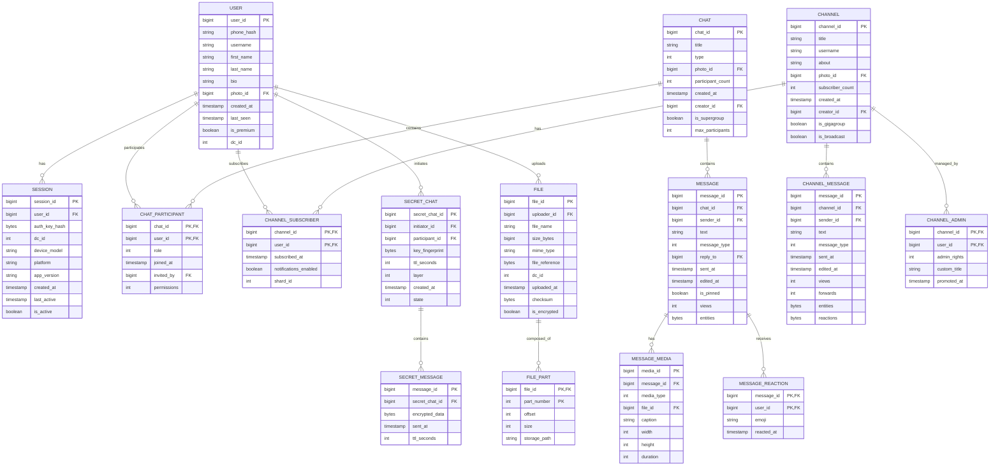

# Telegram: Low-Level Design

## Data Model

### Entity Relationship Diagram



---

## Schema Design

### Users Table (PostgreSQL - Sharded)

```sql
-- Shard key: user_id % num_shards
CREATE TABLE users (
    user_id         BIGINT PRIMARY KEY,
    phone_hash      VARCHAR(64) NOT NULL,  -- SHA256(phone)
    username        VARCHAR(32) UNIQUE,
    first_name      VARCHAR(64) NOT NULL,
    last_name       VARCHAR(64),
    bio             VARCHAR(140),
    photo_id        BIGINT REFERENCES files(file_id),
    created_at      TIMESTAMP DEFAULT NOW(),
    last_seen       TIMESTAMP,
    is_premium      BOOLEAN DEFAULT FALSE,
    dc_id           INT NOT NULL,          -- Home data center
    settings        JSONB,                 -- Privacy, notifications

    CONSTRAINT username_format CHECK (username ~ '^[a-zA-Z][a-zA-Z0-9_]{4,31}$')
);

CREATE INDEX idx_users_phone ON users(phone_hash);
CREATE INDEX idx_users_username ON users(username) WHERE username IS NOT NULL;
CREATE INDEX idx_users_dc ON users(dc_id);
```

### Sessions Table (Redis)

```
-- Key structure
session:{session_id}

-- Hash fields
{
    "user_id": "123456789",
    "auth_key_hash": "base64_encoded_hash",
    "dc_id": "2",
    "device_model": "iPhone 15 Pro",
    "platform": "iOS",
    "app_version": "10.5.0",
    "created_at": "1706745600",
    "last_active": "1706832000",
    "ip_address": "192.168.1.1",
    "country": "US"
}

-- User sessions index (Set)
user_sessions:{user_id} -> {session_id_1, session_id_2, ...}

-- TTL: 6 months of inactivity
```

### Messages Table (Cassandra)

```cql
-- Partition by chat_id, cluster by message_id (time-ordered)
CREATE TABLE messages (
    chat_id         BIGINT,
    message_id      BIGINT,              -- Snowflake-like ID
    sender_id       BIGINT,
    message_type    TINYINT,             -- text, photo, video, etc.
    text            TEXT,
    reply_to_id     BIGINT,
    media_id        BIGINT,
    entities        BLOB,                -- Mentions, hashtags, URLs
    sent_at         TIMESTAMP,
    edited_at       TIMESTAMP,
    is_pinned       BOOLEAN,

    PRIMARY KEY ((chat_id), message_id)
) WITH CLUSTERING ORDER BY (message_id DESC)
  AND compaction = {'class': 'TimeWindowCompactionStrategy',
                    'compaction_window_size': 1,
                    'compaction_window_unit': 'DAYS'};

-- Secondary index for user's messages (for search)
CREATE TABLE messages_by_user (
    user_id         BIGINT,
    chat_id         BIGINT,
    message_id      BIGINT,
    text            TEXT,
    sent_at         TIMESTAMP,

    PRIMARY KEY ((user_id), sent_at, chat_id, message_id)
) WITH CLUSTERING ORDER BY (sent_at DESC);
```

### Channel Messages Table (Cassandra)

```cql
-- Optimized for broadcast reads
CREATE TABLE channel_messages (
    channel_id      BIGINT,
    message_id      BIGINT,
    sender_id       BIGINT,
    message_type    TINYINT,
    text            TEXT,
    media_id        BIGINT,
    entities        BLOB,
    sent_at         TIMESTAMP,
    edited_at       TIMESTAMP,
    views           COUNTER,
    forwards        COUNTER,
    reactions       MAP<TEXT, INT>,      -- emoji -> count

    PRIMARY KEY ((channel_id), message_id)
) WITH CLUSTERING ORDER BY (message_id DESC);

-- Subscriber shards for fanout
CREATE TABLE channel_subscribers (
    channel_id      BIGINT,
    shard_id        INT,                 -- For parallel fanout
    user_id         BIGINT,
    subscribed_at   TIMESTAMP,
    notifications   BOOLEAN,

    PRIMARY KEY ((channel_id, shard_id), user_id)
);
```

### Files Table (PostgreSQL + TFS)

```sql
CREATE TABLE files (
    file_id         BIGINT PRIMARY KEY,
    uploader_id     BIGINT NOT NULL,
    file_name       VARCHAR(255),
    size_bytes      BIGINT NOT NULL,
    mime_type       VARCHAR(100),
    file_reference  BYTEA NOT NULL,      -- Short-lived access token
    dc_id           INT NOT NULL,
    storage_path    VARCHAR(500),
    checksum        BYTEA,               -- SHA256
    is_encrypted    BOOLEAN DEFAULT FALSE,
    uploaded_at     TIMESTAMP DEFAULT NOW(),

    CONSTRAINT file_size_limit CHECK (size_bytes <= 4294967296)  -- 4GB
);

CREATE INDEX idx_files_uploader ON files(uploader_id);
CREATE INDEX idx_files_dc ON files(dc_id);
```

---

## Indexing Strategy

### Primary Indexes

| Table | Index | Type | Purpose |
|-------|-------|------|---------|
| users | user_id | B-tree (PK) | User lookup |
| users | phone_hash | B-tree | Login |
| users | username | B-tree (partial) | Username search |
| messages | (chat_id, message_id) | Composite | Message retrieval |
| channel_messages | (channel_id, message_id) | Composite | Channel history |
| channel_subscribers | (channel_id, shard_id) | Composite | Fanout batching |

### Secondary Indexes

| Table | Index | Purpose | Trade-off |
|-------|-------|---------|-----------|
| messages_by_user | (user_id, sent_at) | User's message history | Write amplification |
| files | uploader_id | User's files | Moderate overhead |

### Search Index (Elasticsearch)

```json
{
  "mappings": {
    "properties": {
      "message_id": { "type": "long" },
      "chat_id": { "type": "long" },
      "user_id": { "type": "long" },
      "text": {
        "type": "text",
        "analyzer": "standard",
        "fields": {
          "keyword": { "type": "keyword" }
        }
      },
      "sent_at": { "type": "date" },
      "message_type": { "type": "keyword" },
      "has_media": { "type": "boolean" }
    }
  },
  "settings": {
    "number_of_shards": 100,
    "number_of_replicas": 2
  }
}
```

---

## Partitioning & Sharding Strategy

### User Data Sharding (PostgreSQL)

```
Shard Key: user_id % 1024

Shard Distribution:
├── Shard 0-255:    DC Americas (Miami)
├── Shard 256-511:  DC Europe (Amsterdam)
├── Shard 512-767:  DC Asia (Singapore)
└── Shard 768-1023: DC Middle East (Dubai)

Routing:
user_id → hash → shard_id → dc_id → connection_pool
```

### Message Partitioning (Cassandra)

```
Partition Key: chat_id
Clustering Key: message_id (DESC)

Benefits:
- All messages for a chat on same partition
- Recent messages retrieved first
- Efficient range queries

Partition Size Target: < 100MB (soft limit)
- ~200K messages per chat before splitting
- Large chats split by time buckets
```

### Channel Subscriber Sharding

```
For channel with 43M subscribers:

Shard Count: 1000 shards
Subscribers per Shard: ~43,000

Partition Key: (channel_id, shard_id)

Fanout Strategy:
1. Query shard 0-999 in parallel
2. Each shard returns subscriber batch
3. Batch deliver to online subscribers
4. Queue push notifications for offline
```

---

## API Design

### MTProto API (Internal Binary Protocol)

#### Send Message

```
// TL Schema
messages.sendMessage#fa88427a
    flags:#
    no_webpage:flags.1?true
    silent:flags.5?true
    background:flags.6?true
    clear_draft:flags.7?true
    peer:InputPeer
    reply_to_msg_id:flags.0?int
    message:string
    random_id:long
    reply_markup:flags.2?ReplyMarkup
    entities:flags.3?Vector<MessageEntity>
    schedule_date:flags.10?int
    = Updates;

// Response
Updates {
    updates: [
        UpdateMessageID { random_id: 123, id: 456 },
        UpdateNewMessage { message: Message, pts: 1001, pts_count: 1 }
    ]
}
```

#### Get History

```
// TL Schema
messages.getHistory#4423e6c5
    peer:InputPeer
    offset_id:int
    offset_date:int
    add_offset:int
    limit:int
    max_id:int
    min_id:int
    hash:int
    = messages.Messages;

// Response
messages.Messages {
    messages: Vector<Message>,
    chats: Vector<Chat>,
    users: Vector<User>
}
```

### Bot HTTP API (REST)

#### Send Message

```
POST /bot{token}/sendMessage
Content-Type: application/json

{
    "chat_id": 123456789,
    "text": "Hello, World!",
    "parse_mode": "MarkdownV2",
    "reply_markup": {
        "inline_keyboard": [[
            {"text": "Button", "callback_data": "action"}
        ]]
    }
}

Response:
{
    "ok": true,
    "result": {
        "message_id": 456,
        "from": {"id": 987654321, "is_bot": true, "username": "MyBot"},
        "chat": {"id": 123456789, "type": "private"},
        "date": 1706832000,
        "text": "Hello, World!"
    }
}
```

#### Get Updates (Long Polling)

```
GET /bot{token}/getUpdates?offset=123&timeout=30

Response:
{
    "ok": true,
    "result": [
        {
            "update_id": 124,
            "message": {
                "message_id": 789,
                "from": {"id": 123456789, "first_name": "John"},
                "chat": {"id": 123456789, "type": "private"},
                "date": 1706832100,
                "text": "/start"
            }
        }
    ]
}
```

#### Set Webhook

```
POST /bot{token}/setWebhook
Content-Type: application/json

{
    "url": "https://example.com/webhook",
    "max_connections": 100,
    "allowed_updates": ["message", "callback_query"],
    "secret_token": "random_secret"
}
```

### API Versioning Strategy

```
MTProto Layer Versioning:
- Current Layer: 185
- Minimum Supported: 150
- Negotiated during auth

Client sends: invokeWithLayer#da9b0d0d layer:int query:!X = X;
Server responds with appropriate schema

Backwards Compatibility:
- New fields are optional (flags)
- Deprecated fields kept for 6 months
- Major changes require new method
```

### Rate Limiting

| Endpoint | Limit | Window | Scope |
|----------|-------|--------|-------|
| sendMessage | 30 | 1 sec | per user |
| sendMessage (group) | 20 | 1 min | per group |
| getUpdates | 1 | 1 sec | per bot |
| sendPhoto | 20 | 1 min | per user |
| forwardMessages | 100 | 1 min | per user |
| joinChannel | 5 | 1 day | per user |

---

## Core Algorithms

### Message ID Generation (Snowflake-like)

```
Algorithm: Telegram Message ID Generation
Input: dc_id, server_id, sequence
Output: globally unique message_id

FUNCTION generate_message_id():
    // 64-bit ID structure:
    // | 42 bits timestamp | 5 bits dc | 5 bits server | 12 bits sequence |

    timestamp = current_time_ms() - TELEGRAM_EPOCH  // Custom epoch

    IF timestamp == last_timestamp THEN
        sequence = (sequence + 1) AND 0xFFF  // 12 bits
        IF sequence == 0 THEN
            WAIT_NEXT_MILLISECOND()
            timestamp = current_time_ms() - TELEGRAM_EPOCH
        END IF
    ELSE
        sequence = 0
    END IF

    last_timestamp = timestamp

    message_id = (timestamp << 22)
               | (dc_id << 17)
               | (server_id << 12)
               | sequence

    RETURN message_id
END FUNCTION

Properties:
- Time-ordered (sortable)
- Globally unique across DCs
- ~4M IDs/second per server
- Embedded timestamp for debugging
```

### Channel Fanout Algorithm

```
Algorithm: Parallel Channel Fanout
Input: channel_id, message
Output: delivery to all subscribers

FUNCTION fanout_channel_message(channel_id, message):
    // Get subscriber shards
    shard_count = GET_SHARD_COUNT(channel_id)

    // Create fanout tasks
    tasks = []
    FOR shard_id = 0 TO shard_count - 1:
        task = CREATE_FANOUT_TASK(channel_id, shard_id, message)
        tasks.APPEND(task)
    END FOR

    // Submit to fanout queue
    SUBMIT_PARALLEL(tasks)

    RETURN message.id
END FUNCTION

FUNCTION process_fanout_task(channel_id, shard_id, message):
    // Get subscribers in shard
    subscribers = GET_SUBSCRIBERS(channel_id, shard_id)

    // Batch by online status
    online_batch = []
    offline_batch = []

    FOR subscriber IN subscribers:
        IF IS_ONLINE(subscriber.user_id) THEN
            online_batch.APPEND(subscriber)
        ELSE
            offline_batch.APPEND(subscriber)
        END IF

        // Process in batches of 1000
        IF online_batch.SIZE >= 1000 THEN
            DELIVER_MTPROTO_BATCH(online_batch, message)
            online_batch = []
        END IF

        IF offline_batch.SIZE >= 1000 THEN
            QUEUE_PUSH_NOTIFICATIONS(offline_batch, message)
            offline_batch = []
        END IF
    END FOR

    // Process remaining
    DELIVER_MTPROTO_BATCH(online_batch, message)
    QUEUE_PUSH_NOTIFICATIONS(offline_batch, message)
END FUNCTION

Complexity:
- Time: O(n) where n = subscribers
- Parallelism: O(n / shard_size) workers
- For 43M subscribers, 1000 shards: 43 seconds with 1000 workers
```

### Secret Chat Key Exchange (Diffie-Hellman)

```
Algorithm: Secret Chat DH Key Exchange
Input: initiator, participant
Output: shared secret key

// Initiator (Alice) side
FUNCTION initiate_secret_chat(bob_id):
    // Get DH parameters from server
    dh_config = REQUEST_DH_CONFIG()
    p = dh_config.p           // 2048-bit prime
    g = dh_config.g           // Generator

    // Generate private key
    a = SECURE_RANDOM(256)    // 256-bit random

    // Compute public key
    g_a = MODPOW(g, a, p)     // g^a mod p

    // Send to server
    SEND_ENCRYPTED_CHAT_REQUEST(bob_id, g_a)

    // Store private key locally
    STORE_LOCAL(secret_chat_id, a)

    RETURN secret_chat_id
END FUNCTION

// Participant (Bob) side
FUNCTION accept_secret_chat(secret_chat_id, g_a):
    // Get DH parameters
    dh_config = REQUEST_DH_CONFIG()
    p = dh_config.p
    g = dh_config.g

    // Verify g_a is valid
    IF NOT VALIDATE_DH_PARAMS(g_a, p) THEN
        REJECT()
    END IF

    // Generate private key
    b = SECURE_RANDOM(256)

    // Compute public key
    g_b = MODPOW(g, b, p)     // g^b mod p

    // Compute shared secret
    shared_secret = MODPOW(g_a, b, p)  // (g^a)^b mod p

    // Send g_b to Alice
    SEND_ACCEPT(secret_chat_id, g_b)

    // Derive encryption key
    auth_key = SHA256(shared_secret)

    // Store key locally (NEVER on server)
    STORE_LOCAL_SECURE(secret_chat_id, auth_key)

    // Generate key fingerprint for verification
    fingerprint = SHA256(auth_key)[0:8]
    DISPLAY_FINGERPRINT(fingerprint)

    RETURN auth_key
END FUNCTION

Security Properties:
- Server cannot compute shared secret (doesn't know a or b)
- Perfect forward secrecy (new keys for new chats)
- Key fingerprint for out-of-band verification
```

### Message Encryption (MTProto 2.0)

```
Algorithm: MTProto 2.0 Message Encryption
Input: plaintext, auth_key
Output: encrypted_message

FUNCTION encrypt_message(plaintext, auth_key):
    // Add padding for alignment
    padding = RANDOM_BYTES(12 + RANDOM(0, 1004))  // 12-1016 bytes
    data = plaintext || padding

    // Ensure length is divisible by 16
    WHILE data.LENGTH % 16 != 0:
        data = data || RANDOM_BYTE()
    END WHILE

    // Compute message key
    msg_key_large = SHA256(auth_key[88:120] || data)
    msg_key = msg_key_large[8:24]  // 16 bytes

    // Derive AES key and IV
    sha256_a = SHA256(msg_key || auth_key[0:36])
    sha256_b = SHA256(auth_key[40:76] || msg_key)

    aes_key = sha256_a[0:8] || sha256_b[8:24] || sha256_a[24:32]
    aes_iv = sha256_b[0:8] || sha256_a[8:24] || sha256_b[24:32]

    // Encrypt with AES-256-IGE
    encrypted_data = AES_IGE_ENCRYPT(data, aes_key, aes_iv)

    // Construct final message
    auth_key_id = SHA1(auth_key)[12:20]  // 8 bytes
    encrypted_message = auth_key_id || msg_key || encrypted_data

    RETURN encrypted_message
END FUNCTION

FUNCTION decrypt_message(encrypted_message, auth_key):
    // Extract components
    auth_key_id = encrypted_message[0:8]
    msg_key = encrypted_message[8:24]
    encrypted_data = encrypted_message[24:]

    // Verify auth_key_id
    expected_id = SHA1(auth_key)[12:20]
    IF auth_key_id != expected_id THEN
        RETURN ERROR("Invalid auth key")
    END IF

    // Derive AES key and IV (same as encryption)
    sha256_a = SHA256(msg_key || auth_key[8:44])
    sha256_b = SHA256(auth_key[48:84] || msg_key)

    aes_key = sha256_a[0:8] || sha256_b[8:24] || sha256_a[24:32]
    aes_iv = sha256_b[0:8] || sha256_a[8:24] || sha256_b[24:32]

    // Decrypt
    data = AES_IGE_DECRYPT(encrypted_data, aes_key, aes_iv)

    // Verify message key
    expected_msg_key = SHA256(auth_key[88:120] || data)[8:24]
    IF msg_key != expected_msg_key THEN
        RETURN ERROR("Message key mismatch")
    END IF

    // Remove padding and return plaintext
    plaintext = REMOVE_PADDING(data)
    RETURN plaintext
END FUNCTION
```

### Multi-Device Sync Algorithm

```
Algorithm: Multi-Device State Synchronization
Input: user_id, device_session
Output: synchronized state across devices

FUNCTION sync_device_state(user_id, session_id):
    // Get device's last known state
    device_pts = GET_DEVICE_PTS(session_id)  // Points (state counter)
    device_qts = GET_DEVICE_QTS(session_id)  // Queue points
    device_date = GET_DEVICE_DATE(session_id)

    // Get server's current state
    server_state = GET_SERVER_STATE(user_id)

    // Calculate difference
    IF device_pts == server_state.pts THEN
        RETURN "Already synced"
    END IF

    // Get updates since device_pts
    difference = GET_DIFFERENCE(user_id, device_pts, device_qts, device_date)

    IF difference.type == "TOO_LONG" THEN
        // Too many updates, full resync needed
        RETURN FULL_SYNC(user_id, session_id)
    END IF

    // Apply updates in order
    FOR update IN difference.updates:
        APPLY_UPDATE(session_id, update)
    END FOR

    // Update device state
    SET_DEVICE_STATE(session_id, server_state.pts, server_state.qts, server_state.date)

    RETURN difference
END FUNCTION

FUNCTION handle_update(user_id, update):
    // Increment global state
    new_pts = INCREMENT_PTS(user_id)

    // Store update with pts
    STORE_UPDATE(user_id, update, new_pts)

    // Notify all active sessions
    sessions = GET_ACTIVE_SESSIONS(user_id)
    FOR session IN sessions:
        PUSH_UPDATE(session, update, new_pts)
    END FOR
END FUNCTION

State Counter Types:
- PTS: Message state (chats, messages, participants)
- QTS: Secret chat updates
- SEQ: General updates sequence
- DATE: Timestamp for time-based sync
```

---

## Data Retention Policy

| Data Type | Retention | Deletion Trigger |
|-----------|-----------|------------------|
| Cloud messages | Permanent | User delete |
| Media files | Permanent | User delete |
| Secret messages | Device-dependent | Self-destruct timer or device wipe |
| Session data | 6 months inactive | Inactivity or logout |
| Deleted messages | 48 hours | Hard delete after grace period |
| Edit history | Not stored | Only latest version |
| Read receipts | 7 days | Automatic cleanup |
| Typing indicators | Real-time only | Not persisted |

---

## Idempotency Handling

```
Idempotency Strategy: Random ID Deduplication

Client generates random_id (64-bit) for each message send.
Server tracks recent random_ids per user (24-hour window).

FUNCTION send_message_idempotent(user_id, random_id, message):
    // Check for duplicate
    existing = CHECK_RANDOM_ID(user_id, random_id)
    IF existing THEN
        RETURN existing.message_id  // Return existing message
    END IF

    // Process new message
    message_id = PROCESS_MESSAGE(message)

    // Store random_id mapping
    STORE_RANDOM_ID(user_id, random_id, message_id, TTL=24h)

    RETURN message_id
END FUNCTION

Benefits:
- Network retry safety
- Client reconnection handling
- Duplicate message prevention
```

---

## File Upload Protocol

```
Algorithm: Chunked File Upload (2-4GB files)
Input: file, file_size
Output: file_id

FUNCTION upload_large_file(file, file_size):
    // Request upload session
    file_id = REQUEST_FILE_ID()
    part_size = CALCULATE_PART_SIZE(file_size)  // 512KB - 512MB
    total_parts = CEIL(file_size / part_size)

    // Upload parts in parallel (max 8 concurrent)
    uploaded_parts = 0
    failed_parts = []

    FOR part_num = 0 TO total_parts - 1:
        part_data = READ_FILE_PART(file, part_num * part_size, part_size)

        success = UPLOAD_PART(file_id, part_num, total_parts, part_data)

        IF success THEN
            uploaded_parts += 1
        ELSE
            failed_parts.APPEND(part_num)
        END IF
    END FOR

    // Retry failed parts
    FOR part_num IN failed_parts:
        RETRY_UPLOAD_PART(file_id, part_num, BACKOFF)
    END FOR

    // Complete upload
    COMPLETE_UPLOAD(file_id, total_parts, MD5(file))

    RETURN file_id
END FUNCTION

Part Size Calculation:
- < 10MB: 512KB parts
- 10MB - 100MB: 1MB parts
- 100MB - 1GB: 4MB parts
- 1GB - 4GB: 16MB parts
```
