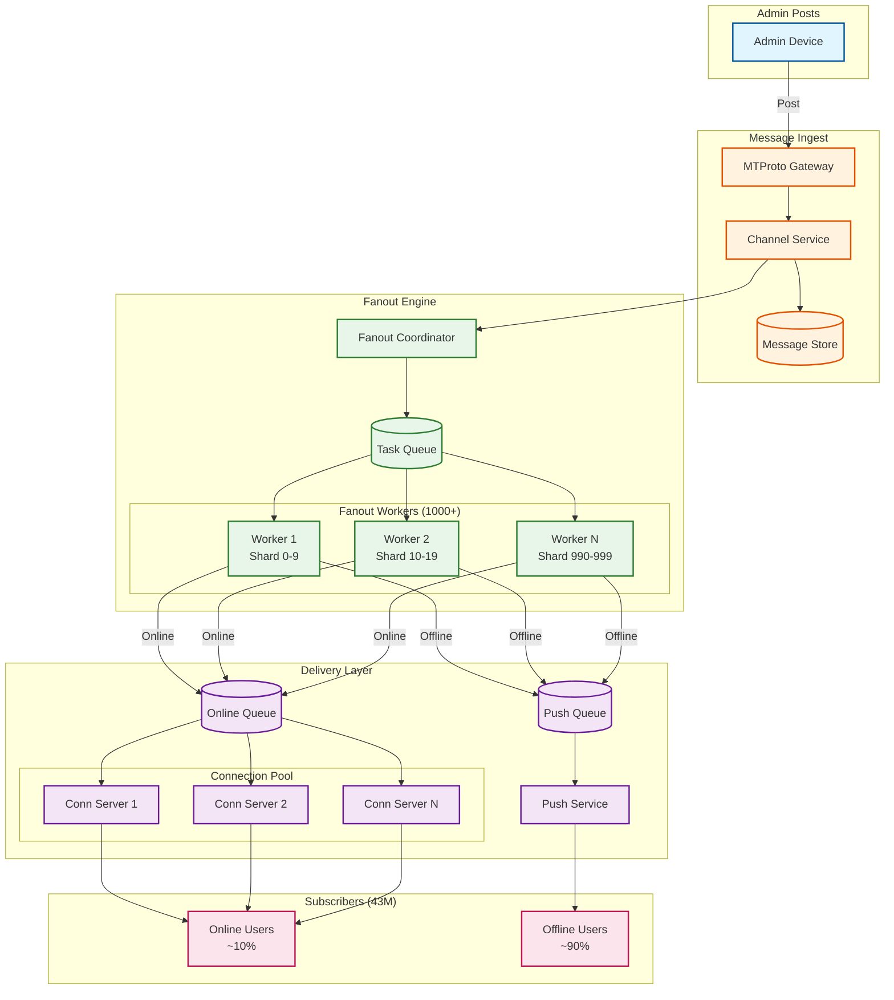
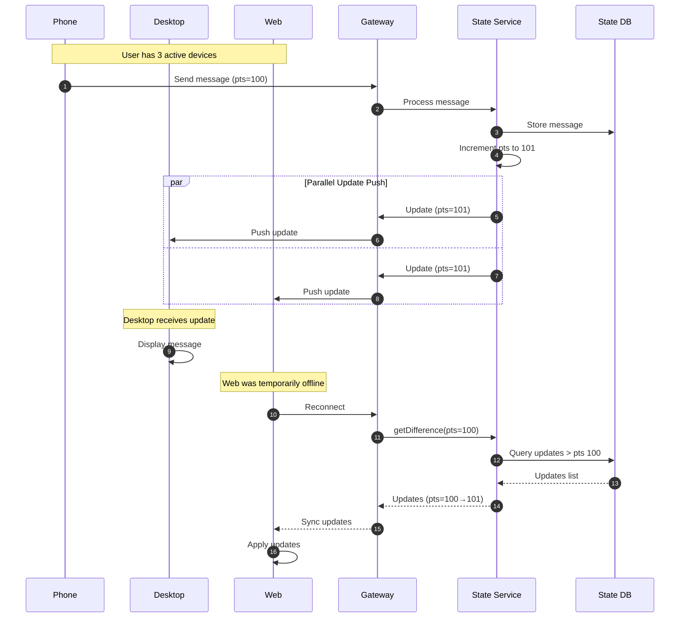
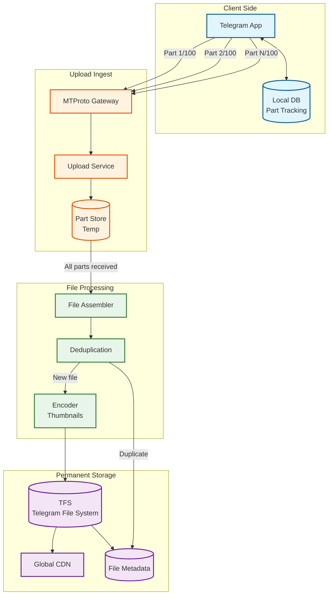

# Telegram: Deep Dive & Bottlenecks

## Critical Component #1: Channel Fanout Engine

### Why This Is Critical

Telegram channels can have **43+ million subscribers**. When an admin posts a message, it must be delivered to all subscribers with minimal latency. This is one of the largest fanout problems in messaging systems.

**Scale Challenge:**
- 43,000,000 subscribers
- Target delivery: < 60 seconds for 99% of subscribers
- 716,667 deliveries per second required

### How It Works Internally



### Fanout Strategy Deep Dive

```
┌─────────────────────────────────────────────────────────────────────────────┐
│  CHANNEL FANOUT STRATEGY: 43M Subscribers                                    │
├─────────────────────────────────────────────────────────────────────────────┤
│                                                                             │
│  STEP 1: SHARD SUBSCRIBERS                                                  │
│  ┌─────────────────────────────────────────────────────────────────────┐   │
│  │  43,000,000 subscribers ÷ 1,000 shards = 43,000 per shard           │   │
│  │                                                                      │   │
│  │  Shard 0:    user_ids 0-42999                                       │   │
│  │  Shard 1:    user_ids 43000-85999                                   │   │
│  │  ...                                                                 │   │
│  │  Shard 999:  user_ids 42957000-42999999                             │   │
│  └─────────────────────────────────────────────────────────────────────┘   │
│                                                                             │
│  STEP 2: PARALLEL FANOUT                                                    │
│  ┌─────────────────────────────────────────────────────────────────────┐   │
│  │  1,000 workers process shards in parallel                           │   │
│  │  Each worker: 43,000 subscribers / 1,000 batch size = 43 batches    │   │
│  │  Total batches: 43,000                                              │   │
│  │  Processing rate: 10,000 batches/second = 4.3 seconds               │   │
│  └─────────────────────────────────────────────────────────────────────┘   │
│                                                                             │
│  STEP 3: DELIVERY CLASSIFICATION                                            │
│  ┌─────────────────────────────────────────────────────────────────────┐   │
│  │  Online Check (Redis MGET, 1000 users/call):                        │   │
│  │    - Online: ~10% (4.3M) → Direct MTProto delivery                  │   │
│  │    - Offline: ~90% (38.7M) → Push notification queue                │   │
│  └─────────────────────────────────────────────────────────────────────┘   │
│                                                                             │
│  STEP 4: BATCH DELIVERY                                                     │
│  ┌─────────────────────────────────────────────────────────────────────┐   │
│  │  Online: 4.3M / 500 connection servers = 8,600 users/server         │   │
│  │  Push: Batch 1,000 per APNs/FCM request = 38,700 requests           │   │
│  └─────────────────────────────────────────────────────────────────────┘   │
│                                                                             │
│  TOTAL TIME: ~60 seconds for 99% delivery                                   │
│                                                                             │
└─────────────────────────────────────────────────────────────────────────────┘
```

### Failure Modes & Handling

| Failure | Detection | Recovery |
|---------|-----------|----------|
| Worker crash | Heartbeat timeout | Task reassignment, idempotent processing |
| Shard query failure | Query timeout | Retry with exponential backoff |
| Connection server overload | Queue depth | Backpressure, rate limiting |
| Push service failure | Error rate spike | Circuit breaker, fallback queue |
| Database partition unavailable | Connection failure | Redirect to replica, queue updates |

### Optimization Techniques

1. **Subscriber Pre-sharding**: Subscribers assigned to shards at subscription time
2. **Online Status Caching**: Redis bitmap for fast online checks
3. **Message Deduplication**: Single message copy, pointer-based fanout
4. **Priority Channels**: Popular channels get dedicated worker pools
5. **Geographic Batching**: Group subscribers by DC for local delivery

---

## Critical Component #2: Multi-Device Synchronization

### Why This Is Critical

Telegram allows **unlimited devices** per account with full message sync. When a user sends a message from phone, it must appear on desktop and web simultaneously. Read receipts, typing indicators, and message edits must sync across all devices.

### How It Works Internally



### State Synchronization Model

```
┌─────────────────────────────────────────────────────────────────────────────┐
│  TELEGRAM STATE MODEL (PTS/QTS/SEQ)                                          │
├─────────────────────────────────────────────────────────────────────────────┤
│                                                                             │
│  PTS (Points) - Per-User Message State                                      │
│  ┌─────────────────────────────────────────────────────────────────────┐   │
│  │  Tracks: Messages, chat participants, message edits/deletes         │   │
│  │                                                                      │   │
│  │  Example:                                                            │   │
│  │    pts=100: Received message in Chat A                               │   │
│  │    pts=101: Sent message in Chat B                                   │   │
│  │    pts=102: Message edited in Chat A                                 │   │
│  │    pts=103: User joined Group C                                      │   │
│  │                                                                      │   │
│  │  Device tracks: "I've seen up to pts=100"                           │   │
│  │  Server knows: "Current pts=103"                                     │   │
│  │  Sync: Send updates 101, 102, 103 to device                         │   │
│  └─────────────────────────────────────────────────────────────────────┘   │
│                                                                             │
│  QTS (Queue Points) - Secret Chat State                                     │
│  ┌─────────────────────────────────────────────────────────────────────┐   │
│  │  Tracks: Secret chat messages (per-device, not synced)               │   │
│  │  Each device has independent QTS                                     │   │
│  └─────────────────────────────────────────────────────────────────────┘   │
│                                                                             │
│  SEQ (Sequence) - General Updates                                           │
│  ┌─────────────────────────────────────────────────────────────────────┐   │
│  │  Tracks: User status, contact updates, privacy changes               │   │
│  │  Global sequence across all update types                             │   │
│  └─────────────────────────────────────────────────────────────────────┘   │
│                                                                             │
│  SYNC SCENARIOS:                                                            │
│                                                                             │
│  Small Gap (pts diff < 1000):                                               │
│    → getDifference returns individual updates                              │
│                                                                             │
│  Large Gap (pts diff > 1000 or > 24h):                                     │
│    → getDifference returns "TOO_LONG"                                      │
│    → Client does full state refresh                                        │
│                                                                             │
└─────────────────────────────────────────────────────────────────────────────┘
```

### Failure Modes & Handling

| Failure | Impact | Recovery |
|---------|--------|----------|
| Device offline for days | Large state gap | Full resync (getState) |
| Update lost in transit | Missing message | Periodic pts verification |
| Concurrent edits | Conflict | Last-write-wins with timestamp |
| Session expired | Auth failure | Re-authenticate, full sync |
| Server pts corruption | Data inconsistency | Restore from replica |

---

## Critical Component #3: Large File Upload Pipeline

### Why This Is Critical

Telegram supports **2-4GB file uploads** with resume capability. Files must be stored permanently, deduplicated, and served globally via CDN. Upload interruptions (network switch, app background) must not lose progress.

### How It Works Internally



### Upload Protocol Deep Dive

```
┌─────────────────────────────────────────────────────────────────────────────┐
│  LARGE FILE UPLOAD: 2GB Video                                                │
├─────────────────────────────────────────────────────────────────────────────┤
│                                                                             │
│  INITIALIZATION                                                              │
│  ┌─────────────────────────────────────────────────────────────────────┐   │
│  │  1. Client requests file_id from server                              │   │
│  │  2. Server allocates file_id, returns upload URL                     │   │
│  │  3. Client calculates: parts = CEIL(2GB / 512KB) = 4096 parts       │   │
│  │  4. Client stores: file_id, part_count, uploaded_parts[] locally    │   │
│  └─────────────────────────────────────────────────────────────────────┘   │
│                                                                             │
│  PARALLEL UPLOAD                                                             │
│  ┌─────────────────────────────────────────────────────────────────────┐   │
│  │  Concurrent uploads: 8 parts simultaneously                          │   │
│  │                                                                      │   │
│  │  ┌───┐ ┌───┐ ┌───┐ ┌───┐ ┌───┐ ┌───┐ ┌───┐ ┌───┐                  │   │
│  │  │ 1 │ │ 2 │ │ 3 │ │ 4 │ │ 5 │ │ 6 │ │ 7 │ │ 8 │  → Uploading     │   │
│  │  └───┘ └───┘ └───┘ └───┘ └───┘ └───┘ └───┘ └───┘                  │   │
│  │                                                                      │   │
│  │  Part upload: upload.saveBigFilePart(file_id, part_num, bytes)      │   │
│  │  Server ACK: { "success": true }                                     │   │
│  │  Client marks part complete locally                                  │   │
│  └─────────────────────────────────────────────────────────────────────┘   │
│                                                                             │
│  RESUME AFTER INTERRUPT                                                      │
│  ┌─────────────────────────────────────────────────────────────────────┐   │
│  │  1. App reopens, reads local state: parts 1-500 uploaded            │   │
│  │  2. Verifies with server: upload.getFile(file_id)                   │   │
│  │  3. Server returns: uploaded_parts = [1, 2, ..., 500]               │   │
│  │  4. Client resumes from part 501                                     │   │
│  └─────────────────────────────────────────────────────────────────────┘   │
│                                                                             │
│  COMPLETION                                                                  │
│  ┌─────────────────────────────────────────────────────────────────────┐   │
│  │  1. All 4096 parts uploaded                                          │   │
│  │  2. Client sends: messages.sendMedia(file_id, total_parts, md5)     │   │
│  │  3. Server assembles parts, verifies MD5                             │   │
│  │  4. Deduplication check (SHA256 of file)                             │   │
│  │  5. Store in TFS, generate file_reference                            │   │
│  │  6. Return message with file attachment                              │   │
│  └─────────────────────────────────────────────────────────────────────┘   │
│                                                                             │
│  DEDUPLICATION                                                               │
│  ┌─────────────────────────────────────────────────────────────────────┐   │
│  │  - SHA256 computed during assembly                                   │   │
│  │  - If hash exists → link to existing file, no storage used          │   │
│  │  - Popular files (memes, videos) deduplicated across users          │   │
│  │  - Estimated savings: 30-40% storage reduction                       │   │
│  └─────────────────────────────────────────────────────────────────────┘   │
│                                                                             │
└─────────────────────────────────────────────────────────────────────────────┘
```

### Failure Modes & Handling

| Failure | Detection | Recovery |
|---------|-----------|----------|
| Part upload timeout | 30s timeout | Retry part with backoff |
| Network switch | Connection reset | Resume from last ACKed part |
| App killed | Process termination | Resume on next launch |
| Server part loss | Completion verification | Re-upload missing parts |
| MD5 mismatch | Checksum failure | Re-upload entire file |
| Storage quota exceeded | Error response | Reject upload, notify user |

---

## Concurrency & Race Conditions

### Race Condition #1: Concurrent Message Send

**Scenario**: User sends message from phone and desktop simultaneously.

```
┌─────────────────────────────────────────────────────────────────┐
│  RACE: Concurrent Message Send                                   │
├─────────────────────────────────────────────────────────────────┤
│                                                                 │
│  Phone                    Server                    Desktop     │
│    │                        │                          │        │
│    │──Send("Hello", pts=100)│                          │        │
│    │                        │                          │        │
│    │                        │◄─Send("Hi", pts=100)─────│        │
│    │                        │                          │        │
│    │        ┌───────────────┴───────────────┐          │        │
│    │        │ CONFLICT: Both expect pts=101 │          │        │
│    │        └───────────────┬───────────────┘          │        │
│    │                        │                          │        │
│                                                                 │
│  SOLUTION: Server-side sequencing with optimistic locking       │
│                                                                 │
│  1. Server receives "Hello" first (network timing)              │
│  2. Assigns pts=101 to "Hello"                                  │
│  3. Server receives "Hi" (pts=100 stale)                        │
│  4. Detects conflict, assigns pts=102 to "Hi"                   │
│  5. Both messages delivered, ordering preserved                 │
│                                                                 │
└─────────────────────────────────────────────────────────────────┘
```

### Race Condition #2: Edit During Fanout

**Scenario**: Admin edits channel message while fanout is in progress.

```
┌─────────────────────────────────────────────────────────────────┐
│  RACE: Edit During Channel Fanout                                │
├─────────────────────────────────────────────────────────────────┤
│                                                                 │
│  Timeline:                                                       │
│  T=0s:   Admin posts "Breaking news: X"                         │
│  T=10s:  Fanout 30% complete (13M delivered)                    │
│  T=10s:  Admin edits to "Breaking news: X (Updated)"            │
│  T=60s:  Fanout complete                                        │
│                                                                 │
│  PROBLEM: 13M see original, 30M see edited version              │
│                                                                 │
│  SOLUTION: Version vector + edit notification                    │
│                                                                 │
│  1. Original message has version=1                              │
│  2. Edit creates version=2, stored alongside original           │
│  3. Fanout continues with version=1                             │
│  4. Edit triggers separate "updateEditMessage" fanout           │
│  5. All clients eventually receive both updates                 │
│  6. Client displays latest version                              │
│                                                                 │
│  RESULT: All subscribers eventually see edited version          │
│                                                                 │
└─────────────────────────────────────────────────────────────────┘
```

### Race Condition #3: Secret Chat Key Race

**Scenario**: Both parties initiate secret chat simultaneously.

```
┌─────────────────────────────────────────────────────────────────┐
│  RACE: Simultaneous Secret Chat Initiation                       │
├─────────────────────────────────────────────────────────────────┤
│                                                                 │
│  Alice                    Server                    Bob         │
│    │                        │                        │          │
│    │─initiate(Bob, g^a)────►│                        │          │
│    │                        │◄────initiate(Alice, g^b)│         │
│    │                        │                        │          │
│    │        ┌───────────────┴───────────────┐        │          │
│    │        │ CONFLICT: Two pending chats   │        │          │
│    │        └───────────────┬───────────────┘        │          │
│    │                        │                        │          │
│                                                                 │
│  SOLUTION: Deterministic tiebreaker                             │
│                                                                 │
│  1. Server compares user_ids                                    │
│  2. Lower user_id "wins" as initiator                           │
│  3. Higher user_id becomes acceptor                             │
│  4. Losing request converted to accept                          │
│  5. Single secret chat established                              │
│                                                                 │
└─────────────────────────────────────────────────────────────────┘
```

### Locking Strategies

| Resource | Lock Type | Scope | Timeout |
|----------|-----------|-------|---------|
| User state (pts) | Optimistic | Per-user | N/A (retry) |
| Chat participants | Pessimistic | Per-chat | 5s |
| File upload | Distributed | Per-file_id | 24h |
| Session creation | Mutex | Per-user | 10s |
| Channel admin ops | Queue | Per-channel | 30s |

---

## Bottleneck Analysis

### Bottleneck #1: Channel Subscriber Database

**Problem**: Querying 43M subscriber records for fanout.

**Symptoms:**
- Fanout latency > 5 minutes
- Database CPU saturation
- Timeout errors during popular channel posts

**Mitigation:**

```
STRATEGY: Pre-computed Subscriber Shards

1. SHARDING AT SUBSCRIPTION TIME
   - User subscribes to channel
   - Assigned to shard: hash(user_id) % 1000
   - Stored in channel_subscribers (channel_id, shard_id, user_id)

2. SHARD METADATA CACHE
   - Cache shard counts per channel
   - Invalidate on subscription changes
   - Avoid count(*) queries

3. PARALLEL SHARD QUERIES
   - 1000 concurrent queries (one per shard)
   - Each returns ~43K subscribers
   - Total time: max(shard_query_time) ≈ 100ms

4. READ REPLICAS
   - Dedicated replicas for fanout reads
   - Separates fanout from subscription writes
```

### Bottleneck #2: Connection Server Memory

**Problem**: 100M concurrent connections × 10KB = 1TB memory.

**Symptoms:**
- Memory exhaustion
- Connection drops
- Slow message delivery

**Mitigation:**

```
STRATEGY: Connection Pooling + Offloading

1. MINIMIZE PER-CONNECTION STATE
   - Session data: Redis (not in-memory)
   - Buffer only active message

2. CONNECTION MULTIPLEXING
   - Single TCP for multiple logical channels
   - Amortize handshake cost

3. TIERED CONNECTION PRIORITY
   - Active users: Dedicated connection
   - Idle users: Long-poll or push-only

4. GEOGRAPHIC DISTRIBUTION
   - 5 DCs × 200 servers = 1000 servers
   - 100K connections per server
```

### Bottleneck #3: Search Index Update Lag

**Problem**: Messages not searchable immediately after send.

**Symptoms:**
- Search returns stale results
- User confusion
- Support tickets

**Mitigation:**

```
STRATEGY: Near-Real-Time Indexing

1. SYNCHRONOUS INDEX FOR RECENT
   - Last 1 hour: Primary index, in-memory
   - Direct write on message send

2. ASYNC BATCH FOR HISTORICAL
   - Older messages: Batch indexing
   - 5-minute delay acceptable

3. SEARCH ROUTING
   - Query recent index first
   - Merge with historical results
   - Deduplicate by message_id

4. INDEX PARTITIONING
   - Partition by user_id
   - Search only user's partitions
   - Avoid full index scan
```

### Bottleneck Summary

| Bottleneck | Impact | Mitigation | Result |
|------------|--------|------------|--------|
| Subscriber DB | Slow fanout | Pre-sharding, replicas | 100ms shard queries |
| Connection memory | Server crash | Offload to Redis, geo-distribute | 100K/server |
| Search lag | Poor UX | Tiered indexing | <5min lag |
| File assembly | Upload completion delay | Parallel assembly, SSD | <30s for 2GB |
| Push notification rate | APNs/FCM limits | Batching, priority queues | 99% within 60s |

---

## Performance Optimization Techniques

### 1. Binary Protocol Efficiency

```
MTProto vs JSON comparison (same message):

JSON:
{
  "message_id": 123456789,
  "chat_id": 987654321,
  "from_id": 111222333,
  "text": "Hello!",
  "date": 1706832000
}
Size: ~120 bytes

MTProto TL:
message#... id:long chat_id:long from_id:long text:string date:int
Binary: [type_id][id][chat_id][from_id][text_len][text][date]
Size: ~50 bytes

Savings: 58% bandwidth reduction
```

### 2. Delta Compression for Updates

```
Instead of sending full message objects:

FULL UPDATE (naive):
{
  "type": "newMessage",
  "message": { ...full message object... }
}

DELTA UPDATE (optimized):
{
  "type": "updateMessageID",
  "random_id": 123,    // Client knows which message
  "id": 456            // Just the new ID
}

Client reconstructs full message locally.
```

### 3. Predictive Prefetching

```
CLIENT BEHAVIOR ANALYSIS:
- User opens chat → likely to scroll up
- Prefetch previous 50 messages

MEDIA PREFETCHING:
- User viewing photo 3 of 10
- Prefetch photos 4, 5, 6 in background
- Cache on device storage
```
