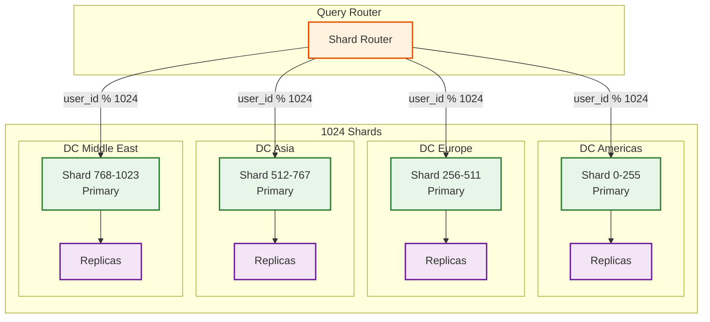
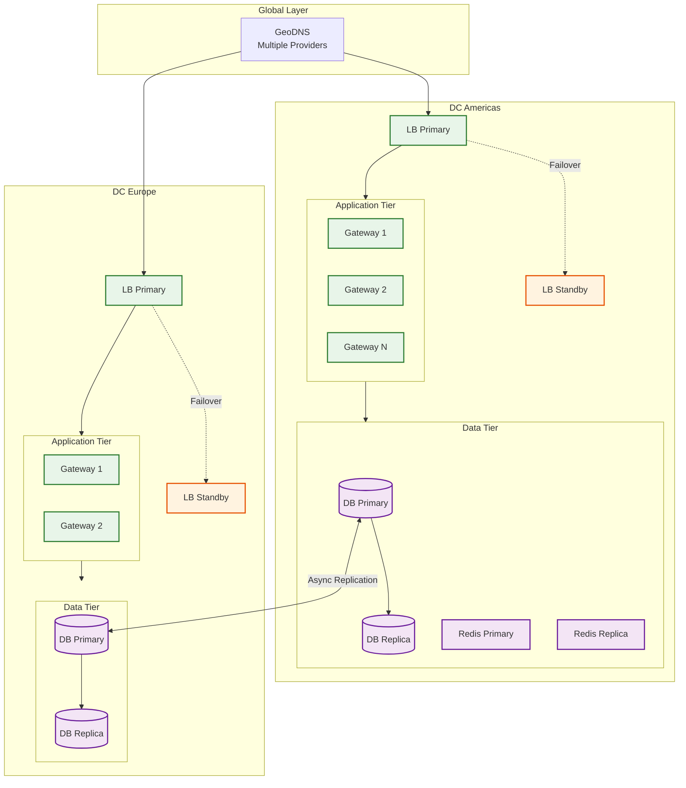
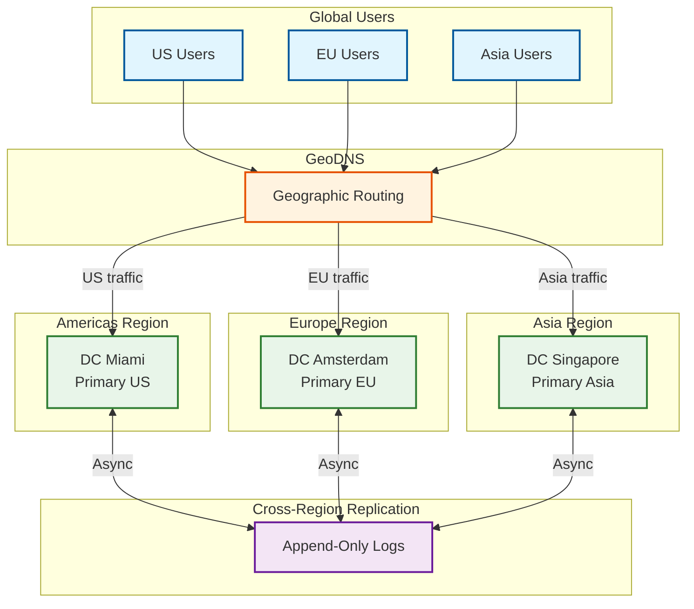

# Telegram: Scalability & Reliability

## Scalability Strategy

### Horizontal vs Vertical Scaling Decisions

| Component | Strategy | Rationale |
|-----------|----------|-----------|
| MTProto Gateway | Horizontal | Connection handling, stateless routing |
| Message Service | Horizontal | Partition by chat_id |
| Channel Service | Horizontal | Partition by channel_id |
| User Database | Horizontal (Sharded) | 1B users, partition by user_id |
| Message Store | Horizontal | Time-series, partition by chat + time |
| File Storage | Horizontal | Distributed file system |
| Search | Horizontal | Partition by user_id |
| Cache | Horizontal | Consistent hashing |

### Auto-Scaling Triggers

| Service | Scale-Up Trigger | Scale-Down Trigger | Min/Max |
|---------|-----------------|-------------------|---------|
| Gateway | CPU > 70% OR connections > 400K | CPU < 30% AND connections < 100K | 100/500 |
| Message Service | QPS > 8K/instance | QPS < 2K/instance | 200/1000 |
| Channel Fanout | Queue depth > 100K | Queue depth < 10K | 50/500 |
| File Service | Upload queue > 50K | Upload queue < 5K | 100/400 |
| Search | Query latency p99 > 500ms | Query latency p99 < 100ms | 50/200 |

### Database Scaling Strategy

#### PostgreSQL (User Data) - Sharding



**Sharding Strategy:**
- **Shard Key**: `user_id % 1024`
- **Shard Assignment**: Based on user's home DC
- **Cross-Shard Queries**: Avoided by denormalization
- **Rebalancing**: Rarely needed, new users distributed evenly

#### Cassandra (Messages) - Partitioning

```
PARTITION KEY DESIGN:

Option 1: chat_id only (chosen for small/medium chats)
  PRIMARY KEY ((chat_id), message_id)
  - All messages for chat on one partition
  - Works for chats < 200K messages

Option 2: chat_id + time bucket (for large channels)
  PRIMARY KEY ((channel_id, year_month), message_id)
  - Partition per channel per month
  - Prevents partition hotspots

CONSISTENCY LEVEL:
  Writes: LOCAL_QUORUM (2 of 3 in DC)
  Reads: LOCAL_ONE (fast reads, eventual consistency)
```

### Caching Layers

```
┌─────────────────────────────────────────────────────────────────────────────┐
│  CACHING ARCHITECTURE                                                        │
├─────────────────────────────────────────────────────────────────────────────┤
│                                                                             │
│  L1 CACHE: Client Device                                                    │
│  ┌─────────────────────────────────────────────────────────────────────┐   │
│  │  - Recent messages (last 1000 per chat)                              │   │
│  │  - User profiles (contacts)                                          │   │
│  │  - Sticker packs                                                     │   │
│  │  - Downloaded media                                                  │   │
│  │  Storage: SQLite/Room                                                │   │
│  └─────────────────────────────────────────────────────────────────────┘   │
│                                                                             │
│  L2 CACHE: Application Server Memory                                        │
│  ┌─────────────────────────────────────────────────────────────────────┐   │
│  │  - Hot user sessions                                                 │   │
│  │  - Recent message routing                                            │   │
│  │  - Rate limit counters                                               │   │
│  │  TTL: 5 minutes                                                      │   │
│  └─────────────────────────────────────────────────────────────────────┘   │
│                                                                             │
│  L3 CACHE: Distributed Redis                                                │
│  ┌─────────────────────────────────────────────────────────────────────┐   │
│  │  - User sessions (all)                                               │   │
│  │  - Online status bitmap                                              │   │
│  │  - Channel subscriber counts                                         │   │
│  │  - File location cache                                               │   │
│  │  TTL: 1 hour - 24 hours                                              │   │
│  └─────────────────────────────────────────────────────────────────────┘   │
│                                                                             │
│  L4 CACHE: CDN Edge                                                         │
│  ┌─────────────────────────────────────────────────────────────────────┐   │
│  │  - Media files (photos, videos, documents)                           │   │
│  │  - Sticker images                                                    │   │
│  │  - Profile photos                                                    │   │
│  │  TTL: 24 hours - 7 days                                              │   │
│  └─────────────────────────────────────────────────────────────────────┘   │
│                                                                             │
│  CACHE HIT RATES:                                                           │
│    L1 (Client): 80% for recent messages                                    │
│    L2 (App): 60% for sessions                                              │
│    L3 (Redis): 95% for online status                                       │
│    L4 (CDN): 70% for media                                                 │
│                                                                             │
└─────────────────────────────────────────────────────────────────────────────┘
```

### Hot Spot Mitigation

| Hot Spot Type | Detection | Mitigation |
|---------------|-----------|------------|
| Popular channel | Fanout queue depth | Dedicated worker pool |
| Viral media | CDN hit rate spike | Aggressive edge caching |
| Celebrity user | Request rate | Rate limiting + queue |
| Trending hashtag | Search QPS | Search result caching |
| Breaking news region | Geographic concentration | Cross-DC load shedding |

**Popular Channel Handling:**
```
THRESHOLD: Channel with > 10M subscribers

OPTIMIZATIONS:
1. Pre-allocated fanout shards (2000 instead of 1000)
2. Dedicated fanout worker pool (100 workers)
3. Priority message queue
4. Subscriber list cached in memory
5. Push notification batching (5000 per request)
```

---

## Reliability & Fault Tolerance

### Single Points of Failure (SPOF) Identification

| Component | SPOF Risk | Mitigation |
|-----------|-----------|------------|
| DNS | High | Multiple providers, anycast |
| Load Balancer | High | Active-passive pair, health checks |
| Database Primary | High | Synchronous replica, auto-failover |
| Redis Master | Medium | Sentinel/Cluster, replicas |
| Message Queue | Medium | Clustered, persistent |
| CDN Origin | Low | Multi-region origins |

### Redundancy Strategy



### Failover Mechanisms

#### Database Failover

```
AUTOMATIC FAILOVER PROCESS:

1. DETECTION (5 seconds)
   - Health check fails 3 consecutive times
   - Replica confirms primary unreachable
   - Consensus among monitors

2. ELECTION (2 seconds)
   - Most up-to-date replica identified
   - Promotion initiated
   - Old primary fenced

3. PROMOTION (3 seconds)
   - Replica promoted to primary
   - Write capability enabled
   - Connection pool redirected

4. NOTIFICATION (1 second)
   - DNS/VIP updated
   - Application servers notified
   - Monitoring alerted

TOTAL FAILOVER TIME: ~11 seconds
DATA LOSS: < 1 second of transactions (async replication)
```

#### DC Failover

```
CROSS-DC FAILOVER TRIGGER:

Conditions (any):
- DC unreachable for > 30 seconds
- Error rate > 50% from DC
- Manual operator trigger

Process:
1. GeoDNS removes failed DC
2. Traffic reroutes to nearest healthy DC
3. User sessions re-established
4. Message sync via getDifference

Recovery Time:
- DNS propagation: 30-60 seconds
- Session re-establishment: 5-10 seconds
- Full sync: depends on offline duration
```

### Circuit Breaker Patterns

```
┌─────────────────────────────────────────────────────────────────────────────┐
│  CIRCUIT BREAKER: Push Notification Service                                  │
├─────────────────────────────────────────────────────────────────────────────┤
│                                                                             │
│  STATES:                                                                     │
│                                                                             │
│  ┌──────────┐     failure_count > 10     ┌──────────┐                      │
│  │  CLOSED  │ ─────────────────────────► │   OPEN   │                      │
│  │ (normal) │                            │ (failing)│                      │
│  └────┬─────┘                            └────┬─────┘                      │
│       │                                       │                            │
│       │                                       │ timeout (30s)              │
│       │                                       ▼                            │
│       │                              ┌───────────────┐                     │
│       │      success                 │  HALF-OPEN   │                     │
│       │◄─────────────────────────────│ (testing)    │                     │
│       │                              └───────────────┘                     │
│                                              │                             │
│                                              │ failure                     │
│                                              └──────────► OPEN             │
│                                                                             │
│  CONFIGURATION:                                                             │
│    failure_threshold: 10 errors in 60 seconds                              │
│    timeout: 30 seconds before half-open                                    │
│    success_threshold: 5 successes to close                                 │
│                                                                             │
│  FALLBACK WHEN OPEN:                                                        │
│    - Queue notifications for later                                         │
│    - Use alternative provider (APNs ↔ FCM)                                 │
│    - Log for manual recovery                                               │
│                                                                             │
└─────────────────────────────────────────────────────────────────────────────┘
```

### Retry Strategies

| Operation | Initial Delay | Max Retries | Backoff | Max Delay |
|-----------|--------------|-------------|---------|-----------|
| Message send | 100ms | 5 | Exponential | 16s |
| File upload part | 1s | 10 | Exponential | 5min |
| Push notification | 500ms | 3 | Linear | 2s |
| DB write | 10ms | 3 | Exponential | 1s |
| Cross-DC replication | 100ms | ∞ | Exponential | 30s |

```
EXPONENTIAL BACKOFF WITH JITTER:

delay = min(max_delay, base_delay * 2^attempt) + random(0, 1000ms)

Example for message send:
  Attempt 1: 100ms + jitter = ~200ms
  Attempt 2: 200ms + jitter = ~400ms
  Attempt 3: 400ms + jitter = ~800ms
  Attempt 4: 800ms + jitter = ~1600ms
  Attempt 5: 1600ms + jitter = ~3200ms
```

### Graceful Degradation

| Failure Scenario | Degraded Mode | User Impact |
|------------------|---------------|-------------|
| Search unavailable | Disable search, show error | Cannot search history |
| Push service down | Queue notifications | Delayed alerts |
| CDN partial outage | Direct from origin | Slower media loads |
| One DC down | Route to other DCs | Slightly higher latency |
| File upload overload | Queue uploads | Upload delay |
| Channel fanout backlog | Prioritize smaller channels | Delayed delivery to mega-channels |

### Bulkhead Pattern

```
┌─────────────────────────────────────────────────────────────────────────────┐
│  BULKHEAD ISOLATION                                                          │
├─────────────────────────────────────────────────────────────────────────────┤
│                                                                             │
│  ┌─────────────────────────────────────────────────────────────────────┐   │
│  │  THREAD POOL ISOLATION                                               │   │
│  │                                                                      │   │
│  │  ┌──────────────┐  ┌──────────────┐  ┌──────────────┐              │   │
│  │  │ Messaging    │  │ File Upload  │  │ Channel      │              │   │
│  │  │ Pool: 100    │  │ Pool: 50     │  │ Pool: 200    │              │   │
│  │  │              │  │              │  │              │              │   │
│  │  │ Timeout: 5s  │  │ Timeout: 60s │  │ Timeout: 30s │              │   │
│  │  └──────────────┘  └──────────────┘  └──────────────┘              │   │
│  │                                                                      │   │
│  │  Isolation: File upload slowdown doesn't affect messaging           │   │
│  └─────────────────────────────────────────────────────────────────────┘   │
│                                                                             │
│  ┌─────────────────────────────────────────────────────────────────────┐   │
│  │  CONNECTION POOL ISOLATION                                           │   │
│  │                                                                      │   │
│  │  ┌──────────────┐  ┌──────────────┐  ┌──────────────┐              │   │
│  │  │ User DB Pool │  │ Message DB   │  │ Analytics DB │              │   │
│  │  │ Size: 200    │  │ Size: 500    │  │ Size: 50     │              │   │
│  │  └──────────────┘  └──────────────┘  └──────────────┘              │   │
│  │                                                                      │   │
│  │  Isolation: Analytics query doesn't exhaust user DB connections     │   │
│  └─────────────────────────────────────────────────────────────────────┘   │
│                                                                             │
└─────────────────────────────────────────────────────────────────────────────┘
```

---

## Disaster Recovery

### Recovery Objectives

| Tier | RTO | RPO | Scenario |
|------|-----|-----|----------|
| Critical (Messages) | 5 min | 1 sec | Single DC failure |
| High (User Data) | 15 min | 5 sec | Multiple DC failure |
| Medium (Files) | 1 hour | 1 min | Storage failure |
| Low (Analytics) | 4 hours | 1 hour | Complete region loss |

### Backup Strategy

```
┌─────────────────────────────────────────────────────────────────────────────┐
│  BACKUP TIERS                                                                │
├─────────────────────────────────────────────────────────────────────────────┤
│                                                                             │
│  TIER 1: Synchronous Replication (RPO = 0)                                  │
│  ┌─────────────────────────────────────────────────────────────────────┐   │
│  │  - PostgreSQL synchronous standby (same DC)                          │   │
│  │  - Redis Sentinel replication                                        │   │
│  │  - Used for: User data, session data                                 │   │
│  └─────────────────────────────────────────────────────────────────────┘   │
│                                                                             │
│  TIER 2: Asynchronous Replication (RPO < 5 sec)                             │
│  ┌─────────────────────────────────────────────────────────────────────┐   │
│  │  - Cross-DC PostgreSQL streaming replication                         │   │
│  │  - Cassandra multi-DC replication                                    │   │
│  │  - Used for: Messages, channel data                                  │   │
│  └─────────────────────────────────────────────────────────────────────┘   │
│                                                                             │
│  TIER 3: Point-in-Time Backup (RPO < 1 hour)                                │
│  ┌─────────────────────────────────────────────────────────────────────┐   │
│  │  - Hourly snapshots to object storage                                │   │
│  │  - WAL archiving for PostgreSQL                                      │   │
│  │  - Used for: Recovery from corruption                                │   │
│  └─────────────────────────────────────────────────────────────────────┘   │
│                                                                             │
│  TIER 4: Cold Backup (RPO < 24 hours)                                       │
│  ┌─────────────────────────────────────────────────────────────────────┐   │
│  │  - Daily full backups to separate region                             │   │
│  │  - Encrypted, compressed                                             │   │
│  │  - Retention: 30 days                                                │   │
│  │  - Used for: Catastrophic recovery                                   │   │
│  └─────────────────────────────────────────────────────────────────────┘   │
│                                                                             │
└─────────────────────────────────────────────────────────────────────────────┘
```

### Multi-Region Architecture



**Cross-Region Considerations:**

| Aspect | Strategy |
|--------|----------|
| User home DC | Assigned at registration based on location |
| Message routing | Sent via user's home DC |
| Cross-region chat | Messages relayed through both users' DCs |
| Failover | Traffic redirected to nearest alternate DC |
| Data sovereignty | EU users' data stays in EU DC (GDPR) |

### Chaos Engineering Practices

| Experiment | Frequency | Expected Outcome |
|------------|-----------|------------------|
| Kill random gateway | Weekly | Auto-recovery < 30s |
| Simulate DC latency spike | Monthly | Graceful degradation |
| Database failover drill | Monthly | < 15s failover |
| Full DC evacuation | Quarterly | < 5 min full migration |
| Message queue backup | Weekly | No message loss |
| CDN origin failure | Monthly | Fallback to backup origin |

---

## Capacity Planning

### Growth Projections

| Metric | Current | Year 1 | Year 3 | Year 5 |
|--------|---------|--------|--------|--------|
| MAU | 1B | 1.3B | 1.8B | 2.2B |
| Messages/day | 15B | 20B | 30B | 45B |
| Storage (total) | 4 EB | 6 EB | 12 EB | 20 EB |
| Concurrent connections | 100M | 130M | 180M | 220M |
| Gateway servers | 200 | 260 | 360 | 440 |

### Scaling Triggers

```
WHEN TO SCALE:

1. PROACTIVE (Scheduled)
   - Before major holidays (New Year, Eid, Diwali)
   - Before product launches
   - Seasonal patterns (school start, etc.)

2. REACTIVE (Automated)
   - CPU > 70% sustained for 5 minutes
   - Memory > 80%
   - Queue depth > threshold
   - Latency p99 > SLO

3. EMERGENCY (Manual)
   - Unexpected viral event
   - Competitor outage (traffic spike)
   - Security incident response
```
