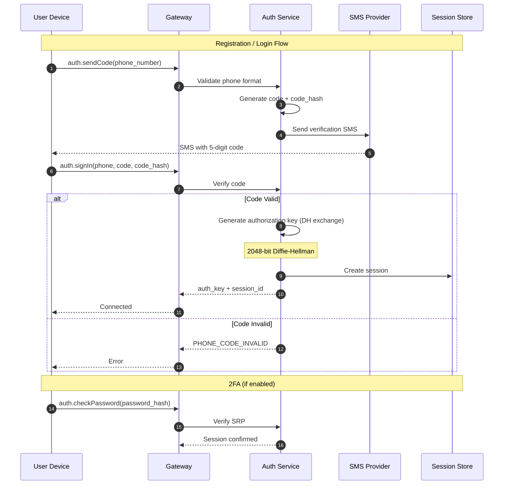
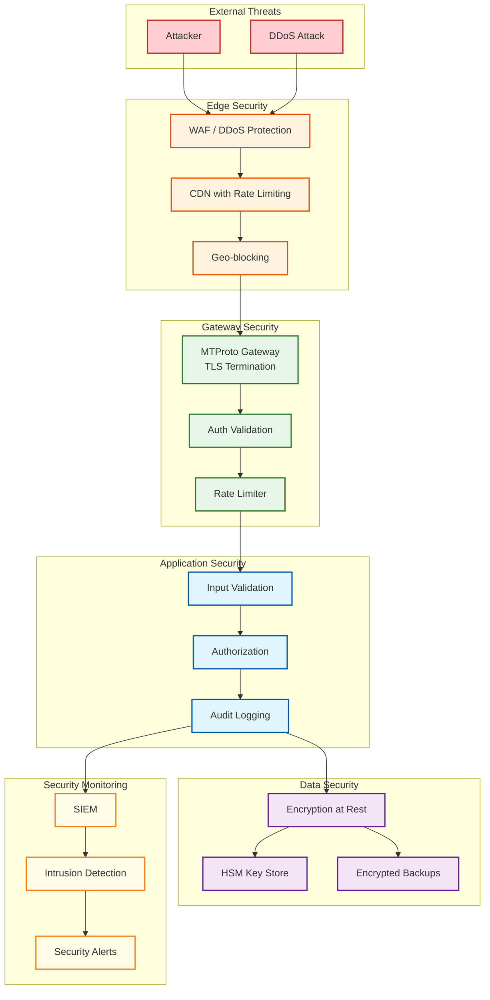

# Telegram: Security & Compliance

## Authentication & Authorization

### Authentication Mechanism



### Authorization Key Exchange (MTProto)

```
┌─────────────────────────────────────────────────────────────────────────────┐
│  AUTHORIZATION KEY CREATION (Diffie-Hellman)                                 │
├─────────────────────────────────────────────────────────────────────────────┤
│                                                                             │
│  CLIENT                          SERVER                                     │
│    │                               │                                        │
│    │─── req_pq_multi ─────────────►│                                        │
│    │◄── resPQ (nonce, pq, fp) ────│                                        │
│    │                               │                                        │
│    │    [Client factors pq]        │                                        │
│    │                               │                                        │
│    │─── req_DH_params ────────────►│                                        │
│    │    (p, q, nonce, encrypted)   │                                        │
│    │◄── server_DH_params_ok ──────│                                        │
│    │    (g, dh_prime, g_a, ...)    │                                        │
│    │                               │                                        │
│    │    [Client generates b]       │                                        │
│    │    [Computes g^b mod p]       │                                        │
│    │    [Computes auth_key = g_a^b mod p]                                  │
│    │                               │                                        │
│    │─── set_client_DH_params ─────►│                                        │
│    │    (g_b, nonce)               │                                        │
│    │◄── dh_gen_ok ────────────────│                                        │
│    │                               │                                        │
│                                                                             │
│  RESULT:                                                                     │
│    auth_key: 2048-bit shared secret                                         │
│    auth_key_id: SHA1(auth_key)[12:20] - 8 bytes for identification         │
│                                                                             │
│  SECURITY PROPERTIES:                                                        │
│    - Server never sees private keys (a or b)                                │
│    - Man-in-the-middle protected by server certificate                     │
│    - Key never transmitted, only computed locally                          │
│                                                                             │
└─────────────────────────────────────────────────────────────────────────────┘
```

### Two-Factor Authentication (2FA)

```
2FA IMPLEMENTATION: SRP (Secure Remote Password)

SETUP:
1. User chooses password
2. Client computes: x = H(salt || password)
3. Client computes: v = g^x mod N (verifier)
4. v sent to server (password never transmitted)

LOGIN:
1. Client: a = random, A = g^a mod N
2. Server: b = random, B = kv + g^b mod N
3. Both compute: u = H(A || B)
4. Client: S = (B - kg^x)^(a + ux) mod N
5. Server: S = (Av^u)^b mod N
6. Both derive session key: K = H(S)
7. Client proves knowledge of K

RECOVERY:
- Email-based recovery (if configured)
- Recovery code (shown once during setup)
```

### Session Management

| Aspect | Implementation |
|--------|---------------|
| Session Token | 8-byte auth_key_id + session metadata |
| Session Lifetime | Permanent until logout or 6-month inactivity |
| Multi-Device | Unlimited sessions per account |
| Session Visibility | Users can see all active sessions |
| Remote Logout | Terminate any session from any device |
| Session Binding | Tied to device + IP range |

### Authorization Model

```
PERMISSION MODEL: Role-Based Access Control (RBAC)

USER ROLES:
├── Regular User
│   ├── Send messages
│   ├── Join public groups/channels
│   ├── Create groups (up to limits)
│   └── Upload files (size limits)
│
├── Premium User
│   ├── All regular permissions
│   ├── Higher limits (file size, groups)
│   ├── Priority download
│   └── Exclusive features
│
├── Group Admin
│   ├── Manage members
│   ├── Delete messages
│   ├── Change settings
│   └── Promote other admins
│
├── Channel Admin
│   ├── Post messages
│   ├── Manage subscribers
│   ├── Edit posts
│   └── View statistics
│
└── Bot
    ├── Scoped to bot token
    ├── Group/channel specific
    └── API rate limited

GROUP/CHANNEL PERMISSIONS (Granular):
- Change info
- Post messages
- Edit messages
- Delete messages
- Ban users
- Invite users
- Pin messages
- Manage calls
- Add admins
```

---

## Data Security

### MTProto 2.0 Encryption

```
┌─────────────────────────────────────────────────────────────────────────────┐
│  MTPROTO 2.0 ENCRYPTION SCHEME                                               │
├─────────────────────────────────────────────────────────────────────────────┤
│                                                                             │
│  CLOUD CHATS (Client-Server Encryption)                                     │
│  ┌─────────────────────────────────────────────────────────────────────┐   │
│  │                                                                      │   │
│  │  plaintext || padding (12-1016 random bytes)                        │   │
│  │            │                                                         │   │
│  │            ▼                                                         │   │
│  │  msg_key = SHA256(auth_key[88:120] || data)[8:24]                   │   │
│  │            │                                                         │   │
│  │            ▼                                                         │   │
│  │  sha256_a = SHA256(msg_key || auth_key[0:36])                       │   │
│  │  sha256_b = SHA256(auth_key[40:76] || msg_key)                      │   │
│  │            │                                                         │   │
│  │            ▼                                                         │   │
│  │  aes_key = sha256_a[0:8] || sha256_b[8:24] || sha256_a[24:32]       │   │
│  │  aes_iv  = sha256_b[0:8] || sha256_a[8:24] || sha256_b[24:32]       │   │
│  │            │                                                         │   │
│  │            ▼                                                         │   │
│  │  encrypted_data = AES-256-IGE(data, aes_key, aes_iv)                │   │
│  │            │                                                         │   │
│  │            ▼                                                         │   │
│  │  message = auth_key_id (8) || msg_key (16) || encrypted_data        │   │
│  │                                                                      │   │
│  └─────────────────────────────────────────────────────────────────────┘   │
│                                                                             │
│  ALGORITHMS:                                                                 │
│    - AES-256-IGE (Infinite Garble Extension) mode                          │
│    - SHA-256 for key derivation and integrity                              │
│    - 2048-bit Diffie-Hellman for key exchange                              │
│                                                                             │
│  SECURITY PROPERTIES:                                                        │
│    - Confidentiality: AES-256 encryption                                   │
│    - Integrity: msg_key verifies data hasn't been tampered                 │
│    - Replay protection: Server checks msg_id uniqueness                    │
│                                                                             │
└─────────────────────────────────────────────────────────────────────────────┘
```

### Secret Chat End-to-End Encryption

```
┌─────────────────────────────────────────────────────────────────────────────┐
│  SECRET CHAT E2EE                                                            │
├─────────────────────────────────────────────────────────────────────────────┤
│                                                                             │
│  KEY EXCHANGE (Diffie-Hellman):                                             │
│  ┌─────────────────────────────────────────────────────────────────────┐   │
│  │  Alice                           Bob                                 │   │
│  │    │                              │                                  │   │
│  │    │ Generate a (private)         │                                  │   │
│  │    │ Compute g^a mod p            │                                  │   │
│  │    │                              │                                  │   │
│  │    │─────── g^a mod p ───────────►│                                  │   │
│  │    │                              │ Generate b (private)             │   │
│  │    │                              │ Compute g^b mod p                │   │
│  │    │◄────── g^b mod p ────────────│                                  │   │
│  │    │                              │                                  │   │
│  │    │ shared_key = (g^b)^a mod p   │ shared_key = (g^a)^b mod p      │   │
│  │    │                              │                                  │   │
│  │    │         SAME SHARED KEY (server cannot compute)                │   │
│  │    │                              │                                  │   │
│  └─────────────────────────────────────────────────────────────────────┘   │
│                                                                             │
│  KEY VERIFICATION:                                                           │
│  ┌─────────────────────────────────────────────────────────────────────┐   │
│  │  fingerprint = SHA256(shared_key)[0:16]                              │   │
│  │                                                                      │   │
│  │  Displayed as visual pattern (emoji grid):                          │   │
│  │  ┌───┬───┬───┬───┐                                                  │   │
│  │  │ 🔥│ 🌊│ 🌲│ 🎯│                                                  │   │
│  │  ├───┼───┼───┼───┤                                                  │   │
│  │  │ 🏠│ ⭐│ 🎪│ 🔔│                                                  │   │
│  │  └───┴───┴───┴───┘                                                  │   │
│  │                                                                      │   │
│  │  Users compare in-person or via trusted channel                     │   │
│  │  Mismatch = MITM attack detected                                    │   │
│  └─────────────────────────────────────────────────────────────────────┘   │
│                                                                             │
│  MESSAGE ENCRYPTION:                                                         │
│  ┌─────────────────────────────────────────────────────────────────────┐   │
│  │  Each message encrypted with shared_key                              │   │
│  │  Server relays encrypted blob                                        │   │
│  │  Server CANNOT decrypt (doesn't know shared_key)                    │   │
│  │                                                                      │   │
│  │  Self-destruct timer:                                                │   │
│  │  - Configurable: 1s to 1 week                                       │   │
│  │  - Timer starts when recipient opens message                        │   │
│  │  - Deleted from both devices after timer                            │   │
│  └─────────────────────────────────────────────────────────────────────┘   │
│                                                                             │
│  LIMITATIONS:                                                                │
│    - Device-specific (no multi-device sync)                                │
│    - 1:1 only (no group secret chats)                                      │
│    - Must be manually initiated                                            │
│    - No screenshots notification (platform-dependent)                      │
│                                                                             │
└─────────────────────────────────────────────────────────────────────────────┘
```

### Encryption at Rest

| Data Type | Encryption | Key Management |
|-----------|------------|----------------|
| User data (PostgreSQL) | AES-256-GCM | Per-shard keys in HSM |
| Messages (Cassandra) | AES-256 | Per-DC keys |
| Files (TFS) | AES-256-CTR | Per-file keys, master key in HSM |
| Backups | AES-256-GCM | Separate backup keys |
| Session data (Redis) | Not encrypted (in-memory, volatile) | N/A |

### Encryption in Transit

| Connection | Protocol | Certificate |
|------------|----------|-------------|
| Client ↔ Server | MTProto over TLS 1.3 | RSA-2048 / ECDSA |
| Server ↔ Server | mTLS | Internal CA |
| Server ↔ Database | TLS 1.3 | Internal CA |
| CDN ↔ Origin | TLS 1.3 | Public CA |

### PII Handling

```
PII DATA CLASSIFICATION:

HIGH SENSITIVITY:
├── Phone number (hashed for storage, never displayed to non-contacts)
├── IP address (logged temporarily for security)
├── Device identifiers
└── Location data (Snap Map participants only)

MEDIUM SENSITIVITY:
├── Display name
├── Username
├── Profile photo
└── Bio

LOW SENSITIVITY:
├── Group memberships (visible to members)
├── Channel subscriptions (private)
└── Last seen (configurable visibility)

HANDLING RULES:
- Phone stored as SHA-256 hash
- IP logged for 12 months (security investigations)
- Location data opt-in, approximate when shared
- Deleted data purged within 30 days
- Export available (GDPR data portability)
```

---

## Threat Model

### Top Attack Vectors

| # | Attack Vector | Likelihood | Impact | Mitigation |
|---|--------------|------------|--------|------------|
| 1 | Account takeover (SIM swap) | High | High | 2FA, session alerts, cloud password |
| 2 | Man-in-the-middle | Medium | High | Certificate pinning, DH key exchange |
| 3 | Server compromise | Low | Critical | Encryption at rest, HSM for keys |
| 4 | Spam/abuse | High | Medium | Rate limiting, phone verification, ML detection |
| 5 | DDoS | High | Medium | CDN, rate limiting, geo-blocking |
| 6 | Malicious bots | High | Medium | Captcha, behavior analysis |
| 7 | Phishing (fake clients) | Medium | High | Official app stores, code signing |

### Mitigation Details

#### 1. Account Takeover Protection

```
MULTI-LAYER PROTECTION:

Layer 1: SMS Verification
- Required for new device login
- Rate limited (5 attempts/hour)
- Code expires in 5 minutes

Layer 2: Cloud Password (2FA)
- SRP-based (password never transmitted)
- Required after SMS
- Recovery via email or recovery code

Layer 3: Active Session Alerts
- Notification on new login
- One-tap remote logout
- Session history visible

Layer 4: Login Approval
- Optional: require existing device approval
- Verification code shown on new device
- Enter on existing device to authorize

Layer 5: Suspicious Activity Detection
- Unusual location triggers verification
- Multiple failed attempts → temporary lock
- Device fingerprint analysis
```

#### 2. Rate Limiting & DDoS Protection

```
RATE LIMITING LAYERS:

Application Layer:
├── Messages: 30/second per user
├── API calls: 30/second per session
├── File uploads: 5/minute per user
├── Group joins: 5/day per user
└── New chats: 50/day per user

Network Layer:
├── Connections: 100/IP/minute
├── Bandwidth: Throttled per IP
└── Geographic: Block known bad ranges

Infrastructure:
├── CDN absorption (absorbs 90%+ of DDoS)
├── Anycast DNS (distributes load)
├── TCP SYN cookies (SYN flood protection)
└── Auto-scaling (absorbs legitimate spikes)
```

#### 3. Content Moderation

```
MODERATION APPROACH:

Cloud Chats:
- Server-side scanning for known abuse patterns
- User reports reviewed
- Automated detection: CSAM, terrorism content
- Hash matching against known bad content

Secret Chats:
- No server-side moderation (E2EE)
- Rely on device-side detection
- User reporting (screenshot evidence)

Channel/Group Moderation:
- Admin tools for management
- Report button for users
- Telegram Trust & Safety review
- Takedown for policy violations
```

---

## Compliance

### GDPR (EU)

| Requirement | Implementation |
|-------------|---------------|
| Right to Access | Settings → Privacy → Request Data Export |
| Right to Erasure | Account deletion removes all data within 30 days |
| Data Portability | JSON export of messages, contacts, settings |
| Consent | Explicit consent for optional features |
| Data Minimization | Minimal data collection, no profiling |
| Breach Notification | 72-hour notification process |

### Data Residency

```
DATA RESIDENCY BY REGION:

EU Users:
├── Primary DC: Amsterdam
├── Data never leaves EU (GDPR)
├── Backup: Within EU
└── Processing: EU only

US Users:
├── Primary DC: Miami
├── Standard privacy policy
└── Backup: US region

Asia Users:
├── Primary DC: Singapore
├── Local compliance varies
└── Data may replicate for performance
```

### Content Policies

| Content Type | Policy |
|--------------|--------|
| CSAM | Zero tolerance, hash matching, law enforcement |
| Terrorism | Removed, reported to authorities |
| Copyright | DMCA process, takedown on valid request |
| Spam | Automated detection, account termination |
| Harassment | User blocking, report review, ban |
| Illegal goods | Channel/group takedown |

---

## Security Architecture Diagram



---

## Security Comparison: Telegram vs WhatsApp vs Signal

| Aspect | Telegram | WhatsApp | Signal |
|--------|----------|----------|--------|
| **Default Encryption** | Client-server | E2EE | E2EE |
| **E2EE Available** | Secret Chats only | Always | Always |
| **Protocol** | MTProto 2.0 | Signal Protocol | Signal Protocol |
| **Protocol Audit** | Partial (academic) | Full (academic) | Full (academic) |
| **Open Source Server** | No | No | Yes |
| **Open Source Client** | Yes | Yes | Yes |
| **Metadata Collection** | Moderate | Moderate | Minimal |
| **Server Storage** | Messages stored | Metadata only | Minimal |
| **2FA** | Cloud password | None (device-based) | Registration lock |
| **Key Verification** | Emoji fingerprint | QR code / number | Safety numbers |
| **Contact Discovery** | Phone hash | Phone hash | Private contact discovery |
