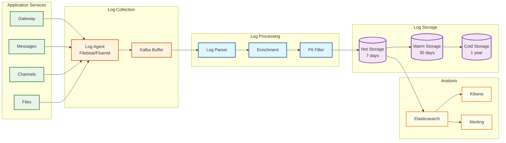

# Telegram: Observability

## Metrics Strategy

### USE Method (Utilization, Saturation, Errors)

| Resource | Utilization | Saturation | Errors |
|----------|-------------|------------|--------|
| **CPU** | `cpu_usage_percent` | `cpu_throttle_count` | `cpu_errors` |
| **Memory** | `memory_used_percent` | `memory_oom_kills` | `memory_allocation_failures` |
| **Network** | `network_bandwidth_mbps` | `network_queue_depth` | `network_errors` |
| **Disk** | `disk_io_percent` | `disk_queue_length` | `disk_errors` |
| **Connections** | `active_connections_percent` | `connection_queue_depth` | `connection_errors` |

### RED Method (Rate, Errors, Duration)

| Service | Rate | Errors | Duration |
|---------|------|--------|----------|
| **Message Service** | `messages_per_second` | `message_send_errors` | `message_latency_ms` |
| **Channel Service** | `fanout_per_second` | `fanout_failures` | `fanout_duration_ms` |
| **File Service** | `uploads_per_second` | `upload_failures` | `upload_duration_ms` |
| **Auth Service** | `logins_per_second` | `auth_failures` | `auth_latency_ms` |
| **Search Service** | `queries_per_second` | `search_errors` | `search_latency_ms` |

### Key Business Metrics

```
┌─────────────────────────────────────────────────────────────────────────────┐
│  BUSINESS METRICS DASHBOARD                                                  │
├─────────────────────────────────────────────────────────────────────────────┤
│                                                                             │
│  USER ENGAGEMENT                                                             │
│  ┌─────────────────────────────────────────────────────────────────────┐   │
│  │  active_users_1m        Current online users                         │   │
│  │  dau                    Daily active users                           │   │
│  │  mau                    Monthly active users                         │   │
│  │  messages_sent_today    Total messages sent                          │   │
│  │  new_registrations      New users today                              │   │
│  └─────────────────────────────────────────────────────────────────────┘   │
│                                                                             │
│  FEATURE USAGE                                                               │
│  ┌─────────────────────────────────────────────────────────────────────┐   │
│  │  groups_created         New groups/day                               │   │
│  │  channels_created       New channels/day                             │   │
│  │  secret_chats_started   Secret chat initiations                      │   │
│  │  files_uploaded         File uploads/day                             │   │
│  │  bot_interactions       Bot API calls/day                            │   │
│  └─────────────────────────────────────────────────────────────────────┘   │
│                                                                             │
│  QUALITY METRICS                                                             │
│  ┌─────────────────────────────────────────────────────────────────────┐   │
│  │  message_delivery_p99   99th percentile delivery time                │   │
│  │  sync_lag_p95           Multi-device sync delay                      │   │
│  │  api_success_rate       Successful API responses                     │   │
│  │  user_reported_issues   Support tickets opened                       │   │
│  └─────────────────────────────────────────────────────────────────────┘   │
│                                                                             │
└─────────────────────────────────────────────────────────────────────────────┘
```

### Service-Specific Metrics

#### Gateway Metrics
```
mtproto_connections_total          # Total active connections
mtproto_connections_by_dc          # Connections per data center
mtproto_handshake_duration_ms      # Key exchange time
mtproto_messages_in_per_second     # Inbound message rate
mtproto_messages_out_per_second    # Outbound message rate
mtproto_session_duration_seconds   # Average session length
mtproto_encryption_errors          # Decryption failures
```

#### Message Service Metrics
```
messages_sent_total                # Counter of all messages
messages_sent_by_type              # Text, photo, video, etc.
messages_delivered_total           # Successfully delivered
messages_delivery_latency_ms       # Send to delivery time
messages_pending_delivery          # Queue depth
messages_failed_delivery           # Delivery failures
group_messages_fanout_size         # Average group size
```

#### Channel Service Metrics
```
channel_posts_total                # Total channel posts
channel_fanout_duration_ms         # Time to reach all subscribers
channel_fanout_size_distribution   # Histogram of channel sizes
channel_subscriber_shards_active   # Active fanout shards
channel_delivery_lag_seconds       # Delay in large channel delivery
channel_views_per_second           # View counter updates
```

#### File Service Metrics
```
file_uploads_total                 # Total uploads
file_uploads_by_size_bucket        # Size distribution
file_upload_duration_ms            # Upload time by size
file_downloads_total               # Total downloads
file_downloads_cache_hit_rate      # CDN cache effectiveness
file_deduplication_rate            # Storage saved
file_storage_used_bytes            # Total storage
```

---

## Dashboard Design

### Operations Dashboard

```
┌─────────────────────────────────────────────────────────────────────────────┐
│  TELEGRAM OPERATIONS DASHBOARD                                               │
├─────────────────────────────────────────────────────────────────────────────┤
│                                                                             │
│  ┌─────────────────────────┐  ┌─────────────────────────┐                  │
│  │  SYSTEM HEALTH          │  │  TRAFFIC OVERVIEW       │                  │
│  │  ████████████████ 99.9% │  │  Messages/sec: 175,234  │                  │
│  │  All systems normal     │  │  Peak today: 512,000    │                  │
│  │                         │  │  Connections: 98.2M     │                  │
│  └─────────────────────────┘  └─────────────────────────┘                  │
│                                                                             │
│  ┌─────────────────────────────────────────────────────────────────────┐   │
│  │  MESSAGE DELIVERY LATENCY (p50 / p95 / p99)                          │   │
│  │                                                                      │   │
│  │  200ms ┤     ╭─────╮                                                │   │
│  │        │    ╱       ╲                   p99                         │   │
│  │  150ms ┤   ╱         ╲        ╭─────────────────                    │   │
│  │        │  ╱           ╲      ╱                                      │   │
│  │  100ms ┤ ╱             ╲────╱           p95                         │   │
│  │        │╱                                                           │   │
│  │   50ms ┤──────────────────────────────────────── p50               │   │
│  │        └────┬────┬────┬────┬────┬────┬────┬────┬────┬────┬────    │   │
│  │            00   02   04   06   08   10   12   14   16   18   20     │   │
│  └─────────────────────────────────────────────────────────────────────┘   │
│                                                                             │
│  ┌────────────────────────────────┐  ┌────────────────────────────────┐   │
│  │  BY DATA CENTER                │  │  ERROR RATE BY SERVICE         │   │
│  │                                │  │                                │   │
│  │  Miami:     ████████ 32%      │  │  Gateway:    0.01%             │   │
│  │  Amsterdam: ██████   25%      │  │  Messages:   0.02%             │   │
│  │  Singapore: ██████   24%      │  │  Files:      0.15%             │   │
│  │  Dubai:     █████    19%      │  │  Channels:   0.03%             │   │
│  │                                │  │  Search:     0.08%             │   │
│  └────────────────────────────────┘  └────────────────────────────────┘   │
│                                                                             │
│  ┌─────────────────────────────────────────────────────────────────────┐   │
│  │  ACTIVE INCIDENTS                                                    │   │
│  │  ────────────────────────────────────────────────────────────────   │   │
│  │  [INFO] Elevated latency in Singapore DC - investigating            │   │
│  │  [WARN] File upload queue depth above threshold                     │   │
│  └─────────────────────────────────────────────────────────────────────┘   │
│                                                                             │
└─────────────────────────────────────────────────────────────────────────────┘
```

### Channel Fanout Dashboard

```
┌─────────────────────────────────────────────────────────────────────────────┐
│  CHANNEL FANOUT MONITORING                                                   │
├─────────────────────────────────────────────────────────────────────────────┤
│                                                                             │
│  ACTIVE FANOUTS                                                              │
│  ┌─────────────────────────────────────────────────────────────────────┐   │
│  │  Channel             Subscribers    Progress    ETA      Status     │   │
│  │  ─────────────────────────────────────────────────────────────────  │   │
│  │  @hamster_kombat     43,200,000    ████░░░░ 45%   32s    Running   │   │
│  │  @durov              12,500,000    ████████ 100%  -      Complete  │   │
│  │  @telegram           8,200,000     ██████░░ 78%   8s     Running   │   │
│  └─────────────────────────────────────────────────────────────────────┘   │
│                                                                             │
│  FANOUT METRICS                                                              │
│  ┌─────────────────────┐  ┌─────────────────────┐  ┌───────────────────┐  │
│  │  Deliveries/sec     │  │  Avg Fanout Time    │  │  Queue Depth      │  │
│  │  ████████████████   │  │  45.2 seconds       │  │  12,340 tasks     │  │
│  │  723,456            │  │  (for 10M+ channels)│  │  ████░░░░░░       │  │
│  └─────────────────────┘  └─────────────────────┘  └───────────────────┘  │
│                                                                             │
│  WORKER UTILIZATION                                                          │
│  ┌─────────────────────────────────────────────────────────────────────┐   │
│  │  Workers Active: 847/1000                                            │   │
│  │  ████████████████████████████████████████████████████░░░░░░ 85%     │   │
│  └─────────────────────────────────────────────────────────────────────┘   │
│                                                                             │
└─────────────────────────────────────────────────────────────────────────────┘
```

---

## Logging Strategy

### Log Levels

| Level | Usage | Examples |
|-------|-------|----------|
| **ERROR** | Failures requiring attention | Auth failure, DB connection error |
| **WARN** | Degraded but functional | High latency, retry succeeded |
| **INFO** | Normal operations | User login, message sent |
| **DEBUG** | Development troubleshooting | Request/response details |
| **TRACE** | Deep debugging | Protocol-level details |

### Structured Logging Format

```json
{
  "timestamp": "2026-01-30T10:15:30.123Z",
  "level": "INFO",
  "service": "message-service",
  "dc": "amsterdam",
  "instance": "msg-svc-042",
  "trace_id": "abc123def456",
  "span_id": "span789",
  "user_id": "123456789",
  "action": "message_sent",
  "chat_id": "987654321",
  "message_type": "text",
  "duration_ms": 45,
  "success": true,
  "metadata": {
    "message_size": 256,
    "has_media": false,
    "recipient_online": true
  }
}
```

### What to Log

| Event | Log Level | Fields | Retention |
|-------|-----------|--------|-----------|
| User login | INFO | user_id, device, ip, dc | 90 days |
| Message sent | INFO | user_id, chat_id, type, size | 30 days |
| File upload | INFO | user_id, file_size, duration | 30 days |
| API error | ERROR | endpoint, error_code, trace_id | 180 days |
| Auth failure | WARN | phone_hash, ip, reason | 180 days |
| Rate limit hit | WARN | user_id, endpoint, limit | 7 days |
| DB query slow | WARN | query_hash, duration, table | 30 days |

### What NOT to Log

- Message content (privacy)
- Phone numbers (PII)
- Auth keys / tokens
- Secret chat metadata
- Full file contents
- Passwords / 2FA codes

### Log Aggregation Architecture



---

## Distributed Tracing

### Trace Propagation Strategy

```
TRACE CONTEXT PROPAGATION:

Client Request:
  → MTProto Gateway (span: gateway)
    → Auth Service (span: auth)
    → Message Service (span: message)
      → Database (span: db_write)
      → Cache (span: cache_update)
    → Notification Service (span: notify)
      → APNs/FCM (span: push)

Trace ID Format: 128-bit UUID
Span ID Format: 64-bit random

Propagation Headers (internal):
  X-Trace-Id: abc123...
  X-Span-Id: def456...
  X-Parent-Span-Id: ghi789...
```

### Key Spans to Instrument

| Span | Parent | Tags |
|------|--------|------|
| `gateway.receive` | - | dc, protocol, client_version |
| `auth.validate` | gateway | user_id, session_id |
| `message.process` | gateway | chat_id, message_type |
| `db.query` | message | table, operation |
| `cache.lookup` | message | key_pattern, hit |
| `fanout.dispatch` | message | channel_id, subscriber_count |
| `push.send` | fanout | provider, batch_size |

### Example Trace Visualization

```
┌─────────────────────────────────────────────────────────────────────────────┐
│  TRACE: Message Send (trace_id: abc123)                                      │
│  Total Duration: 145ms                                                       │
├─────────────────────────────────────────────────────────────────────────────┤
│                                                                             │
│  gateway.receive     │████                                        │ 15ms   │
│  auth.validate       │    ██                                      │ 8ms    │
│  message.process     │      ████████████████████████████████████  │ 95ms   │
│    ├─ db.write       │        ████████                            │ 35ms   │
│    ├─ cache.update   │                ██                          │ 5ms    │
│    └─ notify.queue   │                  ██████                    │ 20ms   │
│  response.send       │                                        ████│ 12ms   │
│                                                                             │
│  Timeline: 0ms ────────────────────────────────────────────────── 145ms    │
│                                                                             │
└─────────────────────────────────────────────────────────────────────────────┘
```

---

## Alerting Strategy

### Critical Alerts (Page-Worthy)

| Alert | Condition | Severity | Escalation |
|-------|-----------|----------|------------|
| Service Down | Health check fails 3x | P1 | Immediate page |
| Error Rate Spike | >1% errors for 5 min | P1 | Immediate page |
| Database Failover | Primary unreachable | P1 | Immediate page |
| DC Unreachable | No response 2 min | P1 | Immediate page |
| Security Breach | Anomaly detection trigger | P1 | Security team |
| Message Queue Full | >95% capacity | P1 | Immediate page |

### Warning Alerts

| Alert | Condition | Severity | Action |
|-------|-----------|----------|--------|
| High Latency | p99 > 500ms for 10 min | P2 | Investigate |
| Disk Space Low | <20% free | P2 | Add storage |
| Memory Pressure | >85% used | P2 | Scale or investigate |
| Certificate Expiry | <7 days | P2 | Renew certificate |
| Fanout Backlog | >100K pending | P2 | Scale workers |
| Cache Hit Rate Low | <80% | P3 | Tune caching |

### Alert Routing

```yaml
alerting_rules:
  - name: critical_service_down
    condition: service_health == 0
    for: 1m
    severity: critical
    routes:
      - pagerduty: on-call-primary
      - slack: #incidents
      - email: sre-team@telegram.org

  - name: high_error_rate
    condition: error_rate > 0.01
    for: 5m
    severity: critical
    routes:
      - pagerduty: on-call-primary
      - slack: #incidents

  - name: elevated_latency
    condition: latency_p99 > 500ms
    for: 10m
    severity: warning
    routes:
      - slack: #performance
      - email: platform-team@telegram.org
```

### Runbook References

| Alert | Runbook | Key Actions |
|-------|---------|-------------|
| Gateway overload | `runbook/gateway-overload.md` | Scale gateways, check for DDoS |
| DB replication lag | `runbook/db-replication.md` | Check network, promote replica if needed |
| Fanout timeout | `runbook/channel-fanout.md` | Scale workers, check for large channels |
| Auth service errors | `runbook/auth-errors.md` | Check SMS provider, validate sessions |
| File upload failures | `runbook/file-upload.md` | Check storage, verify TFS health |

---

## Multi-DC Observability

### Cross-DC Metrics Aggregation

```
┌─────────────────────────────────────────────────────────────────────────────┐
│  GLOBAL METRICS AGGREGATION                                                  │
├─────────────────────────────────────────────────────────────────────────────┤
│                                                                             │
│  ARCHITECTURE:                                                               │
│                                                                             │
│  ┌─────────────┐  ┌─────────────┐  ┌─────────────┐  ┌─────────────┐       │
│  │ DC Americas │  │ DC Europe   │  │ DC Asia     │  │ DC ME       │       │
│  │             │  │             │  │             │  │             │       │
│  │ Local       │  │ Local       │  │ Local       │  │ Local       │       │
│  │ Prometheus  │  │ Prometheus  │  │ Prometheus  │  │ Prometheus  │       │
│  └──────┬──────┘  └──────┬──────┘  └──────┬──────┘  └──────┬──────┘       │
│         │                │                │                │               │
│         └────────────────┼────────────────┼────────────────┘               │
│                          │                │                                 │
│                          ▼                ▼                                 │
│                   ┌──────────────────────────────┐                         │
│                   │  Global Aggregator           │                         │
│                   │  (Thanos / Cortex)           │                         │
│                   └──────────────┬───────────────┘                         │
│                                  │                                          │
│                                  ▼                                          │
│                   ┌──────────────────────────────┐                         │
│                   │  Global Dashboard            │                         │
│                   │  (Grafana)                   │                         │
│                   └──────────────────────────────┘                         │
│                                                                             │
│  BENEFITS:                                                                   │
│  - Global view of all DCs                                                  │
│  - Cross-DC comparison                                                     │
│  - Unified alerting                                                        │
│  - Historical analysis                                                     │
│                                                                             │
└─────────────────────────────────────────────────────────────────────────────┘
```

### DC Health Comparison

```
┌─────────────────────────────────────────────────────────────────────────────┐
│  DATA CENTER HEALTH COMPARISON                                               │
├─────────────────────────────────────────────────────────────────────────────┤
│                                                                             │
│  Metric              Americas   Europe    Asia      ME                      │
│  ─────────────────────────────────────────────────────────────────────────  │
│  Status              ● OK       ● OK      ● WARN    ● OK                   │
│  Connections         32.1M      24.8M     25.2M     16.1M                  │
│  Messages/sec        56,234     43,123    48,432    27,445                 │
│  Latency p99         145ms      132ms     312ms     165ms                  │
│  Error Rate          0.02%      0.01%     0.08%     0.02%                  │
│  DB Replication      0.5s       0.3s      2.1s      0.8s                   │
│                                                                             │
│  ⚠️ Asia DC showing elevated latency - investigating                        │
│                                                                             │
└─────────────────────────────────────────────────────────────────────────────┘
```

---

## SLI/SLO Monitoring

### Service Level Indicators

| SLI | Definition | Measurement |
|-----|------------|-------------|
| Availability | % of successful requests | `successful_requests / total_requests` |
| Latency | Message delivery time | `histogram_quantile(0.99, delivery_duration)` |
| Throughput | Messages processed | `rate(messages_total[5m])` |
| Error Rate | % of failed requests | `errors / total_requests` |

### Service Level Objectives

| Service | SLI | SLO | Error Budget (30d) |
|---------|-----|-----|-------------------|
| Message Delivery | Latency p99 | < 500ms | 43,200 violations |
| Message Delivery | Success Rate | > 99.9% | 4.32M failures |
| File Upload | Success Rate | > 99.5% | 21.6M failures |
| Channel Fanout | Completion Time | < 60s for 99% | 1% delayed |
| API Availability | Uptime | > 99.99% | 4.3 min downtime |

### Error Budget Dashboard

```
┌─────────────────────────────────────────────────────────────────────────────┐
│  ERROR BUDGET STATUS (30-day rolling)                                        │
├─────────────────────────────────────────────────────────────────────────────┤
│                                                                             │
│  Message Delivery SLO (99.9%)                                                │
│  Budget: 4,320,000 failures │ Used: 1,234,567 │ Remaining: 3,085,433       │
│  ██████████████████████████████░░░░░░░░░░░░░░░░░░░░░░░░░░░░░░░░░░ 71%      │
│  Status: ● Healthy                                                          │
│                                                                             │
│  API Availability SLO (99.99%)                                               │
│  Budget: 4.32 min │ Used: 0.8 min │ Remaining: 3.52 min                    │
│  ██████████████████░░░░░░░░░░░░░░░░░░░░░░░░░░░░░░░░░░░░░░░░░░░░░░ 19%      │
│  Status: ● Healthy                                                          │
│                                                                             │
│  File Upload SLO (99.5%)                                                     │
│  Budget: 21,600,000 failures │ Used: 18,234,567 │ Remaining: 3,365,433     │
│  ██████████████████████████████████████████████████████████████░░░ 84%      │
│  Status: ⚠️ Watch - approaching budget                                       │
│                                                                             │
└─────────────────────────────────────────────────────────────────────────────┘
```
