# YouTube System Design

[← Back to System Design Index](../README.md)

---

## Overview

YouTube is the world's largest video streaming platform, serving **2.5+ billion monthly active users** with a catalog of **800+ million videos** and delivering **1 billion hours of video watched daily**. The platform handles 500+ hours of video uploads per minute, requiring a massive transcoding pipeline, global CDN infrastructure, and sophisticated recommendation algorithms. YouTube's core technical challenges include real-time video processing at scale, sub-second playback startup, accurate view counting under massive concurrent load, and personalized recommendations that drive 70% of watch time.

**Key Differentiators from Other Video Platforms:**
- **Long-form focus**: Hours-long content vs TikTok's seconds/minutes
- **Search-first discovery**: Unlike TikTok's algorithm-only FYP
- **Creator economy**: Complex monetization with ad revenue sharing
- **Universal codec support**: Legacy device compatibility priority

---

## System Characteristics

| Characteristic | Value | Implication |
|----------------|-------|-------------|
| Traffic Pattern | Read-heavy (10,000:1 read-write ratio) | Aggressive CDN caching, edge optimization |
| Content Type | Long-form video (avg 11.7 minutes) | Seek/resume support, chapter markers |
| Discovery Model | Search + Subscription + Recommendation | Hybrid ranking, multiple entry points |
| Consistency Model | Eventual (view counts), Strong (payments) | Polyglot persistence strategy |
| Latency Sensitivity | High (<200ms playback start) | Edge caching, video prefetching |
| Storage Profile | Write-once, read-many (WORM) | Immutable video storage, CDN-friendly |
| Global Distribution | 100+ countries, 80+ languages | Multi-region, geo-routing, localization |

---

## Complexity Rating

| Component | Complexity | Reason |
|-----------|------------|--------|
| Video Transcoding Pipeline | **Very High** | Multi-codec, multi-resolution, custom ASICs, 500+ hours/min |
| CDN & Edge Delivery | **Very High** | 100+ Tbps capacity, 3000+ PoPs, ISP peering |
| Recommendation Engine | **Very High** | 80B+ signals/day, 50ms latency budget, deep learning |
| View Count System | **High** | Billions/day, anti-fraud, eventual consistency |
| Search & Discovery | **High** | 800M+ videos, transcript search, semantic understanding |
| Comments System | **Medium-High** | Threading, moderation, spam detection at scale |
| Live Streaming | **High** | <3s latency, real-time chat, dynamic scaling |
| Creator Analytics | **Medium** | Real-time dashboards, revenue tracking |
| Monetization (Ads) | **Very High** | Real-time bidding, fraud detection, revenue split |

**Overall System Complexity: Very High**

---

## Quick Navigation

| Document | Description |
|----------|-------------|
| [01 - Requirements & Estimations](./01-requirements-and-estimations.md) | Functional/non-functional requirements, capacity planning |
| [02 - High-Level Design](./02-high-level-design.md) | Architecture diagrams, data flows, key decisions |
| [03 - Low-Level Design](./03-low-level-design.md) | Data models, API design, algorithms |
| [04 - Deep Dive & Bottlenecks](./04-deep-dive-and-bottlenecks.md) | Transcoding, view counts, recommendations deep dive |
| [05 - Scalability & Reliability](./05-scalability-and-reliability.md) | CDN scaling, fault tolerance, disaster recovery |
| [06 - Security & Compliance](./06-security-and-compliance.md) | Content ID, DMCA, COPPA, ad fraud prevention |
| [07 - Observability](./07-observability.md) | Creator analytics, metrics, alerting |
| [08 - Interview Guide](./08-interview-guide.md) | 45-min pacing, trap questions, trade-offs |

---

## Core Modules

| Module | Responsibility | Key Challenge | Scale |
|--------|---------------|---------------|-------|
| **Upload Service** | Receive, validate, chunk videos | Resumable uploads, large files (128GB max) | 500+ hours/minute |
| **Transcoding Pipeline** | Convert to multiple formats/resolutions | Parallel processing, codec optimization | Millions of jobs/day |
| **Video Storage** | Store original + transcoded variants | Petabytes of data, replication | 720+ PB/year added |
| **CDN Edge** | Serve video segments globally | Cache hit rate, ISP peering | 100+ Tbps egress |
| **Playback Service** | Generate manifests, track progress | ABR adaptation, DRM | Billions of streams/day |
| **View Counter** | Count views accurately | Anti-fraud, eventual consistency | Billions of events/day |
| **Recommendation Engine** | Personalize home/suggested videos | 50ms latency, relevance | 80B+ signals/day |
| **Search Service** | Full-text + semantic search | 800M+ videos, real-time | Millions of queries/sec |
| **Comments Service** | Store, thread, moderate comments | Spam detection, threading | Billions of comments |
| **Analytics Pipeline** | Process metrics for creators | Real-time + batch, accuracy | Petabytes of events |
| **Ads Service** | Insert, track, bill advertisements | Real-time bidding, fraud | Billions of impressions |

---

## Architecture Overview

```mermaid
flowchart TB
    subgraph Clients["Client Layer"]
        WEB[Web Player]
        MOBILE[Mobile Apps]
        TV[Smart TV/Console]
        EMBED[Embedded Players]
    end

    subgraph Edge["Edge Layer (3000+ PoPs)"]
        CDN[Google Media CDN]
        CACHE[Edge Cache]
        POP[Point of Presence]
    end

    subgraph Gateway["API Gateway Layer"]
        LB[Global Load Balancer]
        GW[API Gateway]
        AUTH[Auth Service]
        RATE[Rate Limiter]
    end

    subgraph Core["Core Services"]
        UPLOAD[Upload Service]
        PLAYBACK[Playback Service]
        SEARCH[Search Service]
        REC[Recommendation Engine]
        COMMENT[Comments Service]
        CHANNEL[Channel Service]
        SUB[Subscription Service]
    end

    subgraph Processing["Media Processing"]
        TRANSCODE[Transcoding Pipeline]
        THUMB[Thumbnail Generator]
        CAPTION[Caption Generator]
        CONTENT_ID[Content ID Matcher]
    end

    subgraph ML["ML/AI Layer"]
        RANK[Ranking Models]
        SAFETY[Safety Classifier]
        QUALITY[Quality Scorer]
        FEATURE[Feature Store]
    end

    subgraph Analytics["Analytics Pipeline"]
        VIEW[View Counter]
        EVENTS[Event Collector]
        STREAM[Stream Processor]
        CREATOR[Creator Analytics]
    end

    subgraph Storage["Data Layer"]
        subgraph Relational["Relational (Vitess)"]
            MYSQL[(Video Metadata)]
            USER_DB[(User/Channel Data)]
        end
        subgraph NoSQL["NoSQL"]
            BIGTABLE[(Watch History)]
            COMMENTS_DB[(Comments)]
        end
        subgraph Global["Global (Spanner)"]
            RIGHTS[(Content ID/Rights)]
            ADS_DB[(Ads/Billing)]
        end
        subgraph Blob["Object Storage"]
            VIDEO_STORE[(Video Files)]
            THUMB_STORE[(Thumbnails)]
        end
    end

    subgraph Queue["Message Queues"]
        TRANSCODE_Q[Transcode Queue]
        ANALYTICS_Q[Analytics Queue]
        NOTIFY_Q[Notification Queue]
    end

    Clients --> Edge
    Edge --> Gateway
    Gateway --> Core
    Core --> Processing
    Core --> ML
    Core --> Analytics
    Processing --> Queue
    Analytics --> Queue
    Core --> Storage
    Processing --> Storage
    Analytics --> Storage

    classDef client fill:#e1f5fe,stroke:#01579b,stroke-width:2px
    classDef edge fill:#e0f7fa,stroke:#00695c,stroke-width:2px
    classDef gateway fill:#fff3e0,stroke:#e65100,stroke-width:2px
    classDef core fill:#e8f5e9,stroke:#2e7d32,stroke-width:2px
    classDef processing fill:#fff8e1,stroke:#ff8f00,stroke-width:2px
    classDef ml fill:#fce4ec,stroke:#c2185b,stroke-width:2px
    classDef analytics fill:#e8eaf6,stroke:#3f51b5,stroke-width:2px
    classDef storage fill:#f3e5f5,stroke:#6a1b9a,stroke-width:2px
    classDef queue fill:#e0f2f1,stroke:#00695c,stroke-width:2px

    class WEB,MOBILE,TV,EMBED client
    class CDN,CACHE,POP edge
    class LB,GW,AUTH,RATE gateway
    class UPLOAD,PLAYBACK,SEARCH,REC,COMMENT,CHANNEL,SUB core
    class TRANSCODE,THUMB,CAPTION,CONTENT_ID processing
    class RANK,SAFETY,QUALITY,FEATURE ml
    class VIEW,EVENTS,STREAM,CREATOR analytics
    class MYSQL,USER_DB,BIGTABLE,COMMENTS_DB,RIGHTS,ADS_DB,VIDEO_STORE,THUMB_STORE storage
    class TRANSCODE_Q,ANALYTICS_Q,NOTIFY_Q queue
```



---

## Platform Comparison

| Aspect | YouTube | TikTok | Netflix | Twitch |
|--------|---------|--------|---------|--------|
| **Content Length** | Minutes to hours | 15s - 10min | Hours (movies/series) | Hours (live) |
| **Discovery Model** | Search + Sub + Algo | Algorithm-first (FYP) | Algorithm + Browse | Live + Browse |
| **Upload Model** | User-generated | User-generated | Studio content | Live streams |
| **Monetization** | Ads + Premium + Memberships | Ads + Creator Fund | Subscription | Ads + Subs + Bits |
| **CDN Strategy** | Private (Google) | Third-party + Edge | Private (Open Connect) | Third-party |
| **Latency Priority** | Startup time | Instant scroll | Buffering tolerance | Real-time (<3s) |
| **Graph Type** | Subscription-based | Interest-based | Watch history | Follow-based |

---

## Key Scale Numbers

| Metric | Value | Context |
|--------|-------|---------|
| Monthly Active Users | 2.5 billion | Largest video platform globally |
| Daily Active Users | 122 million | ~5% of MAU daily |
| Hours Watched/Day | 1 billion | Primary engagement metric |
| Videos Uploaded/Minute | 500+ hours | Massive transcoding load |
| Total Videos | 800+ million | Catalog size |
| CDN Capacity | 100+ Tbps | Egress bandwidth |
| CDN Locations | 3,000+ | Global edge presence |
| Cache Hit Rate | 98.5% | VOD content |
| Search Queries/Day | 3+ billion | Second largest search engine |
| Comments/Day | Billions | Engagement at scale |
| Recommendation Signals/Day | 80+ billion | ML feature data |

---

## Video Processing Pipeline Overview

```
┌─────────────────────────────────────────────────────────────────────────────┐
│                        VIDEO UPLOAD & PROCESSING FLOW                        │
├─────────────────────────────────────────────────────────────────────────────┤
│                                                                              │
│  ┌──────────┐    ┌──────────┐    ┌──────────────────────────────────────┐   │
│  │  UPLOAD  │───▶│  CHUNK   │───▶│         PARALLEL TRANSCODING         │   │
│  │  (128GB  │    │  STORE   │    │                                      │   │
│  │   max)   │    │          │    │  ┌────────┐ ┌────────┐ ┌────────┐   │   │
│  └──────────┘    └──────────┘    │  │ H.264  │ │  VP9   │ │  AV1   │   │   │
│                                   │  │ Encode │ │ Encode │ │ Encode │   │   │
│                                   │  └────────┘ └────────┘ └────────┘   │   │
│                                   │       │          │          │       │   │
│                                   │       ▼          ▼          ▼       │   │
│                                   │  ┌────────────────────────────────┐ │   │
│                                   │  │  Per-Codec Resolution Ladder   │ │   │
│                                   │  │  144p│240p│360p│480p│720p│1080p│ │   │
│                                   │  │  1440p│2160p│4320p (select)    │ │   │
│                                   │  └────────────────────────────────┘ │   │
│                                   └──────────────────────────────────────┘   │
│                                                      │                       │
│                                                      ▼                       │
│  ┌────────────────────────────────────────────────────────────────────────┐ │
│  │                         PARALLEL OPERATIONS                             │ │
│  │  ┌─────────────┐  ┌─────────────┐  ┌─────────────┐  ┌─────────────┐   │ │
│  │  │  Thumbnail  │  │   Caption   │  │  Content ID │  │   Safety    │   │ │
│  │  │  Generation │  │  Generation │  │   Matching  │  │   Scan      │   │ │
│  │  └─────────────┘  └─────────────┘  └─────────────┘  └─────────────┘   │ │
│  └────────────────────────────────────────────────────────────────────────┘ │
│                                                      │                       │
│                                                      ▼                       │
│  ┌──────────────────────────────────────────────────────────────────────┐   │
│  │                    CDN DISTRIBUTION & AVAILABILITY                    │   │
│  │  ┌─────────────┐  ┌─────────────┐  ┌─────────────┐                   │   │
│  │  │   Origin    │─▶│  Regional   │─▶│    Edge     │                   │   │
│  │  │   Storage   │  │   Cache     │  │    Cache    │                   │   │
│  │  └─────────────┘  └─────────────┘  └─────────────┘                   │   │
│  └──────────────────────────────────────────────────────────────────────┘   │
│                                                                              │
└─────────────────────────────────────────────────────────────────────────────┘
```

---

## Technology Stack Reference

| Layer | Technology | Purpose |
|-------|------------|---------|
| **Client** | HTML5 Video, ExoPlayer, AVPlayer | Cross-platform playback |
| **Streaming Protocol** | DASH, HLS, QUIC/HTTP3 | Adaptive bitrate delivery |
| **CDN** | Google Media CDN, GGC | Edge caching, ISP peering |
| **Load Balancing** | Maglev, Envoy | Global traffic distribution |
| **API Gateway** | Custom (Google Front End) | Request routing, auth |
| **Services** | gRPC, Protocol Buffers | Inter-service communication |
| **Relational DB** | Vitess (MySQL sharding) | Video/user metadata |
| **Global DB** | Cloud Spanner | Rights management, billing |
| **NoSQL** | Bigtable | Watch history, analytics |
| **Object Storage** | Colossus (GFS successor) | Video file storage |
| **Message Queue** | Pub/Sub | Async processing |
| **Stream Processing** | Dataflow (Apache Beam) | Real-time analytics |
| **Batch Processing** | MapReduce, Dremel | Offline analytics |
| **ML Framework** | TensorFlow, JAX | Recommendations, safety |
| **Feature Store** | Custom (similar to Feast) | ML feature serving |
| **Transcoding** | Custom ASICs, FFmpeg | Video encoding |
| **Search** | Custom (evolved from Caffeine) | Full-text + semantic |

---

## Interview Readiness Checklist

- [ ] Can explain video upload → playback flow end-to-end
- [ ] Understand transcoding pipeline and codec selection
- [ ] Know CDN architecture and cache hierarchy
- [ ] Can design distributed view counter with anti-fraud
- [ ] Understand two-stage recommendation architecture
- [ ] Know ABR streaming and manifest generation
- [ ] Can discuss Vitess vs Spanner vs Bigtable trade-offs
- [ ] Understand Content ID and copyright protection
- [ ] Can estimate storage, bandwidth, QPS
- [ ] Know failure scenarios and graceful degradation

---

## Quick Reference Card

```
┌─────────────────────────────────────────────────────────────────────────┐
│                     YOUTUBE SYSTEM DESIGN CHEAT SHEET                    │
├─────────────────────────────────────────────────────────────────────────┤
│                                                                          │
│  SCALE NUMBERS                    │  KEY DECISIONS                       │
│  ─────────────                    │  ─────────────                       │
│  MAU: 2.5B                        │  DB: Vitess (metadata)               │
│  DAU: 122M                        │      Spanner (rights/billing)        │
│  Videos: 800M+                    │      Bigtable (analytics)            │
│  Hours watched/day: 1B            │                                      │
│  Upload/min: 500+ hours           │  Consistency: Eventual (views)       │
│  CDN capacity: 100+ Tbps          │              Strong (payments)       │
│  Cache hit: 98.5%                 │                                      │
│                                   │  Streaming: DASH + HLS + QUIC        │
│  LATENCY TARGETS                  │                                      │
│  ───────────────                  │  Codecs: H.264 → VP9 → AV1           │
│  Playback start: <200ms           │          (based on view count)       │
│  Search: <100ms                   │                                      │
│  Recommendations: <50ms           │                                      │
│                                   │                                      │
│  CRITICAL COMPONENTS              │  ANTI-PATTERNS TO AVOID              │
│  ────────────────────             │  ────────────────────                │
│  1. Transcoding Pipeline          │  • Single codec (no ABR)             │
│  2. CDN Edge Delivery             │  • Strong consistency for views      │
│  3. Recommendation Engine         │  • Monolithic database               │
│  4. View Count System             │  • Origin-only serving               │
│  5. Content ID Matching           │  • Synchronous transcoding           │
│                                                                          │
└─────────────────────────────────────────────────────────────────────────┘
```

---

## Related Designs

| System | Relevance |
|--------|-----------|
| [TikTok](../4.5-tiktok/00-index.md) | Short-form video, different recommendation model |
| [Netflix](../5.2-netflix/00-index.md) | Long-form streaming, different content model |
| [CDN Design](../1.15-content-delivery-network-cdn/00-index.md) | Edge caching architecture |
| [Blob Storage](../1.12-blob-storage-system/00-index.md) | Object storage patterns |
| [Recommendation Engine](../3.12-recommendation-engine/00-index.md) | ML-based personalization |

---

## References

- [YouTube Engineering Blog - Reimagining Video Infrastructure](https://blog.youtube/inside-youtube/new-era-video-infrastructure/)
- [Google Cloud Media CDN Architecture](https://cloud.google.com/media-cdn)
- [Vitess: MySQL Sharding at Scale](https://vitess.io/)
- [Deep Neural Networks for YouTube Recommendations (2016)](https://research.google/pubs/pub45530/)
- [Google Global Network Infrastructure](https://cloud.google.com/blog/products/networking)
- [How YouTube Counts Views](https://support.google.com/youtube/answer/2991785)

---

*Next: [Requirements & Estimations →](./01-requirements-and-estimations.md)*
