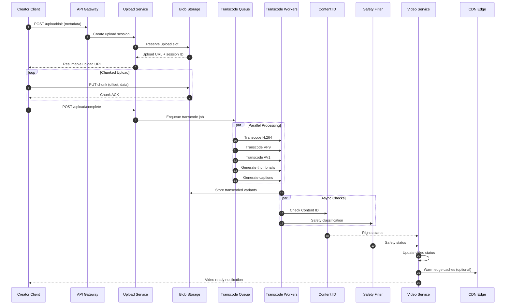
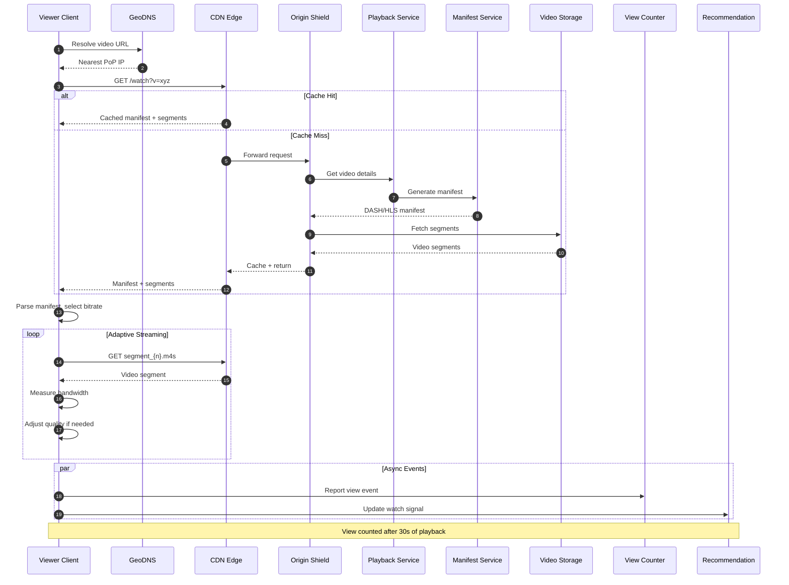
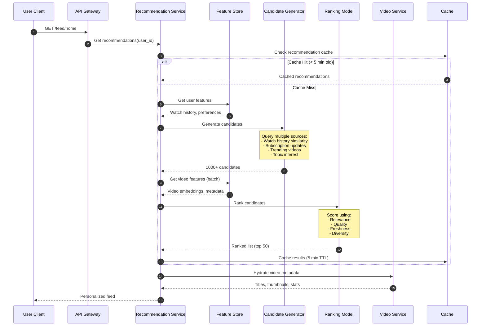
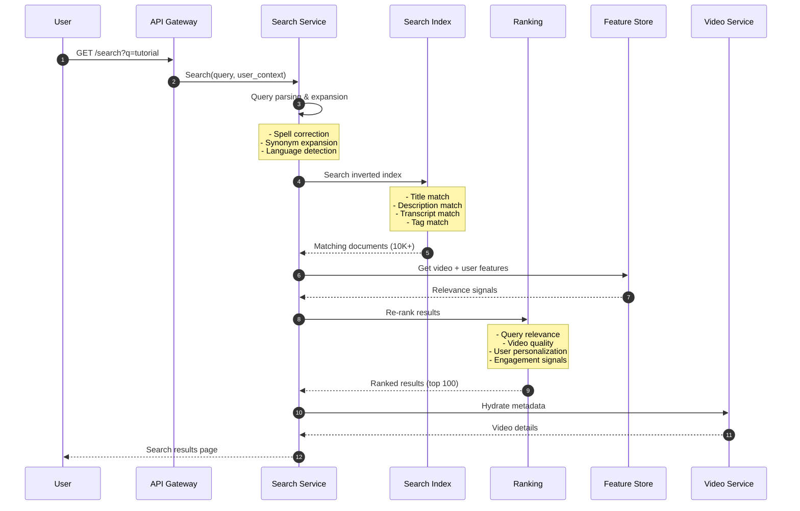
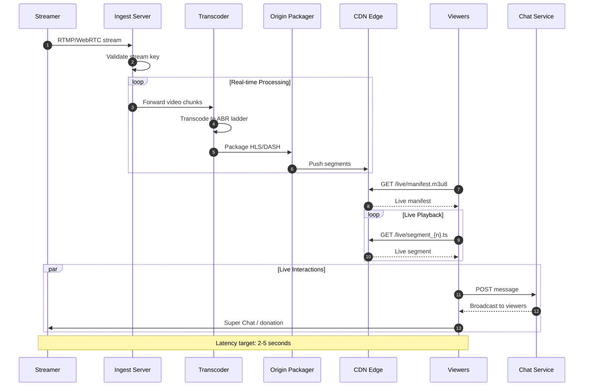
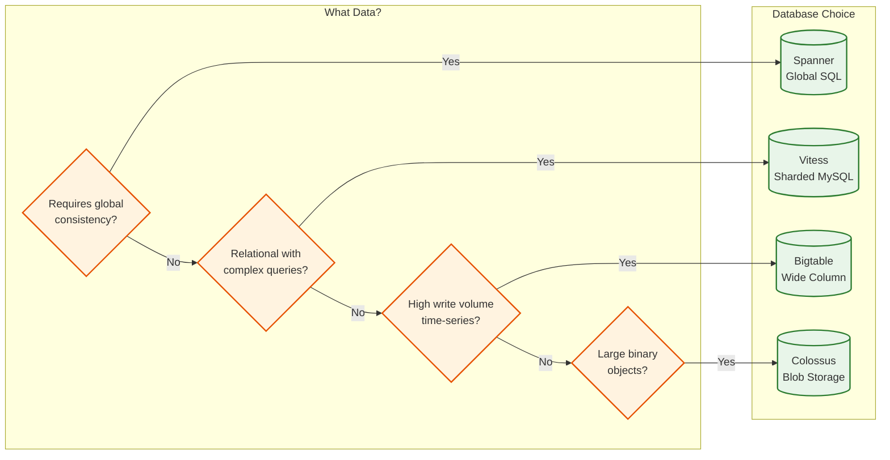
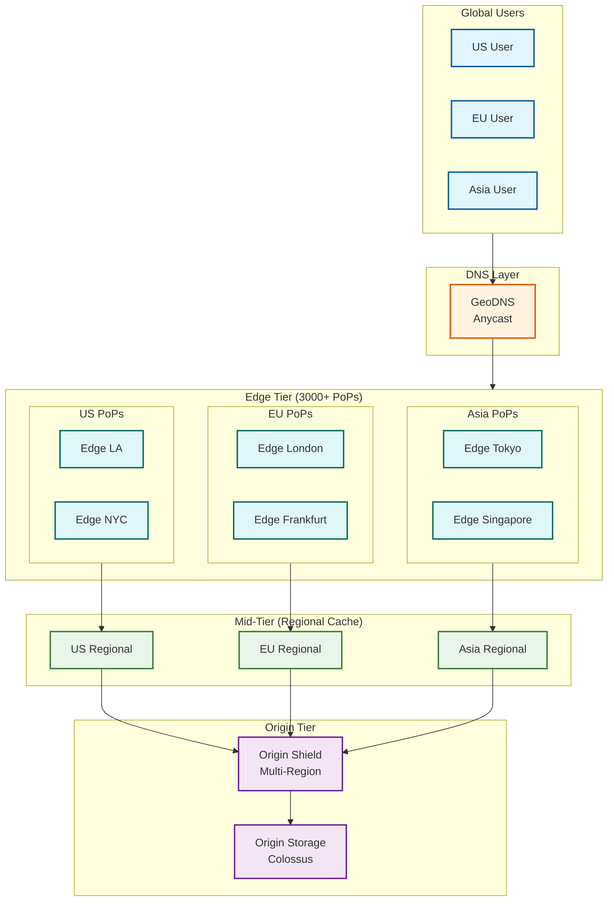
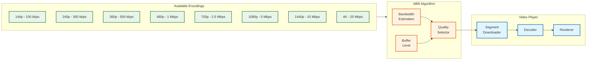

# YouTube: High-Level Design

[← Back to Index](./00-index.md) | [Previous: Requirements](./01-requirements-and-estimations.md) | [Next: Low-Level Design →](./03-low-level-design.md)

---

## System Architecture

```mermaid
flowchart TB
    subgraph Clients["Client Layer"]
        direction LR
        WEB[Web Browser]
        IOS[iOS App]
        ANDROID[Android App]
        TV[Smart TV]
        CONSOLE[Gaming Console]
        EMBED[Embedded Player]
    end

    subgraph Edge["Edge Layer - Google Media CDN (3000+ PoPs)"]
        direction TB
        GEODNS[GeoDNS Router]

        subgraph POP1["PoP - Region A"]
            EDGE1[Edge Cache]
            QUIC1[QUIC Termination]
        end

        subgraph POP2["PoP - Region B"]
            EDGE2[Edge Cache]
            QUIC2[QUIC Termination]
        end

        ORIGIN_SHIELD[Origin Shield]
    end

    subgraph Gateway["API Gateway Layer"]
        GLB[Global Load Balancer<br/>Maglev]
        GFE[Google Front End]
        AUTH[Authentication<br/>OAuth 2.0]
        RATE[Rate Limiter]
        ROUTER[Service Router]
    end

    subgraph VideoServices["Video Services"]
        UPLOAD[Upload Service]
        PLAYBACK[Playback Service]
        MANIFEST[Manifest Generator]
        DRM[DRM Service]
    end

    subgraph DiscoveryServices["Discovery Services"]
        SEARCH[Search Service]
        REC[Recommendation<br/>Service]
        TRENDING[Trending Service]
        BROWSE[Browse Service]
    end

    subgraph SocialServices["Social Services"]
        COMMENT[Comments Service]
        ENGAGE[Engagement Service<br/>Likes/Dislikes]
        SUB[Subscription Service]
        NOTIFY[Notification Service]
    end

    subgraph CreatorServices["Creator Services"]
        CHANNEL[Channel Service]
        ANALYTICS[Analytics Service]
        STUDIO[Creator Studio API]
        MONETIZE[Monetization Service]
    end

    subgraph Processing["Media Processing Pipeline"]
        INGEST[Ingest Worker]
        CHUNK[Chunker]

        subgraph Transcode["Transcoding Farm"]
            H264[H.264 Encoder]
            VP9[VP9 Encoder]
            AV1[AV1 Encoder]
        end

        THUMB[Thumbnail<br/>Generator]
        CAPTION[Caption<br/>Generator]
        CONTENT_ID[Content ID<br/>Matcher]
        SAFETY[Safety<br/>Classifier]
    end

    subgraph ML["ML/AI Platform"]
        RANK[Ranking Model]
        EMBED[Embedding Service]
        FEATURE[Feature Store]
        QUALITY[Quality Scorer]
        MODERATION[Content Moderator]
    end

    subgraph Analytics["Analytics Pipeline"]
        COLLECTOR[Event Collector]
        STREAM[Stream Processor<br/>Dataflow]
        BATCH[Batch Processor<br/>MapReduce]
        VIEWCOUNT[View Counter]
    end

    subgraph Storage["Data Layer"]
        subgraph VideoStorage["Video Storage"]
            BLOB[(Colossus<br/>Video Files)]
            THUMB_STORE[(Thumbnails)]
        end

        subgraph Metadata["Metadata (Vitess)"]
            VIDEO_META[(Video Metadata)]
            USER_DB[(User Data)]
            CHANNEL_DB[(Channel Data)]
        end

        subgraph GlobalDB["Global (Spanner)"]
            RIGHTS[(Content ID<br/>Rights DB)]
            BILLING[(Billing/Ads)]
        end

        subgraph NoSQL["NoSQL (Bigtable)"]
            HISTORY[(Watch History)]
            EVENTS[(Event Store)]
            COMMENTS_DB[(Comments)]
        end

        subgraph Cache["Cache Layer"]
            MEMCACHE[Memcached<br/>Metadata Cache]
            REDIS[Redis<br/>Session/Counters]
        end
    end

    subgraph Queue["Message Queues (Pub/Sub)"]
        TRANSCODE_Q[Transcode Queue]
        ANALYTICS_Q[Analytics Queue]
        NOTIFY_Q[Notification Queue]
        MODERATION_Q[Moderation Queue]
    end

    Clients --> GEODNS
    GEODNS --> POP1 & POP2
    POP1 & POP2 --> ORIGIN_SHIELD
    ORIGIN_SHIELD --> GLB

    GLB --> GFE
    GFE --> AUTH --> RATE --> ROUTER

    ROUTER --> VideoServices
    ROUTER --> DiscoveryServices
    ROUTER --> SocialServices
    ROUTER --> CreatorServices

    UPLOAD --> INGEST
    INGEST --> CHUNK --> Transcode
    Transcode --> THUMB & CAPTION & CONTENT_ID & SAFETY

    DiscoveryServices --> ML
    Processing --> Queue
    Analytics --> Queue

    VideoServices --> Storage
    SocialServices --> Storage
    ML --> Storage
    Analytics --> Storage

    classDef client fill:#e1f5fe,stroke:#01579b,stroke-width:2px
    classDef edge fill:#e0f7fa,stroke:#00695c,stroke-width:2px
    classDef gateway fill:#fff3e0,stroke:#e65100,stroke-width:2px
    classDef video fill:#e8f5e9,stroke:#2e7d32,stroke-width:2px
    classDef discovery fill:#fff8e1,stroke:#ff8f00,stroke-width:2px
    classDef social fill:#fce4ec,stroke:#c2185b,stroke-width:2px
    classDef creator fill:#e8eaf6,stroke:#3f51b5,stroke-width:2px
    classDef processing fill:#f3e5f5,stroke:#6a1b9a,stroke-width:2px
    classDef ml fill:#ffebee,stroke:#c62828,stroke-width:2px
    classDef analytics fill:#e0f2f1,stroke:#00695c,stroke-width:2px
    classDef storage fill:#efebe9,stroke:#4e342e,stroke-width:2px
    classDef queue fill:#fafafa,stroke:#616161,stroke-width:2px

    class WEB,IOS,ANDROID,TV,CONSOLE,EMBED client
    class GEODNS,EDGE1,EDGE2,QUIC1,QUIC2,ORIGIN_SHIELD,POP1,POP2 edge
    class GLB,GFE,AUTH,RATE,ROUTER gateway
    class UPLOAD,PLAYBACK,MANIFEST,DRM video
    class SEARCH,REC,TRENDING,BROWSE discovery
    class COMMENT,ENGAGE,SUB,NOTIFY social
    class CHANNEL,ANALYTICS,STUDIO,MONETIZE creator
    class INGEST,CHUNK,H264,VP9,AV1,THUMB,CAPTION,CONTENT_ID,SAFETY processing
    class RANK,EMBED,FEATURE,QUALITY,MODERATION ml
    class COLLECTOR,STREAM,BATCH,VIEWCOUNT analytics
    class BLOB,THUMB_STORE,VIDEO_META,USER_DB,CHANNEL_DB,RIGHTS,BILLING,HISTORY,EVENTS,COMMENTS_DB,MEMCACHE,REDIS storage
    class TRANSCODE_Q,ANALYTICS_Q,NOTIFY_Q,MODERATION_Q queue
```

---

## Key Data Flows

### 1. Video Upload Flow

### 2. Video Playback Flow

### 3. Recommendation Generation Flow

### 4. Search Query Flow

### 5. Live Streaming Flow

---

## Key Architectural Decisions

### Architecture Style

| Decision | Choice | Rationale |
|----------|--------|-----------|
| **Overall Architecture** | Microservices | Independent scaling, team ownership, fault isolation |
| **Service Communication** | gRPC (internal), REST (external) | Performance + developer experience |
| **Data Architecture** | Polyglot Persistence | Right tool for each data type |
| **Processing Model** | Event-driven + Request-response | Async for heavy tasks, sync for real-time |

### Sync vs Async Communication

| Flow | Pattern | Reason |
|------|---------|--------|
| Video Upload | Async (Queue) | Long-running, can be processed offline |
| Video Playback | Sync (Request-Response) | Real-time user experience |
| Transcoding | Async (Queue) | Parallel processing, decoupled |
| Recommendations | Sync (cached) | Sub-50ms latency requirement |
| View Counting | Async (Event stream) | High volume, eventual consistency |
| Comments | Sync write, Async propagation | Immediate feedback, background moderation |
| Notifications | Async (Queue) | Can tolerate delay |
| Search | Sync | Real-time results expected |

### Database Selection

| Data Type | Database | Justification |
|-----------|----------|---------------|
| Video Metadata | Vitess (MySQL) | Relational queries, creator edits, flexible schema |
| User/Channel Data | Vitess (MySQL) | ACID for user operations, complex joins |
| Content ID / Rights | Spanner | Global consistency for legal/copyright |
| Billing / Ads | Spanner | Financial transactions require strong consistency |
| Watch History | Bigtable | High write volume, time-series, analytics |
| View Events | Bigtable | Billions/day, write-heavy, eventual consistency |
| Comments | Bigtable | High volume, time-ordered, sharded by video |
| Video Files | Colossus (GFS) | Large blobs, distributed storage |
| Thumbnails | Colossus | Image storage with CDN integration |
| ML Features | Bigtable + Feature Store | Low-latency feature serving |

### Caching Strategy

| Layer | Technology | What's Cached | TTL | Hit Rate |
|-------|------------|---------------|-----|----------|
| **L1 - Client** | Browser/App cache | Static assets, thumbnails | 24h | 70% |
| **L2 - CDN Edge** | Google Media CDN | Video segments, manifests | 1-24h | 98% |
| **L3 - Origin Shield** | Regional cache | Less popular content | 1h | 85% |
| **L4 - Application** | Memcached | Video metadata, user data | 5-15m | 95% |
| **L5 - Database** | MySQL buffer pool | Hot rows, indexes | N/A | 99% |
| **ML Cache** | Redis | Recommendations, features | 5m | 80% |

### Message Queue Usage

| Use Case | Pattern | Technology | Throughput |
|----------|---------|------------|------------|
| Transcoding Jobs | Work Queue | Pub/Sub | 100K/sec |
| View Events | Event Stream | Pub/Sub → Dataflow | 1M/sec |
| Notifications | Fan-out | Pub/Sub | 500K/sec |
| Comment Moderation | Work Queue | Pub/Sub | 100K/sec |
| Analytics Events | Event Stream | Pub/Sub → BigQuery | 10M/sec |
| Search Index Updates | Event Stream | Pub/Sub → Indexer | 50K/sec |

---

## CDN Architecture Deep Dive

### CDN Design Decisions

| Aspect | Decision | Rationale |
|--------|----------|-----------|
| **Protocol** | QUIC (HTTP/3) | Lower latency, better mobile performance |
| **TLS** | TLS 1.3 | Faster handshake, improved security |
| **Congestion Control** | BBR | Better throughput on lossy networks |
| **Cache Key** | URL + resolution + codec | Serve correct variant |
| **Cache Hierarchy** | 3-tier (Edge → Regional → Origin) | Balance hit rate vs latency |
| **ISP Peering** | Direct peering + GGC appliances | Reduce transit costs, improve latency |

---

## Streaming Protocol Architecture

### Adaptive Bitrate Streaming

### Protocol Comparison

| Protocol | Use Case | Segment Duration | Latency |
|----------|----------|------------------|---------|
| **DASH** | Desktop, Smart TV | 2-6 seconds | 10-30s |
| **HLS** | iOS, Safari | 2-6 seconds | 10-30s |
| **LL-HLS** | Low-latency live | 0.5-1 second | 2-5s |
| **CMAF** | Unified (DASH+HLS) | 2-6 seconds | 10-30s |
| **WebRTC** | Ultra-low latency | N/A (real-time) | <1s |

---

## Architecture Pattern Checklist

- [x] **Sync vs Async**: Async for uploads/transcoding, sync for playback
- [x] **Event-driven vs Request-response**: Event-driven analytics, request-response API
- [x] **Push vs Pull**: Pull for video segments, push for notifications
- [x] **Stateless vs Stateful**: Stateless services, stateful storage
- [x] **Read-heavy optimization**: Aggressive caching, CDN, read replicas
- [x] **Real-time vs Batch**: Real-time playback, batch analytics
- [x] **Edge vs Origin**: Edge-heavy for video delivery

---

*[← Previous: Requirements](./01-requirements-and-estimations.md) | [Next: Low-Level Design →](./03-low-level-design.md)*
