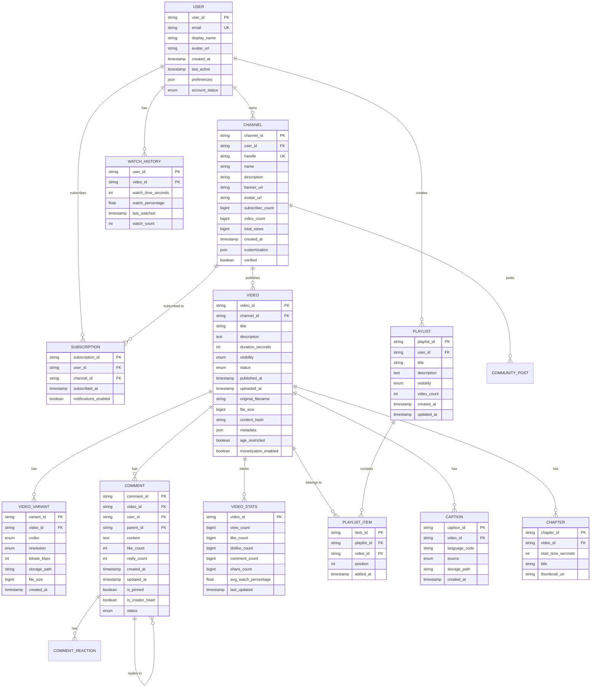

# YouTube: Low-Level Design

[← Back to Index](./00-index.md) | [Previous: High-Level Design](./02-high-level-design.md) | [Next: Deep Dive →](./04-deep-dive-and-bottlenecks.md)

---

## Data Model

### Entity Relationship Diagram



---

## Database Schema Design

### Video Metadata (Vitess/MySQL)

```sql
-- Video table (sharded by channel_id for creator locality)
CREATE TABLE videos (
    video_id        VARCHAR(11) PRIMARY KEY,  -- Base64 encoded
    channel_id      VARCHAR(24) NOT NULL,
    title           VARCHAR(100) NOT NULL,
    description     TEXT,
    duration_ms     INT UNSIGNED NOT NULL,
    visibility      ENUM('public', 'unlisted', 'private', 'scheduled') DEFAULT 'private',
    status          ENUM('processing', 'ready', 'failed', 'blocked') DEFAULT 'processing',
    published_at    TIMESTAMP NULL,
    uploaded_at     TIMESTAMP DEFAULT CURRENT_TIMESTAMP,
    original_size   BIGINT UNSIGNED,
    content_hash    CHAR(64),  -- SHA-256
    category_id     SMALLINT,
    default_language VARCHAR(5),
    is_live         BOOLEAN DEFAULT FALSE,
    is_short        BOOLEAN DEFAULT FALSE,
    age_restricted  BOOLEAN DEFAULT FALSE,

    INDEX idx_channel_published (channel_id, published_at DESC),
    INDEX idx_status (status),
    INDEX idx_category_published (category_id, published_at DESC)
) ENGINE=InnoDB;

-- Video variants (transcoded versions)
CREATE TABLE video_variants (
    variant_id      BIGINT AUTO_INCREMENT PRIMARY KEY,
    video_id        VARCHAR(11) NOT NULL,
    codec           ENUM('h264', 'vp9', 'av1') NOT NULL,
    resolution      ENUM('144p', '240p', '360p', '480p', '720p', '1080p', '1440p', '2160p', '4320p'),
    bitrate_kbps    INT UNSIGNED NOT NULL,
    storage_path    VARCHAR(255) NOT NULL,
    file_size       BIGINT UNSIGNED NOT NULL,
    segment_count   INT UNSIGNED,
    created_at      TIMESTAMP DEFAULT CURRENT_TIMESTAMP,

    INDEX idx_video_codec (video_id, codec),
    UNIQUE KEY uk_video_variant (video_id, codec, resolution)
) ENGINE=InnoDB;

-- Channels table
CREATE TABLE channels (
    channel_id          VARCHAR(24) PRIMARY KEY,
    user_id             VARCHAR(24) NOT NULL,
    handle              VARCHAR(30) UNIQUE,
    name                VARCHAR(100) NOT NULL,
    description         TEXT,
    subscriber_count    BIGINT UNSIGNED DEFAULT 0,
    video_count         INT UNSIGNED DEFAULT 0,
    total_views         BIGINT UNSIGNED DEFAULT 0,
    created_at          TIMESTAMP DEFAULT CURRENT_TIMESTAMP,
    verified            BOOLEAN DEFAULT FALSE,
    country             CHAR(2),

    INDEX idx_user (user_id),
    INDEX idx_subscribers (subscriber_count DESC)
) ENGINE=InnoDB;
```

### Comments (Bigtable Schema)

```
Row Key Design: {video_id}#{timestamp_desc}#{comment_id}

Column Families:
- cf:content     - Comment text, edited versions
- cf:metadata    - Author, timestamps, flags
- cf:engagement  - Like count, reply count
- cf:moderation  - Status, flags, review history

Example Row:
Row Key: "dQw4w9WgXcQ#9999999999999#cmt_abc123"
cf:content:text = "Great video!"
cf:content:edited = false
cf:metadata:author_id = "user_xyz"
cf:metadata:created_at = 1706800000
cf:metadata:parent_id = null
cf:engagement:likes = 42
cf:engagement:replies = 5
cf:moderation:status = "approved"
```

### Watch History (Bigtable Schema)

```
Row Key Design: {user_id}#{date}#{video_id}

Column Families:
- cf:progress   - Watch time, percentage
- cf:context    - Device, location, referrer
- cf:engagement - Liked, commented, shared

Example Row:
Row Key: "user_123#20260201#dQw4w9WgXcQ"
cf:progress:watch_time_ms = 180000
cf:progress:percentage = 75.5
cf:progress:completed = false
cf:context:device = "mobile_android"
cf:context:quality = "1080p"
cf:engagement:liked = true
```

### Content ID / Rights (Spanner Schema)

```sql
-- Global table with strong consistency
CREATE TABLE content_rights (
    content_id      STRING(36) NOT NULL,
    owner_id        STRING(24) NOT NULL,
    fingerprint     BYTES(MAX) NOT NULL,  -- Audio/video fingerprint
    claim_policy    STRING(20),  -- 'block', 'monetize', 'track'
    territories     ARRAY<STRING(2)>,  -- Country codes
    valid_from      TIMESTAMP,
    valid_until     TIMESTAMP,
    created_at      TIMESTAMP NOT NULL OPTIONS (allow_commit_timestamp=true),

    PRIMARY KEY (content_id)
) PRIMARY KEY (content_id);

CREATE TABLE content_claims (
    claim_id        STRING(36) NOT NULL,
    video_id        STRING(11) NOT NULL,
    content_id      STRING(36) NOT NULL,
    match_start_ms  INT64,
    match_end_ms    INT64,
    match_score     FLOAT64,
    status          STRING(20),  -- 'active', 'disputed', 'released'
    created_at      TIMESTAMP NOT NULL OPTIONS (allow_commit_timestamp=true),

    PRIMARY KEY (claim_id)
) PRIMARY KEY (claim_id),
  INTERLEAVE IN PARENT content_rights ON DELETE CASCADE;
```

---

## API Design

### Video Upload API

```yaml
# Initialize resumable upload
POST /api/v3/videos/upload
Authorization: Bearer {access_token}
Content-Type: application/json

Request:
{
  "snippet": {
    "title": "My Video Title",
    "description": "Video description...",
    "categoryId": "22",
    "tags": ["tutorial", "coding"],
    "defaultLanguage": "en"
  },
  "status": {
    "privacyStatus": "private",
    "publishAt": "2026-02-01T12:00:00Z",
    "selfDeclaredMadeForKids": false
  }
}

Response: 200 OK
{
  "uploadUrl": "https://upload.youtube.com/upload/v3/videos?uploadType=resumable&upload_id=xyz123",
  "videoId": "dQw4w9WgXcQ",
  "expiresAt": "2026-02-02T00:00:00Z"
}

# Upload video chunks
PUT {uploadUrl}
Content-Range: bytes {start}-{end}/{total}
Content-Type: video/mp4

Response: 308 Resume Incomplete (partial upload)
Response: 200 OK (complete)
{
  "videoId": "dQw4w9WgXcQ",
  "status": "processing",
  "processingProgress": {
    "partsProcessed": 0,
    "partsTotal": 100
  }
}
```

### Video Playback API

```yaml
# Get video player info
GET /api/v3/videos/{video_id}/player
Authorization: Bearer {access_token}  # Optional

Response: 200 OK
{
  "videoId": "dQw4w9WgXcQ",
  "title": "Video Title",
  "duration": 212,
  "formats": [
    {
      "itag": 137,
      "mimeType": "video/mp4; codecs=\"avc1.640028\"",
      "qualityLabel": "1080p",
      "bitrate": 4500000,
      "width": 1920,
      "height": 1080
    },
    {
      "itag": 248,
      "mimeType": "video/webm; codecs=\"vp9\"",
      "qualityLabel": "1080p",
      "bitrate": 2500000,
      "width": 1920,
      "height": 1080
    }
  ],
  "adaptiveFormats": [...],
  "dashManifestUrl": "https://manifest.youtube.com/api/manifest/dash/...",
  "hlsManifestUrl": "https://manifest.youtube.com/api/manifest/hls/..."
}

# Stream manifest (DASH)
GET /api/manifest/dash/{video_id}
Accept: application/dash+xml

Response: 200 OK
Content-Type: application/dash+xml
<?xml version="1.0"?>
<MPD xmlns="urn:mpeg:dash:schema:mpd:2011"
     type="static"
     mediaPresentationDuration="PT3M32S">
  <Period>
    <AdaptationSet mimeType="video/mp4" codecs="avc1.640028">
      <Representation id="1080p" bandwidth="4500000" width="1920" height="1080">
        <SegmentTemplate media="seg_$Number$.m4s" initialization="init.m4s"/>
      </Representation>
      <Representation id="720p" bandwidth="2500000" width="1280" height="720">
        <SegmentTemplate media="seg_$Number$.m4s" initialization="init.m4s"/>
      </Representation>
    </AdaptationSet>
  </Period>
</MPD>
```

### Search API

```yaml
GET /api/v3/search
Authorization: Bearer {access_token}  # Optional

Query Parameters:
- q: string (required) - Search query
- type: string - "video", "channel", "playlist"
- order: string - "relevance", "date", "viewCount", "rating"
- maxResults: int - 1-50, default 25
- pageToken: string - Pagination token
- publishedAfter: datetime
- publishedBefore: datetime
- duration: string - "short", "medium", "long"
- definition: string - "hd", "sd"

Response: 200 OK
{
  "kind": "youtube#searchListResponse",
  "nextPageToken": "CAUQAA",
  "pageInfo": {
    "totalResults": 1000000,
    "resultsPerPage": 25
  },
  "items": [
    {
      "kind": "youtube#searchResult",
      "id": {
        "kind": "youtube#video",
        "videoId": "dQw4w9WgXcQ"
      },
      "snippet": {
        "publishedAt": "2009-10-25T06:57:33Z",
        "channelId": "UCuAXFkgsw1L7xaCfnd5JJOw",
        "title": "Rick Astley - Never Gonna Give You Up",
        "description": "...",
        "thumbnails": {
          "default": {"url": "...", "width": 120, "height": 90},
          "medium": {"url": "...", "width": 320, "height": 180},
          "high": {"url": "...", "width": 480, "height": 360}
        },
        "channelTitle": "Rick Astley",
        "liveBroadcastContent": "none"
      }
    }
  ]
}
```

### Comments API

```yaml
# List comments
GET /api/v3/commentThreads
Query Parameters:
- videoId: string (required)
- order: string - "time", "relevance"
- maxResults: int - 1-100
- pageToken: string

Response: 200 OK
{
  "items": [
    {
      "id": "comment_thread_id",
      "snippet": {
        "videoId": "dQw4w9WgXcQ",
        "topLevelComment": {
          "id": "comment_id",
          "snippet": {
            "textDisplay": "Great video!",
            "authorDisplayName": "User Name",
            "authorProfileImageUrl": "...",
            "likeCount": 42,
            "publishedAt": "2026-01-15T10:00:00Z"
          }
        },
        "totalReplyCount": 5
      },
      "replies": {...}
    }
  ]
}

# Post comment
POST /api/v3/commentThreads
Authorization: Bearer {access_token}
{
  "snippet": {
    "videoId": "dQw4w9WgXcQ",
    "topLevelComment": {
      "snippet": {
        "textOriginal": "This is my comment"
      }
    }
  }
}

Response: 201 Created
```

### Recommendation API (Internal)

```yaml
# Get personalized recommendations
GET /internal/v1/recommendations
Headers:
  X-User-ID: user_123
  X-Device-Type: mobile
  X-Context: home_feed

Query Parameters:
- limit: int - Number of recommendations
- exclude: string[] - Video IDs to exclude
- continuation: string - Pagination token

Response: 200 OK
{
  "recommendations": [
    {
      "videoId": "abc123",
      "score": 0.95,
      "reason": "similar_to_watched",
      "position": 1,
      "metadata": {
        "title": "Video Title",
        "channelName": "Channel",
        "views": 1000000,
        "duration": 600,
        "thumbnailUrl": "..."
      }
    }
  ],
  "continuation": "...",
  "modelVersion": "rec_v3.2.1"
}
```

---

## Core Algorithms

### Video ID Generation

YouTube uses 11-character Base64 IDs for videos:

```
ALGORITHM: YouTubeVideoIDGeneration

CONSTANTS:
    ALPHABET = "ABCDEFGHIJKLMNOPQRSTUVWXYZabcdefghijklmnopqrstuvwxyz0123456789-_"
    ID_LENGTH = 11
    BITS_PER_CHAR = 6
    TOTAL_BITS = 64  // Fits in 11 chars (66 bits available, 64 used)

FUNCTION generate_video_id():
    // Snowflake-style ID generation
    timestamp_ms = current_time_milliseconds()
    datacenter_id = get_datacenter_id()  // 5 bits
    machine_id = get_machine_id()        // 5 bits
    sequence = get_sequence_number()      // 12 bits

    // Compose 64-bit ID
    // | 41 bits timestamp | 5 bits DC | 5 bits machine | 12 bits sequence |
    id_64bit = (timestamp_ms << 22) | (datacenter_id << 17) | (machine_id << 12) | sequence

    // Encode to Base64
    video_id = ""
    FOR i = 0 TO ID_LENGTH - 1:
        index = (id_64bit >> (BITS_PER_CHAR * (ID_LENGTH - 1 - i))) & 0x3F
        video_id = video_id + ALPHABET[index]

    RETURN video_id

PROPERTIES:
    - Unique across all datacenters
    - Time-sortable (newer videos have lexicographically larger IDs)
    - URL-safe (no special characters)
    - 64^11 ≈ 7.4 × 10^19 possible IDs
```

### Adaptive Bitrate Selection

```
ALGORITHM: ABRQualitySelector

STATE:
    buffer_level: float          // Seconds of video buffered
    bandwidth_estimate: float    // Current estimated bandwidth (bps)
    bandwidth_history: Queue     // Recent bandwidth measurements
    current_quality: int         // Current quality level index
    available_qualities: List    // Sorted list of available bitrates

CONSTANTS:
    BUFFER_LOW = 5.0            // Seconds
    BUFFER_HIGH = 30.0          // Seconds
    BUFFER_TARGET = 15.0        // Seconds
    BANDWIDTH_SAFETY = 0.8      // Conservative estimate multiplier
    QUALITY_SWITCH_DELAY = 2    // Minimum segments between switches

FUNCTION select_quality(segment_download_time, segment_size):
    // Update bandwidth estimate (exponential moving average)
    measured_bandwidth = segment_size / segment_download_time
    bandwidth_history.enqueue(measured_bandwidth)
    IF bandwidth_history.size > 5:
        bandwidth_history.dequeue()

    bandwidth_estimate = calculate_ewma(bandwidth_history, alpha=0.3)
    safe_bandwidth = bandwidth_estimate * BANDWIDTH_SAFETY

    // Determine target quality based on buffer state
    IF buffer_level < BUFFER_LOW:
        // Low buffer: be conservative, drop quality quickly
        target_quality = find_max_quality_below(safe_bandwidth * 0.7)
    ELSE IF buffer_level > BUFFER_HIGH:
        // High buffer: can try higher quality
        target_quality = find_max_quality_below(safe_bandwidth * 1.2)
    ELSE:
        // Normal: match bandwidth
        target_quality = find_max_quality_below(safe_bandwidth)

    // Prevent oscillation
    IF abs(target_quality - current_quality) == 1:
        IF time_since_last_switch < QUALITY_SWITCH_DELAY:
            RETURN current_quality

    // Allow quality increase only if buffer is healthy
    IF target_quality > current_quality:
        IF buffer_level < BUFFER_TARGET:
            RETURN current_quality

    current_quality = target_quality
    RETURN current_quality

FUNCTION find_max_quality_below(max_bitrate):
    FOR i = len(available_qualities) - 1 DOWNTO 0:
        IF available_qualities[i].bitrate <= max_bitrate:
            RETURN i
    RETURN 0  // Lowest quality as fallback
```

### View Count with Anti-Fraud

```
ALGORITHM: DistributedViewCounter

COMPONENTS:
    event_queue: MessageQueue           // Incoming view events
    fraud_detector: MLModel             // Fraud classification model
    view_store: Bigtable                // Persistent view counts
    count_cache: Redis                  // Real-time count cache
    batch_aggregator: StreamProcessor   // Batch view processing

FUNCTION process_view_event(event):
    // Step 1: Initial validation
    IF NOT validate_event(event):
        RETURN INVALID

    // Step 2: Fraud detection (async, non-blocking)
    fraud_score = fraud_detector.score(event)
    IF fraud_score > FRAUD_THRESHOLD:
        log_suspicious_view(event)
        RETURN FRAUD_DETECTED

    // Step 3: Deduplication (within time window)
    dedup_key = hash(event.user_id + event.video_id + event.session_id)
    IF count_cache.exists(dedup_key):
        RETURN DUPLICATE
    count_cache.set(dedup_key, 1, ttl=30_MINUTES)

    // Step 4: Increment distributed counter
    shard_key = consistent_hash(event.video_id)
    count_cache.incr("view:" + event.video_id + ":" + shard_key)

    // Step 5: Async persistence
    event_queue.publish("views", event)

    RETURN SUCCESS

FUNCTION validate_event(event):
    // Basic validation
    IF event.watch_time < 30_SECONDS:
        RETURN FALSE  // Must watch at least 30s
    IF event.timestamp > current_time():
        RETURN FALSE  // Future timestamp
    IF NOT valid_video_id(event.video_id):
        RETURN FALSE
    RETURN TRUE

FUNCTION fraud_detector.score(event):
    features = extract_features(event)
    // Features include:
    // - IP reputation score
    // - Device fingerprint consistency
    // - Watch pattern (seeking behavior)
    // - Geographic anomaly
    // - Request timing patterns
    // - Account age and history

    RETURN ml_model.predict(features)

FUNCTION aggregate_view_counts():
    // Runs periodically (every minute)
    FOR each shard IN get_all_shards():
        local_counts = count_cache.get_all("view:*:" + shard)
        FOR video_id, count IN local_counts:
            view_store.increment(video_id, count)
            count_cache.delete("view:" + video_id + ":" + shard)
```

### Two-Stage Recommendation

```
ALGORITHM: TwoStageRecommendation

STAGE 1 - CANDIDATE GENERATION:

FUNCTION generate_candidates(user_id, context):
    candidates = Set()

    // Source 1: Similar to watch history (collaborative filtering)
    watch_history = get_recent_watches(user_id, limit=100)
    FOR video IN watch_history:
        similar = find_similar_videos(video, limit=50)
        candidates.add_all(similar)

    // Source 2: Subscription updates
    subscriptions = get_subscriptions(user_id)
    FOR channel IN subscriptions:
        recent_videos = get_recent_videos(channel, limit=10)
        candidates.add_all(recent_videos)

    // Source 3: Topic interests
    topics = get_user_topics(user_id)
    FOR topic IN topics:
        trending_in_topic = get_trending(topic, limit=50)
        candidates.add_all(trending_in_topic)

    // Source 4: Global trending (exploration)
    global_trending = get_global_trending(limit=100)
    candidates.add_all(global_trending)

    RETURN candidates  // Typically 1000-5000 candidates

STAGE 2 - RANKING:

FUNCTION rank_candidates(user_id, candidates, context):
    user_features = feature_store.get_user_features(user_id)
    video_features = feature_store.batch_get_video_features(candidates)
    context_features = extract_context_features(context)

    scored_candidates = []
    FOR video IN candidates:
        features = concat(user_features, video_features[video], context_features)

        // Multi-objective scoring
        relevance = relevance_model.predict(features)
        quality = quality_model.predict(features)
        engagement = engagement_model.predict(features)
        freshness = calculate_freshness(video.published_at)

        // Weighted combination
        score = (
            0.4 * relevance +
            0.25 * engagement +
            0.2 * quality +
            0.15 * freshness
        )

        scored_candidates.append((video, score))

    // Sort and apply diversity
    ranked = sort_by_score(scored_candidates)
    diversified = apply_diversity_filter(ranked)

    RETURN diversified[:50]  // Top 50 recommendations

FUNCTION apply_diversity_filter(ranked):
    result = []
    seen_channels = Set()
    seen_topics = Set()

    FOR video, score IN ranked:
        // Avoid too many videos from same channel
        IF video.channel_id IN seen_channels:
            IF count(seen_channels[video.channel_id]) >= 2:
                CONTINUE

        // Ensure topic diversity
        IF video.topic IN seen_topics:
            IF count(seen_topics[video.topic]) >= 5:
                CONTINUE

        result.append((video, score))
        seen_channels.add(video.channel_id)
        seen_topics.add(video.topic)

    RETURN result
```

### Content ID Fingerprinting

```
ALGORITHM: ContentIDMatching

FUNCTION generate_fingerprint(video_file):
    audio_fingerprint = generate_audio_fingerprint(video_file)
    video_fingerprint = generate_video_fingerprint(video_file)

    RETURN {
        "audio": audio_fingerprint,
        "video": video_fingerprint
    }

FUNCTION generate_audio_fingerprint(video_file):
    // Extract audio track
    audio = extract_audio(video_file)

    // Convert to spectrogram
    spectrogram = compute_spectrogram(audio,
        window_size=2048,
        hop_size=512,
        sample_rate=44100)

    // Extract peaks (Shazam-style)
    peaks = find_spectral_peaks(spectrogram)

    // Create hash pairs (constellation map)
    fingerprints = []
    FOR i = 0 TO len(peaks) - 1:
        FOR j = i + 1 TO min(i + 10, len(peaks)):
            hash = create_hash(
                peaks[i].frequency,
                peaks[j].frequency,
                peaks[j].time - peaks[i].time
            )
            fingerprints.append((hash, peaks[i].time))

    RETURN fingerprints

FUNCTION match_content(uploaded_fingerprint):
    matches = []

    // Query fingerprint database
    FOR hash, offset IN uploaded_fingerprint:
        candidates = fingerprint_db.lookup(hash)
        FOR candidate IN candidates:
            matches.append({
                "content_id": candidate.content_id,
                "db_offset": candidate.offset,
                "query_offset": offset
            })

    // Group by content_id and find consistent offset matches
    grouped = group_by(matches, "content_id")

    FOR content_id, match_group IN grouped:
        offsets = [m.db_offset - m.query_offset FOR m IN match_group]
        offset_histogram = build_histogram(offsets, bin_size=0.1)

        best_bin = max(offset_histogram)
        IF best_bin.count >= MATCH_THRESHOLD:
            confidence = best_bin.count / len(uploaded_fingerprint)
            YIELD {
                "content_id": content_id,
                "confidence": confidence,
                "time_offset": best_bin.value
            }
```

---

## Indexing Strategy

### Video Metadata Indexes

| Table | Index | Columns | Purpose |
|-------|-------|---------|---------|
| videos | PRIMARY | video_id | Unique lookup |
| videos | idx_channel_published | channel_id, published_at DESC | Channel video list |
| videos | idx_category_published | category_id, published_at DESC | Category browse |
| videos | idx_status | status | Processing queue |
| video_variants | idx_video_codec | video_id, codec | Variant lookup |
| channels | idx_handle | handle | Handle lookup |
| channels | idx_subscribers | subscriber_count DESC | Trending channels |

### Search Index Design

```
Index Structure (Inverted Index):

Document: Video
Fields:
  - title (text, boosted 2.0)
  - description (text, boosted 1.0)
  - transcript (text, boosted 0.5)
  - tags (keyword, boosted 1.5)
  - channel_name (text, boosted 1.2)
  - category (keyword)

Tokenization:
  - Standard tokenizer (word boundaries)
  - Lowercase filter
  - Synonym expansion
  - Stemming (language-specific)
  - N-gram for autocomplete

Sharding:
  - By video_id hash (64 shards)
  - Replicated 3x for availability

Updates:
  - Near real-time (< 5 min) for new videos
  - Batch updates for metadata changes
```

---

## Partitioning / Sharding Strategy

### Video Storage Sharding

```
Sharding Key: video_id (first 2 characters)

Shard Distribution:
  - 64 shards (00-63 in base64)
  - Each shard: ~12.5 million videos
  - Shard size: ~20 PB average

Routing:
  shard_id = base64_decode(video_id[0:2]) % 64

Benefits:
  - Even distribution (random IDs)
  - No hotspots
  - Easy horizontal scaling
```

### Metadata Sharding (Vitess)

```
Sharding Schemes:

1. Videos Table:
   - Shard key: channel_id
   - Reason: Creator operations are channel-scoped
   - Co-locates channel's videos on same shard

2. Users Table:
   - Shard key: user_id
   - Reason: User operations are user-scoped
   - Even distribution

3. Comments Table:
   - Shard key: video_id
   - Reason: Comments accessed per-video
   - Hot videos may need sub-sharding

4. Subscriptions Table:
   - Shard key: user_id
   - Reason: Subscription lists are per-user
```

### Watch History Sharding (Bigtable)

```
Row Key Design: {user_id}#{reverse_timestamp}#{video_id}

Benefits:
  - User's history co-located
  - Recent history first (reverse timestamp)
  - Efficient range scans

Tablet Splitting:
  - Automatic based on size (100 MB - 1 GB)
  - ~10,000+ tablets for watch history table
```

---

## Data Retention Policy

| Data Type | Hot Storage | Warm Storage | Cold Storage | Delete |
|-----------|-------------|--------------|--------------|--------|
| Video Files | 7 days (edge) | 30 days (regional) | Forever (origin) | Never |
| Video Metadata | Forever | N/A | N/A | On deletion |
| Watch History | 90 days | 1 year | 3 years | After 3 years |
| View Events (Raw) | 7 days | 30 days | 1 year | After 1 year |
| View Events (Aggregated) | Forever | N/A | N/A | Never |
| Comments | Forever | N/A | N/A | On deletion |
| Analytics (Detailed) | 90 days | 1 year | 2 years | After 2 years |
| Audit Logs | 1 year | 3 years | 7 years | After 7 years |

---

*[← Previous: High-Level Design](./02-high-level-design.md) | [Next: Deep Dive →](./04-deep-dive-and-bottlenecks.md)*
