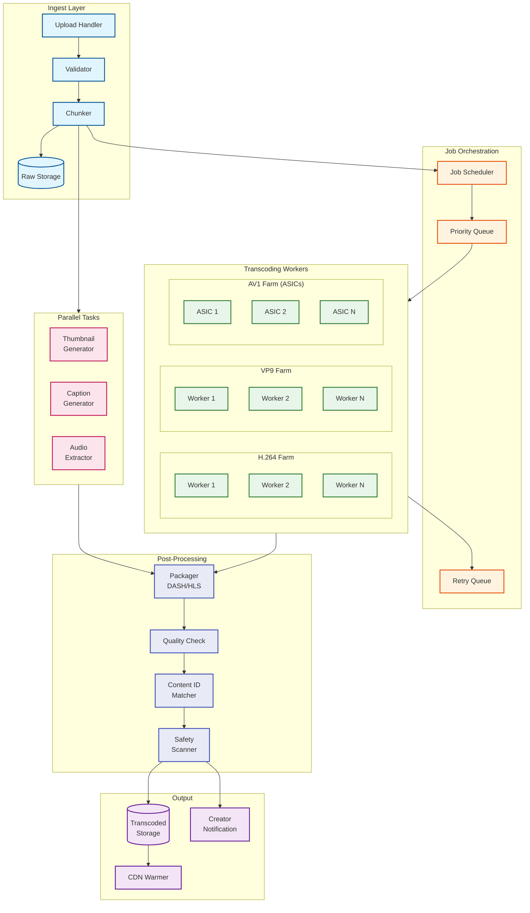
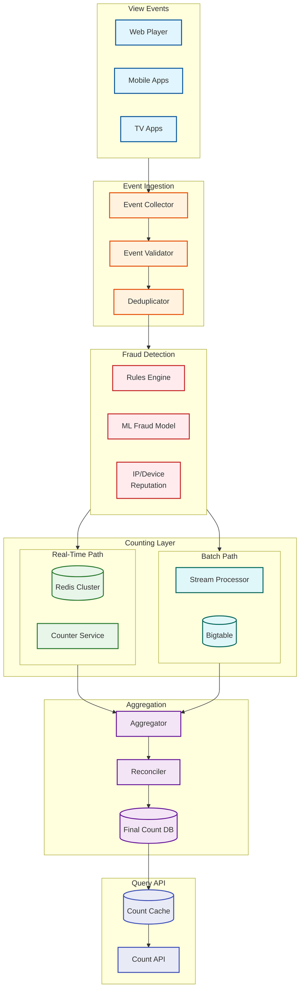

# YouTube: Deep Dive & Bottlenecks

[← Back to Index](./00-index.md) | [Previous: Low-Level Design](./03-low-level-design.md) | [Next: Scalability →](./05-scalability-and-reliability.md)

---

## Critical Component 1: Video Transcoding Pipeline

### Why This Is Critical

The transcoding pipeline is the backbone of YouTube's video delivery system. Every uploaded video must be converted to multiple formats before it can be streamed to viewers. With **500+ hours of video uploaded every minute**, this pipeline must:

- Process millions of transcoding jobs daily
- Generate 20+ variants per video (codecs × resolutions)
- Complete processing fast enough for creator expectations
- Handle failures gracefully without losing uploads
- Optimize for both quality and bandwidth

**If this fails**: Creators cannot publish videos, viewer experience degrades, and storage/bandwidth costs explode.

### Internal Architecture



### Processing Time Breakdown

| Stage | Time (10-min 1080p video) | Bottleneck |
|-------|---------------------------|------------|
| Upload (100 Mbps) | 80 seconds | Network bandwidth |
| Chunking | 5 seconds | I/O throughput |
| H.264 Encode (all res) | 120 seconds | CPU bound |
| VP9 Encode (all res) | 180 seconds | CPU bound (slower codec) |
| AV1 Encode (all res) | 60 seconds | ASIC accelerated |
| Thumbnail Generation | 10 seconds | GPU |
| Caption Generation | 30 seconds | ML inference |
| Content ID Match | 15 seconds | Fingerprint DB lookup |
| Safety Scan | 20 seconds | ML inference |
| Packaging (DASH/HLS) | 10 seconds | I/O |
| **Total (Sequential)** | **~530 seconds** | - |
| **Total (Parallel)** | **~200 seconds** | Encode is longest path |

### Codec Selection Strategy

```
ALGORITHM: CodecPrioritization

INPUT: video_id, view_count_estimate, content_type

FUNCTION select_encoding_priority(video):
    // All videos get H.264 first (maximum compatibility)
    encode_queue = [H264_ALL_RESOLUTIONS]

    // VP9 for better quality/bandwidth trade-off
    IF video.resolution >= 720p:
        encode_queue.append(VP9_HD_RESOLUTIONS)

    // AV1 is expensive - prioritize based on expected views
    IF video.view_estimate > 100,000 OR video.channel.subscriber_count > 1M:
        encode_queue.append(AV1_ALL_RESOLUTIONS)
    ELSE IF video.age > 7_DAYS AND video.view_count > 50,000:
        // Retroactively encode popular videos to AV1
        background_queue.append(AV1_ALL_RESOLUTIONS)

    RETURN encode_queue

CODEC CHARACTERISTICS:
| Codec | Encoding Speed | Quality/Bitrate | Decoder Support |
|-------|---------------|-----------------|-----------------|
| H.264 | Fast (1x)     | Baseline        | 100% devices    |
| VP9   | Medium (0.5x) | 30% better      | 90% devices     |
| AV1   | Slow (0.1x)   | 50% better      | 70% devices     |
```

### Failure Modes & Mitigation

| Failure Mode | Impact | Detection | Mitigation |
|--------------|--------|-----------|------------|
| Worker crash mid-encode | Partial output, job stuck | Heartbeat timeout (30s) | Checkpoint + retry from last segment |
| Corrupt input file | Encode fails | FFmpeg error code | Notify creator, mark video failed |
| Storage full | Cannot write output | Disk space monitor | Auto-scale storage, alert ops |
| Queue backup | Processing delays | Queue depth metric | Auto-scale workers, priority sorting |
| Content ID timeout | Delayed publishing | API latency > 30s | Publish with pending status, async match |
| ASIC hardware failure | AV1 encode fails | Hardware health check | Fallback to CPU, replace ASIC |

### Graceful Degradation

```
ALGORITHM: TranscodingDegradation

FUNCTION handle_backlog(queue_depth, available_workers):
    IF queue_depth > CRITICAL_THRESHOLD:
        // Level 1: Skip lowest priority encodes
        disable_encoding(AV1_LOW_RESOLUTION)
        disable_encoding(VP9_144p, VP9_240p)

    IF queue_depth > SEVERE_THRESHOLD:
        // Level 2: Only essential resolutions
        disable_encoding(AV1_ALL)
        limit_resolutions_to([360p, 720p, 1080p])

    IF queue_depth > EMERGENCY_THRESHOLD:
        // Level 3: H.264 only, limited resolutions
        disable_encoding(VP9_ALL, AV1_ALL)
        limit_resolutions_to([360p, 720p])

    // Always ensure at least one playable variant
    ENSURE minimum_variant(H264_720p OR H264_360p)
```

---

## Critical Component 2: Distributed View Counter

### Why This Is Critical

YouTube counts **billions of views daily**, and these counts directly impact:
- Creator revenue (ads are priced on views)
- Video ranking and recommendations
- Public perception and virality
- Platform integrity (fraud detection)

The system must balance **accuracy vs. availability** and **real-time vs. eventual consistency**.

**If this fails**: Incorrect counts damage creator trust, enable fraud, and break monetization.

### Internal Architecture



### View Counting Rules

```
ALGORITHM: ViewValidation

CONSTANTS:
    MIN_WATCH_TIME = 30 seconds (or video duration if shorter)
    DEDUP_WINDOW = 30 minutes
    MAX_VIEWS_PER_IP_HOUR = 100
    MAX_VIEWS_PER_USER_VIDEO_DAY = 10

FUNCTION validate_view(event):
    // Rule 1: Minimum watch time
    IF event.watch_time < MIN_WATCH_TIME:
        RETURN INVALID("insufficient_watch_time")

    // Rule 2: Duplicate detection (same user, same video, within window)
    dedup_key = hash(event.user_id, event.video_id, event.session_id)
    IF cache.exists(dedup_key):
        RETURN INVALID("duplicate")
    cache.set(dedup_key, ttl=DEDUP_WINDOW)

    // Rule 3: Rate limiting per IP
    ip_count = cache.incr("ip:" + event.ip + ":hour")
    IF ip_count > MAX_VIEWS_PER_IP_HOUR:
        flag_for_review(event)
        RETURN SUSPICIOUS("ip_rate_limit")

    // Rule 4: Per-user per-video daily limit
    user_video_key = event.user_id + ":" + event.video_id + ":" + today()
    user_video_count = cache.incr(user_video_key)
    IF user_video_count > MAX_VIEWS_PER_USER_VIDEO_DAY:
        RETURN VALID_BUT_CAPPED()  // Count but cap contribution

    RETURN VALID()
```

### Fraud Detection Pipeline

```mermaid
flowchart LR
    subgraph Input["View Event"]
        EVENT[Raw Event]
    end

    subgraph Features["Feature Extraction"]
        IP_FEAT[IP Features]
        DEVICE[Device Fingerprint]
        BEHAVIOR[Watch Behavior]
        TEMPORAL[Temporal Patterns]
        GEO[Geographic Data]
    end

    subgraph Models["ML Models"]
        BOT[Bot Detector]
        CLICK_FARM[Click Farm<br/>Detector]
        ANOMALY[Anomaly<br/>Detection]
    end

    subgraph Decision["Decision"]
        SCORE[Risk Score]
        DECISION{Score > 0.8?}
        VALID[Count View]
        REJECT[Reject]
        REVIEW[Manual Review]
    end

    EVENT --> Features
    Features --> Models
    Models --> SCORE

    SCORE --> DECISION
    DECISION -->|No| VALID
    DECISION -->|Yes, > 0.95| REJECT
    DECISION -->|Yes, 0.8-0.95| REVIEW

    classDef input fill:#e1f5fe,stroke:#01579b,stroke-width:2px
    classDef feature fill:#fff3e0,stroke:#e65100,stroke-width:2px
    classDef model fill:#fce4ec,stroke:#c2185b,stroke-width:2px
    classDef decision fill:#e8f5e9,stroke:#2e7d32,stroke-width:2px

    class EVENT input
    class IP_FEAT,DEVICE,BEHAVIOR,TEMPORAL,GEO feature
    class BOT,CLICK_FARM,ANOMALY model
    class SCORE,DECISION,VALID,REJECT,REVIEW decision
```



### Distributed Counter Design

```
ARCHITECTURE: ShardedEventualCounter

DESIGN PRINCIPLES:
1. Partition by video_id for locality
2. Use CRDTs (G-Counter) for conflict-free merging
3. Separate hot path (real-time) from cold path (batch)
4. Accept eventual consistency (2-3 second lag)

SHARD STRUCTURE:
- 1024 logical shards
- Each shard handles ~800K videos
- Shard = video_id_hash % 1024

PER-SHARD STATE:
{
    "video_id": "dQw4w9WgXcQ",
    "counters": {
        "node_1": 12345,
        "node_2": 11234,
        "node_3": 10987
    },
    "total": 34566,  // Sum of all node counters
    "last_synced": 1706800000
}

OPERATIONS:

INCREMENT(video_id):
    shard = route_to_shard(video_id)
    node = get_current_node()
    shard.counters[node] += 1
    // Async sync to other nodes

MERGE(shard_a, shard_b):
    FOR each node IN union(shard_a.nodes, shard_b.nodes):
        merged.counters[node] = max(shard_a.counters[node], shard_b.counters[node])
    merged.total = sum(merged.counters.values())
    RETURN merged

READ(video_id):
    shard = route_to_shard(video_id)
    RETURN shard.total  // Eventually consistent
```

### Failure Modes & Mitigation

| Failure Mode | Impact | Detection | Mitigation |
|--------------|--------|-----------|------------|
| Redis node failure | Temporary count loss | Health check | Failover to replica, replay from queue |
| Counter overflow | Wrong counts | Value monitoring | Use 64-bit counters, sharding |
| Fraud spike (bot attack) | Inflated counts | Anomaly detection | Auto-throttle, manual freeze |
| Network partition | Divergent counts | Split-brain detection | CRDT merge on reconnect |
| Event queue backup | Delayed counts | Queue depth | Auto-scale consumers |
| Dedup cache eviction | Over-counting | Hit rate monitoring | Increase cache size |

---

## Critical Component 3: Recommendation Engine

### Why This Is Critical

Recommendations drive **70% of YouTube watch time**. The engine must:
- Serve personalized results in **< 50ms**
- Process **80+ billion daily signals**
- Balance relevance, quality, diversity, and freshness
- Avoid filter bubbles and harmful content
- Support multiple surfaces (home, watch next, search)

**If this fails**: Engagement drops, creators lose visibility, users leave the platform.

### Internal Architecture



```mermaid
flowchart TB
    subgraph Input["Request Context"]
        USER[User ID]
        CONTEXT[Context<br/>device, time, location]
        HISTORY[Recent Activity]
    end

    subgraph FeatureStore["Feature Store"]
        USER_FEAT[(User Features)]
        VIDEO_FEAT[(Video Features)]
        CONTEXT_FEAT[(Context Features)]
    end

    subgraph CandidateGen["Candidate Generation (Stage 1)"]
        COLLAB[Collaborative<br/>Filtering]
        CONTENT[Content-Based]
        GRAPH[Graph-Based]
        TRENDING[Trending/<br/>Popular]
        SUBS[Subscription<br/>Updates]
    end

    subgraph Ranking["Ranking (Stage 2)"]
        MERGER[Candidate Merger]
        SCORER[Deep Neural<br/>Network Scorer]
        RERANK[Re-Ranker]
    end

    subgraph PostProcess["Post-Processing"]
        DIVERSITY[Diversity<br/>Filter]
        SAFETY[Safety<br/>Filter]
        BUSINESS[Business Rules]
    end

    subgraph Output["Output"]
        CACHE[(Result Cache)]
        RESPONSE[Recommendations]
    end

    Input --> FeatureStore
    FeatureStore --> CandidateGen
    CandidateGen --> MERGER
    MERGER --> SCORER
    FeatureStore --> SCORER
    SCORER --> RERANK
    RERANK --> PostProcess
    PostProcess --> CACHE --> RESPONSE

    classDef input fill:#e1f5fe,stroke:#01579b,stroke-width:2px
    classDef feature fill:#fff3e0,stroke:#e65100,stroke-width:2px
    classDef candidate fill:#e8f5e9,stroke:#2e7d32,stroke-width:2px
    classDef ranking fill:#fce4ec,stroke:#c2185b,stroke-width:2px
    classDef post fill:#e8eaf6,stroke:#3f51b5,stroke-width:2px
    classDef output fill:#f3e5f5,stroke:#6a1b9a,stroke-width:2px

    class USER,CONTEXT,HISTORY input
    class USER_FEAT,VIDEO_FEAT,CONTEXT_FEAT feature
    class COLLAB,CONTENT,GRAPH,TRENDING,SUBS candidate
    class MERGER,SCORER,RERANK ranking
    class DIVERSITY,SAFETY,BUSINESS post
    class CACHE,RESPONSE output
```

### 50ms Latency Budget Breakdown

| Stage | Budget | Operations |
|-------|--------|------------|
| Feature Store Lookup | 10ms | Batch fetch user + context features |
| Candidate Generation | 15ms | 5 sources in parallel, ~5000 candidates |
| Feature Enrichment | 5ms | Batch fetch video features |
| DNN Scoring | 15ms | Score all candidates |
| Re-ranking + Filtering | 5ms | Diversity, safety, business rules |
| **Total** | **50ms** | End-to-end |

### Recommendation Scoring Model

```
ALGORITHM: MultiObjectiveRanking

INPUT: user_features, video_features, context_features
OUTPUT: relevance_score (0.0 to 1.0)

MODEL ARCHITECTURE:
    User Tower:
        - Input: user_id embedding (128-dim)
        - Dense layers: 512 -> 256 -> 128
        - Output: user_representation (128-dim)

    Video Tower:
        - Input: video_id embedding (128-dim) + video_features
        - Dense layers: 512 -> 256 -> 128
        - Output: video_representation (128-dim)

    Interaction Layer:
        - Dot product: user_repr · video_repr
        - Concatenate with context features
        - Dense layers: 256 -> 128 -> 64

    Multi-Head Output:
        - engagement_score: P(click)
        - watch_time_score: E[watch_time]
        - satisfaction_score: P(like | watch)
        - quality_score: Model-assessed quality

SCORING FUNCTION:
    final_score = (
        0.30 * engagement_score +
        0.35 * watch_time_score +
        0.20 * satisfaction_score +
        0.15 * quality_score
    )

FEATURE GROUPS:
    User Features:
        - Watch history (last 100 videos)
        - Subscription list
        - Like/dislike history
        - Search history
        - Demographics (age, country)

    Video Features:
        - Title/description embeddings
        - Category, tags
        - Duration, upload time
        - View count, like ratio
        - Channel features

    Context Features:
        - Time of day, day of week
        - Device type
        - Previous video (for watch next)
        - Search query (if applicable)
```

### Diversity and Exploration

```
ALGORITHM: MMR_Diversity (Maximal Marginal Relevance)

FUNCTION diversify_results(candidates, lambda=0.7):
    selected = []
    remaining = candidates.copy()

    WHILE len(selected) < TARGET_SIZE AND remaining:
        best_score = -infinity
        best_candidate = None

        FOR candidate IN remaining:
            relevance = candidate.score

            // Calculate similarity to already selected items
            max_similarity = 0
            FOR selected_item IN selected:
                similarity = cosine_similarity(
                    candidate.embedding,
                    selected_item.embedding
                )
                max_similarity = max(max_similarity, similarity)

            // MMR score: balance relevance vs. diversity
            mmr_score = lambda * relevance - (1 - lambda) * max_similarity

            IF mmr_score > best_score:
                best_score = mmr_score
                best_candidate = candidate

        selected.append(best_candidate)
        remaining.remove(best_candidate)

    RETURN selected
```

### Failure Modes & Mitigation

| Failure Mode | Impact | Detection | Mitigation |
|--------------|--------|-----------|------------|
| Feature store timeout | No personalization | Latency > 10ms | Fallback to cached features, popular videos |
| Model serving failure | No ranking | Health check, error rate | Fallback to simpler model, trending |
| Cold start (new user) | Poor recommendations | No history detected | Use demographic defaults, explore mode |
| Stale model | Degraded quality | A/B metrics drop | Rollback, retrain |
| Filter bubble | User dissatisfaction | Diversity metrics | Inject exploration, topic rotation |

### Graceful Degradation

```
ALGORITHM: RecommendationFallback

FUNCTION get_recommendations(user_id, context):
    TRY:
        // Full personalization
        features = feature_store.get(user_id, timeout=10ms)
        candidates = generate_candidates(user_id, features)
        ranked = rank_candidates(candidates, features)
        RETURN diversify(ranked)

    CATCH FeatureStoreTimeout:
        // Level 1: Use cached features
        cached_features = local_cache.get(user_id)
        IF cached_features:
            RETURN rank_with_features(cached_features)

        // Level 2: Demographics-based
        demographics = get_demographics(user_id)
        RETURN get_demographic_recommendations(demographics)

    CATCH RankingModelTimeout:
        // Level 3: Simple scoring
        candidates = generate_candidates(user_id)
        RETURN simple_rank(candidates)  // View count, recency

    CATCH CandidateGenTimeout:
        // Level 4: Trending fallback
        RETURN get_trending(context.country, context.category)

    CATCH ALL:
        // Level 5: Static fallback
        RETURN get_global_popular()
```

---

## Bottleneck Analysis

### Top 3 Bottlenecks

| Rank | Bottleneck | Impact | Mitigation Strategy |
|------|------------|--------|---------------------|
| 1 | **CDN Egress Bandwidth** | Cannot serve video at scale | ISP peering, edge caching, codec optimization |
| 2 | **Transcoding Throughput** | Upload delays, creator frustration | Custom ASICs, parallel processing, priority queues |
| 3 | **Feature Store Latency** | Slow recommendations | In-memory caching, pre-computation, edge deployment |

### CDN Bandwidth Mitigation

```
STRATEGY: BandwidthOptimization

1. CODEC EFFICIENCY:
   - AV1 saves 30-50% bandwidth over H.264
   - Priority encode popular videos to AV1
   - Savings: ~30% of total bandwidth

2. CACHE OPTIMIZATION:
   - 98.5% cache hit rate target
   - Origin shield reduces origin load by 90%
   - Hot content pre-warming

3. ISP PEERING:
   - Google Global Cache (GGC) in ISP networks
   - Direct peering at IXPs
   - Reduces transit costs by 80%

4. QUALITY ADAPTATION:
   - Client-side ABR reduces over-delivery
   - Match quality to actual screen size
   - Estimated 20% bandwidth savings
```

### Transcoding Throughput Mitigation

```
STRATEGY: TranscodingOptimization

1. HARDWARE ACCELERATION:
   - Custom ASICs: 10x faster than CPU for AV1
   - GPUs for H.264/VP9
   - Dedicated transcoding clusters

2. PARALLEL PROCESSING:
   - Segment-level parallelism
   - Codec-level parallelism
   - Resolution-level parallelism
   - 100+ workers per video

3. SMART SCHEDULING:
   - Priority queue (monetized > non-monetized)
   - Deadline-aware scheduling
   - Load balancing across datacenters

4. INCREMENTAL ENCODING:
   - H.264 first (fastest, most compatible)
   - VP9 second (HD viewers)
   - AV1 last (high-view videos only)
```

---

## Concurrency & Race Conditions

### View Count Race Condition

```
SCENARIO: Two clients report views simultaneously

PROBLEM:
    Client A reads count = 100
    Client B reads count = 100
    Client A writes count = 101
    Client B writes count = 101
    Expected: 102, Actual: 101 (lost update)

SOLUTION: G-Counter CRDT

INSTEAD OF: Single counter value
USE: Per-node counters that only increment

Node A: count = 50
Node B: count = 30
Node C: count = 20
Total = 100

After parallel increments:
Node A: count = 51 (A incremented)
Node B: count = 31 (B incremented)
Total = 102 (correct!)

Merge = MAX of each node counter (always converges)
```

### Comment Reply Race Condition

```
SCENARIO: User replies to comment being deleted

PROBLEM:
    T1: User A starts deleting comment C
    T2: User B reads comment C (still exists)
    T3: User B posts reply to C
    T4: User A delete completes
    Result: Orphan reply pointing to deleted comment

SOLUTION: Soft Deletes + Foreign Key Handling

1. Soft delete comments (status = 'deleted')
2. Replies point to parent, displayed as "[deleted]"
3. Cascade soft delete option for entire threads
4. Periodic cleanup of truly orphaned content

PSEUDOCODE:
    FUNCTION delete_comment(comment_id):
        BEGIN TRANSACTION
            comment = get_comment(comment_id)
            comment.status = 'deleted'
            comment.content = null  // GDPR compliance
            // Keep record for reply chain integrity
        COMMIT

    FUNCTION get_replies(parent_id):
        replies = query(parent_id=parent_id, status='active')
        parent = get_comment(parent_id)
        IF parent.status == 'deleted':
            parent.display_name = "[deleted]"
        RETURN replies, parent
```

### Subscription Race Condition

```
SCENARIO: User rapidly subscribes/unsubscribes

PROBLEM:
    T1: Subscribe request sent
    T2: Unsubscribe request sent (user changed mind)
    T3: Subscribe processed (count +1)
    T4: Unsubscribe processed (count -1)
    T5: Subscribe request retried (timeout) (count +1 WRONG)

SOLUTION: Idempotency Keys + State Machine

STATE MACHINE:
    States: {not_subscribed, subscribed}
    Transitions:
        subscribe: not_subscribed -> subscribed
        unsubscribe: subscribed -> not_subscribed

IDEMPOTENCY:
    Each action has unique request_id
    Store processed request_ids for 24 hours
    Duplicate requests return cached result

PSEUDOCODE:
    FUNCTION subscribe(user_id, channel_id, request_id):
        IF processed_requests.contains(request_id):
            RETURN cached_result(request_id)

        BEGIN TRANSACTION
            current_state = get_subscription_state(user_id, channel_id)
            IF current_state == 'not_subscribed':
                set_state('subscribed')
                increment_subscriber_count(channel_id)
                result = SUCCESS
            ELSE:
                result = ALREADY_SUBSCRIBED

            processed_requests.set(request_id, result, ttl=24h)
        COMMIT
        RETURN result
```

---

*[← Previous: Low-Level Design](./03-low-level-design.md) | [Next: Scalability →](./05-scalability-and-reliability.md)*
