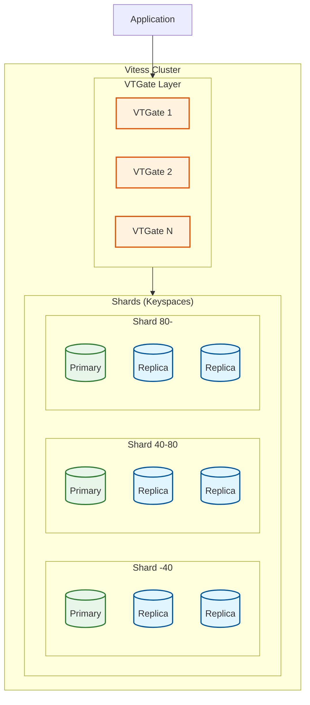
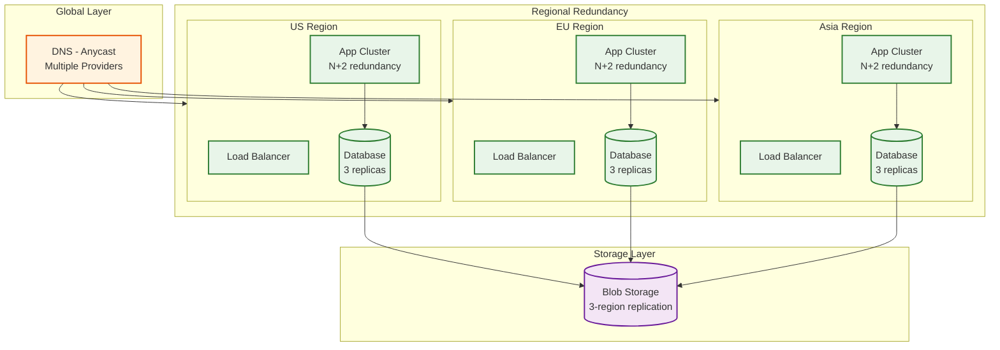
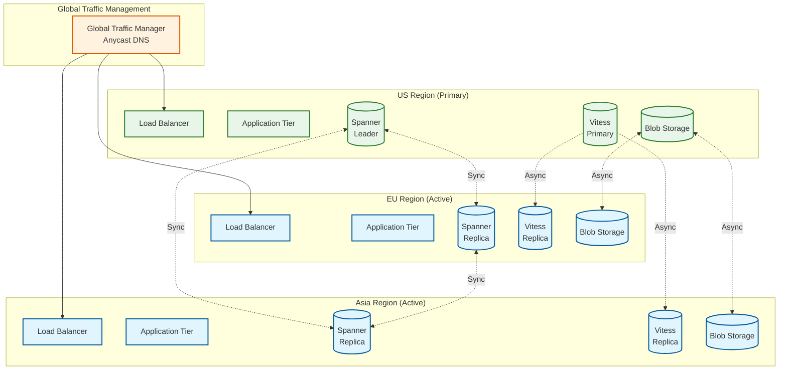

# YouTube: Scalability & Reliability

[← Back to Index](./00-index.md) | [Previous: Deep Dive](./04-deep-dive-and-bottlenecks.md) | [Next: Security →](./06-security-and-compliance.md)

---

## Scalability Strategy

### Horizontal vs. Vertical Scaling

| Component | Strategy | Rationale |
|-----------|----------|-----------|
| API Servers | Horizontal | Stateless, linear scaling |
| CDN Edge | Horizontal | Add PoPs in new regions |
| Transcoding Workers | Horizontal | Embarrassingly parallel |
| Video Storage | Horizontal | Sharded by video_id |
| Metadata DB (Vitess) | Horizontal | Automatic sharding |
| Global DB (Spanner) | Horizontal | Distributed SQL |
| Cache (Memcached) | Horizontal | Consistent hashing |
| ML Inference | Horizontal + Vertical | GPU scaling + more GPUs |

### Auto-Scaling Configuration

```yaml
# API Gateway Auto-Scaling
api_gateway:
  min_replicas: 1000
  max_replicas: 50000
  metrics:
    - type: cpu
      target_utilization: 70%
    - type: requests_per_second
      target: 500
  scale_up:
    stabilization_window: 60s
    policies:
      - type: percent
        value: 100
        period: 60s
  scale_down:
    stabilization_window: 300s
    policies:
      - type: percent
        value: 10
        period: 60s

# Transcoding Workers Auto-Scaling
transcoding_workers:
  min_replicas: 10000
  max_replicas: 200000
  metrics:
    - type: queue_depth
      target: 100  # jobs per worker
  scale_up:
    cooldown: 30s
    step: 1000
  scale_down:
    cooldown: 300s
    step: 500

# ML Inference Auto-Scaling
ml_inference:
  min_replicas: 5000
  max_replicas: 50000
  metrics:
    - type: latency_p99
      target: 40ms  # Under 50ms budget
    - type: gpu_utilization
      target: 80%
  scale_up:
    threshold: 2  # consecutive violations
    step: 500
```

### Database Scaling Strategy

#### Vitess (MySQL) Scaling



```
VITESS SCALING OPERATIONS:

1. VERTICAL SPLIT (Split by column)
   - Separate tables into different keyspaces
   - Example: Move analytics tables to separate keyspace

2. HORIZONTAL SPLIT (Resharding)
   - Split shard when it gets too large
   - Example: Shard "80-" splits into "80-C0" and "C0-"
   - Zero-downtime migration with VReplication

3. READ SCALING
   - Add read replicas per shard
   - Route read traffic to replicas
   - 10:1 replica to primary ratio common

SHARD KEY SELECTION:
   - Videos: channel_id (creator locality)
   - Users: user_id (user locality)
   - Comments: video_id (comment locality)
```

#### Bigtable Scaling

```
BIGTABLE AUTO-SCALING:

Configuration:
    min_nodes: 100
    max_nodes: 1000
    target_cpu_utilization: 70%
    target_storage_utilization: 70%

Tablet Splitting:
    - Automatic when tablet > 1 GB
    - Splits based on row key distribution
    - Rebalances across nodes

Hot Spot Mitigation:
    - Salted row keys for even distribution
    - Prefix with hash of video_id
    - Example: "a3f2:video_id:timestamp"
```

### Caching Layers

```mermaid
flowchart LR
    subgraph L1["L1: Client Cache"]
        BROWSER[Browser Cache<br/>24h TTL]
        APP[App Cache<br/>1h TTL]
    end

    subgraph L2["L2: CDN Edge Cache"]
        EDGE[Edge PoP<br/>1-24h TTL]
    end

    subgraph L3["L3: Origin Shield"]
        SHIELD[Regional Cache<br/>1h TTL]
    end

    subgraph L4["L4: Application Cache"]
        MEMCACHE[Memcached<br/>Metadata<br/>5-15m TTL]
        REDIS[Redis<br/>Sessions/Counters<br/>1-5m TTL]
    end

    subgraph L5["L5: Database Cache"]
        BUFFER[MySQL Buffer Pool]
        BLOCK[Bigtable Block Cache]
    end

    L1 --> L2 --> L3 --> L4 --> L5

    classDef l1 fill:#e1f5fe,stroke:#01579b,stroke-width:2px
    classDef l2 fill:#e0f7fa,stroke:#00695c,stroke-width:2px
    classDef l3 fill:#fff3e0,stroke:#e65100,stroke-width:2px
    classDef l4 fill:#e8f5e9,stroke:#2e7d32,stroke-width:2px
    classDef l5 fill:#f3e5f5,stroke:#6a1b9a,stroke-width:2px

    class BROWSER,APP l1
    class EDGE l2
    class SHIELD l3
    class MEMCACHE,REDIS l4
    class BUFFER,BLOCK l5
```



| Cache Layer | Size | Hit Rate | Latency | Purpose |
|-------------|------|----------|---------|---------|
| L1 Client | 100 MB | 60% | 0ms | Static assets, thumbnails |
| L2 CDN Edge | 10 TB/PoP | 98% | 5ms | Video segments |
| L3 Origin Shield | 100 TB | 85% | 20ms | Long-tail content |
| L4 Memcached | 10 TB | 95% | 1ms | Video metadata |
| L4 Redis | 1 TB | 90% | 1ms | Sessions, counters |
| L5 DB Buffer | 100 GB/node | 99% | 0.1ms | Hot rows |

### Hot Spot Mitigation

```
PROBLEM: Viral videos create hot spots

SCENARIO: New music video release
    - 10 million viewers in first hour
    - Single video_id = single shard
    - Cache overwhelmed, origin overloaded

SOLUTIONS:

1. CDN PRE-WARMING
   - Push to all edge nodes before release
   - Schedule for known releases (music drops)

2. SHARDED CACHING
   - Multiple cache keys per video
   - cache_key = video_id + hash(user_id) % 10
   - Distributes hot key across 10 cache nodes

3. READ REPLICAS
   - 10+ read replicas per shard
   - Load balance across replicas
   - Dedicated replicas for hot content

4. RATE LIMITING
   - Per-video request limits at edge
   - Queue excess requests
   - Gradual cache warming

5. ORIGIN OFFLOAD
   - Serve stale content on origin overload
   - Async refresh in background
```

---

## Reliability & Fault Tolerance

### Single Points of Failure (SPOF) Analysis

| Component | SPOF Risk | Mitigation |
|-----------|-----------|------------|
| Global Load Balancer | Low | Anycast + multiple entry points |
| API Gateway | Low | Multi-region, auto-scaling |
| Vitess Primary | Medium | Automatic failover to replica |
| Spanner | Very Low | Built-in replication |
| CDN Edge | Low | Multiple PoPs per region |
| Origin Storage | Very Low | Erasure coding + replication |
| Message Queue | Low | Replicated topics |
| ML Serving | Medium | Fallback models, caching |

### Redundancy Strategy



### Failover Mechanisms

#### Database Failover (Vitess)

```
AUTOMATIC FAILOVER PROCESS:

1. DETECTION (< 10 seconds)
   - VTTablet health check fails
   - Orchestrator detects primary down
   - Quorum confirms failure

2. PROMOTION (< 30 seconds)
   - Select most up-to-date replica
   - Promote to primary
   - Update topology server

3. REROUTING (< 5 seconds)
   - VTGate discovers new primary
   - Connections drained from old primary
   - Traffic routed to new primary

TOTAL FAILOVER TIME: < 45 seconds

CONFIGURATION:
    orchestrator:
        detection_period: 5s
        recovery_period: 30s
        promotion_policy: prefer_same_zone

    vtgate:
        discovery_interval: 1s
        connection_timeout: 10s
```

#### CDN Failover

```
CDN FAILOVER HIERARCHY:

1. EDGE NODE FAILURE
   - Health check fails
   - DNS/LB removes from rotation
   - Traffic shifts to next nearest edge
   - Failover time: < 30 seconds

2. PoP FAILURE
   - All edge nodes in PoP fail
   - Traffic routes to next region PoP
   - Latency increase: 10-50ms
   - Failover time: < 60 seconds

3. REGIONAL FAILURE
   - Entire region offline
   - Traffic routes to adjacent region
   - Latency increase: 50-200ms
   - Failover time: < 2 minutes

4. ORIGIN FAILURE
   - Origin storage unavailable
   - Serve stale from edge cache
   - Extend TTL, accept staleness
   - Notification to ops
```

### Circuit Breaker Pattern

```
ALGORITHM: ServiceCircuitBreaker

STATES: CLOSED, OPEN, HALF_OPEN

CONFIGURATION:
    failure_threshold: 50%      // Failures to open
    sample_size: 100            // Requests to evaluate
    open_duration: 30s          // Time before half-open
    half_open_requests: 10      // Test requests in half-open

STATE MACHINE:
    CLOSED:
        - Normal operation
        - Track failure rate
        - IF failure_rate > threshold:
            transition to OPEN

    OPEN:
        - Reject all requests immediately
        - Return fallback response
        - AFTER open_duration:
            transition to HALF_OPEN

    HALF_OPEN:
        - Allow limited test requests
        - IF test_success_rate > 80%:
            transition to CLOSED
        - ELSE:
            transition to OPEN

IMPLEMENTATION PER SERVICE:
    recommendation_service:
        fallback: cached_recommendations OR trending
    search_service:
        fallback: recent_searches OR popular
    comment_service:
        fallback: disable_comments (graceful)
    transcoding_service:
        fallback: queue_with_delay (no immediate fallback)
```

### Retry Strategy

```
ALGORITHM: ExponentialBackoffRetry

CONFIGURATION:
    max_retries: 3
    initial_delay: 100ms
    max_delay: 10s
    multiplier: 2.0
    jitter: 0.2  // 20% randomization

FUNCTION retry_with_backoff(operation, config):
    FOR attempt = 1 TO config.max_retries:
        TRY:
            result = operation()
            RETURN result
        CATCH RetryableError as e:
            IF attempt == config.max_retries:
                RAISE e

            delay = min(
                config.initial_delay * (config.multiplier ^ attempt),
                config.max_delay
            )
            // Add jitter to prevent thundering herd
            jitter = delay * config.jitter * random(-1, 1)
            sleep(delay + jitter)

        CATCH NonRetryableError as e:
            RAISE e  // Don't retry

RETRYABLE vs NON-RETRYABLE:
    Retryable:
        - 500, 502, 503, 504 (server errors)
        - Connection timeout
        - Rate limited (429)

    Non-Retryable:
        - 400 (bad request)
        - 401, 403 (auth errors)
        - 404 (not found)
        - Business logic errors
```

### Graceful Degradation

```
DEGRADATION LEVELS:

LEVEL 0 - NORMAL OPERATION
    All features enabled
    Full personalization
    Real-time updates

LEVEL 1 - REDUCED PERSONALIZATION
    Trigger: ML service degraded
    Actions:
        - Use cached recommendations
        - Fallback to trending
        - Disable real-time personalization

LEVEL 2 - REDUCED FEATURES
    Trigger: Multiple services degraded
    Actions:
        - Disable comments
        - Disable live chat
        - Simplified search (exact match only)
        - Lower video quality options

LEVEL 3 - CORE ONLY
    Trigger: Major infrastructure issue
    Actions:
        - Video playback only
        - No new uploads
        - No engagement features
        - Cached content only

LEVEL 4 - MAINTENANCE MODE
    Trigger: Critical failure
    Actions:
        - Static page with status
        - Redirect to status.youtube.com
        - All dynamic features disabled

AUTOMATIC TRIGGERS:
    level_1: error_rate > 5% OR latency_p99 > 500ms
    level_2: error_rate > 15% OR key_service_down
    level_3: error_rate > 30% OR multiple_services_down
    level_4: manual_trigger OR catastrophic_failure
```

### Bulkhead Pattern

```
RESOURCE ISOLATION:

1. THREAD POOL ISOLATION
   Per-service thread pools prevent cascade

   recommendation_pool:
       max_threads: 500
       queue_size: 1000

   search_pool:
       max_threads: 500
       queue_size: 1000

   comment_pool:
       max_threads: 200
       queue_size: 500

2. CONNECTION POOL ISOLATION
   Separate connection pools per database

   vitess_pool:
       max_connections: 1000
       timeout: 5s

   bigtable_pool:
       max_connections: 500
       timeout: 10s

3. RATE LIMIT ISOLATION
   Per-client, per-endpoint limits

   uploads_per_user: 50/day
   comments_per_user: 100/hour
   api_calls_per_client: 10000/day

4. BLAST RADIUS LIMITATION
   Region isolation, shard isolation
   Failure in one region doesn't affect others
```

---

## Disaster Recovery

### Recovery Objectives

| Metric | Target | Justification |
|--------|--------|---------------|
| **RTO** (Recovery Time) | < 5 minutes | Critical user-facing service |
| **RPO** (Recovery Point) | < 1 minute | Minimal data loss |
| **MTTR** (Mean Time to Repair) | < 15 minutes | Fast incident resolution |
| **MTBF** (Mean Time Between Failures) | > 30 days | Reliable infrastructure |

### Backup Strategy

```
BACKUP TIERS:

TIER 1: REAL-TIME REPLICATION
    - Spanner: Synchronous multi-region
    - Vitess: Semi-sync replication
    - Bigtable: Automatic replication
    - RPO: 0 (zero data loss)

TIER 2: CONTINUOUS BACKUP
    - Point-in-time recovery enabled
    - Binary log retention: 7 days
    - Backup frequency: Continuous
    - RPO: < 1 second

TIER 3: DAILY SNAPSHOTS
    - Full database snapshots
    - Stored in separate region
    - Retention: 30 days
    - RPO: 24 hours

TIER 4: ARCHIVE BACKUPS
    - Weekly full backups
    - Stored in cold storage
    - Retention: 1 year
    - RPO: 7 days

VIDEO CONTENT:
    - Primary: 3-region replication
    - Erasure coding: 12+4 scheme
    - Durability: 11 nines (99.999999999%)
    - No traditional "backup" needed
```

### Multi-Region Architecture



### Regional Failover Procedure

```
FAILOVER RUNBOOK:

SCENARIO: US Region Complete Failure

1. DETECTION (Automatic, < 30 seconds)
   - Health checks fail across US region
   - Alert triggered to on-call
   - Automated failover initiated

2. DNS FAILOVER (< 60 seconds)
   - GTM removes US endpoints
   - Traffic routes to EU/Asia
   - TTL: 30 seconds for fast propagation

3. DATABASE FAILOVER (< 2 minutes)
   Spanner:
   - Automatic, already multi-region
   - Leader election in EU or Asia

   Vitess:
   - Promote EU replica to primary
   - Point VTGate to new primary
   - Replication from new primary

4. STORAGE FAILOVER (< 1 minute)
   - Blob storage already replicated
   - CDN routes to available regions
   - Minimal impact (edge cached)

5. VERIFICATION (< 5 minutes)
   - Smoke tests pass
   - Metrics confirm healthy
   - Declare incident resolved

6. POST-INCIDENT
   - Root cause analysis
   - US region recovery
   - Data reconciliation
   - Backlog processing

TOTAL FAILOVER TIME: < 5 minutes
```

### Chaos Engineering

```
CHAOS EXPERIMENTS:

1. POD TERMINATION
   - Randomly kill application pods
   - Verify auto-restart and load balancing
   - Frequency: Daily

2. NODE FAILURE
   - Drain and terminate compute nodes
   - Verify workload rescheduling
   - Frequency: Weekly

3. ZONE FAILURE
   - Simulate entire availability zone outage
   - Verify cross-zone redundancy
   - Frequency: Monthly

4. REGION FAILURE
   - Simulate complete region outage
   - Verify multi-region failover
   - Frequency: Quarterly

5. DEPENDENCY FAILURE
   - Inject failures in downstream services
   - Verify circuit breakers and fallbacks
   - Frequency: Weekly

6. NETWORK PARTITION
   - Simulate network split between regions
   - Verify data consistency after heal
   - Frequency: Monthly

TOOLS:
    - Chaos Monkey (pod termination)
    - Custom chaos controller
    - Traffic injection (latency, errors)
```

---

## Load Testing Strategy

```
LOAD TEST SCENARIOS:

1. BASELINE LOAD
   - Normal traffic pattern
   - Sustained for 1 hour
   - Verify stable performance

2. PEAK LOAD (2x)
   - Double normal traffic
   - Simulate popular event
   - Verify auto-scaling

3. SPIKE LOAD (5x)
   - Sudden traffic spike
   - Simulate viral content
   - Verify graceful handling

4. SOAK TEST
   - Normal load for 24+ hours
   - Detect memory leaks
   - Verify long-term stability

5. STRESS TEST
   - Gradually increase until failure
   - Find breaking point
   - Document failure mode

METRICS TO CAPTURE:
    - Latency (p50, p95, p99)
    - Error rate
    - Throughput (RPS)
    - Resource utilization
    - Auto-scaling events
    - Cache hit rates
```

---

*[← Previous: Deep Dive](./04-deep-dive-and-bottlenecks.md) | [Next: Security →](./06-security-and-compliance.md)*
