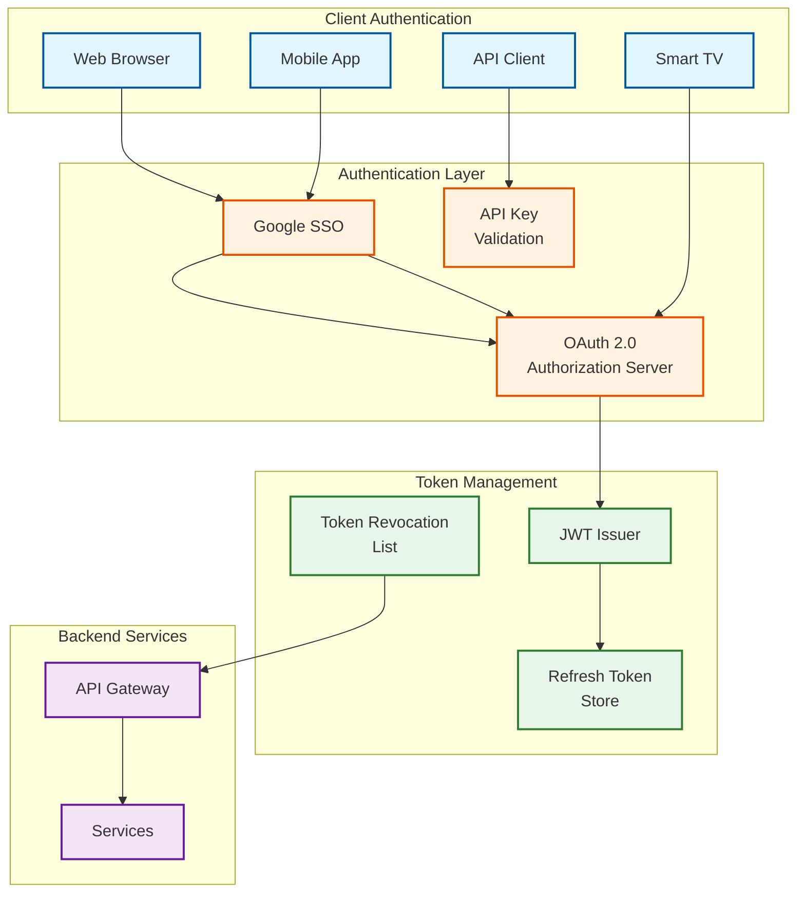
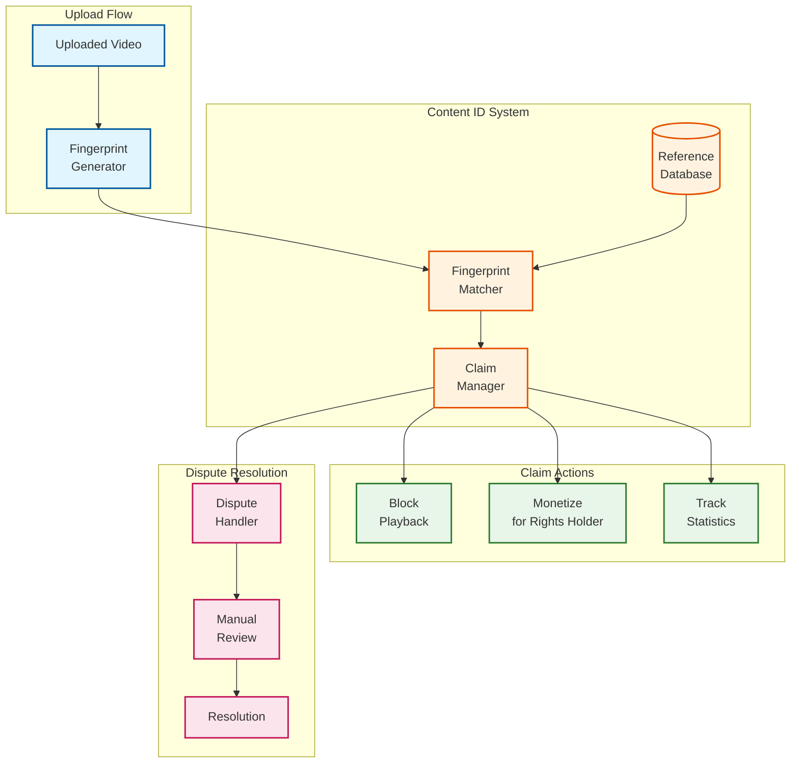
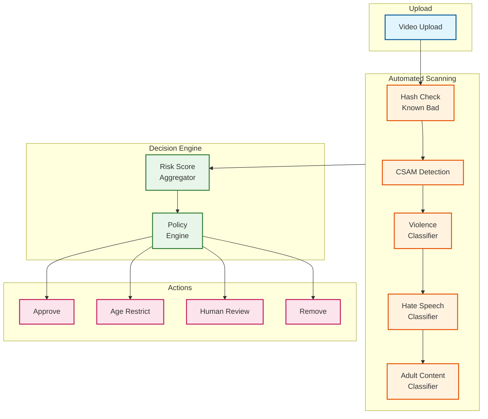

# YouTube: Security & Compliance

[← Back to Index](./00-index.md) | [Previous: Scalability](./05-scalability-and-reliability.md) | [Next: Observability →](./07-observability.md)

---

## Authentication & Authorization

### Authentication Mechanisms



### OAuth 2.0 Flow

```
YOUTUBE API OAUTH FLOW:

1. AUTHORIZATION REQUEST
   GET https://accounts.google.com/o/oauth2/v2/auth
   ?client_id={client_id}
   &redirect_uri={redirect_uri}
   &response_type=code
   &scope=https://www.googleapis.com/auth/youtube
   &access_type=offline
   &state={csrf_token}

2. USER CONSENT
   - User authenticates with Google
   - User grants requested scopes
   - Redirected back with auth code

3. TOKEN EXCHANGE
   POST https://oauth2.googleapis.com/token
   grant_type=authorization_code
   &code={auth_code}
   &redirect_uri={redirect_uri}
   &client_id={client_id}
   &client_secret={client_secret}

   Response:
   {
     "access_token": "ya29...",
     "expires_in": 3600,
     "refresh_token": "1//...",
     "scope": "https://www.googleapis.com/auth/youtube",
     "token_type": "Bearer"
   }

4. API REQUEST
   GET https://www.googleapis.com/youtube/v3/channels?mine=true
   Authorization: Bearer {access_token}

5. TOKEN REFRESH
   POST https://oauth2.googleapis.com/token
   grant_type=refresh_token
   &refresh_token={refresh_token}
   &client_id={client_id}
   &client_secret={client_secret}
```

### Authorization Model

```
PERMISSION MODEL: Hybrid RBAC + ABAC

ROLES:
    viewer:
        - Watch videos
        - Like/dislike
        - Comment (if enabled)
        - Subscribe to channels

    creator:
        - All viewer permissions
        - Upload videos
        - Manage own channel
        - Access analytics
        - Monetization (if eligible)

    moderator:
        - All viewer permissions
        - Hide comments on own videos
        - Report content
        - Community post moderation

    partner:
        - All creator permissions
        - Enhanced analytics
        - Priority support
        - Custom thumbnails

    admin:
        - All permissions
        - Content takedown
        - User suspension
        - Policy enforcement

ATTRIBUTE-BASED RULES:
    rule: can_monetize
        conditions:
            - channel.subscriber_count >= 1000
            - channel.watch_hours_365d >= 4000
            - channel.age >= 30_days
            - channel.community_strikes == 0
            - user.age >= 18

    rule: can_upload_long_video
        conditions:
            - channel.verified == true
            - OR video.duration <= 15_minutes

    rule: can_live_stream
        conditions:
            - channel.subscriber_count >= 50
            - channel.verified == true
            - channel.strikes < 3

RESOURCE-LEVEL PERMISSIONS:
    video:
        owner: full_control
        collaborator: edit_metadata
        public: view (if visibility=public)

    channel:
        owner: full_control
        manager: moderate_comments, edit_metadata
        moderator: moderate_comments

    comment:
        author: edit, delete
        video_owner: hide, pin
        youtube: remove (policy violation)
```

---

## Data Security

### Encryption at Rest

```
ENCRYPTION STRATEGY:

VIDEO FILES:
    Algorithm: AES-256-GCM
    Key Management: Google Cloud KMS
    Key Rotation: Annual
    Scope: Per-object encryption

METADATA (Databases):
    Vitess/MySQL:
        - Transparent Data Encryption (TDE)
        - Column-level encryption for PII

    Spanner:
        - Default encryption at rest
        - Customer-managed keys (CMEK) option

    Bigtable:
        - Default encryption at rest
        - CMEK available

KEY HIERARCHY:
    Master Key (in HSM)
        └── Key Encryption Key (KEK)
            └── Data Encryption Key (DEK)
                └── Encrypted Data

KEY MANAGEMENT:
    - Keys stored in Cloud KMS
    - HSM-backed key storage
    - Automatic key rotation
    - Key access logging
```

### Encryption in Transit

```
TRANSPORT SECURITY:

EXTERNAL TRAFFIC:
    Protocol: TLS 1.3 (minimum TLS 1.2)
    Cipher Suites:
        - TLS_AES_256_GCM_SHA384
        - TLS_CHACHA20_POLY1305_SHA256
        - TLS_AES_128_GCM_SHA256
    Certificate: Google Trust Services
    HSTS: Enabled (max-age=31536000)

INTERNAL TRAFFIC:
    Protocol: mTLS (mutual TLS)
    Service Mesh: Istio/Envoy
    Certificate Authority: Internal CA
    Certificate Rotation: 24 hours

CDN DELIVERY:
    Protocol: QUIC (HTTP/3) preferred
    Fallback: TLS 1.3 over TCP
    Certificate: Edge-termination at PoP

API SECURITY:
    - TLS required for all API calls
    - Certificate pinning for mobile apps
    - API key + OAuth token validation
```

### PII Handling

```
PII DATA CATEGORIES:

CATEGORY 1: HIGHLY SENSITIVE
    Data: Government ID, payment info
    Storage: Encrypted, access-controlled
    Retention: Minimum necessary
    Access: Need-to-know only

CATEGORY 2: SENSITIVE
    Data: Email, phone, real name
    Storage: Encrypted
    Retention: Account lifetime
    Access: Limited to account services

CATEGORY 3: IDENTIFIABLE
    Data: IP address, device ID, watch history
    Storage: Pseudonymized
    Retention: 18 months (configurable)
    Access: Analytics, personalization

PII PROCESSING RULES:
    - Minimize collection
    - Purpose limitation
    - User consent required
    - Right to deletion
    - Data portability

DATA MASKING:
    Logs: IP addresses truncated (last octet)
    Analytics: Aggregated, k-anonymity
    Debug: No PII in error messages
```

---

## Content Protection

### Content ID System



### Content ID Matching Algorithm

```
ALGORITHM: AudioVisualFingerprinting

AUDIO FINGERPRINTING:
    1. Extract audio track
    2. Convert to spectrogram
    3. Find spectral peaks
    4. Create hash pairs (constellation)
    5. Store in inverted index

    Match Criteria:
        - 8+ second overlap
        - 80%+ fingerprint match
        - Time-aligned peaks

VIDEO FINGERPRINTING:
    1. Extract keyframes (1 per second)
    2. Compute perceptual hash (pHash)
    3. Extract color histogram
    4. Compute motion vectors
    5. Create composite signature

    Match Criteria:
        - 30%+ keyframe match
        - Hamming distance < threshold
        - Accounting for transformations

COMBINED MATCHING:
    audio_score = match_audio(upload, reference)
    video_score = match_video(upload, reference)

    IF audio_score > 0.8 OR video_score > 0.7:
        create_claim(upload, reference)

    IF audio_score > 0.6 AND video_score > 0.5:
        flag_for_review(upload, reference)
```

### DMCA Takedown Process

```
DMCA WORKFLOW:

1. RECEIPT (Automated)
   - Receive takedown notice
   - Validate required fields
   - Assign case ID
   - SLA: 24 hours for action

2. VALIDATION
   Required fields:
   - Claimant identification
   - Copyrighted work description
   - Infringing content URL
   - Good faith statement
   - Signature

3. ACTION
   Valid notice:
   - Remove content
   - Notify uploader
   - Issue strike (if applicable)

   Invalid notice:
   - Request additional information
   - Reject if non-compliant

4. COUNTER-NOTIFICATION
   Uploader can dispute:
   - Submit counter-notice
   - Wait 10-14 business days
   - Content restored if no lawsuit filed

5. STRIKE SYSTEM
   Strike 1: Warning, required training
   Strike 2: 1-week upload restriction
   Strike 3: Channel termination

REPEAT INFRINGER POLICY:
    - 3 strikes = termination
    - Strikes expire after 90 days
    - Repeat violations = permanent ban
```

---

## Threat Model

### Top Attack Vectors

| Attack Vector | Impact | Likelihood | Mitigation |
|--------------|--------|------------|------------|
| **View Fraud (Bots)** | Revenue loss, unfair ranking | High | ML detection, rate limiting, CAPTCHAs |
| **Account Takeover** | Data theft, spam | Medium | MFA, suspicious login detection |
| **DDoS Attack** | Service unavailable | Medium | CDN absorption, rate limiting, Cloudflare |
| **Content Injection** | Malicious content | Low | Content scanning, sandboxed playback |
| **API Abuse** | Resource exhaustion | High | Rate limiting, quota management |
| **Credential Stuffing** | Account compromise | Medium | Breached password detection, MFA |
| **Spam/Phishing Comments** | User harm | High | ML moderation, link filtering |
| **Malicious Uploads** | Malware distribution | Low | Scanning, sandboxed processing |

### DDoS Protection

```
DDOS MITIGATION LAYERS:

LAYER 1: EDGE ABSORPTION
    - CDN capacity: 100+ Tbps
    - Anycast routing distributes attack
    - Edge can absorb most volumetric attacks

LAYER 2: RATE LIMITING
    Per-IP limits:
        - 100 requests/second (burst)
        - 1000 requests/minute (sustained)
    Per-account limits:
        - API quota management
        - Graduated response

LAYER 3: BEHAVIORAL ANALYSIS
    - Distinguish humans from bots
    - Challenge suspicious traffic
    - JavaScript challenges
    - CAPTCHA for flagged requests

LAYER 4: TRAFFIC SCRUBBING
    - Upstream filtering
    - BGP Flowspec for volumetric
    - Protocol anomaly detection

ATTACK RESPONSE:
    1. Auto-detect anomaly
    2. Enable progressive mitigation
    3. Page on-call if severe
    4. Post-incident analysis
```

### API Security

```
API PROTECTION:

AUTHENTICATION:
    - OAuth 2.0 required
    - API keys for identification
    - Short-lived access tokens (1 hour)

AUTHORIZATION:
    - Scope-based access control
    - Principle of least privilege
    - Resource-level permissions

RATE LIMITING:
    Quota units per day:
        - Read operations: 1 unit
        - Write operations: 50 units
        - Upload: 1600 units
    Default quota: 10,000 units/day

INPUT VALIDATION:
    - Schema validation
    - Size limits
    - Injection prevention
    - Content-type validation

OUTPUT SANITIZATION:
    - HTML encoding
    - JSON encoding
    - URL validation
    - No sensitive data in errors

LOGGING:
    - All API calls logged
    - Anomaly detection
    - Abuse pattern recognition
```

---

## Compliance

### GDPR Compliance

```
GDPR REQUIREMENTS:

RIGHT TO ACCESS (Article 15):
    - Download your data (takeout.google.com)
    - Machine-readable format
    - Response within 30 days

RIGHT TO ERASURE (Article 17):
    - Delete account and data
    - Remove from search
    - Propagate to backups within 180 days

RIGHT TO PORTABILITY (Article 20):
    - Export watch history
    - Export subscriptions
    - Export playlists

DATA MINIMIZATION:
    - Collect only necessary data
    - Retention policies enforced
    - Anonymization after retention period

CONSENT MANAGEMENT:
    - Granular consent options
    - Easy withdrawal
    - Clear privacy notices
    - Cookie consent (EU)

DATA PROTECTION OFFICER:
    - Appointed for Google/YouTube
    - Contact available in privacy policy
    - Handles data subject requests
```

### COPPA Compliance

```
COPPA REQUIREMENTS (Children's Online Privacy):

AGE VERIFICATION:
    - Account creation requires age
    - Under-13 accounts blocked (most countries)
    - YouTube Kids for children

MADE FOR KIDS CONTENT:
    - Creators must declare content audience
    - Data collection limited for kids content
    - Personalized ads disabled
    - Comments disabled

DATA COLLECTION (Kids Content):
    Allowed:
        - Aggregate analytics
        - Contextual advertising
        - Content recommendations (limited)

    Not Allowed:
        - Personalized advertising
        - Watch history linking
        - Third-party tracking
        - Notification emails

PARENTAL CONSENT:
    - Required for under-13 (where allowed)
    - Verified parental consent (VPC)
    - Annual re-verification
```

### Regional Compliance

| Region | Regulation | Key Requirements |
|--------|------------|------------------|
| **EU** | GDPR, DSA | Data rights, content moderation transparency |
| **US** | COPPA, CCPA | Children's privacy, California consumer rights |
| **India** | IT Rules 2021 | Content takedown, grievance officer |
| **UK** | UK GDPR, OSB | Age verification, harmful content removal |
| **Australia** | Privacy Act, OSA | Data handling, online safety |
| **Brazil** | LGPD | Data protection similar to GDPR |
| **China** | N/A | YouTube blocked |

---

## Content Safety

### Safety Scanning Pipeline



### Community Guidelines Enforcement

```
ENFORCEMENT TIERS:

TIER 1: WARNING
    Trigger: First minor violation
    Action: Warning email, no penalty
    Example: Mild profanity, minor policy edge case

TIER 2: STRIKE
    Trigger: Clear policy violation
    Action: Strike issued, feature restrictions
    Example: Harassment, misleading content

TIER 3: REMOVAL
    Trigger: Severe violation
    Action: Content removed, strike issued
    Example: Hate speech, dangerous content

TIER 4: TERMINATION
    Trigger: Repeated or severe violations
    Action: Channel terminated
    Example: 3 strikes, severe abuse, CSAM

STRIKE PENALTIES:
    Strike 1: Warning, required policy training
    Strike 2: 1 week: no uploads, no live streaming
    Strike 3: Channel terminated

APPEAL PROCESS:
    1. Submit appeal within 30 days
    2. Human review within 7 days
    3. Uphold or reverse decision
    4. External appeal (some regions)
```

---

## Ad Fraud Prevention

### Invalid Traffic Detection

```
ALGORITHM: InvalidTrafficDetection

TRAFFIC CATEGORIES:
    General Invalid Traffic (GIVT):
        - Known bots (Googlebot, Bingbot)
        - Data center traffic
        - Pre-fetch/pre-render

    Sophisticated Invalid Traffic (SIVT):
        - Bot networks
        - Click farms
        - Ad injection
        - Impression laundering

DETECTION SIGNALS:
    Device Signals:
        - User agent consistency
        - JavaScript execution
        - Cookie behavior
        - Device fingerprint

    Behavioral Signals:
        - Click timing patterns
        - Mouse movement (web)
        - Scroll behavior
        - Session duration

    Network Signals:
        - IP reputation
        - ASN/ISP classification
        - Geographic consistency
        - VPN/proxy detection

FILTERING PIPELINE:
    1. Pre-bid filtering (GIVT)
    2. Real-time scoring (SIVT)
    3. Post-impression validation
    4. Periodic audit and clawback

ADVERTISER PROTECTION:
    - Refund for invalid traffic
    - Transparent reporting
    - Third-party verification (MRC)
```

---

## Audit & Logging

### Audit Log Schema

```json
{
  "event_id": "uuid",
  "timestamp": "2026-02-01T12:00:00Z",
  "event_type": "video.delete",
  "actor": {
    "type": "user",
    "id": "user_123",
    "ip": "192.168.x.x",
    "user_agent": "..."
  },
  "resource": {
    "type": "video",
    "id": "dQw4w9WgXcQ",
    "owner": "channel_456"
  },
  "action": {
    "method": "DELETE",
    "endpoint": "/api/v3/videos",
    "status": "success"
  },
  "context": {
    "request_id": "req_xyz",
    "session_id": "sess_abc",
    "geo": "US"
  },
  "changes": {
    "before": {"visibility": "public"},
    "after": {"visibility": "deleted"}
  }
}
```

### Log Retention

| Log Type | Retention | Purpose |
|----------|-----------|---------|
| Access Logs | 30 days | Debugging, security |
| Audit Logs | 7 years | Compliance, legal |
| Security Logs | 1 year | Incident response |
| Error Logs | 90 days | Debugging |
| Analytics Logs | 2 years | Business intelligence |

---

*[← Previous: Scalability](./05-scalability-and-reliability.md) | [Next: Observability →](./07-observability.md)*
