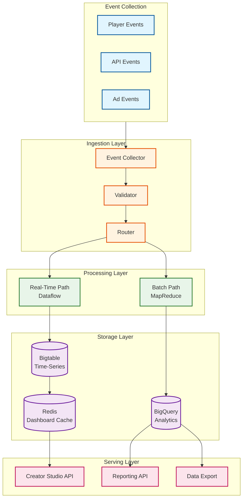
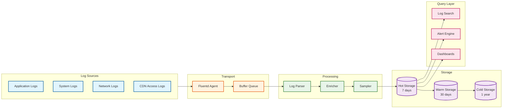

# YouTube: Observability

[← Back to Index](./00-index.md) | [Previous: Security](./06-security-and-compliance.md) | [Next: Interview Guide →](./08-interview-guide.md)

---

## Metrics (USE/RED)

### USE Metrics (Resources)

| Resource | Utilization | Saturation | Errors |
|----------|-------------|------------|--------|
| **CPU** | % used across fleet | Run queue length | Hardware errors |
| **Memory** | % heap used | OOM events | Allocation failures |
| **Disk I/O** | IOPS, throughput | I/O wait time | Read/write errors |
| **Network** | Bandwidth utilization | Packet drops | Connection errors |
| **CDN** | Cache hit rate | Origin requests | 5xx responses |
| **Database** | Query rate, connections | Lock contention | Query errors |
| **Queue** | Processing rate | Queue depth | Dead letter count |

### RED Metrics (Services)

| Service | Rate | Errors | Duration |
|---------|------|--------|----------|
| **API Gateway** | Requests/sec | Error rate (%) | p50, p95, p99 latency |
| **Video Playback** | Streams/sec | Playback failures | Time to first byte |
| **Upload Service** | Uploads/sec | Upload failures | Upload duration |
| **Search** | Queries/sec | Empty results, errors | Query latency |
| **Recommendations** | Requests/sec | Fallback rate | Inference latency |
| **Transcoding** | Jobs/sec | Failed jobs | Job duration |
| **Comments** | Posts/sec | Post failures | Write latency |

### Key Performance Indicators (KPIs)

```yaml
# Critical Business Metrics
video_starts_per_second:
  description: Successful video playback initiations
  target: "> 100,000/s"
  alert_threshold: "< 80,000/s"

hours_watched_per_day:
  description: Total watch time
  target: "> 1 billion hours"
  alert_threshold: "< 950 million hours"

upload_success_rate:
  description: Successfully processed uploads
  target: "> 99.5%"
  alert_threshold: "< 99%"

search_result_relevance:
  description: CTR on first page results
  target: "> 40%"
  alert_threshold: "< 35%"

# Technical Health Metrics
availability:
  description: Successful requests / total requests
  target: "99.99%"
  alert_threshold: "< 99.95%"

playback_start_time_p95:
  description: Time from click to first frame
  target: "< 500ms"
  alert_threshold: "> 800ms"

rebuffering_ratio:
  description: Buffering time / play time
  target: "< 0.5%"
  alert_threshold: "> 1%"

cdn_cache_hit_rate:
  description: Requests served from cache
  target: "> 98%"
  alert_threshold: "< 95%"
```

---

## Dashboard Design

### Executive Dashboard

```
┌─────────────────────────────────────────────────────────────────────────────┐
│                        YOUTUBE EXECUTIVE DASHBOARD                           │
├─────────────────────────────────────────────────────────────────────────────┤
│                                                                              │
│  ┌──────────────────┐  ┌──────────────────┐  ┌──────────────────┐          │
│  │   AVAILABILITY   │  │  VIDEO STARTS/s  │  │  HOURS WATCHED   │          │
│  │      99.99%      │  │     125,432      │  │   1.02 Billion   │          │
│  │    ✓ Target Met  │  │    ↑ 3.2%       │  │    ↑ 1.5%        │          │
│  └──────────────────┘  └──────────────────┘  └──────────────────┘          │
│                                                                              │
│  ┌──────────────────┐  ┌──────────────────┐  ┌──────────────────┐          │
│  │   UPLOAD RATE    │  │    SEARCH QPS    │  │   AD IMPRESSIONS │          │
│  │    8.3K/min      │  │      45,000      │  │   892 Million    │          │
│  │    ↑ 2.1%        │  │    ↓ 0.5%        │  │    ↑ 4.2%        │          │
│  └──────────────────┘  └──────────────────┘  └──────────────────┘          │
│                                                                              │
│  ┌────────────────────────────────────────────────────────────────────────┐ │
│  │                     VIDEO STARTS - LAST 24 HOURS                       │ │
│  │  150K ┤                                                                │ │
│  │       │     ╭──╮                             ╭──╮                      │ │
│  │  100K ┤────╯    ╰──────────────╮    ╭───────╯    ╰──────               │ │
│  │       │                         ╰──╯                                   │ │
│  │   50K ┤                                                                │ │
│  │       └────────────────────────────────────────────────────────────    │ │
│  │         00:00   04:00   08:00   12:00   16:00   20:00   24:00          │ │
│  └────────────────────────────────────────────────────────────────────────┘ │
│                                                                              │
│  ACTIVE INCIDENTS: 0                     LAST DEPLOY: 2 hours ago           │
│                                                                              │
└─────────────────────────────────────────────────────────────────────────────┘
```

### Service Health Dashboard

```
┌─────────────────────────────────────────────────────────────────────────────┐
│                        SERVICE HEALTH DASHBOARD                              │
├─────────────────────────────────────────────────────────────────────────────┤
│                                                                              │
│  SERVICE              STATUS    QPS       ERROR%   LATENCY(p99)  INSTANCES  │
│  ─────────────────────────────────────────────────────────────────────────  │
│  API Gateway          ● OK      450K      0.01%    45ms          1,200      │
│  Video Playback       ● OK      125K      0.02%    120ms         800        │
│  Upload Service       ● OK      8.3K      0.05%    2.1s          200        │
│  Transcoding          ● OK      15K       0.10%    180s          50,000     │
│  Recommendations      ● OK      85K       0.03%    35ms          500        │
│  Search               ● OK      45K       0.02%    80ms          300        │
│  Comments             ● WARN    25K       0.15%    95ms          150        │
│  Analytics            ● OK      2M        0.01%    N/A           1,000      │
│                                                                              │
│  ┌─────────────────────────────────────────────────────────────────────┐   │
│  │                    ERROR RATE BY SERVICE (1 HOUR)                    │   │
│  │                                                                      │   │
│  │  0.2% ┤                            ╭─╮                               │   │
│  │       │                           ╭╯ ╰╮                              │   │
│  │  0.1% ┤─────────────────╮────────╯    ╰─────────────────────────    │   │
│  │       │                  ╰╮                     Comments ───         │   │
│  │  0.0% ┤───────────────────╰─────────────────────────────────────    │   │
│  │       └──────────────────────────────────────────────────────────   │   │
│  │         -60m    -45m    -30m    -15m     Now                         │   │
│  └─────────────────────────────────────────────────────────────────────┘   │
│                                                                              │
└─────────────────────────────────────────────────────────────────────────────┘
```

### CDN Performance Dashboard

```
┌─────────────────────────────────────────────────────────────────────────────┐
│                          CDN PERFORMANCE DASHBOARD                           │
├─────────────────────────────────────────────────────────────────────────────┤
│                                                                              │
│  ┌──────────────────┐  ┌──────────────────┐  ┌──────────────────┐          │
│  │  CACHE HIT RATE  │  │  EGRESS TRAFFIC  │  │  ORIGIN LOAD     │          │
│  │      98.7%       │  │    87.5 Tbps     │  │    1.2 Tbps      │          │
│  │    ✓ Target      │  │    ↑ 5.2%        │  │    Normal        │          │
│  └──────────────────┘  └──────────────────┘  └──────────────────┘          │
│                                                                              │
│  REGION              HIT RATE   TRAFFIC    LATENCY   STATUS                 │
│  ─────────────────────────────────────────────────────────────────────────  │
│  North America       98.9%      32 Tbps    12ms      ● OK                   │
│  Europe              98.5%      28 Tbps    15ms      ● OK                   │
│  Asia Pacific        98.2%      22 Tbps    25ms      ● OK                   │
│  Latin America       97.8%      4 Tbps     35ms      ● OK                   │
│  Middle East         97.5%      1.5 Tbps   40ms      ● OK                   │
│                                                                              │
│  ┌─────────────────────────────────────────────────────────────────────┐   │
│  │                    CACHE HIT RATE BY CONTENT TYPE                    │   │
│  │                                                                      │   │
│  │  Video Segments    ████████████████████████████████████████  99.2%  │   │
│  │  Manifests         ███████████████████████████████████████   98.5%  │   │
│  │  Thumbnails        ████████████████████████████████████      95.2%  │   │
│  │  API Responses     ██████████████████████                    72.0%  │   │
│  │                                                                      │   │
│  └─────────────────────────────────────────────────────────────────────┘   │
│                                                                              │
└─────────────────────────────────────────────────────────────────────────────┘
```

---

## Creator Analytics Dashboard

### YouTube Studio Analytics

```
REAL-TIME ANALYTICS (Updated every 60 seconds):

┌─────────────────────────────────────────────────────────────────────────────┐
│                            CHANNEL ANALYTICS                                 │
│                        Last 28 Days | All Videos                            │
├─────────────────────────────────────────────────────────────────────────────┤
│                                                                              │
│  ┌──────────────────┐  ┌──────────────────┐  ┌──────────────────┐          │
│  │      VIEWS       │  │   WATCH TIME     │  │   SUBSCRIBERS    │          │
│  │   1,234,567      │  │   82,450 hrs     │  │   +12,345        │          │
│  │   ↑ 15.2%        │  │   ↑ 8.7%         │  │   ↑ 5.2%         │          │
│  └──────────────────┘  └──────────────────┘  └──────────────────┘          │
│                                                                              │
│  ┌──────────────────┐  ┌──────────────────┐  ┌──────────────────┐          │
│  │    REVENUE       │  │    AVG VIEW      │  │   IMPRESSIONS    │          │
│  │   $8,234.56      │  │   4:32 mins      │  │   5.2 Million    │          │
│  │   ↑ 12.1%        │  │   ↑ 3.2%         │  │   ↑ 18.4%        │          │
│  └──────────────────┘  └──────────────────┘  └──────────────────┘          │
│                                                                              │
│  TOP VIDEOS (Last 28 Days)                                                   │
│  ─────────────────────────────────────────────────────────────────────────  │
│  1. "Tutorial Part 1"       │ 245K views │ 18K hrs │ $1,234 │ 48% CTR      │
│  2. "Product Review"        │ 189K views │ 12K hrs │ $892   │ 42% CTR      │
│  3. "Live Stream Replay"    │ 156K views │ 28K hrs │ $756   │ 35% CTR      │
│                                                                              │
│  TRAFFIC SOURCES                          AUDIENCE                           │
│  ────────────────                         ─────────                          │
│  Browse Features    35%                   US           42%                   │
│  Search             28%                   UK           15%                   │
│  Suggested Videos   22%                   India        12%                   │
│  External           10%                   Germany       8%                   │
│  Direct             5%                    Brazil        6%                   │
│                                                                              │
└─────────────────────────────────────────────────────────────────────────────┘
```

### Analytics Data Pipeline



### Metrics Update Latency

| Metric Type | Update Latency | Accuracy |
|-------------|----------------|----------|
| Real-time views | ~60 seconds | Estimated |
| Views (final) | 24-48 hours | Accurate |
| Watch time | 24-48 hours | Accurate |
| Revenue | 24-48 hours | Final within 30 days |
| Demographics | 48-72 hours | Aggregated |
| Traffic sources | 24-48 hours | Accurate |
| CTR/Impressions | 24-48 hours | Accurate |
| Retention | 48-72 hours | Accurate |

---

## Logging

### Log Levels & Strategy

```yaml
log_levels:
  DEBUG:
    enabled: false  # Production
    examples:
      - "Request body parsed"
      - "Cache lookup result"
    retention: N/A

  INFO:
    enabled: true
    examples:
      - "Video playback started: video_id=xyz"
      - "Upload completed: video_id=abc, size=100MB"
    retention: 7 days

  WARN:
    enabled: true
    examples:
      - "High latency detected: service=recommendations, p99=80ms"
      - "Cache miss rate elevated: rate=15%"
    retention: 30 days

  ERROR:
    enabled: true
    examples:
      - "Database connection failed: db=vitess, error=timeout"
      - "Transcoding failed: video_id=xyz, reason=codec_error"
    retention: 90 days

  CRITICAL:
    enabled: true
    examples:
      - "Service unavailable: service=playback"
      - "Data corruption detected: table=videos"
    retention: 1 year
    alert: immediate
```

### Structured Log Format

```json
{
  "timestamp": "2026-02-01T12:00:00.123Z",
  "level": "INFO",
  "service": "playback-service",
  "instance": "playback-prod-us-east1-a-001",
  "trace_id": "abc123def456",
  "span_id": "span789",
  "request_id": "req_xyz",
  "user_id": "user_123",
  "video_id": "dQw4w9WgXcQ",
  "event": "video_playback_started",
  "duration_ms": 145,
  "metadata": {
    "quality": "1080p",
    "codec": "vp9",
    "device": "mobile_android",
    "country": "US"
  }
}
```

### Log Aggregation Architecture



---

## Distributed Tracing

### Trace Propagation

```
TRACE CONTEXT PROPAGATION:

Headers (W3C Trace Context):
    traceparent: 00-{trace_id}-{span_id}-{flags}
    tracestate: vendor=value

Example Flow:
    Client Request
        │
        ├── API Gateway [span: api_gateway]
        │   ├── Auth Service [span: auth_check]
        │   └── Rate Limiter [span: rate_limit]
        │
        ├── Playback Service [span: playback]
        │   ├── Video Metadata [span: metadata_lookup]
        │   │   └── Vitess Query [span: vitess_query]
        │   ├── Recommendations [span: get_recommendations]
        │   │   ├── Feature Store [span: feature_lookup]
        │   │   └── ML Inference [span: model_inference]
        │   └── CDN Routing [span: cdn_route]
        │
        └── Response

Trace ID: Propagated through all services
Span ID: Unique per operation
Parent ID: Links spans in hierarchy
```

### Key Spans to Instrument

| Service | Span Name | Tags |
|---------|-----------|------|
| API Gateway | `api_request` | method, path, status_code |
| Auth | `auth_validate` | auth_type, success |
| Playback | `video_start` | video_id, quality, codec |
| Metadata | `db_query` | table, operation |
| Recommendations | `ml_inference` | model_version, latency |
| CDN | `cache_lookup` | hit/miss, edge_location |
| Transcoding | `encode_segment` | codec, resolution |
| Upload | `chunk_upload` | chunk_number, size |

### Sampling Strategy

```yaml
sampling:
  # Always trace errors
  error_sampling: 100%

  # Always trace slow requests
  slow_request_threshold: 500ms
  slow_request_sampling: 100%

  # Sample normal traffic
  default_sampling: 0.1%  # 1 in 1000

  # Higher sampling for specific services
  per_service:
    recommendations:
      sampling_rate: 1%  # More traces for ML debugging
    transcoding:
      sampling_rate: 10%  # Important for monitoring

  # Debug mode (temporary)
  debug_user_ids:
    - "test_user_123"
  debug_sampling: 100%
```

---

## Alerting

### Alert Severity Levels

| Level | Response Time | Examples | Notification |
|-------|--------------|----------|--------------|
| **P0 - Critical** | < 5 minutes | Service down, data loss | Page on-call, escalate |
| **P1 - High** | < 15 minutes | Degraded performance, errors spike | Page on-call |
| **P2 - Medium** | < 1 hour | Elevated latency, partial feature failure | Slack alert |
| **P3 - Low** | Next business day | Non-critical warnings | Ticket created |

### Alert Configuration

```yaml
alerts:
  - name: "High Error Rate"
    severity: P1
    condition: "error_rate > 0.5% for 5 minutes"
    services: [api_gateway, playback_service]
    notification:
      - pagerduty: youtube-oncall
      - slack: #youtube-alerts

  - name: "Service Unavailable"
    severity: P0
    condition: "availability < 99.9% for 2 minutes"
    services: [playback_service, upload_service]
    notification:
      - pagerduty: youtube-oncall
      - phone: oncall_primary

  - name: "Transcoding Backlog"
    severity: P2
    condition: "queue_depth > 10000 for 15 minutes"
    services: [transcoding]
    notification:
      - slack: #youtube-media-processing

  - name: "CDN Cache Miss Spike"
    severity: P2
    condition: "cache_hit_rate < 95% for 10 minutes"
    services: [cdn]
    notification:
      - slack: #youtube-cdn-ops

  - name: "ML Model Degradation"
    severity: P2
    condition: "recommendation_ctr < baseline * 0.9 for 1 hour"
    services: [recommendations]
    notification:
      - slack: #youtube-ml-alerts
```

### Runbook References

```yaml
runbooks:
  high_error_rate:
    link: "https://wiki/runbooks/high-error-rate"
    steps:
      - Check recent deployments
      - Review error logs for patterns
      - Check downstream dependencies
      - Consider rollback if deploy-related

  transcoding_backlog:
    link: "https://wiki/runbooks/transcoding-backlog"
    steps:
      - Check worker health
      - Scale up transcoding workers
      - Prioritize high-priority jobs
      - Notify content team if extended

  cdn_cache_miss:
    link: "https://wiki/runbooks/cdn-cache-miss"
    steps:
      - Check for viral content
      - Verify origin health
      - Check cache eviction rates
      - Consider pre-warming popular content
```

---

## SLO Monitoring

### SLO Dashboard

```
┌─────────────────────────────────────────────────────────────────────────────┐
│                            SLO DASHBOARD                                     │
├─────────────────────────────────────────────────────────────────────────────┤
│                                                                              │
│  SERVICE             SLO TARGET    CURRENT    BUDGET REMAINING   STATUS     │
│  ─────────────────────────────────────────────────────────────────────────  │
│  Video Availability  99.99%        99.995%    75% (22.5 min)     ● HEALTHY  │
│  Playback Start      <500ms p95    320ms      N/A                ● HEALTHY  │
│  Search Latency      <300ms p99    245ms      N/A                ● HEALTHY  │
│  Upload Success      99.5%         99.7%      140% (surplus)     ● HEALTHY  │
│  Transcoding Time    <30min p95    18min      N/A                ● HEALTHY  │
│  Comment Post        99.9%         99.85%     50% (21.6 min)     ● WARNING  │
│                                                                              │
│  ┌─────────────────────────────────────────────────────────────────────┐   │
│  │                    ERROR BUDGET BURN RATE                            │   │
│  │                                                                      │   │
│  │  2x  ┤                                                               │   │
│  │      │                           ╭╮                                  │   │
│  │  1x  ┤───────────────────────────╯╰──────────────────────────────   │   │
│  │      │                                                               │   │
│  │  0x  ┤                                                               │   │
│  │      └──────────────────────────────────────────────────────────    │   │
│  │        Mon    Tue    Wed    Thu    Fri    Sat    Sun                 │   │
│  └─────────────────────────────────────────────────────────────────────┘   │
│                                                                              │
│  BURN RATE ALERTS:                                                          │
│  • 1-hour burn rate > 14.4x: Critical (budget exhausted in 5 days)         │
│  • 6-hour burn rate > 6x: High (budget exhausted in 2.5 weeks)             │
│  • 1-day burn rate > 3x: Medium (budget exhausted in 10 days)              │
│                                                                              │
└─────────────────────────────────────────────────────────────────────────────┘
```

### Error Budget Policy

```yaml
error_budget_policy:
  # When budget is healthy (> 50%)
  healthy:
    - Continue normal releases
    - Experiment with new features
    - Accept more risk

  # When budget is concerning (20-50%)
  warning:
    - Slow down releases
    - Focus on reliability improvements
    - Review recent changes

  # When budget is critical (< 20%)
  critical:
    - Freeze non-critical releases
    - Prioritize reliability fixes
    - Incident review for each failure

  # When budget is exhausted (0%)
  exhausted:
    - Emergency reliability mode
    - Only security/critical fixes
    - All hands on reliability
```

---

*[← Previous: Security](./06-security-and-compliance.md) | [Next: Interview Guide →](./08-interview-guide.md)*
