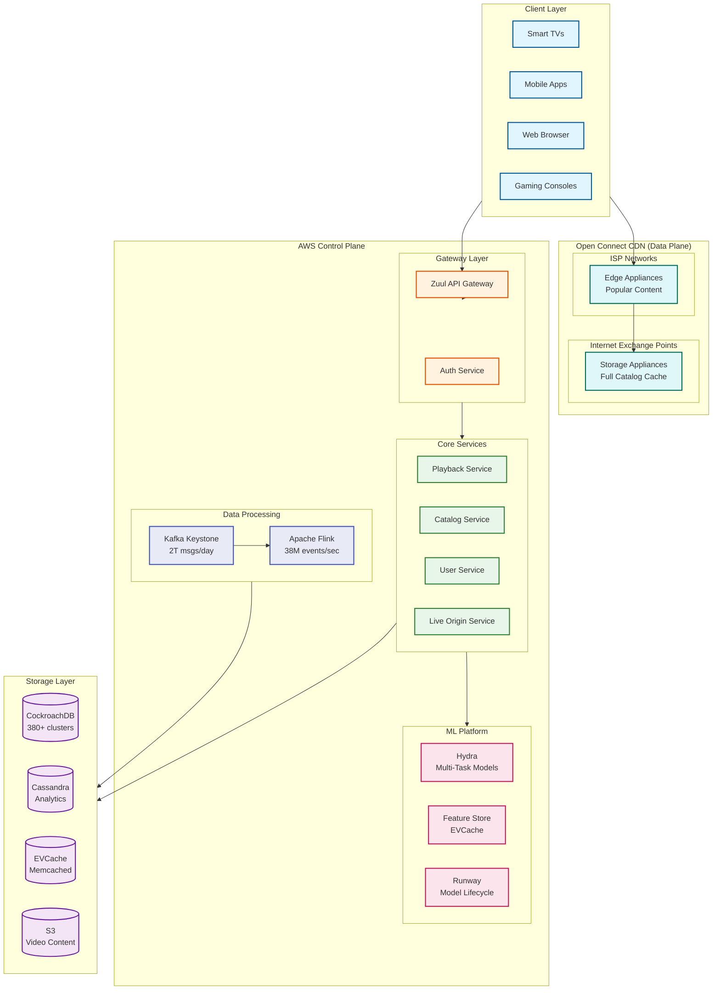

# Netflix System Design

[← Back to System Design Index](../README.md)

---

## Overview

Netflix is the world's largest subscription-based streaming platform, serving **238 million memberships** globally with a catalog of **~17,000 titles** (movies and series). The platform achieved **65 million concurrent viewers** during the Tyson vs Paul live event (2024), demonstrating massive scale. Netflix's core technical challenges include building and operating Open Connect (their custom CDN embedded within ISP networks), implementing adaptive bitrate streaming with AV1 codec and Film Grain Synthesis, and powering the recommendation engine (Hydra) that drives **75-80% of all viewing hours**.

**Key Differentiators from Other Video Platforms:**
- **Subscription-first**: No ads on core product (ads tier added 2022) vs YouTube's ads-first
- **Curated content**: Licensed + Original production vs YouTube's UGC
- **ISP-embedded CDN**: Open Connect with free hardware to ISPs vs third-party CDNs
- **Predictive caching**: Catalog-based content enables demand prediction
- **Film Grain Synthesis**: Netflix innovation for 24-31% bandwidth savings

---

## System Characteristics

| Characteristic | Value | Implication |
|----------------|-------|-------------|
| Traffic Pattern | Read-heavy (streaming), Write-light | Aggressive edge caching, Open Connect |
| Content Type | Long-form (movies, series) | Seek/resume support, binge watching |
| Discovery Model | Algorithm + Browse | 75-80% from recommendations |
| Consistency Model | Eventual (recommendations), Strong (billing) | Polyglot persistence |
| Latency Sensitivity | High (<200ms playback start) | Edge proximity, pre-buffering |
| Storage Profile | Write-once, read-many (WORM) | Immutable video storage, CDN-friendly |
| Global Distribution | 190+ countries | Multi-region, geo-routing, content licensing |

---

## Complexity Rating

| Component | Complexity | Reason |
|-----------|------------|--------|
| Open Connect CDN | **Very High** | Two-tier ISP architecture, predictive caching, 95% traffic |
| Video Encoding Pipeline | **Very High** | AV1 + Film Grain Synthesis, Context-Aware Encoding |
| Personalization (Hydra) | **Very High** | Multi-task learning, thumbnail personalization, 80B signals/day |
| ABR Algorithm | **High** | Hybrid throughput + buffer-based, device adaptation |
| Live Streaming | **High** | Sub-minute distribution to 100M devices |
| Microservices Platform | **High** | 200+ federated GraphQL services, Envoy mesh |
| Data Infrastructure | **High** | 2T Kafka messages/day, 38M events/sec |
| Content Catalog | **Medium-High** | Global licensing, multi-region availability |
| User/Profile Management | **Medium** | Multi-profile per account, parental controls |

**Overall System Complexity: Very High**

---

## Quick Navigation

| Document | Description |
|----------|-------------|
| [01 - Requirements & Estimations](./01-requirements-and-estimations.md) | Functional/non-functional requirements, capacity planning |
| [02 - High-Level Design](./02-high-level-design.md) | Architecture diagrams, data flows, key decisions |
| [03 - Low-Level Design](./03-low-level-design.md) | Data models, API design, algorithms |
| [04 - Deep Dive & Bottlenecks](./04-deep-dive-and-bottlenecks.md) | Open Connect, AV1/ABR, Hydra deep dive |
| [05 - Scalability & Reliability](./05-scalability-and-reliability.md) | Titus, Chaos Engineering, fault tolerance |
| [06 - Security & Compliance](./06-security-and-compliance.md) | DRM, content protection, regional compliance |
| [07 - Observability](./07-observability.md) | Keystone Pipeline, metrics, alerting |
| [08 - Interview Guide](./08-interview-guide.md) | 45-min pacing, trap questions, trade-offs |

---

## Core Modules

| Module | Responsibility | Key Challenge | Scale |
|--------|----------------|---------------|-------|
| **Open Connect CDN** | Edge video delivery | ISP partnerships, predictive caching | 95% of traffic |
| **Encoding Pipeline** | Multi-codec, multi-resolution | AV1, Film Grain Synthesis | Entire catalog |
| **Playback Service** | Manifest generation, ABR | Hybrid algorithm, device adaptation | Billions of streams |
| **Personalization (Hydra)** | Recommendations, thumbnails | 50ms latency, cold start | 80B+ signals/day |
| **Content Catalog** | Metadata, rights management | Global licensing complexity | ~17,000 titles |
| **Live Origin Service** | Real-time event streaming | <1 min to 100M devices | Peak live events |
| **User Service** | Profiles, watch history | Multi-profile, parental controls | 238M memberships |
| **Keystone Pipeline** | Event processing | 2T messages/day | 38M events/sec |

---

## Architecture Overview



---

## Platform Comparison

| Aspect | Netflix | YouTube | TikTok | Twitch |
|--------|---------|---------|--------|--------|
| **Content Model** | Curated (licensed + original) | User-generated | User-generated short-form | Live streams |
| **Monetization** | Subscription-first | Ads-first | Ads + creator fund | Ads + subs + bits |
| **CDN Strategy** | Open Connect (ISP-embedded) | Google private CDN | Multi-CDN | Third-party |
| **Content Length** | Hours (movies/series) | Minutes to hours | Seconds to minutes | Hours (live) |
| **Discovery** | Algorithm + browse | Search + algo | Algorithm-only (FYP) | Live + browse |
| **Watch Pattern** | Session-based binge | Snackable | Infinite scroll | Real-time engagement |
| **Cache Strategy** | Predictive placement | Reactive caching | Edge caching | Real-time (no cache) |
| **Latency Priority** | Startup time | Startup time | Instant scroll | Ultra-low (<3s) |

---

## Key Scale Numbers

| Metric | Value | Context |
|--------|-------|---------|
| Memberships | 238 million | Global subscriber base |
| Peak Concurrent Viewers | 65 million | Tyson vs Paul 2024 live event |
| Kafka Messages/Day | 2 trillion | Keystone Pipeline throughput |
| Events Processed/Second | 38 million | Real-time analytics |
| CockroachDB Clusters | 380+ | ACID transaction layer |
| Recommendation-Driven Viewing | 75-80% | Algorithm effectiveness |
| Open Connect Traffic | 95%+ | ISP-embedded delivery |
| AV1 Streaming | 30% | Codec adoption (Dec 2025) |
| Content Library | ~17,000 titles | Movies + series |
| Data Ingested/Day | 3 PB | Event data |
| Data Output/Day | 7 PB | Processed analytics |

---

## Video Delivery Pipeline Overview

```
┌─────────────────────────────────────────────────────────────────────────────┐
│                        NETFLIX VIDEO DELIVERY FLOW                           │
├─────────────────────────────────────────────────────────────────────────────┤
│                                                                              │
│  ┌─────────────────────────────────────────────────────────────────────┐    │
│  │                      CONTENT INGESTION                               │    │
│  │  ┌──────────┐    ┌──────────────┐    ┌──────────────────────────┐   │    │
│  │  │  Studio  │───▶│   Encoding   │───▶│   Quality Control        │   │    │
│  │  │  Upload  │    │   Pipeline   │    │   + Rights Validation    │   │    │
│  │  └──────────┘    └──────────────┘    └──────────────────────────┘   │    │
│  │                         │                                            │    │
│  │                         ▼                                            │    │
│  │  ┌────────────────────────────────────────────────────────────────┐ │    │
│  │  │              MULTI-CODEC ENCODING (AV1 + VP9 + H.264)          │ │    │
│  │  │  ┌────────────────────────────────────────────────────────┐   │ │    │
│  │  │  │  Film Grain Synthesis: Extract grain → Encode clean    │   │ │    │
│  │  │  │  → Store grain metadata → Synthesize at playback       │   │ │    │
│  │  │  └────────────────────────────────────────────────────────┘   │ │    │
│  │  │  Resolution Ladder: 240p | 360p | 480p | 720p | 1080p | 4K    │ │    │
│  │  └────────────────────────────────────────────────────────────────┘ │    │
│  └─────────────────────────────────────────────────────────────────────┘    │
│                                         │                                    │
│                                         ▼                                    │
│  ┌─────────────────────────────────────────────────────────────────────┐    │
│  │                    OPEN CONNECT DISTRIBUTION                         │    │
│  │  ┌─────────────────┐         ┌─────────────────┐                    │    │
│  │  │  AWS Origin     │────────▶│ Storage         │  (IXP Level)       │    │
│  │  │  (S3)           │         │ Appliances      │  Full catalog      │    │
│  │  └─────────────────┘         └────────┬────────┘                    │    │
│  │                                       │                              │    │
│  │                                       ▼                              │    │
│  │                              ┌─────────────────┐                     │    │
│  │                              │ Edge Appliances │  (ISP Level)        │    │
│  │                              │ Popular content │  Last mile          │    │
│  │                              └────────┬────────┘                     │    │
│  │                                       │                              │    │
│  │                                       ▼                              │    │
│  │                              ┌─────────────────┐                     │    │
│  │                              │   Subscriber    │  95% of traffic     │    │
│  │                              │   Device        │  served from ISP    │    │
│  │                              └─────────────────┘                     │    │
│  └─────────────────────────────────────────────────────────────────────┘    │
│                                                                              │
└─────────────────────────────────────────────────────────────────────────────┘
```

---

## Technology Stack Reference

| Layer | Technology | Purpose |
|-------|------------|---------|
| **Client** | ExoPlayer (Android), AVPlayer (iOS), Gibbon (TV) | Cross-platform playback |
| **Streaming Protocol** | DASH, HLS | Adaptive bitrate delivery |
| **Codecs** | AV1, VP9, H.264, HEVC | Multi-codec strategy |
| **CDN** | Open Connect (Storage + Edge Appliances) | ISP-embedded delivery |
| **API Gateway** | Zuul | Request routing, auth |
| **Service Mesh** | Envoy with ODCDS | Zero-config service discovery |
| **API Layer** | Federated GraphQL (DGS) | Schema stitching |
| **Microservices** | Spring Boot | Service framework |
| **Container Platform** | Titus | Internal orchestration |
| **ACID Database** | CockroachDB | Transactions, billing |
| **Analytics DB** | Cassandra | High-scale eventual consistency |
| **Cache** | EVCache (memcached) | Low-latency feature store |
| **Object Storage** | S3 | Video content storage |
| **Message Queue** | Apache Kafka | Keystone Pipeline |
| **Stream Processing** | Apache Flink | Real-time analytics |
| **ML Platform** | Hydra, Runway | Personalization, lifecycle |
| **Chaos Engineering** | Chaos Monkey 2.0 | Fault injection |
| **Deployment** | Spinnaker | Continuous delivery |

---

## Interview Readiness Checklist

- [ ] Can explain Open Connect two-tier architecture (Storage + Edge)
- [ ] Understand AV1 + Film Grain Synthesis (24-31% savings)
- [ ] Know Hybrid ABR algorithm (throughput + buffer-based)
- [ ] Can design Hydra personalization pipeline
- [ ] Understand federated GraphQL architecture
- [ ] Know CockroachDB vs Cassandra trade-offs
- [ ] Can explain predictive vs reactive caching
- [ ] Understand live streaming architecture (Live Origin)
- [ ] Can estimate bandwidth, storage, QPS
- [ ] Know Chaos Engineering principles

---

## Quick Reference Card

```
┌─────────────────────────────────────────────────────────────────────────┐
│                    NETFLIX SYSTEM DESIGN CHEAT SHEET                     │
├─────────────────────────────────────────────────────────────────────────┤
│                                                                          │
│  SCALE NUMBERS (memorize)          KEY COMPONENTS (draw these)           │
│  ────────────────────────          ────────────────────────              │
│  Memberships: 238M                 1. Open Connect CDN (two-tier)        │
│  Peak Concurrent: 65M              2. Encoding Pipeline (AV1+FGS)        │
│  Kafka Messages/Day: 2T            3. Playback Service (ABR)             │
│  Events/Second: 38M                4. Hydra Personalization              │
│  CockroachDB Clusters: 380+        5. Keystone Pipeline (Kafka)          │
│  Rec-driven viewing: 75-80%        6. Feature Store (EVCache)            │
│                                                                          │
│  OPEN CONNECT                      PERSONALIZATION                       │
│  ───────────────                   ────────────────                      │
│  Two-tier: Storage + Edge          Hydra: Multi-task learning            │
│  95% traffic from ISP              Thumbnails: 20-30% lift               │
│  Control plane in AWS              Latency: <50ms p99                    │
│  Predictive caching                Feature store: EVCache                │
│                                                                          │
│  AV1 + FILM GRAIN                  DATABASES                             │
│  ────────────────                  ─────────                             │
│  30% of streaming is AV1           CockroachDB: ACID (380+ clusters)     │
│  24-31% bitrate reduction          Cassandra: Analytics, history         │
│  Context-Aware Encoding            EVCache: Low-latency cache            │
│  Per-device optimization           S3: Content storage                   │
│                                                                          │
│  KEY DIFFERENTIATORS vs YOUTUBE                                          │
│  ──────────────────────────────                                          │
│  • Subscription vs Ads-first                                             │
│  • Open Connect vs Google CDN                                            │
│  • Curated vs UGC                                                        │
│  • Predictive vs Reactive caching                                        │
│  • Film Grain Synthesis (Netflix innovation)                             │
│                                                                          │
│  LATENCY TARGETS                   CRITICAL TRADE-OFFS                   │
│  ───────────────                   ────────────────────                  │
│  Playback start: <200ms            Own CDN vs Third-party                │
│  Recommendations: <50ms            Hybrid ABR vs Buffer-only             │
│  Live latency: 10-30s              CockroachDB vs Manual sharding        │
│  Event processing: Real-time       Predictive vs Reactive caching        │
│                                                                          │
└─────────────────────────────────────────────────────────────────────────┘
```

---

## Related Designs

| System | Relevance |
|--------|-----------|
| [YouTube](../5.1-youtube/00-index.md) | Video streaming comparison, different content model |
| [Netflix CDN](../5.3-netflix-cdn/00-index.md) | Detailed Open Connect architecture |
| [CDN Design](../1.15-content-delivery-network-cdn/00-index.md) | Edge caching patterns |
| [Recommendation Engine](../3.12-recommendation-engine/00-index.md) | ML-based personalization |
| [Blob Storage](../1.12-blob-storage-system/00-index.md) | Object storage patterns |
| [Distributed Cache](../1.4-distributed-lru-cache/00-index.md) | EVCache architecture |

---

## References

- [Netflix Architecture: A Look Into Its System Architecture in 2026](https://www.clickittech.com/software-development/netflix-architecture/)
- [Netflix Tech Blog - Live Origin](https://netflixtechblog.com/netflix-live-origin-41f1b0ad5371)
- [AV1 - Now Powering 30% of Netflix Streaming (Dec 2025)](https://netflixtechblog.com/av1-now-powering-30-of-netflix-streaming-02f592242d80)
- [Open Connect Overview](https://openconnect.netflix.com/)
- [The History of Databases at Netflix: From Cassandra to CockroachDB](https://www.cockroachlabs.com/blog/netflix-at-cockroachdb/)
- [How Netflix Uses Kafka for Distributed Streaming](https://www.confluent.io/blog/how-kafka-is-used-by-netflix/)
- [Zero Configuration Service Mesh with ODCDS](https://netflixtechblog.com/zero-configuration-service-mesh-with-on-demand-cluster-discovery-ac6483b52a51)
- [Building a Real-Time Distributed Graph at Netflix](https://netflixtechblog.com/how-and-why-netflix-built-a-real-time-distributed-graph-part-1-ingesting-and-processing-data-80113e124acc)

---

*Next: [Requirements & Estimations →](./01-requirements-and-estimations.md)*
