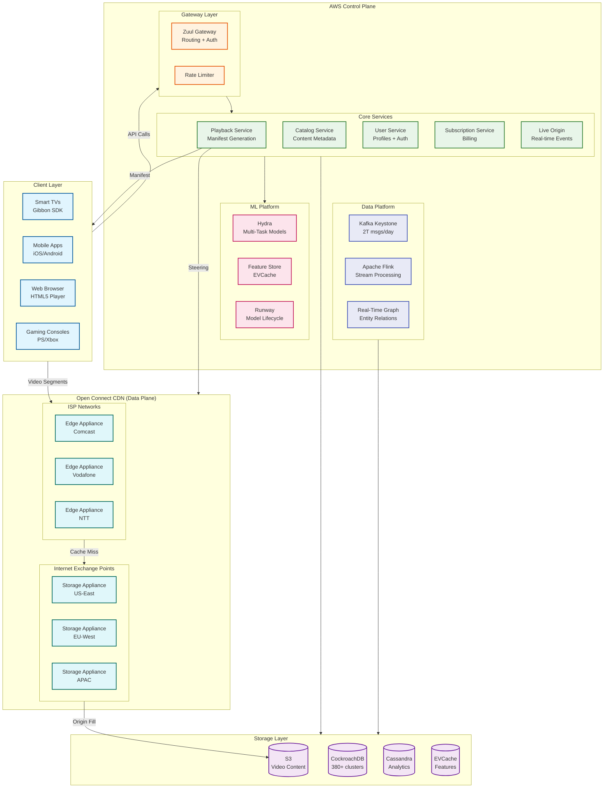
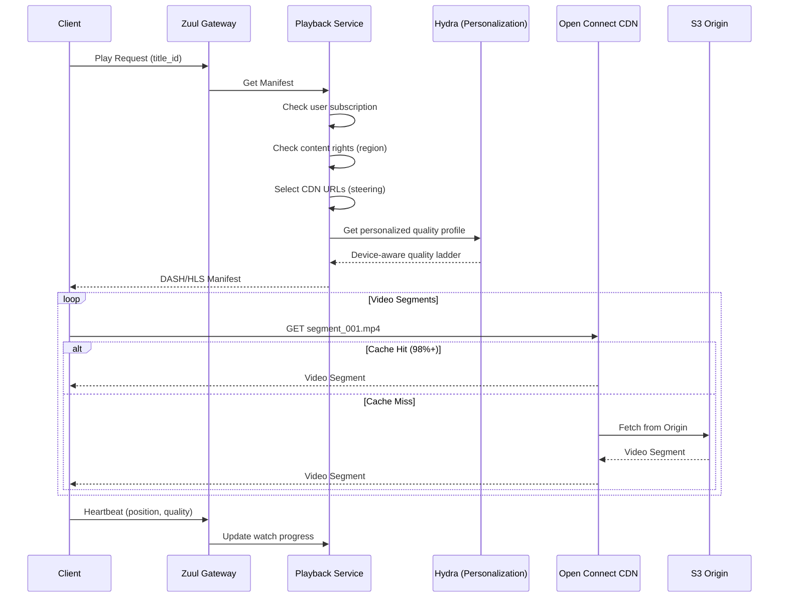
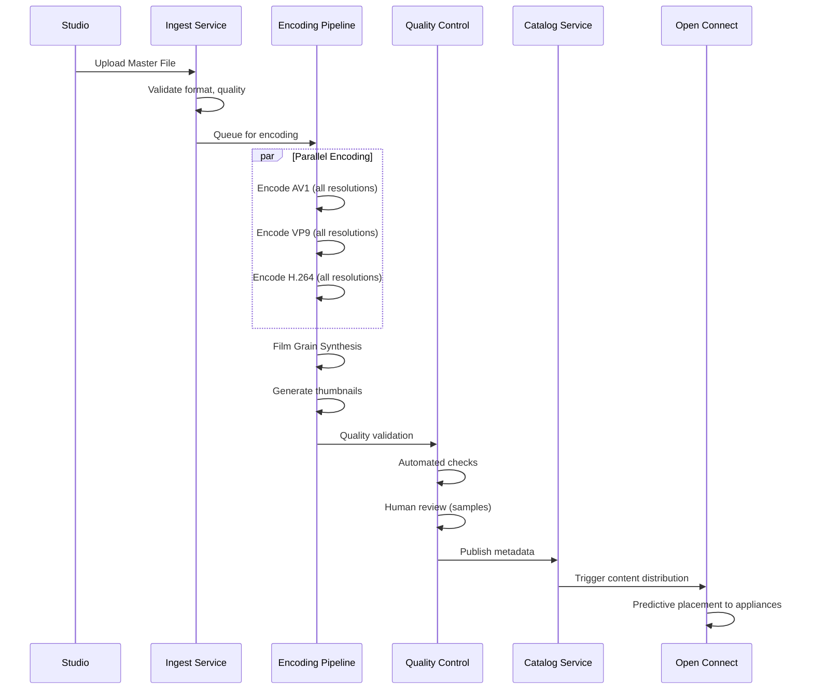
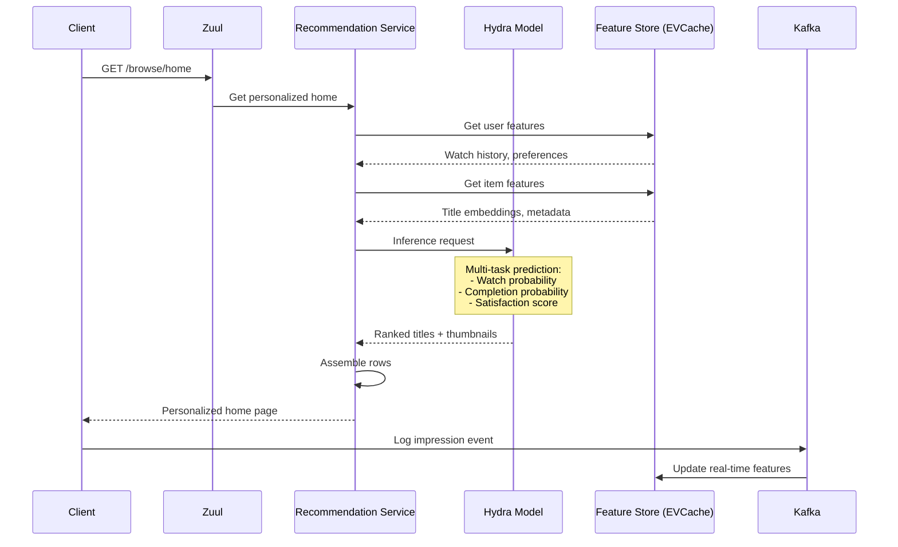
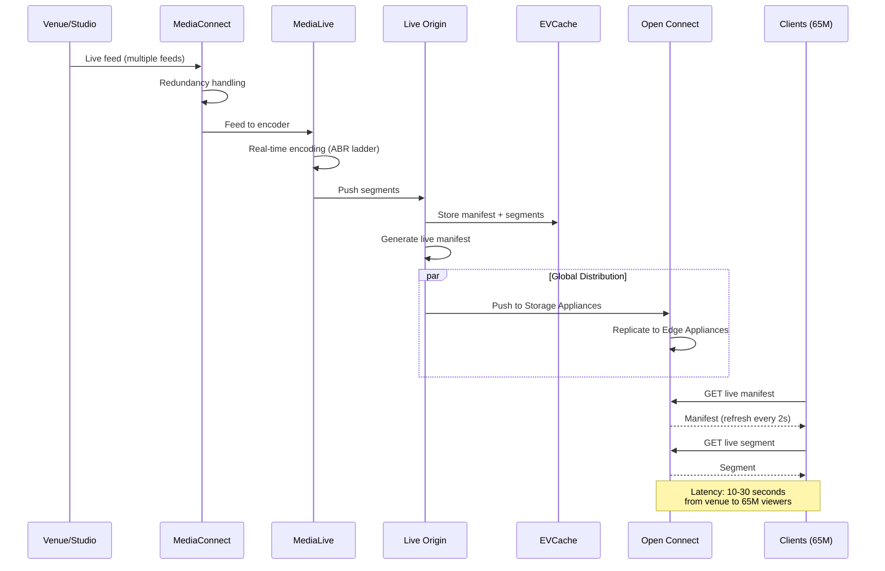
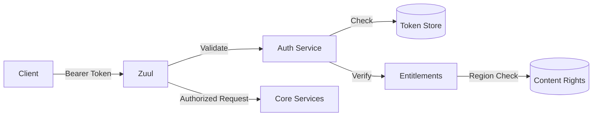

# High-Level Design

[← Back to Index](./00-index.md)

---

## System Architecture

Netflix's architecture follows a unique split between **Control Plane** (AWS-hosted services) and **Data Plane** (Open Connect CDN). This separation enables independent evolution and scaling of each plane.



---

## Data Flow Diagrams

### Video Playback Flow



### Content Ingestion Flow



### Personalization Flow



### Live Streaming Flow



---

## Key Architectural Decisions

### 1. Own CDN vs Third-Party CDN

| Aspect | Open Connect (Netflix) | Third-Party (Akamai/Cloudflare) |
|--------|------------------------|----------------------------------|
| **Cost** | CapEx + operational | $1B+/year at Netflix scale |
| **Control** | Full control over caching, routing | Limited customization |
| **ISP Relationships** | Direct partnerships, free hardware | ISP sees as external traffic |
| **Customization** | Predictive caching for catalog | Generic caching rules |
| **Latency** | Embedded in ISP network | Multi-hop from edge |

**Decision:** Build Open Connect
- Netflix traffic is 15%+ of global internet traffic
- Predictable workload (catalog-based, not UGC)
- ISPs benefit from reduced transit costs
- Long-term cost savings justify investment

### 2. Microservices Architecture

| Aspect | Choice | Rationale |
|--------|--------|-----------|
| **Service Granularity** | Domain-driven | Team autonomy, independent scaling |
| **Communication** | Async-first (Kafka) | Decoupled services, resilience |
| **API Layer** | Federated GraphQL (DGS) | Schema stitching, single endpoint |
| **Service Discovery** | Envoy + ODCDS | Zero-config service mesh |
| **Framework** | Spring Boot | Java ecosystem, Netflix OSS |

### 3. Database Strategy

| Data Type | Database | Reason |
|-----------|----------|--------|
| User accounts, billing | CockroachDB | ACID, global consistency |
| Content metadata | CockroachDB | Referential integrity |
| Watch history | Cassandra | High write throughput |
| Analytics events | Cassandra | Time-series, append-only |
| ML features | EVCache | Sub-millisecond reads |
| Real-time graph | Cassandra (KVDAL) | Flexible schema, scale |

### 4. Encoding Strategy

| Decision | Choice | Rationale |
|----------|--------|-----------|
| **Primary Codec** | AV1 | 30%+ bandwidth savings vs H.264 |
| **Fallback Codec** | VP9, H.264 | Device compatibility |
| **Film Grain** | Synthesis | 24-31% bitrate reduction |
| **Per-Device** | Context-Aware Encoding | Mobile vs TV optimization |
| **Encode Timing** | Ahead of time | Encode once, serve millions |

### 5. Personalization Strategy

| Decision | Choice | Rationale |
|----------|--------|-----------|
| **Model Architecture** | Multi-task (Hydra) | Shared representations, efficiency |
| **Feature Store** | EVCache | <10ms latency |
| **Thumbnail Selection** | Per-user personalization | 20-30% engagement lift |
| **Exploration** | Multi-armed bandit | Balance explore/exploit |
| **Inference** | Real-time (<50ms) | Fresh recommendations |

---

## Architecture Pattern Checklist

| Pattern | Decision | Implementation |
|---------|----------|----------------|
| Sync vs Async | **Async-first** | Kafka Keystone for events, sync for playback |
| Event-driven vs Request-response | **Hybrid** | Events for analytics, request for playback |
| Push vs Pull | **Pull** (CDN) | Clients pull segments, manifest-driven |
| Stateless vs Stateful | **Stateless services** | State in databases/cache |
| Read-heavy vs Write-heavy | **Read-heavy** | 95%+ is video streaming |
| Real-time vs Batch | **Hybrid** | Real-time recs, batch model training |
| Edge vs Origin | **Edge-first** | 95% from Open Connect edge |

---

## Component Interaction Matrix

| Component | Interacts With | Protocol | Pattern |
|-----------|---------------|----------|---------|
| Client | Zuul Gateway | HTTPS/gRPC | Request-Response |
| Client | Open Connect | HTTPS (DASH/HLS) | Pull streaming |
| Zuul | All Services | gRPC | Load-balanced |
| Services | Kafka | Async | Event publishing |
| Services | CockroachDB | SQL | Synchronous |
| Services | Cassandra | CQL | Async writes |
| Services | EVCache | Memcached | Cache-aside |
| Flink | Kafka | Streaming | Consumer groups |
| Hydra | Feature Store | gRPC | Real-time inference |

---

## High-Level Component Responsibilities

### Control Plane (AWS)

```
┌─────────────────────────────────────────────────────────────────────────┐
│                         CONTROL PLANE (AWS)                              │
├─────────────────────────────────────────────────────────────────────────┤
│                                                                          │
│  ┌─────────────────────────────────────────────────────────────────┐    │
│  │ GATEWAY LAYER                                                    │    │
│  │  • Zuul: Request routing, authentication, rate limiting         │    │
│  │  • Service mesh: Envoy with ODCDS (zero-config discovery)       │    │
│  └─────────────────────────────────────────────────────────────────┘    │
│                                                                          │
│  ┌─────────────────────────────────────────────────────────────────┐    │
│  │ CORE SERVICES                                                    │    │
│  │  • Playback: Manifest generation, DRM, CDN steering             │    │
│  │  • Catalog: Content metadata, availability, rights              │    │
│  │  • User: Authentication, profiles, preferences                  │    │
│  │  • Subscription: Billing, plans, entitlements                   │    │
│  │  • Live Origin: Real-time event streaming                       │    │
│  └─────────────────────────────────────────────────────────────────┘    │
│                                                                          │
│  ┌─────────────────────────────────────────────────────────────────┐    │
│  │ ML PLATFORM                                                      │    │
│  │  • Hydra: Multi-task personalization models                     │    │
│  │  • Feature Store: Real-time + batch features (EVCache)          │    │
│  │  • Runway: Model lifecycle management                           │    │
│  └─────────────────────────────────────────────────────────────────┘    │
│                                                                          │
│  ┌─────────────────────────────────────────────────────────────────┐    │
│  │ DATA PLATFORM                                                    │    │
│  │  • Kafka Keystone: 2T messages/day event pipeline               │    │
│  │  • Flink: 38M events/second stream processing                   │    │
│  │  • Real-Time Graph: Cross-domain entity relationships           │    │
│  └─────────────────────────────────────────────────────────────────┘    │
│                                                                          │
└─────────────────────────────────────────────────────────────────────────┘
```

### Data Plane (Open Connect)

```
┌─────────────────────────────────────────────────────────────────────────┐
│                       DATA PLANE (OPEN CONNECT)                          │
├─────────────────────────────────────────────────────────────────────────┤
│                                                                          │
│  ┌─────────────────────────────────────────────────────────────────┐    │
│  │ STORAGE APPLIANCES (IXP Level)                                   │    │
│  │  • Located at Internet Exchange Points                          │    │
│  │  • Store full/near-full Netflix catalog                         │    │
│  │  • High storage capacity (100+ TB per appliance)                │    │
│  │  • Serve regional edge appliances                               │    │
│  └─────────────────────────────────────────────────────────────────┘    │
│                                   │                                      │
│                                   ▼                                      │
│  ┌─────────────────────────────────────────────────────────────────┐    │
│  │ EDGE APPLIANCES (ISP Level)                                      │    │
│  │  • Embedded within ISP networks (free to ISPs)                  │    │
│  │  • Store regionally popular content                             │    │
│  │  • Lower latency (last mile delivery)                           │    │
│  │  • 95%+ of traffic served here                                  │    │
│  └─────────────────────────────────────────────────────────────────┘    │
│                                   │                                      │
│                                   ▼                                      │
│  ┌─────────────────────────────────────────────────────────────────┐    │
│  │ CONTENT STEERING                                                 │    │
│  │  • Control plane decides which appliance serves each request    │    │
│  │  • Based on: client location, appliance health, content cache   │    │
│  │  • Manifest includes ranked list of CDN URLs                    │    │
│  └─────────────────────────────────────────────────────────────────┘    │
│                                                                          │
└─────────────────────────────────────────────────────────────────────────┘
```

---

## Technology Stack Summary

```mermaid
flowchart LR
    subgraph Client["Client Stack"]
        GIBBON[Gibbon - TV SDK]
        EXO[ExoPlayer - Android]
        AV[AVPlayer - iOS]
        HTML5[HTML5 Video - Web]
    end

    subgraph Gateway["Gateway Stack"]
        ZUUL[Zuul 2]
        ENVOY[Envoy + ODCDS]
    end

    subgraph Service["Service Stack"]
        SPRING[Spring Boot]
        DGS[DGS - GraphQL]
        GRPC[gRPC]
    end

    subgraph Data["Data Stack"]
        KAFKA[Apache Kafka]
        FLINK[Apache Flink]
        COCKROACH[CockroachDB]
        CASSANDRA[Cassandra]
        EVCACHE[EVCache]
    end

    subgraph ML["ML Stack"]
        HYDRA[Hydra Models]
        RUNWAY[Runway Lifecycle]
        PYTORCH[PyTorch]
    end

    subgraph Infra["Infrastructure"]
        TITUS[Titus - Containers]
        SPINNAKER[Spinnaker - CD]
        CHAOS[Chaos Monkey]
    end

    Client --> Gateway --> Service
    Service --> Data
    Service --> ML
    Data --> Infra
    ML --> Infra

    classDef client fill:#e1f5fe,stroke:#01579b,stroke-width:2px
    classDef gateway fill:#fff3e0,stroke:#e65100,stroke-width:2px
    classDef service fill:#e8f5e9,stroke:#2e7d32,stroke-width:2px
    classDef data fill:#f3e5f5,stroke:#6a1b9a,stroke-width:2px
    classDef ml fill:#fce4ec,stroke:#c2185b,stroke-width:2px
    classDef infra fill:#e0f7fa,stroke:#00695c,stroke-width:2px

    class GIBBON,EXO,AV,HTML5 client
    class ZUUL,ENVOY gateway
    class SPRING,DGS,GRPC service
    class KAFKA,FLINK,COCKROACH,CASSANDRA,EVCACHE data
    class HYDRA,RUNWAY,PYTORCH ml
    class TITUS,SPINNAKER,CHAOS infra
```



---

## Cross-Cutting Concerns

### Authentication & Authorization



### Observability

| Concern | Tool | Purpose |
|---------|------|---------|
| Metrics | Atlas | Custom time-series DB |
| Tracing | Zipkin-style | Distributed request tracing |
| Logging | Structured logs | Centralized log aggregation |
| Alerting | Mantis | Real-time anomaly detection |

### Configuration Management

| Type | Solution | Example |
|------|----------|---------|
| Static Config | Archaius | Service endpoints, timeouts |
| Dynamic Config | Feature Flags | A/B tests, rollouts |
| Secrets | Vault-like | API keys, DB credentials |

---

*Next: [Low-Level Design →](./03-low-level-design.md)*
