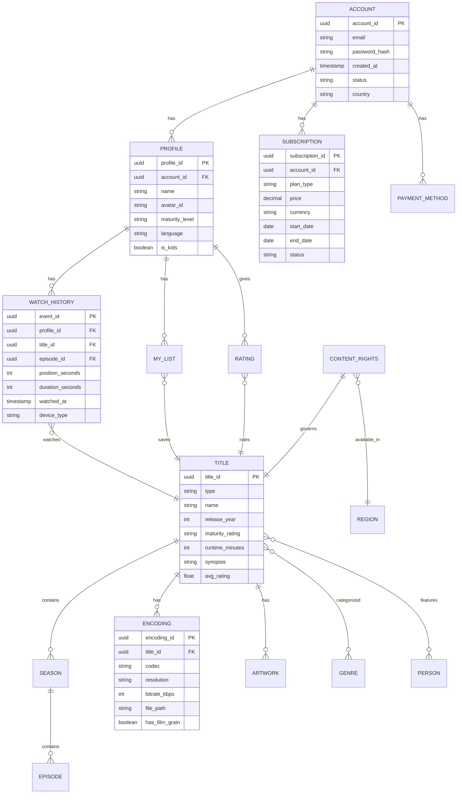

# Low-Level Design

[← Back to Index](./00-index.md)

---

## Data Models

### Core Entity Relationships



### Detailed Schema Definitions

#### Account & User Data (CockroachDB)

```sql
-- Account table (strongly consistent)
CREATE TABLE accounts (
    account_id UUID PRIMARY KEY DEFAULT gen_random_uuid(),
    email VARCHAR(255) UNIQUE NOT NULL,
    password_hash VARCHAR(255) NOT NULL,
    country_code CHAR(2) NOT NULL,
    created_at TIMESTAMPTZ DEFAULT now(),
    status VARCHAR(20) DEFAULT 'active',

    INDEX idx_email (email),
    INDEX idx_country (country_code)
);

-- Profile table
CREATE TABLE profiles (
    profile_id UUID PRIMARY KEY DEFAULT gen_random_uuid(),
    account_id UUID NOT NULL REFERENCES accounts(account_id),
    name VARCHAR(50) NOT NULL,
    avatar_id VARCHAR(50),
    maturity_level VARCHAR(20) DEFAULT 'adult',
    language VARCHAR(10) DEFAULT 'en',
    is_kids BOOLEAN DEFAULT false,
    created_at TIMESTAMPTZ DEFAULT now(),

    INDEX idx_account (account_id),
    CONSTRAINT max_profiles CHECK (
        (SELECT COUNT(*) FROM profiles p WHERE p.account_id = account_id) <= 5
    )
);

-- Subscription table
CREATE TABLE subscriptions (
    subscription_id UUID PRIMARY KEY DEFAULT gen_random_uuid(),
    account_id UUID NOT NULL REFERENCES accounts(account_id),
    plan_type VARCHAR(20) NOT NULL, -- 'basic_ads', 'standard', 'premium'
    price DECIMAL(10,2) NOT NULL,
    currency CHAR(3) NOT NULL,
    billing_cycle VARCHAR(10) DEFAULT 'monthly',
    start_date DATE NOT NULL,
    end_date DATE,
    status VARCHAR(20) DEFAULT 'active',
    auto_renew BOOLEAN DEFAULT true,

    INDEX idx_account_status (account_id, status),
    INDEX idx_end_date (end_date) WHERE status = 'active'
);
```

#### Content Metadata (CockroachDB)

```sql
-- Title table (movies and series)
CREATE TABLE titles (
    title_id UUID PRIMARY KEY DEFAULT gen_random_uuid(),
    type VARCHAR(10) NOT NULL, -- 'movie', 'series'
    name VARCHAR(255) NOT NULL,
    original_name VARCHAR(255),
    release_year INT,
    maturity_rating VARCHAR(10), -- 'G', 'PG', 'PG-13', 'R', 'NC-17'
    runtime_minutes INT,
    synopsis TEXT,
    avg_rating DECIMAL(2,1),
    total_ratings INT DEFAULT 0,

    INDEX idx_type_year (type, release_year DESC),
    INDEX idx_name_search (name gin_trgm_ops)
);

-- Season table
CREATE TABLE seasons (
    season_id UUID PRIMARY KEY DEFAULT gen_random_uuid(),
    title_id UUID NOT NULL REFERENCES titles(title_id),
    season_number INT NOT NULL,
    name VARCHAR(255),
    release_date DATE,
    episode_count INT,

    UNIQUE (title_id, season_number),
    INDEX idx_title (title_id)
);

-- Episode table
CREATE TABLE episodes (
    episode_id UUID PRIMARY KEY DEFAULT gen_random_uuid(),
    season_id UUID NOT NULL REFERENCES seasons(season_id),
    episode_number INT NOT NULL,
    name VARCHAR(255),
    synopsis TEXT,
    runtime_minutes INT,
    release_date DATE,

    UNIQUE (season_id, episode_number),
    INDEX idx_season (season_id)
);

-- Content rights (regional availability)
CREATE TABLE content_rights (
    right_id UUID PRIMARY KEY DEFAULT gen_random_uuid(),
    title_id UUID NOT NULL REFERENCES titles(title_id),
    region_code CHAR(2) NOT NULL,
    available_from DATE NOT NULL,
    available_until DATE,
    is_downloadable BOOLEAN DEFAULT false,

    UNIQUE (title_id, region_code),
    INDEX idx_region_available (region_code, available_from, available_until)
);
```

#### Encoding Metadata

```sql
-- Encoding variants
CREATE TABLE encodings (
    encoding_id UUID PRIMARY KEY DEFAULT gen_random_uuid(),
    title_id UUID NOT NULL REFERENCES titles(title_id),
    episode_id UUID REFERENCES episodes(episode_id),
    codec VARCHAR(10) NOT NULL, -- 'av1', 'vp9', 'h264', 'hevc'
    resolution VARCHAR(10) NOT NULL, -- '4k', '1080p', '720p', '480p', '360p', '240p'
    bitrate_kbps INT NOT NULL,
    file_path VARCHAR(500) NOT NULL,
    file_size_bytes BIGINT,
    has_film_grain BOOLEAN DEFAULT false,
    audio_codec VARCHAR(10), -- 'aac', 'eac3', 'atmos'
    audio_channels INT, -- 2, 5.1, 7.1

    INDEX idx_title_codec (title_id, codec),
    INDEX idx_resolution (resolution)
);

-- Artwork (thumbnails, posters)
CREATE TABLE artwork (
    artwork_id UUID PRIMARY KEY DEFAULT gen_random_uuid(),
    title_id UUID NOT NULL REFERENCES titles(title_id),
    type VARCHAR(20) NOT NULL, -- 'thumbnail', 'poster', 'billboard'
    variant_id VARCHAR(50), -- for A/B testing thumbnails
    url VARCHAR(500) NOT NULL,
    width INT,
    height INT,

    INDEX idx_title_type (title_id, type)
);
```

#### Watch History (Cassandra)

```cql
-- Optimized for time-series writes and profile reads
CREATE TABLE watch_history (
    profile_id UUID,
    watched_date DATE,
    watched_at TIMESTAMP,
    title_id UUID,
    episode_id UUID,
    position_seconds INT,
    duration_seconds INT,
    device_type TEXT,
    quality TEXT,
    completed BOOLEAN,

    PRIMARY KEY ((profile_id), watched_date, watched_at)
) WITH CLUSTERING ORDER BY (watched_date DESC, watched_at DESC)
  AND default_time_to_live = 31536000; -- 1 year TTL

-- Continue watching (most recent per title)
CREATE TABLE continue_watching (
    profile_id UUID,
    title_id UUID,
    episode_id UUID,
    position_seconds INT,
    total_seconds INT,
    updated_at TIMESTAMP,

    PRIMARY KEY ((profile_id), updated_at)
) WITH CLUSTERING ORDER BY (updated_at DESC);
```

#### Feature Store Schema (EVCache/Redis-like)

```
-- User Features (key-value)
Key: user_features:{profile_id}
Value: {
    "watch_count_30d": 45,
    "avg_session_minutes": 87,
    "preferred_genres": ["thriller", "sci-fi", "drama"],
    "preferred_actors": ["uuid1", "uuid2"],
    "device_distribution": {"tv": 0.6, "mobile": 0.3, "web": 0.1},
    "binge_score": 0.75,
    "completion_rate": 0.82,
    "last_watch_embedding": [0.12, -0.34, ...] // 128-dim vector
}
TTL: 1 hour (refreshed on access)

-- Item Features (key-value)
Key: item_features:{title_id}
Value: {
    "popularity_score": 0.89,
    "content_embedding": [0.23, 0.45, ...], // 256-dim vector
    "genre_weights": {"action": 0.7, "thriller": 0.5},
    "avg_completion_rate": 0.78,
    "trending_score": 0.45
}
TTL: 24 hours

-- Real-time Features
Key: realtime:{profile_id}
Value: {
    "current_session_minutes": 45,
    "titles_viewed_session": ["uuid1", "uuid2"],
    "last_interaction_type": "play"
}
TTL: 30 minutes
```

---

## API Design

### REST API Endpoints

#### Playback APIs

```yaml
# Get playback manifest
GET /api/v1/playback/manifest/{titleId}
Headers:
  Authorization: Bearer {token}
  X-Device-Type: tv|mobile|web
  X-Client-Version: 8.1.0
Query:
  episodeId: {uuid}  # optional for series
  quality: auto|4k|1080p|720p
Response:
  {
    "manifestUrl": "https://cdn.netflix.com/manifest/abc123.mpd",
    "drmLicenseUrl": "https://drm.netflix.com/license",
    "cdnUrls": [
      {"priority": 1, "url": "https://oca1.netflix.com/"},
      {"priority": 2, "url": "https://oca2.netflix.com/"}
    ],
    "resumePosition": 1234,
    "qualityLadder": [
      {"resolution": "4k", "bitrate": 15000, "codec": "av1"},
      {"resolution": "1080p", "bitrate": 5000, "codec": "av1"},
      {"resolution": "720p", "bitrate": 3000, "codec": "h264"}
    ]
  }

# Report playback progress (heartbeat)
POST /api/v1/playback/heartbeat
Headers:
  Authorization: Bearer {token}
Body:
  {
    "titleId": "uuid",
    "episodeId": "uuid",
    "position": 1234,
    "duration": 3600,
    "quality": "1080p",
    "bufferHealth": 0.95,
    "bandwidth": 25000,
    "eventType": "progress|pause|seek|complete"
  }
Response: 204 No Content

# Get resume position
GET /api/v1/playback/resume/{profileId}/{titleId}
Response:
  {
    "titleId": "uuid",
    "episodeId": "uuid",
    "position": 1234,
    "totalDuration": 3600,
    "nextEpisode": {
      "episodeId": "uuid",
      "name": "Episode 5",
      "thumbnail": "https://..."
    }
  }
```

#### Browse/Recommendation APIs

```yaml
# Get personalized home page
GET /api/v1/browse/home
Headers:
  Authorization: Bearer {token}
  X-Profile-Id: {profileId}
Response:
  {
    "rows": [
      {
        "id": "continue_watching",
        "title": "Continue Watching",
        "items": [
          {
            "titleId": "uuid",
            "name": "Stranger Things",
            "thumbnail": "https://personalized-thumb...",
            "progress": 0.45,
            "episodeInfo": "S4:E5"
          }
        ]
      },
      {
        "id": "top_10",
        "title": "Top 10 in Your Country",
        "items": [...]
      },
      {
        "id": "because_you_watched_xyz",
        "title": "Because You Watched...",
        "items": [...]
      }
    ]
  }

# Get title details
GET /api/v1/titles/{titleId}
Response:
  {
    "titleId": "uuid",
    "type": "series",
    "name": "Stranger Things",
    "synopsis": "...",
    "releaseYear": 2016,
    "maturityRating": "TV-14",
    "genres": ["Sci-Fi", "Horror", "Drama"],
    "cast": [...],
    "seasons": [
      {"seasonNumber": 1, "episodeCount": 8},
      ...
    ],
    "similarTitles": [...],
    "artwork": {
      "poster": "https://...",
      "billboard": "https://...",
      "thumbnails": ["https://variant1...", "https://variant2..."]
    }
  }

# Search
GET /api/v1/search
Query:
  q: {query}
  profileId: {uuid}
  limit: 20
  offset: 0
Response:
  {
    "results": [...],
    "totalCount": 150,
    "suggestions": ["stranger things", "strange new worlds"]
  }
```

#### User/Profile APIs

```yaml
# Get profile
GET /api/v1/profiles/{profileId}
Response:
  {
    "profileId": "uuid",
    "name": "John",
    "avatar": "https://...",
    "maturityLevel": "adult",
    "language": "en",
    "isKids": false,
    "preferences": {
      "autoplayNext": true,
      "autoplayPreviews": false
    }
  }

# Update profile
PATCH /api/v1/profiles/{profileId}
Body:
  {
    "name": "John",
    "language": "es",
    "maturityLevel": "teen"
  }

# Add to My List
POST /api/v1/profiles/{profileId}/my-list
Body:
  {"titleId": "uuid"}

# Rate title
POST /api/v1/profiles/{profileId}/ratings
Body:
  {
    "titleId": "uuid",
    "rating": "thumbs_up" // or "thumbs_down"
  }
```

### GraphQL Schema (Federated DGS)

```graphql
# Root Query
type Query {
  # Profile-scoped queries
  home(profileId: ID!): HomePage!
  title(titleId: ID!): Title
  search(query: String!, profileId: ID!, limit: Int = 20): SearchResult!

  # Account-scoped queries
  account: Account!
  profiles: [Profile!]!
}

type Mutation {
  # Playback
  reportProgress(input: ProgressInput!): Boolean!

  # Profile
  addToMyList(profileId: ID!, titleId: ID!): Boolean!
  removeFromMyList(profileId: ID!, titleId: ID!): Boolean!
  rateTitle(profileId: ID!, titleId: ID!, rating: Rating!): Boolean!

  # Account
  updateProfile(profileId: ID!, input: ProfileInput!): Profile!
}

# Core Types
type HomePage {
  rows: [HomeRow!]!
}

type HomeRow {
  id: String!
  title: String!
  items: [TitleCard!]!
}

type TitleCard {
  titleId: ID!
  name: String!
  thumbnail(variant: String): String!
  progress: Float
  episodeInfo: String
}

type Title {
  titleId: ID!
  type: TitleType!
  name: String!
  synopsis: String
  releaseYear: Int
  maturityRating: String
  runtime: Int
  genres: [Genre!]!
  cast: [Person!]!
  seasons: [Season!]  # null for movies
  similarTitles: [Title!]!
  artwork: Artwork!
}

type Season {
  seasonNumber: Int!
  name: String
  episodes: [Episode!]!
}

type Episode {
  episodeId: ID!
  episodeNumber: Int!
  name: String
  synopsis: String
  runtime: Int
  thumbnail: String
}

enum TitleType {
  MOVIE
  SERIES
}

enum Rating {
  THUMBS_UP
  THUMBS_DOWN
}
```

---

## Core Algorithms

### 1. Hybrid ABR (Adaptive Bitrate) Algorithm

```
ALGORITHM: HybridABR

PURPOSE: Select optimal video quality based on network conditions and buffer state

INPUTS:
  - bandwidth_samples: array of recent bandwidth measurements (Mbps)
  - buffer_level: current buffer in seconds
  - quality_ladder: available quality levels with bitrates
  - device_type: tv|mobile|web
  - session_phase: startup|stable|seeking

OUTPUTS:
  - selected_quality: quality level to use for next segment

CONSTANTS:
  MIN_BUFFER = 5 seconds      // minimum safe buffer
  MAX_BUFFER = 30 seconds     // target full buffer
  STARTUP_THRESHOLD = 10 seconds
  BANDWIDTH_SAFETY_FACTOR = 0.85

FUNCTION estimate_bandwidth(samples):
  // Weighted average favoring recent samples
  weights = [0.4, 0.3, 0.2, 0.1]  // most recent first
  weighted_sum = 0
  weight_total = 0

  FOR i = 0 TO min(len(samples), len(weights)):
    weighted_sum += samples[i] * weights[i]
    weight_total += weights[i]

  RETURN weighted_sum / weight_total

FUNCTION throughput_based_selection(bandwidth, ladder):
  safe_bandwidth = bandwidth * BANDWIDTH_SAFETY_FACTOR

  // Select highest quality that fits in bandwidth
  selected = ladder[0]  // lowest quality as default
  FOR quality IN ladder:
    IF quality.bitrate <= safe_bandwidth * 1000:  // convert to kbps
      selected = quality

  RETURN selected

FUNCTION buffer_based_selection(buffer_level, ladder):
  // Map buffer level to quality
  buffer_ratio = buffer_level / MAX_BUFFER

  IF buffer_ratio < 0.2:
    RETURN ladder[0]  // lowest quality
  ELSE IF buffer_ratio < 0.4:
    RETURN ladder[len(ladder) / 4]
  ELSE IF buffer_ratio < 0.6:
    RETURN ladder[len(ladder) / 2]
  ELSE IF buffer_ratio < 0.8:
    RETURN ladder[3 * len(ladder) / 4]
  ELSE:
    RETURN ladder[-1]  // highest quality

FUNCTION select_quality(inputs):
  bandwidth = estimate_bandwidth(inputs.bandwidth_samples)

  throughput_quality = throughput_based_selection(bandwidth, inputs.quality_ladder)
  buffer_quality = buffer_based_selection(inputs.buffer_level, inputs.quality_ladder)

  // Determine weights based on session phase
  IF inputs.session_phase == "startup":
    // Prioritize throughput for fast startup
    throughput_weight = 0.8
    buffer_weight = 0.2
  ELSE IF inputs.buffer_level < MIN_BUFFER:
    // Prioritize buffer when running low
    throughput_weight = 0.3
    buffer_weight = 0.7
  ELSE:
    // Balanced in stable state
    throughput_weight = 0.5
    buffer_weight = 0.5

  // Combine recommendations
  throughput_index = index_of(throughput_quality, inputs.quality_ladder)
  buffer_index = index_of(buffer_quality, inputs.quality_ladder)

  weighted_index = round(
    throughput_weight * throughput_index +
    buffer_weight * buffer_index
  )

  // Device-specific adjustments
  IF inputs.device_type == "mobile":
    // Cap at 1080p for mobile
    max_index = index_where(resolution == "1080p", inputs.quality_ladder)
    weighted_index = min(weighted_index, max_index)

  RETURN inputs.quality_ladder[weighted_index]

COMPLEXITY: O(n) where n = number of quality levels
```

### 2. Content Placement Algorithm (Open Connect)

```
ALGORITHM: PredictiveContentPlacement

PURPOSE: Determine which content to place on which Open Connect appliances

INPUTS:
  - catalog: all available titles
  - appliances: list of OCA appliances with capacity
  - historical_views: viewing patterns by region/time
  - release_schedule: upcoming content releases

OUTPUTS:
  - placement_decisions: mapping of titles to appliances

FUNCTION predict_demand(title, region, time_window):
  // Base demand from historical data
  IF title.is_new:
    base_demand = predict_new_title_demand(title)
  ELSE:
    base_demand = get_historical_demand(title, region)

  // Apply modifiers
  release_boost = 1.0
  IF title.release_date within time_window:
    days_since_release = (now - title.release_date).days
    release_boost = max(1.0, 10.0 - days_since_release * 0.5)

  trending_boost = get_trending_score(title, region)
  seasonal_factor = get_seasonal_factor(title.genres, time_window)

  RETURN base_demand * release_boost * trending_boost * seasonal_factor

FUNCTION predict_new_title_demand(title):
  // Use similar titles as baseline
  similar_titles = find_similar_titles(title)
  avg_first_week = average([t.first_week_views FOR t IN similar_titles])

  // Adjust for marketing/promotion level
  promo_multiplier = get_promotion_level(title)

  RETURN avg_first_week * promo_multiplier

FUNCTION calculate_placement():
  placement = {}

  FOR region IN regions:
    region_appliances = get_appliances(region)

    // Calculate demand for all titles in region
    demand_scores = []
    FOR title IN catalog:
      IF title.available_in(region):
        score = predict_demand(title, region, next_7_days)
        demand_scores.append((title, score))

    // Sort by demand
    demand_scores.sort(by=score, descending=True)

    // Greedy placement
    FOR appliance IN region_appliances:
      available_capacity = appliance.capacity

      FOR (title, score) IN demand_scores:
        IF title NOT IN placement[appliance]:
          title_size = get_all_encodings_size(title)

          IF title_size <= available_capacity:
            placement[appliance].add(title)
            available_capacity -= title_size

  RETURN placement

FUNCTION optimize_placement():
  // Run daily to adjust for changing demand
  current_placement = get_current_placement()
  predicted_demand = calculate_placement()

  // Calculate diff
  to_add = predicted_demand - current_placement
  to_remove = current_placement - predicted_demand

  // Prioritize by demand score
  FOR (appliance, title) IN to_add:
    schedule_replication(title, appliance)

  FOR (appliance, title) IN to_remove:
    IF appliance.capacity_used > 0.9:
      schedule_eviction(title, appliance)

COMPLEXITY: O(T * A * log T) where T = titles, A = appliances
```

### 3. Hydra Personalization Ranking

```
ALGORITHM: HydraRanking

PURPOSE: Generate personalized content recommendations

INPUTS:
  - profile_id: user profile identifier
  - context: {device, time_of_day, day_of_week}
  - candidate_titles: titles to rank (pre-filtered)

OUTPUTS:
  - ranked_titles: ordered list with personalized thumbnails

FUNCTION get_features(profile_id, title_ids):
  // Fetch from feature store (EVCache)
  user_features = feature_store.get("user_features:" + profile_id)

  item_features = []
  FOR title_id IN title_ids:
    features = feature_store.get("item_features:" + title_id)
    item_features.append(features)

  realtime_features = feature_store.get("realtime:" + profile_id)

  RETURN {
    user: user_features,
    items: item_features,
    realtime: realtime_features
  }

FUNCTION hydra_inference(features, context):
  // Multi-task model inference
  // Shared representation layer
  user_embedding = encode_user(features.user)
  context_embedding = encode_context(context)

  scores = []
  FOR item IN features.items:
    item_embedding = encode_item(item)

    // Concatenate embeddings
    combined = concat(user_embedding, item_embedding, context_embedding)

    // Multi-task prediction heads
    watch_prob = watch_head(combined)       // P(user watches)
    completion_prob = completion_head(combined)  // P(user completes)
    satisfaction = satisfaction_head(combined)   // Expected satisfaction

    // Combined score
    score = 0.5 * watch_prob + 0.3 * completion_prob + 0.2 * satisfaction

    scores.append({
      title_id: item.title_id,
      score: score,
      watch_prob: watch_prob
    })

  RETURN scores

FUNCTION select_thumbnail(profile_id, title_id):
  // Multi-armed bandit for thumbnail selection
  variants = get_thumbnail_variants(title_id)

  IF random() < EXPLORATION_RATE:
    // Explore: random variant
    RETURN random.choice(variants)
  ELSE:
    // Exploit: best performing for similar users
    user_segment = get_user_segment(profile_id)
    performance = get_thumbnail_performance(title_id, user_segment)
    RETURN argmax(performance)

FUNCTION generate_recommendations(profile_id, context):
  // Stage 1: Candidate generation (broad retrieval)
  candidates = []
  candidates.extend(get_trending(context.region))
  candidates.extend(get_new_releases())
  candidates.extend(get_similar_to_watched(profile_id))
  candidates.extend(get_collaborative_candidates(profile_id))
  candidates = deduplicate(candidates)

  // Stage 2: Feature retrieval
  features = get_features(profile_id, candidates)

  // Stage 3: Ranking
  scores = hydra_inference(features, context)
  ranked = sort(scores, by=score, descending=True)

  // Stage 4: Diversification
  diversified = diversify(ranked, min_genre_variety=3)

  // Stage 5: Thumbnail selection
  FOR item IN diversified:
    item.thumbnail = select_thumbnail(profile_id, item.title_id)

  RETURN diversified

COMPLEXITY: O(n) for ranking, O(1) for inference (fixed model size)
```

### 4. Film Grain Synthesis

```
ALGORITHM: FilmGrainSynthesis

PURPOSE: Reduce bitrate by encoding video without grain and synthesizing at playback

ENCODING PHASE:

FUNCTION analyze_grain(frame):
  // Detect grain characteristics
  high_freq = apply_highpass_filter(frame)

  grain_params = {
    intensity: measure_variance(high_freq),
    size: estimate_grain_size(high_freq),
    color_correlation: measure_chroma_correlation(high_freq),
    temporal_variation: 0  // filled during sequence analysis
  }

  RETURN grain_params

FUNCTION encode_with_grain_removal(video):
  grain_metadata = []
  clean_frames = []

  FOR frame IN video.frames:
    // Analyze grain
    params = analyze_grain(frame)
    grain_metadata.append(params)

    // Remove grain (denoise)
    clean_frame = apply_temporal_denoise(frame, params)
    clean_frames.append(clean_frame)

  // Encode clean video (30% smaller)
  encoded_video = av1_encode(clean_frames)

  // Store grain metadata in SEI/OBU
  encoded_video.metadata = grain_metadata

  RETURN encoded_video

PLAYBACK PHASE:

FUNCTION synthesize_grain(decoded_frame, grain_params):
  // Generate synthetic grain pattern
  grain_pattern = generate_perlin_noise(
    width=decoded_frame.width,
    height=decoded_frame.height,
    intensity=grain_params.intensity,
    size=grain_params.size
  )

  // Apply color correlation
  IF grain_params.color_correlation > 0:
    grain_pattern = apply_color_correlation(grain_pattern, grain_params)

  // Blend with decoded frame
  output_frame = decoded_frame + grain_pattern

  RETURN output_frame

FUNCTION playback_with_grain_synthesis(video_stream):
  decoder = create_av1_decoder()

  FOR chunk IN video_stream:
    decoded_frame = decoder.decode(chunk.video_data)
    grain_params = chunk.metadata.grain_params

    IF grain_params.intensity > 0:
      output_frame = synthesize_grain(decoded_frame, grain_params)
    ELSE:
      output_frame = decoded_frame

    display(output_frame)

BENEFITS:
  - 24% bitrate reduction at playback start
  - 31.6% average bitrate reduction
  - Preserves cinematic look
  - Synthesis is computationally cheap on modern GPUs
```

---

## Indexing Strategy

### CockroachDB Indexes

```sql
-- Primary access patterns

-- Account lookup by email (login)
CREATE INDEX idx_accounts_email ON accounts(email);

-- Profile lookup by account
CREATE INDEX idx_profiles_account ON profiles(account_id);

-- Active subscriptions
CREATE INDEX idx_subscriptions_active ON subscriptions(account_id, status)
WHERE status = 'active';

-- Title search (trigram for fuzzy search)
CREATE INDEX idx_titles_name_search ON titles
USING GIN (name gin_trgm_ops);

-- Content availability by region
CREATE INDEX idx_rights_region_date ON content_rights(region_code, available_from, available_until);

-- Encodings by title and codec
CREATE INDEX idx_encodings_title_codec ON encodings(title_id, codec, resolution);
```

### Cassandra Partition Keys

| Table | Partition Key | Clustering | Rationale |
|-------|---------------|------------|-----------|
| watch_history | profile_id | watched_date DESC, watched_at DESC | User's history sorted by time |
| continue_watching | profile_id | updated_at DESC | Quick resume lookup |
| viewing_events | title_id, date | timestamp DESC | Analytics aggregation |
| trending | region, date | rank ASC | Regional trending lists |

---

## Data Retention Policy

| Data Type | Hot Storage | Warm Storage | Cold/Archive | Deletion |
|-----------|-------------|--------------|--------------|----------|
| Watch History | 30 days | 1 year | 3 years | 5 years |
| Viewing Events | 7 days | 30 days | 1 year | 2 years |
| User Features | 1 hour (cache) | - | - | On demand |
| Recommendations | 24 hours | - | - | Refresh |
| Content Metadata | Permanent | - | - | Never |
| Video Content | Permanent | - | - | License expiry |

---

*Next: [Deep Dive & Bottlenecks →](./04-deep-dive-and-bottlenecks.md)*
