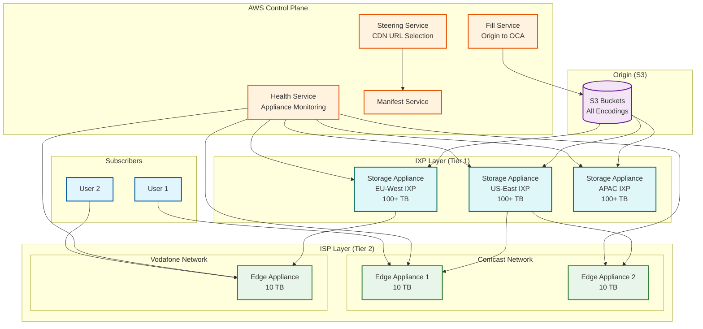
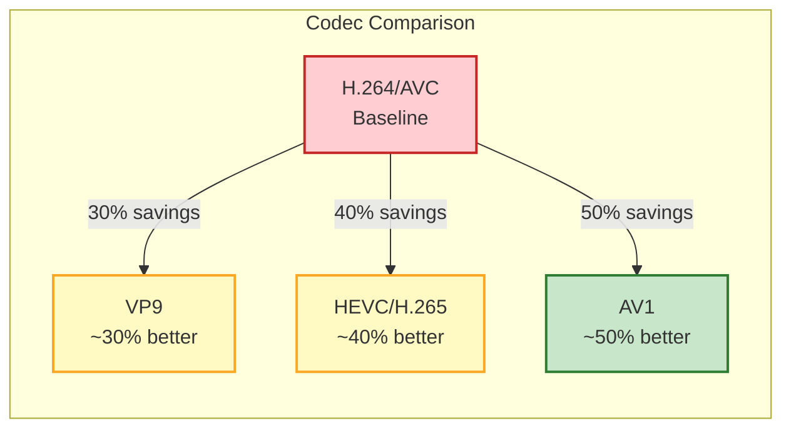
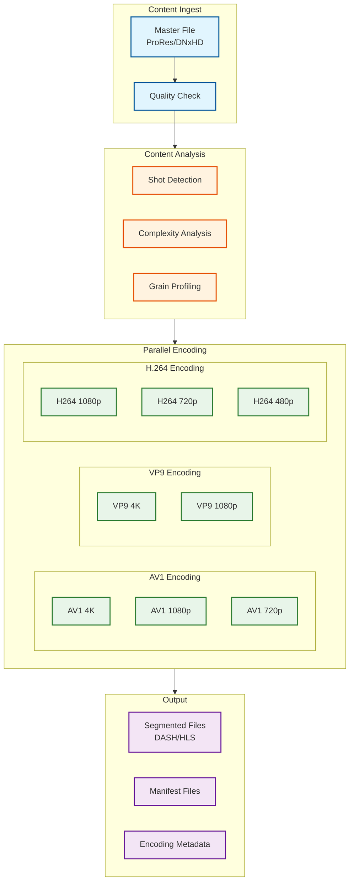
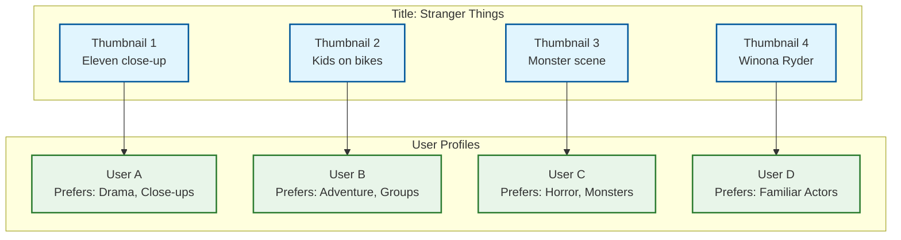
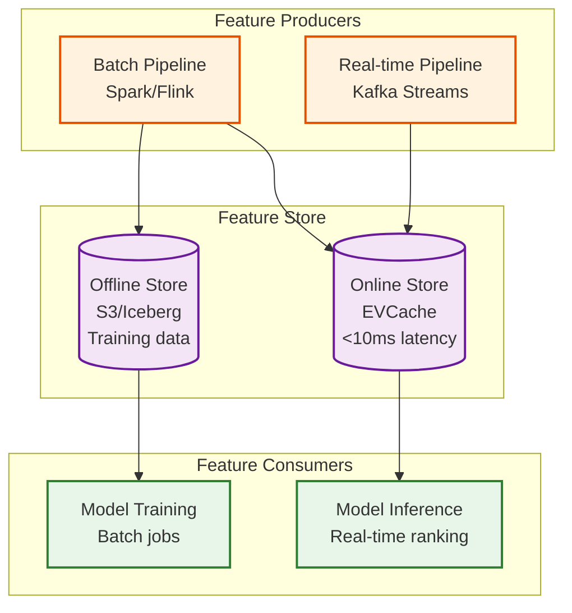

# Deep Dive & Bottlenecks

[← Back to Index](./00-index.md)

---

## Critical Component 1: Open Connect CDN

### Architecture Deep Dive

Open Connect is Netflix's custom-built CDN that delivers **95%+ of all streaming traffic** directly from appliances embedded within ISP networks. This is fundamentally different from traditional CDNs.



### Two-Tier Architecture

| Tier | Appliance Type | Location | Storage | Purpose |
|------|----------------|----------|---------|---------|
| **Tier 1** | Storage Appliance | Internet Exchange Points | 100+ TB | Store full/near-full catalog |
| **Tier 2** | Edge Appliance | ISP Data Centers | 10-30 TB | Store regionally popular content |

### How It Works

**1. Content Distribution (Proactive)**

```
PROCESS: Content Replication

1. New content encoded and stored in S3 (origin)

2. Fill Service determines placement:
   - Predict regional demand
   - Select target appliances
   - Schedule replication

3. Background replication:
   Origin → Storage Appliances (IXP) → Edge Appliances (ISP)

4. Placement optimized nightly based on:
   - Actual viewing patterns
   - Cache hit rates
   - Storage capacity
```

**2. Request Routing (Steering)**

```
PROCESS: Client Request Flow

1. Client requests playback manifest from Playback Service

2. Steering Service selects CDN URLs:
   - Client IP → ISP identification
   - Check local Edge Appliance availability
   - Check content cache status
   - Consider appliance health/load

3. Manifest includes ranked CDN URLs:
   [
     {url: "edge-appliance-local.isp.com", priority: 1},
     {url: "storage-appliance.ixp.com", priority: 2},
     {url: "origin.s3.netflix.com", priority: 3}
   ]

4. Client fetches segments from highest priority available
```

**3. Cache Fill (Reactive)**

```
PROCESS: Cache Miss Handling

1. Edge Appliance receives request for uncached content

2. Edge checks Storage Appliance (IXP tier)
   IF cached:
     Serve from Storage Appliance
     Background fill to Edge

3. IF not in Storage Appliance:
   Fetch from S3 Origin
   Cache in Storage Appliance
   Serve to Edge

4. Future requests served from local cache
```

### Why This Architecture Works

| Factor | Open Connect Advantage |
|--------|------------------------|
| **Cost** | ~95% reduction vs third-party CDN |
| **Latency** | Content within ISP network (no transit) |
| **ISP Benefit** | Reduces ISP's internet transit costs |
| **Control** | Custom caching logic for video |
| **Scale** | Linear scaling by adding appliances |

### Failure Modes & Handling

| Failure | Impact | Handling |
|---------|--------|----------|
| Edge Appliance down | Clients in that ISP affected | Fallback to Storage Appliance or other Edge |
| Storage Appliance down | Multiple Edge Appliances affected | Fallback to Origin, increased latency |
| Origin (S3) down | Cannot serve cache misses | Serve from cache, degrade new content |
| Steering Service down | No CDN URL selection | Clients use cached manifest, default URLs |

---

## Critical Component 2: AV1 + Film Grain Synthesis

### Why AV1 Matters

AV1 is Netflix's primary codec (30% of streaming as of Dec 2025), providing significant bandwidth savings over previous generations.



### Codec Selection Strategy

| Scenario | Codec | Rationale |
|----------|-------|-----------|
| Smart TV (2020+) | AV1 | Hardware decode, max quality |
| Smart TV (older) | VP9/H.264 | Compatibility |
| Mobile (WiFi) | AV1/VP9 | Bandwidth savings |
| Mobile (cellular) | AV1 | Critical bandwidth savings |
| Web (Chrome) | AV1 | Software decode acceptable |
| Web (Safari) | HEVC | Apple ecosystem |

### Film Grain Synthesis Deep Dive

Film grain is the visual texture in movies shot on film or digitally graded to have a filmic look. Traditional encoding treats grain as noise, wasting bits.

```
TRADITIONAL ENCODING:
┌─────────────────────────────────────────────────────────────────┐
│  Source Frame    →    Encoder    →    Compressed Frame         │
│  (with grain)         (treats        (grain poorly              │
│                        grain as       preserved, high           │
│                        noise)         bitrate)                  │
└─────────────────────────────────────────────────────────────────┘

FILM GRAIN SYNTHESIS:
┌─────────────────────────────────────────────────────────────────┐
│  Source Frame    →    Grain      →    Clean Frame              │
│  (with grain)         Analysis        (grain removed)           │
│                          │                  │                   │
│                          ▼                  ▼                   │
│                    Grain Metadata     Encoder (efficient,       │
│                    (parameters)        lower bitrate)           │
│                          │                  │                   │
│                          ▼                  ▼                   │
│                    ┌──────────────────────────┐                 │
│                    │  Compressed Stream       │                 │
│                    │  (video + grain metadata)│                 │
│                    └──────────────────────────┘                 │
│                                │                                │
│                                ▼                                │
│                    Decoder + Grain Synthesis                    │
│                                │                                │
│                                ▼                                │
│                    Output Frame (grain restored)                │
└─────────────────────────────────────────────────────────────────┘
```

### Film Grain Synthesis Results

| Metric | Value | Context |
|--------|-------|---------|
| Bitrate Reduction (Startup) | 24% | Faster initial load |
| Bitrate Reduction (Average) | 31.6% | Ongoing savings |
| VMAF Score vs H.264 | +4.3 points | Better perceived quality |
| VMAF Score vs HEVC | +0.9 points | Slight improvement |
| Decoding Overhead | <5% | Grain synthesis is cheap |

### Context-Aware Encoding (CAE)

Netflix analyzes each title and encodes with scene-specific optimizations:

```
PROCESS: Context-Aware Encoding

1. TITLE ANALYSIS
   - Shot detection (scene boundaries)
   - Complexity analysis per shot
   - Motion analysis
   - Grain/noise profiling

2. BITRATE ALLOCATION
   - Complex scenes: higher bitrate
   - Static scenes: lower bitrate
   - High motion: optimize for temporal prediction
   - Film grain: apply FGS

3. PER-DEVICE ENCODING
   - TV: Prioritize quality, higher bitrates
   - Mobile: Prioritize efficiency, lower resolutions
   - Tablet: Balance of both

4. QUALITY LADDER GENERATION
   - Title-specific bitrate ladder
   - Optimized switching points
   - Device-appropriate variants
```

### Encoding Pipeline Architecture



---

## Critical Component 3: Hydra Personalization System

### Why Personalization Matters

| Metric | Impact |
|--------|--------|
| Viewing from Recommendations | 75-80% |
| Churn Reduction | $1B+/year savings |
| Engagement Increase | 30% with personalization |
| Thumbnail CTR Improvement | 20-30% |

### Multi-Task Learning Architecture

Hydra uses a single model with shared representations and multiple prediction heads:

```mermaid
flowchart TB
    subgraph Input["Input Features"]
        USER[User Features<br/>watch history, preferences]
        ITEM[Item Features<br/>genre, cast, embeddings]
        CONTEXT[Context Features<br/>device, time, location]
    end

    subgraph SharedLayer["Shared Representation Layer"]
        EMBED[Embedding Layer]
        TRANSFORM[Transformer Blocks]
        SHARED[Shared Dense Layers]
    end

    subgraph TaskHeads["Task-Specific Heads"]
        WATCH[Watch Probability<br/>P(user watches)]
        COMPLETE[Completion Probability<br/>P(user completes)]
        SATISFY[Satisfaction Score<br/>Expected rating]
        ENGAGE[Engagement Duration<br/>Expected minutes]
    end

    subgraph Output["Combined Output"]
        RANK[Ranking Score<br/>Weighted combination]
    end

    Input --> EMBED --> TRANSFORM --> SHARED
    SHARED --> WATCH & COMPLETE & SATISFY & ENGAGE
    WATCH & COMPLETE & SATISFY & ENGAGE --> RANK

    classDef input fill:#e1f5fe,stroke:#01579b,stroke-width:2px
    classDef shared fill:#fff3e0,stroke:#e65100,stroke-width:2px
    classDef heads fill:#e8f5e9,stroke:#2e7d32,stroke-width:2px
    classDef output fill:#fce4ec,stroke:#c2185b,stroke-width:2px

    class USER,ITEM,CONTEXT input
    class EMBED,TRANSFORM,SHARED shared
    class WATCH,COMPLETE,SATISFY,ENGAGE heads
    class RANK output
```

### Why Multi-Task Learning?

| Benefit | Explanation |
|---------|-------------|
| **Shared Representations** | User taste learned once, applied to multiple predictions |
| **Data Efficiency** | Completion data improves watch predictions |
| **Regularization** | Multiple tasks prevent overfitting |
| **Operational Simplicity** | One model instead of many |
| **Inference Efficiency** | Single forward pass for all predictions |

### Two-Stage Recommendation Pipeline

```
STAGE 1: CANDIDATE GENERATION (Broad Retrieval)
─────────────────────────────────────────────────
Goal: Narrow from 17,000 titles to ~500 candidates

Sources:
  - Trending in region (top 100)
  - New releases (recent 30 days)
  - Similar to recently watched (ANN search)
  - Collaborative filtering candidates
  - Genre preferences
  - My List items

Method:
  - Approximate Nearest Neighbor (ANN) search
  - Vector similarity in embedding space
  - Fast (~10ms)

Output: ~500 candidates


STAGE 2: RANKING (Precise Scoring)
─────────────────────────────────────────────────
Goal: Score and rank 500 candidates

Process:
  1. Fetch features from EVCache (<5ms)
  2. Hydra model inference (~20ms)
  3. Score combination: 0.5*watch + 0.3*complete + 0.2*satisfy
  4. Diversification (ensure genre variety)
  5. Business rules (promote new content)

Output: Ranked list with scores
```

### Thumbnail Personalization

Netflix shows different thumbnails to different users for the same title:



**Thumbnail Selection Algorithm:**

```
ALGORITHM: ThumbnailBandit

TYPE: Multi-Armed Bandit (Thompson Sampling)

STATE:
  - For each (thumbnail, user_segment) pair:
    - successes: number of clicks
    - failures: number of impressions without click

FUNCTION select_thumbnail(user, title):
  user_segment = get_segment(user)  // Based on preferences
  variants = get_thumbnail_variants(title)

  IF random() < EXPLORATION_RATE (0.1):
    // Explore: try random variant
    RETURN random.choice(variants)

  // Exploit: Thompson Sampling
  scores = []
  FOR variant IN variants:
    // Sample from Beta distribution
    alpha = successes[variant, user_segment] + 1
    beta = failures[variant, user_segment] + 1
    score = sample_beta(alpha, beta)
    scores.append((variant, score))

  RETURN argmax(scores)

FUNCTION update_on_impression(user, title, variant, clicked):
  user_segment = get_segment(user)
  IF clicked:
    successes[variant, user_segment] += 1
  ELSE:
    failures[variant, user_segment] += 1
```

### Feature Store Architecture



---

## Concurrency & Race Conditions

### Watch Progress Sync

**Problem:** User watches on TV, then switches to mobile. Progress must sync.

```
SCENARIO: Cross-Device Progress Sync

Timeline:
  T0: User at position 1000s on TV
  T1: TV sends heartbeat (position=1000s)
  T2: User switches to mobile
  T3: Mobile fetches resume position
  T4: TV sends final heartbeat (position=1005s)
  T5: Mobile starts at 1000s (missed T4 update)

SOLUTION: Eventual Consistency with Client Reconciliation

1. Heartbeats are idempotent (last-write-wins by timestamp)
2. Client fetches position on start
3. If local position > server position, use local
4. Periodic sync during playback
5. On pause/stop, immediate sync

IMPLEMENTATION:
  - Cassandra with LWW (Last-Write-Wins) merge
  - Timestamp included in all writes
  - Client caches position locally
  - Sync on app foreground
```

### Concurrent Playback Limits

**Problem:** Account limited to X concurrent streams (e.g., 2 for Basic, 4 for Premium).

```
ALGORITHM: ConcurrentStreamEnforcement

DATA STRUCTURE:
  - Redis/EVCache sorted set per account
  - Key: streams:{account_id}
  - Members: {device_id, timestamp}
  - TTL: 5 minutes (auto-expire stale streams)

FUNCTION request_stream(account_id, device_id):
  plan = get_subscription_plan(account_id)
  max_streams = plan.concurrent_limit

  // Atomic check-and-add
  WATCH streams:{account_id}
  current_streams = ZRANGEBYSCORE streams:{account_id} (now-300) +inf

  IF len(current_streams) >= max_streams:
    IF device_id NOT IN current_streams:
      RETURN ERROR "Too many concurrent streams"

  // Add/update this device
  ZADD streams:{account_id} now device_id
  EXPIRE streams:{account_id} 300

  RETURN SUCCESS

FUNCTION heartbeat(account_id, device_id):
  // Refresh timestamp
  ZADD streams:{account_id} now device_id
```

### Content Rights Check

**Problem:** Content availability changes mid-stream (license expires).

```
SCENARIO: Mid-Stream License Expiry

Timeline:
  T0: User starts watching title (license valid until T100)
  T50: License for title expires (rights change)
  T60: User still watching (started before expiry)

POLICY OPTIONS:
  1. GRACEFUL: Allow current sessions to complete
  2. STRICT: Terminate session immediately
  3. HYBRID: Allow current session, prevent resume

NETFLIX APPROACH: Graceful with notification

IMPLEMENTATION:
  - Check rights on session start (strict)
  - Check rights on resume (strict)
  - Don't interrupt active sessions
  - Background job removes from catalog
  - Users notified of expiring content
```

---

## Bottleneck Analysis

### Top Bottlenecks

| Rank | Bottleneck | Impact | Cause | Mitigation |
|------|------------|--------|-------|------------|
| **1** | ISP Network Congestion | Degraded quality for region | Peak hours, limited ISP capacity | Add Edge Appliances, ABR adaptation |
| **2** | Feature Store Latency | Slow recommendations | Cold cache, high QPS | Aggressive caching, pre-computation |
| **3** | Encoding Throughput | New content delays | Complex AV1 encoding | Parallel encoding, GPU acceleration |
| **4** | Live Event Scaling | Outage during live events | Unprecedented concurrency | Pre-warming, separate architecture |
| **5** | Cold Start Problem | Poor initial recommendations | New users, no history | Content-based fallback, trending |

### Bottleneck 1: ISP Network Congestion

```
PROBLEM:
  - Peak hours (7-11 PM) saturate ISP links
  - Edge Appliances can't serve fast enough
  - Quality degrades for all users in ISP

DETECTION:
  - Monitor appliance bandwidth utilization
  - Track rebuffering rates per ISP
  - Alert on quality degradation trends

MITIGATION:
  1. SHORT-TERM: ABR aggressively reduces quality
  2. MEDIUM-TERM: Deploy additional Edge Appliances
  3. LONG-TERM: ISP network upgrades (outside Netflix control)

DEGRADATION LADDER:
  - Utilization > 70%: Bias ABR toward lower qualities
  - Utilization > 85%: Disable 4K for new sessions
  - Utilization > 95%: Disable HD for new sessions
```

### Bottleneck 2: Feature Store Latency

```
PROBLEM:
  - EVCache miss → slow feature fetch
  - Feature computation on demand → high latency
  - Recommendation latency exceeds 50ms SLO

ROOT CAUSES:
  - Cache eviction during peak
  - New users without computed features
  - Feature computation backpressure

MITIGATION:
  1. PRE-COMPUTATION: Compute features in batch, push to cache
  2. CACHE WARMING: Pre-load features for active users
  3. FALLBACK: Use approximate features from user segment
  4. GRACEFUL DEGRADATION: Return cached recommendations if fresh unavailable

IMPLEMENTATION:
  - Background job computes features every hour
  - On user login, pre-warm cache
  - LRU eviction with priority (paying users > trial)
  - Circuit breaker on feature service
```

### Bottleneck 3: Live Event Scaling

```
PROBLEM:
  - Live events have unprecedented concurrency (65M+)
  - CDN not designed for live (no pre-caching)
  - Manifest refresh storms

MITIGATION (Learned from Tyson vs Paul 2024):

1. SEPARATE ARCHITECTURE
   - Live Origin Service (not VOD origin)
   - EVCache for live manifests
   - Different CDN URLs for live

2. PRE-WARMING
   - Deploy additional capacity before event
   - Pre-warm Edge Appliances with live URLs
   - Notify ISPs of expected traffic

3. STAGGERED START
   - Gradual admission to event
   - Virtual waiting room
   - Regional rollout

4. GRACEFUL DEGRADATION
   - Accept higher latency (30s vs real-time)
   - Reduce quality to ensure delivery
   - Prioritize audio continuity
```

---

## System Health Indicators

| Component | Health Metric | Healthy | Warning | Critical |
|-----------|---------------|---------|---------|----------|
| Open Connect | Cache Hit Rate | >98% | 95-98% | <95% |
| Open Connect | Fill Latency | <100ms | 100-500ms | >500ms |
| Playback | Start Time (p95) | <500ms | 500-1000ms | >1000ms |
| Playback | Rebuffering | <0.5% | 0.5-1% | >1% |
| Hydra | Inference Latency | <30ms | 30-50ms | >50ms |
| Feature Store | Hit Rate | >99% | 95-99% | <95% |
| Kafka | Consumer Lag | <10s | 10s-1min | >1min |

---

*Next: [Scalability & Reliability →](./05-scalability-and-reliability.md)*
