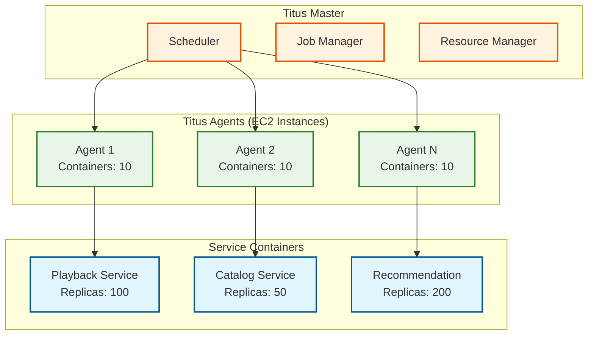
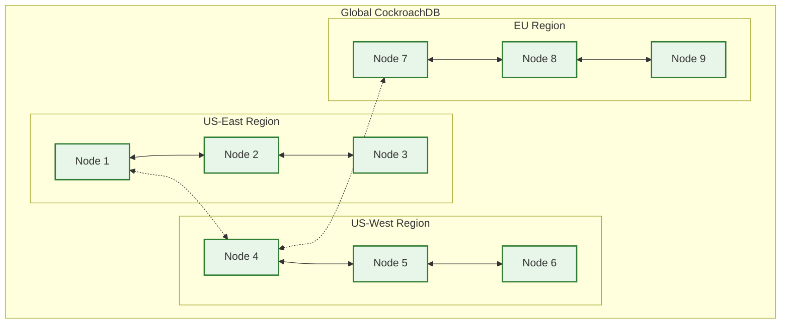
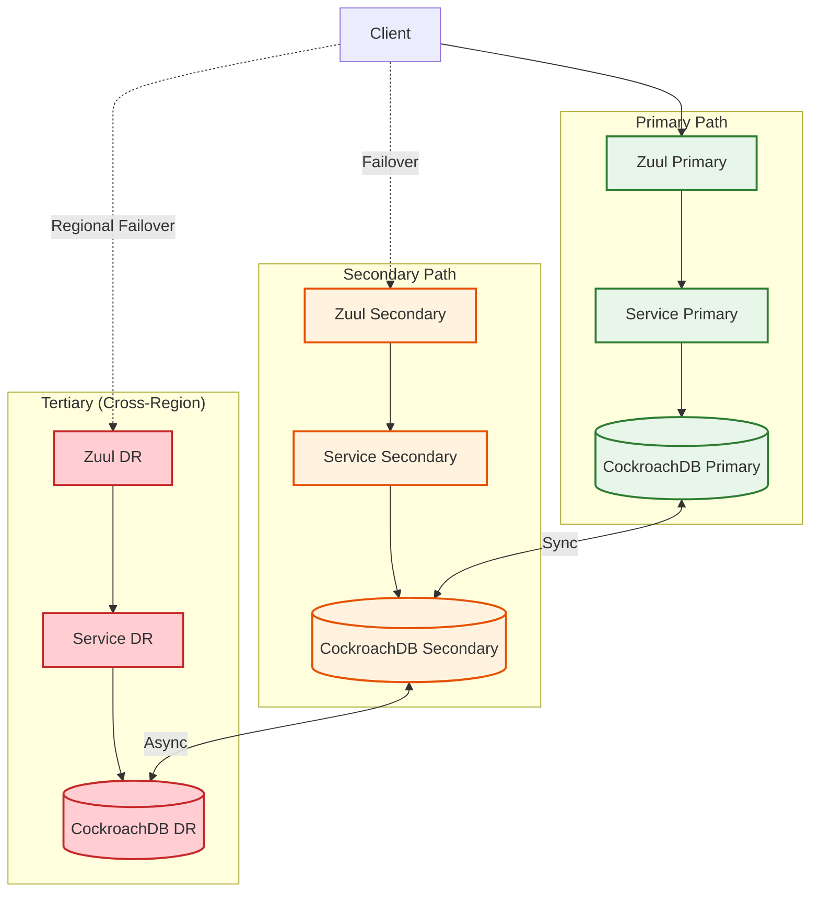
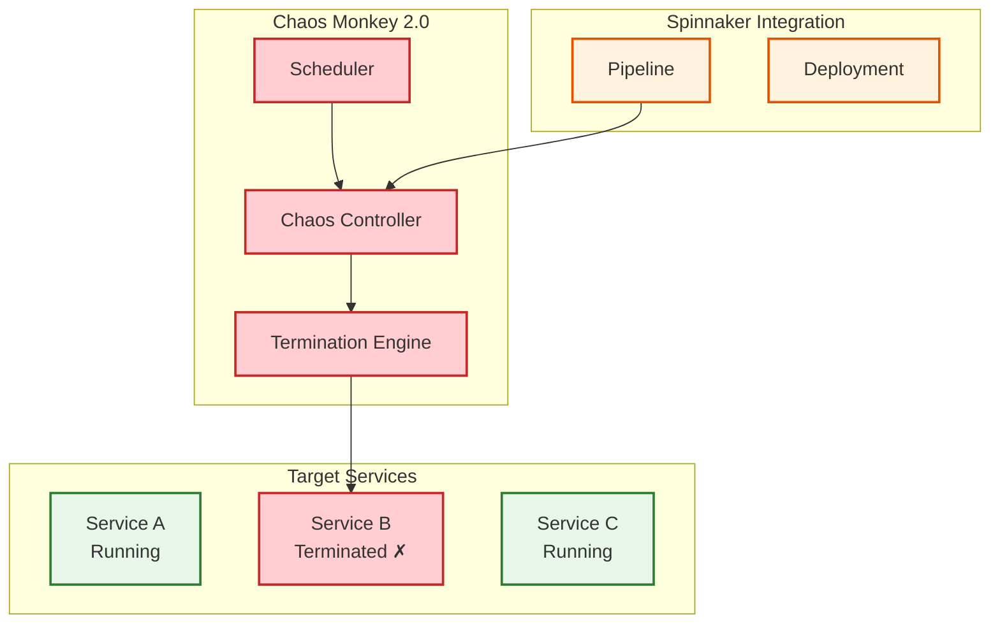
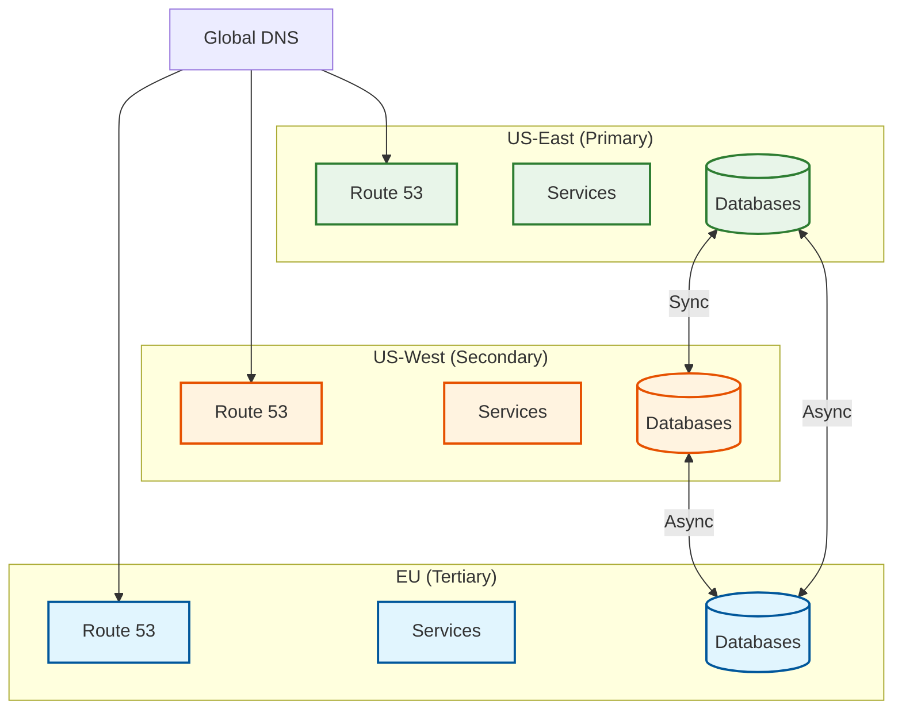

# Scalability & Reliability

[← Back to Index](./00-index.md)

---

## Scalability Strategy

### Horizontal Scaling Overview

| Component | Scaling Strategy | Mechanism | Limit |
|-----------|-----------------|-----------|-------|
| API Gateway (Zuul) | Horizontal | Auto-scaling groups | Unlimited (stateless) |
| Core Services | Horizontal | Titus containers | Unlimited (stateless) |
| Open Connect Edge | Horizontal | Add appliances per ISP | ISP capacity |
| Open Connect Storage | Horizontal | Add appliances per IXP | Regional demand |
| CockroachDB | Horizontal | Add nodes | Automatic rebalancing |
| Cassandra | Horizontal | Add nodes | Consistent hashing |
| EVCache | Horizontal | Add nodes | Memory per node |
| Kafka | Horizontal | Add partitions + brokers | Partition count |

### Titus Container Platform

Titus is Netflix's internal container management platform running on AWS.



**Titus Capabilities:**

| Feature | Description |
|---------|-------------|
| **Job Model** | Spec-based with metadata, resource requirements |
| **Scheduling** | Bin-packing, constraint-based placement |
| **Networking** | TSA (IPv6-to-IPv4), Itman IP management |
| **Integration** | AWS EC2, EBS, ENI |
| **Auto-scaling** | Based on custom metrics (CPU, latency, queue depth) |

### Auto-Scaling Configuration

```yaml
# Example: Playback Service Auto-scaling
service: playback-service
scaling:
  min_instances: 50
  max_instances: 500
  target_metrics:
    - metric: cpu_utilization
      target: 60%
      scale_up_threshold: 70%
      scale_down_threshold: 40%
    - metric: request_latency_p99
      target: 100ms
      scale_up_threshold: 150ms
    - metric: active_streams
      target_per_instance: 1000
  cooldown:
    scale_up: 60s
    scale_down: 300s
  regions:
    - us-east-1
    - us-west-2
    - eu-west-1
```

### Database Scaling

#### CockroachDB Scaling (380+ Clusters)



**CockroachDB Scaling Strategy:**

| Action | Trigger | Process |
|--------|---------|---------|
| Add Node | Storage >70%, CPU >60% | Add node, automatic rebalancing |
| Remove Node | Utilization <30% | Graceful decommission |
| Regional Expansion | New region launch | Deploy 3+ nodes in region |

#### Cassandra Scaling

| Metric | Scaling Action |
|--------|----------------|
| Disk >70% | Add nodes, run cleanup |
| Read latency >10ms | Add read replicas |
| Write throughput saturated | Add nodes, increase RF |

### CDN Scaling (Open Connect)

```
SCALING PROCESS: Adding Edge Appliance to ISP

1. CAPACITY PLANNING
   - Analyze regional viewing patterns
   - Identify under-served ISPs (high fill rates from Storage)
   - Calculate required capacity

2. DEPLOYMENT
   - Coordinate with ISP (free hardware offer)
   - Ship appliance to ISP data center
   - ISP provides rack space, power, connectivity

3. PROVISIONING
   - Appliance phones home to Netflix control plane
   - Receives configuration, certificates
   - Joins Open Connect mesh

4. CONTENT FILL
   - Background replication from Storage Appliances
   - Popularity-based content selection
   - 24-48 hours for initial fill

5. TRAFFIC STEERING
   - Steering service gradually routes traffic
   - Monitor health, performance
   - Full traffic within 1 week
```

---

## Reliability & Fault Tolerance

### Single Points of Failure (SPOF) Analysis

| Component | SPOF Risk | Mitigation |
|-----------|-----------|------------|
| Zuul Gateway | Low | Multiple instances, DNS failover |
| Playback Service | Low | Stateless, multi-AZ |
| Open Connect Edge | Medium | Multiple appliances per ISP |
| Open Connect Storage | Low | Multiple per IXP, origin fallback |
| CockroachDB | Low | Multi-node, multi-region |
| Cassandra | Low | Replication factor 3 |
| EVCache | Medium | Replication, fallback to source |
| Kafka | Low | Replication factor 3, multi-broker |
| Feature Store | Medium | Cache warming, fallback |

### Redundancy Architecture



### Circuit Breaker Pattern (Hystrix Legacy)

```
CIRCUIT BREAKER: Recommendation Service

STATES:
  - CLOSED: Normal operation, requests pass through
  - OPEN: Failing, requests short-circuited to fallback
  - HALF-OPEN: Testing if service recovered

CONFIGURATION:
  failure_threshold: 50%      // Open if 50% failures
  request_volume: 20          // Minimum requests before evaluation
  sleep_window: 5000ms        // Time before half-open
  timeout: 1000ms             // Request timeout

FALLBACK STRATEGY:
  IF circuit OPEN:
    RETURN cached_recommendations(user_id)
    OR RETURN trending_content(region)
    OR RETURN empty_with_retry_header()

METRICS:
  - Success rate
  - Latency percentiles
  - Fallback invocations
  - Circuit state changes
```

### Retry Strategy

```yaml
# Retry configuration for inter-service calls
retry_policy:
  max_attempts: 3
  backoff:
    type: exponential
    initial_delay: 100ms
    max_delay: 2000ms
    multiplier: 2
  retry_on:
    - UNAVAILABLE
    - DEADLINE_EXCEEDED
    - RESOURCE_EXHAUSTED
  non_retryable:
    - INVALID_ARGUMENT
    - NOT_FOUND
    - ALREADY_EXISTS

# Idempotency
idempotency:
  enabled: true
  key_header: X-Idempotency-Key
  ttl: 24h
```

---

## Chaos Engineering

### Chaos Monkey 2.0

Netflix pioneered Chaos Engineering to ensure systems are resilient to failures.



**Chaos Experiments:**

| Experiment | Description | Frequency |
|------------|-------------|-----------|
| Instance Termination | Kill random instances | Daily |
| AZ Failure | Simulate entire AZ outage | Weekly |
| Region Failover | Test cross-region DR | Monthly |
| Latency Injection | Add artificial latency | Weekly |
| Dependency Failure | Block specific service calls | Daily |
| CDN Appliance Failure | Disable Open Connect nodes | Weekly |

**Chaos Monkey Configuration:**

```yaml
chaos_monkey:
  enabled: true
  schedule:
    type: random
    mean_time_between_kills: 2h
    working_hours_only: true
    timezone: America/Los_Angeles

  groups:
    - name: playback-service
      enabled: true
      min_instances_to_keep: 3

    - name: recommendation-service
      enabled: true
      min_instances_to_keep: 2

    - name: billing-service
      enabled: false  # Critical, exclude

  notifications:
    - type: slack
      channel: "#chaos-events"
    - type: pagerduty
      severity: info
```

### Simian Army (Extended Chaos)

| Tool | Purpose |
|------|---------|
| **Chaos Monkey** | Random instance termination |
| **Latency Monkey** | Inject artificial delays |
| **Conformity Monkey** | Find non-compliant instances |
| **Doctor Monkey** | Health check violations |
| **Janitor Monkey** | Clean up unused resources |
| **Security Monkey** | Find security vulnerabilities |
| **Chaos Kong** | Simulate region failure |

---

## Graceful Degradation

### Degradation Levels

```
LEVEL 0: NORMAL OPERATION
─────────────────────────────
All services healthy
Full personalization
All quality levels available
All features enabled

LEVEL 1: PARTIAL DEGRADATION
─────────────────────────────
Trigger: ML/Personalization services degraded
Actions:
  ✓ Video playback continues normally
  ✓ Use cached recommendations (up to 24h old)
  ✓ Fallback to trending/popular content
  ✗ Personalized thumbnails may be stale
User Impact: Minimal (slightly less relevant recs)

LEVEL 2: SIGNIFICANT DEGRADATION
─────────────────────────────
Trigger: CDN congestion, ISP issues
Actions:
  ✓ Video playback continues
  ✓ ABR biases toward lower quality
  ✗ 4K may be unavailable
  ✗ New session starts may be delayed
User Impact: Reduced quality

LEVEL 3: CRITICAL DEGRADATION
─────────────────────────────
Trigger: Major AWS outage, control plane issues
Actions:
  ✓ Existing streams continue (CDN has content)
  ✗ New playback starts may fail
  ✗ No browse/search
  ✗ No account changes
User Impact: Cannot start new content

LEVEL 4: EMERGENCY MODE
─────────────────────────────
Trigger: Complete control plane outage
Actions:
  ✓ CDN serves cached content
  ✓ Client uses cached manifests
  ✗ No new sessions
  ✗ No API functionality
User Impact: Only cached content accessible
```

### Feature Flag Based Degradation

```yaml
# Feature flags for degradation control
degradation_flags:
  personalization:
    enabled: true
    fallback: trending
    timeout_ms: 50
    circuit_breaker: true

  thumbnails:
    personalized: true
    fallback: default
    cache_stale_ok: true

  quality:
    max_quality: 4k  # Can be reduced to 1080p, 720p
    abr_mode: adaptive  # Can be set to conservative

  live_streaming:
    enabled: true
    max_concurrent: 65000000  # Can be capped

  new_signups:
    enabled: true  # Can be disabled during high load
```

---

## Disaster Recovery

### RTO & RPO Targets

| Data Type | RPO | RTO | Strategy |
|-----------|-----|-----|----------|
| User Accounts | 0 (sync) | <1 min | Multi-region CockroachDB |
| Subscriptions | 0 (sync) | <1 min | Multi-region CockroachDB |
| Watch History | <5 min | <15 min | Cassandra async replication |
| Recommendations | <1 hour | <5 min | Regeneration from features |
| Content | 0 | <1 min | Multi-region S3 |

### Multi-Region Architecture



### Regional Failover Process

```
PROCESS: Regional Failover (US-East → US-West)

1. DETECTION (< 1 min)
   - Health checks detect US-East degradation
   - Multiple monitors confirm (avoid false positives)
   - Alert triggers

2. DECISION (< 2 min)
   - Automated if >50% failure rate for >2 min
   - Manual override available
   - Notify on-call team

3. TRAFFIC SHIFT (< 5 min)
   - Route 53 health check failover
   - DNS TTL: 60 seconds
   - Gradual traffic shift (10% → 50% → 100%)

4. VALIDATION (< 10 min)
   - Monitor US-West metrics
   - Verify playback success rate
   - Check error rates

5. RECOVERY (Hours later)
   - Diagnose US-East issue
   - Fix and validate
   - Gradual traffic return
   - Post-mortem

TOTAL FAILOVER TIME: < 15 min
```

### Backup Strategy

| Data | Backup Frequency | Retention | Storage |
|------|------------------|-----------|---------|
| CockroachDB | Continuous (CDC) | 30 days | S3 Cross-Region |
| Cassandra | Daily snapshots | 7 days | S3 |
| EVCache | None (regenerable) | N/A | N/A |
| Video Content | 3x replication | Permanent | S3 Multi-Region |
| Configurations | Git versioned | Permanent | Git + S3 |

---

## Capacity Planning

### Scaling Triggers

| Metric | Warning | Critical | Action |
|--------|---------|----------|--------|
| API Latency (p99) | >100ms | >200ms | Scale API servers |
| CPU Utilization | >60% | >80% | Scale compute |
| Memory Utilization | >70% | >85% | Scale or optimize |
| CDN Cache Hit Rate | <95% | <90% | Add appliances |
| Kafka Consumer Lag | >1 min | >5 min | Add consumers |
| DB Connection Pool | >70% | >90% | Scale DB or pool |

### Capacity Forecasting

```
PROCESS: Quarterly Capacity Review

1. HISTORICAL ANALYSIS
   - Traffic growth rate (15-20% YoY)
   - Seasonal patterns (holidays, new releases)
   - Event-driven spikes (live events)

2. DEMAND FORECASTING
   - Subscriber growth projections
   - New market launches
   - Content release calendar
   - Live event schedule

3. CAPACITY PLANNING
   - Current utilization by component
   - Headroom requirements (30% buffer)
   - Lead time for provisioning

4. INFRASTRUCTURE ROADMAP
   - Open Connect expansion plan
   - AWS reserved capacity
   - CockroachDB cluster additions
```

---

*Next: [Security & Compliance →](./06-security-and-compliance.md)*
