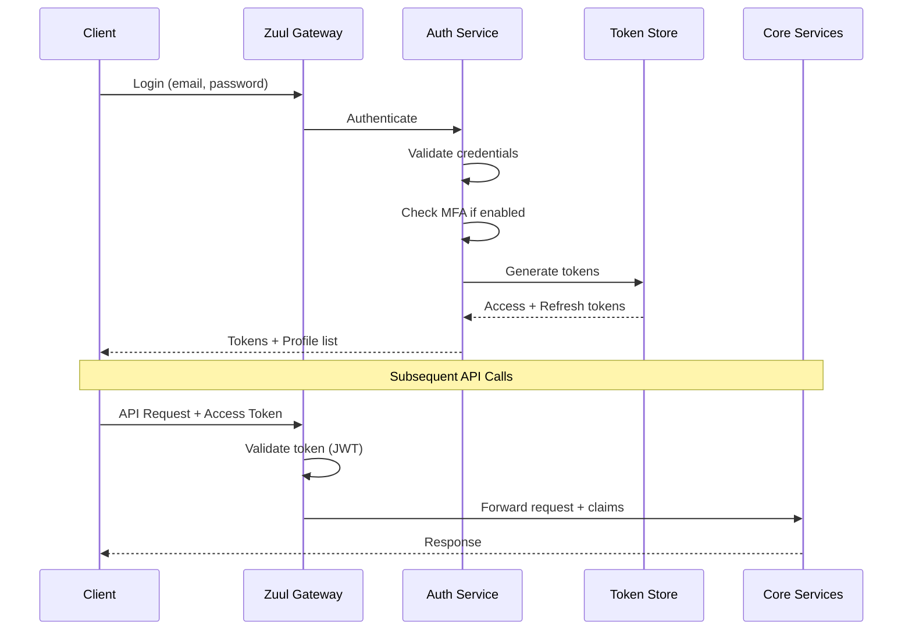
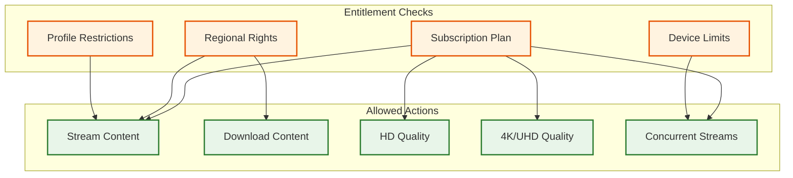
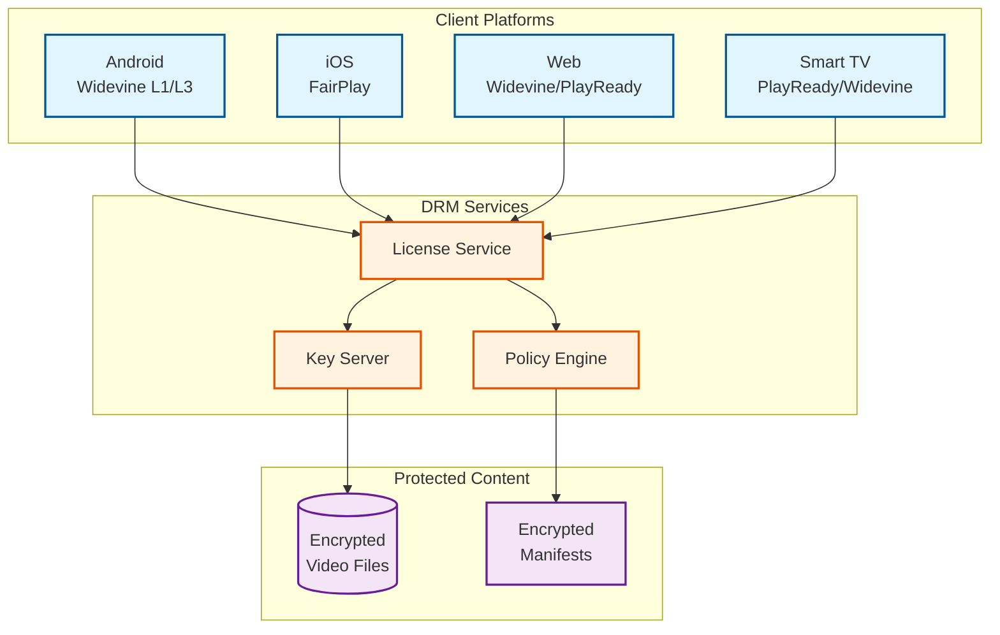
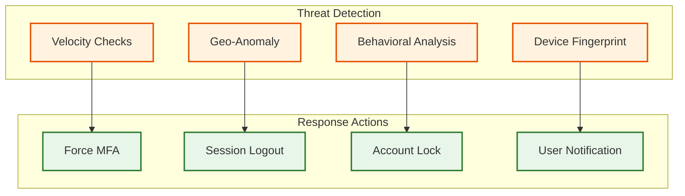
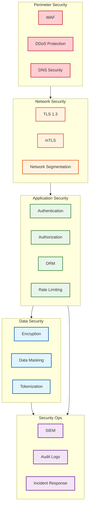

# Security & Compliance

[← Back to Index](./00-index.md)

---

## Authentication & Authorization

### Authentication Flow



### Token Management

| Token Type | Lifetime | Storage | Purpose |
|------------|----------|---------|---------|
| Access Token | 15 minutes | Memory | API authorization |
| Refresh Token | 30 days | Secure storage | Token renewal |
| Device Token | 1 year | Device keychain | Device identification |
| Session Token | 24 hours | Memory | Active session |

**Token Structure (JWT):**

```json
{
  "header": {
    "alg": "RS256",
    "typ": "JWT",
    "kid": "key-id-123"
  },
  "payload": {
    "sub": "account-uuid",
    "profile": "profile-uuid",
    "plan": "premium",
    "region": "US",
    "iat": 1704067200,
    "exp": 1704068100,
    "scope": ["stream", "browse", "profile"],
    "device_id": "device-uuid"
  }
}
```

### Authorization Model



**Subscription Tiers & Permissions:**

| Plan | Max Streams | Quality | Downloads | Spatial Audio |
|------|-------------|---------|-----------|---------------|
| Basic (with ads) | 2 | 1080p | No | No |
| Standard | 2 | 1080p | Yes | No |
| Premium | 4 | 4K + HDR | Yes | Yes |

---

## Digital Rights Management (DRM)

### DRM Architecture

Netflix uses multi-DRM to support all devices:



### DRM Platforms

| Platform | DRM System | Security Level | Device Types |
|----------|------------|----------------|--------------|
| Android | Widevine | L1 (hardware), L3 (software) | Phones, tablets, TV |
| iOS/tvOS | FairPlay | Hardware | iPhone, iPad, Apple TV |
| Windows | PlayReady | SL2000 (hardware), SL150 | PCs, Xbox |
| Chrome | Widevine | L1 via CDM | Browser |
| Safari | FairPlay | Hardware TEE | Browser |
| Smart TVs | Varies | Platform-dependent | LG, Samsung, etc. |

### License Acquisition Flow

```
PROCESS: DRM License Acquisition

1. CLIENT SETUP
   - Client initializes DRM module
   - Generates license request (challenge)
   - Includes device attestation

2. LICENSE REQUEST
   - Client sends challenge to License Service
   - Includes: device ID, content ID, account token

3. SERVER VALIDATION
   - Verify account subscription
   - Check content rights for region
   - Validate device trust level
   - Apply policy rules

4. KEY GENERATION
   - Retrieve content keys from Key Server
   - Wrap keys with device-specific key
   - Generate license with policy

5. LICENSE DELIVERY
   - License includes:
     - Encrypted content keys
     - Policy (duration, quality limits)
     - Renewal information
   - License bound to device

6. PLAYBACK
   - Client decrypts keys in secure environment
   - Hardware-level decryption (L1)
   - HDCP for output protection
```

### Content Protection Policies

| Policy | Description | Example |
|--------|-------------|---------|
| **License Duration** | How long license is valid | 24 hours for streaming |
| **Playback Duration** | Max playback after start | 48 hours for download |
| **Output Protection** | HDCP requirements | HDCP 2.2 for 4K |
| **Offline Playback** | Download allowed | Premium plans only |
| **Concurrent Streams** | Max simultaneous | 2-4 based on plan |
| **Resolution Cap** | Max quality | Based on device + plan |

---

## Content Security

### Encryption at Rest

| Data Type | Encryption | Key Management |
|-----------|------------|----------------|
| Video Content | AES-128 CTR | Per-title keys in KMS |
| User Data | AES-256 | Per-account keys |
| Credentials | bcrypt/Argon2 | N/A (hashed) |
| Tokens | AES-256 GCM | Rotating keys |
| Backups | AES-256 | Separate backup keys |

### Encryption in Transit

| Connection | Protocol | Minimum Version |
|------------|----------|-----------------|
| Client ↔ API | TLS | 1.2 (prefer 1.3) |
| Client ↔ CDN | TLS | 1.2 |
| Service ↔ Service | mTLS | 1.2 |
| Service ↔ Database | TLS | 1.2 |

### Screen Capture Prevention

```
PROTECTION LAYERS:

1. HARDWARE DRM (Widevine L1, FairPlay)
   - Decryption in TEE (Trusted Execution Environment)
   - Decrypted frames never in main memory

2. HDCP (High-bandwidth Digital Content Protection)
   - Required for HD/4K output
   - Version 2.2+ for 4K content

3. SECURE VIDEO PATH
   - Protected memory buffers
   - Hardware compositor integration

4. SOFTWARE PROTECTION (Widevine L3)
   - Obfuscated decryption
   - Anti-debugging measures
   - Limited to SD quality

5. WATERMARKING
   - Invisible forensic watermarks
   - Identifies source of leaks
   - Per-session unique markers
```

---

## Threat Model

### Top Security Threats

| Threat | Attack Vector | Impact | Mitigation |
|--------|---------------|--------|------------|
| **Credential Stuffing** | Reused passwords | Account takeover | MFA, breach detection, rate limiting |
| **Account Sharing** | Password sharing | Revenue loss | Device limits, IP analysis, household verification |
| **Content Piracy** | DRM bypass, screen capture | Revenue loss | Strong DRM, watermarking, takedowns |
| **API Abuse** | Scraping, bot attacks | Service degradation | Rate limiting, bot detection |
| **Payment Fraud** | Stolen cards | Financial loss | 3DS, fraud detection, velocity checks |
| **Insider Threat** | Employee access | Data leak | Least privilege, audit logs, DLP |

### Account Security Measures



### Rate Limiting & DDoS Protection

```yaml
# Rate limiting configuration
rate_limits:
  login:
    requests: 5
    window: 60s
    action: captcha

  api_default:
    requests: 100
    window: 60s
    action: throttle

  search:
    requests: 30
    window: 60s
    action: throttle

  playback_start:
    requests: 10
    window: 60s
    action: block

# DDoS protection
ddos_protection:
  layer7:
    provider: cloudflare  # or AWS Shield
    rules:
      - block_known_bad_ips: true
      - challenge_suspicious: true
      - rate_limit_by_fingerprint: true

  layer4:
    enabled: true
    threshold_pps: 1000000
    threshold_bps: 10gbps
```

---

## Privacy & Data Protection

### PII Handling

| Data Type | Classification | Retention | Access |
|-----------|----------------|-----------|--------|
| Email | PII | Account lifetime | Auth, Support |
| Payment Card | PCI | Tokenized only | Billing |
| Watch History | Personal | 5 years | Personalization, User |
| IP Address | PII | 90 days | Security, Analytics |
| Device ID | Identifier | Device lifetime | DRM, Analytics |
| Recommendations | Derived | Real-time | Personalization |

### Data Subject Rights (GDPR)

| Right | Implementation |
|-------|----------------|
| **Access** | Download Your Data feature |
| **Rectification** | Profile settings update |
| **Erasure** | Account deletion (30-day grace) |
| **Portability** | Data export (JSON format) |
| **Object** | Marketing opt-out |
| **Restrict Processing** | Limited account mode |

### Data Anonymization

```
ANONYMIZATION PIPELINE:

1. PRODUCTION DATA
   ├── User IDs → SHA256 hash
   ├── Email → Removed
   ├── IP → Truncated (/24)
   ├── Device ID → Salted hash
   └── Content IDs → Preserved

2. ANALYTICS DATA
   ├── Aggregated (no individual)
   ├── k-anonymity (k=100 minimum)
   └── Differential privacy for sensitive queries

3. ML TRAINING DATA
   ├── User features → Embeddings only
   ├── No raw PII
   └── Synthetic augmentation
```

---

## Compliance

### Regulatory Requirements

| Regulation | Scope | Key Requirements |
|------------|-------|------------------|
| **GDPR** | EU/EEA users | Consent, data rights, DPO |
| **CCPA/CPRA** | California users | Opt-out, disclosure, deletion |
| **COPPA** | US children <13 | Parental consent, Kids profiles |
| **PCI-DSS** | Payment data | Tokenization, encryption, audits |
| **SOC 2** | Service controls | Security, availability, privacy |

### Content Compliance

| Requirement | Implementation |
|-------------|----------------|
| **Maturity Ratings** | Per-title ratings, enforced by profile |
| **Content Warnings** | Pre-roll warnings for sensitive content |
| **Parental Controls** | PIN-protected profile restrictions |
| **Accessibility** | Closed captions, audio descriptions |
| **Regional Restrictions** | Geo-blocking based on licensing |

### Kids Profile Protection

```
KIDS PROFILE RESTRICTIONS:

1. CONTENT FILTERING
   - Only titles rated G, PG, TV-Y, TV-Y7
   - Curated Kids catalog
   - No search for mature content

2. DATA MINIMIZATION
   - Limited watch history (no long-term profiling)
   - No targeted advertising
   - Simplified recommendations

3. ACCOUNT CONTROLS
   - PIN required to exit Kids mode
   - No account management
   - No in-app purchases

4. COPPA COMPLIANCE
   - No collection of personal info
   - Parental consent for account
   - Verifiable parental controls
```

---

## Security Operations

### Incident Response

```
INCIDENT RESPONSE PROCESS:

SEVERITY LEVELS:
  - P1 (Critical): Active breach, data exfiltration
  - P2 (High): Vulnerability exploited, potential breach
  - P3 (Medium): Security anomaly, investigation needed
  - P4 (Low): Policy violation, minor issue

RESPONSE TIMELINE:
  P1: Immediate response, all-hands
  P2: 1 hour response, security team
  P3: 4 hour response, assigned engineer
  P4: Next business day

PHASES:
  1. DETECT: SIEM alerts, user reports, threat intel
  2. CONTAIN: Isolate affected systems, preserve evidence
  3. ERADICATE: Remove threat, patch vulnerabilities
  4. RECOVER: Restore services, verify integrity
  5. POST-MORTEM: Root cause analysis, improvements
```

### Security Monitoring

| System | Purpose | Data Sources |
|--------|---------|--------------|
| SIEM | Centralized logging, correlation | All services, WAF, DRM |
| IDS/IPS | Network intrusion detection | Network traffic |
| EDR | Endpoint detection | Employee devices |
| DLP | Data loss prevention | Email, cloud storage |
| WAF | Web application firewall | API traffic |

### Audit Logging

```yaml
# Audit events to log
audit_events:
  authentication:
    - login_success
    - login_failure
    - mfa_challenge
    - password_change
    - account_lockout

  authorization:
    - permission_change
    - role_assignment
    - access_denied

  data_access:
    - pii_access
    - bulk_export
    - admin_action

  content:
    - drm_license_issued
    - download_initiated
    - playback_started

# Retention: 2 years minimum, 7 years for financial
```

---

## Security Architecture Summary



---

*Next: [Observability →](./07-observability.md)*
