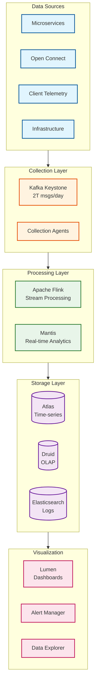
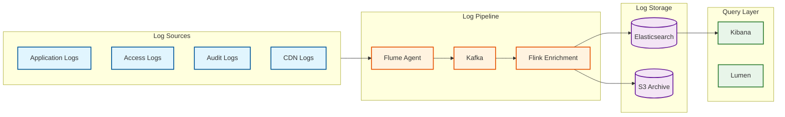
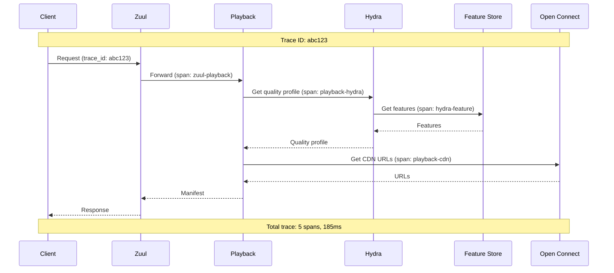
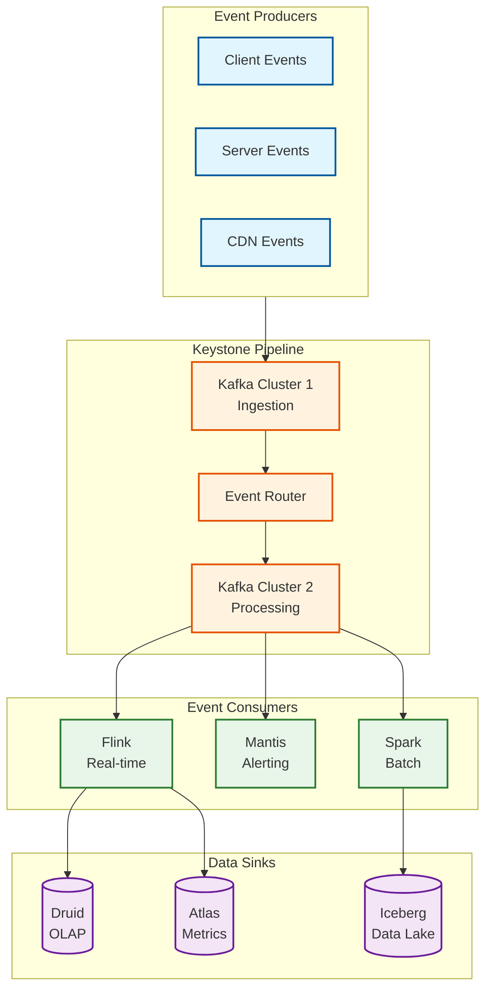

# Observability

[← Back to Index](./00-index.md)

---

## Observability Architecture

Netflix operates one of the most sophisticated observability stacks in the industry, processing **38 million events per second** during peak live events.



---

## Metrics (USE/RED Method)

### Service Metrics (RED)

| Metric | Description | Target | Alert Threshold |
|--------|-------------|--------|-----------------|
| **Request Rate** | Requests per second | Varies by service | >2x normal |
| **Error Rate** | % of failed requests | <0.1% | >0.5% |
| **Duration** (p50) | Median latency | <50ms | >100ms |
| **Duration** (p95) | 95th percentile | <100ms | >200ms |
| **Duration** (p99) | 99th percentile | <200ms | >500ms |

### Infrastructure Metrics (USE)

| Resource | Utilization | Saturation | Errors |
|----------|-------------|------------|--------|
| **CPU** | % utilization | Run queue length | Hardware errors |
| **Memory** | % used | Swap usage | OOM kills |
| **Disk** | % capacity | I/O queue depth | I/O errors |
| **Network** | Bandwidth usage | Packet queue | Dropped packets |

### Key Business Metrics

```yaml
# Playback Quality Metrics
playback:
  - name: playback_start_time
    description: Time from play button to first frame
    unit: milliseconds
    percentiles: [50, 95, 99]
    target:
      p50: 200ms
      p95: 500ms
      p99: 1000ms

  - name: rebuffering_ratio
    description: Time spent buffering / total play time
    unit: percentage
    target: <0.5%

  - name: video_start_failure_rate
    description: Failed playback starts
    unit: percentage
    target: <0.1%

  - name: quality_distribution
    description: Breakdown by resolution
    dimensions: [resolution, codec]

# CDN Metrics
cdn:
  - name: cache_hit_rate
    description: Requests served from cache
    unit: percentage
    target: >98%
    dimensions: [appliance_type, region]

  - name: fill_latency
    description: Time to fetch from origin
    unit: milliseconds
    target:
      p95: 100ms

  - name: bandwidth_utilization
    description: Appliance bandwidth usage
    unit: percentage
    alert: >85%

# Personalization Metrics
personalization:
  - name: recommendation_latency
    description: Time to generate recommendations
    unit: milliseconds
    target:
      p99: 50ms

  - name: thumbnail_ctr
    description: Click-through rate on thumbnails
    dimensions: [variant, user_segment]

  - name: row_engagement
    description: Interaction rate per home row
    dimensions: [row_type]
```

---

## Logging

### Log Architecture



### Structured Log Format

```json
{
  "timestamp": "2025-01-15T10:30:45.123Z",
  "level": "INFO",
  "service": "playback-service",
  "instance": "playback-i-abc123",
  "region": "us-east-1",
  "trace_id": "abc123def456",
  "span_id": "span789",
  "message": "Playback started",
  "context": {
    "account_id": "hashed-account-id",
    "profile_id": "hashed-profile-id",
    "title_id": "title-uuid",
    "device_type": "smart_tv",
    "quality": "1080p",
    "cdn_appliance": "oca-comcast-001"
  },
  "metrics": {
    "start_time_ms": 185,
    "buffer_health": 0.95
  }
}
```

### Log Levels & Guidelines

| Level | When to Use | Retention | Examples |
|-------|-------------|-----------|----------|
| **ERROR** | Unexpected failures | 90 days | DB connection failed, DRM error |
| **WARN** | Recoverable issues | 30 days | Retry succeeded, degraded mode |
| **INFO** | Business events | 14 days | Playback started, user login |
| **DEBUG** | Troubleshooting | 3 days | Cache miss, feature flag value |
| **TRACE** | Detailed flow | 1 day | Request/response bodies |

---

## Distributed Tracing

### Tracing Architecture



### Trace Propagation

```yaml
# Trace context headers
trace_headers:
  - X-B3-TraceId    # 128-bit trace ID
  - X-B3-SpanId     # 64-bit span ID
  - X-B3-ParentSpanId
  - X-B3-Sampled    # 1 = sampled, 0 = not sampled
  - X-Request-Id    # Netflix internal

# Sampling strategy
sampling:
  default: 0.01     # 1% of requests
  error: 1.0        # 100% of errors
  slow: 1.0         # 100% of slow requests (>500ms)
  debug: 1.0        # 100% when debug header present
```

### Key Spans to Instrument

| Span | Description | Important Tags |
|------|-------------|----------------|
| `zuul-ingress` | Gateway entry | client_ip, device_type |
| `auth-validate` | Token validation | auth_method, result |
| `playback-manifest` | Manifest generation | title_id, quality |
| `hydra-inference` | ML model inference | model_version, latency |
| `feature-fetch` | Feature store lookup | cache_hit, features_count |
| `cdn-steering` | CDN URL selection | appliance, region |
| `db-query` | Database operation | table, operation, rows |
| `cache-operation` | Cache read/write | cache_hit, key_prefix |

---

## Alerting

### Alert Hierarchy

```
ALERT SEVERITY LEVELS:

SEV 1 (Page Immediately)
├── Playback success rate < 99%
├── API availability < 99.9%
├── CDN cache hit rate < 90%
├── Payment processing failure
└── Security incident detected

SEV 2 (Page if not ACK'd in 15 min)
├── Playback success rate < 99.5%
├── Recommendation latency p99 > 100ms
├── Error rate > 1%
├── Capacity threshold > 80%
└── CockroachDB replication lag > 1 min

SEV 3 (Notify during business hours)
├── Capacity threshold > 70%
├── Cache hit rate < 95%
├── Background job failures
└── Non-critical service degradation

SEV 4 (Log for review)
├── Anomaly detected (no impact)
├── Capacity planning triggers
├── Performance regression
└── Configuration drift
```

### Alert Definitions

```yaml
alerts:
  - name: playback_start_failure_high
    severity: SEV1
    condition: |
      rate(playback_start_failures[5m]) /
      rate(playback_start_total[5m]) > 0.01
    duration: 2m
    annotations:
      summary: "Playback start failure rate > 1%"
      runbook: "https://wiki/runbooks/playback-failures"
    labels:
      team: playback
      escalation: immediate

  - name: recommendation_latency_high
    severity: SEV2
    condition: |
      histogram_quantile(0.99,
        rate(recommendation_latency_bucket[5m])) > 0.1
    duration: 5m
    annotations:
      summary: "Recommendation p99 latency > 100ms"
    labels:
      team: personalization

  - name: cdn_cache_hit_low
    severity: SEV2
    condition: |
      sum(rate(cdn_cache_hits[5m])) /
      sum(rate(cdn_requests[5m])) < 0.95
    for: 10m
    labels:
      team: cdn-ops

  - name: kafka_consumer_lag_high
    severity: SEV2
    condition: |
      kafka_consumer_lag > 60000
    for: 5m
    labels:
      team: data-platform
```

### On-Call Escalation

```
ESCALATION PATH:

T+0: Alert fires
  → Page primary on-call
  → Auto-create incident ticket

T+5min: No ACK
  → Page secondary on-call
  → Notify team Slack channel

T+15min: No ACK
  → Page engineering manager
  → Start incident bridge

T+30min: No resolution
  → Escalate to VP Engineering
  → Executive notification (SEV1 only)

INCIDENT ROLES:
  - Incident Commander: Coordinates response
  - Technical Lead: Drives technical investigation
  - Communications: Updates status page, stakeholders
  - Scribe: Documents timeline, actions
```

---

## Real-Time Analytics (Keystone Pipeline)

### Pipeline Architecture



### Keystone Scale

| Metric | Value |
|--------|-------|
| Messages per Day | 2 trillion |
| Messages per Second (avg) | 23 million |
| Messages per Second (peak) | 38 million |
| Data Ingested per Day | 3 PB |
| Data Output per Day | 7 PB |
| Kafka Topics | 1,000+ |
| Consumer Groups | 500+ |

### Event Schema (Avro)

```json
{
  "type": "record",
  "name": "PlaybackEvent",
  "namespace": "com.netflix.events",
  "fields": [
    {"name": "event_id", "type": "string"},
    {"name": "event_type", "type": {"type": "enum", "name": "EventType",
      "symbols": ["START", "PROGRESS", "PAUSE", "SEEK", "COMPLETE", "ERROR"]}},
    {"name": "timestamp", "type": "long", "logicalType": "timestamp-millis"},
    {"name": "account_id", "type": "string"},
    {"name": "profile_id", "type": "string"},
    {"name": "title_id", "type": "string"},
    {"name": "episode_id", "type": ["null", "string"], "default": null},
    {"name": "position_ms", "type": "long"},
    {"name": "duration_ms", "type": "long"},
    {"name": "quality", "type": "string"},
    {"name": "device", "type": {
      "type": "record",
      "name": "Device",
      "fields": [
        {"name": "type", "type": "string"},
        {"name": "os", "type": "string"},
        {"name": "app_version", "type": "string"}
      ]
    }},
    {"name": "cdn", "type": {
      "type": "record",
      "name": "CDNInfo",
      "fields": [
        {"name": "appliance_id", "type": "string"},
        {"name": "isp", "type": "string"},
        {"name": "cache_hit", "type": "boolean"}
      ]
    }}
  ]
}
```

---

## Dashboards

### Executive Dashboard

```
┌─────────────────────────────────────────────────────────────────────────┐
│                    NETFLIX STREAMING HEALTH                              │
│                    Last Updated: 2025-01-15 10:30 UTC                   │
├─────────────────────────────────────────────────────────────────────────┤
│                                                                          │
│  GLOBAL HEALTH                         ACTIVE VIEWERS                    │
│  ──────────────                        ───────────────                   │
│  ● Playback: 99.97%                   [█████████████████] 18.5M         │
│  ● CDN: 99.99%                                                          │
│  ● API: 99.98%                        US: 6.2M | EU: 5.1M | APAC: 4.8M  │
│                                                                          │
│  QUALITY METRICS                       TOP CONTENT (NOW)                 │
│  ───────────────                       ─────────────────                 │
│  Start Time (p50): 185ms              1. Stranger Things S5             │
│  Rebuffering: 0.3%                    2. Wednesday S2                   │
│  4K Streams: 28%                      3. Squid Game S3                  │
│  1080p Streams: 45%                                                     │
│                                                                          │
│  REGIONAL CDN PERFORMANCE                                                │
│  ────────────────────────                                               │
│  US-East  [██████████] 98.5% hit     EU-West [█████████░] 97.8% hit    │
│  US-West  [█████████░] 97.9% hit     APAC    [████████░░] 96.5% hit    │
│                                                                          │
└─────────────────────────────────────────────────────────────────────────┘
```

### Service Team Dashboard

| Panel | Metrics Shown | Refresh |
|-------|---------------|---------|
| Request Rate | QPS by endpoint | 10s |
| Error Rate | Errors by type, endpoint | 10s |
| Latency Heatmap | p50, p95, p99 by time | 30s |
| Dependency Health | Status of downstream services | 30s |
| Resource Utilization | CPU, memory, connections | 30s |
| Recent Alerts | Last 24h alerts | 1m |
| Deployment Markers | Recent deploys | 5m |

### CDN Operations Dashboard

| Panel | Metrics Shown | Purpose |
|-------|---------------|---------|
| Traffic Map | Global traffic flow | Geographic health |
| Cache Hit by Tier | Storage vs Edge | Cache efficiency |
| Fill Rate | Origin fetches | Content placement |
| Appliance Health | Per-appliance status | Capacity planning |
| ISP Performance | Quality by ISP | Partner management |
| Bandwidth Utilization | By region, appliance | Capacity alerts |

---

## Runbooks

### Runbook: High Playback Failure Rate

```
ALERT: playback_start_failure_high
THRESHOLD: >1% failure rate for >2 minutes

IMMEDIATE ACTIONS:
1. Check current failure rate and trend
   Query: rate(playback_start_failures[5m])

2. Identify failure type distribution
   Query: sum by (error_type)(playback_failures)

3. Check regional distribution
   Query: sum by (region)(playback_failures)

DIAGNOSIS TREE:

Is it a specific region?
├── YES: Check regional CDN, ISP issues
│   → Check CDN appliance health
│   → Check ISP status pages
│   → Consider traffic steering away
│
└── NO: Global issue

Is it a specific error type?
├── DRM_ERROR: Check license servers
├── CDN_ERROR: Check Open Connect health
├── AUTH_ERROR: Check auth service
└── MANIFEST_ERROR: Check playback service

Is it correlated with a deployment?
├── YES: Consider rollback
│   → Check Spinnaker deployment history
│   → Trigger canary rollback if active
│
└── NO: Continue investigation

ESCALATION:
- If not resolved in 10 min: Page CDN on-call
- If not resolved in 20 min: Page Playback engineering manager
```

### Runbook: CDN Cache Hit Rate Low

```
ALERT: cdn_cache_hit_low
THRESHOLD: <95% for >10 minutes

IMMEDIATE ACTIONS:
1. Check which tier is affected
   Query: cache_hit_rate by (appliance_type)

2. Check for content placement issues
   Query: fill_rate by (appliance)

3. Check for new content spike
   Query: requests by (title_id) order by requests desc

DIAGNOSIS:

Edge Cache Hit Low:
├── Check popular content on edge
├── Verify edge appliance storage
├── Check fill rate from storage tier
└── Consider adding edge capacity

Storage Cache Hit Low:
├── Check for mass new content release
├── Verify storage appliance health
├── Check origin fill latency
└── Consider pre-warming content

New Content Spike:
├── Expected: Monitor, wait for cache warm
├── Unexpected: Investigate source
└── Live Event: Ensure pre-warming complete

MITIGATION:
- Emergency: Steer traffic to healthy appliances
- Short-term: Increase cache TTL
- Long-term: Add capacity, improve placement
```

---

## SLI/SLO Summary

| Service | SLI | SLO | Error Budget (30 days) |
|---------|-----|-----|------------------------|
| Playback Start | Success rate | 99.9% | 43.2 minutes |
| Playback Quality | Rebuffering ratio | <0.5% | N/A |
| Start Latency | p50 latency | <200ms | N/A |
| API Availability | Success rate | 99.99% | 4.3 minutes |
| Recommendations | Latency p99 | <50ms | N/A |
| CDN | Cache hit rate | >98% | N/A |
| Data Pipeline | Processing lag | <60s | N/A |

---

*Next: [Interview Guide →](./08-interview-guide.md)*
