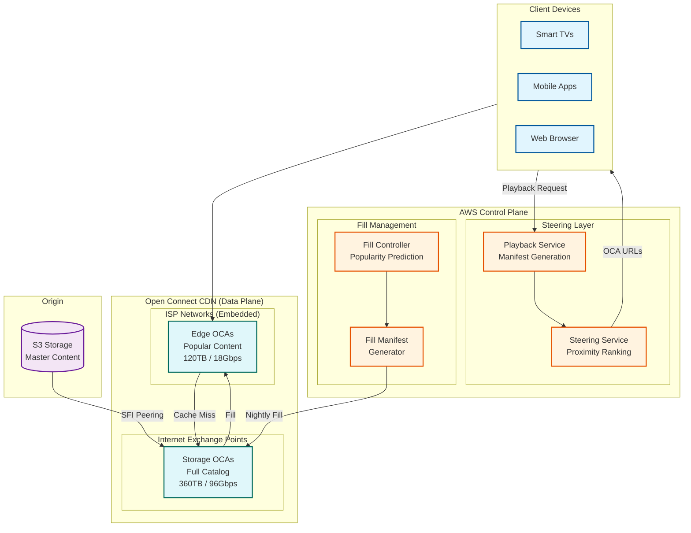

# Netflix Open Connect CDN

[← Back to System Design Index](../README.md) | [← Netflix Main Design](../5.2-netflix/00-index.md)

---

## Overview

**Netflix Open Connect** is Netflix's proprietary Content Delivery Network that embeds caching appliances directly within ISP networks worldwide. Unlike traditional CDNs (Cloudflare, Akamai) that operate their own Points of Presence, Open Connect provides free hardware to qualifying ISPs, creating a mutually beneficial model where Netflix reduces transit costs and ISPs lower backbone bandwidth consumption. The system serves **95%+ of Netflix traffic** from edge locations, with **19,000+ Open Connect Appliances (OCAs)** deployed across **1,500+ ISP locations** in **100+ countries**.

**Key Innovation:** Open Connect uses **proactive caching** rather than reactive cache-on-demand. Because Netflix's catalog is subscription-based and predictable (unlike YouTube's UGC), they can forecast demand with high accuracy and pre-position content during off-peak hours before users request it.

---

## System Characteristics

| Characteristic | Value | Implication |
|----------------|-------|-------------|
| Traffic Pattern | Read-heavy (99:1 ratio) | Aggressive edge caching |
| Content Type | Known catalog (~17,000 titles) | Enables proactive caching |
| Caching Model | Proactive (fill-based) | Nightly off-peak content push |
| Ownership Model | Free hardware to ISPs | Partnership economics |
| Consistency | Eventual (content distribution) | Fill window latency acceptable |
| Latency Sensitivity | High (<100ms playback start) | Edge proximity critical |
| Control Plane | AWS-hosted (centralized) | Data plane distributed globally |

---

## Complexity Rating

| Component | Complexity | Reason |
|-----------|------------|--------|
| ISP Partnership Model | **High** | Legal, operational, hardware logistics |
| Proactive Caching Algorithm | **Very High** | File-level popularity prediction, storage optimization |
| BGP-based Steering | **High** | Modified best-path selection, proximity ranking |
| OCA Hardware Optimization | **Very High** | 400Gbps serving, kTLS offload, NUMA |
| Fill Traffic Management | **High** | Nightly windows, SFI peering, bandwidth optimization |
| Cache Miss Classification | **Medium-High** | Real-time metrics, categorization |
| Control Plane Architecture | **Medium** | AWS-based, steering service |

**Overall System Complexity: Very High**

---

## Quick Navigation

| Document | Description |
|----------|-------------|
| [01 - Requirements & Estimations](./01-requirements-and-estimations.md) | ISP partnership model, capacity planning |
| [02 - High-Level Design](./02-high-level-design.md) | Two-tier architecture, control/data plane separation |
| [03 - Low-Level Design](./03-low-level-design.md) | OCA hardware, FreeBSD/NGINX stack, BGP configuration |
| [04 - Deep Dive & Bottlenecks](./04-deep-dive-and-bottlenecks.md) | Proactive caching, steering, cache miss classification |
| [05 - Scalability & Reliability](./05-scalability-and-reliability.md) | 400Gbps optimization, failover mechanisms |
| [06 - Security & Compliance](./06-security-and-compliance.md) | TLS termination, content protection |
| [07 - Observability](./07-observability.md) | Cache miss metrics, OCA health monitoring |
| [08 - Interview Guide](./08-interview-guide.md) | Open Connect vs traditional CDN questions |

---

## Open Connect vs Traditional CDN

| Aspect | Traditional CDN (Cloudflare/Akamai) | Netflix Open Connect |
|--------|-----------------------------------|---------------------|
| **Deployment Model** | CDN-owned PoPs | ISP-embedded appliances |
| **Hardware Ownership** | CDN owns/operates | Netflix provides free to ISPs |
| **Caching Strategy** | Reactive (cache-on-demand) | Proactive (nightly fill) |
| **Routing** | Anycast / GeoDNS | BGP AS-PATH + Steering Service |
| **Content Predictability** | Low (diverse content) | High (known catalog) |
| **Fill Traffic** | On cache miss | Scheduled off-peak windows |
| **ISP Relationship** | Customer/vendor | Partnership (mutual benefit) |
| **Revenue Model** | Per-bandwidth fees | Zero cost to ISPs |
| **Control Plane** | Distributed | Centralized (AWS) |
| **Specialization** | General-purpose | Video streaming optimized |

---

## Architecture Overview



---

## Two-Tier OCA Architecture

```
┌─────────────────────────────────────────────────────────────────────────────┐
│                     NETFLIX OPEN CONNECT TWO-TIER MODEL                      │
├─────────────────────────────────────────────────────────────────────────────┤
│                                                                              │
│  TIER 1: STORAGE APPLIANCES (IXP Locations)                                 │
│  ┌────────────────────────────────────────────────────────────────────────┐ │
│  │  • Located at Internet Exchange Points (IXPs)                          │ │
│  │  • Hold nearly the ENTIRE Netflix catalog (~17,000 titles)             │ │
│  │  • Hardware: 360TB storage, 96Gbps throughput, 2U                      │ │
│  │  • Serve as fill source for embedded OCAs                              │ │
│  │  • Handle long-tail content requests                                   │ │
│  └────────────────────────────────────────────────────────────────────────┘ │
│                              │                                               │
│                              │ Fill Traffic (Nightly)                        │
│                              │ Cache Miss Fallback                           │
│                              ▼                                               │
│  TIER 2: EDGE APPLIANCES (Embedded in ISP Networks)                         │
│  ┌────────────────────────────────────────────────────────────────────────┐ │
│  │  • Located INSIDE ISP data centers / central offices                   │ │
│  │  • Cache POPULAR content for that ISP's subscribers                    │ │
│  │  • Hardware: 120TB storage, 18Gbps throughput, 2U                      │ │
│  │  • Serve 95%+ of Netflix traffic to end users                          │ │
│  │  • FREE hardware provided to qualifying ISPs                           │ │
│  └────────────────────────────────────────────────────────────────────────┘ │
│                              │                                               │
│                              │ Video Streaming                               │
│                              ▼                                               │
│  ┌────────────────────────────────────────────────────────────────────────┐ │
│  │                      NETFLIX SUBSCRIBERS                                │ │
│  │               (95%+ traffic served from local ISP)                      │ │
│  └────────────────────────────────────────────────────────────────────────┘ │
│                                                                              │
└─────────────────────────────────────────────────────────────────────────────┘
```

---

## Key Scale Numbers

| Metric | Value | Context |
|--------|-------|---------|
| OCAs Deployed | 19,000+ | Global edge presence |
| ISP Locations | 1,500+ | Partner deployments |
| Countries | 100+ | Global coverage |
| Traffic from Edge | 95%+ | Edge hit rate |
| Netflix Investment | $1+ billion | Since 2012 launch |
| ISP Savings (2021) | $1.25 billion | Transit cost reduction |
| Storage per OCA | 120-360 TB | Title coverage |
| Throughput per OCA | 18-96 Gbps | Standard hardware |
| Max Throughput | 400 Gbps | Latest AMD EPYC systems |
| Prototype Throughput | 800 Gbps | In development |
| Fill Window | Nightly | Off-peak hours |
| BGP ASN | 40027 | Netflix AS number |

---

## OCA Hardware Tiers

| Tier | Form Factor | Power | Storage | Network | Throughput | Use Case |
|------|-------------|-------|---------|---------|------------|----------|
| **Edge** | 2U | ~270W | 120TB HDD | 10GbE | 18 Gbps | Small ISPs, emerging markets |
| **Storage** | 2U | ~650W | 360TB (HDD+Flash) | 6x10GbE or 2x100GbE | 96 Gbps | IXPs, large ISPs |
| **Flash** | 2U | ~650W | NVMe PCIe Gen3 | 100GbE | 100+ Gbps | High-demand locations |
| **Latest** | 2U | ~800W | 18x NVMe 2TB | 4x100GbE | 400 Gbps | AMD EPYC Rome |

---

## Proactive vs Reactive Caching


**Why Proactive Works for Netflix:**
1. **Known Catalog:** ~17,000 titles vs millions of UGC videos
2. **Predictable Demand:** New releases, trending shows are forecastable
3. **Subscription Model:** No ads = consistent viewing patterns
4. **Off-Peak Windows:** Nightly fill doesn't compete with viewing traffic

---

## Platform Comparison

| Aspect | Cloudflare | Akamai | Netflix Open Connect |
|--------|------------|--------|---------------------|
| **PoPs** | 400+ | 4,000+ | 19,000+ OCAs |
| **Routing** | Anycast | GeoDNS | BGP + Steering |
| **Caching** | Reactive | Reactive | Proactive |
| **Specialization** | General | Enterprise | Video only |
| **ISP Integration** | Edge only | Tiered | Embedded inside ISP |
| **Cost to ISP** | N/A | N/A | Free hardware |
| **Purge Latency** | ~150ms | Minutes | N/A (push model) |
| **Video Optimization** | Basic | Advanced | Purpose-built |

---

## Interview Readiness Checklist

- [ ] Can explain two-tier OCA architecture (Storage vs Edge)
- [ ] Understand proactive vs reactive caching trade-offs
- [ ] Know BGP-based steering with proximity ranking
- [ ] Can describe ISP partnership economics
- [ ] Understand fill traffic management and SFI peering
- [ ] Know OCA hardware specifications and evolution
- [ ] Can explain cache miss classification system
- [ ] Understand FreeBSD/NGINX software stack
- [ ] Can compare Open Connect vs traditional CDNs
- [ ] Know when to recommend own CDN vs third-party

---

## Quick Reference Card

```
┌─────────────────────────────────────────────────────────────────────────────┐
│               NETFLIX OPEN CONNECT SYSTEM DESIGN CHEAT SHEET                 │
├─────────────────────────────────────────────────────────────────────────────┤
│                                                                              │
│  SCALE NUMBERS (memorize)           KEY DIFFERENTIATORS                      │
│  ────────────────────────           ────────────────────                     │
│  OCAs: 19,000+                      1. ISP-EMBEDDED (not PoP-based)          │
│  ISP Locations: 1,500+              2. PROACTIVE caching (not reactive)      │
│  Countries: 100+                    3. FREE hardware to ISPs                 │
│  Edge Hit Rate: 95%+                4. BGP steering (not Anycast)            │
│  Netflix Investment: $1B+           5. Nightly fill windows                  │
│  ISP Savings: $1.25B (2021)         6. Subscription = predictable demand     │
│                                                                              │
│  OCA HARDWARE                       CONTROL PLANE                            │
│  ───────────                        ─────────────                            │
│  Edge: 120TB, 18Gbps, ~270W         • AWS-hosted                             │
│  Storage: 360TB, 96Gbps, ~650W      • Steering Service (proximity rank)      │
│  Flash: NVMe, 100Gbps+              • Fill Controller (popularity ML)        │
│  Latest: 400Gbps (AMD EPYC)         • BGP ASN 40027                          │
│                                                                              │
│  SOFTWARE STACK                     INTERVIEW QUESTIONS                      │
│  ──────────────                     ───────────────────                      │
│  OS: FreeBSD (head branch)          Q: "Why not use Cloudflare?"             │
│  Web: NGINX                         A: Own CDN gives control, ISP embedding, │
│  BGP: BIRD                             proactive caching, video optimization │
│  TLS: kTLS offload                                                           │
│  Optimization: Zero-copy sendfile   Q: "How handle new release?"             │
│                                     A: Pre-position days before release,     │
│  TWO-TIER MODEL                        popularity prediction, fill manifest  │
│  ──────────────                                                              │
│  IXP Storage → ISP Edge → User      Q: "What if embedded OCA fails?"         │
│  (Full catalog) (Popular)           A: BGP AS-PATH fallback to IXP storage,  │
│                                        SFI peering backup, multi-site deploy │
│                                                                              │
│  KEY TRADE-OFF: Own CDN vs Third-Party                                       │
│  ─────────────────────────────────────                                       │
│  Own CDN: High upfront cost, full control, ISP relationships                 │
│  Third-party: Pay-per-use, faster deployment, less optimization              │
│  Netflix chose own because: Scale justifies cost, video specialization,      │
│  proactive caching impossible with reactive CDNs, ISP partnerships           │
│                                                                              │
└─────────────────────────────────────────────────────────────────────────────┘
```

---

## Related Designs

| System | Relevance |
|--------|-----------|
| [Netflix Main Design](../5.2-netflix/00-index.md) | Overall Netflix architecture, encoding, personalization |
| [Generic CDN Design](../1.15-content-delivery-network-cdn/00-index.md) | Traditional CDN patterns, comparison |
| [YouTube](../5.1-youtube/00-index.md) | Alternative video platform approach |
| [Blob Storage](../1.12-blob-storage-system/00-index.md) | Origin storage patterns |
| [Load Balancer](../1.2-distributed-load-balancer/00-index.md) | Traffic distribution within OCAs |

---

## References

- [Netflix Open Connect Official](https://openconnect.netflix.com/)
- [Open Connect Overview PDF](https://openconnect.netflix.com/Open-Connect-Overview.pdf)
- [Netflix Open Connect Deployment Guide](https://openconnect.netflix.com/deploymentguide.pdf)
- [Serving 100 Gbps from an Open Connect Appliance](https://netflixtechblog.com/serving-100-gbps-from-an-open-connect-appliance-cdb51dda3b99)
- [Netflix and Fill](https://netflixtechblog.com/netflix-and-fill-c43a32b490c0)
- [How Data Science Helps Power Worldwide Delivery](https://netflixtechblog.com/how-data-science-helps-power-worldwide-delivery-of-netflix-content-bac55800f9a7)
- [Driving Content Delivery Efficiency Through Classifying Cache Misses](https://netflixtechblog.com/driving-content-delivery-efficiency-through-classifying-cache-misses-ffcf08026b6c)
- [FreeBSD Case Study: Open Connect](https://freebsdfoundation.org/wp-content/uploads/2021/03/Netflix-Open.pdf)
- [Netflix Boosts Streaming While Reducing Socket Counts](https://www.nextplatform.com/2021/10/04/netflix-boosts-streaming-while-reducing-socket-counts/)

---

*Next: [Requirements & Estimations →](./01-requirements-and-estimations.md)*
