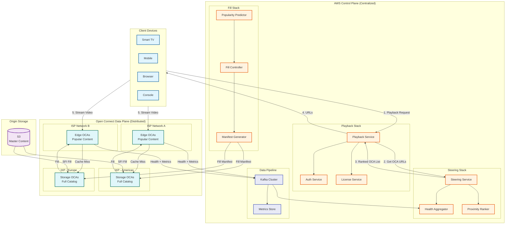
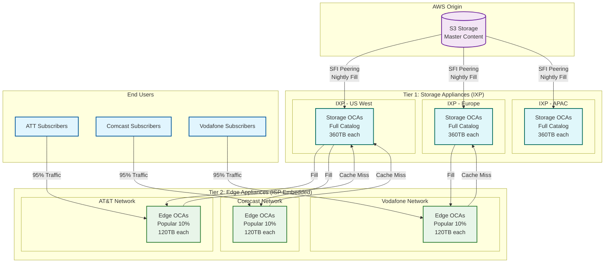
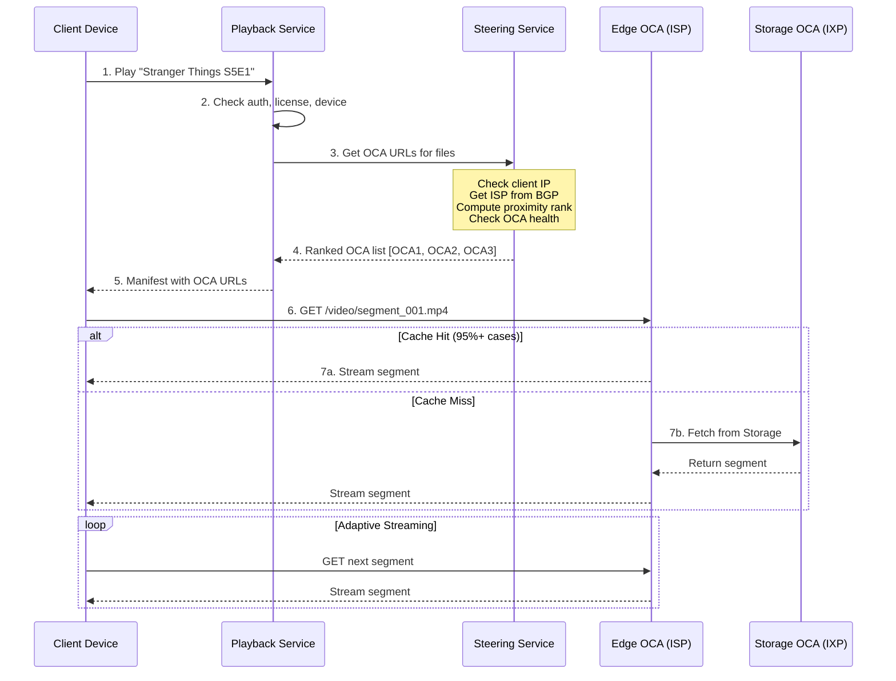
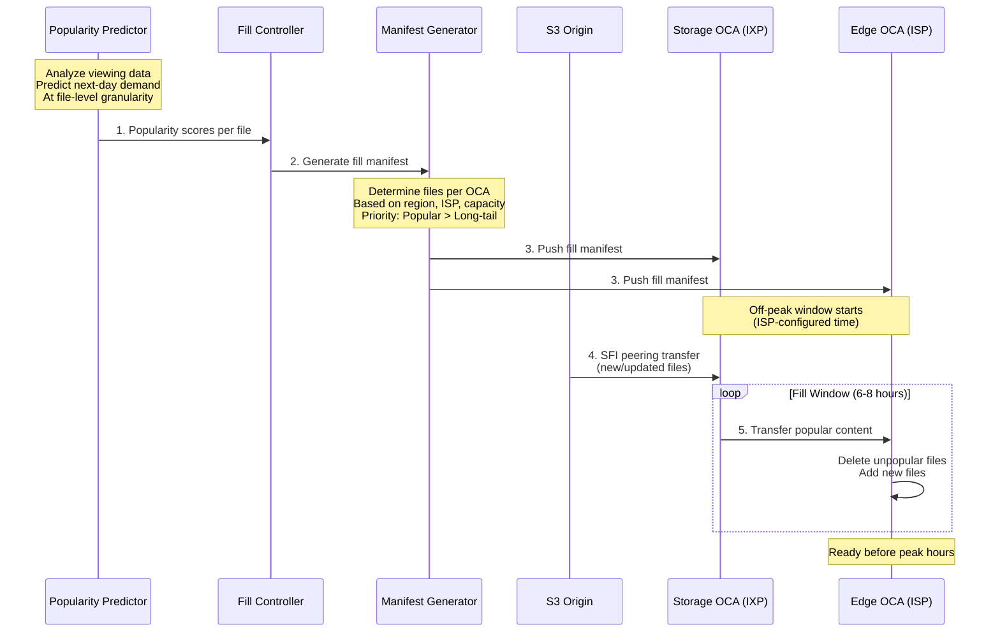
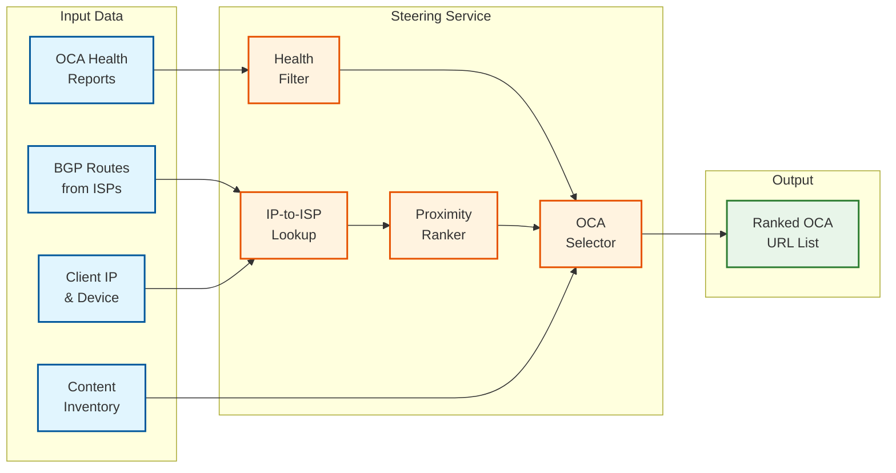
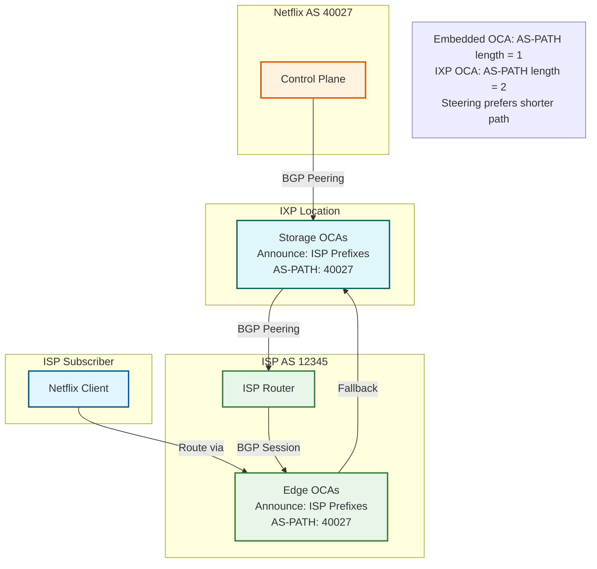

# High-Level Design

[← Back to Index](./00-index.md) | [Previous: Requirements](./01-requirements-and-estimations.md) | [Next: Low-Level Design →](./03-low-level-design.md)

---

## Architecture Overview

Netflix Open Connect separates the **Control Plane** (AWS-hosted services managing routing, fill, and monitoring) from the **Data Plane** (globally distributed OCAs serving video content). This separation allows centralized intelligence with distributed delivery.



---

## Control Plane vs Data Plane

| Aspect | Control Plane | Data Plane |
|--------|--------------|------------|
| **Location** | AWS (centralized) | Global (ISPs, IXPs) |
| **Function** | Routing decisions, fill scheduling | Video serving |
| **State** | Stateful (health, manifests) | Stateless (content cache) |
| **Scaling** | Vertical + horizontal (AWS) | Horizontal (add OCAs) |
| **Failure Impact** | Steering degradation | Local traffic affected |
| **Update Frequency** | Continuous | Nightly fill |

---

## Two-Tier OCA Architecture



### Tier Responsibilities

| Tier | Location | Storage | Content | Fill Source | Traffic |
|------|----------|---------|---------|-------------|---------|
| **Storage** | IXPs | 360 TB | Full catalog | S3 via SFI | Long-tail, cache miss |
| **Edge** | ISP networks | 120 TB | Popular 5-10% | Storage OCAs | 95%+ of streaming |

---

## Data Flow: Video Playback



---

## Data Flow: Nightly Fill



---

## Fill Traffic Management

### Fill Patterns

| Pattern | Description | Use Case |
|---------|-------------|----------|
| **Scheduled Fill** | Nightly during off-peak window | Regular content updates |
| **Priority Fill** | Immediate propagation | New releases, hotfixes |
| **Peer Fill** | OCA-to-OCA within cluster | Load balancing |
| **Tier Fill** | Storage OCA to Edge OCA | Standard hierarchy |

### Fill Window Configuration

```
┌─────────────────────────────────────────────────────────────────────────────┐
│                      TYPICAL 24-HOUR OCA TRAFFIC PATTERN                     │
├─────────────────────────────────────────────────────────────────────────────┤
│                                                                              │
│  Traffic                                                                     │
│    │                              ┌─────────┐                                │
│    │                            ╱            ╲                               │
│    │                          ╱                ╲    ← Peak (Evening)         │
│    │                        ╱                    ╲                           │
│    │                      ╱                        ╲                         │
│    │  ╲                 ╱                            ╲                 ╱     │
│    │    ╲             ╱                                ╲             ╱       │
│    │      ╲         ╱                                    ╲         ╱         │
│    │        ╲─────╱                                        ╲─────╱           │
│    │   │←─────────────────→│                                                 │
│    │   │   FILL WINDOW     │ ← Off-Peak (2am-8am local)                      │
│    └───┴───────────────────┴──────────────────────────────────────────────   │
│        00   04   08   12   16   20   24   (Hours)                            │
│                                                                              │
│  Fill Window Activities:                                                     │
│  • Download new/updated content from upstream                                │
│  • Delete content no longer in manifest                                      │
│  • Software updates (if needed)                                              │
│  • Health checks and self-repair                                             │
│                                                                              │
└─────────────────────────────────────────────────────────────────────────────┘
```

---

## Steering Architecture

### Steering Service Components



### Steering Decision Factors

| Factor | Weight | Description |
|--------|--------|-------------|
| **BGP AS-PATH Length** | High | Prefer embedded OCAs (AS-PATH=1) over IXP (AS-PATH=2) |
| **Content Availability** | High | OCA must have requested files |
| **OCA Health** | High | CPU, disk, network utilization |
| **Geographic Proximity** | Medium | Minimize network hops |
| **Load Distribution** | Medium | Balance across cluster |
| **Historical Performance** | Low | Past serving quality |

---

## BGP-Based Routing

### BGP Integration Model



### BGP Configuration

| Parameter | Value | Notes |
|-----------|-------|-------|
| Netflix ASN | 40027 | Global Netflix identifier |
| IPv4 Prefixes | /8 to /24 | Accepted range |
| IPv6 Prefixes | /19 to /48 | Accepted range |
| Communities | Not used | Netflix ignores ISP communities |
| Session Type | eBGP | External BGP with ISPs |

---

## Key Architectural Decisions

### Decision 1: Own CDN vs Third-Party

| Option | Pros | Cons |
|--------|------|------|
| **Third-Party CDN** | Lower upfront cost, faster deployment | Per-bandwidth fees, reactive caching only |
| **Own CDN (Chosen)** | Full control, proactive caching, ISP relationships | $1B+ investment, operational complexity |

**Rationale:** At Netflix's scale (15%+ of internet traffic), owning the CDN provides:
- Cost savings vs CDN fees at this volume
- Proactive caching impossible with reactive CDNs
- ISP partnership relationships as competitive advantage
- Video-specific optimizations (AV1, film grain synthesis)

### Decision 2: Two-Tier vs Single-Tier

| Option | Pros | Cons |
|--------|------|------|
| **Single Tier (Edge only)** | Simpler architecture | Every OCA needs full catalog |
| **Two-Tier (Chosen)** | Storage efficiency, tiered caching | More complex fill management |

**Rationale:** Two-tier allows:
- Edge OCAs to cache only popular content (120TB vs 360TB)
- Storage OCAs as cache miss fallback
- Efficient use of ISP facility space/power
- Full catalog available via IXP backup

### Decision 3: Proactive vs Reactive Caching

| Option | Pros | Cons |
|--------|------|------|
| **Reactive** | Simple, cache-on-demand | First viewer has cache miss |
| **Proactive (Chosen)** | Content always available | Requires popularity prediction |

**Rationale:** Netflix's subscription model enables proactive caching:
- Known catalog (~17K titles) vs millions of UGC
- Predictable viewing patterns from historical data
- New releases have scheduled launch dates
- Off-peak fill windows don't impact viewing

### Decision 4: BGP Steering vs Anycast

| Option | Pros | Cons |
|--------|------|------|
| **Anycast** | Simple, automatic failover | Less control, session stickiness issues |
| **BGP Steering (Chosen)** | Fine-grained control, ISP integration | More complex, requires ISP cooperation |

**Rationale:** BGP steering enables:
- Preference for embedded OCAs (AS-PATH=1)
- Integration with ISP routing infrastructure
- Explicit failover control via path selection
- SFI peering for fill traffic

---

## Architecture Pattern Checklist

| Pattern | Decision | Rationale |
|---------|----------|-----------|
| Sync vs Async | Both | Sync for playback requests, async for fill |
| Event-driven vs Request-response | Request-response | Streaming is request-driven |
| Push vs Pull | Push (fill) | Proactive content distribution |
| Stateless vs Stateful | Stateless (OCAs) | Content cache, no user state |
| Read-heavy vs Write-heavy | Read-heavy | 99:1 ratio, optimize for serving |
| Real-time vs Batch | Batch (fill) | Nightly content updates |
| Edge vs Origin | Edge-heavy | 95%+ traffic from OCAs |

---

## High-Level Component Summary

| Component | Responsibility | Scale | Technology |
|-----------|----------------|-------|------------|
| **Playback Service** | Auth, licensing, manifest | 100K+ req/s | AWS |
| **Steering Service** | OCA selection, URL generation | 100K+ req/s | AWS |
| **Fill Controller** | Schedule content distribution | Daily batch | AWS |
| **Popularity Predictor** | Forecast demand per file | Daily ML pipeline | AWS |
| **Storage OCAs** | Full catalog cache, fill source | ~2,000 appliances | FreeBSD/NGINX |
| **Edge OCAs** | Popular content, serving | ~17,000 appliances | FreeBSD/NGINX |
| **Health Aggregator** | OCA monitoring, alerting | 300K reports/min | AWS/Kafka |

---

*Next: [Low-Level Design →](./03-low-level-design.md)*
