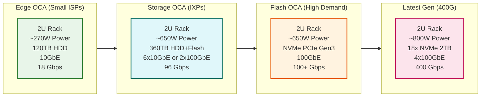

# Low-Level Design

[← Back to Index](./00-index.md) | [Previous: High-Level Design](./02-high-level-design.md) | [Next: Deep Dive →](./04-deep-dive-and-bottlenecks.md)

---

## OCA Hardware Specifications

### Hardware Tiers



### Detailed Hardware Specifications

| Specification | Edge OCA | Storage OCA | Flash OCA | Latest (400G) |
|---------------|----------|-------------|-----------|---------------|
| **Form Factor** | 2U | 2U | 2U | 2U |
| **Power** | ~270W (AC/DC) | ~650W (AC/DC) | ~650W | ~800W |
| **Storage Type** | HDD | HDD + Flash | NVMe SSD | NVMe Gen4 |
| **Storage Capacity** | 120 TB | 360 TB | 36-72 TB | 36 TB (18x2TB) |
| **CPU** | Intel Xeon | Intel Xeon E5v4 | Xeon E5v4 2697A | AMD EPYC Rome 7502P |
| **RAM** | 128-256 GB | 256 GB | 256 GB | 256 GB |
| **Network** | 10GbE | 6x10GbE or 2x100GbE | 100GbE | 4x100GbE |
| **Throughput** | 18 Gbps | 96 Gbps | 100+ Gbps | 400 Gbps |
| **Use Case** | Small ISPs | IXPs, large ISPs | High-demand | Next-gen deployment |

### Typical Large ISP Deployment

| Component | Quantity | Role |
|-----------|----------|------|
| Storage OCAs | 10 | Full catalog, fill source |
| Flash OCAs | 30 | High-speed serving of popular content |
| Total Capacity | ~4.5 PB | Combined storage |
| Total Throughput | ~4 Tbps | Peak serving capacity |

---

## Software Stack

### Operating System: FreeBSD

```
┌─────────────────────────────────────────────────────────────────────────────┐
│                         OCA SOFTWARE STACK                                   │
├─────────────────────────────────────────────────────────────────────────────┤
│                                                                              │
│  ┌─────────────────────────────────────────────────────────────────────────┐│
│  │                        APPLICATION LAYER                                 ││
│  │  ┌─────────────┐  ┌─────────────┐  ┌─────────────┐  ┌─────────────┐    ││
│  │  │   NGINX     │  │    BIRD     │  │    Fill     │  │   Health    │    ││
│  │  │  (Serving)  │  │   (BGP)     │  │   Agent     │  │   Reporter  │    ││
│  │  └─────────────┘  └─────────────┘  └─────────────┘  └─────────────┘    ││
│  └─────────────────────────────────────────────────────────────────────────┘│
│                                                                              │
│  ┌─────────────────────────────────────────────────────────────────────────┐│
│  │                        OPTIMIZATION LAYER                                ││
│  │  ┌─────────────────────┐  ┌─────────────────────┐  ┌─────────────────┐ ││
│  │  │  Zero-Copy sendfile │  │   kTLS Offload      │  │  NUMA-Aware     │ ││
│  │  │  (Disk → Network)   │  │  (NIC Encryption)   │  │  Memory Alloc   │ ││
│  │  └─────────────────────┘  └─────────────────────┘  └─────────────────┘ ││
│  └─────────────────────────────────────────────────────────────────────────┘│
│                                                                              │
│  ┌─────────────────────────────────────────────────────────────────────────┐│
│  │                        KERNEL LAYER                                      ││
│  │  ┌─────────────────────────────────────────────────────────────────────┐││
│  │  │              FreeBSD (Tracks HEAD Branch)                           │││
│  │  │              • 5-15 weeks from upstream commit to deployment        │││
│  │  │              • Custom kernel optimizations for streaming            │││
│  │  │              • ZFS for content storage                              │││
│  │  └─────────────────────────────────────────────────────────────────────┘││
│  └─────────────────────────────────────────────────────────────────────────┘│
│                                                                              │
│  ┌─────────────────────────────────────────────────────────────────────────┐│
│  │                        HARDWARE LAYER                                    ││
│  │  ┌──────────────┐  ┌──────────────┐  ┌──────────────┐  ┌────────────┐  ││
│  │  │  NVMe Drives │  │  Mellanox    │  │  AMD EPYC/   │  │   DDR4     │  ││
│  │  │  (Storage)   │  │  100GbE NIC  │  │  Intel Xeon  │  │   Memory   │  ││
│  │  └──────────────┘  └──────────────┘  └──────────────┘  └────────────┘  ││
│  └─────────────────────────────────────────────────────────────────────────┘│
│                                                                              │
└─────────────────────────────────────────────────────────────────────────────┘
```

### Why FreeBSD?

| Reason | Benefit |
|--------|---------|
| **BSD License** | No copyleft, Netflix can modify freely |
| **Network Stack** | Mature, high-performance TCP/IP |
| **ZFS** | Native, production-quality filesystem |
| **sendfile()** | Zero-copy data transfer |
| **kTLS** | Kernel TLS for NIC offload |
| **NUMA Support** | Multi-socket CPU optimization |
| **Upstream Tracking** | Netflix contributes fixes back |

### NGINX Configuration

NGINX serves as the HTTP server for content delivery with key optimizations:

```
PSEUDOCODE: NGINX Content Serving Flow

FUNCTION serve_video_segment(request):
    file_path = resolve_url_to_file(request.url)

    IF NOT file_exists(file_path):
        RETURN 404 Not Found

    // Zero-copy sendfile optimization
    fd = open(file_path, O_RDONLY)

    // Set appropriate headers
    response.headers["Content-Type"] = "video/mp4"
    response.headers["Accept-Ranges"] = "bytes"
    response.headers["Cache-Control"] = "max-age=31536000"

    IF request.has_range_header:
        // Support partial content for seeking
        range = parse_range_header(request)
        sendfile(socket, fd, range.start, range.length)
        RETURN 206 Partial Content
    ELSE:
        sendfile(socket, fd, 0, file_size)
        RETURN 200 OK
```

### BIRD BGP Configuration

BIRD handles BGP peering with ISPs:

```
PSEUDOCODE: BGP Session Configuration

CONFIGURATION bird_bgp:
    router_id = OCA_IP_ADDRESS

    PROTOCOL bgp ISP_PEER:
        local as 40027              // Netflix ASN
        neighbor ISP_ROUTER_IP as ISP_ASN

        // Import ISP routes
        import filter {
            IF net.len >= 8 AND net.len <= 24:  // IPv4
                accept
            IF net.len >= 19 AND net.len <= 48:  // IPv6
                accept
            reject
        }

        // Export Netflix prefixes
        export filter {
            IF net ~ NETFLIX_PREFIXES:
                accept
            reject
        }

        // Keepalive settings
        hold time 90
        keepalive time 30
```

---

## Data Models

### Fill Manifest Schema

```
STRUCTURE FillManifest:
    manifest_id: UUID
    generated_at: Timestamp
    target_oca_id: String
    region: String
    isp_asn: Integer
    fill_window: TimeRange

    files: List[FileEntry]

STRUCTURE FileEntry:
    file_id: UUID
    title_id: String
    encoding_profile: String      // "AV1_1080p_5Mbps"
    file_size_bytes: Long
    content_hash: SHA256
    priority: Integer             // 1 = highest
    copies_required: Integer      // Redundancy within cluster
    source_url: String            // S3 or upstream OCA

STRUCTURE TimeRange:
    start_hour_utc: Integer       // 0-23
    end_hour_utc: Integer
    timezone_offset: Integer      // ISP local time adjustment
```

### OCA Health Report Schema

```
STRUCTURE OCAHealthReport:
    oca_id: String
    timestamp: Timestamp
    location: GeoLocation

    // Resource utilization
    cpu_utilization_pct: Float
    memory_utilization_pct: Float
    disk_utilization_pct: Float
    network_throughput_gbps: Float

    // Content inventory
    files_hosted: Integer
    total_storage_bytes: Long
    available_storage_bytes: Long

    // Serving metrics
    active_connections: Integer
    requests_per_second: Integer
    cache_hit_rate: Float
    error_rate: Float

    // BGP status
    bgp_state: Enum[ESTABLISHED, IDLE, ACTIVE]
    bgp_prefixes_received: Integer

    // Fill status
    last_fill_completed: Timestamp
    fill_in_progress: Boolean
    pending_files: Integer

STRUCTURE GeoLocation:
    latitude: Float
    longitude: Float
    city: String
    country_code: String
    isp_name: String
    asn: Integer
```

### Steering Playback Manifest Schema

```
STRUCTURE SteeringPlaybackManifest:
    request_id: UUID
    client_ip: IPAddress
    device_type: String
    title_id: String
    files_requested: List[String]

    // Steering decision
    proximity_rank: List[RankedOCA]
    selected_oca: String
    fallback_ocas: List[String]

    // Decision metadata
    decision_timestamp: Timestamp
    decision_factors: Map[String, Float]

STRUCTURE RankedOCA:
    oca_id: String
    rank: Integer                 // 1 = best
    as_path_length: Integer
    health_score: Float
    has_content: Boolean
    estimated_latency_ms: Integer
```

---

## API Design

### Steering Service API

```
ENDPOINT: POST /steering/v1/get-oca-urls

REQUEST:
{
    "client_ip": "203.0.113.42",
    "device_type": "smart_tv",
    "title_id": "80057281",
    "files": [
        "80057281_AV1_1080p_5Mbps_seg001.mp4",
        "80057281_AV1_1080p_5Mbps_seg002.mp4"
    ],
    "session_id": "abc123"
}

RESPONSE:
{
    "request_id": "uuid-here",
    "primary_oca": {
        "oca_id": "oca-atl-edge-001",
        "base_url": "https://ipv4-c001-atl001.1.oca.nflxvideo.net",
        "health_score": 0.95
    },
    "fallback_ocas": [
        {
            "oca_id": "oca-atl-edge-002",
            "base_url": "https://ipv4-c002-atl001.1.oca.nflxvideo.net",
            "health_score": 0.92
        },
        {
            "oca_id": "oca-ixp-east-storage",
            "base_url": "https://ipv4-c001-ixp-east.1.oca.nflxvideo.net",
            "health_score": 0.98
        }
    ],
    "ttl_seconds": 300
}
```

### Fill Controller API

```
ENDPOINT: GET /fill/v1/manifest/{oca_id}

REQUEST:
    Path: /fill/v1/manifest/oca-atl-edge-001
    Headers:
        X-OCA-Auth-Token: <signed_token>

RESPONSE:
{
    "manifest_id": "mfst-20260202-001",
    "oca_id": "oca-atl-edge-001",
    "generated_at": "2026-02-02T02:00:00Z",
    "fill_window": {
        "start": "2026-02-02T04:00:00Z",
        "end": "2026-02-02T10:00:00Z"
    },
    "actions": [
        {
            "type": "ADD",
            "file_id": "80057281_AV1_1080p_5Mbps",
            "size_bytes": 3221225472,
            "source": "oca-ixp-east-storage",
            "priority": 1
        },
        {
            "type": "DELETE",
            "file_id": "70142827_H264_720p_3Mbps",
            "reason": "popularity_drop"
        }
    ],
    "expected_storage_after": "118.5TB"
}
```

### OCA Health Reporting API

```
ENDPOINT: POST /health/v1/report

REQUEST:
{
    "oca_id": "oca-atl-edge-001",
    "timestamp": "2026-02-02T15:30:00Z",
    "metrics": {
        "cpu_pct": 45.2,
        "memory_pct": 62.1,
        "disk_pct": 78.5,
        "network_gbps": 12.4,
        "active_connections": 15420,
        "requests_per_sec": 8500,
        "cache_hit_rate": 0.967,
        "error_rate": 0.001
    },
    "bgp": {
        "state": "ESTABLISHED",
        "prefixes": 2847
    },
    "content": {
        "files_hosted": 1250000,
        "total_bytes": 118500000000000
    }
}

RESPONSE:
{
    "status": "accepted",
    "next_report_interval_sec": 60
}
```

---

## Core Algorithms

### Steering Algorithm

```
PSEUDOCODE: OCA Selection Algorithm

FUNCTION select_oca(client_ip, requested_files):
    // Step 1: Identify client's ISP
    isp_info = lookup_ip_to_isp(client_ip)
    asn = isp_info.asn
    region = isp_info.region

    // Step 2: Get candidate OCAs
    candidates = []

    // Prefer embedded OCAs (AS-PATH = 1)
    embedded_ocas = get_embedded_ocas_for_asn(asn)
    FOR EACH oca IN embedded_ocas:
        IF oca.has_files(requested_files) AND oca.is_healthy():
            candidates.append({oca, as_path=1})

    // Add IXP storage OCAs as fallback (AS-PATH = 2)
    storage_ocas = get_storage_ocas_for_region(region)
    FOR EACH oca IN storage_ocas:
        IF oca.has_files(requested_files) AND oca.is_healthy():
            candidates.append({oca, as_path=2})

    // Step 3: Rank candidates
    FOR EACH candidate IN candidates:
        score = compute_score(candidate)

    SORT candidates BY score DESCENDING

    // Step 4: Return top 3 (primary + 2 fallbacks)
    RETURN candidates[0:3]

FUNCTION compute_score(candidate):
    // Modified BGP best-path selection
    score = 0

    // AS-PATH length (most important)
    score += (10 - candidate.as_path) * 1000

    // Health score (0-1)
    score += candidate.health_score * 500

    // Load balancing factor
    score += (1 - candidate.utilization) * 200

    // Geographic proximity (estimated latency)
    score += (100 - candidate.estimated_latency_ms) * 1

    RETURN score
```

### Popularity Prediction Algorithm

```
PSEUDOCODE: File-Level Popularity Prediction

FUNCTION predict_popularity(region, time_window):
    predictions = {}

    FOR EACH file IN catalog.all_files():
        // Historical viewing patterns
        historical_views = get_views(file, region, past_30_days)

        // Time-of-day patterns
        time_factor = get_time_pattern(file.genre, time_window)

        // Trending signals
        trending_score = 0
        IF file.title.release_date > today - 7_days:
            trending_score = calculate_new_release_boost(file)
        IF file.title IN social_media_trending():
            trending_score += 0.5

        // Seasonal patterns
        seasonal_factor = get_seasonal_pattern(file.genre, today)

        // Combine factors
        predicted_popularity = (
            historical_views * 0.5 +
            time_factor * 0.2 +
            trending_score * 0.2 +
            seasonal_factor * 0.1
        )

        predictions[file.id] = predicted_popularity

    // Normalize and rank
    RETURN normalize_and_rank(predictions)

FUNCTION generate_fill_manifest(oca, predictions, storage_capacity):
    manifest = FillManifest(oca_id=oca.id)

    // Sort files by predicted popularity
    ranked_files = SORT predictions BY value DESCENDING

    // Fill storage with highest-priority content
    current_size = 0
    FOR EACH file, popularity IN ranked_files:
        file_size = catalog.get_size(file)

        IF current_size + file_size <= storage_capacity:
            manifest.files.append(FileEntry(
                file_id=file,
                priority=rank,
                copies_required=calculate_copies(popularity)
            ))
            current_size += file_size
        ELSE:
            BREAK

    RETURN manifest
```

### Zero-Copy sendfile() Flow

```
PSEUDOCODE: Zero-Copy Data Transfer

FUNCTION sendfile_zero_copy(socket_fd, file_fd, offset, count):
    // Traditional approach (WITH copy):
    // 1. Read from disk to kernel buffer
    // 2. Copy from kernel buffer to user space
    // 3. Copy from user space to kernel socket buffer
    // 4. Send from socket buffer to NIC
    // TOTAL: 4 context switches, 2 memory copies

    // Zero-copy approach (FreeBSD sendfile):
    // 1. Create mbuf pointing to page cache
    // 2. Send mbuf directly to NIC via DMA
    // TOTAL: 2 context switches, 0 memory copies

    // Implementation
    headers = create_http_headers()

    // FreeBSD sendfile with SF_FLAGS
    result = sendfile(
        file_fd,           // Source file descriptor
        socket_fd,         // Destination socket
        offset,            // File offset
        count,             // Bytes to send
        headers,           // HTTP headers (sent first)
        SF_NODISKIO |      // Don't block on disk I/O
        SF_NOCACHE         // Don't cache in ARC
    )

    RETURN result
```

### kTLS Offload

```
PSEUDOCODE: Kernel TLS with NIC Offload

FUNCTION setup_ktls_offload(socket_fd, crypto_params):
    // Enable kernel TLS
    setsockopt(socket_fd, SOL_TCP, TCP_TXTLS_ENABLE, ON)

    // Configure cipher suite
    tls_config = TLSConfig(
        cipher = AES_128_GCM,
        version = TLS_1_3,
        session_key = crypto_params.key,
        session_iv = crypto_params.iv
    )

    setsockopt(socket_fd, SOL_TLS, TLS_TX, tls_config)

    // Offload to NIC (Mellanox ConnectX-6)
    IF nic_supports_ktls_offload():
        // Encryption happens in NIC, not CPU
        enable_ktls_offload(socket_fd)
        // Saves ~60% CPU utilization

    RETURN socket_fd

// With kTLS offload:
// CPU: Handles TLS record framing only
// NIC: Handles AES-GCM encryption
// Result: 400Gbps per server possible
```

---

## Content Hashing and Deduplication

### File Identification

```
STRUCTURE ContentFile:
    // Unique identifier
    file_id: String           // "80057281_AV1_1080p_5Mbps"

    // Components
    title_id: String          // "80057281" (Stranger Things)
    codec: Enum[AV1, VP9, H264, HEVC]
    resolution: String        // "1080p"
    bitrate: String           // "5Mbps"
    audio_track: String       // "en_US_5.1"

    // Integrity
    content_hash: SHA256
    file_size: Long

    // Metadata
    duration_seconds: Integer
    segment_count: Integer
    created_at: Timestamp

FUNCTION compute_file_id(title_id, codec, resolution, bitrate, audio):
    // Deterministic file ID generation
    RETURN f"{title_id}_{codec}_{resolution}_{bitrate}_{audio}"
```

### Storage Layout on OCA

```
/data/
├── manifest/
│   └── current.json          # Active fill manifest
├── content/
│   ├── 80/                   # Title ID prefix (2 chars)
│   │   ├── 057/              # Title ID mid (3 chars)
│   │   │   ├── 281/          # Title ID suffix (3 chars)
│   │   │   │   ├── AV1_1080p_5Mbps.mp4
│   │   │   │   ├── AV1_720p_3Mbps.mp4
│   │   │   │   ├── VP9_1080p_5Mbps.mp4
│   │   │   │   └── H264_480p_1Mbps.mp4
├── index/
│   └── file_index.db         # Fast file lookup
└── health/
    └── status.json           # Current OCA status
```

---

## Time/Space Complexity

| Algorithm | Time Complexity | Space Complexity | Notes |
|-----------|-----------------|------------------|-------|
| OCA Selection | O(n log n) | O(n) | n = candidate OCAs (~100) |
| Popularity Prediction | O(m) | O(m) | m = files in catalog (~10M) |
| Fill Manifest Generation | O(m log m) | O(k) | k = files per OCA (~1M) |
| IP-to-ISP Lookup | O(1) | O(p) | p = BGP prefixes (~1M), uses trie |
| File Serving | O(1) | O(1) | Direct sendfile() |
| Health Aggregation | O(n) | O(n) | n = OCAs (19K) |

---

*Next: [Deep Dive & Bottlenecks →](./04-deep-dive-and-bottlenecks.md)*
