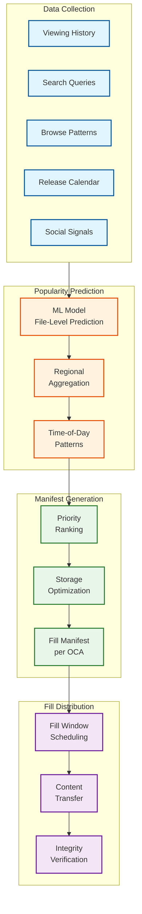
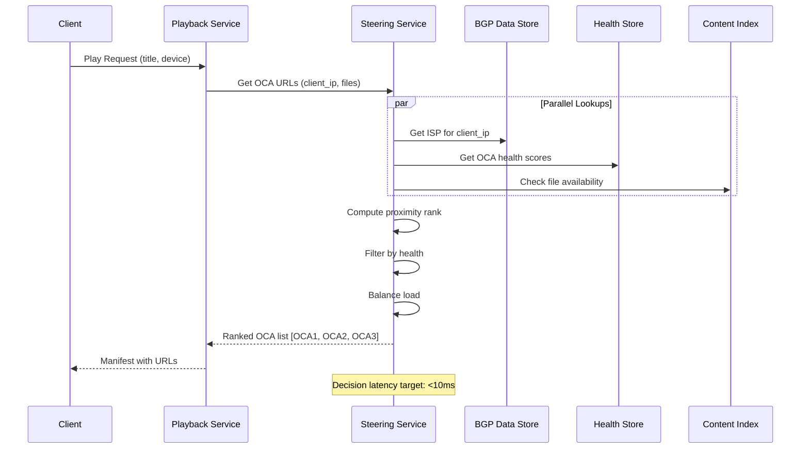
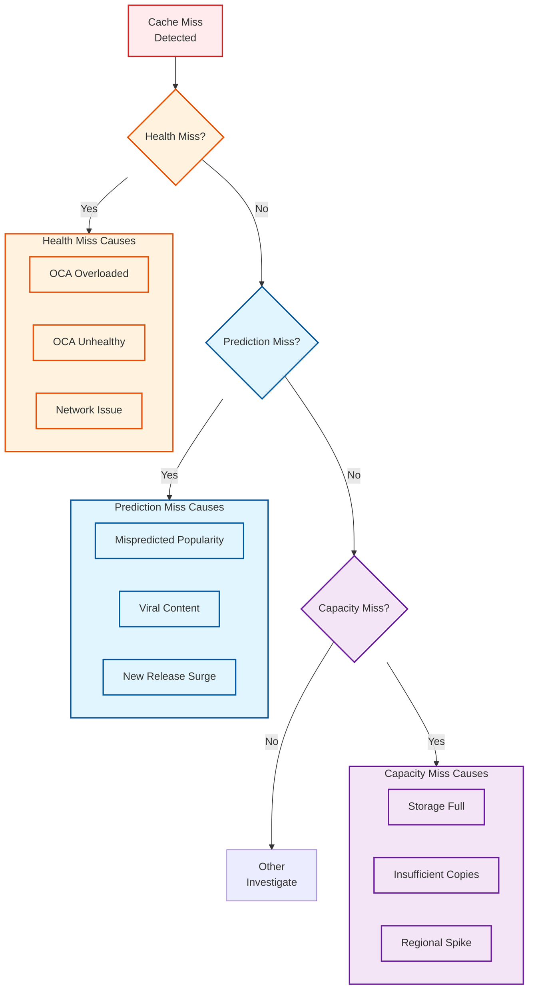
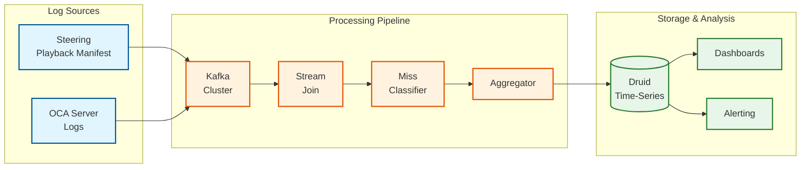

# Deep Dive & Bottlenecks

[← Back to Index](./00-index.md) | [Previous: Low-Level Design](./03-low-level-design.md) | [Next: Scalability →](./05-scalability-and-reliability.md)

---

## Critical Component 1: Proactive Caching System

### Why Critical

The proactive caching system is the foundation of Open Connect's efficiency. Unlike reactive CDNs that cache content on first request (cache miss for first viewer), Open Connect pre-positions content before users request it. This requires accurate popularity prediction at file-level granularity.

### How It Works



### Prediction Challenges

| Challenge | Solution |
|-----------|----------|
| **File-Level Granularity** | Predict each encoding profile separately (100-200 per title) |
| **Regional Variation** | Separate models per region/ISP |
| **New Releases** | Boost factor based on marketing signals, similar titles |
| **Viral Content** | Monitor social media, adjust in out-of-cycle fills |
| **Long-Tail Content** | Storage OCAs hold full catalog for rare requests |

### Failure Modes

| Failure | Impact | Mitigation |
|---------|--------|------------|
| **Misprediction** | Cache miss, IXP fallback | Automated remediation, fast out-of-cycle fill |
| **Fill Window Overrun** | Incomplete catalog | Priority ordering, critical content first |
| **Network Congestion** | Fill delays | Multiple fill sources, bandwidth reservation |
| **Storage Full** | Cannot add new content | Aggressive eviction of low-popularity content |

---

## Critical Component 2: Steering Service

### Why Critical

The Steering Service determines which OCA serves each playback request. Poor steering decisions result in suboptimal latency, cache misses, or OCA overload. The service must make decisions in real-time at 100K+ requests/second globally.

### Steering Decision Flow



### Proximity Ranking Algorithm

```
PSEUDOCODE: Proximity Rank Computation

FUNCTION compute_proximity_rank(client_ip, requested_files):
    // Step 1: Identify client's network path
    client_asn = lookup_asn(client_ip)
    client_bgp_path = get_bgp_path_from_client(client_asn)

    // Step 2: Get all OCAs that could serve this request
    candidate_ocas = []

    // Embedded OCAs (highest priority - AS-PATH = 1)
    FOR EACH oca IN get_embedded_ocas(client_asn):
        IF has_all_files(oca, requested_files):
            candidate_ocas.append({
                oca: oca,
                as_path_length: 1,
                type: "EMBEDDED"
            })

    // IXP OCAs via peering (AS-PATH = 2)
    FOR EACH ixp IN get_nearby_ixps(client_asn):
        FOR EACH oca IN ixp.storage_ocas:
            IF has_all_files(oca, requested_files):
                candidate_ocas.append({
                    oca: oca,
                    as_path_length: 2,
                    type: "IXP"
                })

    // Step 3: Score and rank
    FOR EACH candidate IN candidate_ocas:
        // Primary factor: AS-PATH length (lower = better)
        candidate.score = (10 - candidate.as_path_length) * 10000

        // Health factor (0-1 scale)
        health = get_health_score(candidate.oca)
        candidate.score += health * 1000

        // Load factor (prefer less loaded)
        load = get_current_load(candidate.oca)
        candidate.score += (1 - load) * 500

        // Latency estimate
        latency_ms = estimate_latency(client_ip, candidate.oca)
        candidate.score -= latency_ms

    // Step 4: Sort and return top 3
    SORT candidate_ocas BY score DESCENDING
    RETURN candidate_ocas[0:3]
```

### Failure Modes

| Failure | Impact | Mitigation |
|---------|--------|------------|
| **Steering Service Down** | No new playback starts | Multi-region AWS deployment, client caches URLs |
| **BGP Data Stale** | Suboptimal routing | Real-time BGP feed, 60s refresh |
| **Health Data Lag** | Route to unhealthy OCA | Aggressive health checks (every 10s) |
| **Content Index Mismatch** | Route to OCA without content | Real-time inventory sync |

---

## Critical Component 3: Cache Miss Classification System

### Why Critical

Understanding why cache misses occur is essential for optimizing the entire system. Netflix's July 2025 blog details their cache miss classification system that enables targeted improvements.

### Cache Miss Categories



### Classification Algorithm

```
PSEUDOCODE: Cache Miss Classification

FUNCTION classify_cache_miss(steering_manifest, oca_log):
    // Join steering decision with actual serving data
    expected_oca = steering_manifest.proximity_rank[0]
    actual_oca = oca_log.serving_oca

    IF expected_oca == actual_oca:
        RETURN NULL  // Not a cache miss

    // Determine miss category
    miss_info = CacheMissInfo()

    // Check for health miss
    health_at_time = get_health(expected_oca, steering_manifest.timestamp)
    IF health_at_time.overloaded OR health_at_time.unhealthy:
        miss_info.category = "HEALTH"
        miss_info.subcategory = determine_health_subcategory(health_at_time)
        RETURN miss_info

    // Check for prediction miss
    content_at_time = get_content_inventory(expected_oca, steering_manifest.timestamp)
    requested_file = steering_manifest.files[0]
    IF requested_file NOT IN content_at_time:
        miss_info.category = "PREDICTION"
        miss_info.subcategory = analyze_prediction_miss(requested_file)
        RETURN miss_info

    // Check for capacity miss
    IF content_at_time.copies_of(requested_file) < traffic_demand:
        miss_info.category = "CAPACITY"
        miss_info.subcategory = "INSUFFICIENT_COPIES"
        RETURN miss_info

    // Unknown - needs investigation
    miss_info.category = "OTHER"
    RETURN miss_info

FUNCTION analyze_prediction_miss(file):
    // Determine why file wasn't on OCA
    prediction_score = get_prediction_score(file, yesterday)

    IF prediction_score < THRESHOLD:
        RETURN "MISPREDICTED"

    IF file.title.release_date > today - 1_day:
        RETURN "NEW_RELEASE_SURGE"

    IF social_media_mentions(file.title) > VIRAL_THRESHOLD:
        RETURN "VIRAL_CONTENT"

    RETURN "UNKNOWN"
```

### Metrics Pipeline



---

## Bottleneck Analysis

### Bottleneck 1: Fill Window Constraints

```
┌─────────────────────────────────────────────────────────────────────────────┐
│                    FILL WINDOW BOTTLENECK ANALYSIS                           │
├─────────────────────────────────────────────────────────────────────────────┤
│                                                                              │
│  CONSTRAINT: Limited time to fill content before peak viewing hours          │
│                                                                              │
│  Given:                                                                       │
│  • Fill window: 6-8 hours (off-peak)                                         │
│  • Daily content churn: 1-5% of catalog                                      │
│  • Edge OCA storage: 120 TB                                                  │
│  • Fill interface: 10 GbE                                                    │
│                                                                              │
│  Calculation:                                                                 │
│  • Max fill per window = 10 Gbps × 8 hours × 3600s/hr = 36 TB               │
│  • Required fill (5% churn) = 120 TB × 0.05 = 6 TB                          │
│  • Headroom = 36 TB / 6 TB = 6× (comfortable)                               │
│                                                                              │
│  Risk Scenarios:                                                              │
│  • New season release (e.g., Squid Game S2): 50 GB × 10 episodes = 500 GB   │
│  • Catalog update (codec change): Could trigger 20%+ refresh                 │
│  • Network congestion: Effective bandwidth reduced                           │
│                                                                              │
│  Mitigations:                                                                 │
│  1. Priority-based fill (popular content first)                              │
│  2. Pre-fill new releases days before launch                                 │
│  3. Multiple fill sources (parallel transfers)                               │
│  4. Out-of-cycle fills for critical content                                  │
│                                                                              │
└─────────────────────────────────────────────────────────────────────────────┘
```

### Bottleneck 2: NVMe I/O Limits

```
┌─────────────────────────────────────────────────────────────────────────────┐
│                      NVMe I/O BOTTLENECK ANALYSIS                            │
├─────────────────────────────────────────────────────────────────────────────┤
│                                                                              │
│  CONSTRAINT: Disk read bandwidth limits serving throughput                   │
│                                                                              │
│  Flash OCA Configuration:                                                    │
│  • 4 NVMe PCIe Gen3 x4 drives                                               │
│  • Each drive: ~3 GB/s sequential read                                       │
│  • Total drive bandwidth: 12 GB/s = 96 Gbps                                 │
│                                                                              │
│  Network Configuration:                                                      │
│  • 100 GbE NIC                                                               │
│                                                                              │
│  Analysis:                                                                    │
│  • Drive bandwidth (96 Gbps) < Network bandwidth (100 Gbps)                 │
│  • Disk is the bottleneck, not network                                       │
│                                                                              │
│  Optimizations Applied:                                                       │
│  1. Zero-copy sendfile() - Avoid memory copy overhead                       │
│  2. Hot content in page cache - Reduce disk reads                           │
│  3. Sequential read patterns - Maximize drive throughput                     │
│  4. NUMA-aware allocation - Reduce cross-socket traffic                     │
│                                                                              │
│  Latest 400G OCA:                                                             │
│  • 18 NVMe drives × 3 GB/s = 54 GB/s = 432 Gbps                            │
│  • 4 × 100 GbE = 400 Gbps network                                           │
│  • Network becomes bottleneck (good - drives have headroom)                 │
│                                                                              │
└─────────────────────────────────────────────────────────────────────────────┘
```

### Bottleneck 3: BGP Convergence Time

```
┌─────────────────────────────────────────────────────────────────────────────┐
│                    BGP CONVERGENCE BOTTLENECK ANALYSIS                       │
├─────────────────────────────────────────────────────────────────────────────┤
│                                                                              │
│  CONSTRAINT: BGP convergence time during OCA failures                        │
│                                                                              │
│  Scenario: Embedded OCA fails, traffic must redirect to IXP                  │
│                                                                              │
│  BGP Timers:                                                                  │
│  • Keepalive interval: 30 seconds                                            │
│  • Hold time: 90 seconds                                                     │
│  • Detection time: Up to 90s before BGP declares peer down                  │
│                                                                              │
│  Impact During Convergence:                                                   │
│  • Steering service continues routing to failed OCA                         │
│  • Clients experience failures, retry on fallback OCA                       │
│  • User-perceived latency spike                                              │
│                                                                              │
│  Mitigations:                                                                 │
│  1. BFD (Bidirectional Forwarding Detection) - Sub-second failure detection │
│  2. Health checks independent of BGP - 10s interval                          │
│  3. Client-side fallback - Try alternate URLs immediately                   │
│  4. Multiple OCAs per ISP - N+1 redundancy                                  │
│  5. Pre-computed failover paths - Instant steering update                   │
│                                                                              │
│  Effective Failover Time:                                                     │
│  • With health checks: ~10-30 seconds                                        │
│  • With BFD: <1 second                                                       │
│  • Client retry: Immediate (fallback URLs in manifest)                      │
│                                                                              │
└─────────────────────────────────────────────────────────────────────────────┘
```

---

## Concurrency & Race Conditions

### Race Condition 1: Fill vs Serve

```
SCENARIO: Content being written (fill) while being requested (serve)

Timeline:
T0: OCA receives fill manifest with new file X
T1: OCA starts downloading file X
T2: Client requests file X (file incomplete)
T3: OCA receives request, file X not ready

SOLUTION:
- Atomic file operations using rename pattern
- Write to temporary file: X.tmp
- Rename to final name only after complete: X.tmp → X
- Content index only updated after rename
- Requests for X return 404 until rename complete
- Client falls back to next OCA in list

PSEUDOCODE:
FUNCTION fill_file(file_id, source_url):
    temp_path = f"/data/content/{file_id}.tmp"
    final_path = f"/data/content/{file_id}"

    // Download to temp location
    download(source_url, temp_path)

    // Verify integrity
    IF hash(temp_path) != expected_hash:
        delete(temp_path)
        RETURN ERROR

    // Atomic rename
    rename(temp_path, final_path)

    // Update content index
    content_index.add(file_id)
```

### Race Condition 2: Health Report vs Steering Decision

```
SCENARIO: OCA becomes unhealthy between health report and steering decision

Timeline:
T0: OCA reports healthy (CPU 40%)
T1: Traffic spike hits OCA (CPU 95%)
T2: Steering routes new request to OCA (based on T0 health)
T3: Request fails or slow due to overload

SOLUTION:
- Aggressive health reporting (every 10s vs 60s)
- Circuit breaker pattern in steering
- Track request success rates per OCA
- Predictive load shedding before overload

PSEUDOCODE:
FUNCTION get_oca_health(oca_id):
    // Get latest reported health
    reported_health = health_store.get(oca_id)

    // Get real-time request metrics
    recent_errors = metrics.get_error_rate(oca_id, last_60_seconds)
    recent_latency = metrics.get_p99_latency(oca_id, last_60_seconds)

    // Adjust health based on real-time signals
    IF recent_errors > ERROR_THRESHOLD:
        reported_health.score *= 0.5
        reported_health.degraded = TRUE

    IF recent_latency > LATENCY_THRESHOLD:
        reported_health.score *= 0.7

    RETURN reported_health
```

### Race Condition 3: Manifest Update vs OCA Poll

```
SCENARIO: New manifest generated while OCA is mid-fill

Timeline:
T0: Manifest v1 generated, OCA starts filling
T1: Popularity changes, Manifest v2 generated
T2: OCA finishes v1 fill, polls for manifest
T3: OCA gets v2, some v1 content now obsolete

SOLUTION:
- Manifest versioning with delta support
- OCAs report current manifest version
- Control plane generates incremental updates
- Grace period before deleting recently-filled content

PSEUDOCODE:
FUNCTION generate_manifest_delta(oca_id, current_version):
    current_manifest = manifest_store.get(oca_id, current_version)
    new_manifest = generate_full_manifest(oca_id)

    delta = ManifestDelta()

    FOR EACH file IN new_manifest.files:
        IF file NOT IN current_manifest.files:
            delta.add.append(file)

    FOR EACH file IN current_manifest.files:
        IF file NOT IN new_manifest.files:
            // Grace period: don't delete if filled < 24h ago
            IF file.filled_at > now() - 24_hours:
                delta.keep.append(file)
            ELSE:
                delta.delete.append(file)

    RETURN delta
```

---

## Failure Scenarios

### Scenario 1: IXP Outage

```
FAILURE: Entire IXP goes offline (power, network)

IMPACT:
- Storage OCAs at IXP unavailable
- Embedded OCAs lose fill source
- Cache miss traffic has no fallback

RECOVERY:
1. BGP withdraws IXP routes (automatic)
2. Steering redirects to alternate IXP (seconds)
3. Embedded OCAs use alternate fill source (next fill window)
4. Content availability may be reduced temporarily

MITIGATION:
- Multiple IXP presence per region
- Embedded OCAs have 24h+ content buffer
- Direct S3 fill path for critical content
```

### Scenario 2: ISP BGP Misconfiguration

```
FAILURE: ISP advertises wrong routes, traffic blackholed

IMPACT:
- Embedded OCAs unreachable
- All ISP subscribers affected
- Control plane thinks OCAs healthy (BGP looks OK)

DETECTION:
- Health checks fail (HTTP probes)
- Client error rate spikes
- No OCA logs from affected OCAs

RECOVERY:
1. Health aggregator marks OCAs unhealthy (10-30s)
2. Steering excludes affected OCAs
3. Traffic routes to IXP (higher latency but works)
4. Alert ISP operations team

MITIGATION:
- Independent health checks (not BGP-dependent)
- Multiple connectivity paths per ISP
- Pre-negotiated escalation procedures with ISPs
```

### Scenario 3: Viral Content Surge

```
FAILURE: Content goes viral, demand exceeds prediction

IMPACT:
- Popular content not on embedded OCAs
- IXP OCAs overwhelmed
- High cache miss rate

DETECTION:
- Cache miss classification shows "VIRAL_CONTENT"
- Social media monitoring alerts
- Real-time view counts exceed forecast

RECOVERY:
1. Out-of-cycle fill triggered (immediate)
2. Additional copies distributed to stressed regions
3. Steering adjusts to spread load
4. Prediction model updated for future

MITIGATION:
- Social media monitoring integration
- Hot standby capacity at IXPs
- Automatic out-of-cycle fill triggers
```

---

*Next: [Scalability & Reliability →](./05-scalability-and-reliability.md)*
