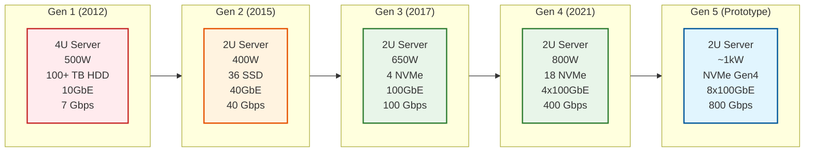
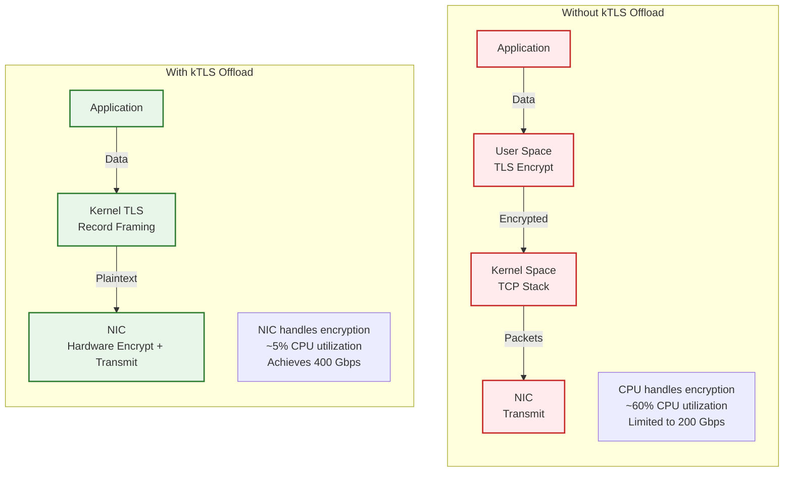
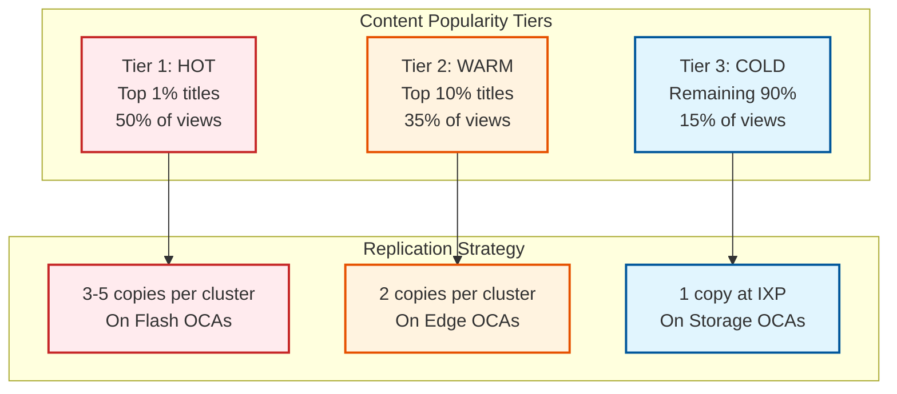
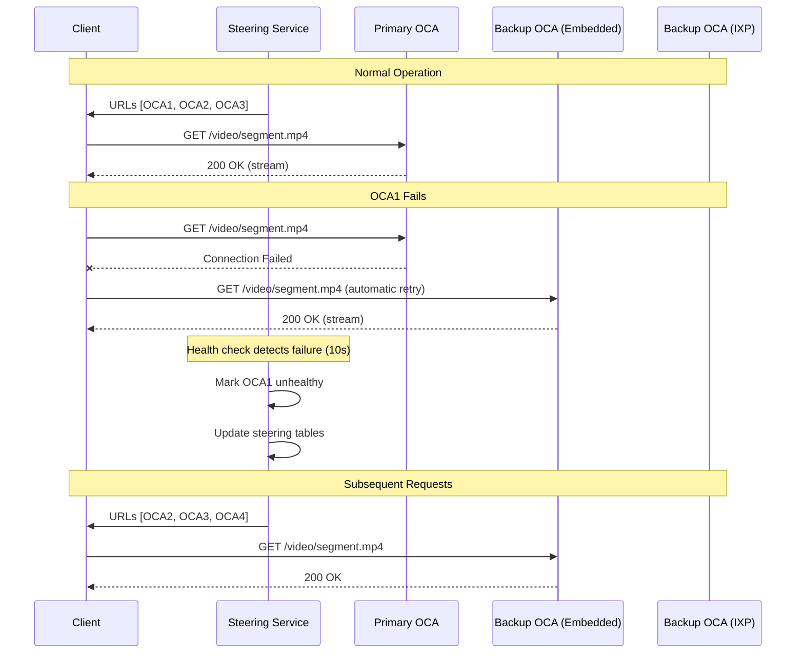

# Scalability & Reliability

[← Back to Index](./00-index.md) | [Previous: Deep Dive](./04-deep-dive-and-bottlenecks.md) | [Next: Security →](./06-security-and-compliance.md)

---

## OCA Throughput Evolution

### Performance Journey: 7 Gbps to 800 Gbps



### Key Optimizations per Generation

| Generation | Bottleneck | Optimization | Result |
|------------|------------|--------------|--------|
| **Gen 1 → Gen 2** | HDD IOPS | Switch to SSD | 6× throughput |
| **Gen 2 → Gen 3** | CPU encryption | Async I/O, sendfile | 2.5× throughput |
| **Gen 3 → Gen 4** | Memory bandwidth | kTLS NIC offload | 4× throughput |
| **Gen 4 → Gen 5** | NIC count | 8x100GbE | 2× throughput |

---

## 400 Gbps OCA Deep Dive

### Hardware Configuration

```
┌─────────────────────────────────────────────────────────────────────────────┐
│                    400 Gbps OCA HARDWARE ARCHITECTURE                        │
├─────────────────────────────────────────────────────────────────────────────┤
│                                                                              │
│  CPU: AMD EPYC Rome 7502P (32 cores @ 2.5 GHz)                              │
│  ├── 8 memory channels                                                       │
│  ├── 128 PCIe Gen4 lanes                                                    │
│  └── 150 GB/s memory bandwidth                                              │
│                                                                              │
│  MEMORY: 256 GB DDR4-3200                                                   │
│  ├── 8 channels × 32 GB                                                      │
│  └── Used for page cache, TLS state                                         │
│                                                                              │
│  STORAGE: 18× WD NVMe 2TB                                                   │
│  ├── PCIe Gen3 x4 each                                                       │
│  ├── 3 GB/s read per drive                                                   │
│  └── Total: 54 GB/s = 432 Gbps (I/O headroom)                               │
│                                                                              │
│  NETWORK: 2× Mellanox ConnectX-6 Dx                                         │
│  ├── 2× 100 GbE per NIC = 4× 100 GbE total                                  │
│  ├── Hardware kTLS offload                                                   │
│  └── Total: 400 Gbps line rate                                              │
│                                                                              │
│  BOTTLENECK ANALYSIS:                                                        │
│  • Storage: 432 Gbps (NOT bottleneck)                                       │
│  • Network: 400 Gbps (BOTTLENECK - good)                                    │
│  • CPU: Freed by kTLS offload                                               │
│  • Memory: 150 GB/s = 1200 Gbps (NOT bottleneck)                            │
│                                                                              │
└─────────────────────────────────────────────────────────────────────────────┘
```

### kTLS Offload



### NUMA Optimization

```
PSEUDOCODE: NUMA-Aware Memory Allocation

// Problem: Cross-NUMA access adds 100+ ns latency

// Solution: Keep data local to CPU socket

FUNCTION allocate_numa_local(size, cpu_affinity):
    // Determine which NUMA node the CPU belongs to
    numa_node = get_numa_node(cpu_affinity)

    // Allocate memory on that node
    memory = numa_alloc_onnode(size, numa_node)

    RETURN memory

// Netflix FreeBSD optimizations:
// 1. Allocate page cache pages on local NUMA node
// 2. Bind NIC interrupts to local CPUs
// 3. Direct kTLS buffers to local memory
// 4. TCP pacer threads bound to local domain

CONFIGURATION numa_binding:
    // NIC 1 (ports 0,1) → NUMA node 0
    nic_1_irq_affinity = CPUs_on_node_0
    nic_1_memory_node = 0

    // NIC 2 (ports 2,3) → NUMA node 1
    nic_2_irq_affinity = CPUs_on_node_1
    nic_2_memory_node = 1

    // Result: No cross-NUMA traffic for hot path
```

---

## Horizontal Scaling

### OCA Deployment Scaling

| Scale Factor | Approach | Trigger |
|--------------|----------|---------|
| **ISP Traffic Growth** | Add more OCAs to cluster | >80% utilization |
| **New ISP Partner** | Deploy initial OCA set | Partnership signed |
| **Geographic Expansion** | New IXP presence | Market entry |
| **Codec Transition** | Increase storage | AV1 adoption ramp |

### Cluster Sizing Model

```
PSEUDOCODE: OCA Cluster Sizing

FUNCTION calculate_oca_count(isp_asn):
    // Get traffic data
    peak_traffic_gbps = get_netflix_traffic(isp_asn, peak_hour)
    avg_traffic_gbps = get_netflix_traffic(isp_asn, daily_avg)

    // Get OCA specs
    oca_capacity_gbps = 18  // Edge OCA throughput

    // Calculate minimum OCAs needed
    min_ocas = ceil(peak_traffic_gbps / oca_capacity_gbps)

    // Add redundancy (N+1)
    redundant_ocas = min_ocas + 1

    // Add growth buffer (20%)
    final_ocas = ceil(redundant_ocas * 1.2)

    // Determine OCA type mix
    IF peak_traffic_gbps > 100:
        // Large ISP: mix of Flash + Edge
        flash_ocas = ceil(final_ocas * 0.75)
        edge_ocas = final_ocas - flash_ocas
    ELSE:
        // Small ISP: Edge only
        flash_ocas = 0
        edge_ocas = final_ocas

    RETURN {
        total: final_ocas,
        flash: flash_ocas,
        edge: edge_ocas
    }

// Example:
// ISP with 500 Gbps peak Netflix traffic
// min_ocas = 500 / 18 = 28
// redundant = 28 + 1 = 29
// with growth = 29 * 1.2 = 35 OCAs
// Flash: 26, Edge: 9
```

### Content Replication Strategy



---

## Reliability Mechanisms

### Single Point of Failure (SPOF) Analysis

| Component | SPOF Risk | Mitigation |
|-----------|-----------|------------|
| **Single OCA** | Low | N+1 redundancy per cluster |
| **ISP Network** | Medium | SFI peering backup |
| **IXP** | Medium | Multiple IXP presence |
| **AWS Steering** | Low | Multi-AZ, multi-region |
| **BGP Session** | Low | Multiple peers per OCA |
| **Power Supply** | Low | Redundant PSU in OCAs |

### Failover Mechanisms



### Graceful Degradation

| Traffic Level | Degradation Mode | User Impact |
|--------------|------------------|-------------|
| **100%** | Normal operation | None |
| **150%** | Reduce bitrate steered | Slight quality reduction |
| **200%** | Load shed new connections | Longer start time |
| **250%** | Route to alternate cluster | Higher latency |
| **500%+** | Origin fallback | Noticeable latency |

```
PSEUDOCODE: Graceful Degradation

FUNCTION handle_overload(oca_cluster, current_load):
    capacity = oca_cluster.total_capacity

    IF current_load <= capacity:
        RETURN NORMAL

    overload_ratio = current_load / capacity

    IF overload_ratio <= 1.5:
        // Reduce bitrate recommendations
        steering.set_bitrate_preference(oca_cluster, "conservative")
        RETURN DEGRADED_QUALITY

    IF overload_ratio <= 2.0:
        // Start load shedding new requests
        shed_rate = (overload_ratio - 1.5) * 0.2  // 0-10%
        steering.set_admission_rate(oca_cluster, 1 - shed_rate)
        RETURN LOAD_SHEDDING

    IF overload_ratio <= 2.5:
        // Route overflow to alternate cluster
        alternate = find_alternate_cluster(oca_cluster)
        steering.add_spillover(oca_cluster, alternate)
        RETURN SPILLOVER

    // Extreme overload - use origin
    steering.enable_origin_fallback(oca_cluster)
    RETURN ORIGIN_FALLBACK
```

---

## Disaster Recovery

### RTO/RPO Targets

| Component | RTO | RPO | Notes |
|-----------|-----|-----|-------|
| **Single OCA** | 0 (automatic failover) | 0 | Client retries immediately |
| **OCA Cluster** | 10-30 seconds | 0 | Steering redirect |
| **ISP Region** | 1-5 minutes | 0 | IXP fallback |
| **Control Plane** | 30 minutes | 1 hour | Multi-region AWS |
| **Fill System** | 24 hours | 24 hours | Next fill window |

### Backup Strategies

```
┌─────────────────────────────────────────────────────────────────────────────┐
│                    OPEN CONNECT BACKUP STRATEGIES                            │
├─────────────────────────────────────────────────────────────────────────────┤
│                                                                              │
│  LEVEL 1: OCA Failure                                                        │
│  ─────────────────────                                                       │
│  • Client retries fallback URLs (immediate)                                  │
│  • Steering excludes failed OCA (10-30s)                                    │
│  • Other cluster OCAs absorb load                                           │
│                                                                              │
│  LEVEL 2: Cluster Failure (Multiple OCAs)                                   │
│  ─────────────────────────────────────────                                   │
│  • Traffic redirects to IXP Storage OCAs                                    │
│  • Higher latency but functional                                            │
│  • Alert ISP operations team                                                 │
│                                                                              │
│  LEVEL 3: ISP Network Failure                                               │
│  ─────────────────────────────                                               │
│  • SFI peering provides alternate path                                      │
│  • Traffic routes via different transit                                     │
│  • May involve different IXP                                                │
│                                                                              │
│  LEVEL 4: Regional IXP Failure                                              │
│  ─────────────────────────────                                               │
│  • Traffic routes to adjacent region IXP                                    │
│  • Higher latency (cross-region)                                            │
│  • Automatic via BGP                                                        │
│                                                                              │
│  LEVEL 5: AWS Region Failure                                                │
│  ─────────────────────────────                                               │
│  • Control plane fails over to backup region                                │
│  • OCAs continue serving (data plane independent)                           │
│  • Fill paused until control plane restored                                 │
│                                                                              │
└─────────────────────────────────────────────────────────────────────────────┘
```

### Content Shedding Monitoring

When OCAs run low on storage, they must shed (delete) content. Active monitoring ensures this doesn't impact availability.

```
PSEUDOCODE: Content Shedding Alert

FUNCTION monitor_content_shedding():
    FOR EACH oca IN all_ocas:
        // Get current state
        current_files = oca.content_inventory()
        expected_files = get_expected_files(oca.manifest)

        // Calculate shedding
        missing_files = expected_files - current_files
        shed_count = len(missing_files)
        shed_bytes = sum(f.size FOR f IN missing_files)

        // Check thresholds
        IF shed_count > SHED_COUNT_THRESHOLD:
            alert(oca, "HIGH_SHED_COUNT", shed_count)

        IF shed_bytes > SHED_BYTES_THRESHOLD:
            alert(oca, "HIGH_SHED_BYTES", shed_bytes)

        // Check for popular content shedding
        FOR EACH file IN missing_files:
            IF file.popularity_rank < 100:  // Top 100
                alert(oca, "POPULAR_CONTENT_SHED", file)

    // Automated remediation
    FOR EACH alert IN pending_alerts:
        IF alert.type == "POPULAR_CONTENT_SHED":
            trigger_out_of_cycle_fill(alert.oca, alert.file)
```

---

## Auto-Scaling

### Control Plane Scaling

| Component | Scaling Trigger | Action |
|-----------|-----------------|--------|
| **Steering Service** | CPU > 70% | Add instances |
| **Fill Controller** | Queue depth > 1000 | Add workers |
| **Health Aggregator** | Message lag > 5s | Add consumers |
| **Metrics Pipeline** | Kafka lag > 10s | Add partitions |

### Data Plane Scaling

| Trigger | Detection | Action | Timeline |
|---------|-----------|--------|----------|
| **Traffic Growth** | Utilization trending up | Capacity planning | Quarterly |
| **New Market** | Business expansion | Deploy new cluster | Weeks |
| **Peak Event** | Scheduled (live event) | Pre-scale cluster | Days before |
| **Unexpected Surge** | Real-time monitoring | Failover + alert | Automatic |

---

## Hot Spot Mitigation

### Content Hot Spots

```
SCENARIO: New season of popular show releases at midnight

PROBLEM: All viewers request same files simultaneously

SOLUTION:
1. Pre-position multiple copies (3-5×) on Flash OCAs
2. Stagger steering across copies
3. Monitor per-file request rates
4. Dynamic copy adjustment during event

PSEUDOCODE:
FUNCTION handle_hot_content(file_id, request_rate):
    current_copies = get_copy_count(file_id)
    max_copies = MAX_COPIES_PER_FILE

    // Calculate needed copies based on request rate
    oca_capacity = 1000  // requests/sec per OCA
    needed_copies = ceil(request_rate / oca_capacity)

    IF needed_copies > current_copies AND current_copies < max_copies:
        // Add more copies
        additional = min(needed_copies - current_copies, max_copies - current_copies)
        ocas = select_ocas_for_replication(file_id, additional)
        FOR EACH oca IN ocas:
            trigger_immediate_fill(oca, file_id)

    // Distribute steering across copies
    steering.set_round_robin(file_id, all_copies)
```

### Geographic Hot Spots

```
SCENARIO: Regional event causes traffic spike (e.g., local sports content)

SOLUTION:
1. Detect geographic concentration
2. Route overflow to adjacent regions
3. Temporarily relax geo-constraints

PSEUDOCODE:
FUNCTION handle_regional_hotspot(region, overload_factor):
    IF overload_factor < 1.5:
        RETURN  // Normal headroom

    // Find adjacent regions with capacity
    adjacent = get_adjacent_regions(region)
    FOR EACH adj_region IN adjacent:
        IF adj_region.utilization < 0.7:
            spillover_targets.append(adj_region)

    // Configure spillover steering
    spillover_percentage = (overload_factor - 1) / overload_factor
    steering.enable_spillover(region, spillover_targets, spillover_percentage)

    // Monitor and adjust
    SCHEDULE check_hotspot_status(region, 5_minutes)
```

---

*Next: [Security & Compliance →](./06-security-and-compliance.md)*
