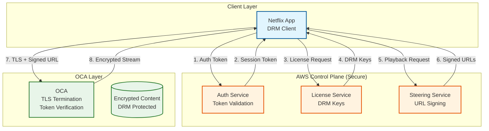
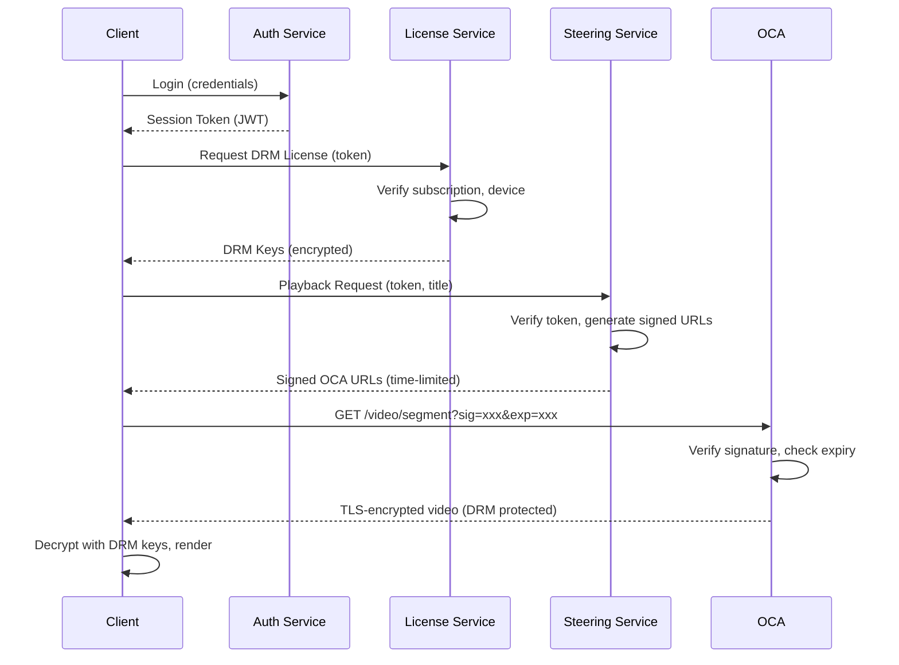
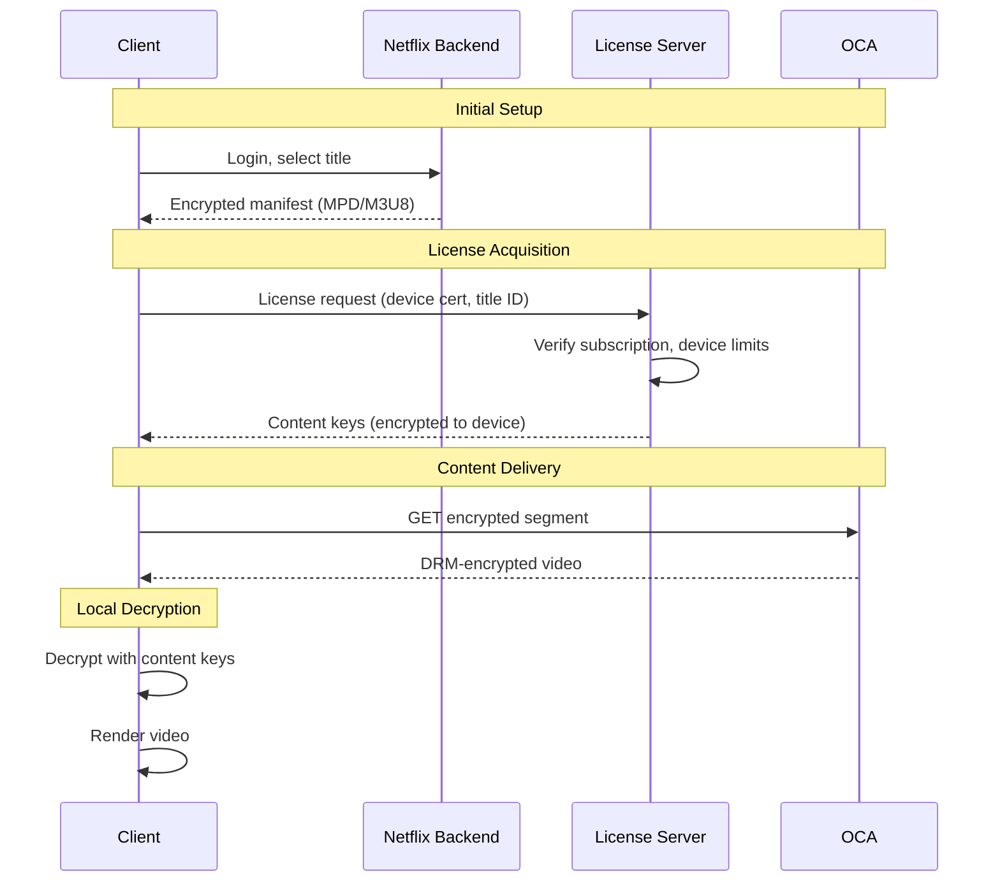

# Security & Compliance

[← Back to Index](./00-index.md) | [Previous: Scalability](./05-scalability-and-reliability.md) | [Next: Observability →](./07-observability.md)

---

## Security Architecture Overview



---

## Authentication & Authorization

### No User Data on OCAs

**Critical Design Decision:** OCAs store only video content. No user data, credentials, viewing history, or personal information is stored on appliances deployed in ISP networks.

| Data Type | Storage Location | OCA Exposure |
|-----------|------------------|--------------|
| User credentials | AWS (Netflix backend) | None |
| Viewing history | AWS (Netflix backend) | None |
| DRM keys | License server (AWS) | None |
| Video content | OCA (encrypted with DRM) | Content only |
| Session tokens | Client memory | Transient validation |

### URL Signing

OCAs validate requests using signed URLs generated by the Steering Service:

```
PSEUDOCODE: URL Signing and Verification

// SIGNING (Steering Service in AWS)
FUNCTION sign_oca_url(oca_host, file_path, client_ip, expiry):
    // Build URL with parameters
    url_params = {
        "exp": expiry,              // Unix timestamp
        "ip": hash(client_ip),      // IP binding (optional)
        "sig": ""                   // Placeholder
    }

    // Generate signature
    message = f"{oca_host}{file_path}?exp={expiry}&ip={url_params.ip}"
    signature = HMAC_SHA256(SIGNING_SECRET, message)

    url_params.sig = base64_encode(signature)

    RETURN f"https://{oca_host}{file_path}?exp={expiry}&ip={url_params.ip}&sig={url_params.sig}"

// VERIFICATION (OCA)
FUNCTION verify_signed_url(request):
    // Check expiry
    IF request.params.exp < current_time():
        RETURN 403  // Expired

    // Optional: Check IP binding
    IF request.params.ip != hash(request.client_ip):
        RETURN 403  // IP mismatch

    // Verify signature
    message = f"{request.host}{request.path}?exp={request.params.exp}&ip={request.params.ip}"
    expected_sig = HMAC_SHA256(SIGNING_SECRET, message)

    IF request.params.sig != base64_encode(expected_sig):
        RETURN 403  // Invalid signature

    RETURN 200  // Valid, proceed with serving
```

### Token Flow



---

## Data Security

### Encryption at Rest

| Data | Encryption | Key Management |
|------|------------|----------------|
| Video content on OCAs | DRM (Widevine/FairPlay) | Netflix License Server |
| OCA configuration | Not sensitive | N/A |
| Fill manifests | TLS in transit | Ephemeral |
| Health reports | TLS in transit | Ephemeral |

**Note:** Video files on OCAs are DRM-encrypted. Even if an attacker gains physical access to an OCA, the content is useless without valid DRM licenses from Netflix's license server.

### Encryption in Transit

| Connection | Protocol | Cipher |
|------------|----------|--------|
| Client ↔ OCA | TLS 1.3 | AES-128-GCM |
| OCA ↔ Control Plane | TLS 1.3 | AES-256-GCM |
| Fill traffic | TLS 1.3 | AES-256-GCM |
| BGP sessions | MD5 auth | N/A |

### kTLS Implementation

```
CONFIGURATION: kTLS with NIC Offload

// FreeBSD kernel configuration
sysctl kern.ipc.tls.enable=1
sysctl kern.ipc.tls.ifnet.permitted=1

// NGINX configuration
server {
    listen 443 ssl;
    ssl_protocols TLSv1.3;
    ssl_ciphers TLS_AES_128_GCM_SHA256;

    # Enable kernel TLS
    ssl_conf_command Options KTLS;

    # NIC offload (Mellanox ConnectX-6)
    # Encryption happens in hardware
}

// Result:
// • CPU freed from AES-GCM operations
// • 60% reduction in CPU utilization
// • Enables 400 Gbps per server
```

---

## DRM Integration

### Multi-DRM Strategy

| DRM System | Devices | Key Provider |
|------------|---------|--------------|
| **Widevine** | Android, Chrome, Chromecast | Google |
| **FairPlay** | iOS, macOS, Safari, Apple TV | Apple |
| **PlayReady** | Windows, Xbox, Smart TVs | Microsoft |

### DRM Flow



### Content Protection on OCAs

```
┌─────────────────────────────────────────────────────────────────────────────┐
│                      DRM CONTENT PROTECTION ON OCAs                          │
├─────────────────────────────────────────────────────────────────────────────┤
│                                                                              │
│  CONTENT STORED ON OCA:                                                      │
│  ┌────────────────────────────────────────────────────────────────────────┐ │
│  │  video_segment.mp4 (DRM-encrypted)                                     │ │
│  │  ├── Video: AES-128-CTR encrypted                                      │ │
│  │  ├── Audio: AES-128-CTR encrypted                                      │ │
│  │  └── Keys: NOT stored on OCA                                           │ │
│  └────────────────────────────────────────────────────────────────────────┘ │
│                                                                              │
│  WHAT OCA CAN DO:                                                            │
│  • Serve encrypted content to authorized clients                            │
│  • Verify URL signatures (time-limited access)                              │
│  • Rate limit connections                                                   │
│                                                                              │
│  WHAT OCA CANNOT DO:                                                         │
│  • Decrypt content (no keys)                                                │
│  • Issue licenses (no key server access)                                    │
│  • Identify users (no user data)                                            │
│  • Bypass DRM (content useless without license)                             │
│                                                                              │
│  ATTACK SCENARIOS:                                                           │
│  • Physical access to OCA → Encrypted content only (useless)               │
│  • Network interception → TLS encrypted (useless)                          │
│  • Rogue ISP employee → Cannot decrypt content                             │
│                                                                              │
└─────────────────────────────────────────────────────────────────────────────┘
```

---

## Threat Model

### Top Threats

| Threat | Vector | Impact | Likelihood | Mitigation |
|--------|--------|--------|------------|------------|
| **Content Piracy** | DRM bypass on client | Revenue loss | Medium | Multi-DRM, device attestation |
| **Physical OCA Access** | ISP insider | Content exposure | Low | DRM encryption, no keys on OCA |
| **DDoS on OCAs** | Network flood | Service disruption | Medium | Distributed architecture, rate limiting |
| **URL Manipulation** | Forge access URLs | Unauthorized access | Low | Signed URLs with expiry |
| **Man-in-Middle** | TLS interception | Privacy breach | Low | TLS 1.3, certificate pinning |
| **BGP Hijacking** | Route manipulation | Traffic interception | Low | RPKI, monitoring |

### Attack Mitigation Details

#### Content Piracy Protection

```
DEFENSE LAYERS:
1. DRM Encryption
   • Content encrypted with AES-128-CTR
   • Keys delivered separately via license server
   • Keys tied to specific devices

2. Device Attestation
   • Hardware-backed key storage (TEE/Secure Enclave)
   • Device certification before license issuance
   • Revocation for compromised devices

3. Output Protection
   • HDCP for HDMI output
   • Secure video path on device
   • Screenshot/recording blocking

4. Watermarking
   • Invisible forensic watermarks
   • Trace leaked content to source account
   • Legal deterrent
```

#### DDoS Protection

```
DEFENSE LAYERS:
1. Distributed Architecture
   • 19,000+ OCAs absorb traffic naturally
   • No single point to overwhelm

2. Rate Limiting
   PSEUDOCODE:
   FUNCTION rate_limit(client_ip, request):
       bucket = get_token_bucket(client_ip)
       IF bucket.tokens > 0:
           bucket.tokens -= 1
           RETURN ALLOW
       ELSE:
           RETURN DENY  // 429 Too Many Requests

3. BGP Anycast Absorption
   • Attack traffic distributed across PoPs
   • Each OCA handles portion of attack

4. ISP Cooperation
   • ISP can filter at network edge
   • Upstream scrubbing for volumetric attacks
```

---

## OCA Security Hardening

### FreeBSD Security Features

| Feature | Purpose | Configuration |
|---------|---------|---------------|
| **Jails** | Process isolation | NGINX runs in jail |
| **Capsicum** | Capability-based security | Limit NGINX privileges |
| **ASLR** | Memory protection | Enabled by default |
| **Stack Canaries** | Buffer overflow protection | Enabled |
| **Secure Levels** | Kernel hardening | Level 1+ in production |

### OCA Access Control

```
┌─────────────────────────────────────────────────────────────────────────────┐
│                      OCA ACCESS CONTROL MATRIX                               │
├─────────────────────────────────────────────────────────────────────────────┤
│                                                                              │
│  ACCESS TYPE        │ WHO                    │ HOW                          │
│  ───────────────────┼────────────────────────┼──────────────────────────────│
│  Physical console   │ ISP personnel          │ Emergency only, logged       │
│  Network management │ Netflix NOC only       │ SSH with key auth + MFA      │
│  BGP peering        │ ISP routers            │ MD5 auth, prefix filters     │
│  Content serving    │ Netflix clients        │ Signed URLs, TLS             │
│  Fill traffic       │ Netflix control plane  │ Mutual TLS                   │
│  Health reporting   │ Netflix control plane  │ Mutual TLS                   │
│                                                                              │
│  BLOCKED ACCESS:                                                             │
│  • No SSH from ISP network                                                   │
│  • No direct content access without signed URL                              │
│  • No modification of content (read-only data partition)                    │
│  • No access to DRM keys (never stored on OCA)                              │
│                                                                              │
└─────────────────────────────────────────────────────────────────────────────┘
```

### Security Update Process

```
PSEUDOCODE: OCA Security Patching

PROCESS security_update_rollout:
    // Netflix tracks FreeBSD HEAD branch
    // Security patches deployed within weeks

    1. Patch Available (FreeBSD security advisory)

    2. Netflix Internal Testing
       • Build new OCA image
       • Test on staging OCAs
       • Verify no regression

    3. Canary Deployment
       • Deploy to 1% of OCAs
       • Monitor for issues (24-48 hours)
       • Automated rollback if errors spike

    4. Gradual Rollout
       • 10% → 25% → 50% → 100%
       • Fill window used for updates (off-peak)
       • No service disruption

    5. Verification
       • All OCAs report new version
       • Security scan confirms patch applied
       • Close vulnerability ticket
```

---

## Compliance Considerations

### ISP Partnership Compliance

| Requirement | Netflix Commitment |
|-------------|-------------------|
| **No User Data** | OCAs store only video content |
| **Network Neutrality** | OCAs serve all Netflix content equally |
| **Privacy** | No logging of user behavior on OCAs |
| **Physical Security** | ISP responsible for facility security |
| **Data Sovereignty** | Content licensed per region |

### Regulatory Alignment

| Regulation | Applicability | Compliance Approach |
|------------|---------------|---------------------|
| **GDPR** | EU subscribers | No PII on OCAs in EU |
| **CCPA** | California subscribers | No PII on OCAs |
| **COPPA** | US children's content | Content filtering at profile level |
| **Local Content Laws** | Various countries | Regional catalog restrictions |

### Audit and Transparency

| Audit Type | Frequency | Scope |
|------------|-----------|-------|
| **Security Assessment** | Annual | OCA software, configuration |
| **DRM Compliance** | Ongoing | License server, client integration |
| **ISP Partnership Review** | Quarterly | Deployment, performance |
| **Incident Response** | As needed | Security events, breaches |

---

## Security Monitoring

### Security Metrics

| Metric | Threshold | Action |
|--------|-----------|--------|
| Invalid signatures | >0.1% | Alert, investigate |
| Expired URL attempts | >1% | Possible clock drift, check OCAs |
| Failed BGP auth | Any | Alert, contact ISP |
| Unauthorized SSH attempts | Any | Block IP, alert |
| Anomalous traffic patterns | ML-detected | Investigate, possible attack |

### Incident Response

```
PLAYBOOK: Security Incident Response

SEVERITY 1 (Critical):
- Example: OCA compromise, data exfiltration
- Response: Isolate OCA, preserve logs, incident team
- Timeline: Immediate response, 4-hour resolution target

SEVERITY 2 (High):
- Example: DDoS attack on OCA cluster
- Response: Enable rate limiting, notify ISP, add capacity
- Timeline: 1-hour response, 24-hour resolution target

SEVERITY 3 (Medium):
- Example: Elevated invalid signature rate
- Response: Investigate, check for URL leak
- Timeline: Next business day

SEVERITY 4 (Low):
- Example: Failed SSH attempt from unknown IP
- Response: Block IP, log for analysis
- Timeline: Weekly review
```

---

*Next: [Observability →](./07-observability.md)*
