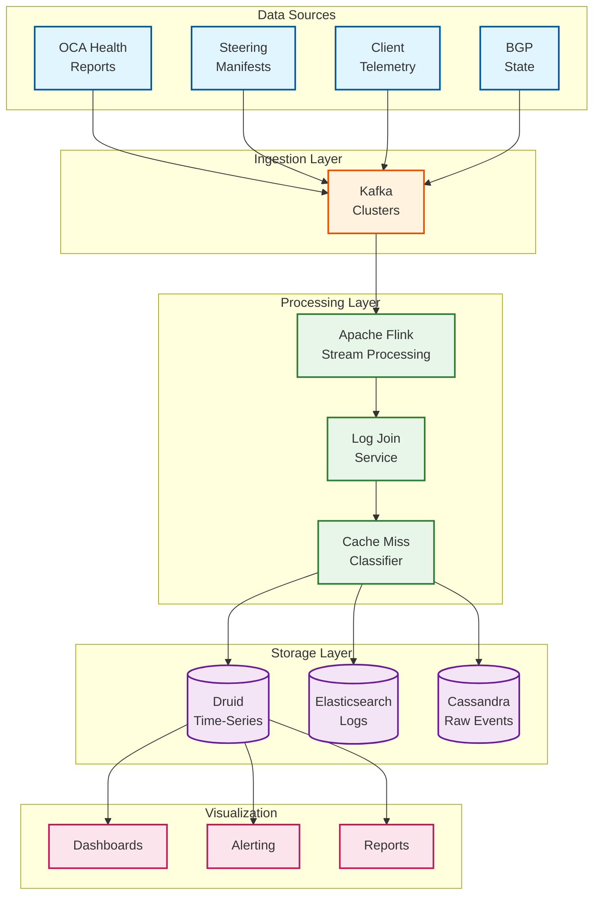
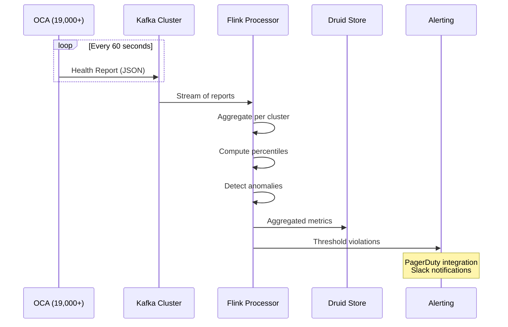
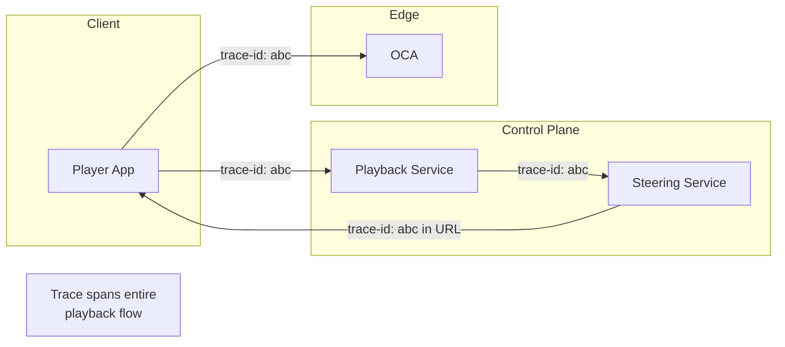

# Observability

[← Back to Index](./00-index.md) | [Previous: Security](./06-security-and-compliance.md) | [Next: Interview Guide →](./08-interview-guide.md)

---

## Observability Architecture



---

## Key Metrics (USE/RED Method)

### OCA Resource Metrics (USE)

| Resource | Utilization | Saturation | Errors |
|----------|-------------|------------|--------|
| **CPU** | `cpu_utilization_pct` | `cpu_queue_depth` | `cpu_errors` |
| **Memory** | `memory_utilization_pct` | `memory_swap_pct` | `oom_kills` |
| **Disk** | `disk_utilization_pct` | `disk_io_queue` | `disk_errors` |
| **Network** | `network_throughput_gbps` | `network_drops` | `network_errors` |

### Serving Metrics (RED)

| Aspect | Metric | Target |
|--------|--------|--------|
| **Rate** | `requests_per_second` | Monitor trend |
| **Errors** | `error_rate_pct` | < 0.1% |
| **Duration** | `latency_p99_ms` | < 50ms |

### Open Connect Specific Metrics

| Category | Metric | Description | Alert Threshold |
|----------|--------|-------------|-----------------|
| **Cache** | `cache_hit_rate` | % requests served locally | < 95% |
| **Cache** | `cache_miss_bytes` | Bytes served from fallback | Trending up |
| **Fill** | `fill_completion_rate` | % fill window successful | < 99% |
| **Fill** | `fill_lag_hours` | Time since last complete fill | > 36h |
| **Steering** | `steering_latency_ms` | OCA selection time | > 10ms p99 |
| **BGP** | `bgp_session_state` | ESTABLISHED/IDLE | != ESTABLISHED |
| **Content** | `content_coverage_pct` | % of expected files present | < 98% |

---

## OCA Health Reporting

### Health Report Schema

```
STRUCTURE OCAHealthReport:
    // Identity
    oca_id: String
    cluster_id: String
    region: String
    isp_asn: Integer
    timestamp: Timestamp

    // Resource Metrics
    cpu:
        utilization_pct: Float
        temperature_celsius: Float
        frequency_ghz: Float

    memory:
        total_gb: Float
        used_gb: Float
        page_cache_gb: Float

    disk:
        total_tb: Float
        used_tb: Float
        read_iops: Integer
        write_iops: Integer
        latency_ms: Float

    network:
        throughput_in_gbps: Float
        throughput_out_gbps: Float
        packets_dropped: Integer
        connections_active: Integer
        connections_total: Integer

    // Application Metrics
    serving:
        requests_per_second: Integer
        bytes_served_gbps: Float
        error_rate_pct: Float
        latency_p50_ms: Float
        latency_p99_ms: Float

    // Content State
    content:
        files_hosted: Integer
        total_bytes: Long
        last_fill_timestamp: Timestamp
        fill_in_progress: Boolean
        pending_deletes: Integer

    // BGP State
    bgp:
        state: Enum[ESTABLISHED, IDLE, ACTIVE, CONNECT]
        prefixes_received: Integer
        uptime_seconds: Integer
```

### Health Aggregation Pipeline



---

## Cache Miss Classification Pipeline

### Log Sources

| Source | Contents | Volume |
|--------|----------|--------|
| **Steering Playback Manifest** | Ranked OCA list, decision factors | 100K+ events/sec |
| **OCA Server Logs** | Actual serving location, response codes | 1M+ events/sec |
| **Client Playback Logs** | Quality metrics, rebuffer events | 10M+ events/sec |

### Join and Classification Flow

```
PSEUDOCODE: Cache Miss Computation Pipeline

// Stage 1: Emit logs to Kafka
ON steering_decision(request):
    emit_to_kafka("steering_logs", {
        request_id: request.id,
        timestamp: now(),
        client_ip: request.client_ip,
        title_id: request.title_id,
        proximity_rank: computed_rank,
        selected_oca: rank[0].oca_id
    })

ON oca_serve(request, response):
    emit_to_kafka("oca_logs", {
        request_id: extract_request_id(request),
        timestamp: now(),
        oca_id: self.id,
        file_id: request.file_id,
        status_code: response.status,
        bytes_served: response.bytes
    })

// Stage 2: Stream Join (Flink)
FUNCTION join_logs(steering_event, oca_event):
    IF steering_event.request_id == oca_event.request_id:
        RETURN JoinedEvent(
            request_id: steering_event.request_id,
            expected_oca: steering_event.selected_oca,
            actual_oca: oca_event.oca_id,
            is_cache_miss: steering_event.selected_oca != oca_event.oca_id
        )

// Stage 3: Classification
FUNCTION classify_miss(joined_event):
    IF NOT joined_event.is_cache_miss:
        RETURN NULL

    expected_oca = joined_event.expected_oca
    request_time = joined_event.timestamp

    // Check health at request time
    health = get_health_snapshot(expected_oca, request_time)
    IF health.overloaded OR NOT health.healthy:
        RETURN MissClassification(category="HEALTH", reason=health.issue)

    // Check content availability
    content = get_content_snapshot(expected_oca, request_time)
    IF joined_event.file_id NOT IN content:
        RETURN MissClassification(category="PREDICTION", reason="file_not_cached")

    // Check capacity
    copies = count_copies(joined_event.file_id, joined_event.cluster)
    IF copies < expected_copies:
        RETURN MissClassification(category="CAPACITY", reason="insufficient_copies")

    RETURN MissClassification(category="UNKNOWN", reason="needs_investigation")
```

### Cache Miss Dashboard

```
┌─────────────────────────────────────────────────────────────────────────────┐
│                    CACHE MISS CLASSIFICATION DASHBOARD                       │
├─────────────────────────────────────────────────────────────────────────────┤
│                                                                              │
│  OVERALL CACHE HIT RATE: 96.2%  [████████████████████░░░░]                  │
│                                                                              │
│  MISS BREAKDOWN BY CATEGORY (Last 24h):                                     │
│  ┌─────────────────────────────────────────────────────────────────────────┐│
│  │  Health Misses:     1.2%  [████░░░░░░░░░░░░░░░░]                        ││
│  │  Prediction Misses: 1.8%  [██████░░░░░░░░░░░░░░]                        ││
│  │  Capacity Misses:   0.6%  [██░░░░░░░░░░░░░░░░░░]                        ││
│  │  Other:             0.2%  [█░░░░░░░░░░░░░░░░░░░]                        ││
│  └─────────────────────────────────────────────────────────────────────────┘│
│                                                                              │
│  TOP IMPACTED REGIONS:                                                       │
│  ┌────────────┬────────────┬────────────┬────────────────────────────────┐  │
│  │ Region     │ Hit Rate   │ Miss Type  │ Trend (7d)                     │  │
│  ├────────────┼────────────┼────────────┼────────────────────────────────┤  │
│  │ US-East    │ 97.1%      │ Health     │ ────────────                   │  │
│  │ EU-West    │ 95.8%      │ Prediction │ ──────────────                 │  │
│  │ APAC-South │ 94.2%      │ Capacity   │ ─────────────────↗            │  │
│  └────────────┴────────────┴────────────┴────────────────────────────────┘  │
│                                                                              │
│  TOP MISPREDICTED TITLES:                                                    │
│  1. "Viral Documentary" - 50GB cache miss traffic                           │
│  2. "New Korean Drama S2E8" - 30GB cache miss traffic                       │
│  3. "Trending Reality Show" - 25GB cache miss traffic                       │
│                                                                              │
│  AUTOMATED ACTIONS:                                                          │
│  • Out-of-cycle fill triggered for "Viral Documentary" (15 min ago)        │
│  • Additional copies deployed to APAC-South (1 hour ago)                    │
│                                                                              │
└─────────────────────────────────────────────────────────────────────────────┘
```

---

## Logging Strategy

### Log Levels

| Level | Use Case | Retention |
|-------|----------|-----------|
| **ERROR** | Request failures, system errors | 90 days |
| **WARN** | Degraded performance, threshold violations | 30 days |
| **INFO** | Normal operations, state changes | 7 days |
| **DEBUG** | Detailed troubleshooting | 24 hours (sampled) |

### Structured Log Format

```
LOG FORMAT: JSON Lines

{
    "timestamp": "2026-02-02T15:30:45.123Z",
    "level": "INFO",
    "oca_id": "oca-atl-edge-001",
    "component": "nginx",
    "event": "request_served",
    "request_id": "abc123",
    "client_ip_hash": "sha256:...",  // Hashed for privacy
    "file_id": "80057281_AV1_1080p",
    "bytes": 52428800,
    "latency_ms": 12,
    "status": 200,
    "cache": "HIT"
}

{
    "timestamp": "2026-02-02T15:30:46.456Z",
    "level": "WARN",
    "oca_id": "oca-atl-edge-001",
    "component": "health",
    "event": "threshold_exceeded",
    "metric": "cpu_utilization",
    "value": 85.2,
    "threshold": 80.0
}
```

### Log Aggregation

| Source | Destination | Method |
|--------|-------------|--------|
| OCA system logs | Elasticsearch | Filebeat agent |
| OCA metrics | Druid | Kafka → Flink |
| BGP events | Elasticsearch | Custom collector |
| Fill status | Druid | Kafka → Flink |

---

## Distributed Tracing

### Trace Propagation



### Key Spans

| Span | Service | Key Attributes |
|------|---------|----------------|
| `playback.request` | Playback Service | title_id, device_type |
| `steering.select` | Steering Service | candidate_count, selected_oca |
| `oca.serve` | OCA | file_id, bytes, latency |
| `fill.transfer` | Fill Controller | file_count, bytes, duration |

### Trace Example

```
Trace ID: abc123def456

├─ playback.request (Playback Service) [50ms]
│  ├─ auth.validate [5ms]
│  ├─ license.check [10ms]
│  └─ steering.select (Steering Service) [8ms]
│     ├─ bgp.lookup [1ms]
│     ├─ health.filter [2ms]
│     └─ rank.compute [3ms]
│
└─ oca.serve (OCA) [varies]
   ├─ url.verify [0.5ms]
   ├─ file.locate [0.1ms]
   └─ sendfile [varies by segment size]
```

---

## Alerting Strategy

### Alert Categories

| Category | Priority | Response | Example |
|----------|----------|----------|---------|
| **P1 - Critical** | Immediate | Page on-call | OCA cluster down |
| **P2 - High** | 15 min | Alert + ticket | Cache hit rate < 90% |
| **P3 - Medium** | 1 hour | Ticket | Fill window overrun |
| **P4 - Low** | Next day | Review queue | Single OCA degraded |

### Alert Definitions

```yaml
# Critical Alerts
- name: oca_cluster_down
  condition: healthy_oca_count(cluster) < min_required
  severity: P1
  notify: pagerduty

- name: cache_hit_rate_critical
  condition: cache_hit_rate(region) < 85%
  for: 5m
  severity: P1
  notify: pagerduty

# High Priority Alerts
- name: cache_hit_rate_degraded
  condition: cache_hit_rate(region) < 92%
  for: 15m
  severity: P2
  notify: slack_oncall

- name: fill_window_failure
  condition: fill_completion_rate < 95%
  severity: P2
  notify: slack_oncall

# Medium Priority Alerts
- name: oca_high_utilization
  condition: oca_cpu_pct > 80%
  for: 30m
  severity: P3
  notify: slack_alerts

- name: bgp_session_flap
  condition: bgp_flap_count > 3
  for: 10m
  severity: P3
  notify: slack_alerts

# Low Priority Alerts
- name: prediction_accuracy_drop
  condition: prediction_accuracy < 90%
  for: 24h
  severity: P4
  notify: email_report
```

### Runbook References

| Alert | Runbook | Key Actions |
|-------|---------|-------------|
| `oca_cluster_down` | [OCA Cluster Recovery](./runbooks/oca-cluster.md) | Verify BGP, check ISP, failover |
| `cache_hit_rate_critical` | [Cache Miss Investigation](./runbooks/cache-miss.md) | Check classification, trigger fill |
| `fill_window_failure` | [Fill Troubleshooting](./runbooks/fill.md) | Check bandwidth, priority, manifest |
| `bgp_session_flap` | [BGP Issues](./runbooks/bgp.md) | Contact ISP, check routes |

---

## Dashboard Design

### Executive Dashboard

```
┌─────────────────────────────────────────────────────────────────────────────┐
│                    OPEN CONNECT EXECUTIVE DASHBOARD                          │
├─────────────────────────────────────────────────────────────────────────────┤
│                                                                              │
│  GLOBAL HEALTH                                                               │
│  ┌──────────────┐  ┌──────────────┐  ┌──────────────┐  ┌──────────────┐    │
│  │   19,247     │  │   96.2%      │  │   99.97%     │  │   12ms       │    │
│  │ Active OCAs  │  │ Cache Hit    │  │ Availability │  │ Avg Latency  │    │
│  │   ↑ 0.5%    │  │   ↑ 0.1%    │  │   ─         │  │   ↓ 2ms     │    │
│  └──────────────┘  └──────────────┘  └──────────────┘  └──────────────┘    │
│                                                                              │
│  TRAFFIC BY REGION (Last Hour)                                              │
│  ┌─────────────────────────────────────────────────────────────────────────┐│
│  │  Americas   ████████████████████████████████████░░░░░░  145 Tbps       ││
│  │  Europe     ████████████████████████████░░░░░░░░░░░░░░░  98 Tbps       ││
│  │  APAC       ██████████████████████░░░░░░░░░░░░░░░░░░░░░  72 Tbps       ││
│  │  Other      █████████░░░░░░░░░░░░░░░░░░░░░░░░░░░░░░░░░░  25 Tbps       ││
│  └─────────────────────────────────────────────────────────────────────────┘│
│                                                                              │
│  FILL STATUS (Last 24h)                                                      │
│  ┌─────────────────────────────────────────────────────────────────────────┐│
│  │  Completed: 99.7%  │  In Progress: 0.2%  │  Failed: 0.1%               ││
│  └─────────────────────────────────────────────────────────────────────────┘│
│                                                                              │
│  ACTIVE INCIDENTS: 0                                                         │
│                                                                              │
└─────────────────────────────────────────────────────────────────────────────┘
```

### Operations Dashboard

```
┌─────────────────────────────────────────────────────────────────────────────┐
│                    OPEN CONNECT OPERATIONS DASHBOARD                         │
├─────────────────────────────────────────────────────────────────────────────┤
│                                                                              │
│  OCA UTILIZATION HEATMAP (By Cluster)                                       │
│  ┌─────────────────────────────────────────────────────────────────────────┐│
│  │     ATL  NYC  LAX  CHI  DAL  MIA  SEA  DEN  PHX  ...                   ││
│  │ CPU [■] [■] [■] [□] [■] [□] [■] [■] [□]                                ││
│  │ MEM [■] [□] [■] [■] [□] [□] [■] [□] [□]                                ││
│  │ NET [■] [■] [■] [■] [■] [■] [■] [■] [■]                                ││
│  │ DSK [□] [□] [□] [□] [□] [□] [□] [□] [□]                                ││
│  │                                                                         ││
│  │ Legend: [■] >80%  [▣] 50-80%  [□] <50%                                 ││
│  └─────────────────────────────────────────────────────────────────────────┘│
│                                                                              │
│  BGP SESSION STATUS                                                          │
│  ┌────────────────────────────────┬──────────┬────────────────────────────┐ │
│  │ ISP                            │ State    │ Uptime                     │ │
│  ├────────────────────────────────┼──────────┼────────────────────────────┤ │
│  │ AT&T (AS7018)                  │ ✓ UP     │ 45d 12h                    │ │
│  │ Comcast (AS7922)               │ ✓ UP     │ 123d 8h                    │ │
│  │ Verizon (AS701)                │ ✓ UP     │ 89d 3h                     │ │
│  │ Deutsche Telekom (AS3320)      │ ✓ UP     │ 67d 19h                    │ │
│  └────────────────────────────────┴──────────┴────────────────────────────┘ │
│                                                                              │
│  RECENT ALERTS (Last 1h)                                                     │
│  • [P3] oca-fra-edge-042: CPU > 80% for 35 min (auto-scaled)               │
│  • [P4] Fill lag > 6h for cluster APAC-JP-001 (investigating)              │
│                                                                              │
└─────────────────────────────────────────────────────────────────────────────┘
```

---

*Next: [Interview Guide →](./08-interview-guide.md)*
