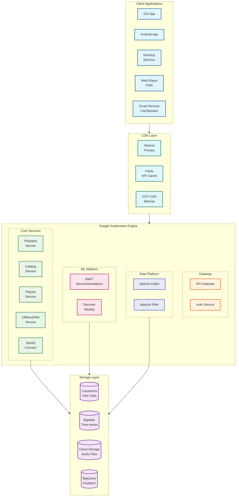

# Spotify System Design

## Overview

Spotify is the world's largest audio streaming platform, serving **713 million monthly active users** across 180+ markets. The platform delivers on-demand access to 100M+ songs, 7M+ podcasts, and 4B+ user-created playlists through a sophisticated microservices architecture running on Google Cloud Platform.

This design focuses on three core challenges:
1. **Audio Streaming** - Low-latency delivery with adaptive bitrate
2. **Offline Mode** - Secure downloads with DRM and device binding
3. **Playlist Sync** - Real-time collaboration with conflict resolution

---

## Quick Navigation

| Document | Description |
|----------|-------------|
| [01 - Requirements & Estimations](./01-requirements-and-estimations.md) | Scale numbers, capacity planning, SLOs |
| [02 - High-Level Design](./02-high-level-design.md) | Architecture, data flows, key decisions |
| [03 - Low-Level Design](./03-low-level-design.md) | Data models, APIs, algorithms |
| [04 - Deep Dive & Bottlenecks](./04-deep-dive-and-bottlenecks.md) | Codec system, DRM, CRDT, BaRT |
| [05 - Scalability & Reliability](./05-scalability-and-reliability.md) | Scaling, fault tolerance, DR |
| [06 - Security & Compliance](./06-security-and-compliance.md) | DRM, OAuth, licensing |
| [07 - Observability](./07-observability.md) | Metrics, logging, alerting |
| [08 - Interview Guide](./08-interview-guide.md) | Pacing, trap questions, trade-offs |

---

## System Characteristics

| Characteristic | Value | Design Implication |
|----------------|-------|-------------------|
| Traffic Pattern | Read-heavy (streaming), Write-medium (playlists) | Edge caching, eventual consistency |
| Content Type | Short-form audio (3-5 min), Long-form podcasts | Different buffering strategies |
| File Sizes | ~4 MB per song (vs GB for video) | Multi-CDN viable (no own CDN needed) |
| Consistency Model | Eventual (playlists), Strong (payments) | CRDT for collaborative playlists |
| Latency Target | <265ms playback start | CDN proximity, client pre-buffering |
| Offline Requirement | Core premium feature | Device-bound DRM, 30-day sync |
| Global Distribution | 180+ markets | Multi-region, geo-routing |

---

## Complexity Rating

| Component | Complexity | Reason |
|-----------|------------|--------|
| Multi-CDN Delivery | Medium | Standard CDN patterns with failover |
| Audio Codec System | **High** | Ogg Vorbis, AAC, FLAC lossless, ABR |
| Offline Mode & DRM | **Very High** | Device-bound encryption, key rotation, sync |
| Playlist Sync (CRDT) | **High** | Collaborative editing, conflict resolution |
| Recommendation (BaRT) | **Very High** | Bandits, collaborative filtering, NLP, deep learning |
| Podcast Infrastructure | **High** | Variable length, chapters, video podcasts |

**Overall Complexity: High**

---

## Architecture Overview

---

## Key Scale Numbers

| Metric | Value | Context |
|--------|-------|---------|
| Monthly Active Users | 713M | Q3 2025 |
| Premium Subscribers | 281M | 39% conversion |
| Daily Active Users | ~350M | ~49% of MAU |
| Peak Concurrent | ~50M | Prime time |
| Songs in Catalog | 100M+ | Growing ~100K/day |
| Podcasts | 7M+ shows | 500K video podcasts |
| User Playlists | 4B+ | Avg 5-6 per user |
| Listening Hours/Quarter | 33B+ | ~114 min/user/day |

---

## Platform Comparison

| Aspect | Spotify | Apple Music | YouTube Music | Tidal |
|--------|---------|-------------|---------------|-------|
| **CDN** | Multi-CDN (Akamai, Fastly) | Apple CDN | Google CDN | Multi-CDN |
| **Audio Codec** | Ogg Vorbis / AAC | AAC / ALAC | AAC | FLAC / MQA |
| **Max Quality** | 320kbps + Lossless | Lossless | 256kbps | Hi-Res Lossless |
| **Discovery** | Algorithm-first | Editorial + Algo | Algorithm-first | Editorial |
| **Offline** | Premium only | All tiers | Premium only | Premium only |
| **Podcasts** | Leading | Growing | Integrated | Limited |
| **Free Tier** | Ad-supported | Trial only | Ad-supported | Trial only |

---

## Key Technology Stack

| Layer | Technology | Purpose |
|-------|------------|---------|
| **Cloud** | Google Cloud Platform | Infrastructure (2016 migration) |
| **Container Orchestration** | Google Kubernetes Engine | Microservices deployment |
| **CDN** | Akamai, Fastly, GCP | Audio delivery, API caching |
| **API Gateway** | Custom (Java) | Routing, rate limiting |
| **Backend** | Java/Spring, Scala, Node.js | Microservices |
| **Message Queue** | Apache Kafka | Event streaming |
| **Stream Processing** | Apache Flink, Apache Beam | Real-time analytics |
| **User Data** | Apache Cassandra | Distributed storage |
| **Time-Series** | Cloud Bigtable | Listening history |
| **Analytics** | BigQuery | Data warehouse |
| **Audio Storage** | Cloud Storage | Blob storage |
| **Developer Portal** | Backstage (open-source) | Internal tooling |

---

## Audio Quality Tiers

| Tier | Bitrate | Codec | Availability |
|------|---------|-------|--------------|
| Low | 24 kbps | Ogg Vorbis | Free (data saver) |
| Normal | 96 kbps | Ogg Vorbis | Free default |
| High | 160 kbps | Ogg Vorbis | Free / Premium |
| Very High | 320 kbps | Ogg Vorbis | Premium only |
| Lossless | ~1,411 kbps | FLAC (24-bit/44.1kHz) | Premium (Sept 2025) |
| Web | 256 kbps | AAC | Web player |

---

## Critical Trade-offs Summary

| Decision | Spotify Choice | Alternative | Rationale |
|----------|----------------|-------------|-----------|
| CDN Strategy | Multi-CDN | Own CDN (Netflix) | Audio = smaller files, lower traffic % |
| Audio Codec | Ogg Vorbis | MP3 | Better quality/size ratio, no license fee |
| Playlist Sync | CRDT | Last-write-wins | No data loss in concurrent edits |
| Offline Auth | 30-day window | Per-play check | UX balance with piracy prevention |
| Cloud | Single (GCP) | Multi-cloud | BigQuery/ML integration benefits |

---

## What Makes Spotify Unique

### 1. **Algorithm-First Discovery**
- Discover Weekly (40M+ users, 5B+ streams since launch)
- Daily Mix personalization
- BaRT (Bandits for Recommendations as Treatments)
- "Prompted Playlists" with LLM (Dec 2025)

### 2. **Collaborative Playlists**
- Real-time multi-user editing
- CRDT-based conflict resolution
- Cross-device sync with offline support

### 3. **Spotify Connect**
- Seamless device handoff
- Remote control from any device
- Multi-room audio synchronization

### 4. **Podcast Leadership**
- 7M+ shows, 500K video podcasts
- Creator monetization program
- Exclusive content deals

### 5. **Developer Ecosystem**
- Backstage (open-sourced internal developer portal)
- Spotify Web API for third-party apps
- Spotify for Artists analytics

---

## Related Designs

| Topic | Link | Relevance |
|-------|------|-----------|
| Netflix | [5.2-netflix](../5.2-netflix/00-index.md) | Video streaming comparison |
| Netflix CDN | [5.3-netflix-cdn](../5.3-netflix-cdn/00-index.md) | Own CDN vs multi-CDN |
| YouTube | [5.1-youtube](../5.1-youtube/00-index.md) | Media platform patterns |
| Recommendation Engine | [3.12-recommendation-engine](../3.12-recommendation-engine/00-index.md) | ML personalization |
| Distributed Cache | [1.4-distributed-lru-cache](../1.4-distributed-lru-cache/00-index.md) | Caching patterns |
| Content Delivery Network | [1.15-cdn](../1.15-content-delivery-network-cdn/00-index.md) | CDN fundamentals |

---

## References

- [Spotify Engineering Blog](https://engineering.atspotify.com/)
- [Spotify Cloud Infrastructure](https://cloud.google.com/blog/products/gcp/spotify-chooses-google-cloud-platform-to-power-data-infrastructure)
- [Kubernetes Case Study: Spotify](https://kubernetes.io/case-studies/spotify/)
- [Backstage.io](https://backstage.io/)
- [Spotify System Design - AlgoMaster](https://algomaster.io/learn/system-design-interviews/design-spotify)
- [Spotify P2P Architecture Paper](https://ieeexplore.ieee.org/document/5569963/)
