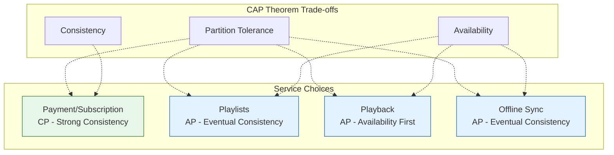

# Requirements & Capacity Estimations

## Functional Requirements

### P0 - Core Features (Must Have)

| Feature | Description | User Story |
|---------|-------------|------------|
| Audio Playback | Stream music with adaptive bitrate | "I want to listen to songs without buffering" |
| Search | Find songs, artists, albums, playlists, podcasts | "I want to find specific music quickly" |
| Playlists | Create, edit, delete, share playlists | "I want to organize my music collection" |
| Offline Mode | Download tracks for offline listening | "I want to listen without internet" |
| User Library | Save albums, artists, podcasts | "I want to access my favorites easily" |
| Personalization | Home feed, Discover Weekly, Daily Mix | "I want to discover new music I'll like" |
| Cross-device Sync | Continue playback across devices | "I want to switch devices seamlessly" |

### P1 - Important Features

| Feature | Description |
|---------|-------------|
| Collaborative Playlists | Multiple users editing same playlist |
| Spotify Connect | Control playback on other devices |
| Podcasts & Video | Long-form audio with chapters, video podcasts |
| Lyrics | Time-synced lyrics display |
| Social Features | Follow friends, share activity, playlist collaboration |
| Queue Management | Add to queue, reorder upcoming tracks |
| Radio | Auto-generate endless playback from seed |

### P2 - Nice to Have

| Feature | Description |
|---------|-------------|
| Crossfade | Smooth transitions between tracks |
| Equalizer | Audio adjustment settings |
| Sleep Timer | Auto-stop playback |
| Blend Playlists | Merged playlists between users |
| Wrapped | Year-end listening statistics |

### Out of Scope

- Music upload/hosting (artist-side)
- Live streaming/concerts
- Social messaging
- Ticket sales
- Merchandise

---

## Non-Functional Requirements

### CAP Theorem Choice



| Service | CAP Choice | Justification |
|---------|------------|---------------|
| Payments/Subscription | CP | Financial transactions require consistency |
| Playlists | AP | Availability > immediate consistency; CRDT handles conflicts |
| Playback State | AP | Must always play music; sync eventually |
| Recommendations | AP | Stale recommendations acceptable; availability critical |
| User Profile | AP | Eventual consistency acceptable for preferences |

### Consistency Model

| Data Type | Consistency | Staleness Tolerance | Justification |
|-----------|-------------|---------------------|---------------|
| Subscription Status | Strong | 0 | Must be accurate for content access |
| Playlist Content | Eventual | < 5 seconds | CRDT merge handles conflicts |
| Playback Position | Eventual | < 30 seconds | Cross-device sync can lag |
| Listening History | Eventual | < 1 minute | Analytics can be delayed |
| Recommendations | Eventual | < 24 hours | Daily refresh acceptable |
| Offline Manifest | Eventual | < 30 days | Key expiry window |

### Availability Targets

| Service | Target | Error Budget (30 days) |
|---------|--------|------------------------|
| Audio Playback | 99.99% | 4.3 minutes |
| API Gateway | 99.95% | 21.6 minutes |
| Search | 99.9% | 43.2 minutes |
| Recommendations | 99.9% | 43.2 minutes |
| Offline Sync | 99.5% | 3.6 hours |

### Latency Targets

| Operation | p50 | p95 | p99 |
|-----------|-----|-----|-----|
| Playback Start | 265ms | 500ms | 1s |
| Track Skip | 100ms | 200ms | 500ms |
| Search Query | 100ms | 200ms | 500ms |
| Playlist Load | 150ms | 300ms | 800ms |
| Home Feed | 200ms | 500ms | 1s |
| API Response | 50ms | 100ms | 200ms |

### Durability

| Data Type | Durability | Storage |
|-----------|------------|---------|
| Audio Files | 99.999999999% (11 9s) | Cloud Storage (multi-region) |
| User Data | 99.999% | Cassandra (RF=3) |
| Playlists | 99.999% | Cassandra (RF=3) |
| Listening History | 99.99% | Bigtable |
| Analytics | 99.9% | BigQuery |

---

## Capacity Estimations

### User Base Metrics

| Metric | Value | Source |
|--------|-------|--------|
| Monthly Active Users (MAU) | 713M | Q3 2025 |
| Premium Subscribers | 281M | Q3 2025 |
| Free Users | 432M | 713M - 281M |
| Daily Active Users (DAU) | ~350M | ~49% of MAU (industry avg) |
| Peak Concurrent Listeners | ~50M | ~14% of DAU at peak |
| Avg Sessions/Day/User | 2.5 | Industry estimate |
| Avg Session Duration | 45 minutes | 114 min/day ÷ 2.5 sessions |

### Content Metrics

| Metric | Value |
|--------|-------|
| Total Songs | 100M+ |
| Total Podcasts | 7M+ shows |
| Podcast Episodes | ~500M |
| Video Podcasts | 500K shows |
| User Playlists | 4B+ |
| New Tracks/Day | ~100K |
| New Podcasts/Day | ~10K episodes |

### Listening Behavior

| Metric | Calculation | Result |
|--------|-------------|--------|
| Songs Played/User/Day | 114 min ÷ 3.5 min avg | ~33 songs |
| Total Plays/Day | 350M DAU × 33 songs | **11.5B plays/day** |
| Plays/Second (avg) | 11.5B ÷ 86,400 | **~133K/sec** |
| Plays/Second (peak) | 3× average | **~400K/sec** |
| Podcast Listens/Day | 30% of DAU × 1 episode | ~105M listens |

### Traffic Estimations

| Metric | Calculation | Result |
|--------|-------------|--------|
| API Requests/Play | ~10 (auth, metadata, stream URL, events) | 10 |
| API QPS (avg) | 133K plays × 10 | **~1.3M QPS** |
| API QPS (peak) | 400K plays × 10 | **~4M QPS** |
| Search QPS (avg) | 5% of API traffic | ~65K QPS |
| Playlist Updates/Day | 4B playlists × 0.1% update rate | ~4M updates/day |

### Bandwidth Estimations

**Audio Bandwidth per Quality:**

| Quality | Bitrate | Concurrent Users | Bandwidth |
|---------|---------|------------------|-----------|
| Low (24kbps) | 24 kbps | 2M (4%) | 48 Gbps |
| Normal (96kbps) | 96 kbps | 15M (30%) | 1.44 Tbps |
| High (160kbps) | 160 kbps | 20M (40%) | 3.2 Tbps |
| Very High (320kbps) | 320 kbps | 10M (20%) | 3.2 Tbps |
| Lossless (1411kbps) | 1,411 kbps | 3M (6%) | 4.2 Tbps |

**Total Peak Egress:**

```
Total = 48 + 1,440 + 3,200 + 3,200 + 4,200 = ~12.1 Tbps peak
Average (30% of peak) = ~3.6 Tbps
```

| Metric | Value |
|--------|-------|
| Peak Audio Egress | ~12 Tbps |
| Average Audio Egress | ~3.6 Tbps |
| Daily Data Transfer | ~40 PB |

### Storage Estimations

**Audio Storage:**

| Content Type | Count | Avg Size (all qualities) | Total |
|--------------|-------|--------------------------|-------|
| Songs | 100M | 16 MB (4 qualities × 4 MB) | 1.6 PB |
| Podcast Episodes | 500M | 50 MB (avg 45 min) | 25 PB |
| Video Podcasts | 50M episodes | 500 MB | 25 PB |

**Total Audio Storage:** ~52 PB (with replication: ~156 PB)

**Metadata Storage:**

| Data Type | Records | Avg Size | Total |
|-----------|---------|----------|-------|
| User Profiles | 713M | 10 KB | 7.1 TB |
| Playlists | 4B | 5 KB | 20 TB |
| Tracks Metadata | 100M | 2 KB | 200 GB |
| Artist Data | 10M | 5 KB | 50 GB |
| Albums | 50M | 3 KB | 150 GB |
| Listening History | 713M users × 1000 events | 100 bytes/event | 71 TB |

**Total Metadata Storage:** ~100 TB (with replication: ~300 TB)

**Offline Storage (Distributed on Devices):**

| Metric | Calculation | Result |
|--------|-------------|--------|
| Premium Users with Downloads | 281M × 60% | 169M users |
| Avg Downloaded Tracks | 200 tracks | 200 |
| Avg Track Size (high quality) | 8 MB | 8 MB |
| Per-User Offline Storage | 200 × 8 MB | 1.6 GB |
| Total Offline (all devices) | 169M × 1.6 GB | **270 PB** |

### Database Sizing

| Database | Data Type | Size | Nodes (estimated) |
|----------|-----------|------|-------------------|
| Cassandra | User data, playlists | 30 TB | 100+ |
| Bigtable | Listening history, time-series | 80 TB | Managed |
| Cloud SQL | Reference data, metadata | 500 GB | 5 |
| BigQuery | Analytics, ML features | 500 TB | Managed |
| Cloud Storage | Audio files | 52 PB | Managed |

### Message Queue (Kafka)

| Metric | Calculation | Result |
|--------|-------------|--------|
| Events/Play | 5 (start, progress, skip, complete, error) | 5 |
| Events/Second | 133K plays × 5 | ~665K events/sec |
| Event Size | 500 bytes avg | 500 B |
| Daily Event Volume | 665K × 86,400 × 500 B | ~28 TB/day |
| Retention (7 days) | 28 TB × 7 | ~200 TB |

---

## SLOs & SLAs

### Service Level Objectives

| Metric | Objective | Measurement Method |
|--------|-----------|-------------------|
| Playback Availability | 99.99% | Successful plays / attempted plays |
| Playback Start Time (p50) | < 265ms | Client telemetry |
| Playback Start Time (p95) | < 500ms | Client telemetry |
| Stream Interruption Rate | < 0.1% | Rebuffer events / total plays |
| Search Availability | 99.9% | Successful searches / attempts |
| Search Latency (p95) | < 200ms | Server-side |
| API Availability | 99.95% | 5xx errors / total requests |
| API Latency (p95) | < 100ms | Server-side |
| Offline Sync Success | 99% | Completed syncs / attempted |
| Recommendation Freshness | < 24 hours | Time since last update |

### Error Budgets

| Service | SLO | Error Budget (30 days) | Action |
|---------|-----|------------------------|--------|
| Playback | 99.99% | 4.3 min | Freeze deploys if exceeded |
| API | 99.95% | 21.6 min | Investigation required |
| Search | 99.9% | 43.2 min | Alert on-call |
| Recommendations | 99.9% | 43.2 min | Non-critical |

### Quality Metrics

| Metric | Target | Alert Threshold |
|--------|--------|-----------------|
| Audio Quality Score | > 4.5/5 | < 4.0 |
| Rebuffer Ratio | < 0.5% | > 1% |
| Skip Rate (first 30s) | < 25% | > 35% |
| Playlist Load Success | > 99.5% | < 99% |
| Offline Key Refresh | > 99% | < 95% |

---

## Growth Projections

### User Growth (5-Year)

| Year | MAU | Premium | DAU | Peak Concurrent |
|------|-----|---------|-----|-----------------|
| 2025 | 713M | 281M | 350M | 50M |
| 2026 | 800M | 330M | 400M | 60M |
| 2027 | 900M | 380M | 450M | 70M |
| 2028 | 1B | 430M | 500M | 80M |
| 2029 | 1.1B | 480M | 550M | 90M |

### Infrastructure Scaling

| Year | Audio Egress (Peak) | Storage | Kafka Events/sec |
|------|---------------------|---------|------------------|
| 2025 | 12 Tbps | 52 PB | 665K |
| 2026 | 15 Tbps | 70 PB | 800K |
| 2027 | 18 Tbps | 90 PB | 1M |
| 2028 | 22 Tbps | 115 PB | 1.2M |
| 2029 | 26 Tbps | 145 PB | 1.5M |

---

## Capacity Planning Summary

```
┌─────────────────────────────────────────────────────────────────────────────┐
│                     SPOTIFY CAPACITY CHEAT SHEET                             │
├─────────────────────────────────────────────────────────────────────────────┤
│                                                                              │
│  USERS                           TRAFFIC                                     │
│  ──────                          ───────                                     │
│  MAU: 713M                       Plays/sec: 133K avg, 400K peak              │
│  Premium: 281M                   API QPS: 1.3M avg, 4M peak                  │
│  DAU: 350M                       Bandwidth: 3.6 Tbps avg, 12 Tbps peak       │
│  Peak Concurrent: 50M                                                        │
│                                                                              │
│  CONTENT                         STORAGE                                     │
│  ───────                         ───────                                     │
│  Songs: 100M+                    Audio: 52 PB (156 PB replicated)            │
│  Podcasts: 7M+ shows             Metadata: 100 TB                            │
│  Playlists: 4B+                  Kafka: 200 TB (7-day retention)             │
│                                  Offline (devices): 270 PB distributed       │
│                                                                              │
│  LATENCY TARGETS                 AVAILABILITY                                │
│  ───────────────                 ────────────                                │
│  Playback Start: 265ms p50      Playback: 99.99%                            │
│  API Response: 50ms p50          API: 99.95%                                 │
│  Search: 100ms p50               Search: 99.9%                               │
│                                                                              │
└─────────────────────────────────────────────────────────────────────────────┘
```
