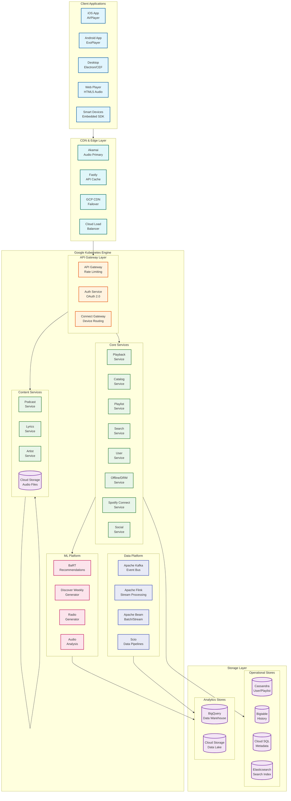
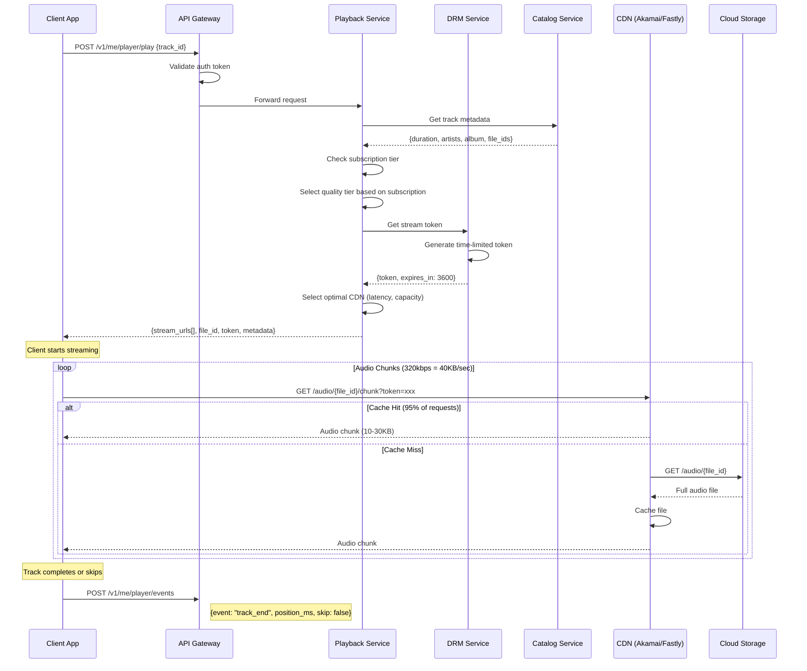
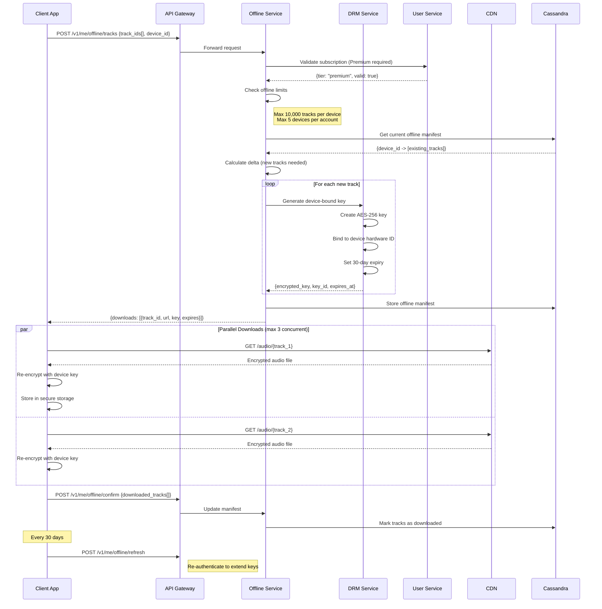
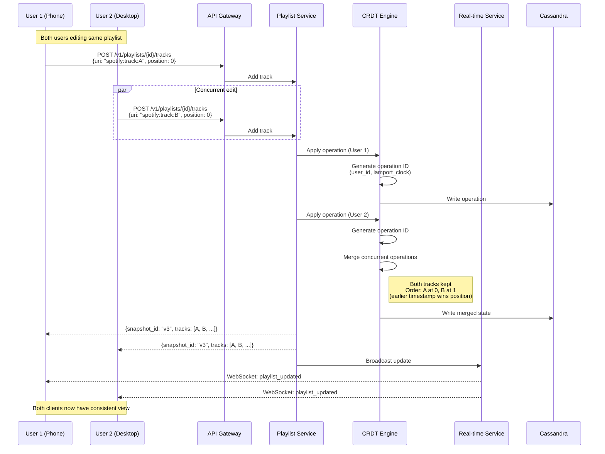
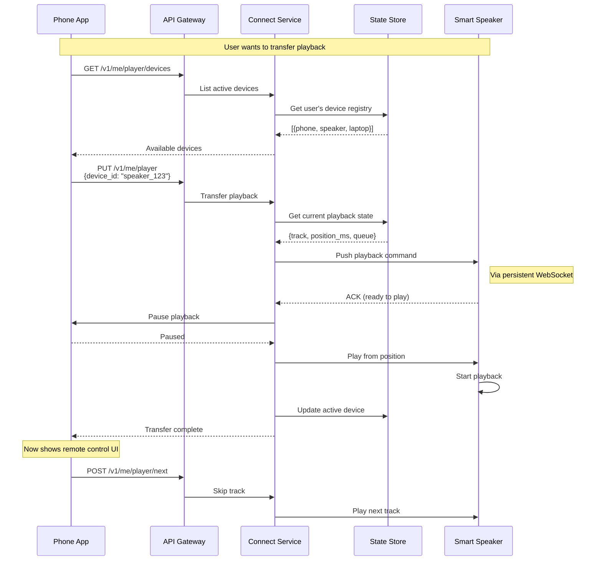
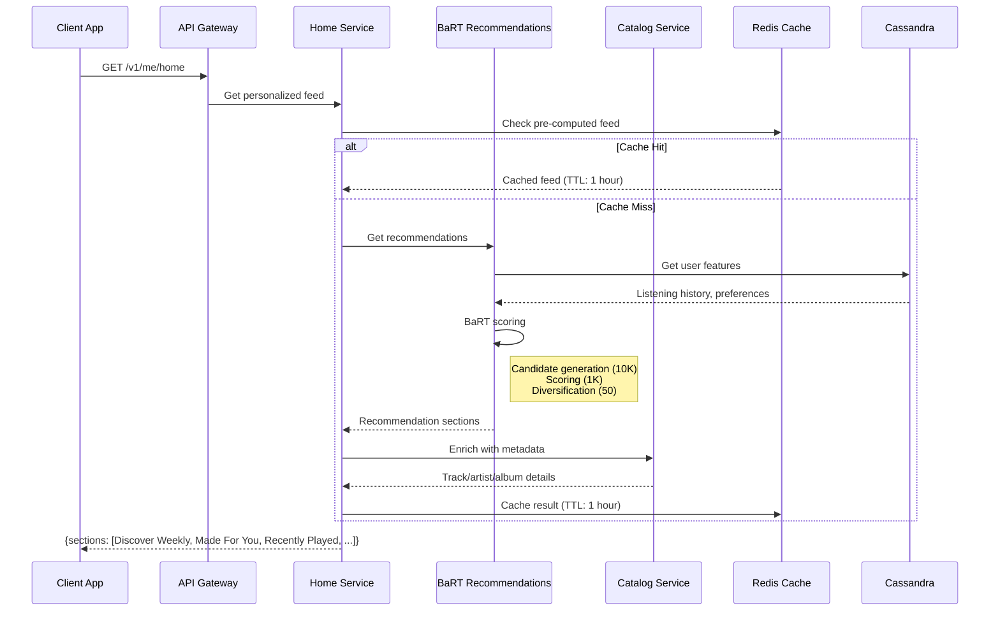
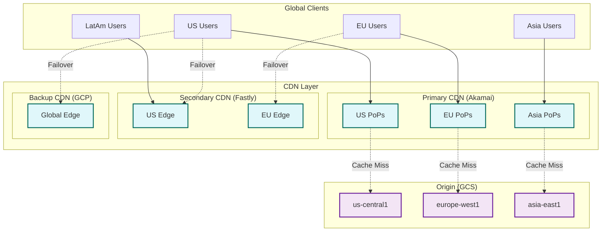

# High-Level Design

## Architecture Overview

Spotify's architecture follows a microservices pattern running on Google Kubernetes Engine (GKE), with a multi-CDN strategy for audio delivery. The system is organized into distinct layers: client applications, CDN/edge layer, API gateway, core services, ML platform, data platform, and storage.



---

## Key Architectural Decisions

### 1. Multi-CDN vs Own CDN

| Aspect | Multi-CDN (Spotify) | Own CDN (Netflix) |
|--------|---------------------|-------------------|
| Traffic Volume | ~12 Tbps peak | ~400 Tbps peak |
| % of Internet | <1% | ~15% |
| File Sizes | 4 MB avg (songs) | 2-10 GB (movies) |
| Investment | Operational expense | Capital expense |
| Control | Limited, vendor-dependent | Full control |
| Flexibility | Easy vendor switching | ISP negotiations needed |

**Decision: Multi-CDN**
- Audio files are small enough that CDN costs are manageable
- Lower traffic volume doesn't justify building own infrastructure
- Multiple CDNs provide geographic coverage and redundancy
- Focus engineering resources on core product (recommendations, playlists)

### 2. GCP Migration (2016-2017)

| Before (On-Premise) | After (GCP) |
|---------------------|-------------|
| Own data centers (London, Stockholm) | Google Cloud regions |
| Helios (custom orchestration) | Google Kubernetes Engine |
| Custom data pipelines | BigQuery, Dataflow |
| PostgreSQL | Cloud Bigtable + Cassandra |

**Benefits Realized:**
- 100% infrastructure managed by Google
- BigQuery for ML training data
- Auto-scaling with GKE
- Global low-latency with Cloud CDN backup

### 3. Microservices Architecture

| Characteristic | Spotify Approach |
|----------------|------------------|
| Service Count | 200+ microservices |
| Languages | Java (primary), Scala, Node.js, Python |
| Framework | Spring Boot for Java services |
| Communication | Sync (gRPC, HTTP) + Async (Kafka) |
| Discovery | Consul / GKE native service discovery |
| Developer Portal | Backstage (open-sourced) |

### 4. Database Selection

| Use Case | Database | Justification |
|----------|----------|---------------|
| User Data | Cassandra | High write throughput, eventual consistency |
| Playlists | Cassandra | Scalable, partition by playlist_id |
| Listening History | Bigtable | Time-series optimized, high volume |
| Metadata | Cloud SQL (PostgreSQL) | Relational integrity, complex queries |
| Search | Elasticsearch | Full-text search, fuzzy matching |
| Analytics | BigQuery | Serverless, ML integration |

---

## Data Flow Diagrams

### Audio Playback Flow



### Offline Download Flow



### Playlist Sync Flow (Collaborative)



### Spotify Connect Flow



### Home Feed Generation Flow



---

## Component Responsibilities

### Core Services

```
┌─────────────────────────────────────────────────────────────────────────┐
│                           CORE SERVICES                                  │
├─────────────────────────────────────────────────────────────────────────┤
│                                                                          │
│  PLAYBACK SERVICE                    PLAYLIST SERVICE                    │
│  ─────────────────                   ─────────────────                   │
│  • Stream URL generation             • CRUD operations                   │
│  • Quality tier selection            • Collaborative editing (CRDT)      │
│  • DRM token orchestration           • Version history                   │
│  • CDN routing                       • Share/follow management           │
│  • Playback state management         • Import/export                     │
│                                                                          │
│  CATALOG SERVICE                     OFFLINE SERVICE                     │
│  ───────────────                     ───────────────                     │
│  • Track/album/artist metadata       • Download orchestration            │
│  • Content availability              • DRM key management                │
│  • Rights management                 • Device manifest tracking          │
│  • New release indexing              • Sync status                       │
│                                      • 30-day re-authentication          │
│                                                                          │
│  SEARCH SERVICE                      USER SERVICE                        │
│  ──────────────                      ────────────                        │
│  • Full-text search                  • Profile management                │
│  • Autocomplete                      • Subscription status               │
│  • Fuzzy matching                    • Preferences/settings              │
│  • Search ranking                    • Library (saved items)             │
│  • Recent searches                   • Privacy controls                  │
│                                                                          │
│  CONNECT SERVICE                     SOCIAL SERVICE                      │
│  ───────────────                     ──────────────                      │
│  • Device discovery                  • Friend activity                   │
│  • Playback transfer                 • Following/followers               │
│  • Multi-room sync                   • Collaborative invites             │
│  • Remote control                    • Share generation                  │
│                                                                          │
└─────────────────────────────────────────────────────────────────────────┘
```

### ML Platform

```
┌─────────────────────────────────────────────────────────────────────────┐
│                            ML PLATFORM                                   │
├─────────────────────────────────────────────────────────────────────────┤
│                                                                          │
│  BaRT (BANDITS FOR RECOMMENDATIONS AS TREATMENTS)                        │
│  ───────────────────────────────────────────────                         │
│  • Multi-armed bandit framework for personalization                      │
│  • Explores new content while exploiting known preferences               │
│  • Real-time feature serving (user, track, context)                      │
│  • A/B testing infrastructure for recommendation strategies              │
│                                                                          │
│  DISCOVER WEEKLY GENERATOR                                               │
│  ─────────────────────────                                               │
│  • Weekly batch pipeline (Monday morning)                                │
│  • Collaborative filtering + content-based hybrid                        │
│  • Diversity constraints (genre, artist variety)                         │
│  • Freshness optimization (new-to-user tracks)                           │
│                                                                          │
│  AUDIO ANALYSIS                                                          │
│  ──────────────                                                          │
│  • Tempo, key, mode detection                                            │
│  • Energy, danceability, valence scoring                                 │
│  • Genre classification                                                  │
│  • Audio fingerprinting                                                  │
│                                                                          │
│  PODCAST RECOMMENDATIONS                                                 │
│  ───────────────────────                                                 │
│  • Episode-level recommendations                                         │
│  • Topic modeling from transcripts                                       │
│  • Listening pattern analysis (skip, complete)                           │
│                                                                          │
└─────────────────────────────────────────────────────────────────────────┘
```

---

## Architecture Patterns Checklist

| Pattern | Decision | Rationale |
|---------|----------|-----------|
| Sync vs Async | Hybrid | Sync for playback (latency), Async for analytics (volume) |
| Event-driven vs Request-response | Hybrid | Request-response for APIs, Event-driven for data pipelines |
| Push vs Pull | Push | Real-time updates via WebSocket for Connect/Collab |
| Stateless vs Stateful | Mostly Stateless | State in databases, services are stateless |
| Read-heavy vs Write-heavy | Read-heavy | Optimize for streaming, secondary writes for events |
| Real-time vs Batch | Hybrid | Real-time for playback, Batch for recommendations |
| Edge vs Origin | Edge-heavy | CDN caches 95%+ of audio requests |

---

## CDN Strategy Deep Dive

### Multi-CDN Architecture



### CDN Selection Logic

```
ALGORITHM: CDN Selection

INPUT: user_location, track_popularity, current_cdn_health

1. Get CDN latency estimates for user region
2. Check CDN health status (real-time monitoring)
3. Consider track popularity (popular = cached everywhere)

IF cdn_akamai.latency < 50ms AND cdn_akamai.healthy:
    RETURN akamai

ELSE IF cdn_fastly.latency < 50ms AND cdn_fastly.healthy:
    RETURN fastly

ELSE:
    RETURN gcp_cdn  // Fallback
```

---

## Technology Stack Summary

| Layer | Component | Technology |
|-------|-----------|------------|
| **Client** | iOS | Swift, AVPlayer |
| **Client** | Android | Kotlin, ExoPlayer |
| **Client** | Desktop | Electron/CEF, C++ |
| **Client** | Web | React, HTML5 Audio API |
| **CDN** | Primary | Akamai |
| **CDN** | Secondary | Fastly |
| **CDN** | Backup | GCP Cloud CDN |
| **Load Balancer** | | GCP Cloud Load Balancing |
| **Container** | Orchestration | Google Kubernetes Engine |
| **Service Mesh** | | Envoy (emerging) |
| **Backend** | Primary | Java 17+, Spring Boot |
| **Backend** | Secondary | Scala, Node.js |
| **API** | Style | REST (public), gRPC (internal) |
| **Message Queue** | | Apache Kafka |
| **Stream Processing** | | Apache Flink, Beam |
| **User Data** | | Apache Cassandra |
| **Time-Series** | | Google Cloud Bigtable |
| **Relational** | | Cloud SQL (PostgreSQL) |
| **Search** | | Elasticsearch |
| **Cache** | | Redis, Memcached |
| **Audio Storage** | | Google Cloud Storage |
| **Analytics** | | BigQuery |
| **ML Training** | | TensorFlow, PyTorch |
| **ML Serving** | | Custom (BaRT) |
| **Monitoring** | | Prometheus, Grafana |
| **Logging** | | Cloud Logging, Fluentd |
| **Developer Portal** | | Backstage |
