# Low-Level Design

## Data Model

### Entity Relationship Diagram

```mermaid
erDiagram
    USER ||--o{ PLAYLIST : creates
    USER ||--o{ FOLLOW_USER : follows
    USER ||--o{ FOLLOW_ARTIST : follows
    USER ||--o{ SAVED_TRACK : saves
    USER ||--o{ SAVED_ALBUM : saves
    USER ||--o{ LISTEN_HISTORY : has
    USER ||--o{ OFFLINE_TRACK : downloads
    USER ||--o{ DEVICE : owns

    PLAYLIST ||--o{ PLAYLIST_TRACK : contains
    PLAYLIST }o--o{ USER : collaborates

    TRACK ||--o{ PLAYLIST_TRACK : in
    TRACK }o--|| ALBUM : belongs
    TRACK }o--o{ ARTIST : performed_by
    TRACK ||--o{ AUDIO_FILE : has

    ARTIST ||--o{ ALBUM : releases
    ARTIST ||--o{ ARTIST_GENRE : categorized

    PODCAST ||--o{ EPISODE : contains
    EPISODE ||--o{ CHAPTER : has
    USER ||--o{ EPISODE_PROGRESS : tracks

    USER {
        uuid user_id PK
        string email UK
        string display_name
        string country
        enum subscription_tier "free|premium|family|duo"
        timestamp premium_expires_at
        string password_hash
        timestamp created_at
        timestamp last_login_at
        json preferences
    }

    TRACK {
        uuid track_id PK
        string isrc UK "International Standard Recording Code"
        string name
        int duration_ms
        int track_number
        int disc_number
        boolean explicit
        int popularity "0-100"
        uuid album_id FK
        timestamp release_date
        json audio_features "tempo, key, energy, etc"
    }

    ALBUM {
        uuid album_id PK
        string name
        enum album_type "album|single|compilation"
        int total_tracks
        timestamp release_date
        string label
        string upc "Universal Product Code"
        json images "cover art URLs"
    }

    ARTIST {
        uuid artist_id PK
        string name
        int popularity "0-100"
        int followers
        json images
        string bio
        boolean verified
    }

    PLAYLIST {
        uuid playlist_id PK
        uuid owner_id FK
        string name
        string description
        boolean public
        boolean collaborative
        json images
        int followers
        blob version_vector "CRDT state"
        string snapshot_id
        timestamp created_at
        timestamp updated_at
    }

    PLAYLIST_TRACK {
        uuid playlist_id PK,FK
        int position PK
        uuid track_id FK
        uuid added_by FK
        timestamp added_at
        boolean tombstone "soft delete for CRDT"
        string operation_id "unique op ID"
    }

    AUDIO_FILE {
        uuid file_id PK
        uuid track_id FK
        enum format "ogg|aac|flac"
        int bitrate "24|96|160|320|1411"
        bigint size_bytes
        string storage_path
        string checksum_sha256
    }

    OFFLINE_TRACK {
        uuid user_id PK,FK
        uuid track_id PK,FK
        uuid device_id PK,FK
        enum quality "normal|high|very_high"
        blob encrypted_key
        string key_id
        timestamp downloaded_at
        timestamp expires_at
        bigint size_bytes
    }

    DEVICE {
        uuid device_id PK
        uuid user_id FK
        string device_name
        enum device_type "smartphone|computer|speaker|car|web"
        string device_model
        boolean is_active
        timestamp last_active_at
        timestamp registered_at
    }

    LISTEN_HISTORY {
        uuid user_id PK,FK
        timestamp played_at PK
        uuid track_id FK
        uuid context_uri "playlist/album/artist"
        int ms_played
        boolean skipped
        string platform
        string device_id
    }

    PODCAST {
        uuid podcast_id PK
        string name
        string publisher
        string description
        json images
        string language
        boolean explicit
        int total_episodes
        enum media_type "audio|video"
    }

    EPISODE {
        uuid episode_id PK
        uuid podcast_id FK
        string name
        string description
        int duration_ms
        timestamp release_date
        boolean explicit
        json images
        string audio_url
        string video_url
    }

    CHAPTER {
        uuid episode_id PK,FK
        int chapter_number PK
        string title
        int start_ms
        int end_ms
    }

    EPISODE_PROGRESS {
        uuid user_id PK,FK
        uuid episode_id PK,FK
        int position_ms
        boolean completed
        timestamp updated_at
    }
```



---

## Database Schemas

### Cassandra: User Data

```sql
-- Keyspace configuration
CREATE KEYSPACE spotify_user WITH replication = {
    'class': 'NetworkTopologyStrategy',
    'us-central1': 3,
    'europe-west1': 3,
    'asia-east1': 3
};

-- User profile table
CREATE TABLE spotify_user.users (
    user_id         uuid PRIMARY KEY,
    email           text,
    display_name    text,
    country         text,
    subscription_tier text,     -- free, premium, family, duo
    premium_expires_at timestamp,
    password_hash   text,
    preferences     map<text, text>,
    created_at      timestamp,
    last_login_at   timestamp
);

CREATE INDEX ON spotify_user.users (email);

-- User library (saved tracks)
CREATE TABLE spotify_user.saved_tracks (
    user_id     uuid,
    added_at    timestamp,
    track_id    uuid,
    PRIMARY KEY (user_id, added_at)
) WITH CLUSTERING ORDER BY (added_at DESC);

-- Listening history (time-series, partition by user + month)
CREATE TABLE spotify_user.listen_history (
    user_id         uuid,
    year_month      text,       -- "2025-01" for partitioning
    played_at       timestamp,
    track_id        uuid,
    context_uri     text,
    ms_played       int,
    skipped         boolean,
    device_id       uuid,
    platform        text,
    PRIMARY KEY ((user_id, year_month), played_at)
) WITH CLUSTERING ORDER BY (played_at DESC)
  AND default_time_to_live = 31536000;  -- 1 year retention
```

### Cassandra: Playlists

```sql
-- Playlist metadata
CREATE TABLE spotify_playlist.playlists (
    playlist_id     uuid PRIMARY KEY,
    owner_id        uuid,
    name            text,
    description     text,
    is_public       boolean,
    is_collaborative boolean,
    image_url       text,
    followers       counter,
    version_vector  blob,       -- CRDT version vector
    snapshot_id     text,
    created_at      timestamp,
    updated_at      timestamp
);

-- Playlist tracks (optimized for reading full playlist)
CREATE TABLE spotify_playlist.playlist_tracks (
    playlist_id     uuid,
    position        int,
    track_id        uuid,
    added_by        uuid,
    added_at        timestamp,
    operation_id    text,       -- For CRDT conflict resolution
    tombstone       boolean,    -- Soft delete for CRDT
    PRIMARY KEY (playlist_id, position)
) WITH CLUSTERING ORDER BY (position ASC);

-- Collaborative playlist operations log (for CRDT sync)
CREATE TABLE spotify_playlist.playlist_operations (
    playlist_id     uuid,
    operation_id    timeuuid,
    user_id         uuid,
    operation_type  text,       -- add, remove, move
    track_id        uuid,
    position        int,
    timestamp       timestamp,
    PRIMARY KEY (playlist_id, operation_id)
) WITH CLUSTERING ORDER BY (operation_id DESC)
  AND default_time_to_live = 604800;  -- 7 day retention

-- User's playlists index
CREATE TABLE spotify_playlist.user_playlists (
    user_id         uuid,
    playlist_id     uuid,
    role            text,       -- owner, collaborator, follower
    PRIMARY KEY (user_id, playlist_id)
);
```

### Cassandra: Offline Manifest

```sql
-- Offline downloads tracking
CREATE TABLE spotify_offline.offline_tracks (
    user_id         uuid,
    device_id       uuid,
    track_id        uuid,
    quality         text,
    encrypted_key   blob,
    key_id          text,
    downloaded_at   timestamp,
    expires_at      timestamp,
    size_bytes      bigint,
    PRIMARY KEY ((user_id, device_id), track_id)
);

-- Device registry
CREATE TABLE spotify_offline.devices (
    user_id         uuid,
    device_id       uuid,
    device_name     text,
    device_type     text,
    device_model    text,
    hardware_id     text,       -- For device binding
    is_active       boolean,
    last_active_at  timestamp,
    registered_at   timestamp,
    offline_count   int,        -- Number of offline tracks
    PRIMARY KEY (user_id, device_id)
);
```

### Bigtable: Time-Series Data

```
// Row key design for listening events
Row Key: user_id#reverse_timestamp
    // Reverse timestamp for efficient recent-first queries

Column Families:
    - event: Basic event data
        - track_id
        - context_uri
        - ms_played
        - skipped
    - device: Device information
        - device_id
        - platform
        - app_version
    - features: ML features (computed)
        - user_embedding
        - session_features
```

### PostgreSQL: Catalog Metadata

```sql
-- Track metadata (read-heavy, relational)
CREATE TABLE tracks (
    track_id        UUID PRIMARY KEY,
    isrc            VARCHAR(12) UNIQUE,
    name            VARCHAR(500) NOT NULL,
    duration_ms     INTEGER NOT NULL,
    track_number    INTEGER,
    disc_number     INTEGER DEFAULT 1,
    explicit        BOOLEAN DEFAULT FALSE,
    popularity      INTEGER CHECK (popularity >= 0 AND popularity <= 100),
    album_id        UUID REFERENCES albums(album_id),
    release_date    DATE,
    audio_features  JSONB,
    created_at      TIMESTAMP DEFAULT NOW()
);

CREATE INDEX idx_tracks_album ON tracks(album_id);
CREATE INDEX idx_tracks_popularity ON tracks(popularity DESC);
CREATE INDEX idx_tracks_release ON tracks(release_date DESC);

-- Albums
CREATE TABLE albums (
    album_id        UUID PRIMARY KEY,
    name            VARCHAR(500) NOT NULL,
    album_type      VARCHAR(20) CHECK (album_type IN ('album', 'single', 'compilation')),
    total_tracks    INTEGER,
    release_date    DATE,
    label           VARCHAR(200),
    upc             VARCHAR(20),
    images          JSONB,
    created_at      TIMESTAMP DEFAULT NOW()
);

-- Artists
CREATE TABLE artists (
    artist_id       UUID PRIMARY KEY,
    name            VARCHAR(300) NOT NULL,
    popularity      INTEGER DEFAULT 0,
    followers       BIGINT DEFAULT 0,
    images          JSONB,
    bio             TEXT,
    verified        BOOLEAN DEFAULT FALSE,
    created_at      TIMESTAMP DEFAULT NOW()
);

CREATE INDEX idx_artists_popularity ON artists(popularity DESC);
CREATE INDEX idx_artists_name ON artists(name);

-- Track-Artist relationship (many-to-many)
CREATE TABLE track_artists (
    track_id        UUID REFERENCES tracks(track_id),
    artist_id       UUID REFERENCES artists(artist_id),
    artist_role     VARCHAR(20) DEFAULT 'primary',  -- primary, featured
    position        INTEGER DEFAULT 0,
    PRIMARY KEY (track_id, artist_id)
);

-- Audio files registry
CREATE TABLE audio_files (
    file_id         UUID PRIMARY KEY,
    track_id        UUID REFERENCES tracks(track_id),
    format          VARCHAR(10) CHECK (format IN ('ogg', 'aac', 'flac')),
    bitrate         INTEGER CHECK (bitrate IN (24, 96, 160, 320, 1411)),
    size_bytes      BIGINT,
    storage_path    VARCHAR(500),
    checksum_sha256 VARCHAR(64),
    created_at      TIMESTAMP DEFAULT NOW()
);

CREATE INDEX idx_audio_files_track ON audio_files(track_id);
CREATE UNIQUE INDEX idx_audio_files_unique ON audio_files(track_id, format, bitrate);
```

### Elasticsearch: Search Index

```json
{
  "settings": {
    "number_of_shards": 10,
    "number_of_replicas": 2,
    "analysis": {
      "analyzer": {
        "spotify_analyzer": {
          "type": "custom",
          "tokenizer": "standard",
          "filter": ["lowercase", "asciifolding", "spotify_synonyms"]
        },
        "autocomplete_analyzer": {
          "type": "custom",
          "tokenizer": "edge_ngram_tokenizer",
          "filter": ["lowercase"]
        }
      },
      "tokenizer": {
        "edge_ngram_tokenizer": {
          "type": "edge_ngram",
          "min_gram": 2,
          "max_gram": 20
        }
      }
    }
  },
  "mappings": {
    "properties": {
      "type": { "type": "keyword" },
      "id": { "type": "keyword" },
      "name": {
        "type": "text",
        "analyzer": "spotify_analyzer",
        "fields": {
          "autocomplete": {
            "type": "text",
            "analyzer": "autocomplete_analyzer"
          },
          "keyword": { "type": "keyword" }
        }
      },
      "artist_names": { "type": "text", "analyzer": "spotify_analyzer" },
      "album_name": { "type": "text", "analyzer": "spotify_analyzer" },
      "genres": { "type": "keyword" },
      "popularity": { "type": "integer" },
      "explicit": { "type": "boolean" },
      "release_date": { "type": "date" },
      "duration_ms": { "type": "integer" }
    }
  }
}
```

---

## API Design

### Authentication

```yaml
# OAuth 2.0 with PKCE
POST /api/token
Content-Type: application/x-www-form-urlencoded

# Authorization Code Flow
grant_type=authorization_code
&code={authorization_code}
&redirect_uri={redirect_uri}
&client_id={client_id}
&code_verifier={code_verifier}

Response 200:
{
  "access_token": "BQDc...",
  "token_type": "Bearer",
  "expires_in": 3600,
  "refresh_token": "AQBk...",
  "scope": "user-read-playback-state streaming"
}
```

### Playback API

```yaml
# Get current playback state
GET /v1/me/player
Authorization: Bearer {access_token}

Response 200:
{
  "device": {
    "id": "device_uuid",
    "name": "iPhone 15",
    "type": "smartphone",
    "volume_percent": 75,
    "is_active": true
  },
  "shuffle_state": false,
  "repeat_state": "off",  // off, track, context
  "timestamp": 1704067200000,
  "progress_ms": 45000,
  "is_playing": true,
  "item": {
    "id": "track_uuid",
    "name": "Song Name",
    "duration_ms": 200000,
    "explicit": false,
    "album": {
      "id": "album_uuid",
      "name": "Album Name",
      "images": [{"url": "https://...", "height": 300, "width": 300}]
    },
    "artists": [{"id": "artist_uuid", "name": "Artist Name"}]
  },
  "context": {
    "type": "playlist",
    "uri": "spotify:playlist:37i9dQZF1DXcBWIGoYBM5M"
  }
}

# Start/Resume playback
PUT /v1/me/player/play
Authorization: Bearer {access_token}
Content-Type: application/json

{
  "context_uri": "spotify:playlist:37i9dQZF1DXcBWIGoYBM5M",
  "offset": {
    "position": 5  // Start from track 5 in playlist
  },
  "position_ms": 0
}

Response 204: No Content

# Get stream URL (internal API)
POST /v1/internal/stream
Authorization: Bearer {access_token}
X-Device-Id: {device_id}
Content-Type: application/json

{
  "track_id": "track_uuid",
  "quality_preference": "very_high"
}

Response 200:
{
  "file_id": "file_uuid",
  "format": "ogg",
  "bitrate": 320,
  "urls": [
    {
      "cdn": "akamai",
      "url": "https://audio-fa.scdn.co/audio/...",
      "expires_at": "2025-01-15T12:00:00Z"
    },
    {
      "cdn": "fastly",
      "url": "https://audio-ak.scdn.co/audio/...",
      "expires_at": "2025-01-15T12:00:00Z"
    }
  ],
  "drm_token": "eyJhbGciOiJIUzI1NiIs...",
  "duration_ms": 200000
}
```

### Playlist API

```yaml
# Create playlist
POST /v1/users/{user_id}/playlists
Authorization: Bearer {access_token}
Content-Type: application/json

{
  "name": "My Awesome Playlist",
  "description": "A collection of my favorites",
  "public": false,
  "collaborative": false
}

Response 201:
{
  "id": "playlist_uuid",
  "name": "My Awesome Playlist",
  "description": "A collection of my favorites",
  "public": false,
  "collaborative": false,
  "owner": {
    "id": "user_uuid",
    "display_name": "User Name"
  },
  "tracks": {
    "total": 0,
    "items": []
  },
  "snapshot_id": "abc123",
  "uri": "spotify:playlist:playlist_uuid"
}

# Add tracks to playlist
POST /v1/playlists/{playlist_id}/tracks
Authorization: Bearer {access_token}
Content-Type: application/json

{
  "uris": [
    "spotify:track:track_uuid_1",
    "spotify:track:track_uuid_2"
  ],
  "position": 0  // Insert at beginning
}

Response 201:
{
  "snapshot_id": "def456"
}

# Get playlist tracks (with pagination)
GET /v1/playlists/{playlist_id}/tracks?limit=50&offset=0
Authorization: Bearer {access_token}

Response 200:
{
  "items": [
    {
      "added_at": "2025-01-15T10:00:00Z",
      "added_by": {"id": "user_uuid"},
      "track": {
        "id": "track_uuid",
        "name": "Track Name",
        "duration_ms": 200000,
        "artists": [...],
        "album": {...}
      }
    }
  ],
  "total": 150,
  "limit": 50,
  "offset": 0,
  "next": "/v1/playlists/{id}/tracks?limit=50&offset=50"
}

# Reorder tracks (atomic operation)
PUT /v1/playlists/{playlist_id}/tracks
Authorization: Bearer {access_token}
Content-Type: application/json

{
  "range_start": 0,
  "insert_before": 10,
  "range_length": 3,
  "snapshot_id": "def456"  // Optimistic concurrency control
}

Response 200:
{
  "snapshot_id": "ghi789"
}

# Error: Snapshot mismatch (concurrent edit detected)
Response 409:
{
  "error": {
    "status": 409,
    "message": "Playlist has been modified. Refresh and retry.",
    "current_snapshot_id": "xyz999"
  }
}
```

### Offline API

```yaml
# Request offline download
POST /v1/me/offline/tracks
Authorization: Bearer {access_token}
X-Device-Id: {device_id}
Content-Type: application/json

{
  "track_ids": ["track_1", "track_2", "track_3"],
  "quality": "very_high"
}

Response 200:
{
  "downloads": [
    {
      "track_id": "track_1",
      "file_id": "file_uuid",
      "download_url": "https://download.scdn.co/...",
      "size_bytes": 8500000,
      "encrypted_key": "base64_encoded_aes_key",
      "key_id": "key_uuid",
      "expires_at": "2025-02-15T00:00:00Z"
    },
    ...
  ],
  "total_size_bytes": 25500000,
  "offline_count": 153,  // Current total after this download
  "offline_limit": 10000
}

# Confirm download complete
POST /v1/me/offline/confirm
Authorization: Bearer {access_token}
X-Device-Id: {device_id}
Content-Type: application/json

{
  "downloaded_tracks": ["track_1", "track_2", "track_3"]
}

Response 200:
{
  "confirmed": 3,
  "offline_count": 153
}

# Refresh offline keys (30-day re-auth)
POST /v1/me/offline/refresh
Authorization: Bearer {access_token}
X-Device-Id: {device_id}

Response 200:
{
  "refreshed_count": 150,
  "new_expires_at": "2025-03-15T00:00:00Z",
  "tracks_removed": []  // Tracks no longer available
}

# Get offline status
GET /v1/me/offline/status
Authorization: Bearer {access_token}
X-Device-Id: {device_id}

Response 200:
{
  "device_id": "device_uuid",
  "offline_count": 153,
  "offline_limit": 10000,
  "total_size_bytes": 1200000000,
  "expires_at": "2025-02-15T00:00:00Z",
  "days_until_expiry": 15,
  "needs_refresh": false
}
```

### Search API

```yaml
# Search with autocomplete
GET /v1/search?q=taylor&type=track,artist,album&limit=10
Authorization: Bearer {access_token}

Response 200:
{
  "tracks": {
    "items": [
      {
        "id": "track_uuid",
        "name": "Anti-Hero",
        "popularity": 95,
        "artists": [{"id": "artist_uuid", "name": "Taylor Swift"}],
        "album": {...}
      }
    ],
    "total": 1500
  },
  "artists": {
    "items": [
      {
        "id": "artist_uuid",
        "name": "Taylor Swift",
        "popularity": 100,
        "followers": {"total": 85000000},
        "images": [...]
      }
    ],
    "total": 50
  },
  "albums": {
    "items": [...],
    "total": 200
  }
}
```

---

## Core Algorithms

### 1. Adaptive Bitrate Selection for Audio

```
ALGORITHM: AudioABRSelector

PURPOSE: Select optimal audio quality based on network conditions,
         subscription tier, user preference, and buffer state.

INPUTS:
  - bandwidth_estimate_kbps: Current network bandwidth estimate
  - subscription_tier: "free" | "premium"
  - user_quality_preference: "low" | "normal" | "high" | "very_high" | "auto"
  - buffer_level_ms: Current playback buffer in milliseconds
  - is_on_wifi: Boolean for network type

OUTPUTS:
  - selected_bitrate: Bitrate to use for next chunks

CONSTANTS:
  QUALITY_TIERS = {
    "free": [24, 96, 160],
    "premium": [24, 96, 160, 320, 1411]
  }

  PREFERENCE_MAP = {
    "low": 24,
    "normal": 96,
    "high": 160,
    "very_high": 320,
    "auto": null
  }

  BUFFER_THRESHOLDS = {
    "critical": 2000,    // 2 seconds
    "low": 5000,         // 5 seconds
    "comfortable": 15000, // 15 seconds
    "full": 30000        // 30 seconds
  }

FUNCTION select_bitrate(inputs):
  available_tiers = QUALITY_TIERS[inputs.subscription_tier]

  // If user has explicit preference (not auto)
  IF inputs.user_quality_preference != "auto":
    max_bitrate = PREFERENCE_MAP[inputs.user_quality_preference]
    available_tiers = FILTER(available_tiers, tier <= max_bitrate)
    RETURN MAX(available_tiers)

  // Data saver mode check
  IF NOT inputs.is_on_wifi AND user_has_data_saver_enabled():
    RETURN 96  // Force normal quality on cellular

  // Buffer-based emergency selection
  IF inputs.buffer_level_ms < BUFFER_THRESHOLDS.critical:
    RETURN available_tiers[0]  // Lowest quality to recover buffer

  IF inputs.buffer_level_ms < BUFFER_THRESHOLDS.low:
    // Step down one quality level
    current_index = find_current_quality_index()
    RETURN available_tiers[MAX(0, current_index - 1)]

  // Bandwidth-based selection
  safe_bandwidth = inputs.bandwidth_estimate_kbps * 0.8  // 20% safety margin
  selected = available_tiers[0]

  FOR tier IN available_tiers:
    required_bandwidth = tier * 1.15  // 15% overhead for protocol
    IF required_bandwidth <= safe_bandwidth:
      selected = tier

  // Prevent frequent switching (hysteresis)
  IF selected != current_bitrate:
    IF switch_count_last_minute > 2:
      RETURN current_bitrate  // Avoid oscillation

  RETURN selected

COMPLEXITY: O(n) where n = number of quality tiers (typically 5)
```

### 2. Playlist CRDT (Conflict-Free Replicated Data Type)

```
ALGORITHM: PlaylistCRDT

PURPOSE: Enable collaborative playlist editing without conflicts.
         Supports concurrent adds, removes, and reorders from multiple users.

DATA STRUCTURES:

  Operation = {
    id: UUID,              // Unique operation ID
    type: "add" | "remove" | "move",
    track_id: UUID,
    position: Integer,     // Target position for add/move
    timestamp: LamportClock,
    user_id: UUID,
    tombstone: Boolean     // For remove operations
  }

  PlaylistState = {
    playlist_id: UUID,
    tracks: List<TrackEntry>,
    version_vector: Map<user_id, counter>,
    pending_ops: List<Operation>
  }

  TrackEntry = {
    track_id: UUID,
    position: Float,       // Fractional for insertions between
    added_by: UUID,
    added_at: Timestamp,
    operation_id: UUID,
    tombstone: Boolean
  }

FUNCTION apply_operation(state, op):
  // Update version vector
  state.version_vector[op.user_id] = MAX(
    state.version_vector[op.user_id] OR 0,
    op.timestamp.counter
  )

  SWITCH op.type:
    CASE "add":
      // Calculate fractional position between neighbors
      position = calculate_position(state.tracks, op.position)
      entry = TrackEntry {
        track_id: op.track_id,
        position: position,
        added_by: op.user_id,
        added_at: NOW(),
        operation_id: op.id,
        tombstone: false
      }
      state.tracks.INSERT(entry)

    CASE "remove":
      // Mark as tombstone (don't delete)
      FOR track IN state.tracks:
        IF track.track_id == op.track_id AND NOT track.tombstone:
          track.tombstone = true
          BREAK

    CASE "move":
      // Remove from current position
      track = FIND(state.tracks, t => t.track_id == op.track_id)
      IF track AND NOT track.tombstone:
        new_position = calculate_position(state.tracks, op.position)
        track.position = new_position

  RETURN state

FUNCTION calculate_position(tracks, target_index):
  // Filter out tombstones for visible order
  visible = FILTER(tracks, t => NOT t.tombstone)
  SORT(visible, BY position)

  IF target_index <= 0:
    IF visible.length == 0:
      RETURN 1.0
    ELSE:
      RETURN visible[0].position - 1.0

  IF target_index >= visible.length:
    RETURN visible[visible.length - 1].position + 1.0

  // Insert between two tracks
  before = visible[target_index - 1].position
  after = visible[target_index].position
  RETURN (before + after) / 2.0

FUNCTION merge(local_state, remote_state):
  // Merge version vectors (element-wise max)
  merged_vector = {}
  all_users = KEYS(local_state.version_vector) + KEYS(remote_state.version_vector)
  FOR user IN all_users:
    merged_vector[user] = MAX(
      local_state.version_vector[user] OR 0,
      remote_state.version_vector[user] OR 0
    )

  // Merge track lists (union, dedupe by operation_id)
  all_tracks = local_state.tracks + remote_state.tracks
  merged_tracks = DEDUPE(all_tracks, BY operation_id)

  // Resolve conflicts: if same track has multiple entries, keep latest non-tombstone
  final_tracks = []
  grouped = GROUP_BY(merged_tracks, track_id)
  FOR track_id, entries IN grouped:
    non_tombstones = FILTER(entries, e => NOT e.tombstone)
    IF non_tombstones.length > 0:
      // Keep the one with latest timestamp
      final_tracks.ADD(MAX(non_tombstones, BY added_at))

  RETURN PlaylistState {
    playlist_id: local_state.playlist_id,
    tracks: final_tracks,
    version_vector: merged_vector,
    pending_ops: []
  }

CONFLICT RESOLUTION RULES:
  1. Concurrent adds at same position: Both kept, ordered by (timestamp, user_id)
  2. Add while remove: Remove wins (track disappears)
  3. Concurrent moves: Latest timestamp wins
  4. Same track added twice: Keep first, ignore second

COMPLEXITY:
  - apply_operation: O(n) for position calculation
  - merge: O(n log n) for sorting and deduplication
  - Space: O(n) where n = number of operations
```

### 3. Offline Sync Algorithm

```
ALGORITHM: OfflineSyncManager

PURPOSE: Efficiently synchronize offline content between client and server.
         Handles delta sync, key refresh, and space management.

DATA STRUCTURES:

  OfflineManifest = {
    device_id: UUID,
    tracks: Map<track_id, OfflineEntry>,
    total_size_bytes: BigInt,
    last_sync_at: Timestamp
  }

  OfflineEntry = {
    track_id: UUID,
    file_id: UUID,
    quality: Integer,
    size_bytes: BigInt,
    encrypted_key: Bytes,
    key_id: String,
    downloaded_at: Timestamp,
    expires_at: Timestamp,
    version: Integer
  }

  SyncResult = {
    to_download: List<Track>,
    to_delete: List<track_id>,
    to_refresh: List<track_id>,
    space_needed: BigInt
  }

FUNCTION calculate_sync(local_manifest, server_manifest, available_space):
  result = SyncResult { to_download: [], to_delete: [], to_refresh: [], space_needed: 0 }

  server_track_ids = SET(KEYS(server_manifest.tracks))
  local_track_ids = SET(KEYS(local_manifest.tracks))

  // 1. Find tracks to download (new or updated)
  FOR track_id IN server_track_ids:
    IF track_id NOT IN local_track_ids:
      result.to_download.ADD(server_manifest.tracks[track_id])
      result.space_needed += server_manifest.tracks[track_id].size_bytes
    ELSE:
      local = local_manifest.tracks[track_id]
      server = server_manifest.tracks[track_id]
      IF server.version > local.version:
        result.to_download.ADD(server)
        result.space_needed += server.size_bytes - local.size_bytes

  // 2. Find tracks to delete (removed from server)
  FOR track_id IN local_track_ids:
    IF track_id NOT IN server_track_ids:
      result.to_delete.ADD(track_id)

  // 3. Find tracks needing key refresh
  FOR track_id, entry IN local_manifest.tracks:
    IF entry.expires_at < NOW() + 7_DAYS:
      result.to_refresh.ADD(track_id)

  // 4. Space management
  IF result.space_needed > available_space:
    // Prioritize and trim download list
    result.to_download = prioritize_downloads(result.to_download, available_space)

  RETURN result

FUNCTION prioritize_downloads(tracks, available_space):
  // Score tracks by importance
  scored = []
  FOR track IN tracks:
    score = 0
    score += recently_played_weight(track)    // +50 if played in last 7 days
    score += user_saved_weight(track)         // +30 if in user's library
    score += playlist_position_weight(track)  // +20 for top of playlist
    score -= age_penalty(track)               // -10 for each week since added
    scored.ADD({track, score})

  // Sort by score descending
  SORT(scored, BY score DESC)

  // Take as many as fit in available space
  result = []
  remaining_space = available_space
  FOR item IN scored:
    IF item.track.size_bytes <= remaining_space:
      result.ADD(item.track)
      remaining_space -= item.track.size_bytes

  RETURN result

FUNCTION execute_sync(sync_result, callbacks):
  // Phase 1: Delete tracks to free space
  FOR track_id IN sync_result.to_delete:
    delete_local_track(track_id)
    callbacks.on_delete(track_id)

  // Phase 2: Refresh expiring keys (batch)
  IF sync_result.to_refresh.length > 0:
    new_keys = fetch_refreshed_keys(sync_result.to_refresh)
    FOR track_id, key IN new_keys:
      update_local_key(track_id, key)
    callbacks.on_refresh_complete(sync_result.to_refresh.length)

  // Phase 3: Download new tracks (parallel, max 3)
  download_queue = sync_result.to_download
  active_downloads = 0
  MAX_CONCURRENT = 3

  WHILE download_queue.length > 0 OR active_downloads > 0:
    WHILE active_downloads < MAX_CONCURRENT AND download_queue.length > 0:
      track = download_queue.POP()
      active_downloads += 1
      ASYNC download_track(track, (success, error) => {
        active_downloads -= 1
        IF success:
          callbacks.on_download_complete(track.track_id)
        ELSE:
          callbacks.on_download_error(track.track_id, error)
      })
    WAIT(100ms)

FUNCTION download_track(track, callback):
  TRY:
    // 1. Get download URL and key from server
    response = API.get_download_info(track.track_id)

    // 2. Download encrypted audio file
    audio_data = HTTP.GET(response.download_url)

    // 3. Verify checksum
    IF SHA256(audio_data) != response.checksum:
      THROW "Checksum mismatch"

    // 4. Re-encrypt with device-specific key
    device_encrypted = encrypt_for_device(audio_data, response.encrypted_key)

    // 5. Store in secure storage
    secure_storage.write(track.track_id, device_encrypted)

    // 6. Update local manifest
    update_local_manifest(track, response)

    callback(true, null)
  CATCH error:
    callback(false, error)

COMPLEXITY:
  - calculate_sync: O(n + m) where n = local tracks, m = server tracks
  - prioritize_downloads: O(n log n) for sorting
  - execute_sync: O(n) with parallel I/O
```

### 4. BaRT Recommendation Scoring

```
ALGORITHM: BaRTRecommendationScorer

PURPOSE: Score candidate tracks for a user using Bandits for
         Recommendations as Treatments (multi-armed bandit approach).

INPUTS:
  - user_id: UUID
  - candidates: List<Track> (typically ~10,000)
  - context: {time_of_day, day_of_week, device_type, recent_listens}

OUTPUTS:
  - ranked_tracks: List<{track, score, explanation}>

DATA STRUCTURES:

  UserFeatures = {
    embedding: Vector[128],        // Learned user representation
    taste_profile: Map<genre, affinity>,
    listening_history: List<track_id>,
    skip_patterns: Map<audio_feature, skip_rate>,
    active_hours: List<hour>,
    preferred_duration: Range
  }

  TrackFeatures = {
    embedding: Vector[128],        // Learned track representation
    audio_features: {tempo, energy, valence, danceability, ...},
    popularity: Integer,
    release_date: Date,
    genres: List<String>,
    artist_id: UUID
  }

  ContextFeatures = {
    time_of_day: "morning" | "afternoon" | "evening" | "night",
    day_of_week: "weekday" | "weekend",
    device_type: "mobile" | "desktop" | "speaker",
    recent_genres: List<String>,
    session_length: Integer
  }

FUNCTION score_candidates(user_id, candidates, context):
  // Load user features
  user = load_user_features(user_id)

  // Score each candidate
  scored = []
  FOR track IN candidates:
    track_features = load_track_features(track.id)

    // Base score: embedding similarity
    base_score = cosine_similarity(user.embedding, track_features.embedding)

    // Contextual adjustments
    context_score = compute_context_score(track_features, context, user)

    // Exploration bonus (Thompson Sampling)
    exploration_bonus = thompson_sampling_bonus(track, user)

    // Combine scores
    final_score = (0.6 * base_score) +
                  (0.25 * context_score) +
                  (0.15 * exploration_bonus)

    // Penalty for recently played
    IF track.id IN user.listening_history[-100]:
      final_score *= 0.3

    scored.ADD({track, score: final_score})

  // Sort and diversify
  SORT(scored, BY score DESC)
  diversified = diversify_results(scored, user)

  RETURN diversified

FUNCTION compute_context_score(track, context, user):
  score = 0.0

  // Time-based preferences
  IF context.time_of_day == "morning" AND track.audio_features.energy < 0.6:
    score += 0.1  // Prefer calmer music in morning
  IF context.time_of_day == "evening" AND track.audio_features.valence > 0.6:
    score += 0.1  // Prefer upbeat in evening

  // Device-based preferences
  IF context.device_type == "speaker" AND track.audio_features.energy > 0.7:
    score += 0.1  // Upbeat for speakers (social context)

  // Recent listening continuation
  recent_genre_overlap = INTERSECTION(track.genres, context.recent_genres)
  score += 0.05 * recent_genre_overlap.length

  RETURN score

FUNCTION thompson_sampling_bonus(track, user):
  // Get prior play/skip statistics for this track-user segment
  plays = get_play_count(track.id, user.segment)
  skips = get_skip_count(track.id, user.segment)

  // Beta distribution sampling
  alpha = plays + 1
  beta = skips + 1
  sampled_reward = BETA_SAMPLE(alpha, beta)

  // Exploration bonus for uncertain tracks
  uncertainty = 1.0 / SQRT(plays + skips + 1)
  bonus = sampled_reward * uncertainty

  RETURN bonus

FUNCTION diversify_results(scored, user, limit = 30):
  result = []
  used_artists = SET()
  used_genres = SET()
  genre_counts = {}

  FOR candidate IN scored:
    IF result.length >= limit:
      BREAK

    track = candidate.track

    // Artist diversity: max 2 tracks per artist
    IF used_artists.COUNT(track.artist_id) >= 2:
      CONTINUE

    // Genre diversity: max 40% of any single genre
    primary_genre = track.genres[0]
    IF genre_counts[primary_genre] >= limit * 0.4:
      CONTINUE

    result.ADD(candidate)
    used_artists.ADD(track.artist_id)
    genre_counts[primary_genre] = (genre_counts[primary_genre] OR 0) + 1

  RETURN result

COMPLEXITY:
  - score_candidates: O(n) where n = candidates
  - diversify_results: O(n) single pass
  - Total: O(n) with feature loading as dominant factor
```

---

## Indexing Strategy

### Cassandra Indexes

| Table | Partition Key | Clustering Key | Secondary Indexes |
|-------|---------------|----------------|-------------------|
| users | user_id | - | email |
| listen_history | (user_id, year_month) | played_at DESC | - |
| saved_tracks | user_id | added_at DESC | - |
| playlists | playlist_id | - | owner_id |
| playlist_tracks | playlist_id | position ASC | - |
| offline_tracks | (user_id, device_id) | track_id | - |

### PostgreSQL Indexes

| Table | Index | Type | Purpose |
|-------|-------|------|---------|
| tracks | idx_tracks_album | B-tree | Album lookup |
| tracks | idx_tracks_popularity | B-tree DESC | Top charts |
| tracks | idx_tracks_release | B-tree DESC | New releases |
| artists | idx_artists_popularity | B-tree DESC | Popular artists |
| artists | idx_artists_name | B-tree | Name search |
| audio_files | idx_audio_track_quality | Unique | Track + format + bitrate |

### Elasticsearch Sharding

| Index | Shards | Replicas | Routing |
|-------|--------|----------|---------|
| tracks | 10 | 2 | artist_id (optional) |
| artists | 5 | 2 | - |
| albums | 5 | 2 | - |
| playlists | 10 | 2 | owner_id |
| podcasts | 5 | 2 | - |
