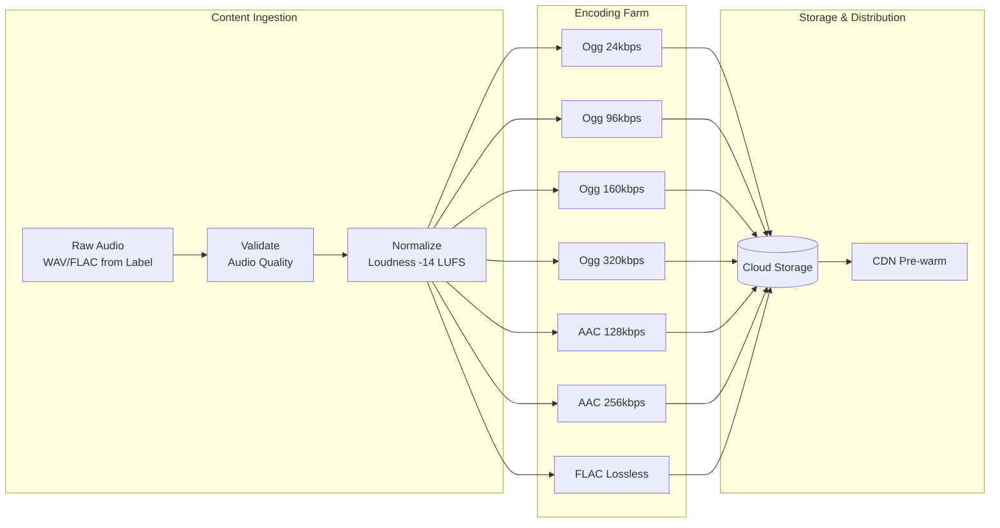
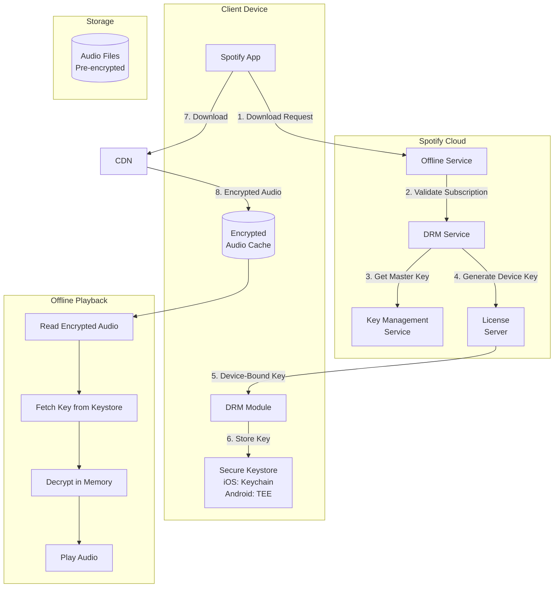
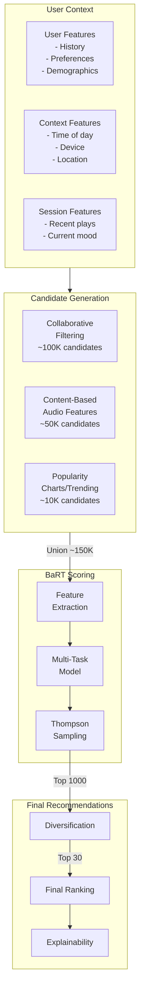
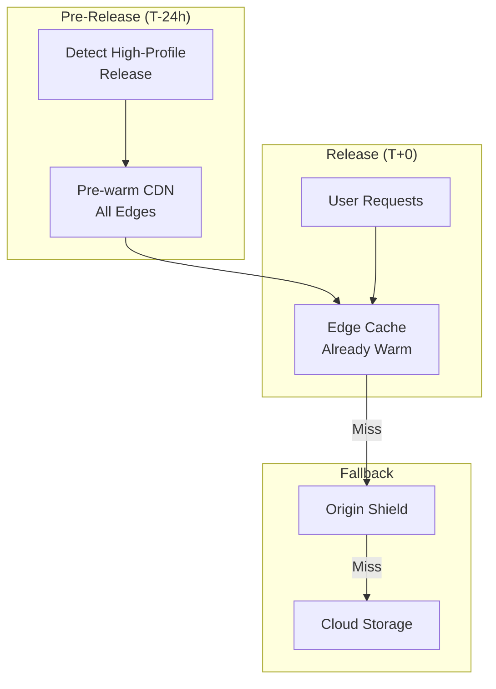

# Deep Dive & Bottlenecks

## Critical Component 1: Audio Codec & Streaming System

### Codec Selection

Spotify uses multiple audio codecs optimized for different platforms and quality requirements:

| Codec | Format | Platform | Bitrates | Advantages |
|-------|--------|----------|----------|------------|
| **Ogg Vorbis** | .ogg | Desktop, Mobile | 24, 96, 160, 320 kbps | Open source, no licensing fees, efficient at low bitrates |
| **AAC** | .m4a | Web Player, Chromecast | 128, 256 kbps | Browser compatibility, HLS support |
| **FLAC** | .flac | Premium (2025) | 1,411 kbps | Lossless, audiophile market |

### Why Ogg Vorbis Over MP3?

| Aspect | Ogg Vorbis | MP3 |
|--------|------------|-----|
| Quality at 128kbps | Equivalent to MP3 160kbps | Baseline |
| Licensing | Free (open source) | Historically patented |
| Low Bitrate Performance | Superior | Artifacts at <96kbps |
| Container Flexibility | Ogg container, metadata | Limited |
| Adoption | Spotify, Discord, many games | Universal |

**Trade-off**: MP3 has universal device support, but Ogg Vorbis's quality advantage at streaming bitrates and zero licensing cost justified Spotify's choice.

### Audio Encoding Pipeline



### Adaptive Bitrate Streaming for Audio

Unlike video ABR (which uses HLS/DASH segments), Spotify audio ABR is simpler:

| Aspect | Video ABR (HLS/DASH) | Spotify Audio ABR |
|--------|---------------------|-------------------|
| Segment Duration | 2-10 seconds | Full track (or large chunks) |
| Quality Switches | Mid-stream common | Typically at track boundaries |
| Manifest Complexity | Multi-rendition playlist | Simple URL selection |
| Buffering Strategy | Adaptive buffer | Fixed ~30s buffer target |

**Why Different?**
- Audio tracks are ~4MB vs video episodes at ~2GB
- Mid-track quality switches are jarring for audio (more noticeable)
- Simpler: pick quality at start, download whole track

### Client Buffering Strategy

```
BUFFER MANAGEMENT:

Target Buffer: 30 seconds of audio (~1.2 MB at 320kbps)

States:
┌─────────────────────────────────────────────────────────────┐
│  BUFFERING   │  PLAYING/BUFFERING  │  PLAYING (STABLE)     │
│  0-5s        │  5-15s              │  15-30s               │
│  ↓           │  ↓                  │  ↓                    │
│  Priority    │  Background fill    │  Prefetch next track  │
│  download    │  balanced           │  when <30s remaining  │
└─────────────────────────────────────────────────────────────┘

PREFETCH LOGIC:
- When 30 seconds remain in current track:
  - Identify next track (from queue/playlist/radio)
  - Begin downloading next track metadata
  - Start buffering next track (first 5 seconds)
  - Results in seamless transitions (~0 gap)
```

### Failure Modes

| Failure | Detection | Recovery |
|---------|-----------|----------|
| CDN Timeout | >3s for chunk | Switch to secondary CDN |
| Network Drop | WebSocket disconnect | Pause playback, retry with backoff |
| Corrupted Data | Checksum mismatch | Re-request chunk from different CDN |
| DRM Token Expired | 401 response | Silent refresh, retry |
| Quality Too High | Buffer draining <5s | Step down bitrate immediately |

---

## Critical Component 2: Offline Mode & DRM Architecture

### DRM System Overview



### Encryption Scheme

```
ENCRYPTION LAYERS:

Layer 1: Content Encryption (at rest in cloud)
  - Algorithm: AES-256-CTR
  - Key: Content Encryption Key (CEK) per track
  - Stored: Cloud Storage

Layer 2: Key Encryption (for delivery)
  - Algorithm: RSA-2048
  - Key: Device Public Key
  - Purpose: Secure key transport

Layer 3: Device Binding (local storage)
  - Algorithm: AES-256-GCM
  - Key: Derived from hardware ID + app signature
  - Purpose: Prevent extraction

KEY HIERARCHY:
┌─────────────────────────────────────────────────────────────┐
│  Master Key (KMS - never leaves HSM)                        │
│    ↓                                                        │
│  Content Encryption Key (per track, encrypted by master)    │
│    ↓                                                        │
│  Device Key (CEK encrypted by device public key)            │
│    ↓                                                        │
│  Local Storage Key (Device key wrapped by hardware key)     │
└─────────────────────────────────────────────────────────────┘
```

### 30-Day Re-Authentication

| Day | Status | Client Behavior |
|-----|--------|-----------------|
| 1-23 | Valid | Normal offline playback |
| 24 | Warning | "Go online to keep music" notification |
| 28 | Urgent | Daily reminders, badge on app |
| 30 | Grace | 24-hour grace period if app is open |
| 31 | Expired | Keys invalidated, tracks unplayable |

**Why 30 Days?**
1. **License Compliance**: Music labels require periodic subscription verification
2. **Piracy Prevention**: Prevents download-and-cancel abuse
3. **Key Rotation**: Security best practice for encryption keys
4. **User-Friendly**: Long enough for vacations, cruises, flights

### Offline Limits Enforcement

```
OFFLINE LIMITS:

Per Account:
  - Max devices: 5 (can deauthorize old ones)
  - Premium subscription required

Per Device:
  - Max tracks: 10,000
  - Max storage: User-controlled (50MB - 10GB default)

ENFORCEMENT FLOW:

1. Client requests download for track_ids[]
2. Server checks:
   - Is subscription active? (Premium required)
   - Is device registered? (Max 5 devices)
   - Will this exceed 10,000 tracks on device?
3. If any check fails, return error with reason
4. If all pass, return download URLs + device-bound keys
```

### Failure Modes

| Failure | Impact | Recovery |
|---------|--------|----------|
| Key Expiry (30 days) | Tracks unplayable offline | Connect to internet, auto-refresh |
| Device Limit Exceeded | Can't add new device | Deauthorize old device in settings |
| Track Limit Exceeded | Can't download more | Remove tracks or upgrade storage |
| Subscription Lapsed | All offline tracks locked | Re-subscribe, keys refresh |
| Device Factory Reset | Lose all offline content | Re-download (counts against limits) |
| Storage Full | Downloads fail | Clear cache or remove tracks |

---

## Critical Component 3: Collaborative Playlist Sync (CRDT)

### Why CRDT?

| Approach | Pros | Cons | When to Use |
|----------|------|------|-------------|
| **Last-Write-Wins** | Simple, fast | Data loss | Single-user apps |
| **Operational Transform** | Real-time, proven | Complex, centralized | Google Docs |
| **CRDT** | No data loss, offline-friendly | Eventual consistency | Spotify playlists |

Spotify chose CRDT because:
1. Users edit playlists offline and sync later
2. Multiple users can add to collaborative playlists simultaneously
3. Data loss (missing tracks) is unacceptable
4. Eventual consistency is acceptable (not real-time critical)

### CRDT Implementation Details

```mermaid
flowchart TB
    subgraph User1["User 1 (Offline)"]
        U1_LOCAL[(Local State<br/>v=[1,0])]
        U1_OP1[Add "Track A" pos 0]
        U1_OP2[Add "Track B" pos 1]
    end

    subgraph User2["User 2 (Offline)"]
        U2_LOCAL[(Local State<br/>v=[0,1])]
        U2_OP1[Add "Track C" pos 0]
    end

    subgraph Server["Server (Online)"]
        MERGE[Merge Engine]
        MASTER[(Master State<br/>v=[2,1])]
    end

    U1_OP1 --> U1_LOCAL
    U1_OP2 --> U1_LOCAL
    U2_OP1 --> U2_LOCAL

    U1_LOCAL -->|Sync| MERGE
    U2_LOCAL -->|Sync| MERGE

    MERGE -->|Merged Result| MASTER

    Note over MASTER: Final playlist:<br/>1. Track A (U1 first by timestamp)<br/>2. Track C (U2, inserted at 0 but after A)<br/>3. Track B (U1, position 1)
```

### Version Vector Mechanics

```
VERSION VECTOR EXAMPLE:

Initial State:
  Playlist: [Track1, Track2]
  Version Vector: {user_alice: 0, user_bob: 0}

Alice adds Track3 (offline):
  Local: [Track1, Track2, Track3]
  Version Vector: {user_alice: 1, user_bob: 0}

Bob adds Track4 at position 1 (offline):
  Local: [Track1, Track4, Track2]
  Version Vector: {user_alice: 0, user_bob: 1}

Both sync to server:
  Merge Version Vector: {user_alice: 1, user_bob: 1}

  Conflict Resolution:
  - Track3 added by Alice at end → position 3
  - Track4 added by Bob at position 1 → between Track1 and Track2

  Merged Result: [Track1, Track4, Track2, Track3]
```

### Conflict Scenarios

| Scenario | Resolution | User Impact |
|----------|------------|-------------|
| Same track added at same position by 2 users | Both kept, ordered by (timestamp, user_id) | May see duplicate |
| Track removed while another user is moving it | Remove wins | Track disappears |
| Same track added and removed concurrently | Remove wins | Track not in list |
| Reorder during concurrent add | Add inserted at target position | Smooth result |

### Real-Time Sync Protocol

```
SYNC PROTOCOL:

1. CONNECT
   Client → Server: WebSocket connect with session token
   Server → Client: Current version vector

2. SUBSCRIBE
   Client → Server: {type: "subscribe", playlist_id: "xxx"}
   Server → Client: ACK + current snapshot

3. LOCAL OPERATION
   Client: Apply operation locally (optimistic)
   Client → Server: {type: "operation", op: {...}, version: {...}}

4. SERVER BROADCAST
   Server: Validate and merge operation
   Server → All Clients: {type: "update", ops: [...], new_version: {...}}

5. CONFLICT RESOLUTION
   Client: If local version != server version:
     - Rebase local pending operations
     - Apply server operations
     - Re-apply local operations on top

6. OFFLINE QUEUE
   If disconnected:
     - Queue operations locally
     - On reconnect, sync queued ops
     - Server merges using CRDT rules
```

---

## Critical Component 4: BaRT Recommendation Engine

### BaRT: Bandits for Recommendations as Treatments

BaRT treats recommendation as a multi-armed bandit problem:
- Each recommendation slot is an "arm"
- "Reward" is user engagement (play, skip, save)
- Balance exploration (new content) vs exploitation (known preferences)



### Recommendation Signals

| Signal Type | Examples | Weight |
|-------------|----------|--------|
| **Explicit** | Saves, playlist adds, likes | High |
| **Implicit** | Plays, skips, listen duration | Medium |
| **Contextual** | Time, device, location | Medium |
| **Social** | Friend activity, follows | Low |
| **Content** | Audio features, genre, tempo | Low |

### Discover Weekly Pipeline

```
DISCOVER WEEKLY GENERATION:

Schedule: Every Monday at 00:00 UTC (rolling by timezone)

Pipeline Steps:

1. CANDIDATE GENERATION (per user)
   - Collaborative filtering: 5,000 candidates
     "Users with similar taste liked these"
   - Content-based: 3,000 candidates
     "Similar to tracks you've played"
   - Fresh releases: 2,000 candidates
     "New in your preferred genres"
   = 10,000 total candidates

2. SCORING (BaRT model)
   Features:
   - User embedding (128 dims)
   - Track embedding (128 dims)
   - Historical interaction
   - Audio features
   - Freshness (prefer tracks not in DW before)

   Output: P(user_will_save | track)

3. DIVERSIFICATION
   Constraints:
   - Max 2 tracks per artist
   - Max 40% of any genre
   - At least 20% "discovery" (low familiarity score)
   - Mix of tempos and energies

4. FINAL SELECTION
   - 30 tracks
   - Ordered by score (best first? or narrative arc?)
   - Test: Some users get "excitement curve" ordering

5. CACHING
   - Pre-compute for all 350M+ DAU
   - Store in Redis/Memcached
   - TTL: 7 days

SCALE:
  - 350M playlists generated
  - ~35B track scorings
  - Compute time: 6-8 hours on distributed cluster
```

### Cold Start Problem

| User Type | Strategy |
|-----------|----------|
| **New User (no history)** | Onboarding quiz → initial genres/artists |
| **New User (social)** | Friend recommendations, popular in region |
| **Returning Free User** | Lean on last session, trending content |
| **New Track (no plays)** | Content-based features, artist similarity |
| **New Artist** | Similar artists, genre placement |

---

## Bottleneck Analysis

### Identified Bottlenecks

| Rank | Bottleneck | Severity | Impact |
|------|------------|----------|--------|
| 1 | CDN Cache Miss for New Releases | High | Latency spike, origin overload |
| 2 | Playlist Sync Conflicts | Medium | User confusion, data issues |
| 3 | Offline Key Refresh Storms | Medium | Batch auth load |
| 4 | Search Latency at Scale | Medium | Poor UX for search |
| 5 | Recommendation Cold Start | Low | Poor initial experience |

### Bottleneck 1: CDN Cache Miss Storms

**Problem**: When Taylor Swift drops an album at midnight, millions of users request the same new tracks simultaneously. These tracks aren't cached anywhere.

```
CACHE MISS STORM SCENARIO:

T+0: Album drops
T+1s: 1M users request track 1
      - 0% cache hit rate
      - All requests hit origin (Cloud Storage)
      - Origin rate limited, queued

T+5s: Origin overloaded
      - Latency spikes to 5s+
      - Some requests timeout
      - Retry storms worsen situation
```

**Mitigation Strategies**:

| Strategy | Description | Effectiveness |
|----------|-------------|---------------|
| **Pre-warming** | Push to CDN edges before release | High (if release known) |
| **Staggered Release** | Roll out by region over 30 min | Medium (artists don't like) |
| **Origin Shield** | Intermediate cache layer | Medium |
| **Request Coalescing** | Batch identical requests | Medium |
| **Graceful Degradation** | Lower quality if high bitrate unavailable | Low (fallback) |



### Bottleneck 2: Playlist Sync Conflicts

**Problem**: Collaborative playlists with many active editors can generate high conflict rates, leading to confusing UX.

**Mitigation**:
1. **Real-time Presence**: Show who's editing (reduces simultaneous edits)
2. **Operation Batching**: Batch rapid edits into single operation
3. **UI Feedback**: Show "syncing..." status, prevent duplicate actions
4. **Conflict Preview**: On major conflicts, show diff before merge

### Bottleneck 3: Offline Key Refresh Storms

**Problem**: Many users have keys expiring at similar times (30-day cycles). When they come online, mass refresh requests hit the DRM service.

**Mitigation**:
1. **Jittered Expiry**: Add random offset to 30-day expiry (±3 days)
2. **Background Refresh**: Refresh keys silently when app is open, not on expiry
3. **Batch API**: Refresh all keys in single request (not per-track)
4. **Cache Tokens**: Cache refresh tokens for repeat requests

### Bottleneck 4: Search at Scale

**Problem**: 65K QPS with <200ms p95 latency requirement.

**Mitigation**:
1. **Query Caching**: Cache popular queries (Redis, 1-hour TTL)
2. **Sharding**: Shard Elasticsearch by document type (tracks, artists, playlists)
3. **Query Optimization**: Use filters before full-text search
4. **Autocomplete Optimization**: Pre-computed prefix trees for top queries

---

## Concurrency & Race Conditions

### Race Condition 1: Simultaneous Playlist Edits

**Scenario**: User on phone and desktop add different tracks at same position.

**Solution**: CRDT with version vectors (detailed above)

### Race Condition 2: Offline Download During Subscription Cancel

**Scenario**: User downloads track at T=0, subscription canceled at T=1 (before download completes).

**Solution**:
```
DOWNLOAD FLOW:
1. Validate subscription at download START
2. Download audio file
3. Request DRM key (validates subscription AGAIN)
4. If step 3 fails, delete downloaded file
5. Only mark as "available offline" after key received
```

### Race Condition 3: Concurrent Playback on Multiple Devices

**Scenario**: User starts playback on phone, then on desktop. Which device wins?

**Solution**: Spotify allows only 1 active stream per account (Premium). Last device to start wins.

```
CONCURRENT PLAYBACK HANDLING:

1. User starts playback on Device A
2. Server marks Device A as active
3. User starts playback on Device B
4. Server:
   - Marks Device B as active
   - Sends PAUSE command to Device A
   - Device A shows "Playback paused - playing on Device B"
5. User can tap "Play here" on Device A to reclaim
```

### Race Condition 4: Playlist Deletion During Sync

**Scenario**: User A deletes playlist while User B (collaborator) is adding tracks offline.

**Solution**:
- Soft delete with 30-day retention
- Show "This playlist was deleted" message to User B
- Offer to restore or create copy with their changes
