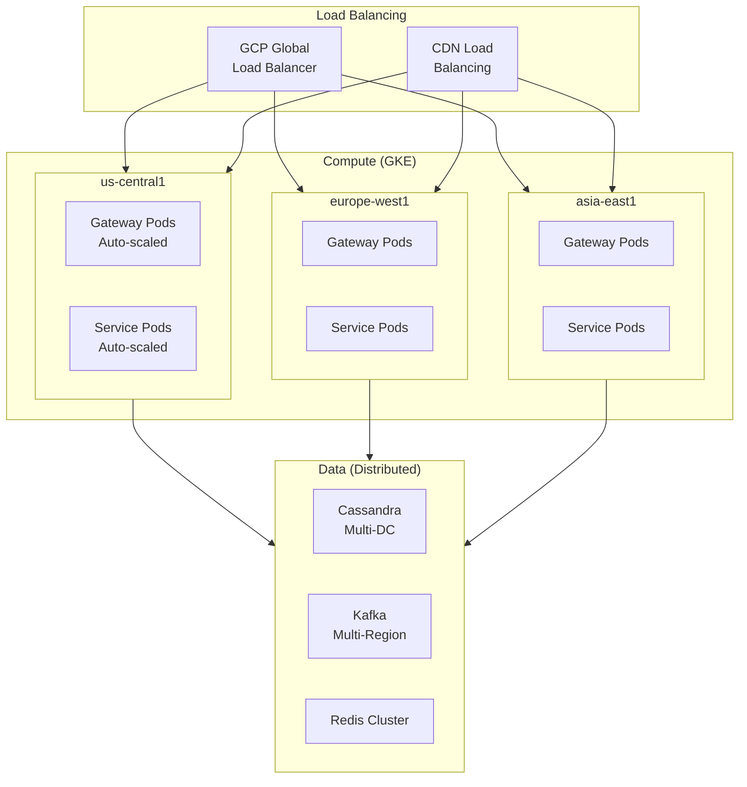
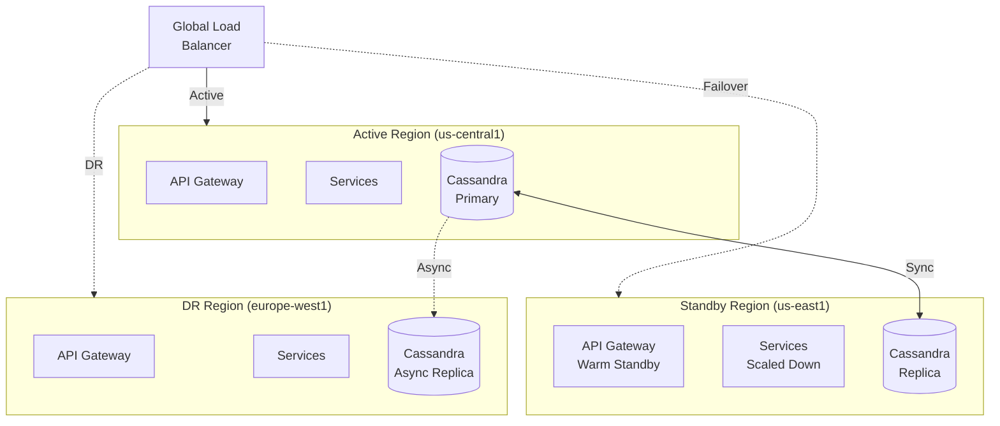
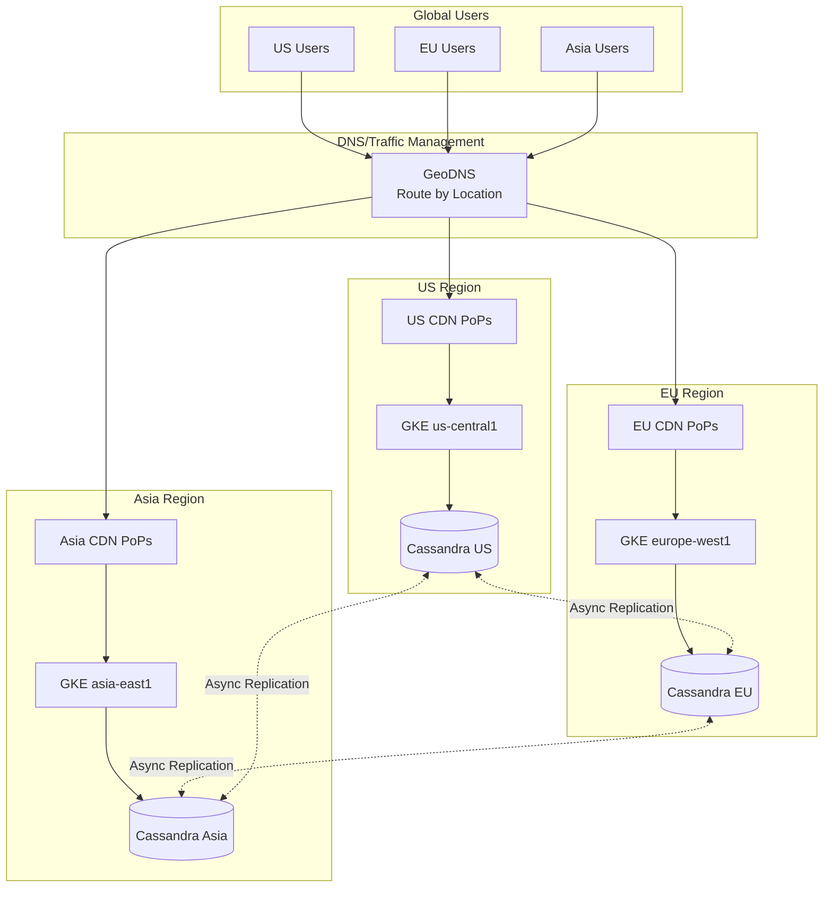

# Scalability & Reliability

## Scalability Strategy

### Horizontal Scaling Overview



### Service Scaling Strategy

| Service | Scaling Type | Trigger | Min/Max Pods |
|---------|--------------|---------|--------------|
| API Gateway | Horizontal | CPU > 60%, QPS | 50 / 500 |
| Playback Service | Horizontal | CPU > 70%, Latency p95 > 100ms | 100 / 1000 |
| Playlist Service | Horizontal | CPU > 70% | 30 / 300 |
| Search Service | Horizontal | Latency p95 > 150ms | 20 / 200 |
| Offline Service | Horizontal | Queue depth | 20 / 200 |
| Recommendation Service | Horizontal + Vertical | GPU utilization | 10 / 100 (GPU) |

### Auto-Scaling Configuration

```yaml
# Example HPA for Playback Service
apiVersion: autoscaling/v2
kind: HorizontalPodAutoscaler
metadata:
  name: playback-service-hpa
spec:
  scaleTargetRef:
    apiVersion: apps/v1
    kind: Deployment
    name: playback-service
  minReplicas: 100
  maxReplicas: 1000
  metrics:
    - type: Resource
      resource:
        name: cpu
        target:
          type: Utilization
          averageUtilization: 70
    - type: Pods
      pods:
        metric:
          name: http_requests_per_second
        target:
          type: AverageValue
          averageValue: "1000"
    - type: External
      external:
        metric:
          name: pubsub.googleapis.com|subscription|num_undelivered_messages
        target:
          type: Value
          value: "10000"
  behavior:
    scaleUp:
      stabilizationWindowSeconds: 60
      policies:
        - type: Percent
          value: 100
          periodSeconds: 60
    scaleDown:
      stabilizationWindowSeconds: 300
      policies:
        - type: Percent
          value: 10
          periodSeconds: 60
```

### Database Scaling

#### Cassandra Scaling

| Aspect | Strategy |
|--------|----------|
| Read Scaling | Add nodes to ring, increase RF |
| Write Scaling | Add nodes, more partitions |
| Geographic | Multi-DC with LOCAL_QUORUM |
| Hot Partitions | Virtual nodes (vnodes), better partition keys |

```
CASSANDRA TOPOLOGY:

Cluster: spotify_user
  - Replication: NetworkTopologyStrategy
  - us-central1: RF=3, 30 nodes
  - europe-west1: RF=3, 25 nodes
  - asia-east1: RF=3, 20 nodes

Total: 75 nodes, ~30 TB

Read Consistency: LOCAL_QUORUM (fast reads in region)
Write Consistency: LOCAL_QUORUM (durable in region)
Cross-DC Replication: Async (eventual consistency)
```

#### BigQuery/Bigtable (Managed)

| Service | Scaling | Notes |
|---------|---------|-------|
| Bigtable | Auto-split, add nodes | Listening history, time-series |
| BigQuery | Serverless (slots) | Analytics, ML training |

### CDN Scaling

```
MULTI-CDN SCALING:

Traffic Distribution (normal):
  Akamai: 60%
  Fastly: 30%
  GCP CDN: 10%

Traffic Distribution (peak event):
  Akamai: 50% (approaching capacity)
  Fastly: 35% (shift load)
  GCP CDN: 15% (absorb overflow)

Capacity Planning:
  - Total CDN capacity: 20+ Tbps
  - Peak requirement: 12 Tbps
  - Headroom: 40%
```

### Kafka Scaling

| Aspect | Configuration |
|--------|---------------|
| Topics | 500+ |
| Partitions/Topic | 64-256 (varies by volume) |
| Brokers | 50+ per region |
| Replication Factor | 3 |
| Retention | 7 days (200 TB) |

```
HIGH-VOLUME TOPICS:

play_events:
  - Partitions: 256
  - Messages/sec: 665K
  - Partition Key: user_id (even distribution)

playlist_updates:
  - Partitions: 64
  - Messages/sec: 50K
  - Partition Key: playlist_id

search_logs:
  - Partitions: 128
  - Messages/sec: 100K
  - Partition Key: request_id
```

---

## Reliability & Fault Tolerance

### Single Points of Failure (SPOF) Analysis

| Component | SPOF Risk | Mitigation | Residual Risk |
|-----------|-----------|------------|---------------|
| CDN | Low | Multi-CDN (3 providers) | Provider-wide outage |
| API Gateway | Low | Multi-region, auto-scaled | Region failure |
| Cassandra | Low | RF=3, multi-DC | Multi-region failure |
| Kafka | Low | RF=3, multi-broker | Cluster failure |
| DRM Service | Medium | HA deployment, but single service | Encrypted key unavailable |
| Recommendation ML | Medium | Fallback to popular/cached | Degraded personalization |
| Search (Elasticsearch) | Medium | 2 replicas, cross-region | Index corruption |

### Redundancy Architecture



### Circuit Breaker Pattern

```
CIRCUIT BREAKER CONFIGURATION:

States:
  CLOSED: Normal operation, requests pass through
  OPEN: Failures exceeded threshold, requests fail fast
  HALF_OPEN: Testing if service recovered

Thresholds (per downstream service):
  - Failure threshold: 50% of requests in 10s window
  - Open duration: 30 seconds
  - Half-open test requests: 5
  - Success threshold to close: 3 consecutive successes

Example - Recommendation Service Circuit Breaker:
  IF recommendation_service fails > 50% in 10s:
    OPEN circuit
    Return fallback (cached recommendations / popular tracks)
    After 30s, try HALF_OPEN
    IF 3 successes in HALF_OPEN:
      CLOSE circuit (resume normal)
```

### Retry Strategies

| Service | Retry Config | Backoff | Max Retries |
|---------|--------------|---------|-------------|
| CDN Fetch | Immediate + switch CDN | - | 3 (1 per CDN) |
| Cassandra Read | Exponential | 100ms, 200ms, 400ms | 3 |
| Cassandra Write | Exponential | 200ms, 400ms, 800ms | 3 |
| Kafka Produce | Exponential | 100ms base | 5 |
| External API | Exponential + jitter | 1s, 2s, 4s, 8s | 4 |

```
RETRY WITH EXPONENTIAL BACKOFF:

FUNCTION retry_with_backoff(operation, max_retries, base_delay_ms):
  FOR attempt IN 1..max_retries:
    TRY:
      RETURN operation()
    CATCH error:
      IF attempt == max_retries:
        THROW error

      delay = base_delay_ms * (2 ^ (attempt - 1))
      jitter = RANDOM(0, delay * 0.1)
      SLEEP(delay + jitter)

  THROW "Max retries exceeded"
```

### Graceful Degradation

| Scenario | Degraded Behavior | User Impact |
|----------|-------------------|-------------|
| Recommendation service down | Show popular/trending | Less personalized home |
| Search service degraded | Show cached results, recent searches | May not find new content |
| Lyrics service down | Hide lyrics button | No lyrics |
| Social service down | Hide friend activity | Can't see friend activity |
| Offline sync service down | Queue sync for later | Downloads delayed |
| One CDN down | Route to other CDNs | Possible latency increase |

### Bulkhead Pattern

```
BULKHEAD ISOLATION:

Thread Pools:
  - playback_pool: 200 threads (critical path)
  - search_pool: 100 threads
  - recommendation_pool: 50 threads
  - social_pool: 30 threads
  - analytics_pool: 20 threads

Benefit: Search overload doesn't affect playback

Connection Pools (Cassandra):
  - user_data_pool: 100 connections
  - playlist_pool: 100 connections
  - analytics_pool: 50 connections

Benefit: Analytics queries don't exhaust connections for user data
```

---

## Disaster Recovery

### Recovery Objectives

| Data Type | RPO (Data Loss) | RTO (Downtime) |
|-----------|-----------------|----------------|
| User Accounts | 0 (sync replication) | < 5 minutes |
| Playlists | 0 (sync replication) | < 5 minutes |
| Listening History | < 1 hour | < 30 minutes |
| Recommendations | < 24 hours | < 1 hour |
| Offline Keys | 30 days (can regenerate) | N/A |
| Analytics | < 1 hour | < 4 hours |

### Backup Strategy

| Data Store | Backup Type | Frequency | Retention |
|------------|-------------|-----------|-----------|
| Cassandra | Snapshot + incremental | Daily + continuous | 30 days |
| PostgreSQL | pg_dump + WAL | Daily + continuous | 90 days |
| BigQuery | Native (time-travel) | Continuous | 7 days travel, 30 days backup |
| Cloud Storage | Multi-region (native) | Real-time | Versioning enabled |
| Elasticsearch | Snapshot to GCS | Daily | 14 days |

### Failover Procedures

```
REGIONAL FAILOVER RUNBOOK:

Trigger: Primary region (us-central1) unavailable for > 5 minutes

Automated Steps:
1. Health checks fail for 3 consecutive minutes
2. Alert fires to on-call
3. Traffic Manager begins routing to standby (us-east1)
4. Standby auto-scales (pre-warmed to 50% capacity)

Manual Steps (if automation fails):
1. On-call confirms primary is down (not false positive)
2. Execute: `gcloud dns failover --zone=api.spotify.com --target=us-east1`
3. Monitor standby scaling
4. Verify Cassandra consistency (LOCAL_QUORUM available)
5. Communicate via status page

Rollback:
1. Confirm primary recovered
2. Verify data sync complete
3. Gradual traffic shift (10% → 50% → 100%)
4. Monitor for errors
```

### Multi-Region Architecture



---

## Capacity Planning

### Growth Projections

| Year | MAU | Peak Concurrent | Peak Bandwidth | Storage |
|------|-----|-----------------|----------------|---------|
| 2025 | 713M | 50M | 12 Tbps | 52 PB |
| 2026 | 800M | 60M | 15 Tbps | 70 PB |
| 2027 | 900M | 70M | 18 Tbps | 90 PB |

### Scaling Triggers

| Metric | Warning | Critical | Action |
|--------|---------|----------|--------|
| CPU (service) | 60% | 80% | Auto-scale |
| Memory | 70% | 85% | Auto-scale |
| Cassandra Disk | 60% | 75% | Add nodes |
| Kafka Lag | 10K msgs | 100K msgs | Add partitions/consumers |
| CDN Capacity | 70% | 85% | Increase CDN allocation |
| API Latency p95 | 80ms | 150ms | Scale up, investigate |

### Capacity Buffer

```
CAPACITY PLANNING RULE:

Steady State Utilization Target: 50-60%
Peak Utilization Target: 70-80%
Headroom: 20-30%

Justification:
- 20% for unexpected traffic spikes (viral moments)
- 5% for failover capacity (regional failure)
- 5% for deployment overhead (rolling updates)

Example:
  Peak expected: 400K plays/sec
  Provisioned capacity: 400K / 0.7 = 571K plays/sec
  Headroom: 171K plays/sec (30%)
```

---

## Performance Optimization

### Caching Strategy

| Cache Layer | Technology | TTL | Purpose |
|-------------|------------|-----|---------|
| L1 (In-process) | Caffeine | 1 min | Hot data, config |
| L2 (Distributed) | Redis Cluster | 1 hour | User sessions, playlists |
| L3 (CDN) | Akamai/Fastly | 24 hours | Audio files, images |

### Query Optimization

```
CASSANDRA QUERY PATTERNS:

Good (partition-aware):
  SELECT * FROM playlists WHERE playlist_id = ?

Bad (scatter-gather):
  SELECT * FROM playlists WHERE name = 'My Playlist'
  → Requires ALLOW FILTERING, scans all partitions

Good (range within partition):
  SELECT * FROM listen_history
  WHERE user_id = ? AND year_month = '2025-01'
  AND played_at > ?

Bad (cross-partition range):
  SELECT * FROM listen_history WHERE played_at > ?
  → Scans all partitions
```

### Connection Pooling

| Service | Pool Size | Timeout | Keep-Alive |
|---------|-----------|---------|------------|
| Cassandra | 100 connections/node | 5s | 30s |
| Redis | 50 connections | 2s | 60s |
| PostgreSQL | 50 connections | 10s | 300s |
| HTTP (external) | 100 connections | 30s | 120s |

---

## Operational Runbooks

### Scaling Runbook

```
MANUAL SCALE-UP PROCEDURE:

Trigger: Anticipated high traffic (e.g., New Year's Eve)

Steps:
1. Identify scaling targets (2-3x normal capacity)
2. Pre-scale 24 hours before event:
   - kubectl scale deployment/playback-service --replicas=500
   - kubectl scale deployment/api-gateway --replicas=200
3. Increase CDN allocation (contact Akamai/Fastly)
4. Warm caches with predicted content
5. Disable non-critical services (analytics sampling, feature experiments)
6. Monitor throughout event
7. Gradual scale-down after event (not immediate)
```

### Incident Response

```
INCIDENT SEVERITY LEVELS:

SEV1 - Critical (< 15 min response):
  - Playback completely down
  - Data breach
  - > 10% error rate

SEV2 - High (< 30 min response):
  - Degraded playback (> 1s latency)
  - Offline sync broken
  - 5-10% error rate

SEV3 - Medium (< 2 hour response):
  - Non-critical features down
  - Recommendations degraded
  - < 5% error rate

SEV4 - Low (next business day):
  - Minor UX issues
  - Performance degradation (not user-facing)
```
