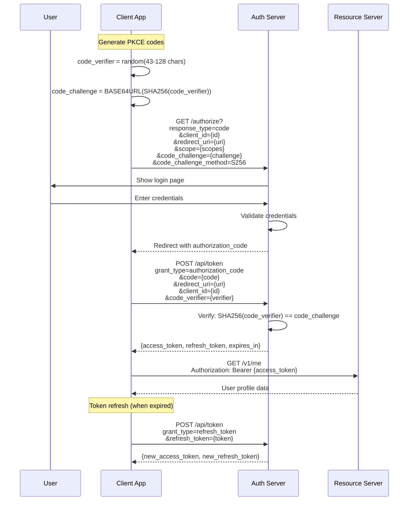
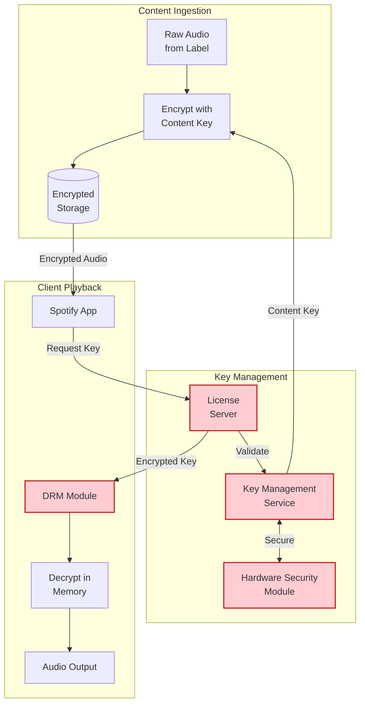
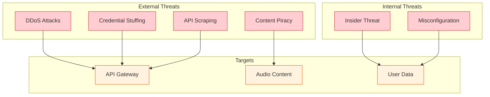
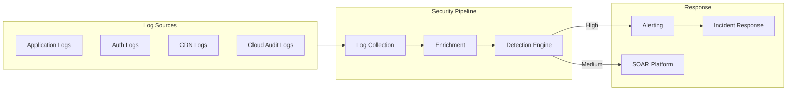

# Security & Compliance

## Authentication & Authorization

### OAuth 2.0 with PKCE

Spotify uses OAuth 2.0 with Proof Key for Code Exchange (PKCE) for secure authentication across all client types.



### Token Management

| Token Type | Lifetime | Storage | Revocation |
|------------|----------|---------|------------|
| Access Token | 1 hour | Memory only | On logout, password change |
| Refresh Token | 1 year | Secure storage (Keychain/TEE) | On logout, password change, suspicious activity |
| Device Token | Until deauthorized | Secure storage | Manual deauthorization |

### Scopes

| Scope | Access Granted | Use Case |
|-------|----------------|----------|
| `user-read-private` | Email, subscription, country | Basic profile |
| `user-read-email` | Email address | Account verification |
| `playlist-read-private` | Private playlists | Reading playlists |
| `playlist-modify-public` | Edit public playlists | Playlist management |
| `playlist-modify-private` | Edit private playlists | Playlist management |
| `user-library-read` | Saved tracks/albums | Library access |
| `user-library-modify` | Save/remove items | Library management |
| `user-read-playback-state` | Current playback | Now playing |
| `user-modify-playback-state` | Control playback | Play/pause/skip |
| `streaming` | Audio streaming | Play music |
| `user-read-recently-played` | Listening history | Recommendations |

### Authorization Model

```
AUTHORIZATION LEVELS:

1. Account Level
   - Subscription tier (free, premium, family, duo)
   - Country (content availability)
   - Age verification (explicit content)

2. Content Level
   - Track availability by region
   - Offline download rights (Premium only)
   - Lossless quality (Premium only)
   - Ad-free experience (Premium only)

3. Feature Level
   - Spotify Connect (Premium only)
   - Download offline (Premium only)
   - Group sessions (Premium only)

4. API Level
   - Rate limits per endpoint
   - Scope-based access
   - Client type restrictions
```

---

## DRM Architecture

### Content Protection System



### Encryption Details

| Layer | Algorithm | Key Size | Purpose |
|-------|-----------|----------|---------|
| Content Encryption | AES-256-CTR | 256-bit | Encrypt audio at rest |
| Key Transport | RSA-2048 | 2048-bit | Secure key delivery |
| Key Wrapping | AES-256-KW | 256-bit | Wrap CEK for storage |
| Device Binding | AES-256-GCM | 256-bit | Bind to device |
| TLS | TLS 1.3 | - | Encrypt in transit |

### Offline DRM

```
OFFLINE KEY LIFECYCLE:

1. GENERATION (on download request)
   - Validate Premium subscription
   - Generate Content Encryption Key (CEK) per track
   - Encrypt CEK with Device Public Key
   - Set expiration (30 days from now)
   - Sign with License Server key

2. STORAGE (on device)
   - CEK stored in Secure Enclave / TEE / Keychain
   - Bound to device hardware ID
   - Encrypted with device-specific key
   - Not exportable

3. PLAYBACK (offline)
   - Retrieve CEK from secure storage
   - Verify signature (prevent tampering)
   - Check expiration
   - Decrypt in protected memory
   - Stream to audio output

4. REFRESH (every 30 days)
   - Device must connect to internet
   - Re-validate subscription
   - Issue new CEK (or extend expiry)
   - Silent background process

5. REVOCATION (on subscription cancel)
   - Server marks keys invalid
   - On next online check, keys deleted
   - Offline content becomes unplayable
```

### Concurrent Stream Enforcement

| Plan | Max Concurrent | Enforcement |
|------|----------------|-------------|
| Free | 1 | Hard limit |
| Premium | 1 (with Spotify Connect) | Last device wins |
| Duo | 2 | Per member |
| Family | 6 | Per member (1 each) |

```
CONCURRENT STREAM CHECK:

ON PLAY REQUEST:
  1. Check active streams for user
  2. IF streams >= limit:
     - Send PAUSE to oldest stream
     - Show "Paused - playing on {device}" on old device
  3. Register new stream as active
  4. Start heartbeat (every 30s)

ON HEARTBEAT MISSING (90s):
  - Mark stream as inactive
  - Release slot

ON EXPLICIT PAUSE/STOP:
  - Mark stream as inactive immediately
```

---

## Data Security

### Data Classification

| Classification | Examples | Encryption | Access |
|----------------|----------|------------|--------|
| **Critical** | Passwords, payment info, DRM keys | At rest + in transit | Strict ACL |
| **Sensitive** | Email, listening history | At rest + in transit | Team ACL |
| **Internal** | Service logs, metrics | In transit | Internal only |
| **Public** | Track metadata, public playlists | In transit | Public API |

### Encryption at Rest

| Data Store | Encryption | Key Management |
|------------|------------|----------------|
| Cloud Storage (audio) | AES-256 (SSE) | Google-managed |
| Cassandra | AES-256 (TDE) | Customer-managed (CMEK) |
| BigQuery | AES-256 (default) | Google-managed |
| Cloud SQL | AES-256 (TDE) | Customer-managed |
| Redis | None (volatile) | N/A |

### Encryption in Transit

```
TLS CONFIGURATION:

Minimum Version: TLS 1.2
Preferred Version: TLS 1.3

Cipher Suites (TLS 1.3):
  - TLS_AES_256_GCM_SHA384
  - TLS_CHACHA20_POLY1305_SHA256
  - TLS_AES_128_GCM_SHA256

Certificate:
  - RSA 2048-bit minimum
  - ECC P-256 preferred
  - HSTS enabled (max-age=31536000)
  - Certificate transparency required
```

### PII Handling

| PII Type | Collection | Storage | Retention |
|----------|------------|---------|-----------|
| Email | Account creation | Encrypted | Account lifetime |
| Name | Optional profile | Plaintext | Account lifetime |
| Location | IP geolocation | Aggregated | 30 days |
| Listening History | Automatic | Encrypted | Configurable (user control) |
| Payment Info | Checkout | Tokenized (Stripe/Braintree) | Never stored raw |

---

## Threat Model

### Top Attack Vectors



### Threat Mitigations

| Threat | Impact | Mitigation | Detection |
|--------|--------|------------|-----------|
| **DDoS** | Service unavailable | Cloud Armor, rate limiting, CDN absorption | Traffic anomaly detection |
| **Credential Stuffing** | Account takeover | CAPTCHA, rate limiting, breach detection | Failed login spikes |
| **API Scraping** | Data theft, abuse | Rate limiting, API keys, fingerprinting | Unusual access patterns |
| **Content Piracy** | Revenue loss | DRM, device binding, concurrent limits | Download pattern analysis |
| **Insider Threat** | Data breach | Least privilege, audit logs, MFA | Unusual data access |
| **Misconfiguration** | Data exposure | IaC scanning, security reviews | Automated config audits |

### Rate Limiting

| Endpoint | Limit | Window | Response |
|----------|-------|--------|----------|
| `/v1/search` | 30 req | 30 sec | 429 + Retry-After |
| `/v1/me/player` | 100 req | 1 min | 429 |
| `/v1/playlists` | 50 req | 1 min | 429 |
| `/v1/me/offline` | 10 req | 1 min | 429 |
| `/api/token` | 10 req | 1 min | 429 + temp ban |

### DDoS Protection

```
DDoS PROTECTION LAYERS:

Layer 1: CDN Absorption
  - Akamai/Fastly absorb volumetric attacks
  - Anycast distribution across PoPs
  - Capacity: 20+ Tbps

Layer 2: Cloud Armor / WAF
  - GCP Cloud Armor rules
  - Geographic filtering
  - Known bad IP blocking
  - SQL injection / XSS prevention

Layer 3: Application Rate Limiting
  - Per-user rate limits
  - Per-IP rate limits (unauthenticated)
  - Adaptive throttling

Layer 4: Circuit Breakers
  - Fail fast when overloaded
  - Preserve resources for legitimate users
```

---

## Compliance

### Regulatory Requirements

| Regulation | Region | Key Requirements | Status |
|------------|--------|------------------|--------|
| **GDPR** | EU | Consent, data access, deletion, DPO | Compliant |
| **CCPA/CPRA** | California | Opt-out, disclosure, no discrimination | Compliant |
| **COPPA** | US (children) | Parental consent for <13 | Spotify Kids app |
| **LGPD** | Brazil | Similar to GDPR | Compliant |
| **PCI DSS** | Payment | Tokenization, no raw card storage | Compliant (via Stripe) |

### GDPR Compliance

```
GDPR DATA SUBJECT RIGHTS:

Right to Access (Article 15):
  - Export listening history
  - Export playlists
  - Export profile data
  - Available in Privacy Settings

Right to Erasure (Article 17):
  - Account deletion
  - 30-day grace period
  - Permanent deletion of:
    - Profile data
    - Playlists
    - Listening history
    - Recommendations
  - Retained (anonymized):
    - Aggregate statistics
    - Play counts (for royalties)

Right to Portability (Article 20):
  - Download data in machine-readable format
  - JSON/CSV export

Right to Rectification (Article 16):
  - Edit profile information
  - Update email, name, etc.

Data Minimization:
  - Only collect necessary data
  - Purpose-specific processing
  - Retention limits
```

### Music Licensing & Royalties

| Party | Payment Basis | Calculation |
|-------|---------------|-------------|
| Record Labels | Per-stream | ~$0.003-0.005 per stream |
| Publishers | Per-stream | ~$0.001 per stream |
| PROs (ASCAP, BMI) | Per-stream | Included in publisher share |
| Artists | % of label share | Varies by contract |

```
ROYALTY TRACKING REQUIREMENTS:

For Each Play:
  - Track ID (ISRC)
  - User country
  - Subscription tier (affects rate)
  - Duration played (>30s = countable)
  - Timestamp
  - Platform/device

Aggregation:
  - Monthly reports to labels/publishers
  - Country-by-country breakdown
  - Tier-by-tier breakdown

Audit Trail:
  - Play logs retained for 7 years
  - Financial reconciliation
  - Third-party audits
```

---

## Security Operations

### Security Monitoring



### Security Alerts

| Alert | Severity | Response |
|-------|----------|----------|
| Multiple failed logins (same user) | Medium | CAPTCHA, notification |
| Login from new country | Low | Notification to user |
| Credential stuffing attack | High | Rate limit, block IPs |
| Unusual API usage pattern | Medium | Investigate, rate limit |
| Data exfiltration attempt | Critical | Block, investigate, notify |
| DRM key extraction attempt | High | Block device, investigate |

### Vulnerability Management

```
VULNERABILITY LIFECYCLE:

1. Discovery
   - Automated scanning (weekly)
   - Penetration testing (quarterly)
   - Bug bounty program
   - Dependency scanning (CI/CD)

2. Assessment
   - CVSS scoring
   - Exploitability analysis
   - Business impact

3. Prioritization
   - Critical: 24 hours
   - High: 7 days
   - Medium: 30 days
   - Low: 90 days

4. Remediation
   - Patch/upgrade
   - Compensating controls
   - Accept risk (documented)

5. Verification
   - Re-scan
   - Penetration test
   - Close ticket
```

### Security Testing

| Test Type | Frequency | Scope |
|-----------|-----------|-------|
| SAST (Static Analysis) | Every commit | All code |
| DAST (Dynamic Analysis) | Weekly | Production APIs |
| Dependency Scanning | Every build | Dependencies |
| Container Scanning | Every build | Container images |
| Penetration Testing | Quarterly | Critical systems |
| Red Team Exercise | Annually | Full scope |
| Bug Bounty | Continuous | Public scope |
