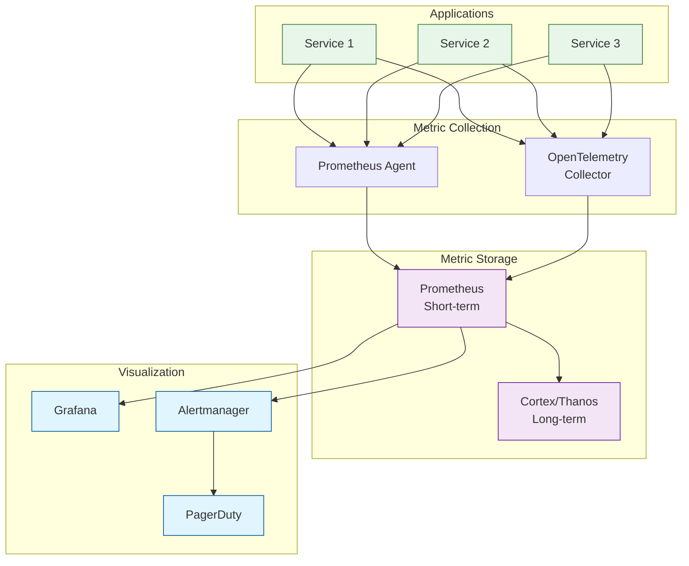
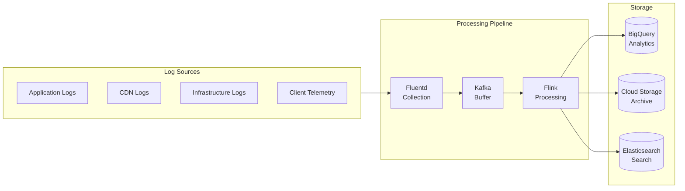
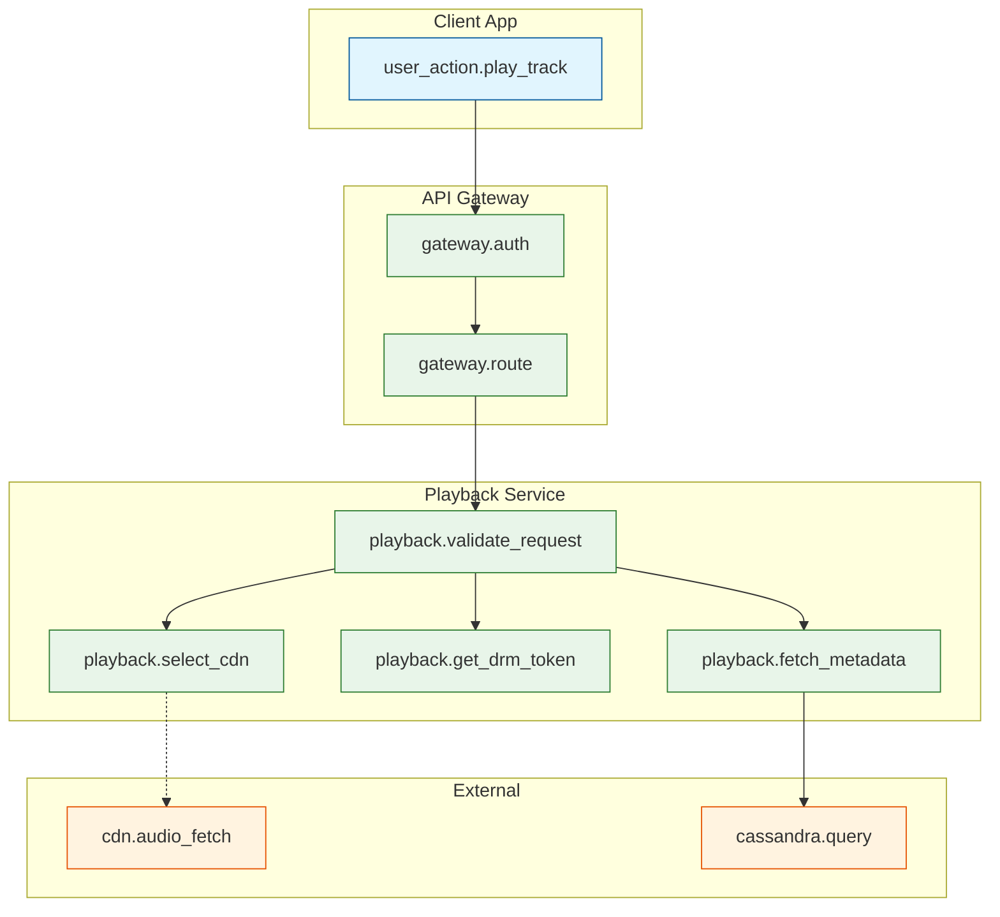
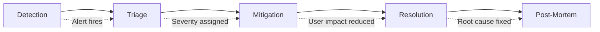

# Observability

## Overview

Spotify's observability stack enables real-time monitoring of 133K+ plays/second across 713M monthly active users. The system tracks business metrics (plays, skips), infrastructure health, and user experience quality.

---

## Metrics

### Key Business Metrics

| Metric | Description | Target | Alert Threshold |
|--------|-------------|--------|-----------------|
| `playback.success_rate` | Successful plays / attempted plays | > 99.9% | < 99.5% |
| `playback.start_latency_p50` | Time to first audio byte | < 265ms | > 500ms |
| `playback.start_latency_p95` | Time to first audio byte | < 500ms | > 1s |
| `playback.rebuffer_rate` | Rebuffer events / total plays | < 0.1% | > 0.5% |
| `search.latency_p95` | Search response time | < 200ms | > 500ms |
| `recommendation.ctr` | Click-through rate on recommendations | > 15% | < 10% |
| `offline.sync_success_rate` | Successful syncs / attempts | > 99% | < 95% |

### Infrastructure Metrics (USE Method)

| Resource | Utilization | Saturation | Errors |
|----------|-------------|------------|--------|
| **CPU** | `cpu_usage_percent` | `cpu_throttle_count` | - |
| **Memory** | `memory_usage_percent` | `memory_oom_kills` | - |
| **Disk** | `disk_usage_percent` | `disk_io_wait` | `disk_errors` |
| **Network** | `network_bytes_in/out` | `network_drops` | `network_errors` |
| **Cassandra** | `cassandra_load` | `cassandra_pending_tasks` | `cassandra_exceptions` |
| **Kafka** | `kafka_consumer_lag` | `kafka_queue_depth` | `kafka_errors` |

### Service Metrics (RED Method)

| Service | Rate | Errors | Duration |
|---------|------|--------|----------|
| **API Gateway** | `gateway_requests_per_sec` | `gateway_5xx_rate` | `gateway_latency_p95` |
| **Playback Service** | `playback_requests_per_sec` | `playback_errors_per_sec` | `playback_latency_p95` |
| **Playlist Service** | `playlist_requests_per_sec` | `playlist_errors_per_sec` | `playlist_latency_p95` |
| **Search Service** | `search_qps` | `search_errors_per_sec` | `search_latency_p95` |
| **CDN** | `cdn_requests_per_sec` | `cdn_4xx_5xx_rate` | `cdn_ttfb` |

### Metric Collection Architecture



---

## Logging

### Log Levels Strategy

| Level | Usage | Examples | Retention |
|-------|-------|----------|-----------|
| **ERROR** | Failures requiring attention | DRM key failure, DB connection lost | 90 days |
| **WARN** | Potential issues | High latency, retry succeeded | 30 days |
| **INFO** | Normal operations | Request completed, user action | 7 days |
| **DEBUG** | Development/troubleshooting | Query details, state transitions | 1 day (sampled) |

### Structured Logging Format

```json
{
  "timestamp": "2025-01-15T10:30:45.123Z",
  "level": "INFO",
  "service": "playback-service",
  "instance": "playback-service-7d4f8c6b9-abc12",
  "region": "us-central1",
  "trace_id": "a1b2c3d4e5f6",
  "span_id": "1234567890",
  "user_id": "user_uuid",
  "request_id": "req_uuid",
  "event": "playback_started",
  "attributes": {
    "track_id": "track_uuid",
    "quality": "320",
    "cdn": "akamai",
    "latency_ms": 245,
    "device_type": "smartphone"
  }
}
```

### Log Aggregation Pipeline



### Important Log Events

| Event | Level | Contains | Purpose |
|-------|-------|----------|---------|
| `playback_started` | INFO | track_id, quality, cdn, latency | Success tracking |
| `playback_error` | ERROR | track_id, error_code, error_message | Debugging |
| `playback_complete` | INFO | track_id, duration_played, skipped | Analytics |
| `offline_download` | INFO | track_id, device_id, size | Offline tracking |
| `offline_key_refresh` | INFO | device_id, tracks_refreshed | DRM health |
| `playlist_sync` | INFO | playlist_id, operation, conflicts | Sync monitoring |
| `auth_failure` | WARN | user_id, reason, ip_address | Security |
| `rate_limit_hit` | WARN | user_id, endpoint, limit | Abuse detection |

---

## Distributed Tracing

### Trace Propagation

```
TRACE CONTEXT (W3C Trace Context):

traceparent: 00-{trace_id}-{span_id}-{flags}
Example: 00-a1b2c3d4e5f6a1b2c3d4e5f6a1b2c3d4-1234567890abcdef-01

Propagation:
  HTTP: traceparent header
  gRPC: grpc-trace-bin metadata
  Kafka: trace_id in message headers
```

### Key Spans to Instrument



### Trace Sampling Strategy

| Traffic Type | Sample Rate | Reason |
|--------------|-------------|--------|
| Errors | 100% | Always trace failures |
| High latency (> p99) | 100% | Debug slow requests |
| Normal traffic | 1% | Statistical sample |
| New deployments | 10% | Increased visibility during rollout |
| Synthetic tests | 100% | Controlled monitoring |

---

## Alerting

### Alert Severity Levels

| Severity | Response Time | Examples | Notification |
|----------|---------------|----------|--------------|
| **P1 - Critical** | 5 minutes | Playback down, data breach | Page + incident call |
| **P2 - High** | 15 minutes | > 1% error rate, latency spike | Page |
| **P3 - Medium** | 1 hour | Non-critical service degraded | Slack alert |
| **P4 - Low** | Next business day | Minor issues, warnings | Ticket |

### Critical Alerts (Page-Worthy)

| Alert | Condition | Runbook |
|-------|-----------|---------|
| `PlaybackErrorRateHigh` | error_rate > 1% for 5 min | Check CDN, DRM service |
| `PlaybackLatencyHigh` | p95 > 1s for 5 min | Check CDN, origin |
| `DatabaseDown` | Cassandra unreachable | Failover, page DBA |
| `CDNFailure` | All CDNs returning errors | Check origins, failover |
| `DRMServiceDown` | DRM errors > 10% | Restart, escalate |
| `KafkaConsumerLag` | Lag > 1M messages | Scale consumers |

### Alert Configuration Example

```yaml
# Prometheus Alerting Rules
groups:
  - name: playback_alerts
    rules:
      - alert: PlaybackErrorRateHigh
        expr: |
          sum(rate(playback_errors_total[5m])) /
          sum(rate(playback_requests_total[5m])) > 0.01
        for: 5m
        labels:
          severity: critical
          team: playback
        annotations:
          summary: "Playback error rate above 1%"
          description: "Error rate is {{ $value | humanizePercentage }}"
          runbook_url: "https://runbooks.spotify.internal/playback-errors"

      - alert: PlaybackLatencyHigh
        expr: |
          histogram_quantile(0.95,
            sum(rate(playback_latency_seconds_bucket[5m])) by (le)
          ) > 1
        for: 5m
        labels:
          severity: critical
          team: playback
        annotations:
          summary: "Playback latency p95 above 1 second"
          description: "p95 latency is {{ $value | humanizeDuration }}"

      - alert: CDNCacheHitRateLow
        expr: |
          sum(rate(cdn_cache_hits_total[10m])) /
          sum(rate(cdn_requests_total[10m])) < 0.90
        for: 10m
        labels:
          severity: warning
          team: infrastructure
        annotations:
          summary: "CDN cache hit rate below 90%"
```

### On-Call Escalation

```
ESCALATION PATH:

T+0: Alert fires
  → Primary on-call paged

T+5min: No ACK
  → Secondary on-call paged

T+10min: No ACK
  → Team lead paged

T+15min: No ACK (P1 only)
  → Engineering manager paged

T+30min: No resolution (P1 only)
  → Incident commander engaged
  → Cross-functional war room
```

---

## Dashboards

### Executive Dashboard

```
┌─────────────────────────────────────────────────────────────────────────────┐
│                         SPOTIFY EXECUTIVE DASHBOARD                          │
├─────────────────────────────────────────────────────────────────────────────┤
│                                                                              │
│  ACTIVE USERS          PLAYS/SEC           ERROR RATE        LATENCY (p95)  │
│  ┌─────────┐          ┌─────────┐         ┌─────────┐       ┌─────────┐    │
│  │ 48.2M   │          │ 128.5K  │         │  0.02%  │       │  312ms  │    │
│  │ ▲ 2.1%  │          │ ▲ 5.3%  │         │ ▼ 0.01% │       │ ▼ 15ms  │    │
│  └─────────┘          └─────────┘         └─────────┘       └─────────┘    │
│                                                                              │
│  PLAYS OVER TIME (24h)                                                       │
│  ┌─────────────────────────────────────────────────────────────────────┐    │
│  │    ╭───╮                                           ╭───╮            │    │
│  │   ╱    ╲         ╭───╮                            ╱    ╲           │    │
│  │  ╱      ╲       ╱    ╲      ╭──╮                 ╱      ╲          │    │
│  │ ╱        ╲─────╱      ╲────╱  ╲───────────────╱        ╲         │    │
│  │──────────────────────────────────────────────────────────────────│    │
│  │ 00:00    06:00    12:00    18:00    00:00                        │    │
│  └─────────────────────────────────────────────────────────────────────┘    │
│                                                                              │
│  TOP ISSUES (Last Hour)                    CDN STATUS                        │
│  ┌──────────────────────────────┐         ┌─────────────────────────┐       │
│  │ 1. High latency in asia-east │         │ Akamai:    ● Healthy    │       │
│  │ 2. Search timeout spike      │         │ Fastly:    ● Healthy    │       │
│  │ 3. Playlist sync failures    │         │ GCP CDN:   ● Healthy    │       │
│  └──────────────────────────────┘         └─────────────────────────┘       │
│                                                                              │
└─────────────────────────────────────────────────────────────────────────────┘
```

### Service Health Dashboard

| Panel | Metrics | Purpose |
|-------|---------|---------|
| Service Map | Dependencies, health status | Topology overview |
| Request Rate | QPS by service | Load distribution |
| Error Rate | Errors by service, error type | Problem identification |
| Latency Heatmap | p50/p95/p99 by service | Performance trends |
| Saturation | CPU/Memory/Connections | Capacity planning |
| Dependencies | External service latency | Dependency health |

### Playback Performance Dashboard

| Panel | Query | Alert Threshold |
|-------|-------|-----------------|
| Plays/sec (real-time) | `sum(rate(playback_started[1m]))` | - |
| Start Latency p50/p95/p99 | `histogram_quantile(...)` | p95 > 500ms |
| Error Rate by Type | `sum by (error_type)(rate(playback_errors[5m]))` | > 0.1% |
| CDN Distribution | `sum by (cdn)(rate(cdn_requests[5m]))` | - |
| Cache Hit Rate | `cdn_hits / cdn_requests` | < 90% |
| Quality Distribution | `sum by (bitrate)(rate(playback_started[5m]))` | - |
| Geographic Latency | `avg by (region)(playback_latency_ms)` | - |

---

## SLO Management

### SLO Definitions

| SLI | SLO | Error Budget (30 days) |
|-----|-----|------------------------|
| Playback Availability | 99.99% | 4.3 minutes |
| Playback Start Latency (p95) | < 500ms | - |
| API Availability | 99.95% | 21.6 minutes |
| API Latency (p95) | < 100ms | - |
| Search Availability | 99.9% | 43.2 minutes |
| Offline Sync Success | 99% | - |

### Error Budget Tracking

```
ERROR BUDGET DASHBOARD:

┌─────────────────────────────────────────────────────────────────────────────┐
│                          ERROR BUDGET STATUS                                 │
├─────────────────────────────────────────────────────────────────────────────┤
│                                                                              │
│  Playback (99.99% SLO)                                                       │
│  ├─ Budget: 4.3 minutes                                                      │
│  ├─ Consumed: 1.2 minutes (28%)                                              │
│  ├─ Remaining: 3.1 minutes (72%)                                             │
│  └─ Status: ● HEALTHY                                                        │
│                                                                              │
│  [███████░░░░░░░░░░░░░░░░░░░░░░] 28% consumed                               │
│                                                                              │
│  API Gateway (99.95% SLO)                                                    │
│  ├─ Budget: 21.6 minutes                                                     │
│  ├─ Consumed: 18.5 minutes (86%)                                             │
│  ├─ Remaining: 3.1 minutes (14%)                                             │
│  └─ Status: ● WARNING - Consider freezing deploys                            │
│                                                                              │
│  [██████████████████████████░░░] 86% consumed                               │
│                                                                              │
└─────────────────────────────────────────────────────────────────────────────┘
```

### SLO-Based Alerting

```yaml
# Alert when error budget consumption rate is unsustainable
- alert: ErrorBudgetBurnRateHigh
  expr: |
    # Short window: 5% budget consumed in 1 hour
    (
      1 - (sum(rate(playback_success_total[1h])) /
           sum(rate(playback_requests_total[1h])))
    ) > 0.0001 * 24 * 30 * 0.05
  for: 5m
  labels:
    severity: warning
  annotations:
    summary: "Error budget burning too fast"
    description: "At current rate, will exhaust monthly budget in {{ $value }} hours"
```

---

## Incident Management

### Incident Lifecycle



### Post-Mortem Template

```markdown
## Incident Post-Mortem: [Title]

### Summary
- **Date**: 2025-01-15
- **Duration**: 45 minutes
- **Severity**: P1
- **Impact**: 5% of users experienced playback failures

### Timeline
- 10:00 - Alert fired: PlaybackErrorRateHigh
- 10:05 - On-call acknowledged
- 10:10 - Identified: CDN certificate expired
- 10:20 - Mitigation: Routed traffic to secondary CDN
- 10:45 - Resolution: Certificate renewed, traffic restored

### Root Cause
Certificate auto-renewal failed due to DNS validation timeout.

### Impact
- 2.5M failed play attempts
- ~500K users affected
- Error budget consumed: 30 minutes

### Action Items
| Action | Owner | Due |
|--------|-------|-----|
| Implement certificate monitoring | Platform | 2025-01-22 |
| Add redundant DNS validation | Platform | 2025-01-29 |
| Update runbook with cert renewal steps | On-call | 2025-01-17 |

### Lessons Learned
- Certificate expiry alerts were set for 7 days, should be 30 days
- Secondary CDN failover worked as expected
```

---

## Observability Tools Summary

| Category | Tool | Purpose |
|----------|------|---------|
| **Metrics** | Prometheus | Collection, short-term storage |
| **Metrics** | Cortex/Thanos | Long-term storage, global view |
| **Dashboards** | Grafana | Visualization |
| **Logging** | Fluentd | Collection |
| **Logging** | BigQuery | Analytics, long-term |
| **Logging** | Elasticsearch | Search, short-term |
| **Tracing** | Jaeger / Cloud Trace | Distributed tracing |
| **Alerting** | Alertmanager | Alert routing |
| **Incident** | PagerDuty | On-call management |
| **Status** | Statuspage | Public communication |
